# CSS 简介
**层叠样式表 Cascading Style Sheets** ，用于**设置网页的样式及布局**，包括页面中的文本内容（字体、大小、对齐方式等）、图片的外形（宽高、边框样式、边距）以及版面布局等外观显示样式

**CSS** 是一种**标记语言结构与表现相分离**

指在网页设计中，HTML标签只用于搭建网页的基本结构，不使用标签属性设置显示样式，所有的样式交由CSS来设置

## CSS 初始化

不同浏览器对有些标签的默认值是不同的，为了消除不同浏览器对HTML文本呈现的差异，照顾浏览器的兼容需要对CSS 初始化 ，重设浏览器的样式 (也称为CSS reset）

核心作用

1. 重置浏览器默认内外边距、间距、列表样式、字体等不一致样式
2. 统一盒模型、布局基准、文本渲染规则
3. 避免跨浏览器布局错乱、样式偏差
4. 为后续开发提供干净、统一的样式基础

常用方案通用 Reset

```css
* {
  margin: 0;
  padding: 0;
  box-sizing: border-box;
}
ul, ol {
  list-style: none;
}
a {
  text-decoration: none;
  color: inherit;
}
img {
  display: block;
  max-width: 100%;
}
```

## Unicode编码字体：

把中文字体的名称用相应的Unicode编码来代替，可以有效的避免浏览器解释CSS代码出现乱码

黑体 \9ED1\4F53  
宋体 \5B8B\4F53  
微软雅黑 \5FAE\8F6F\96C5\9ED1

## **语法规范**

CSS 规则由两个主要的部分构成：**选择器** 以及一条或多条**声明**

```css
<style>
  h2 {
    color: red;
    font-size: 5em;
    background-color: aquamarine;
  }
</style>

```

css语法由一个 **选择器（selector）**起头，选择用来添加样式的 HTML 元素

一对大括号 `{ }`内部定义一个或多个形式为`属性（property）: 值（value）`对的**声明**

每个声明都指定了我们所选择元素的一个属性，之后跟一个赋给这个属性的值

冒号之前是属性，冒号之后是值，不同的 CSS 属性对应不同的合法值

`css = 选择器 + 声明块(属性：属性值)`

> + 选择器严格区分大小写！声明不区分
> + 按书写习惯选择器，属性名，属性值关键字全部使用小写字母，特殊情况除外
> + 属性值前面，冒号后面，保留一个空格
> + 选择器（标签）和大括号中间保留空格

# 导入 CSS 样式表
## 外部样式表（推荐）
也称**外链式**，当样式需要被应用到很多页面的时候，写到独立CSS文件中，使用 **link** 元素调用

```html
<head>
    <link rel="stylesheet" type="text/css" href="mystyle.css">
</head>
```

link 标签必须指定三个属性

+ herf: 定义外部样式表的URL
+ type: 定义所链接文档的
+ rel: 定义当前文档与被连接文档之间的关系

优点：

+ 解决多页面样式重复调用
+ 有利于浏览器缓存，提升页面响应速度
+ 有利于代码分离，更容易阅读维护

## 内部样式表
单个文件需要特别样式时使用，CSS 放置在包含在 HTML`<head>` 元素中的`<style>`元素内

```html
<head>
  <style type="text/css">
    body {
      background-color: red
    }

    p {
      margin-left: 20px
    }
  </style>
</head>
```

对于有多个页面的网站来说，内部样式表是一种不太有效的工作方式

## 内联样式表
也称为**行内式**，当特殊的样式需要应用到**个别元素**时，在相关的标签中使用 `style` 样式属性

```html
<p style="color: red; margin-left: 20px">
  This is a paragraph
</p>
```

**尽可能避免以这种方式使用CSS**，这是对 CSS 的维护效率最低的实现

一个样式的改变可能需要在一个网页中进行多次编辑

其次内联 CSS 还将（CSS）表现性代码与 HTML 内容混合在一起，使一切都更难阅读和理解

配合 JavaScript 使用

## @import 导入
`@import "css路径"; CSS 2.1`

与外部样式表类似，主要**加载时间和顺序不同**

页面加载时， link 标签会与网页一起加载，而 `@import` 等待页面全部加载后才加载 CSS，当加载速度较慢会先显示没有css 修饰的网页，故**不推荐使用优先级 ：就近原则 内部 > 外部/内部（元素距离）** 

# 常见 CSS 用法

## CSS 变量

**定义变量   --变量名: 值;**  

- 全局变量：写在 `:root` 里（整个页面都能用）
- 变量名必须以 `--` 开头

```css
:root {
  --bg-color: #ffffff;    /* 背景色变量 */
  --text-color: #333333;  /* 文字色变量 */
}
```

**使用变量  var(--变量名)**  

用 `var(变量名)` 调用变量：

```css
body {
  background: var(--bg-color);
  color: var(--text-color);
}
```

- 全局统一主题色，一键切换地图主题

 **主题切换核心：用不同类 / 属性覆盖变量值**

- **默认亮色**：`:root` 定义了浅色背景和深色文字
- **暗色覆盖**：`[data-theme="dark"]` 是一个属性选择器，当 `<html>` 标签有 `data-theme="dark"` 时，会**覆盖**原来的 CSS 变量
- **JS 切换**：点击按钮时，JS 给根标签 `<html>` 添加 / 移除 `data-theme="dark"` 属性

```css
/* 1. 默认亮色主题 */
:root {
  --bg: #fff;
  --text: #222;
}

/* 2. 暗色主题 */
[data-theme="dark"] {
  --bg: #1a1a1a;
  --text: #f5f5f5;
}

/* 基础样式 */
* {
  margin: 0;
  padding: 0;
  box-sizing: border-box;
  transition: all 0.3s ease;
}

/* 应用主题变量 */
body {
  background: var(--bg);
  color: var(--text);
}
```

```javascript
function toggleTheme() {
  const html = document.documentElement;
  const current = html.getAttribute('data-theme');

  if (current === 'dark') {
    html.setAttribute('data-theme', 'light');
  } else {
    html.setAttribute('data-theme', 'dark');
  }
}
```

```html
<html data-theme="light">
```

## Dimension 尺寸 
“Dimension” 常见的意思为 “维度”“尺寸”“规模”“方面” 等

| **属性** | **描述** |
| :--- | :--- |
| `height` | 设置元素的高度 |
| `line-height` | 设置行高 |
| `max-height` | 设置元素的最大高度 |
| `max-width` | 设置元素的最大宽度 |
| `min-height` | 设置元素的最小高度 |
| `min-width` | 设置元素的最小宽度 |
| `width` | 设置元素的宽度 |

## color 颜色
alpha 通道表示透明值 、 预设命名颜色、三原色RGB、十六进制等

只要属性值为颜色，都可以使用上述四种颜色表示方式，例如：背景色

```css
/* 命名颜色 */
rebeccapurple
aliceblue

/* RGB 十六进制 */
#f09
#ff0099

/* RGB（红、绿、蓝） */
rgb(255 0 153)
/* 透明通道 0-1 */
rgba(红 绿 蓝 alpha)
background: rgba(0, 0, 0, .5);
```

## opacity 不透明度
`opacity：`用于定义标签的不透明度，参数opacityValue表示不透明度的值

**属性名：opacity**

属性值：0 – 1

+ 0：完全透明（元素不可见）
+ 1：不透明
+ 0-1之间小数：半透明
+ alpha通道：rgba(红 绿 蓝 alpha)，取值为0-1

## shadow 阴影
作用：给元素设置阴影效果

**属性名：box-shadow**

属性值：X 轴偏移量  Y 轴偏移量  模糊半径  扩散半径  颜色  内外阴影

+ X 轴偏移量 和 Y 轴偏移量 必须书写
+ 默认是外阴影，内阴影需要添加 inset

| 参数值 | 描述 |
| --- | --- |
| h-shadow | 表示水平阴影位置，可选负值（必选属性） |
| v-shadow | 表示垂直阴影位置，可选负值（必选属性） |
| blur | 阴影模糊半径（可选属性） |
| spread | 阴影拓展半径，不能为负值 （可选属性） |
| color | 阴影颜色（可选属性） |
| outside/inset | 默认为外阴影/内阴影 |

## display 显示

显示隐藏

+ 目的（本质）让一个元素在页面中消失或者显示出来
+ 场景类似网站广告，点击关闭就不见了，重新刷新页面重新出现

display 设置或检索对象是否及如何显示

```css
display: none 隐藏对象
display：block 除了转换为块级元素之外，同时还有显示元素的意思。
```

**特点： display 隐藏元素后，不再占有原来的位置**

**实际开发场景：**配合后面js做特效，比如下拉菜单，原先没有，鼠标经过，显示下拉菜单等
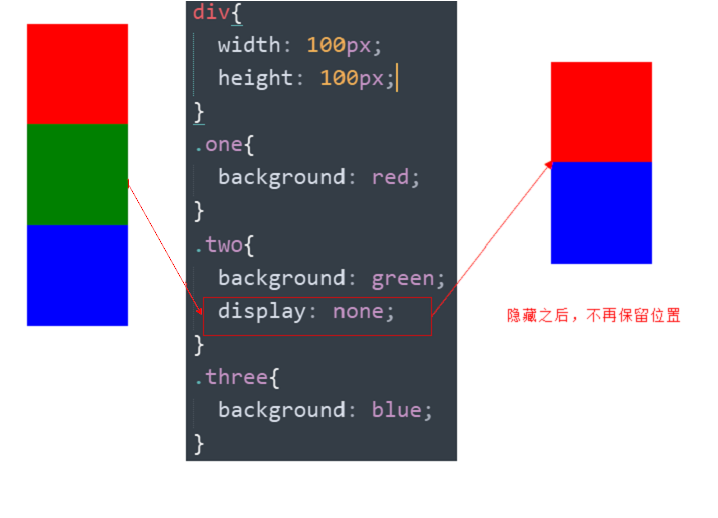

## visibility 可见
`visibility` 属性用于指定一个元素应可见还是隐藏

```css
visibility：visible; 　元素可视
visibility：hidden; 　 元素隐藏
```

**特点：visibility 隐藏元素后，继续占有原来的位置**

如果隐藏元素想要原来位置， 就用 visibility：hidden

**如果隐藏元素不想要原来位置， 就用 display：none  (用处更多 重点）**
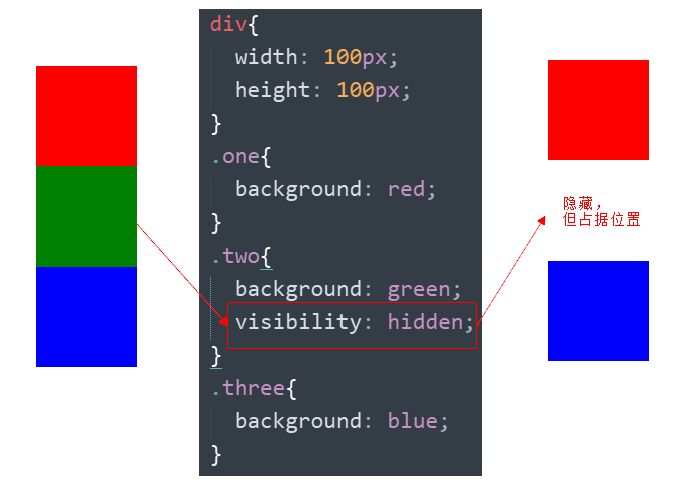

## overflow溢出
overflow 属性指定了如果内容溢出一个元素的框（超过其指定高度及宽度） 时会发生什么

| 属性值 | 描述 |
| --- | --- |
| **visible** | 不剪切内容也不添加滚动条 |
| **hidden** | 不显示超过对象尺寸的内容，超出的部分隐藏掉 |
| **scroll** | 不管超出内容否，总是显示滚动条 |
| **auto** | 超出自动显示滚动条，不超出不显示滚动条 |

+ 一般情况下都不想让溢出的内容显示出来，因为溢出的部分会影响布局
+ 如果有定位的盒子慎用 `overflow:hidden`  因为它会隐藏多余的部分

**实际开发场景：**

+ 清除浮动
+ 隐藏超出内容,  不允许内容超过父盒子

## **radius **圆角
作用：设置元素的外边框为圆角

**属性名：border-radius**

属性值：数字+px / 百分比 属性值是**圆角半径**

[圆角边框生成器](https://developer.mozilla.org/zh-CN/docs/Web/CSS/CSS_backgrounds_and_borders/Border-radius_generator) 此工具可用于生成 CSS `border-radius` 样式

+ 该属性是一个简写属性，可以跟四个值分别代表左上角、右上角、右下角、左下角
+ 分开写：border-top-left-radius、border-top-right-radius、border-bottom-right-radius 和border-bottom-left-radius
+ 兼容性 ie9+ 浏览器支持, 但是不会影响页面布局,可以放心使用

技巧：从左上角开始顺时针赋值，当前角没有数值则与对角取值相同

**正圆形状**：给正方形盒子设置圆角属性值为 **宽高的一半 / 50%**

```css
img {
  width: 200px;
  height: 200px;
  
  border-radius: 100px;
  border-radius: 50%;
}
```

**胶囊形状：**给长方形盒子设置圆角属性值为 **盒子高度的一半**

```css
div {
  width: 200px;
  height: 80px;
  background-color: orange;
  border-radius: 40px;
}
```

## border-image 图片边框
可以使用图片作为元素的边框，运用CSS3中的`border-image`属性

| 属性 | 说明 |
| --- | --- |
| border-image-source | 指定图片的路径 |
| border-image-slice | 指定边框图像顶部、右侧、底部、左侧偏移量 |
| border-image-width | 指定边框宽度 |
| border-image-outside | 指定边框背景向盒子外部延伸的距离 |
| border-image-repeat | 指定背景图片的平铺方式 |

## filter 滤镜 
`filter` CSS属性将模糊或颜色偏移等图形效果应用于元素

```css
filter:   
函数(); -->  
例如： filter: blur(5px); 
-->  blur模糊处理  数值越大越模糊
```


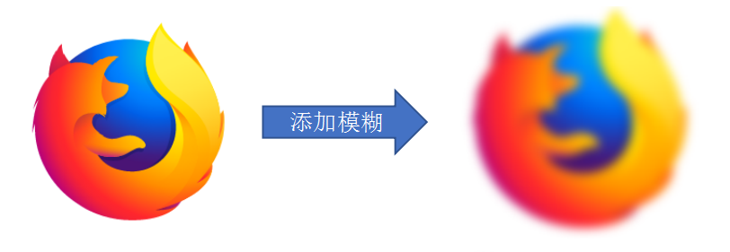

## calc 动态计算属性
`ca1c()`函数是 CSS 提供的一种功能强大的计算方法，用来动态地计算 CSS 属性值

允许在指定 CSS 属性值时使用加法、减法、乘法、除法等基本运算，从而实现更灵活的布局和样式设计

```css
property: calc(expression);
```

其中 `property `是要设置的 CSS 属性， `expression` 是一个数学表达式  
`calc()`支持四种基本运算:

+ 加法( + ):calc(100% + 20px);
+ 减法( - ):calc(100% - 50px);
+ 乘法( * ):calc(50px * 2);
+ 除法( / ):calc(100px / 2);

> 注意: calc()中的操作符(+、-、*、/)前后必须保留空格，否则会导致计算失败
>
> 例如，calc(100% - 20px)是正确的，而calc(100%-20px)是错误的

**常见使用场景:动态调整宽度**  

在响应式布局中，`calc() `可以灵活地处理固定值和百分比的组合，使元素在不同屏幕尺寸下保持合适的宽度

例如，创建一个宽度为 100% 减去左右内边距的元素：

```css
.container {
  width: calc(100% - 40px); /* 减去左右各 20px 的内边距 */
  padding: 20px;
}
```

**创建自适应的内边距和外边距**  

`calc()` 可以基于容器的宽度或高度动态计算内边距或外边距

例如，创建一个上下内边距为总宽度的 10% 加 20px 的元素：

```css
.box {
  padding: calc(10% + 20px);
}
```

**中心对齐元素**  

`calc()` 也可以用于在父容器中精确地定位子元素

例如，将一个宽度为 300px 的元素水平居中：

```css
.centered {
  position: absolute;
  left: calc(50% - 150px); /* 减去元素宽度的一半 */
}
```

**网格布局中的列间距**  

在网格布局中，可以使用 `calc() `动态计算列宽，特别是当列宽是基于网格容器宽度减去间距时：

```css
.grid-item {
  width: calc((100% / 3) - 20px); /* 三列布局，每列之间有 20px 的间距 */
}
```

**自适应字体大小**  

在响应式设计中，可以通过 `calc()` 来调整字体大小，使其根据屏幕大小动态变化：

```css
.responsive-text {
  font-size: calc(16px + 1vw); /* 基于视口宽度增加字体大小 */
}
```

## cursor 鼠标样式

```css
 li {
     cursor: pointer; 
 }
```

设置或检索在对象上移动的鼠标指针采用何种系统预定义的光标形状

| 属性值      | 描述           |
| ----------- | -------------- |
| default     | 默认，箭头样式 |
| pointer     | 小手，提示点击 |
| move        | 十字，退市移动 |
| text        | 工字，选择文字 |
| not-allowed | 禁止           |

## outline 轮廓线 

给表单添加 outline: 0;   或者  outline: none; 样式之后，就可以去掉默认的蓝色边框

```css
 input {
     outline: none; 
 }
```

## resize 防止拖拽文本域 

 实际开发中文本域右下角是不可以拖拽的

```css
 textarea{ 
     resize: none;
 }
```

## Scoped CSS 样式穿透

Vue/React 的 `scoped` 样式会在选择器后添加唯一属性（如 `data-v-哈希值`），确保样式仅作用于当前组件

但第三方库没有这个属性，导致穿透失效

穿透语法

```css
/* Vue + Less/Sass/SCSS：使用 /deep/ 或 ::v-deep */
<style scoped lang="scss">
.map-container /deep/ .leaflet-control-zoom {
  width: 40px !important;
}

/* 或使用 ::v-deep（兼容所有预处理器） */
.map-container ::v-deep .leaflet-popup-content {
  padding: 10px;
}
</style>

/* Vue + Stylus：使用 >>> */
<style scoped lang="stylus">
.map-container >>> .leaflet-tile {
  filter: brightness(0.9);
}
</style>
```

穿透最佳实践

1. 穿透仅在 `scoped` 样式中使用
2. 尽量缩小穿透范围（通过父容器定位）
3. 必要时配合 `!important` 确保覆盖


## 实用属性

| **属性**         | **用途**                                              |
| ---------------- | ----------------------------------------------------- |
| `calc()`         | 混合单位计算：`width: calc(100% - 200px)`             |
| `var()`          | CSS 变量：`--primary: #1890ff; color: var(--primary)` |
| `pointer-events` | 事件穿透：`pointer-events: none`（点击穿透）          |
| `will-change`    | 性能优化：`will-change: transform`                    |
| `contain`        | 渲染隔离：`contain: strict`（容器使用）               |

**will-change: transform**

提前告知浏览器**元素即将发生 transform 变换**，让浏览器预先做渲染优化

避免动画 / 变换时临时计算造成卡顿，仅用于预期会变动的元素

**contain: strict**

对容器开启**严格渲染隔离**，限制元素的布局、样式、绘制范围不向外扩散

浏览器只需渲染容器内部区域，减少全局渲染开销，提升页面性能


# 背景

**img元素属于html概念，背景图属于CSS概念**

> 当图片属于**网页内容**时，必须使用**img元素**，表示网页元素结构内容
>
> 当图片仅用于**网页美化**时，必须使用**背景图**，没有任何语义

| 描述 | 属性 |
| --- | --- |
| 背景色 | background-color |
| 背景图 | background-image |
| 背景图平铺方式 | background-repeat |
| 背景图位置 | background-position |
| 背景图缩放 | background-size |
| 背景图固定 | background-attachment |
| 背景复合属性 | background |

## 背景颜色
`background-color` 定义元素的背景颜色

元素背景颜色默认值是 `transparent`（透明），会显示父元素颜色

## 背景图片
`background-image ` 定义元素的背景图片

+ none 无背景
+ URL：使用路径

实际开发常见于 logo 或者一些装饰性的小图片或者是超大的背景图片, 优点是非常便于控制位置

注意：背景图片后面的地址，千万不要忘记加 URL， 同时里面的路径**不要加引号**

```css
div {
  width: 400px;
  height: 400px;
  background-image: url(./images/1.png);
}
```

提示：背景图默认有**平铺（复制）效果**

## 多背景图片
应用**多个背景**到元素，这些图层彼此叠加，第一个提供的背景位于最上层，最后一个提供的背景位于最下层

只有最后一个背景可以包含背景颜色

```css
background-image: url(firefox.png), url(bubbles.png);
background-repeat: no-repeat, no-repeat;
background-position:left,right;
```

## 背景平铺
`background-repeat`**： 背景图重复**

背景图片默认情况下会在横坐标和纵坐标中进行重复

+ `no-repeat`：不重复
+ `repeat-x`：只在x方向重复
+ `repeat-y`：只在y方向重复

```css
div {
  width: 400px;
  height: 400px;
  background-color: pink;
  background-image: url(./images/1.png);
  background-repeat: no-repeat;
}
```

## 背景图片位置
`background-position`**：背景图位置**

+ center：横向纵向居中
+ top：靠上
+ center left：上下居中，靠左边
+ 数值或百分比：相对位置

关键字取值方式写法，可以颠倒取值顺序

可以只写一个关键字，另一个方向默认为居中；数字只写一个值表示水平方向，垂直方向为居中

## 背景图片大小
在CSS3中，新增了`background-size`属性用于控制背景图像的大小

如果只设置一个值，另一个值默认为`auto`

```css
background-size:属性值1 属性值2;
```

| 属性值 | 说明 |
| --- | --- |
| 像素值 | 宽高，第一个值为宽，第二个为高 |
| 百分比 | 以父元素百分比设置宽高 |
| cover | 使背景图完全覆盖区域，但部分会被裁切 |
| contain | 填充适应宽高，图片会被拉伸 |

```css
div {
  width: 500px;
  height: 400px;
  background-color: pink;
  background-image: url(./images/1.png);
  background-repeat: no-repeat;
  
  background-size: cover;
  background-size: contain;
}
```

工作中，**图片比例与盒子比例相同**，使用 cover 或 contain 缩放背景图效果相同 

## 背景图像修剪
运用CSS3中的`background-origin`属性可以自行定义背景图像的相对位置

在上面的语法格式中，`background-origin`属性有三种取值，分别表示不同的含义，具体解释如下

```css
background-origin:属性值;
background-clip:属性值;
```

**图像的显示区域**

padding-box：背景图像相对于内边距区域来定位

border-box：背景图像相对于边框来定位

content-box：背景图像相对于内容框来定位

**图像的裁剪区域**

border-box：默认值，从边框区域向外裁剪背景

padding-box：从内边距区域向外裁剪背景

content-box：从内容区域向外裁剪背景

## 背景图片固定
`background-attachment`（bga）

背景图像是否固定或者随着页面的其余部分滚动

+ fixed：类似于固定定位
+ scroll：背景图像随内容滚蛋 （默认值）

background-attachment 后期可以制作视差滚动的效果

```css
body {
  background-image: url(./images/bg.jpg);
  background-repeat: no-repeat;
  background-attachment: fixed;
}
```

## 背景色半透明
`background: rgba(0, 0, 0, 0.3)`

CSS3 提供了背景颜色半透明的效果

+ 最后一个参数是 alpha 透明度，取值范围在 0~1之间
+ 习惯把 0.3 的 0 省略掉，写为 background: rgba(0, 0, 0, .3);

**注意**：

+ 背景半透明是指盒子背景半透明，盒子里面的内容不受影响
+ CSS3 新增属性，是 IE9+ 版本浏览器才支持的

## 背景样式合写
属性名：**background**（bg）

属性值：背景色 背景图 背景图平铺方式 背景图位置/背景图缩放  背景图固定

（**空格隔开各个属性值，不区分顺序**）

```css
div {
  width: 400px;
  height: 400px;
  background: pink url(./images/1.png) no-repeat right center/cover;
}
```

# 文本样式属性
| 属性名 | 说明 |
| :--- | :--- |
| `font-family` | 用于设置文本的字体 |
| `font-size` | 用于设置文本的字号大小 |
| `color` | 用于设置文本的颜色 |
| `font-weight` | 用于设置文本的粗细，可以是 normal、bold 等 |
| `line-height` | 用于设置文本的行高 |
| `text-align` | 用于设置文本的对齐方式，可以是 left、right、center 等 |
| `text-indent` | 文本缩进 |
| `text-decoration` | 用于添加文本装饰效果，如下划线、删除线 |
| `background-color` | 设置或检索对象的背景颜色。 |
| `height` | 设置元素的高度 |
| `width` | 设置元素的宽度 |

## 文字简介
在文字制作过程中会有几根**参考线**，不同文字类型参考线不一样，同一种文字类型一致

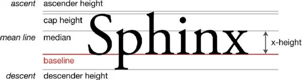

### font-size 字体大小
+ **属性名：font-size**
+ 属性值：文字尺寸，PC 端网页最常用的单位 **px**

```css
p {
  font-size: 30px;
}
```

字体大小设置的是文字的相对大小

文字的相对大小：1000、2048、1024

文字顶线到底线的距离，是文字的实际大小（content-area）

行盒的背景，覆盖content-area

谷歌浏览器默认字号是16px

### line-height 行高
作用：设置多行文本的间距

**属性名：line-height**

属性值

+ 数字 + px
+ 数字（当前标签font-size属性值的倍数）


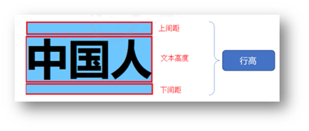

顶线向上延伸的空间，和底线向下延伸的空间，两个空间相等

该空间叫做 gap，默认是字体设计者决定的

从top到Bottom的区域（virtual-area）可调节行高就是此区域

line-height ：normal 默认值，使用文字默认的gap

```css
line-height: 30px;
/* 当前标签字体大小为16px */
line-height: 2;
```

**单行文字垂直居中**

垂直居中技巧：**行高属性值等于盒子高度属性值**

注意：该技巧适用于单行文字垂直居中效果

```css
div {
  height: 100px;
  background-color: skyblue;

  /* 注意：只能是单行文字垂直居中 */
  line-height: 100px;
}
```

### virtual-align 对齐
**行盒**：行内元素（如`span`、`a`）或文本会生成行盒（inline-box），是组成文本行的基本单位

**行框（line-box）**：**一行内所有行盒**组合形成的区域，其高度由**行内元素的最高顶边和最低底边**决定

每行文本对应一个 line-box，多个 line-box 堆叠形成块级元素的内容区域

一个元素如果子元素出现行盒，该元素内部也会产生参考线

**基线：**是文本行的基准线，由`font-size`、`font-family`决定（不同字体的基线位置可能不同）

`line-height`影响行高，进而影响基线之间的垂直距离

**virtual-area**  

每个行盒有自己的虚拟区域，用于对齐计算

其高度由`font-size`和`line-height`决定，垂直方向的边界（顶 / 底边）是对齐的参考对象

**基线相关对齐**

+ baseline 该元素基线与父元素基线对齐
+ super ：该元素的基线与父元素上基线对齐
+ sub：与下基线对齐

**文本边界对齐**

+ text-top：该元素的 virtual-area 顶边对齐父元素的 text-top
+ text-bottom：该元素的 virtual-area 顶边对齐父元素的 text-bottom

**行框边界对齐**

+ top: 该元素的 virtual-area 顶边对齐 line-box 的顶边
+ 例：让图标顶部与行内最高元素对齐
+ bottom：该元素的 virtual-area 顶边对齐 line-box 的底边 
+ 例：让按钮底部与文本行底部对齐

**中线对齐**

+ middle：该元素的中线对齐父元素的X字母高度一半的位置对齐

**元素高度的自动计算**  

当元素`height`为`auto`时，其高度由内部所有 line-box 的总高度决定（加上内边距、边框等）

数值：相对于基线偏移量，上正下负

百分比：相对于基线偏移量，低昂对于自身的 virtual-area 高度

### 可替换元素和行块盒
可替换元素是指内容不由 CSS 控制，而是由外部资源（如图片、视频、表单控件等）决定的元素

这类元素通常有**固有尺寸**（宽高由资源本身决定），并且其渲染结果独立于文档的渲染流程

**常见可替换元素**

``、`<video>`、`<audio>`、`<iframe>`、`<canvas>`

表单元素（如`<input>`、`<select>`、`<textarea>`）等

**特性**：

+ 内容由外部资源控制，CSS 只能调整其位置、尺寸等，无法直接修改内容
+ 元素默认有自己的宽高（如图片的原始像素尺寸）

**图片：基线位置位于图片的下外边距表单元素：基线位置在内容底边行块盒：**

+ 行块盒最后一行有line-box ，用最后一行的基线作为整个行块盒的基线
+ 行快盒内部无行盒，则使用下外边距作为基线

## font 文字样式
**font  速写属性**

` 选择器 { font: font-style font-weight font-size line-height font-family;}`

### font-size 尺寸
文字尺寸大小,设置的是文字的相对大小,文字顶线到底线的距离，是文字的实际大小（content-area）

行盒的背景，覆盖content-area

**px 像素大小** 

px 值是静态的。这是一种跨操作系统和跨浏览器的方式，可以确切地告诉浏览器以你指定的像素高度呈现字母。因为可能使用不同的算法来实现类似的效果，结果可能在不同浏览器间略有差异。

**em 相对单位**

相对于父元素大小，父元素未设置，基准大小16px

例如，假设页面的 `<body>` 的 `font-size` 设置为 `16px`，如果想要的字体大小为 `12px`，那么应该指定 `0.75em`（12/16 = 0.75）；em 值是复合的

**rem**

`rem` 值的发明是为了避免复合问题。`rem` 值是相对于根 `html` 元素而不是父元素的。换句话说，它允许你以相对方式指定字体大小，而不受到父元素大小的影响，从而消除了复合问题

### font-weight 粗细
指定了字体的粗细程度。一些字体只提供 `normal` 和 `bold` 两种值

**normal**正常粗细；与 `400` 等值

**bolder** 加粗；与 `700` 等值

### font-family 字体
属性名：**font-family**

属性值：字体名

font-family属性值可以书写多个字体名用逗号隔开，执行顺序是**从左向右依次查找**

+ font-family 属性最后设置一个字体族名，网页开发建议使用无衬线字体
+ font-family: sans-serif, ”宋体”，”黑体“;

需要用户电脑安装对应字体，需使用多个字体匹配不同情况

sans-serif 非衬线字体

```css
font-family: Microsoft YaHei, Heiti SC, tahoma, arial, Hiragino Sans GB, "\5B8B\4F53", sans-serif;
```

注意：

+ 各个字体间需要添加英文状态逗号隔开
+ 中文字体需要添加英文状态下引号，英文字体一般不需要加，英文字体一般排在中文前
+ 字体名包括空格、# $等特殊字符，必须添加引号

### font-style 样式
字体样式，设置斜体

**normal**

选择 font-family的常规字体

**italic**

选择斜体，如果当前字体没有可用的斜体版本，会选用倾斜体（`oblique` ）替代

**oblique**

选择倾斜体，如果当前字体没有可用的倾斜体版本，会选用斜体（`italic` ）替代

strong元素 默认粗体强调

i 元素，默认倾斜特殊

### @font-face 制作字体
解决用户本地电脑没有安装相应字体

当用户没有安装相应字体时，强制让用户下载该字体

@font-face 指令制作新字体

css3 新增规则，定义服务器字体

```css
<style>
@font-face {
    font-family: "我的字体名称";
    src: url(字体路径);
}
 </style>
p{
    font-family: "我的字体名称","微软雅黑","sans-serif";
}
```

### font 复合属性
复合属性：属性的**简写**方式，一个属性对应多个值的写法，各个属性值之间用空格隔开

font: 是否倾斜 是否加粗 字号/行高 字体（必须按顺序书写）

注意：**字号和字体值必须书写**，否则 font 属性不生效

```css
div {
  font: italic 700 30px/2 楷体;
}
```

## color 文字颜色
元素内部文字颜色,可以包括alpha通道表示透明值

预定义的颜色值，如red，green，blue等

十六进制，如#FF0000，#FF6600，#29D794等，十六进制是最常用的定义颜色的方式

RGB代码，如红色可以表示为rgb(255,0,0)或rgb(100%,0%,0%)

```css
/* 命名颜色 */
rebeccapurple
aliceblue

/* RGB 十六进制 */
#f09
#ff0099

/* RGB（红、绿、蓝） */
rgb(255 0 153)
/* 透明通道 0-1 */
rgba(红 绿 蓝 alpha)
background: rgba(0, 0, 0, .5);
```

## text-decoration 装饰线
设置文本上的装饰性线条的外观，用于设置文本的下划线，上划线，删除线等装饰效果

`text-decoration-line`

设置使用的装饰类型，例如 `underline` 或 `line-through`

`text-decoration-color`

设置装饰的颜色

`text-decoration-style`

设置装饰的线条的样式，例如 `solid`、`wavy` 或 `dashed`

`text-decoration-thickness`

设置装饰的线条粗细

## text-indent 首行缩进
“indent” 常见词性为动词，基本意思是 “缩进；使缩进排版；将…… 缩排” 

比如在文档排版中，把段落的第一行缩进几格，就可以用这个词来描述这一操作

**text-indent** CSS 属性设置区块元素中**文本行前面空格（缩进）的长度**，其属性值可为不同单位的数值、em字符宽度的倍数、或相对于浏览器窗口宽度的百分比%，允许使用负值, 建议使用em作为设置单位

**属性名：text-indent**

属性值：

+ 数字 + px
+ **数字 + em**（推荐：**1em = 当前标签的字号大小**）

```css
p {
  text-indent: 2em;
}
```

`length`

缩进以绝对length值指定，允许使用负值

`percentage`

缩进是包含区块宽度的 percentage

`each-line`

缩进会影响区块容器的第一行以及_强制换行_后的每一行，但不影响_软换行_后的行

`hanging`

反转缩进行，_除_第一行外，所有行都将缩进

## text-align 对齐方式
text-align CSS 属性设置 **块元素** 或者单元格框的 **行内内容** 的水平对齐

text-align 属性指定为下面列表中的单个关键字

+ start：如果内容方向是左至右，则等于 `left`，反之则为 `right`
+ end：如果内容方向是左至右，则等于 `right`，反之则为 `left`
+ left：行内内容向左侧边对齐
+ right：行内内容向右侧边对齐
+ center：行内内容居中
+ justify：文字向两侧对齐，将内容隔开，使其左右边缘与行框的左右边缘对齐，对最后一行无效
+ justify-all：和 `justify` 一致，但是强制使最后一行两端对齐
+ match-parent和 `inherit` 类似，区别在于 `start` 和 `end` 的值根据父元素的 `direction` 确定，并被替换为恰当的 `left` 或 `right` 值

“justify” 常见含义为 “证明…… 有理；为…… 辩护；调整…… 的间距使齐行” 

text-align本质是**控制内容的对齐方式**，属性要设置给内容的父级

+ text-align 仅适用于块级元素，对行内元素无效
+ 若需要设置图片水平对齐，可以给图片添加父元素，栗如 P 进行设置

```css
<style>
  div {
    text-align: center;
  }
</style>
<div>
  
</div>

```

## text-transform 大小写
用于控制英文字符的大小写，其可用属性值如下：

+ none：不转换（默认值）
+ capitalize：首字母大写
+ uppercase：全部字符转换为大写
+ lowercase：全部字符转换为小写

## text-overflow 溢出
用于处理溢出的文本

+ clip：修剪溢出文本，不显示省略标签“…”
+ ellipsis：用省略标签“…”替代被修剪文本，省略标签插入的位置是最后一个字符

## line-height 行高
**用于设置多行元素的空间量，如多行文本的间距**

对于块级元素，它指定元素行盒（line boxes）的最小高度

对于非[替代](https://developer.mozilla.org/zh-CN/docs/Web/CSS/Replaced_element)的 inline 元素，它用于计算行盒（line box）的高度

设置文本在容器中居中,将容器高度与此属性值一致

**normal**

桌面浏览器（包括 Firefox）使用默认值，约为 **1.2**，这取决于元素的 `font-family`

**number（无单位）**

该属性的应用值是这个无单位数字乘以该元素的字体大小

**先继承元素大小，再计算**  40px *2 =80 px

计算值与指定的 `<number>` 值相同。大多数情况下，这是设置 `line-height` 的**推荐方法**，不会在继承时产生不确定的结果

**length**

指定用于计算行向盒高度的长度值。以 **em** 为单位的值可能会产生不确定的结果,行高为字体大小的多少倍，先计算像素值，再继承

**percentage**

与元素自身的字体大小有关。计算值是给定的百分比值乘以元素计算出的字体大小。值可能会带来不确定的结果

## letter-spacing 字间距
`CSS` 的 `letter-spacing` 属性用于设置文本字符的间距表现。在渲染文本时添加到字符之间的自然间距中。`letter-spacing` 的正值会导致字符分布得更远，而 `letter-spacing` 的负值会使字符更接近

`word-spacing`属性用于定义英文单词之间的间距，对中文字符无效。和`letter-spacing`一样，其属性值可为不同单位的数值，允许使用负值，默认为normal

## white-space 空白符
**normal：**常规（默认值），文本中的空格、空行无效，满行后自动换行

**pre：**预格式化，按文档的书写格式保留空格、空行原样显示

**nowrap：**空格空行无效，强制文本不能换行，除非遇到换行标签<br /，内容超出元素的边界也不换行，若超出浏览器页面则会自动增加滚动条

## word-wrap 自动换行
用于实现长单词和URL地址的自动换行

**normal：**只在允许的断字点换行（浏览器保持默认处理）

**break-word：**在长单词或 URL 地址内部进行换

## direction 文字方向
direction 设置开始到结束的方向

	rtl : right to left
	
	ltt : left to right

## writing-mode 书写方向
writing-mode 设置文字书写方向

vertical-rl :数值从右往左

# 列表样式
## list-style-type
控制列表项目符号的类型

| 属性值 | 描述 | 属性值 | 描述 |
| :--- | :--- | :---: | :---: |
| disc | 实心圆（无序列表） | none | 不使用项目符号 |
| circle | 空心圆（无序列表） | cjk-ideographic | 简单的表意数字 |
| square | 实心方块（无序列表） | decimal-leading-zero | 0开头阿拉伯数字 |
| decimal | 阿拉伯数字 | upper-roman// | 大写罗马、、 |
| lower-roman/alpha/latin | 小写罗马/英文/拉丁字母 |  |  |

## list-style-image
常规项目符号无法满足需求，设置其属性为URL

```css
ul {
    list-style-image: url();
}
```

实际开发不建议，通常设置 li 背景图像实现

## list-style-position
**inside ：**列表项目符号位于列表文本内

**outside：**列表项目符号位于列表文本外（默认值）

## list-style
list-style：列表项目符号 列表项目符号的位置 列表项目图像

通常按以上语法进行顺序书写，不需要的样式可以省略，中间以空格隔开

## 背景图像定义符号
由于列表样式对图像控制能力不强，实际开发中通常为列表标签设置背景图像的方式实现列表项目图像

# 表格样式
## 合并边框
`border-collapse`属性的属性值除了`collapse`（合并）之外，还可以为`separate`（分离）

## 单元格边距
设置单元格内容与边框之间的距离，可以对`<td>`标签应用内边距样式属性padding，或对`<table>`标签应用HTML标签属性cellpadding

```css
th,td{
  border:1px solid #30F;     /*为单元格单独设置边框*/
  padding:20px;              /*为单元格内容与边框设置20px的内边距*/
  margin:20px;     /*为单元格与单元格边框之间设置20px的外边距*/
  border-collapse：collapse  /*合并单元格边框*/
 }  
```

+ 行标签`<tr>`无内边距属性padding和外边距属性margin
+ 外边距属性margin对单元格无效，要想设置相邻单元格边框之间的距离，只能对`<table>`标签应用HTML标签属性cellspacing

## 单元格宽高
	对单元格标签`<td>`应用width和height属性，可以控制单元格宽度和高度

```css
td{
    width:20px;
    Height:20px;
}
```

+ 对同一行中的单元格定义不同的高度，或对同一列中的单元格定义不同的宽度时，最终的宽度或高度将取其中的较大者

**隔行变色效果**

```css
/* 选择奇数行 */
tbody tr:nth-child(odd) {
    background-color: #eee;
}
/* 选择偶数行 */
tbody tr:nth-child(even) {
    background-color: #fff;
}
```

**荧光棒效果**

```css
/* 鼠标移入行效果 */
tbody tr:hover {
    background-color: #ccc;
}
```

**选中首列效果**

```css
tbody td:first-child {
    background-color: #008c8c;
}
```

# 表单样式
## 基础表单容器样式
表单容器（`form`）通常用于控制整体布局和间距，常见设置

```css
form {
  max-width: 600px; /* 限制宽度，避免过宽 */
  margin: 2rem auto; /* 居中 */
  padding: 2rem;
  background: #f9f9f9;
  border-radius: 8px;
  box-shadow: 0 2px 4px rgba(0,0,0,0.1); /* 轻微阴影增强层次感 */
}
```

## 标签 label
与输入框关联，提升可访问性和交互体验：

```css
label {
  display: block; /* 独占一行，与输入框上下排列 */
  margin-bottom: 0.5rem;
  font-weight: 500;
  color: #333;
  cursor: pointer; /* 鼠标悬停时显示指针，提示可点击 */
}

/* 与输入框水平排列（可选） */
.inline-label {
  display: inline-block;
  margin-right: 1rem;
}
```

## 输入框 input
覆盖文本、密码、数字等类型，通用样式：

```css
input[type="text"],
input[type="password"],
input[type="email"],
input[type="number"] {
  width: 100%; /* 占满容器宽度 */
  padding: 0.8rem;
  border: 1px solid #ddd;
  border-radius: 4px;
  font-size: 1rem;
  box-sizing: border-box; /* 避免padding导致宽度溢出 */
  transition: border-color 0.2s; /* 边框颜色过渡动画 */
}

/* 自定义复选框（默认样式较丑） */
input[type="checkbox"] {
  appearance: none; /* 隐藏默认样式 */
  width: 18px;
  height: 18px;
  border: 1px solid #ddd;
  border-radius: 3px;
  vertical-align: middle; /* 与文字对齐 */
  position: relative;
  cursor: pointer;
}
/* 选中状态 */
input[type="checkbox"]:checked::after {
  content: "✓";
  position: absolute;
  color: #333;
  font-size: 14px;
  top: -2px;
  left: 2px;
}

/* 自定义单选框 */
input[type="radio"] {
  appearance: none;
  width: 18px;
  height: 18px;
  border: 1px solid #ddd;
  border-radius: 50%;
  vertical-align: middle;
  position: relative;
  cursor: pointer;
}
input[type="radio"]:checked::after {
  content: "";
  position: absolute;
  width: 10px;
  height: 10px;
  border-radius: 50%;
  background: #333;
  top: 4px;
  left: 4px;
}
```

## 文本域 textarea
用于多行输入，需控制拉伸行为：

```css
textarea {
  width: 100%;
  padding: 0.8rem;
  border: 1px solid #ddd;
  border-radius: 4px;
  font-size: 1rem;
  min-height: 100px; /* 最小高度 */
  resize: vertical; /* 仅允许垂直拉伸（避免横向拉伸破坏布局） */
  box-sizing: border-box;
}
```

## 下拉选择器 select 
默认样式跨浏览器差异大，需统一：

```css
select {
  width: 100%;
  padding: 0.8rem;
  border: 1px solid #ddd;
  border-radius: 4px;
  font-size: 1rem;
  background: #fff;
  appearance: none; /* 隐藏默认箭头 */
  box-sizing: border-box;
  /* 自定义箭头（用背景图或伪元素） */
  background-image: url("data:image/svg+xml,%3Csvg xmlns='http://www.w3.org/2000/svg' width='16' height='16' viewBox='0 0 24 24' fill='none' stroke='%23333' stroke-width='2'%3E%3Cpath d='M6 9l6 6 6-6'/%3E%3C/svg%3E");
  background-repeat: no-repeat;
  background-position: right 0.8rem center;
  background-size: 16px;
}
```

## 文件上传 input type="file" 
默认样式丑陋，通常隐藏原生控件，用标签模拟：

```css
input[type="file"] {
  display: none; /* 隐藏原生控件 */
}
/* 用label模拟按钮 */
.file-label {
  display: inline-block;
  padding: 0.8rem 1.2rem;
  background: #007bff;
  color: white;
  border-radius: 4px;
  cursor: pointer;
}
```

## 按钮 button 
包含提交、重置等，需突出交互状态：

```css
button,
input[type="submit"],
input[type="reset"] {
  padding: 0.8rem 1.5rem;
  border: none;
  border-radius: 4px;
  font-size: 1rem;
  cursor: pointer;
  transition: all 0.2s; /* 悬停/点击动画 */
}

/* 主按钮 */
.btn-primary {
  background: #007bff;
  color: white;
}
.btn-primary:hover {
  background: #0056b3; /* 深色反馈 */
}
.btn-primary:active {
  transform: scale(0.98); /* 点击缩小效果 */
}

/* 次要按钮 */
.btn-secondary {
  background: #6c757d;
  color: white;
}
```

## 状态样式（伪类）
通过伪类控制交互状态，提升体验：

**聚焦状态（**`:focus`**）**：突出当前激活元素

```css
input:focus,
textarea:focus,
select:focus,
button:focus {
  outline: none; /* 移除默认轮廓 */
  border-color: #007bff; /* 蓝色边框提示聚焦 */
  box-shadow: 0 0 0 3px rgba(0, 123, 255, 0.25); /* 发光效果 */
}
```

**禁用状态（**`:disabled`**）**：提示不可交互

```css
input:disabled,
button:disabled {
  opacity: 0.6; /* 半透明 */
  cursor: not-allowed; /* 禁止指针 */
  background: #eee;
}
```

**表单验证（`:valid`/`:invalid`/`:required`）**

```css
/* 必填项提示 */
input:required {
  border-left: 3px solid #ffc107; /* 黄色左边界 */
}

/* 验证通过 */
input:valid {
  border-color: #28a745; /* 绿色边框 */
}

/* 验证失败 */
input:invalid {
  border-color: #dc3545; /* 红色边框 */
}
```

**占位符（`::placeholder`）**：自定义提示文本样式

```css
input::placeholder,
textarea::placeholder {
  color: #999;
  font-style: italic; /* 斜体区分 */
}
```

## 布局技巧
**水平布局**：用 `display: flex` 排列 label 和输入框

```css
.form-row {
  display: flex;
  align-items: center;
  gap: 1rem; /* 间距 */
  margin-bottom: 1rem;
}
.form-row label {
  flex: 0 0 120px; /* 固定label宽度 */
}
.form-row input {
  flex: 1; /* 输入框占剩余宽度 */
}
```

**响应式适配**：小屏幕自动堆叠

```css
@media (max-width: 600px) {
  .form-row {
    flex-direction: column; /* 垂直排列 */
    align-items: flex-start;
  }
}
```

# **CSS 选择器**
将CSS样式应用于特定的HTML元素，首先需要找到该目标元素，选择器用于选择要应用样式的 HTML 元素；可以选择所有的元素、特定元素、特定类或 ID 的元素，甚至更多

**元素选择器**：选择特定类型的 HTML 元素（例如，`p` 选择所有段落）

**类选择器**：选择具有特定类的元素（例如，`.highlight` 选择具有 highlight 类的元素）

**ID 选择器**：选择具有特定 ID 的元素（例如，`#header` 选择 ID 为 header 的元素）

**通用选择器** ：选择页面上所有的元素

**子元素选择器**：选择直接位于父元素内部的子元素

语法：`父元素 > 子元素`，例如`ul > li` 选择了 `<ul>` 元素内直接包含的 `<li>` 元素

**后代选择器（包含选择器）：**选择元素的后代元素

语法：`元素名 元素名`，例如，`ul li` 选择了所有在 `<ul>` 元素内部的 `<li>` 元素

**相邻兄弟选择器**：选择紧邻在另一个元素后面的兄弟元素

语法：`元素名 + 元素名`，例如，`h2 + p` 选择了与 `<h2>` 相邻的 `<p>` 元素

**伪类选择器**：选择 HTML 文档中的元素的**特定状态或位置**，而不仅仅是元素自身的属性

伪类选择器以冒号（:）开头，通常用于为用户交互、文档结构或其他条件下的元素应用样式

包括鼠标悬停（`:hover` ）、链接状态（`:active`）、第一个子元素（`:first-child`）等

## 基本选择器
就是根据不同需求把不同的标签选出来这就是选择器的作用

| 基本选择器 | 说明 | 举例 |
| --- | --- | --- |
| 标签选择器 | 选择页面中同名标签 | div {color: red;} |
| 类选择器 | 选择1个或者多个 | .red {color: red;}      `<div class="red"></div>` |
| id选择器 | 唯一的，只能使用一次 | #red {color: red;}  `<div id="red"></div>` |
| 通配符选择器 | 选择所有的标签 | * {color: red;} |

### 通配符选择器
作用：查找页面**所有**标签，设置相同样式

通配符选择器： *，不需要调用，浏览器自动查找页面所有标签，设置相同的样式

```css
* {
  color: red;
}
```

经验：通配符选择器可以用于**清除标签的默认样式**，例如：标签默认的外边距、内边距

### 标签选择器
**标签选择器**是指用HTML**标签名**称作为**选择器**，按**标签名称**分类，为**某一类标签**指定统一的**CSS样式**

例如：p, h1, div, a, img......

```css
h2 {
    color: aqua;
    background-color: aquamarine;
}
```

### ID  选择器
`id` 属性指定 HTML 元素的唯一 ID，在 HTML 文档中必须是唯一的

`id` 属性用于指向样式表中的特定样式声明

JavaScript 也可使用它来访问和操作拥有特定 ID 的元素

语法：

+ 写一个井号 (`#`)，后跟一个 id 名称
+ 在花括号 `{}`中定义 CSS 属性

```css
#id名 {
    属性1: 属性值1;  
    ...
} 
```

注意：

+ id 名称对大小写敏感！
+ id 必须包含至少一个字符，且不能包含空白字符（空格、制表符等）
+ id 选择器一般**配合 JavaScript** 使用，很少用来设置 CSS 样式

### Class 类选择器
对 HTML 进行分类（设置类），使我们能够为元素的类定义 CSS 样式

为相同的类设置相同的样式，或者为不同的类设置不同的样式

```html
<style>
  /* 定义类选择器 */
  .red {
    color: red;
  }
</style>
<div class="类名"> 变红色 </div>

```

类选择器在 HTML 中以 class 属性表示，在 CSS 中，类选择器以一个点“.”号显示  

类选择器使用“.”（英文点号）进行标识，后面紧跟类名（自定义命名）

+ 长名称或词组可以使用中横线`-`来为选择器命名,例如：`news-hd`
+ 不要使用纯数字、中文等命名，尽量使用小写英文字母来表示
+ 命名要有意义，尽量使别人一眼就知道这个类名的目的
+ 一个类选择器**可以供多个标签使用**
+ **一个标签可以使用多个类名**，类名之间用**空格**隔开

### Class 与 ID 的差异
同一个类名可以由多个 HTML 元素使用，而一个 id 名称只能由页面中的一个 HTML 元素使用：

+ 类选择器（class)好比人的名字，一个人可以有多个名字，同时一个名字也可以被多个人使用
+ **id 选择器**好比人的身份证号码，**是唯一的，不得重复**
+ id 选择器和类选择器最大的不同在于使用次数上
+ **类选择器在修改样式中用的最多，id 选择器一般用于页面唯一性的元素上，经常搭配 JavaScript**

```css
<style>
/* 设置 id 为 "myHeader" 的元素的样式 */
#myHeader {
  color: black;
}
/* 设置类名为 "city" 的所有元素的样式 */
.city {
  color: white;
}
</style>
<!-- 拥有唯一 id 的元素 -->
<h1 id="myHeader">My Cities</h1>
<!-- 拥有相同类名的多个元素 -->
<h2 class="city">London</h2>
<p>London is the capital of England.</p>
<h2 class="city">Paris</h2>
<p>Paris is the capital of France.</p>
<h2 class="city">Tokyo</h2>
<p>Tokyo is the capital of Japan.</p>

```

## 属性选择器（常用）
属性选择器可以**根据元素的属性及属性值来选择元素**

### E[att=value]
指选择名称为E的标记，且该标记定义了att属性

att属性值**等于值为value的字符串**

```css
div[id=section]
```

表示匹配包含id属性，且id属性值**是“section”字符串**的div元素

### E[att^=value]
指选择名称为E的标记，且该标记定义了att属性

att属性值**包含前缀为value的子字符串**

```css
div[id^=section]
```

表示匹配包含id属性，且id属性值是**以“section”字符串开头**的div元素

### E[att$=value]
指选择名称为E的标记，且该标记定义了att属性

att属性值**包含后缀为value的子字符串**

与E[att^=value]选择器一样，E元素可以省略，如果省略则表示可以匹配满足条件的任意元素

```css
  div[id$=section]
```

表示匹配包含id属性，且id属性值是**以“section”字符串结尾**的div元素

### E[att*=value]
指选择名称为E的标记，且该标记定义了att属性

att属性值**包含value子字符串**

该选择器与前两个选择器一样，E元素也可以省略，如果省略则表示可以匹配满足条件的任意元素

```css
div[id*=section]
```

表示匹配包含id属性，且id属性值**包含“section”字符串**的div元素

## 复合选择器
定义：**由两个或多个基础选择器**，通过不同的方式组合而成

作用：更准确、更高效的选择目标元素（标签）

| 复合选择器 | 说明 | 举例 |
| --- | --- | --- |
| 后代选择器 | 选择子孙后代  用 `空格` 隔开 | div span {color: red;} |
| 子代选择器 | 只选最近一级孩子（亲儿子选择器） 用  `>` 隔开 | div>span{color: red;} |
| 并集选择器 | 选择多个标签， 用 `逗号` 隔开   理解为 和 | div, span, p {color: red;} |
| 交集选择器 | 既又的关系，既是某标签，又是某类名 | p.one  {color: red;} |
| 伪类选择器 | 状态关系，  :hover 鼠标经过 | div:hover {color: red;} |

### 交集选择器
两个选择器构成，一般第一个为标签选择器，第二个为 class 类选择器或 id 选择器

**两个选择器之间不能有空格**，选择**同时满足多个条件**元素，如`h3.special`  或 `p#one` 

```html
<p>
    xxxxxxxxx
</p>
<p class = "spical">
    xxxxxxxxx
</p>

```

```css
p.spical{
    选中P元素并且class为spical的内容
}
```

### 并集选择器
并集选择器：选中**多组标签**设置**相同**的样式。

各个选择器通过**逗号**连接而成的，任何形式的选择器都可以作为并集选择器的一部分

若某些选择器定义的样式完全或部分相同，可利用并集选择器为它们定义相同的样式

**通常用于集体声明**

选择器写法：选择器1, 选择器2, …, 选择器N { CSS 属性}，选择器之间用` , `隔开

本质上分开书写，只是书写时语法糖写到一起

**语法：**`A, B`

**示例：**`div,span,#id,.class`

**语法说明**：

+ 元素1 和 元素2 中间用逗号隔开
+ 逗号可以理解为和的意思
+ 并集选择器通常用于集体声明

```html
<style>
  div,p,span {
    color: red;
  }
</style>
<div> div 标签</div>
<p>p 标签</p>
<span>span 标签</span>
```

### 后代选择器
后代选择器又称为包含选择器，可以选择**父元素里面所有子元素**

外层标签写在前面，内层标签写在后面，中间用**空格**分隔

当标签发生嵌套时，内层标签就成为外层标签的后代

儿子，孙子、重孙之类都可以选择

**语法：**

```css
父元素 子元素 {
    样式声明
}
```

```html
<style>
  /* 后代选择器 */
  ul li {
    color: red;
  }
</style>
<ol>
  <li>1</li>
  <li>2</li>
  <li>3</li>
</ol>
<ul>
  <li>1</li>
  <li>2</li>
  <li>3</li>
</ul>

```

### 直接子代组合器
子元素选择器（子选择器）只能选择作为某元素的**最近一级子元素语法：**`A > B`

**例子：**`ul > li` 匹配直接嵌套在 `< ul >` 元素内的所有 `< li > `元素   

**语法说明**：

+ 元素1 和 元素2 中间用 **大于号** 隔开
+ 元素1 是父级，元素2 是子级，最终选择的是元素2
+ 元素2 必须是亲儿子，其孙子、重孙之类都不归他管. 可以叫**亲儿子选择器**

```html
<style>
  div > span {
    color: red;
  }
</style>
<div>
  <span>这是 div 里面的 span</span>
  <p>
    <span>这是 div 里面的 p 里面的 span</span>
  </p>
</div>

```

### 一般兄弟组合器
**选择全部弟弟**

`~` 组合器选择兄弟元素，后一个节点在前一个节点后面的任意位置，并且**共享同一个父节点语法：**`A ~ B`

**例子：**`p ~ span` 匹配同一父元素下，`<p>` 元素后的所有 `<span>` 元素

### 相邻兄弟组合器
**选择相邻弟弟**

`+` 组合器选择相邻元素，即后一个元素紧跟在前一个之后，并且共享同一个父节点

**语法：**`A + B`

**例子：**`h2 + p` 会匹配_紧_邻在 `h2` 元素后的第一个 `<p>`元素

列组合器 实验性

`||` 组合器选择属于某个表格行的节点

**语法：**`A || B`

**例子：**`col || td` 会匹配所有 作用域内的元素   

## 结构伪类选择器
结构伪类选择器主要根据文档结构来选择器元素， 常用于根据父级选择器里面的子元素

一般用于选择父级里面的第几个孩子

### E:first-child
匹配父元素的第一个子元素 E

选中子元素中第一个指定类型的元素，栗如选中第一个a元素

```html
 <style>
    ul li:first-child{
      background-color: red;
    }
  </style>
  <ul>
    <li>列表项一</li>
    <li>列表项二</li>
    <li>列表项三</li>
    <li>列表项四</li>
  </ul>

```

```css
a:firstt-of-type {
    color: red;
}
```

### E:last-child
选择到了最后一个`li`标签

### **E:nth-child(n)**
是:first-child选择器和:last-child选择器的扩展**匹配到父元素的第n个元素**

匹配到父元素的第2个子元素  `ul li:nth-child(2){}`

匹配到父元素的序号为奇数的子元素`ul li:nth-child(odd){}`    **odd** 是关键字奇数的意思

匹配到父元素的序号为偶数的子元素`ul li:nth-child(even){}`   **even**

**匹配到父元素的前3个子元素**`ul li:nth-child(-n+3){}`    

选择器中的  **n** 是怎么变化的呢？因为 n是从 0 ，1，2，3.. 一直递增所以 -n+3 就变成了   

+ n=0 时   -0+3=3
+ n=1时    -1+3=2
+ n=2时    -2+3=1
+ n=3时    -3+3=0 
+ ..

**常用的结构伪类选择器是：** `nth-child(n) {...}`

### E:nth-of-type
这里只讲明  `E:nth-child(n)`  和 `E:nth-of-type(n)`  的区别  

剩下的 `E:first-of-type`，`E:last-of-type`，`E:nth-last-of-type(n)` 同理做推导即可

```html
<style>
    ul li:nth-child(2){
      /* 字体变成红色 */
        color: red;
    }

    ul li:nth-of-type(2){
      /* 背景变成绿色 */
      background-color: green;
    }
  </style>

  <ul>
    <li>列表项一</li>
    <p>乱来的p标签</p>
    <li>列表项二</li>
    <li>列表项三</li>
    <li>列表项四</li>
  </ul>

```

`E:nth-child(n)` 匹配父元素的第n个子元素E，也就是说，nth-child 对父元素里面所有孩子排序选择（序号是固定的） 先找到第n个孩子，然后看看是否和E匹配

`E:nth-of-type(n)` 匹配同类型中的第n个同级兄弟元素E，也就是说，对父元素里面指定子元素进行排序选择。 先去匹配E ，然后再根据E 找第n个孩子

## **伪类选择器**
### 伪类
`:` 伪选择器支持按照未被包含在文档树中的状态信息来选择元素

用于向某些选择器添加特殊的效果，比如给链接添加特殊效果，或选择第1个，第n个元素

伪类表示**元素状态**，选中元素的某个状态设置样式

### :link 
表示尚未被访问的元素；匹配每个具有 href 属性的未访问的  `<a>` 元素

### :visited
会在用户访问链接后生效；出于隐私保护的原因，使用该选择器可以修改的样式非常有限

### :hover
用户的指针悬停‘设置此按钮的样式

### :active
激活状态；一般被用在`<a>`和`<button>`元素中

```css
a {
  color: red;
}

a:hover {
  color: green;
}
```

**注意事项**

为了确保生效，请按照 LVHA 的循顺序声明 :link－:visited－:hove－:active

因为 a 链接在浏览器中具有默认样式，所以我们实际工作中都需要给链接单独指定样式

## 伪元素选择器
`::before` 和 `::after`伪元素生成的盒子，就好像它们是应用它们的元素或“原始元素（originating element）”的直接子元素一样，因此不能应用在[ 可替换元素上](https://developer.mozilla.org/zh-CN/docs/Web/CSS/Replaced_element)，比如 img 元素，其内容不在 CSS 格式化模型的范围内

作用：创建**虚拟元素**（伪元素），用来**摆放装饰性的内容**

`::` 伪选择器用于表示无法用 HTML 语义表达的实体

**例子：**`p::first-line` 匹配所有 `<p>` 元素的第一行

### ::before
会创建一个伪元素，其将成为匹配选中的元素的第一个子元素

常通过 `content` 属性来为一个元素添加修饰性的内容。此元素默认是**行级**的

### ::after
会创建一个伪元素，作为所选元素的最后一个子元素

通常用于为具有 `content `属性的元素添加修饰内容，默认情况下，它是行向布局的  

加入引号标记  

同时使用了 `::before` 和 `::after`来插入引用性文本

```plain
<q>有引号，</q>他说，<q>总比没有好。</q>
```

```css
q::before {
  content: "“";
  color: blue;
}
q::after {
  content: "”";
  color: red;
}
```

注意点：

+ 必须设置 **content: ””属性**，用来 设置伪元素的内容，如果没有内容，则**引号留空**即可
+ 伪元素默认是**行内**显示模式
+ **权重和标签选择器相同 1**

### ::first-letter
	选中元素中第一个字母

### ::first-lline
	选中元素中第一行字母

### ::selection
	选中被用户框选的文字

伪元素选择器可以帮助我们利用CSS创建新标签元素，而不需要HTML标签，从而简化HTML结构

```html
div::before {
  content: "before 伪元素";
}
div::after {
  content: "after 伪元素";
}
```

注意：

+ before 和 after 创建一个元素，但是属于行内元素
+ 新创建的这个元素在文档树中是找不到的，所以我们称为伪元素
+ 语法：  element::before {}   
+ before 和 after 必须有 content 属性 
+ before 在父元素内容的前面创建元素，after 在父元素内容的后面插入元素  
+ 伪元素选择器和标签选择器一样，权重为 1

# CSS 特性
## 层叠性
声明冲突：同一个样式多次应用到同一个元素

+ **相同**的属性会**覆盖**：**后面的 CSS 属性覆盖前面的 CSS 属性**
+ **不同**的属性会**叠加**：**不同的 CSS 属性都生效**

层叠性指的是多种css 样式的叠加，简单的说，就是 CSS 规则的顺序很重要

当应用两条同级别的规则到一个元素的时候，写在后面的就是实际使用的规则

相同选择器给设置相同的样式，此时一个样式就会覆盖（层叠）另一个冲突的样式

层叠性原则:

+ 样式冲突，遵循的原则是就近原则，哪个样式离结构近，就执行哪个样式
+ 样式不冲突，不会层叠

`<h1>` 最后显示蓝色——这两个规则来自同一个源，且具有相同的元素选择器，有相同的优先级，所以顺序在最后的生效

```css
h1 {
  color: red;
}
h1 {
  color: blue;
}
```

## 继承性
继承也需要在上下文中去理解—子标签会继承父标签的某些样式，如文本颜色和字号

恰当地使用继承可以简化代码，降低 CSS 样式的复杂性

**一些设置在父元素上的 CSS 属性是可以被子元素继承的**，有些则不能

举个栗子，如果设置一个元素的 `color` 和 `font-family`，每个在里面的元素也都会有相同的属性

**一些属性是不能继承的** 

举个例子如果你在一个元素上设置 `width` 为 50% ，所有的后代不会是父元素的宽度的 50% 

像 `width`、`margin`、`padding` 和 `border` 不会被继承

尽管每个 CSS 属性页都列出了属性是否被继承，但可以通过常识来判断哪些属性属于默认继承

**子元素可以继承父元素的样式：**

text-，font-，line-这些元素开头的可以继承，以及color属性

**行高的继承性：**

```css
 body {
   font:12px/1.5 Microsoft YaHei；
 }
```

+ 行高可以跟单位也可以不跟单位
+ 如果子元素没有设置行高，则会继承父元素的行高为 1.5
+ 此时子元素的行高是：当前子元素的文字大小 * 1.5
+ body 行高 1.5  这样写法最大的优势就是里面子元素可以根据自己文字大小自动调整行高

## 优先级
当同一个元素指定多个选择器，就会有优先级的产生

优先级：也叫权重，当一个标签使用了**多种**选择器时，基于不同种类的选择器的**匹配规则**

+ 选择器相同，则执行层叠性
+ 选择器不同，则根据选择器权重执行

规则：**选择器优先级高的样式生效**

**通配符选择器 < 标签选择器 < 类选择器 < id选择器 < 行内样式 < !important** 

（选中标签的范围越大，优先级越低）

### 比较重要性
从高到低：

1. 作者样式表中的`!important`样式,不建议~

```css
color: red !important;
```

2. 作者样式表中的普通样式
3. 浏览器默认样式表

叠加计算：如果是复合选择器，则需要权重叠加计算。

公式：（每一级之间**不存在进位**） 

**（行内样式, id选择器个数, 类选择器个数, 标签选择器个数）**

规则：

 从左向右依次比较选个数，同一级个数多的优先级高，如果个数相同，则向后比较 

!important 权重最高 

**继承权重最低！！！ 为 0** 

```html
/* 001 */
  li {
    color: red; 生效！
  }

  /* 010 */
  .box {
    color: green !important; 不生效！
  }

<!-- 继承权重为0 -->
<ul class="box">
  <li>文字继承</li>
</ul>

```

> 结论:要修改谁，就选中谁

### 比较特殊性
总体规则：看选择器选中的范围，越窄越特殊

> 具体规则：通过选择器计算出一个4位数（xxxx)
>
> + 千位：内联样式记作1，否则记作0
> + 百位：等于选择器中所有**ID**选择器数目
> + 十位：等于选择器中所有**类**选择器、**属性**选择器、**伪类**选择器数目
> + 个位：等于选择器中所有**元素**选择器、**伪元素**选择器的数量

**或者说，选择越精确，特殊性越高**

### 比较源次序
代码书写靠后的胜出

规则：选择器**优先级高的样式生效**。

公式：**通配符选择器 < 标签选择器 < 类选择器 < id选择器 < 行内样式 < !important（选中标签的范围越大，优先级越低）**

#### 复合选择器-叠加
叠加计算：如果是复合选择器，则需要**权重叠加**计算

公式：（每一级之间不存在进位）

规则：

+ 从左向右依次比较选个数，同一级个数多的优先级高，如果个数相同，则向后比较
+ **!important 权重最高**
+ 继承权重最低

**优先级注意点:**

1. 权重是有4组数字组成,但是不会有进位
2. 可以理解为类选择器永远大于元素选择器, id选择器永远大于类选择器,以此类推
3. 等级判断从左向右，如果某一位数值相同，则判断下一位数值
4. 可以简单记忆法:  通配符和继承权重为0, 标签选择器为1,类(伪类)选择器为 10, id选择器 100, 行内样式表为 1000, !important 无穷大
5. 继承的权重是0， 如果该元素没有直接选中，不管父元素权重多高，子元素得到的权重都是 0

### 应用
1. 重置样式表书写一些作者样式，覆盖浏览器默认样式； 常见的重置样式表、normalize.css、reset.css、meyer.css
2. 爱恨发展(见伪类)link > visited >hover >active

# CSS 书写顺序
建议遵循以下顺序：

1. **布局定位属性**：display / position / float / clear / visibility / overflow
2. **自身属性**：width / height / margin / padding / border / background
3. **文本属性**：color / font / text-decoration / text-align / vertical-align / white- space / break-word
4. **其他属性（CSS3）**：content / cursor / border-radius / box-shadow / text-shadow / background:linear-gradient …

**举例：**

```css
 .jdc {
    display: block;
    position: relative;
    float: left;
    width: 100px;
    height: 100px;
    margin: 0 10px;
    padding: 20px 0;
    font-family: Arial, 'Helvetica Neue', Helvetica, sans-serif;
    color: #333;
    background: rgba(0,0,0,.5);
    border-radius: 10px;
 } 
```

## 属性值的计算过程
浏览器一个元素一个元素依次渲染，顺序按页面文档树形目录结构进行

渲染每个元素前提条件：该元素的所有css属性必须有值

一个元素从所有属性都没有值，到所有属性都有值这个过程，叫做属性值计算过程

**计算过程1. 确定声明值：**参考样式表中没有冲突的声明，作为css属性值

**2. 层叠冲突：**对样式表有冲突的声明使用层叠规则，确定css属性值

**3. 比较重要性**

+  作者样式表中的！important样式,不建议~
+ 作者样式表中的普通样式
+ 浏览器默认样式表

**4. 比较特殊性**

+ 总体规则：**看选择器选中的范围，越窄越特殊**
+ 具体规则：通过选择器计算出一个4位数（xxxx)
+ 千位：内联样式记作1，否则记作0
+ 百位：等于选择器中所有**ID**选择器数目
+ 十位：等于选择器中所有**类**选择器、**属性**选择器、**伪类**选择器数目
+ 个位：等于选择器中所有**元素**选择器、**伪元素**选择器的数量

**5. 比较源次序：代码书写靠后的胜出6. 使用继承对**：仍然没有值得属性，若可以继承，则继承父元素值

**7. 使用默认值：**对仍然没有值的属性，使用默认值

两个特殊css继承

inherit：强制继承，将父元素的值取出应用到该元素。在前面两步提前进行继承。  
initial：初始值，将该属性设置为默认值。

# 显示模式
box： 盒子，每个元素在页面中都会生成一个矩形区域

## 区块盒子（block boxes）
`display = block`

浏览器默认样式表设置的块盒：容器元素、h元素、p元素

某些 HTML 元素，如 `<h1>` 和 `<p>`，默认使用 `block` 作为外部显示类型

**常见的块元素**：

```html
<h1>~<h6>
<p>
<div>
<ul>
<ol>
<li>
```

`<div> `标签是最典型的块元素

**块级元素的特点**：

+ 独占一行
+ 高度，宽度、外边距以及内边距都可以控制
+ 宽度默认是容器（父级宽度）的100%
+ 是一个容器及盒子，里面可以放行内或者块级元素

**注意：**文字类的元素内不能放块级元素

```html
<p> 标签主要用于存放文字，因此 <p> 里面不能放块级元素，特别是不能放<div> 
  同理， <h1>~<h6>等都是文字类块级标签，里面也不能放其他块级元素
```

## 行内盒子（inline boxes）
`display = inline`

浏览器默认样式表设置的行盒：文本元素、span元素、a元素

某些 HTML 元素，如 `<a>`、 `<span>`、 `<em>` 以及 `<strong>`

默认使用 `inline` 作为外部显示类型

**常见的行内元素：**

```html
<a>、<strong>、<b>、<em>、<i>、<del>、<s>、<ins>、<u>、<span>
```

`<span>` 标签是最典型的行内元素

**行内元素的特点：**

+ 相邻行内元素在一行上，一行可以显示多个
+ 高、宽直接设置是无效的
+ 默认宽度就是它本身内容的宽度
+ 行内元素只能容纳文本或其他行内元素

**注意：**  

​    链接里面不能再放链接  

​    特殊情况链接` <a>` 里面可以放块级元素，但是给 `<a>` 转换一下块级模式最安全

## 行内块 （inline-block）
`display: inline-block`

**常见的行内块标签**：

```html
、<input />、<td>
```

	它们同时具有块元素和行内元素的特点

**行内块元素的特点**：

+ 和相邻行内元素（行内块）在一行上，但是他们之间会有空白缝隙
+ 一行可以显示多个（行内元素特点）
+ 默认宽度就是它本身内容的宽度（行内元素特点）
+ 高度，行高、外边距以及内边距都可以控制（块级元素特点）

 

重点记住把行内元素比如链接转换为 块级或者行内块即可

**display: block 尽量写到样式的第一行**

块级元素可以控制里面的行内元素或者行内块元素 左中右对齐  tac 控制

块级元素不能控制里面的块级元素对齐

# 盒模型
盒模型作用：布局网页，摆放盒子和内容

## 盒模型组成

CSS 中组成一个区块盒子需要：

> 盒子默认大小= width/height + 内边距之和 + 边框之和 + 外边距之和

+ **内容盒子**：content 显示内容的区域； `width` 和 `height` 等属性确定其大小
+ **内边距盒子**：padding 填充位于内容周围的空白处；使用 `padding` 和相关属性确定其大小
+ **边框盒子**：border 边框盒子包住内容和任何填充；使用 `border` 和相关属性确定其大小
+ **外边距盒子**：margin 外边距是最外层，其包裹内容、内边距和边框，作为该盒子与其他元素之间的空白；

CSS 盒子模型本质上是一个盒子，封装周围的 HTML 元素

包括：**边框**、**外边距**、**内边距**、和 **实际内容**

```css
div {
  margin: 50px;
  border: 5px solid brown;
  padding: 20px;
  width: 200px;
  height: 200px;
  background-color: pink;
}
```

## 标准盒模型 vs 怪异盒模型

**标准盒模型（**`box-sizing: content-box;`）

- `width` 和 `height` 属性只设置**内容区域** content 的宽高
- 元素的总宽度 = `content` + `padding` + `border` + `margin`

**怪异盒模型（**`box-sizing: border-box;）

- `width` 和 `height` 属性设置了**内容、内边距和边框**的总和
- 元素的总宽度 = `width(conent + border + padding)` + `margin`
- 这种模型更直观，常用于全局重置：`* { box-sizing: border-box; }`

`box-sizing`属性的作用

用于切换盒模型计算方式，解决元素宽高计算不一致的问题


## 外边距

外边距是盒子周围一圈看不到的空间。它会把其他元素退推离盒子

外边距属性值可以为正也可以为负。在盒子一侧设置负值会导致盒子和页面上的其他内容重叠

无论使用标准模型还是替代模型，外边距总是在计算可见部分后额外添加

**作用：拉开两个盒子之间的距离**

属性名：**margin**

提示：与 padding 属性值写法、含义相同

margin 属性用于设置外边距，即控制盒子和盒子之间的距离

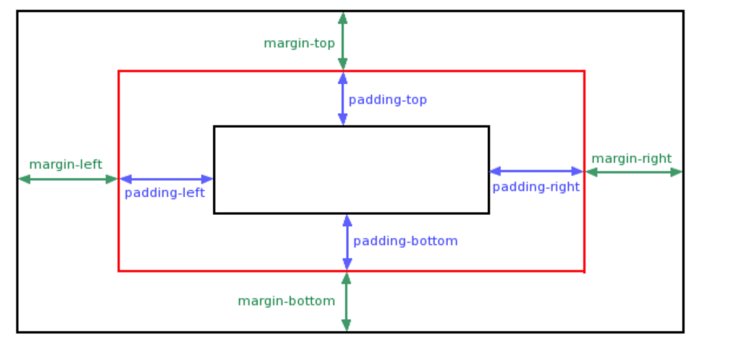

## 版心居中
外边距可以让块级盒子水平居中的两个条件：

+ 盒子必须指定了宽度（width）
+ 盒子左右的外边距都设置为 auto 

常见的写法，以下三种都可以：

```css
margin-left: auto;   margin-right: auto;
margin: auto;
margin: 0 auto;
```

注意：

以上方法是让**块级元素**水平居中

**行内元素或者行内块元素**水平居中给其父元素添加 **text-align:center** 即可

## 外边距合并
使用 margin 定义块元素的垂直外边距时，可能会出现外边距的合并

场景：**垂直**排列的兄弟元素，上下 **margin** 会**合并现象：取两个 margin 中的较大值生效**

当上下相邻的两个块元素（兄弟关系）相遇时

如果上面的元素有下外边距 margin-bottom，下面的元素有上外边距 margin-top 

则他们之间的垂直间距不是 margin-bottom 与 margin-top 之和

取两个值中的较大者这种现象被称为相邻块元素垂直外边距的合并

**解决方案：尽量只给一个盒子添加 margin 值**

## 外边距塌陷
场景：父子级的标签，**子级**的添加 **上外边距** 会产生**塌陷**问题

**现象：导致父级一起向下移动**

对于两个嵌套关系（父子关系）的块元素，父元素有上外边距同时子元素也有上外边距，此时父元素会塌陷较大的外边距值

解决方案：

+ **取消子级margin，父级设置padding**
+ 父级设置 overflow: hidden
+ 父级设置 border-top

## 清除内外边距
网页元素很多都带有默认的内外边距，而且不同浏览器默认的也不一致

因此在布局前，首先要清除下网页元素的内外边距

```css
 * {
    padding:0;   /* 清除内边距 */
    margin:0;    /* 清除外边距 */
  }
```

注意：行内元素为了照顾兼容性，尽量只设置左右内外边距，不要设置上下内外边距。但是转换为块级和行内块元素就可以了

## 内边距
内边距位于边框和内容区域之间，用于将内容推离边框

与外边距不同，内边距不能为负数。任何应用于元素的背景都会显示在内边距后面

**作用：设置内容与盒子边缘之间的距离**

+ 属性名：padding / padding-方位名词

> 提示：添加 padding 会撑大盒子
>
> 技巧：从上开始顺时针赋值，当前方向没有数值则与对面取值相同

## 行内元素内外边距问题
**场景：行内元素添加 margin 和 padding，无法改变元素垂直位置**

解决方法：给行内元素添加 **line-height** 可以改变垂直位置

```css
span {
  /* margin 和 padding 属性，无法改变垂直位置 */
  margin: 50px;
  padding: 20px;
  /* 行高可以改变垂直位置 */
  line-height: 100px;
}
```

## 边框
边框是在边距和填充盒子之间绘制的。如果你正在使用标准的盒模型，边框的大小将添加到框的宽度和高度。如果你使用的是替代盒模型，边框越大会使内容框越小，因为它会占用一些可用的宽度和高度

为边框设置样式时，有大量的属性可以使用——有四个边框

**边框 = 边框样式 + 宽度 + 颜色**

属性名：**border**（bd）

属性值：边框线粗细  线条样式  颜色（不区分顺序）

## 边框样式
**border-style ** 可以设置如下值：

可以针对4条边分别进行设置 border-top-style

+ none：没有边框即忽略所有边框的宽度（默认值）
+ solid：边框为单实线(最为常用的)
+ dashed：边框为虚线  
+ dotted：边框为点线
+ ......


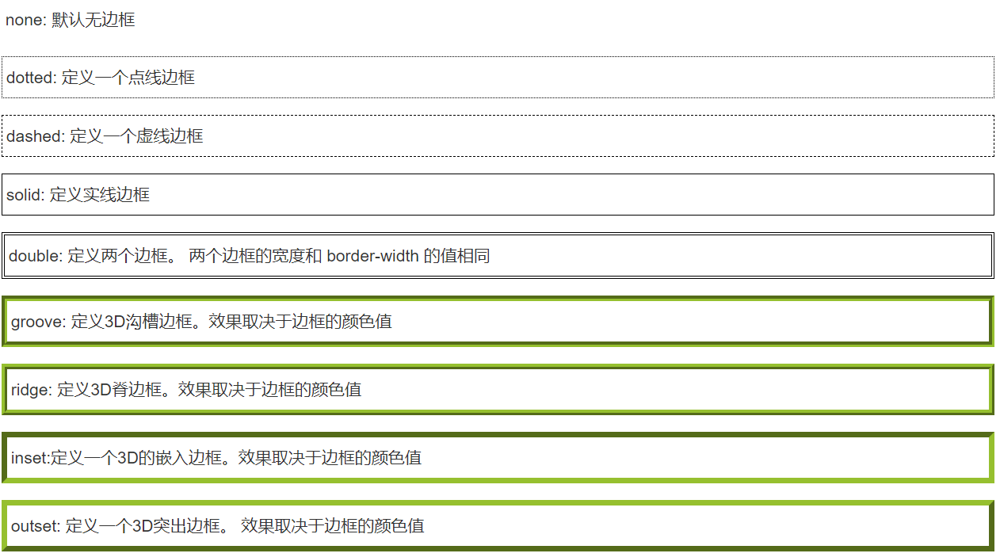

## 边框宽度
取值通常为像素 px ，可以针对4条边分别进行设置 border-top-width

## 边框颜色
可以针对4条边分别进行设置 border-top-color，采用顺时针 上右下左 顺序

## 边框速写
边框简写：

```css
 border: 1px solid red;  
```

边框分开写法：

```css
border-top: 1px solid red;  /* 只设定上边框， 其余同理 */   
```

## 表格的细线边框
border-collapse 属性控制浏览器绘制表格边框的方式。它控制相邻单元格的边框

```css
 border-collapse:collapse; 
```

collapse 单词是合并的意思

**border-collapse: collapse; 表示相邻边框合并在一起**

**边框会影响盒子实际大小**

边框会额外增加盒子的实际大小。因此我们有两种方案解决：

+ 测量盒子大小的时候,不量边框
+ 如果测量的时候包含了边框,则需要 width/height 减去边框宽度

## 轮廓（outline）
轮廓（outline）是绘制于元素周围的一条线，位于边框边缘的外围，可起到突出元素的作用

CSS outline 属性规定元素轮廓的样式、颜色和宽度


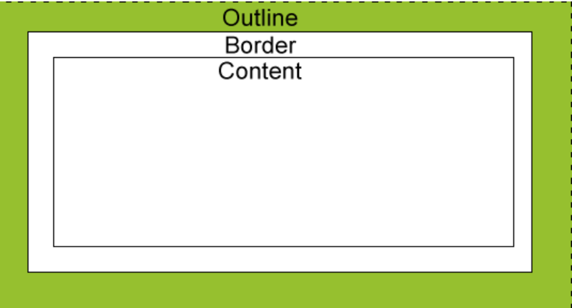

## 尺寸计算
**默认情况：盒子尺寸 = 内容尺寸 + border 尺寸 + 内边距尺寸**

结论：**给盒子加 border / padding 会撑大盒子**

解决方案：

+ 手动做减法，减掉 border / padding 的尺寸
+ **內减模式：box-sizing: border-box**

# 盒模型应用
## 改变宽高范围
默认情况下，width和height设置的是**内容盒**宽高

页面重构师：将psd设计稿制作为静态页面

测量设计稿尺寸往往使用**边框盒**，但设置width和height是针对于内容盒

`box-sizing` 改变宽高影响范围；

`content-box` 默认值

**盒子大小为 width + padding + border **

如果你设置一个元素的宽为 100px，那么这个元素的内容区会有 100px 宽

并且任何边框和内边距的宽度都会被增加到最后绘制出来的元素宽度中

`border-box`

**盒子大小为 width**

设置的边框和内边距的值是包含在 width 内的

如果你将一个元素的 width 设为 100px，那么这 100px 会包含它的 border 和 padding

内容区的实际宽度是 width 减去 (border + padding) 的值

如果盒子模型我们改为了box-sizing: border-box  ， 那padding和border就不会撑大盒子了

前提padding和border不会超过width宽度

## 改变背景覆盖范围
默认情况下，背景覆盖边框盒（边框+内边距+内容）

background-clip:改变背景影响范围

## 溢出处理
作用：控制溢出元素的内容的显示方式

属性名：**overflow**

CSS 中万物皆盒，因此可以通过给 `width` 和 `height`（或者 `inline-size` 和 `block-size`）赋值的方式来约束盒子的尺寸。溢出是在你往盒子里面塞太多东西的时候发生的，所以盒子里面的东西也不会老老实实待着

`overflow` 属性告诉浏览器怎样处理溢出,默认值为 `visible`

如果想在内容溢出的时候把它裁剪掉,在盒子上设置 `overflow: hidden`

只应该在判断隐藏内容不会引起问题的时候这样做

`overflow: hidden`	

在内容溢出的时候把它**裁剪**掉

`overflow: scroll`

内容溢出的时候加**滚动条**；设置 overflow-y: scroll 来仅在 y 轴方向

`overflow: auto`

内容溢出的时候**自动加滚动条**；

## 断词规则
`word-break`会影响文字在什么位置被截断换行

+ normal： 普通，CJK字符（中日韩）在文字位置截断，非cjk字符在单词位置截断
+ break-all：截断所有，所有字符在文字处进行截断
+ keep-all：保持所有，所有单词都在单词之间截断

## 空白处理
针对单行文本，多行需要js处理

`white-space：nowrap` ：不换行溢出

`overflow：hidden：`内容溢出的时候把它裁剪掉

`text-overflow：ellipsis：`文字溢出部分用原点代替

# 行盒的盒模型
常见的行盒：包含具体内容的元素

span,strong,em,i,img,video,audio

**调整宽高需要使用字体大小、行高、字体类型等间接调整**

## 特点
1 盒子沿着内容延伸

2 行盒宽高设置无效

3 内边距水平方向有效，垂直方向仅会影响背景，不占空间

4 边框水平方向有效，垂直方向仅会显示效果，不占空间

5 外边距水平方向有效，垂直方向无效

## 行块盒
display：inline-block 的盒子

+ 不独占一行
+ 盒模型所有尺寸都有效

## 空白折叠
空白折叠发生在行盒（行快盒）内部 或 行盒之间

inline-block 水平呈现的元素间，**换行显示或空格分隔的情况下会有间距**

依据写作习惯，利用空格调整文章的结构，但再HTML中，浏览器会移除源代码中多余的空格和空行，会被算作一个空格；连续的空格也会显示为一个空格

> **栗如：一个div中有两个inline-block 行内块元素，width都是50%，第二个会被挤下去**
>
> 原因：HTML**标签之间的空行**会被算作一个**空格**显示在页面上，多出来个是换行符的大小
>
> 将字体设置为0，或者代码写成一行就不会显示了
>
> 解决方法：
>
> + 所有代码写作一行，考虑到代码可读性，显然连成一行的写法是不可取的
> + 宽度设置为49%
> +  **给父元素设置 font-size 为 0**

## 可替换元素
内容不由 CSS 控制，而是由外部资源（如图片、视频、表单控件等）或浏览器默认行为决定的元素CSS 只能控制它们的位置、大小、盒模型等外部样式，无法直接修改其内容

**常见示例**：

+ ``、`<video>`、`<audio>`、`<iframe>`、`<canvas>`
+ 表单元素：`<input>`、`<textarea>`、`<select>`、`<object>`

**特点**：

+ **内容独立性**：内容来自外部资源或用户输入，与 CSS 无关
+ **默认尺寸**：通常有默认的宽高（如图片的原始尺寸），即使未设置 CSS 尺寸
+ **盒模型特殊性**：部分可替换元素（如 ``）默认是 `display: inline-block`，具有内在宽高和基线对齐特性

## 非可替换元素
内容直接由 CSS 和 HTML 决定，完全受样式控制的元素

元素的内容在文档中可见，直接参与页面渲染

**常见示例**：

+ 文本标签：`<p>`、`<h1>`~`<h6>`、`<span>`、`<a>`
+ 容器标签：`<div>`、`<header>`、`<nav>`、`<main>`、`<footer>`
+ 列表标签：`<ul>`、`<ol>`、`<li>`
+ 语义化标签：`<article>`、`<section>`、`<aside>`

**特点**：

+ **内容可控性**：内容直接写在 HTML 中，可通过 CSS 完全控制样式（如颜色、字体、布局等）
+ **默认行为**：元素的渲染依赖于 CSS 属性（如 `display`、`position`）和盒模型

**布局定位**

视觉格式化模型：页面中的多个盒子排列规则

盒模型：规定单个盒子的规则

视觉格式化模型大体上将页面中盒子的排列分为三种方式

简单说,就是盒子如何进行排列顺序)：

+ 常规流（标准流）
+ 浮动
+ 定位这三种布局方式都是用来摆放盒子的，盒子摆放到合适位置，布局自然就完成了

 

# Flow 常规流式布局
常规流（Normal Flow）定义

**本质**：浏览器默认的布局规则，未手动设置 CSS 布局（如 flex、grid）时的元素排列方式

元素按照 “文档流”**（从上到下、从左到右）**排列

## 元素类型与排列规则
**块级元素**

+ 特性：独占一行，从上到下垂直排列
+ 常见标签：`div`、`p`、`h1~h6`、`ul/ol`、`form`、`table`等

**行内元素**

+ 特性：从左到右水平排列，遇父元素边缘自动换行，不独占空间
+ 常见标签：`span`、`a`、`i`、`em`等

## 包含块（Containing Block）
**定义**：决定元素布局范围的容器，元素的位置和尺寸以包含块为基准

**规则**：多数情况下，元素的包含块为其父元素的内容盒（content box）

## 块级元素布局规则
**水平方向约束**

+ 块级元素总宽度 = 包含块宽度
+ `width: auto`（默认值）时，元素宽度自适应填充包含块
+ `margin: auto` 可吸收剩余空间，实现居中：**css**

```css
.block { width: 200px; margin: 0 auto; } /* 定宽+左右margin:auto实现水平居中 */
```

**垂直方向约束**

+ `height: auto`（默认）：高度自适应内容
+ `margin-top/bottom: auto` 等同于 `margin: 0`

## 百分比取值规则
**宽度、内边距（padding）、外边距（margin）**：  
百分比基于包含块的**宽度**计算，即使是垂直方向（如`margin-top: 50%`）

**高度（height）**：

+ 若包含块高度明确（非 auto），百分比基于父元素高度；
+ 若包含块高度依赖子元素（auto），百分比设置无效

## 外边距合并（Margin Collapsing）
**相邻块级元素合并**

+ 上下相邻的块级元素，外边距取最大值而非叠加
+ 例：A 元素`margin-bottom: 50px`，B 元素`margin-top: 60px`，实际间距为 60px

**父子元素合并**

+ 若父元素未设置边框（border）或内边距（padding），子元素的`margin-top`会 “穿透” 父元素，导致两者外边距合并

**解决方案**：

+ 给父元素添加`border-top`或`padding-top`；
+ 给父元素设置`overflow: hidden`（触发 BFC）

## 核心总结
+ 常规流是 CSS 布局的基础，块级 / 行内元素的排列规则是核心；
+ 包含块决定元素的尺寸基准，百分比计算需注意上下文；
+ 外边距合并是常见布局陷阱，需通过边框、内边距或 BFC 规避。

# Float 浮动布局
浮动最典型的应用：可以让多个块级元素一行内排列显示。文字环绕、横向排列

网页布局第一准则：**多个块级元素纵向排列找标准流，多个块级元素横向排列找浮动**

作用：让块元素**水平排列属性名：float**

属性值：

+ **left**：左对齐
+ **right**：右对齐

## 浮动基本特性
**元素类型转换**

+ **浮动元素自动转为块盒**（如`span`浮动后`display`变为`block`，但不换行）

**包含块规则**

+ 浮动元素的包含块与常规流一致，为父元素的内容盒

**脱离标准流（脱标）**

+ **浮动元素不再占据常规流位置**，后续元素会无视其位置进行排列

**水平排列特性**

+ 浮动元素在一行内水平排列，顶部对齐（类似`inline-block`，但完全脱标）

## 布局应用策略
**标准流 + 浮动组合原则**

+ 父元素用标准流控制上下位置，子元素用浮动控制左右排列
+ 符合网页布局 “先上下后左右” 的基本逻辑

## 浮动盒子尺寸与盒模型
**自动尺寸规则**

+ 宽度`auto`时：自适应内容宽度（类似块盒默认行为）
+ 高度`auto`时：自适应内容高度（与常规流一致）

**margin 特性**

+ `margin: auto`时，全方向值为 0（无法通过`margin`实现水平居中）

**边框 / 内边距 / 百分比**

+ 与常规流一致，百分比基于父元素内容盒计算

## 浮动盒子排列规则
**左右浮动方向**

+ `float: left`：元素靠上、靠左排列；`float: right`：靠上、靠右排列

**顶边限制**

+ 浮动元素顶边不得高于上一个浮动元素的顶边（受包含块或上边界限制）

**与其他元素的交互**

+ **避开常规流块盒**：浮动元素排列时会避开父容器内的常规流块级元素（如`div`）
+ **常规流块盒无视浮动**：常规流块盒排列时不考虑浮动元素的位置，可能覆盖浮动元素
+ **行盒（文字）避开浮动**：行内元素或文字会自动避开浮动元素，形成环绕效果（浏览器自动生成匿名行盒包裹文字）

**外边距合并**

+ 浮动元素之间、浮动与常规流元素之间均不会发生外边距合并

## 匿名行盒补充
当文字未被行内元素包裹时，浏览器会自动生成 “匿名行盒” 包裹文字，使其在排列时避开浮动元素，形成文字环绕效果

# Position 定位布局
定位则是可以让盒子自由的在某个盒子内移动位置或者固定屏幕中某个位置，并且可以压住其他盒子收到看着元素在包含块中的精准位置

**涉及的css属性：position定位**：将盒子**定**在某一个位置，所以**定位也是在摆放盒子， 按照定位的方式移动盒子**

定位也是用来布局的，它有两部分组成

**定位 = 定位模式 + 边偏移定位模式**：用于指定一个元素在文档中的定位方式

**边偏移：**则决定了该元素的最终位置

**边偏移** 就是定位的盒子移动到最终位置。有 top、bottom、left 和 right  4 个属性

| 边偏移属性 | 示例 | 描述 |
| --- | :--- | --- |
| `top` | `top: 80px` | **顶端**偏移量，定义元素相对于其父元素**上边线的距离** |
| `bottom` | `bottom: 80px` | **底部**偏移量，定义元素相对于其父元素**下边线的距离** |
| `left` | `left: 80px` | **左侧**偏移量，定义元素相对于其父元素**左边线的距离** |
| `right` | `right: 80px` | **右侧**偏移量，定义元素相对于其父元素**右边线的距离** |

定位的盒子有了边偏移才有价值。 一般情况下，凡是有定位地方必定有边偏移

## position 属性
+ **static：静态定位（默认值 不定位）**
+ **relative：相对定位**
+ **absolute：绝对定位**
+ **fixed：固定定位**
+ **stickey 粘性定位**

一个元素只要position的取值不为static，认为该元素是一个定位元素

定位元素会脱离常规文档流（相对定位除外）

一个脱离了文档流的元素：

+ 文档流中的元素摆放时，会忽略脱离了文档流的元素
+ 文档流中元素计算自动高度时，会忽略脱离了文档流的元素

## 相对定位 relative
不会导致元素脱离文档流，只是让元素相对于原来位置上进行偏移

**相对定位**是元素在移动位置的时候，是相对于它自己**原来的位置**来说的

通过四个 css 属性设置其位置

+ left
+ right
+ top
+ bottom

盒子的偏移不会对其他盒子造成任何影响，只是**视觉效果产生了偏差**，还在原来位置

**原来**在标准流的**位置**继续占有，后面的盒子仍然以标准流的方式对待 它

因此，**相对定位并没有脱标**。它最典型的应用是**给绝对定位当爹的**

## 绝对定位 absolute
**绝对定位**是将元素依据最近的**已经定位的父元素**（绝对、固定或相对定位）进行定位，若所有父元素都没有定位，则依据body根元素（浏览器窗口）进行定位

**特点**

1. 宽高为 auto ，盒子尺寸适应内容
2. 元素将依据最近的**已经定位**（绝对、固定或相对定位）的**父元素（祖先）**进行定位
3. **完全脱标** —— 完全不占位置；  
4. **父元素没有定位**，则以**浏览器**为准定位（Document 文档）
5. 显示模式改变，宽高生效，具备**行内块**特点

## 子绝父相
绝对定位和相对定位的使用场景

**子级是绝对定位的话，父级要用相对定位**

因为绝对定位的盒子是拼爹的，所以要和父级搭配一起来使用

①子级绝对定位，不会占有位置，可以放到父盒子里面的任何一个地方，不会影响其他的兄弟盒子

②父盒子需要加定位限制子盒子在父盒子内显示

③父盒子布局时，需要占有位置，因此父亲只能是相对定位

这就是子绝父相的由来，所以**相对定位经常用来作为绝对定位的父级**

总结： **因为父级需要占有位置，因此是相对定位， 子盒子不需要占有位置，则是绝对定位**

当然，子绝父相不是永远不变的，如果父元素不需要占有位置，**子绝父绝**也会遇到

**疑问**：为什么在布局时，**子级元素**使用**绝对定位**时，**父级元素**就要用**相对定位**呢？

观察下图**左右两个方向的箭头图片**以及**父级盒子**的定位方式

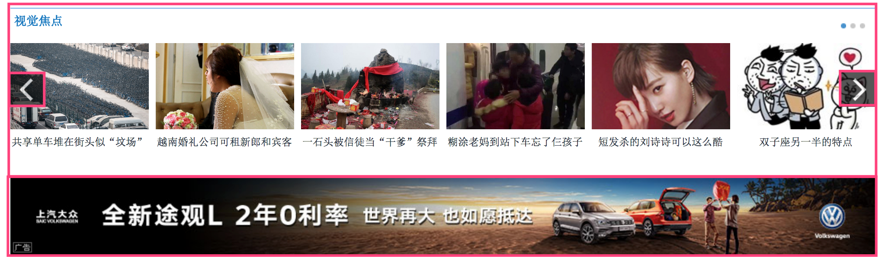

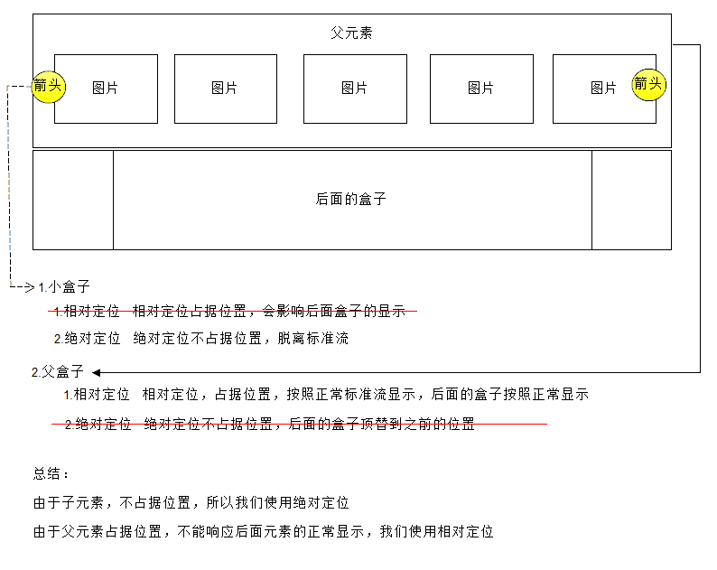

**方向箭头**叠加在其他图片上方，应该使用**绝对定位**，因为**绝对定位完全脱标**，完全不占位置

**父级盒子**应该使用**相对定位**，因为**相对定位不脱标**，后续盒子仍然以标准流的方式对待它

如果父级盒子也使用**绝对定位**，会完全脱标，那么下方的**广告盒子**会上移，这显然不是我们想要的

**结论**：**父级要占有位置，子级要任意摆放**，这就是**子绝父相**的由来

## 固定定位 fixed
**固定定位**是元素**固定于浏览器可视区的位置**

主要使用场景： 可以在浏览器页面滚动时元素的位置不会改变，其他情况和绝对定位完全一样

包含块不同：固定为视口，浏览器的可视窗口

**导航菜单、浮动球、广告等**

场景：元素的位置在网页滚动时不会改变

特点：

+ 脱标，不占位
+ 显示模式具备行内块特点
+ 设置边偏移相对浏览器窗口改变位置

**提示**：IE 6 等低版本浏览器不支持固定定位

```css
div {
  position: fixed;
  top: 0;
  right: 0;

  width: 500px;
}
```

## 粘性定位 sticky
粘性定位可以被认为是**相对定位和固定定位**的**混合**

元素在跨越特定**阈值**前为相对定位，之后为固定定位 

**注意：** 必须指定 top, right, bottom 或 left 四个值其中之一

```html
<!DOCTYPE html>
<html lang="zh-CN">
<head>
    <meta charset="UTF-8">
    <meta name="viewport" content="width=device-width, initial-scale=1.0">
    <title>粘性定位示例</title>
    <style>
        body {
            margin: 0;
            padding: 20px;
            height: 2000px; /* 让页面可以滚动 */
            font-family: Arial, sans-serif;
        }

        .header {
            text-align: center;
            padding: 20px;
            background-color: #f0f0f0;
            margin-bottom: 30px;
        }

        /* 粘性定位元素 */
        .sticky-nav {
            position: sticky; /* 设置粘性定位 */
            top: 0; /* 必须指定top值，确定触发固定定位的阈值 */
            background-color: #4CAF50;
            color: white;
            padding: 15px;
            margin-bottom: 20px;
        }

        .content {
            line-height: 1.6;
        }
    </style>
</head>
<body>
    <div class="header">
        <h1>页面标题</h1>
        <p>滚动页面查看下方导航栏的粘性效果</p>
    </div>

    <!-- 这个导航栏会应用粘性定位 -->
    <nav class="sticky-nav">
        这是粘性导航栏 - 滚动时会固定在顶部
    </nav>

    <div class="content">
        <p>滚动页面...</p>
        <p>当导航栏到达视口顶部（top: 0）时，会从相对定位变为固定定位</p>
        <p>继续滚动...</p>
        <p>内容段落 1</p>
        <p>内容段落 2</p>
        <p>内容段落 3</p>
        <p>内容段落 4</p>
        <p>内容段落 5</p>
        <p>内容段落 6</p>
        <p>内容段落 7</p>
        <p>内容段落 8</p>
        <p>内容段落 9</p>
        <p>内容段落 10</p>
        <!-- 更多内容让页面可以滚动 -->
    </div>
</body>
</html>

```


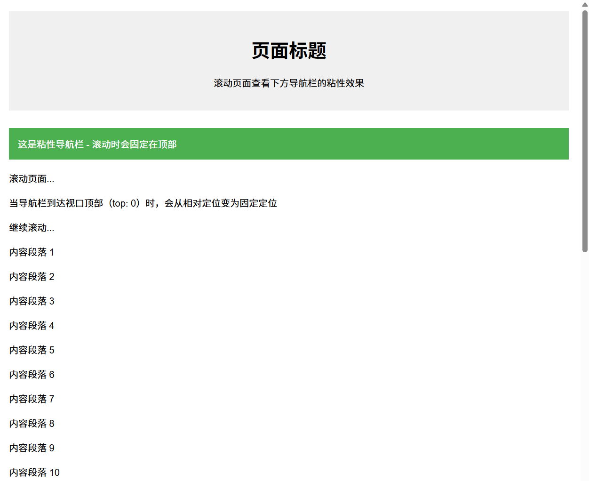


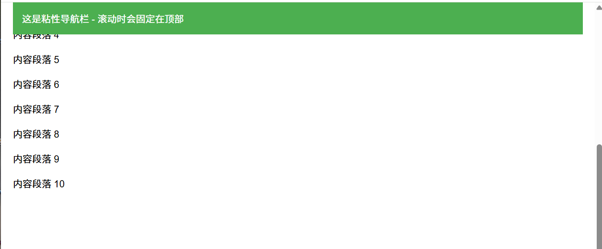

## 定位居中
某个方向居中：

1. 定宽（高）
2. 将左右（上下）距离设置为0
3. 将左右（上下）margin 设置为 auto

绝对定位和固定定位中，margin 为 auto 时，会自动吸收剩余空间


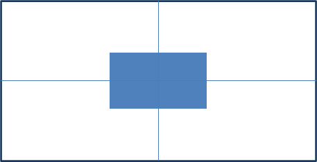

实现步骤：

1. 绝对定位
2. 水平、垂直边偏移为 50%
3. 子级向左、上移动自身尺寸的一半
+ 左、上的外边距为 –尺寸的一半
+ transform: translate(-50%, -50%)

```css
img {
  position: absolute;
  left: 50%;
  top: 50%;

  /* margin-left: -265px;
  margin-top: -127px; */

  /* 方便： 50% 就是自己宽高的一半 */
  transform: translate(-50%, -50%);
}
```

## 堆叠顺序（z-index）
+ 在使用**定位**布局时，可能会**出现盒子重叠的情况**
+ 此时，可以使用 **z-index** 来控制盒子的前后次序 (z轴)

```css
选择器 { 
    z-index: 1; 
}
```

+ `z-index` 的特性如下：
+ **属性值**：**正整数**、**负整数**或 **0**，默认值是 0，**数值越大，盒子越靠上；**
+ 如果**属性值相同**，则按照书写顺序，**后来居上**；
+ 数字后面**不能加单位注意**：`z-index` 只能应用于**相对定位**、**绝对定位**和**固定定位**的元素，**标准流**、**浮动**和**静态定位**无效

+ 应用 `z-index` 层叠等级属性可以**调整盒子的堆叠顺序**


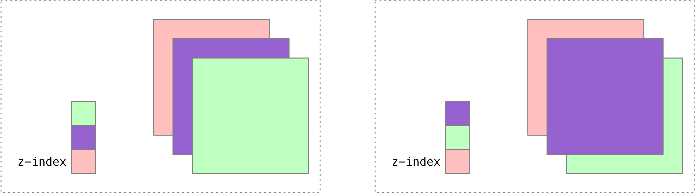

## 定位布局总结
通过盒子模型，清楚知道大部分html标签是一个盒子

通过CSS浮动、定位 可以让每个盒子排列成为网页

一个完整的网页，是标准流、浮动、定位一起完成布局的，每个都有自己的专门用法

**标准流 ：**盒子上下排列或者左右排列，**垂直的块级盒子显示就用标准流布局浮动：**多个块级元素一行显示或者左右对齐盒子，**多个块级盒子水平显示就用浮动布局定位：**定位最大的特点是有层叠的概念，就是可以让多个盒子前后叠压来显示。**如果元素自由在某个盒子内移动就用定位布局**

+ 绝对定位、固定定位元素一定是块盒
+ 绝对定位、固定定位元素一定不是浮动

```css
float: left;
position: absolute;

最终属性：float ：none
```

+ 没有外边距合并

## 清除浮动
场景：浮动元素会脱标，如果**父级没有高度**，**子级无法撑开父级高度**（可能导致页面布局错乱）

解决方法：**清除浮动**（清除浮动带来的影响）

### 清除浮动原因
常规流盒子的自动高度，在计算时不会考虑浮动盒子，浮动盒子脱离和常规流，由于父级盒子很多情况下不方便给高度，但是子盒子浮动又不占有位置，父级高度为 0 时就会影响下面标准流盒子

+ 清除浮动元素造成的影响：浮动的子标签无法撑开父盒子的高度
+ 清除浮动本质：是清除浮动元素脱离标准流造成的影响
+ 清除浮动策略：闭合浮动,让浮动在父盒子内部影响,不影响父盒子外面的其他盒子

注意：

+ 如果父盒子本身有高度，则不需要清除浮动
+ 清除浮动之后，父级就会根据浮动的子盒子自动检测高度
+ 父级有了高度，就不会影响下面的标准流了

涉及css属性： clear

+ 默认值：none
+ left ：清除左浮动，该元素必须出现在前面所有左浮动盒子下方，排列时参考浮动盒子位置
+ right：清除左浮动，该元素必须出现在前面所有右浮动盒子下方
+ both：清除左右浮动

### 使用空标签
虽然可以清除浮动，但增加了毫无意义的结构标签，因此实际开发不推荐使用

使用方式：额外标签法会在浮动元素末尾添加一个空的标签，可以使div、p、hr等任何标签

```html
例如 <div style="clear:both"></div>，或者其他标签（如<br />等）。
```

优点： 通俗易懂，书写方便

缺点： 添加许多无意义的标签，结构化较差

注意： 要求这个新的空标签必须是块级元素

### 父级添加 overflow 属性
可以给父级添加 overflow 属性，将其属性值设置为 hidden、 auto 或 scroll 

```css
overflow:hidden | auto | scroll;
```

优点：代码简洁

缺点：无法显示溢出的部分

注意：是给父元素添加代码

### 父级添加 ::after 伪元素 （推荐使用）
`::after`方式是额外标签法的升级版

```css
.clearfix::after {
    content: "";
    display: block;
    clear: both;
    visibility:hidden;
    height：0;
}
<div class="content clearfix">
  <div class="left">
      111
  </div>
  <div class="right"></div>
  <!-- <div class="clearfix"></div> -->
</div>

```

优点：没有增加标签，结构更简单

缺点：照顾低版本浏览器

代表网站： 百度、淘宝网、网易等

注意：

+ 必须为伪元素添加 height：0;样式，否则该标签会比其实际高度高出若干像素
+ 必须为伪元素设置content 属性，属性值可以为空

### 父级添加双伪元素
给父元素添加

```css
 .clearfix:before,.clearfix:after {
   content:"";
   display:table; 
 }
 .clearfix:after {
   clear:both;
 }
 .clearfix {
    *zoom:1;
 }   
```

优点：代码更简洁

缺点：照顾低版本浏览器

代表网站：小米、腾讯等

**使用浮动元素，就要考虑高度坍塌问题**

```html
.clearfix::after {
    content: "";
    display: block;
    clear: both;
}
<div class="content clearfix">
  <div class="left">
      111
  </div>
  <div class="right"></div>
  <!-- <div class="clearfix">
  </div> -->
</div>
```

# **Flex 弹性布局**
Flex 布局也叫**弹性布局**，是浏览器**提倡的布局模型**，适合**结构化**布局，提供了空间分布和对齐能力

Flex 模型不会产生浮动布局中脱标现象，布局网页更简单、更灵活


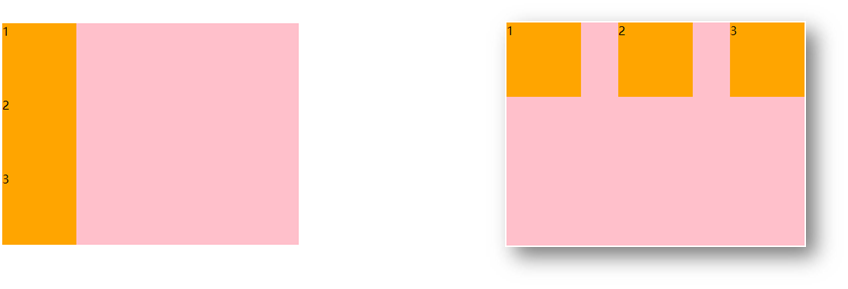

## Flex 组成
设置方式：**给父元素设置 display: flex**，子元素可以自动挤压或拉伸

组成部分：

+ 弹性容器
+ 弹性盒子
+ 主轴：默认在**水平**方向
+ 侧轴 / 交叉轴：默认在**垂直**方向


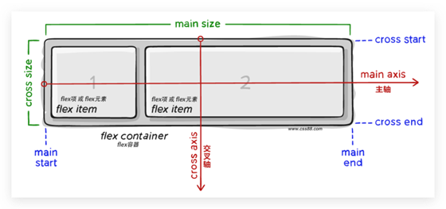

+ flex布局相关的CSS样式：

| **属性** | **说明** | **取值** | **含义** |
| --- | --- | --- | --- |
| display | 模式 | flex | 使用flex布局 |
| flex-direction | 设置主轴 | row | 主轴方向为x轴，水平向右。（默认） |
| | | column | 主轴方向为y轴，垂直向下。 |
| justify-content | 子元素在主轴上的对齐方式 | flex-start | 从头开始排列 |
| | | flex-end | 从尾部开始排列 |
| | | center | 在主轴居中对齐 |
| | | space-around | 平分剩余空间 |
| | | space-between | 先两边贴边，再平分剩余空间 |

如果主轴设置为row，其实就是横向布局。 主轴设置为column，其实就是纵向布局

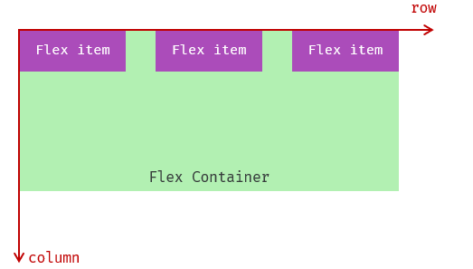

## 主轴对齐方式
**属性名：justify-content**

| **属性值** | **效果描述** |
| :--- | :--- |
| flex-start | 默认值，弹性盒子从**主轴起点**开始依次排列 |
| flex-end | 弹性盒子从**主轴终点**开始依次排列 |
| center | 弹性盒子沿主轴**居中**排列 |
| space-between | 弹性盒子沿主轴均匀排列，**空白间距仅分布在盒子之间** |
| space-around | 弹性盒子沿主轴均匀排列，**空白间距分布在盒子两侧** |
| space-evenly | 弹性盒子沿主轴均匀排列，**盒子与容器、盒子之间间距完全相等** |

注：需结合 `display: flex` 生效，主轴方向

## 侧轴单行对齐
**align-items：**当前弹性容器内**所有**弹性盒子的侧轴对齐方式（给**弹性容器**设置）

**align-self：**单独控制**某个弹性盒子**的侧轴对齐方式（给**弹性盒子**设置）

| **属性值** | **效果** |
| :--- | :--- |
| stretch | 弹性盒子沿着侧轴线被拉伸至铺满容器 |
| center | 弹性盒子沿侧轴居中排列 |
| flex-start | 弹性盒子从起点开始依次排列 |
| flex-end | 弹性盒子从终点开始依次排列 |

## 修改主轴方向
**主轴默认在水平方向，侧轴默认在垂直方向属性名：flex-direction**

| **属性值** | **效果** |
| :--- | :--- |
| row | 水平方向，从左向右（默认） |
| column | 垂直方向，从上向下 |
| row - reverse | 水平方向，从右向左 |
| column - reverse | 垂直方向，从下向上 |

## 弹性伸缩比
作用：控制弹性盒子的主轴方向的尺寸

**属性名：flex**

属性值：整数数字，表示占用**父级剩余尺寸的份数**

例如有一个弹性容器，其内部有两个弹性盒子，一个弹性盒子的 “flex” 值设为 1，另一个设为 2

那么在分配剩余空间时，“flex” 值为 2 的弹性盒子将获得比 “flex” 值为 1 的弹性盒子两倍的空间

从而决定了它们在主轴方向上的相对尺寸大小

## 弹性盒子换行
弹性盒子可以自动挤压或拉伸，默认情况下，所有弹性盒子都在一行显示

**属性名：flex-wrap**

属性值

+ wrap：换行
+ nowrap：不换行（默认）

## 侧轴多行对齐
属性名：**align-content** 

| **属性值** | **效果** |
| :--- | :--- |
| flex-start | 默认值，弹性盒子从起点开始依次排列 |
| flex-end | 弹性盒子从终点开始依次排列 |
| center | 弹性盒子沿主轴居中排列 |
| space-between | 弹性盒子沿主轴均匀排列，空白间距均分在弹性盒子之间 |
| space-around | 弹性盒子沿主轴均匀排列，空白间距均分在弹性盒子两侧 |
| space-evenly | 弹性盒子沿主轴均匀排列，弹性盒子与容器之间间距相等 |

注意：该属性对**单行**弹性盒子模型**无效**

必须指定**亲父**高度

# Grid 网格布局
Grid 布局是 CSS 中最强大的布局系统之一，它提供了二维布局能力（同时处理行和列），非常适合创建复杂的布局结构

## 核心概念
+ **网格容器（Grid Container）**：设置 `display: grid` 的父元素，所有直接子元素会成为网格项
+ **网格项（Grid Item）**：网格容器的直接子元素
+ **网格线（Grid Line）**：分隔行 / 列的线（编号从 1 开始）
+ **网格轨道（Grid Track）**：行或列的空间（即行高 / 列宽）
+ **网格单元格（Grid Cell）**：行与列交叉形成的单个区域（类似表格单元格）
+ **网格区域（Grid Area）**：多个相邻单元格组成的矩形区域

## 常用容器属性
定义行列轨道

+ `grid-template-columns`：定义列轨道的宽度
+ `grid-template-rows`：定义行轨道的高度

常用单位：

+ 固定单位（px、em 等）
+ `fr`：剩余空间的比例分配（如 `1fr 2fr` 表示两列比例为 1:2）
+ `auto`：根据内容自动调整

设置间距

+ `gap`：简写属性，同时设置行间距（`row-gap`）和列间距（`column-gap`）

对齐方式

+ `justify-items`：水平方向对齐网格项（`start`/`center`/`end`/`stretch`）
+ `align-items`：垂直方向对齐网格项（`start`/`center`/`end`/`stretch`）

## 常用网格项属性
+ `grid-column`：指定网格项跨越的列（如 `1 / 3` 表示从第 1 根线到第 3 根线，即占 2 列）
+ `grid-row`：指定网格项跨越的行（用法同上）
+ `grid-area`：给网格项命名，配合容器的 `grid-template-areas` 实现布局

## 代码示例
示例 1：基础网格布局

创建一个 3 列 2 行的网格，列宽比例为 1:2:1，行高固定为 100px，间距为 10px

```html
<style>
  .grid-container {
    display: grid;
    grid-template-columns: 1fr 2fr 1fr; /* 3列，比例1:2:1 */
    grid-template-rows: 100px 100px;    /* 2行，每行高100px */
    gap: 10px; /* 行列间距都是10px */
    padding: 10px;
    background: #eee;
  }

  .grid-item {
    background: #4285f4;
    color: white;
    display: flex;
    align-items: center;
    justify-content: center;
    font-size: 20px;
  }
</style>

<div class="grid-container">
  <div class="grid-item">1</div>
  <div class="grid-item">2</div>
  <div class="grid-item">3</div>
  <div class="grid-item">4</div>
  <div class="grid-item">5</div>
  <div class="grid-item">6</div>
</div>
```

示例 2：网格项跨行列

让第 1 个项跨 2 列，第 5 个项跨 2 行

```html
<style>
  .grid-container {
    display: grid;
    grid-template-columns: repeat(3, 1fr); /* 3列，每列等宽 */
    grid-template-rows: repeat(3, 100px);  /* 3行，每行高100px */
    gap: 10px;
    padding: 10px;
    background: #eee;
  }

  .item1 {
    grid-column: 1 / 3; /* 从第1列线到第3列线（跨2列） */
    background: #ea4335;
  }

  .item5 {
    grid-row: 2 / 4; /* 从第2行线到第4行线（跨2行） */
    background: #fbbc05;
  }

  .grid-item {
    color: white;
    display: flex;
    align-items: center;
    justify-content: center;
    font-size: 20px;
  }
</style>

<div class="grid-container">
  <div class="grid-item item1">1</div>
  <div class="grid-item">2</div>
  <div class="grid-item">3</div>
  <div class="grid-item">4</div>
  <div class="grid-item item5">5</div>
  <div class="grid-item">6</div>
  <div class="grid-item">7</div>
</div>
```

# 响应式布局
**概念**：使页面在不同设备（手机、平板、PC）上自适应不同屏幕尺寸，保持良好布局和用户体验

**必备前提**：视口配置  

- `<meta name="viewport" content="width=device-width, initial-scale=1.0">`

**实现方式**：

- 媒体查询（`@media`）：根据屏幕宽度设置不同样式，如 `@media (max-width: 768px) { ... }`
- 弹性布局（Flexbox）、网格布局（Grid）：天然支持自适应
-  响应式单位：使用 `%`、`rem`、`em`、`vw/vh` 替代固定单位（`px`）

## 媒体查询（@media）

通过判断设备屏幕宽度（或分辨率），编写不同尺寸下的 CSS 规则，是 WebGIS 响应式的核心方案：

**移动端优先（行业标准，推荐）**：先写手机样式，用`min-width`逐级放大屏样式  

**PC 优先**：先写 PC 样式，用`max-width`适配小屏（老式方案）  

```css
/* 基础样式：手机端 <768px */
.box { width: 100%; }

/* 平板：≥768px */
@media (min-width: 768px) { 
  .box { 
    width: 50%; 
  } 
}

/* PC：≥992px */
@media (min-width: 992px) { 
  .box { 
    width: 25%; 
  } 
}
```

- PC：`≥992px`

```css
/* PC端（屏幕宽度≥1200px）：地图容器宽高固定 */
@media (min-width: 1200px) {
  #map {
    width: 100%;
    height: 800px;
  }
  .map-toolbar { /* 显示完整工具栏 */
    display: flex;
  }
}

/* 移动端（屏幕宽度<768px）：地图容器高度适配，简化控件 */
@media (max-width: 767px) {
  #map {
    width: 100%;
    height: calc(100vh - 60px); /* 占满视口高度（减去导航栏高度） */
  }
  .map-toolbar .extra-btn { /* 隐藏非核心控件 */
    display: none;
  }
  .map-popup { /* 弹窗宽度适配屏幕 */
    width: 90% !important;
    left: 5% !important;
  }
}
```

## 弹性单位

### em ：相对长度单位

- 相对于当前对象内文本的字体尺寸
- 如当前对行内文本的字体尺寸未被人为设置，则相对于浏览器的默认字体尺寸
- 它会继承父级元素的字体大小，因此并不是一个固定的值

### rem： 相对根元素 html 字体

- 基于根元素（`html`）的`font-size`
- 如设`html { font-size: 10px; }`，则`1rem=10px`
- 通过媒体查询动态调整`html`的`font-size`，实现整体缩放
- WebGIS 中地图控件尺寸可用`rem`，避免移动端过小；

### vw/vh： 相对视口（1vw=1% 屏幕宽）

- 视口宽度 / 高度的百分比（1vw = 视口宽的 1%，1vh = 视口高的 1%）
- 地图容器设`width: 100vw; height: 100vh`，可占满整个屏幕（适合全屏地图应用）

### px 像素：（Pixel）绝对单位

- 像素 px 是相对于显示器屏幕分辨率而言的，是一个虚拟长度单位
- 是计算机系统的数字化图像长度单位

## 弹性布局（Flex/Grid）

1. 写视口 meta 标签
2. 基础样式按手机端写（宽度 100%、Flex 垂直排布）
3. 用`min-width`媒体查询适配平板 / PC
4. 布局全程用 Flex/Grid

## 移动端适配方案

**方案 1：vw/vh 纯 CSS 适配（现代极简方案 ）**

**适用**：纯移动端、H5、GIS 移动端页面

**优势**：无需 JS、无需计算根字体、直接用设计稿尺寸转换

**落地**：750px 设计稿 → `100vw=750px`，所有尺寸直接转 vw


**方案 2：rem 适配（传统成熟方案）**

**适用**：老项目、需要精细控制的移动端

**原理**：动态设置`html`字体大小，所有尺寸用`rem`

**简化版**：

```css
html { font-size: 13.3333vw; } /* 750px设计稿 */
.box { width: 3.75rem; /* 对应375px */ }
```

**方案 3：响应式容器 + 弹性布局**

**适用**：后台系统、简单页面

**做法**：容器宽度 100%+ 最大宽度，内部 Flex 排布，媒体查询微调

**方案 4：混合适配（大型复杂项目）**

**组合**：`vw/vh`做布局 + `rem`做文字 + 媒体查询调结构

# Bootstrap
Bootstrap 是由 Twitter 公司开发维护的前端 UI 框架，它提供了大量编写好的 CSS 样式，允许开发者结合一定 HTML 结构及JavaScript，快速编写功能完善的网页及常见交互效果。 

中文官网: [https://www.bootcss.com/](https://www.bootcss.com/) 

## 使用步骤
下载Bootstrap V5中文文档 → 进入中文文档 → 下载 →下载 Bootstrap 生产文件

使用

1. 引入 Bootstrap CSS 文件

```html
<link rel="stylesheet" href="./Bootstrap/css/bootstrap.min.css">
```

2. 调用类名： **container** 响应式布局**版心**类

```html
<div class="container">测试</div>
```

## 栅格系统（核心）
作用：响应式布局

栅格化是指将整个网页的宽度分成若干等份

栅格化是指将整个网页的宽度分成**12等份**，每个盒子占用的对应的份数

例如：一行排4个盒子，则每个盒子占 3份 即可（12 / 4 = 3）

常用布局类

+ `.container`是 Bootstrap 中专门提供的类名,所有应用该类名的盒子,默认已被**指定宽度且居中**,自带左右15px的padding
+ `.container-fluid`也是 Bootstrap 中专门提供的类名，所有应用该类名的盒子，宽度均为 100%。制作通栏
+ 分别使用`.row`类名和` .col`类名定义栅格布局的行和列

注意:

**container类自带间距15px;**

`row`类自带**间距-15px**，抵消`container`类的15内边距

## 全局样式
按钮


类名

+ btn：默认样式
+ btn-success：成功
+ btn-warning：警告
+ ……
+ 按钮尺寸：btn-lg / btn-sm

表格


表格类：

+ table：默认样式
+ table-striped：隔行变色
+ table-success：表格颜色
+ table-hover：悬停变色
+ ……

## 组件
1.引入样式表

2.引入 js 文件

3.复制结构，修改内容

## 字体图标
导航 / Extend：图标库 → 安装 → 下载安装包 → [bootstrap-icons-1.X.X.zip](https://github.com/twbs/icons/releases/download/v1.10.3/bootstrap-icons-1.10.3.zip)

1. 复制 fonts 文件夹到项目目录
2. 网页引入 bootstrap-icons.css 文件
3. 调用 CSS 类名（图标对应的类名）

```html
<i class="bi-android2"></i>
```

# 精灵图（sprites）
**CSS 精灵技术**（也称 CSS Sprites、CSS 雪碧）

## 作用
一个网页中往往会应用很多小的背景图像作为修饰，当网页中的图像过多时，服务器就会频繁地接收和发送请求图片，造成**服务器请求压力过大**，这将大大降低页面的加载速度

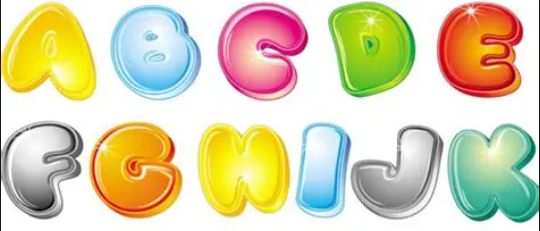

**优点：**

1. **减少 HTTP 请求数**：这是最主要的目的，将多个图片请求合并为一个，极大提高页面加载速度
2. **减少图片总字节数**：合并后的大图比所有小图片的总和要小（减少了重复的颜色表、格式信息等）

 **缺点：**

1. **开发维护成本高**：需要精确计算每个背景图的位置，后期增删图标麻烦
2. **内存压力**：大图片加载后始终占用内存，即使只显示其中一小部分
3. **不适用于自适应布局**：在高清屏（Retina）下或使用 `zoom` 时，图片可能失真模糊

**现代替代方案**： iconfont（字体图标）、SVG sprites

**核心原理**：

将网页中的一些小背景图像整合到一张大图中 ，这样服务器只需要一次请求就可以了

实现步骤：

1. 创建盒子，**盒子尺寸**与**小图**尺寸**相同**
2. 设置盒子**背景图**为精灵图
3. 添加 `background-position `属性，改变**背景图位置**
4. 使用 PxCook 测量小图片**左上角坐标**
5. 取**负数**坐标为 background-position 属性值（向左上移动图片位置）

## 使用
**使用精灵图核心：**

1. 精灵技术主要针**对于背景图片**使用。就是把多个小背景图片整合到一张大图片中
2. 这个大图片也称为 sprites  精灵图或者雪碧图
3. **移动背景图片位置**，此时可以使用 `background-position`
4. 移动的距离就是这个目标图片的 x 和 y 坐标。注意网页中的坐标有所不同
5. 因为一般情况下都是往上往左移动，所以数值是负值
6. 使用精灵图的时候需要精确测量，每个小背景图片的大小和位置

**注意事项**

**参数是方位名词**

如果指定的两个值都是方位名词，则两个值前后顺序无关，比如 left  top 和 top  left 效果一致

如果只指定了一个方位名词，另一个值省略，则第二个值默认居中对齐

**参数是精确单位**

如果参数值是精确坐标，那么第一个肯定是 x 坐标，第二个一定是 y 坐标

如果只指定一个数值，那该数值一定是 x 坐标，另一个默认垂直居中

**参数是混合单位**

如果指定的两个值是精确单位和方位名词混合使用，则第一个值是 x 坐标，第二个值是 y 坐标

**使用精灵图核心总结：**

1. 精灵图主要**针对于小的背景图片**使用
2. 主要借助于背景位置来实现---**background-position** 
3. 一般情况下精灵图都是**负值**。（千万注意网页中的坐标： x轴右边走是正值，左边走是负值， y轴同理。）

# 布局排版
网页布局，类似于报纸排版，主要依靠 div + css 来实现，为了提高布局效率，一般遵循以下布局流程

+ 确定版心的有效使用面积，主要元素及其内容所在区域，一般在浏览器窗口水平居中,一般尺寸为1200-1920px，为了适配主流分辨率显示器，一般设计版心为1000-1200px
+ 分析页面中的模块，对页面有整体规划，以及模块之间包含关系和并列关系
+ 控制网页的各个模块，运用盒模型原理，布局各个模块

## 单列布局
“单列布局”是网页布局的基础，所有复杂的布局都是在此基础上演变而来的

## 两栏布局
```css
.container {}
.aside {/* 一般侧边栏定宽 */
    float: right;
    width: 300px;
    margin-left: 20px;
}
.main {
/* float: right; */
/* BFC避开浮动盒子*/
overflow: hidden;
/* width: 600px; */
}

```

## 三栏布局
```css
.left {
    float: left;
    width: 300px;
    margin-right: 20px;
}
.right {
    float: right;
    width: 300px;
    margin-left: 20px;
}
```

```css
.container {
    padding: 10px;
    border: 1px solid #ccc;
    min-width: 1000px;
}
.main {
    overflow: hidden;
    border: 1px solid #000000;
}
```

## 通栏布局
无论单栏或三栏布局，为了美观网站中的一些模块，栗如头部、导航栏、页面底部等通常需要通栏显示，设置为通栏后无论放大缩小，该模块都会横铺于浏览器窗口

通栏布局关键在相应模块外部添加一层 div ，并将宽度设置为100%

## HTML5 结构标签
在使用DIV+CSS布局时，需要通过为div命名的方式，来区分网页中不同的模块

在HTML5中布局方式有了新的变化，HTML5中增加了新的结构标签


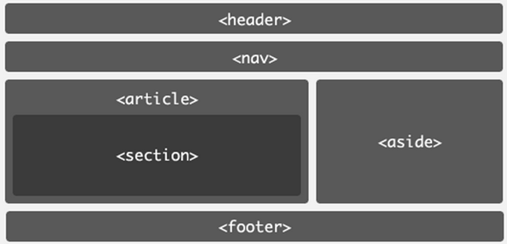

**header**	

HTML5中的header元素是一种具有引导和导航作用的结构元素，该元素可以包含所有通常放在页面头部的内容

**nav**

nav元素用于定义导航链接，是HTML5新增的元素，该元素可以将具有导航性质的链接归纳在一个区域中，使页面元素的语义更加明确

**footer**

用于定义一个页面或者区域的底部，它可以包含所有通常放在页面底部的内容

**article**

代表文档、页面或者应用程序中与上下文不相关的独立部分，该元素经常被用于定义一篇日志、一条新闻或用户评论等

**section**

用于对网站或应用程序中页面上的内容进行分块，一个section元素通常由内容和标题组成

**aside**

用来定义当前页面或者文章的附属信息部分，它可以包含与当前页面或主要内容相关的引用、侧边栏、广告、导航条等其他类似的有别于主要内容的部分

## 网页模块命名规范
+ 避免使用中文（例如id=“导航栏”）
+ 不能以数字开头 （例如id=“1nav”）
+ 不能占用关键字 （栗如id = h1）
+ 驼峰式或帕斯卡命名，尽量简介（userName、user_name)

**常用命名：**

| 相关模块 | 命名 | 相关模块 | 命名 |
| :---: | :---: | :---: | :---: |
| 头部 | header | 内容 | content |
| 导航栏 | nav | 尾部 | footer |
| 侧栏 | sidebar | 栏目 | column |
| 左、中、右 | left、center、right | 登录条 | loginbar |
| 标志 | logo | 广告 | banner |
| 页面主体 | main | 热点 | hot |
| 新闻 | news | 下载 | download |
| 子导航 | subnav | 菜单 | menu |
| 子菜单 | sunmenu | 搜索 | search |
| 友情链接 | frlEndlink | 版权 | copyright |
| 滚动 | scroll | 标签页 | tab |
| 文章列表 | list | 提示信息 | msg |
| 小技巧 | tips | 栏目标题 | title |
| 加入 | joinus | 指南 | guild |
| 服务 | service | 注册 | regsiter |
| 状态 | status | 投票 | vote |
| 合作伙伴 | partner |  |  |

**css模块命名**

| css文件 | 命名 | css文件 | 命名 |
| :---: | :---: | :---: | :---: |
| 主要样式 | master | 基本样式 | base |
| 模块样式 | module | 版面样式 | layout |
| 主题 | themes | 专栏 | columns |
| 文字 | font | 表单 | forms |

## 等高问题
通常处理侧边栏高度不够

1. css3 弹性盒子
2. JavaScript 控制
3. 伪等高

```css
.container {
    overflow: hidden;
}
.aside {
     float: right;
     width: 300px;
     margin-left: 20px;
     height: 10000px;
     margin-bottom: -9990px;
}
```

# web字体图标
## web 字体
解决用户本地电脑没有安装相应字体

当用户没有安装相应字体时，强制让用户下载该字体

@font-face 指令制作新字体

```css
 <style>
@font-face {
    font-family: "我的字体";
    src: url();
}
 </style>
p{
    font-family: "我的字体","微软雅黑","sans-serif";
}
```

## 字体图标
字体图标：**展示的是图标，本质是字体**

作用：在网页中添加**简单的、颜色单一**的小图标

优点

+ **灵活性**：灵活地修改样式，例如：尺寸、颜色等
+ **轻量级**：体积小、渲染快、降低服务器请求次数
+ **兼容性**：几乎兼容所有主流浏览器
+ **使用方便**：先下载再使用

### 字体图标的产生
字体图标使用场景：  主要用于显示网页中通用、常用的一些小图标

精灵图是有诸多优点的，但是缺点很明显

1.图片文件还是比较大的

2.图片本身放大和缩小会失真

3.一旦图片制作完毕想要更换非常复杂

此时，有一种技术的出现很好的解决了以上问题，就是**字体图标 iconfont字体图标**提供一种方便高效的图标使用方式，**展示的是图标，本质属于字体总结：**

1.如果遇到一些结构和样式比较简单的小图标，就用字体图标

2.如果遇到一些结构和样式复杂一点的小图片，就用精灵图

**使用步骤**

字体图标是一些网页常见的小图标，我们直接网上下载即可。 因此使用可以分为：

1.字体图标的下载 

2.字体图标的引入 （引入到我们html页面中）

3.字体图标的追加 （以后添加新的小图标）

文字，可以设置文字属性，行盒排列

### 下载字体
iconfont 图标库：[https://www.iconfont.cn/](https://www.iconfont.cn/) 

登录 → 素材库 → 官方图标库 → 进入图标库 → 选图标，加入购物车 → 购物车，添加至项目，确定 → 下载至本地 
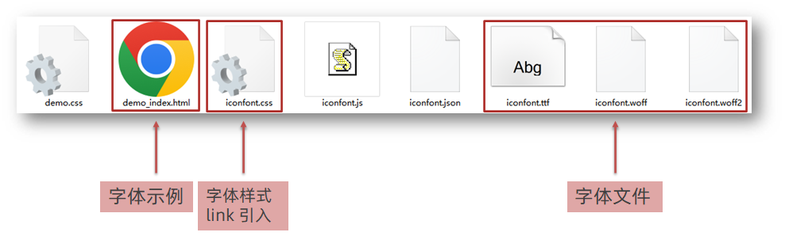

### 使用字体
1. 引入字体样式表（iconfont.css）

2. 标签使用字体图标类名iconfont：字体图标基本样式（字体名，字体大小等等）icon-xxx：图标对应的类名

```html
<span class="iconfont icon-xxx"></span>
```

### 上传矢量图
作用：项目特有的图标上传到 iconfont 图标库，生成字体
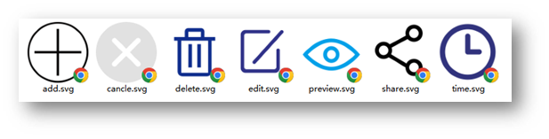

上传步骤：上传 → 上传图标 → 选择 svg 矢量图，打开 → 提交 → 系统审核

```css
<link rel="stylesheet" href="//at.alicdn.com/t/c/font_4727742_hhifpjir9t.css">
<style>
.iconfont {
    color: red;
    font-size: 40px;
    }
</style>
<p>
    /*两个类名 */
    <i class="iconfont icon-yonghu"></i>
</p>

```

```css
<link rel="stylesheet" href="./css字体/iconfont.css">
```

unicode方法

```css
@font-face {
    font-family: 'iconfont';
    /* Project id 4727742 */
}

.iconfont {
    font-family: "iconfont";
    color: red;
    font-size: 40px;
}
<p>
    <i class="iconfont">
        &#xe8ad;
    </i>
</p>

```


# 块级格式化上下文 BFC
**全称Block Formatting Context ,简称BFC**

是一块**独立的渲染区域**，规定了区域内部块级元素的布局规则，且该区域与外部元素的布局互不干扰

不同的BFC区域，进行渲染时互不干扰，隔绝了内部与外部的联系，内部的渲染不会影响到外部

具体规则：

+ 创建BFC的元素，它的自动高度需要计算浮动元素    
+ 创建BFC的元素，他的边框盒不会与浮动元素重叠，避开浮动元素
+ 创建BFC的元素，不会和他的子元素进行外边距合并

## BFC 的触发条件
满足以下任一条件的元素会创建一个 BFC：

1. 根元素（`<html>`）
2. 浮动元素（`float` 值为 `left`、`right` 或 `inline-start`、`inline-end`，非 `none`）
3. 定位元素（`position` 为 `absolute` 或 `fixed`）
4. 行内块元素（`display: inline-block`）
5. 表格单元格（`display: table-cell`，默认表格单元格的属性）
6. 表格标题（`display: table-caption`）
7. 弹性容器（`display: flex` 或 `inline-flex` 的直接子元素）
8. 网格容器（`display: grid` 或 `inline-grid` 的直接子元素）
9. `overflow` 值不为 `visible` 的元素（如 `overflow: hidden`、`auto`、`scroll`）
10. `contain: layout`、`content` 或 `paint` 的元素

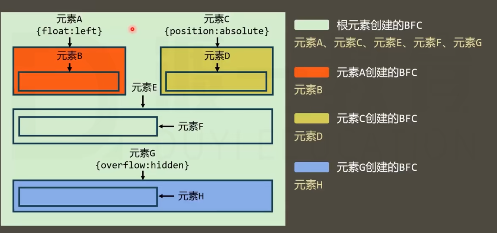

## BFC 的核心特性
1. **内部块级元素垂直排列**：BFC 内的块级元素会在垂直方向上依次排列，每个元素的顶部与前一个元素的底部对齐
2. **左边缘对齐**：在默认的左到右（LTR）布局中，BFC 内每个块级元素的左外边缘（margin-left）会触碰到容器的左内边缘（padding-left），即使存在浮动元素也是如此
3. **独立渲染，不影响外部**：BFC 是一个独立的隔离区域，内部元素的布局不会影响外部元素，反之亦然
4. **不与浮动元素重叠**：BFC 的区域不会与外部浮动元素的区域重叠（可用于实现自适应两栏布局）
5. **包含浮动元素**：计算 BFC 的高度时，其内部的浮动元素也会被计入（可用于清除浮动，解决父元素高度塌陷问题）
6. **防止 margin 重叠**：BFC 内的相邻块级元素垂直方向的 margin 不会发生合并（正常情况下，相邻元素的 margin 会取最大值合并）

## BFC 的典型应用场景

**清除浮动**：计算 BFC 高度时，其内的浮动元素也会参与计算，可以避免父容器高度塌陷

**防止外边距重叠**：

- 属于同一个 BFC 的两个相邻块级元素的垂直外边距会发生重叠
- **阻止两个元素 margin 合并**，必须把它们放在**两个不同的 BFC** 中  

**隔离元素**：BFC 内的元素不会在布局上影响到 BFC 外的元素

- BFC 是独立渲染隔离区，内外布局互不干扰；
- 触发：浮动、绝对定位、overflow≠visible、flex/grid、flow-root；
- 作用：清浮动防塌陷、不被浮动覆盖、阻止不同 BFC 间 margin 合并；
- 最优触发：`display:flow-root` 无副作用；

**解决父元素高度塌陷（清除浮动）**

当父元素包含浮动子元素时，父元素默认**不会计算浮动元素**的高度，导致**高度塌陷**


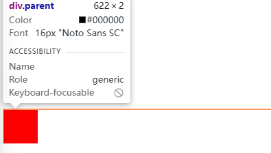

通过触发父元素的 BFC，可让父元素包含浮动元素，从而撑起高度


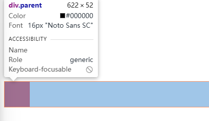

```css
.parent {
  overflow: hidden; /* 触发BFC */
  border: 1px solid red;
}
.child {
  float: left; /* 浮动元素 */
  width: 100px;
  height: 100px;
  background: red;
  border: 1px solid red;
}
```

**防止垂直 margin 重叠**  
相邻块级元素的垂直 margin 会合并（取最大值），将其中一个元素放入 BFC 容器中可避免合并

```html
<div class="box1">Box1</div>
<div class="bfc-container">
  <div class="box2">Box2</div>
</div>
```

```css
.box1 {
  margin-bottom: 20px;
  height: 50px;
  background: blue;
}
.box2 {
  margin-top: 30px;
  height: 50px;
  background: green;
}
.bfc-container {
  overflow: hidden; /* 触发BFC */
}
```

此时box1 的`margin-bottom:20px`和 box2 的`margin-top:30px`不会合并，总间距为 50px

**实现自适应两栏布局**

左侧固定宽度且浮动，右侧通过触发 BFC 可避免被左侧覆盖，同时自适应剩余宽度

```html
<div class="left">左侧固定宽度</div>
<div class="right">右侧自适应</div>
```

```css
.left {
  float: left;
  width: 200px;
  height: 300px;
  background: red;
}
.right {
  overflow: hidden; /* 触发BFC */
  height: 300px;
  background: blue;
}
```

# 重排（Reflow）重绘（Repaint）

### 渲染流程回顾

DOM 构建 → CSSOM → Render Tree → Layout → Paint → Composite

​                                    (Reflow)  (Repaint) (GPU)

### 三者区别

**重排（Reflow）**：元素布局变化（如尺寸、位置、隐藏）导致浏览器重新计算布局，消耗最高

**重绘（Repaint）**：元素样式变化但不影响布局（如颜色、背景），消耗次之

**合成（Composite）**：将页面分层绘制后合并，由 GPU 处理（如 `transform: translate()`）

**关系**：重排必然导致重绘，重绘不一定导致重排，合成不触发重排和重绘

| **阶段**              | **触发条件**                                   | **性能消耗**             |
| --------------------- | ---------------------------------------------- | ------------------------ |
| **重排（Reflow）**    | 元素几何属性改变（尺寸、位置、显示/隐藏）      | **最高**（必然触发重绘） |
| **重绘（Repaint）**   | 外观改变但不影响布局（颜色、背景、visibility） | 中等                     |
| **合成（Composite）** | `transform`/`opacity` 变化                     | **最低**（GPU 加速）     |

### 触发条件速查

**会触发重排的属性**：`width/height`、`margin/padding`、`top/left`、`display`、`font-size`、`border-width`

**只触发重绘的属性**：`color`、`background`、`visibility`、`border-color`、`outline`

**只触发合成的属性**：`transform`、`opacity`、`filter`（部分）

### 优化策略

1. **集中改变样式**：用 `classList` 或 `cssText` 批量修改
2. **使用 DocumentFragment**：多次 DOM 操作后一次性添加
3. **先隐藏再操作**：`display: none` 的元素不参与重排重绘
4. **避免 Table 布局**：Table 小改动会导致整体重排
5. **缓存布局值**：多次读取 `offsetTop` 等值时用变量缓存
6. **CSS 硬件加速**：

```css
.animate {
  transform: translateZ(0);  /* 强制开启 GPU */
  will-change: transform;   /* 提前告知浏览器优化 */
}
```


# 常见布局技巧

## margin负值运用


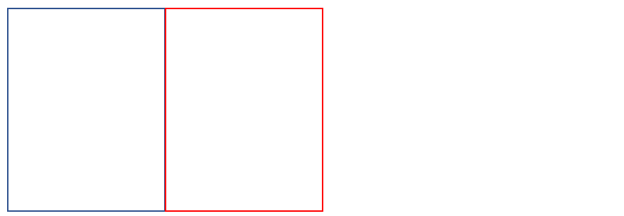

1.让每个盒子margin 往左侧移动 -1px 正好压住相邻盒子边框

2.鼠标经过某个盒子的时候，提高当前盒子的层级即可（如果没有有定位，则加相对定位（保留位置），如果有定位，则加z-index）

## 文字围绕浮动元素

**效果**


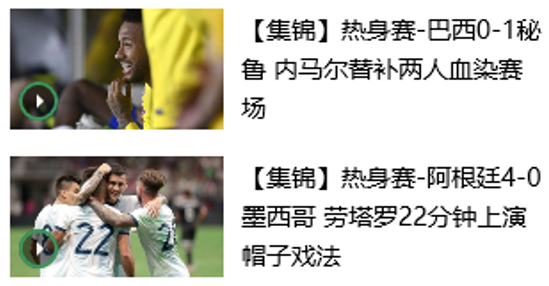

**布局示意图**


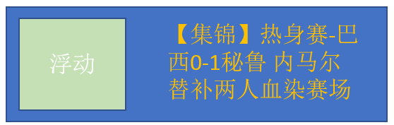

**巧妙运用浮动元素不会压住文字的特性**

## 行内块巧妙运用


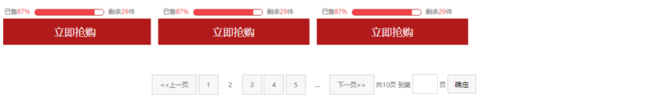

页码在页面中间显示:

把这些链接盒子转换为行内块， 之后给父级指定  text-align:center;

利用行内块元素中间有缝隙，并且给父级添加 text-align:center; 行内块元素会水平会居中


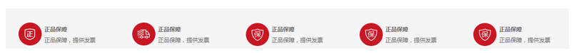

## CSS 三角形

```css
div{
    width:0;
    height:0;
    border-width:10px;
    border-style:solid;
    border-color:1 , 2 , 3 ,4 
    border-left -color:red;
}
 div {
     width: 0; 
    height: 0;
    border: 50px solid transparent;
    border-color: red green blue black;
    line-height:0;
    font-size: 0;
 }
```

用css 边框可以模拟三角效果

宽度高度为0

4个边框都要写， 只保留需要的边框颜色，其余的不能省略，都改为 transparent 透明就好了

为了照顾兼容性 低版本的浏览器，加上 font-size: 0;  line-height: 0;

## 单行文本溢出省略


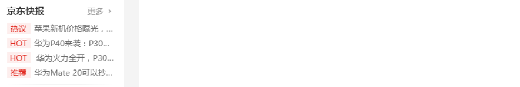

单行文本溢出显示省略号--必须满足三个条件：

```css
  /*1. 先强制一行内显示文本*/
   white-space: nowrap;  （ 默认 normal 自动换行）
   
  /*2. 超出的部分隐藏*/
   overflow: hidden;
   
  /*3. 文字用省略号替代超出的部分*/
   text-overflow: ellipsis;
```

## 多行文本溢出省略（了解）
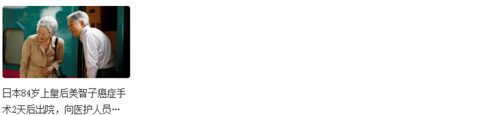

多行文本溢出显示省略号，**有较大兼容性问题**，适合于webKit浏览器或移动端（移动端大部分是webkit内核）

```css
/*1. 超出的部分隐藏 */
overflow: hidden;

/*2. 文字用省略号替代超出的部分 */
text-overflow: ellipsis;

/* 3. 弹性伸缩盒子模型显示 */
display: -webkit-box;

/* 4. 限制在一个块元素显示的文本的行数 */
-webkit-line-clamp: 2;

/* 5. 设置或检索伸缩盒对象的子元素的排列方式 */
-webkit-box-orient: vertical;
```

**更推荐让后台人员来做这个效果，因为后台人员可以设置显示多少个字，操作更简单**


# 对其居中总结

居中： 盒子在其包含块中居中

### vertical-align 行内块元素对齐

CSS 的 **vertical-align** 属性使用场景： 

**设置图片或者表单(行内块元素）和文字垂直对齐**

官方解释： 用于设置一个元素的**垂直对齐方式**，但是它只针对于行内元素或者行内块元素有效

```css
vertical-align : baseline | top | middle | bottom 
```

|    值    | 描述                                 |
| :------: | ------------------------------------ |
| baseline | 元素放置在父元素的基线上(**默认** )  |
|   top    | 元素的顶端与行中最高的顶端对齐       |
|  middle  | 把此元素放置在父元素的中部           |
|  bottom  | 把元素的顶端与行中最低的元素顶端对齐 |


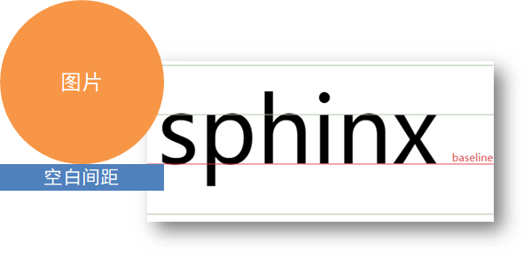

**图片底部空白缝隙**

bug：图片底侧会有一个空白缝隙，原因是**行内块元素会和文字的基线对齐**

主要解决方法有两种：

+ **给图片添加 vertical-align:middle | top| bottom 等 （提倡使用的）**
+ 把图片转换为块级元素  **display: block**; 


### 元素水平垂直居中 - Flex布局方案

**Flex 居中**

`display: flex` 开启弹性布局；

`justify-content: center` 水平居中；

`align-items: center` 垂直居中，组合实现**元素水平 + 垂直居中**

```css
/* Flex 方案 */
.parent {
  display: flex;
  justify-content: center;
  align-items: center;
}

/* Grid 方案（更简洁） */
.parent {
  display: grid;
  place-items: center;
}
```

### 元素水平垂直居中 - 传统定位方案

 核心都是先把元素左上角挪到父容器中心，再反向偏移修正

**方案 1：定位 + transform（推荐，宽高自适应）**

- 父级`relative`作为定位参照，子级`absolute`脱离文档流
- `top:50%`/`left:50%`：将子元素**左上角**移到父容器中心点
- `translate(-50%, -50%)`：按**自身宽高的 50%** 向左、向上偏移，实现居中
- 优点：**不依赖元素固定宽高**，自适应任意尺寸，兼容性良好

**方案 2：定位 + 负 margin（仅固定宽高可用）**

- 同样先用`top/left:50%`把元素左上角定位到父容器中心
- 负`margin`：需手动设置为**自身宽、高的一半**，反向偏移完成居中
- 缺点：**必须已知子元素固定宽高**，尺寸变化就会失效，灵活性差

```css
/* 方案1：定位 + Transform（宽高未知） */
.parent { position: relative; }
.child {
  position: absolute;
  top: 50%;
  left: 50%;
  transform: translate(-50%, -50%);
}

/* 方案2：定位 + 负 margin（宽高已知） */
.child {
  position: absolute;
  top: 50%;
  left: 50%;
  margin-top: -50px;    /* 高度的一半 */
  margin-left: -100px;   /* 宽度的一半 */
}
```

### 行内元素水平居中

**使用** `text-align: center`

**原理**：`text-align` 属性用于设置块级元素内文本内容的水平对齐方式

当值为 `center` 时，块级元素内的行内元素（如 `span`、`a` 等）会在水平方向上居中对齐

```html
<div class="parent">
    <span class="child">我是行内元素，要水平居中</span>
</div>
.parent {
  text-align: center;
}
```

**注意事项**：该方法会使块级元素内所有行内元素水平居中，若只想让特定行内元素居中，需注意元素结构和样式作用范围。同时，`text-align` 属性具有继承性，子元素可能会受到影响


### 块级元素水平居中

**已知宽度的块级元素使用** `margin: 0 auto`

**原理**：

当块级元素设置了明确宽度，且 `margin` 的左右值设置为 `auto` 时

浏览器会自动将左右外边距分配为相等的值，从而使元素在父容器中水平居中

```html
<div class="parent">
    <div class="child">我是已知宽度的块级元素，要水平居中</div>
</div>
```

```css
.parent {
    border: 1px solid black;
}
.child {
    width: 200px;
    margin: 0 auto;
    background-color: lightblue;
}
```

**注意事项**：

父容器必须是块级元素且有明确的宽度或足够的空间容纳子元素

若子元素脱离文档流（如设置了 `float`、`position: absolute` 等），该方法将失效

### 单行文本垂直居中

+ 行高的上空隙和下空隙把文字挤到中间了
+ 如果行高小于盒子高度,文字会偏上
+ 如果行高大于盒子高度,则文字偏下


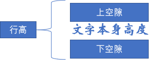

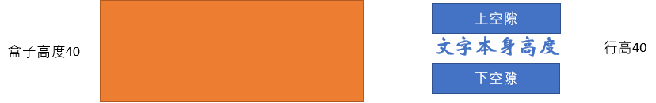

```css
/* 单行文本垂直居中 */
.text {
  height: 50px;
  line-height: 50px;
}

/* 表格单元格方案 */
.parent {
  display: table-cell;
  vertical-align: middle;
  text-align: center;
}
```

### 块级元素垂直居中

**已知高度的块级元素使用** `position` **和** `margin`

**原理**：

将父容器设置为相对定位（`position: relative`），子元素设置为绝对定位（`position: absolute`）

通过 `top: 50%` 将子元素的上边缘定位到父容器垂直方向的中点

然后通过 `margin - top` 设置为子元素高度的一半并取负值，将子元素向上偏移自身高度的一半，从而实现垂直居中

```html
<div class="parent">
    <div class="child">我是已知高度的块级元素，要垂直居中</div>
</div>
.parent {
    position: relative;
    height: 300px;
    border: 1px solid black;
}
.child {
    position: absolute;
    top: 50%;
    height: 100px;
    margin - top: -50px;
    background-color: lightblue;
}
```

**注意事项**：

- 子元素必须有明确的高度值

- 若子元素高度不确定，该方法无法实现垂直居中
- 同时，绝对定位会使子元素脱离文档流，可能影响其他元素的布局

# CSS 3 动画效果
网页中需要显示画或特效时，需要使用JavaScript脚本或者Flash来实现

在CSS3中，提供了对动画的强大支持，可以实现旋转、缩放、移动和过渡等效果

## 过渡
不使用flash 和JavaScript 脚本的情况下，为元素从一种样式转变为另一种样式添加效果，栗如渐显、渐影，速度的变化等

可以制作 鼠标指针悬浮至导航栏上时，导航css样式渐变

作用：可以为一个元素在不同状态之间切换的时候添加**过渡效果**

属性名：**transition（复合属性）**

属性值：**过渡的属性  花费时间 (s)**

提示：

+ 过渡的属性可以是**具体的 CSS 属性**
+ 也可以为 **all**（两个状态属性值不同的所有属性，都产生过渡效果）
+ transition 设置给**元素本身**

```css
img {
  width: 200px;
  height: 200px;
  transition: all 1s;
}

img:hover {
  width: 500px;
  height: 500px;
}
```

```css
div {
    width: 100px;
    height: 100px;
    background-color: blue;
}

div:hover {
    background-color: brown;
    transition-property: background-color;
    transition-duration: 5s;
    transition-timing-function:ease-in-out;
    transition-delay: 1s;
}
```

### transition-property 过渡属性
用于设置应用过渡的css 属性

```css
transition-property: background-color;
```

设置应用过渡的 css 属性

+ none

	没有属性会获得过渡效果

+ all

	所有属性豆浆获得过渡效果

+ property

	定义应用过渡效果的css 属性名称，多个名称之间以逗号分隔

### transition-duration 过渡时间
用于定义过渡效果持续时间，默认值为0，单位通常使用秒 S ，毫秒 ms

### transition-timing-function 速度曲线
规定过渡效果的速度曲线

```css
transition-timing-function: cubic-bezier(n, n, n, n);
```

| 属性值 | 描述 |
| --- | --- |
| linear | 以相同速度开始至结束的过渡效果 cubic-bezier(0, 0, 1, 1) |
| ease | 慢速开始，后加速，最后慢结束 cubic-bezier(0.25, 0.1, 0.25, 0.1) |
| ease-in | 慢速开始逐渐加快 cubic-bezier(0.42, 0, 1, 1) |
| ease-out | 慢速结束 cubic-bezier(0, 0, 0.58, 1) |
| ease-in-out | 慢速开始和结束 cubic-bezier(0.42, 0, 0.58, 1) |
| cubic-bezier(n,n,n,n) | 贝塞尔曲线 |

### transition-delay 延迟
```css
transition-delay:time;
```

用于规定过渡效果的开始时间，默认属性为0，单位通常使用秒 S ，毫秒 ms ，当设置为负数时，过渡动作会从该时间点开始，之前动作截断

### transition 速写
无论是单个属性还是简写属性，使用时都可以实现多个过渡效果。如果使用transition简写属性设置多种过渡效果，需要为每个过渡属性集中指定所有的值，并且使用逗号进行分隔。

```css
transition:property duration timing-function delay;
transition:border-radios 2s ease-in-out 2s;
```

## 2D 平面转换
作用：为元素添加动态效果，一般与过渡配合使用

概念：改变盒子在平面内的形态（位移、旋转、缩放、倾斜）

**transform**

CSS3的变形（transform）属性可以让元素在一个坐标系统中变形

transform属性的默认值为none，适用于内联元素和块元素，表示不进行变形

transform-function用于设置变形函数，可以是一个或多个变形函数列表

| **方法** | **说明** |
| :--- | :--- |
| `matrix()` | 定义**矩阵变换**，基于 X/Y 坐标变换元素位置。 |
| `translate()` | **平移元素**，基于 X/Y 坐标重新定位（如 `translate(10px, 20px)` |
| `scale()` | **缩放元素**，改变尺寸 |
| `rotate()` | **旋转元素**，取值为度数值（如 `rotate(45deg)`等角度单位） |
| `skew()` | **倾斜元素**，沿 X/Y 轴倾斜： |

css3 中，2D变形主要包括4种变形效果，分别是：平移、缩放、倾斜、旋转

### 平移
平移指元素位置的变化，包括垂直移动和水平移动

```css
transform：transla(x-value,y-value)
```

参数值常用单位为像素和百分比，为负值时，表示反方向移动元素

坐标点默认为元素中心点，然后根据指定的x坐标和 y 坐标进行移动

**取值**

+ 像素单位数值
+ 百分比（参照**盒子自身尺寸**计算结果）
+ **正负**均可

**技巧**

+ translate() **只写一个值**，表示沿着 **X** 轴移动
+ 单独设置 X 或 Y 轴移动距离：translateX() 或 translateY()

### 缩放
```css
transform: scale(缩放倍数);
transform: scale(X轴缩放倍数, Y轴缩放倍数);
```

技巧

+ 通常，只为 scale() 设置**一个值**，表示 X 轴和 Y 轴**等比例缩放**
+ 取值大于1表示放大，取值小于1表示缩小

### 倾斜
```css
transform:skew(x-value,y-value)
```

参数x-value,y-value分别定义水平 x 轴 和竖直 y 轴的倾斜角度，参数值为角度，单位为deg，若省略第二个参数，默认值为0

### 旋转
```css
transform:rotate(align)
```

参数 align 表示要旋转额度角度值，单位为deg，正值按顺时针方向旋转，否则按逆时针

**取值**：角度单位是 **deg技巧**

+ 取值**正负均可**
+ 取值为**正**，**顺**时针旋转
+ 取值为**负**，**逆**时针旋转

### 转换原点
> 默认情况下，转换原点是盒子中心点 
>

```css
transform-origin: 水平原点位置 垂直原点位置;
```

**取值：**

+ **方位名词**（left、top、right、bottom、center）
+ 像素单位数值
+ 百分比

	以上变形都是基于元素中心点，默认情况下元素中心点在 x 轴 和 y 轴的50%位置

```css
transform-origin(x-axis y-axis z-axis)
```

包括三个参数，默认情况下为 50% 50% 0px，x-axis y-axis用于2d变形，z-axis 表示控件纵深坐标，用于 3D 变形

| 参数 | 描述 |
| --- | --- |
| x-axis | 视图被置于X 轴何处，属性值为百分比、像素，也可为top等关键字 |
| y-axis | 视图被置于Y 轴何处，属性值为百分比、像素，也可为top等关键字 |
| z-axis | 视图被置于Z 轴何处，属性值为不能设置百分比，否则无效 |

### 多重转换
**多重转换技巧：先平移再旋转**

```css
transform: translate() rotate();
```

多重转换原理：以第一种转换方式坐标轴为准转换形态

+ 旋转会改变网页元素的坐标轴向
+ 先写旋转，则后面的转换效果的轴向以旋转后的轴向为准，会影响转换结果

## 3D空间转换
+ 空间：是从坐标轴角度定义的 X 、Y 和 Z 三条坐标轴构成了一个立体空间，Z 轴位置与视线方向相同。
+ 空间转换也叫 3D转换
+ 属性：transform
  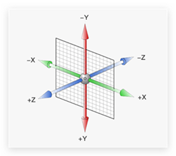

### 平移
```css
transform: translate3d(x, y, z);
transform: translateX();
transform: translateY();
transform: translateZ();
```

> 取值与平面转换相同
>
> 默认情况下，Z 轴平移没有效果，原因：电脑屏幕默认是平面，无法显示 Z 轴平移效果
>

### 视距
作用：指定了**观察者**与 Z=0 平面的**距离**，为元素添加**透视效果**

透视效果：**近大远小、近实远虚**

属性：(添加给**直接父级**，取值范围 800-1200)

```css
perspective: 视距;
```


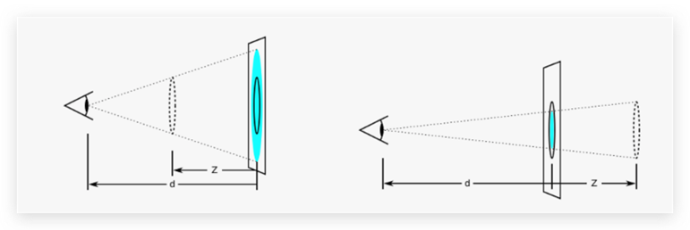

### 旋转
+ Z 轴：rotateZ()
+ X 轴：rotateX()
+ Y 轴：rotateY()

### 立体呈现
作用：设置元素的子元素是位于 3D 空间中还是平面中

属性名：**transform-style**

属性值：

+ flat：子级处于平面中
+ preserve-3d：子级处于 3D 空间

呈现立体图形步骤

+ **父元素**添加**transform-style: preserve-3d,**
+ 子级**定位**
+ 调整子盒子的**位置**(位移或旋转)

### **rotate3d() 函数**
CSS 函数定义一个变换，它将元素围绕固定轴移动而不使其变形

运动量由指定的角度定义; 如果为正，运动将为顺时针，如果为负，则为逆时针

+ rotate3d(x, y, z, 角度度数) ：用来设置自定义旋转轴的位置及旋转的角度
+ x，y，z 取值为0-1之间的数字

```css
transform:rotateX(a);
transform:rotateY(a);

rotate3d(x, y, z, angle)
transform: rotate3d(1, 1, 1, 45deg);
```

x,y,z以是 0 到 1 之间的数值，表示旋转轴坐标方向的矢量

参数a用于定义旋转的角度值，单位为deg，其值可以是正数也可以是负数

如果值为正，元素将围绕轴顺时针旋转；反之，如果值为负，元素围绕X轴逆时针旋转。

#### perspective属性
可以简单的理解为视距，主要用于呈现良好的3D透视效果

```css
perspective:参数值;
```

perspective属性参数值可以为none或者数值（一般为像素），其透视效果由参数值决定，参数值越小，透视效果越突出

| **属性名称** | **描述** | **属性值** |
| :--- | :--- | :--- |
| `transform-style` | 控制元素的 3D 空间保留 | `flat`默认，子元素不保留 3D 位置   `preserve-3d`子元素保留 3D 位置） |
| `backface-visibility` | 定义元素背对屏幕时的可见性 | `visible`背面可见   `hidden`背面不可见 |

| **方法名称** | **描述** |
| :--- | :--- |
| `translate3d(x,y,z)` | 定义 3D 位移 |
| `translateX(x)` | 定义 3D 位移，仅用 X 轴的值 |
| `translateY(y)` | 定义 3D 位移，仅用 Y 轴的值 |
| `translateZ(z)` | 定义 3D 位移，仅用 Z 轴的值 |
| `scale3d(x,y,z)` | 定义 3D 缩放 |
| `scaleX(x)` | 定义 3D 缩放，通过 X 轴的值 |
| `scaleY(y)` | 定义 3D 缩放，通过 Y 轴的值 |
| `scaleZ(z)` | 定义 3D 缩放，通过 Z 轴的值 |

## 渐变
### 线性渐变
起始颜色会沿着一条直线按顺序过渡到结束颜色

运用CSS3中的 `background-image:linear-gradient（参数值）`样式可以实现线性渐变效果。

```css
background-image: linear-gradient(
  渐变方向,
  颜色1 终点位置,
  颜色2 终点位置,
  ......
);
background-image:linear-gradient(30deg,green,blue);

background-image: linear-gradient(
      透明
    transparent,
    rgba(0,0,0,0.5)
);
```

取值：

**渐变方向**：可选

+ to 方位名词
+ 角度度数

**终点位置**：可选

+ 百分比

**渐变角度**

指的是水平线和渐变线之间的夹角，可使用deg 为单位的角度数值或 to + top、left等关键字

0 deg 对应 to top

90 deg 对应 to right

180 deg 对应 to bottom （默认值）

270 deg 对应 to left

**颜色**

颜色用于设置渐变颜色，其中颜色1 为起始颜色，颜色n 为结束颜色，中间可以添加多个用英文逗号隔开的颜色

### 径向渐变
径向渐变同样是网页中一种常用的渐变，在径向渐变过程中，起始颜色会从一个中心点开始，按照椭圆或圆形形状进行扩张渐变。

运用CSS3中的`background-image:radial-gradient（参数值）;`

```css
background-image: radial-gradient(
    渐变形状,圆心位置,颜色值1,颜色值2,,,,颜色值n
);
background-image: radial-gradient(
  半径 at 圆心位置,
  颜色1 终点位置,
  颜色2 终点位置,
  ......
);
```

**取值：**

+ 半径可以是2条，则为椭圆
+ 圆心位置取值：像素单位数值 / 百分比 / 方位名词

**渐变形状**

+ 像素、百分比：定义形状的水平和垂直半径，栗如“80px 50px” 表示一个椭圆
+ eircle：指定圆形的径向渐变
+ ellipse：指定椭圆的径向渐变

**圆心位置**

确定元素渐变的中心位置，使用 at 加上关键字或者参数值来确定

+ 像素、百分比，定义圆心的水平和垂直坐标，可为负值
+ left：设置左边为径向渐变圆心的横坐标值
+ center：设置中间为径向渐变圆心的横纵坐标值 （默认值）
+ right：设置右边为径向渐变圆心的横坐标值

**颜色**

颜色用于设置渐变颜色，其中颜色1 为起始颜色，颜色n 为结束颜色，中间可以添加多个用英文逗号隔开的颜色

**应用**

按钮高光

### 重复渐变
```css
repeating-linear-gradient()
repeating-radial-gradient()
```

+ 重复线性渐变

	采用相同的参数，会在所有方向上重复渐变以覆盖其整个容器

+ 重复径向渐变采用相同的参数，会在所有方向上无限重复色标，以覆盖其整个容器

## 动画
过渡和变形只能设置元素的变换过程，并不能对过程中的某一环节进行精确控制，例如过渡和变形实现的动态效果不能够重复播放。为了实现更加丰富的动画效果，CSS3提供了animation属性，使用animation属性可以定义复杂的动画效果

+ 过渡：实现两个状态间的变化过程
+ 动画：实现多个状态间的变化过程，动画过程可控（重复播放、最终画面、是否暂停）

**定义动画**

```css
/* 方式一 */
@keyframes 动画名称 {
  from {}
  to {}
}

/* 方式二 */
@keyframes 动画名称 {
  0% {}
  10% {}
  ......
  100% {}
}
```

**使用动画**

```css
animation: 动画名称 动画花费时长;
```

### animation复合属性

```css
animation: 动画名称 动画时长 速度曲线 延迟时间 重复次数 动画方向 执行完毕时状态；
```

提示：

+ **动画名称**和**动画时长**必须赋值
+ 取值**不**分先后顺序
+ 如果有**两个时间**值，**第一个**时间表示**动画时长**，**第二个**时间表示**延迟时间**

### animation拆分写法
| 属性                        | 作用               | 取值                                            |
| --------------------------- | ------------------ | ----------------------------------------------- |
| `animation-name`            | 动画名称           | -                                               |
| `animation-duration`        | 动画时长           | -                                               |
| `animation-delay`           | 延迟时间           | -                                               |
| `animation-fill-mode`       | 动画执行完毕时状态 | `forwards`：最后一帧状态`backwards`：第一帧状态 |
| `animation-timing-function` | 速度曲线           | `steps(数字)`：逐帧动画                         |
| `animation-iteration-count` | 重复次数           | `infinite`：无限循环                            |
| `animation-direction`       | 动画执行方向       | `alternate`：反向                               |
| `animation-play-state`      | 暂停动画           | `paused`：暂停，通常配合 `:hover` 使用属性      |

```css
@keyframes animationname{
    keyframes-selector{css-styles;}
}
```

+ animationname:	表示当前动画的名称，作为引用时的唯一标识，不可为空
+ keyframes-selector：	关键帧选择器，指定当前关键帧要应用到整个动画过程中的位置，值可以是一个百分比、from、或者to，其中form和0%效果相同表示动画的开始，to 和 100% 表示动画的结束
+ css-styles

	定义执行到当前关键帧时对应的动画状态，由css 样式属性进行定义，多个属性之间用分号隔开，不可为空

### animation-name
```css
animation-name: keyframename | none;
```

用于定义要应用的**动画名称**

animation-name 属性初始值为none，适用于所有块元素和行内元素。keyframename参数用于规定需要绑定到选择器的keyframe的名称，如果值为none，则表示不应用任何动画，通常用于覆盖或者取消动画。

### animation-duration
```css
animation-duration: time;
```

用于定义整个动画效果完成所需要的**时间**，以秒或毫秒计

animation-duration 属性初始值为0，适用于所有块元素和行内元素。time参数是以秒（s）或者毫秒（ms）为单位的时间，默认值为0，表示没有任何动画效果。当值为负数时，则被视为0。

### animation-timing-function
```css
animation-timing-function:value;
```

用来规定动画的**速度曲线**，可以定义使用哪种方式来执行动画效果

animation-timing-function包括linear、ease-in、ease-out、ease-in-out、cubic-bezier(n,n,n,n)等常用属性值

| **属性值** | **描述** |
| :--- | :--- |
| linear | 动画从头到尾的速度是相同的 |
| ease | 默认。动画以低速开始，然后加快，在结束前变慢 |
| ease-in | 动画以低速开始 |
| ease-out | 动画以低速结束 |
| ease-in-out | 动画以低速开始和结束 |
| cubic-bezier(n,n,n,n) | 在 cubic-bezier 函数中自定义值，参数为 0 到 1 的数值 |

### animation-delay
```css
animation-delay:time;
```

用于定义执行动画效果**之前延迟时间**，即规定动画什么时候开始

参数time用于定义动画开始前等待的时间，其单位是秒或者毫秒，默认属性值为0。animation-delay属性适用于所有的块元素和行内元素。

### animation-iteration-count
```css
animation-iteration-count: number | infinite;
```

用于定义动画的**播放次数**

animation-iteration-count属性初始值为1，适用于所有的块元素和行内元素。如果属性值为number，则用于定义播放动画的次数；如果是infinite，则指定动画循环播放。

### animation-direction
```css
animation-direction: normal | alternate;
```

定义当前动画播放的**方向**，即动画播放完成后是否逆向交替循环。

animation-direction 属性初始值为normal，适用于所有的块元素和行内元素。该属性包括两个值，默认值normal表示动画每次都会正常显示。如果属性值是"alternate"，则动画会在奇数次数（1、3、5 等等）正常播放，而在偶数次数（2、4、6 等）逆向播放。

### animation
是一个简写属性，用于综合设置以上六个动画属性。

```css
animation: 
    animation-name 
    animation-duration 
    animation-timing-function 
    animation-delay 
    animation-iteration-count 
    animation-direction;
```

使用animation属性时必须指定animation-name和animation-duration属性，否则持续的时间为0，并且永远不会播放动画。


# 移动Web
## 移动 Web 基础
### 谷歌模拟器
模拟移动设备，方便查看页面效果
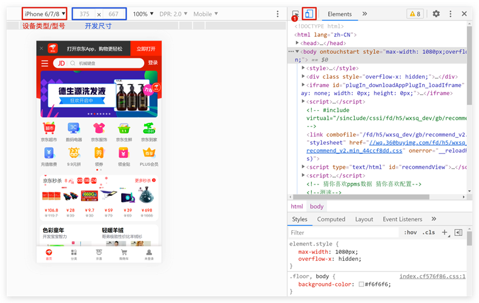

### 屏幕分辨率
**分类：**

+ **物理分辨率：硬件分辨率（出厂设置）**
+ **逻辑分辨率：软件 / 驱动设置**

结论：**制作网页参考 逻辑分辨率** 
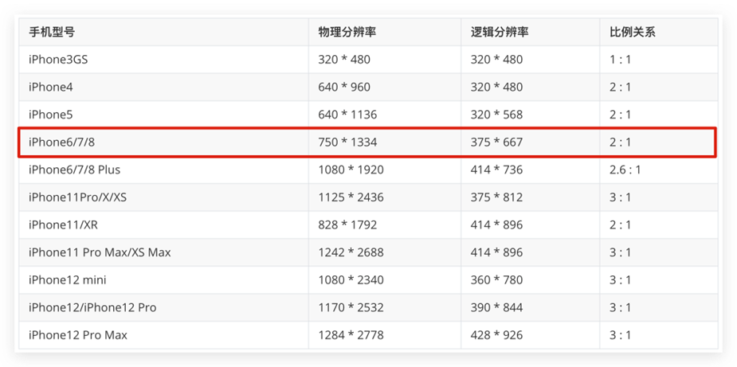

### 视口
作用：**显示 HTML 网页的区域，用来约束 HTML 的尺寸**

```html
<!DOCTYPE html>
<html lang="en">
<head>
  <meta charset="UTF-8">
  <meta http-equiv="X-UA-Compatible" content="IE=edge">

  <!– 视口标签 规定HTML尺寸，使HTML宽度等于逻辑分辨率宽度 -->
  <meta name="viewport" content="width=device-width, initial-scale=1.0">

  <title>Document</title>
</head>
<body>
  
</body>
</html>

```

+ **width=device-width：视口宽度 = 设备宽度**
+ initial-scale=1.0：缩放1倍（不缩放）

### 二倍图
概念：设计稿里面每个元素的尺寸的倍数

作用：防止图片在高分辨率屏幕下模糊失真

使用方法：
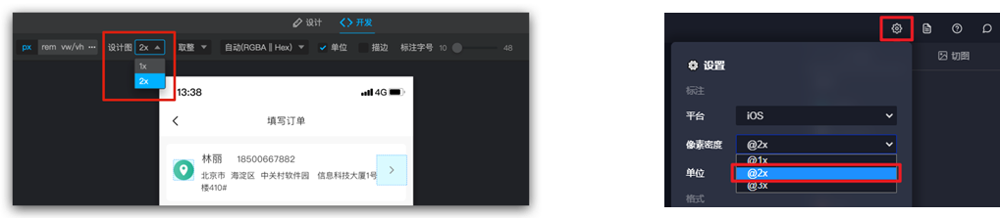

### 适配方案
**宽度适配：宽度自适应 （pc端）**

+ 百分比布局
+ Flex 布局

**等比适配：宽高等比缩放 （移动端）**

+ rem
+ vw

## rem
+ rem单位，是相对单位
+ rem单位是相对于HTML标签的字号计算结果
+ 1rem = 1HTML字号大小
  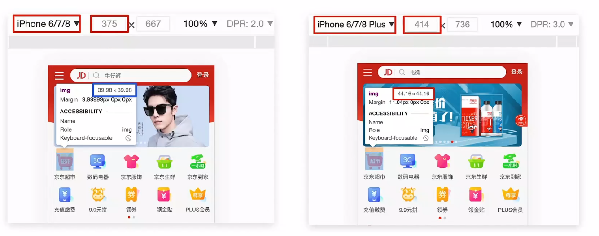

### 媒体查询
媒体查询能够检测视口的宽度，然后编写差异化的 CSS 样式

当某个条件成立, 执行对应的CSS样式

```css
@media (width:320px) {
  html {
    background-color: green;
  }
}
```

### rem 布局
目前rem布局方案中，将**网页等分成10份**， HTML标签的**字号**为**视口宽度**的 **1/10**

### flexible.js
flexible.js 是手淘开发出的一个用来适配移动端的 js 库

核心原理就是根据不同的视口宽度给网页中 html 根节点设置不同的 font-size

```html
<body>
  ......
  <script src="./js/flexible.js"></script>
</body>

```

### rem 移动适配
rem单位尺寸

确定基准根字号

+ 查看**设计稿宽度** → 确定参考**设备宽度**(视口宽度) → 确定**基准根字号**（1/10视口宽度）

rem单位的尺寸

+ **rem单位的尺寸 = px单位数值 / 基准根字号**

## vw 适配方案
### vw和vh基本使用
vw和vh是**相对单位**，相对**视口尺寸**计算结果

+ vw：viewport width（1vw = **1/100**视口宽度 ）
+ vh：lviewport height ( 1vh = **1/100**视口高度 )

### vw布局
vw单位的尺寸 = px 单位数值 / ( 1/100 视口宽度 ) 

确定设计稿对应的vw尺寸(1/100视口宽度)

	查看设计稿宽度 → 确定参考设备宽度 (视口宽度) →确定 vw 尺寸 (1/100 视口宽度)

vw单位的尺寸 = px 单位数值/(1/100 视口宽度)

### vh问题
**vh是1/100视口高度，全面屏视口高度尺寸大，如果混用可能会导致盒子变形** 

# CSS 预处理器
**定义**：它是一种特殊的编程语言，其语法扩展了 CSS

**作用**：为 CSS 增加了**变量、嵌套、混入、继承、模块化**等编程特性，解决了原生 CSS 难以维护、复用性差、代码冗余等问题

**工作流程**：你使用预处理器语法（如 `.scss`, `.less`）编写样式，然后通过一个**编译器**，将其转换为浏览器可以识别的**普通 CSS 文件预处理器优点**

+ **提高可维护性**：通过变量管理全局样式（如主题色、字体），一改全改
+ **增强代码复用**：使用混入 (Mixins) 和继承 (Extend) 复用代码片段，减少重复劳动
+ **提升开发效率**：嵌套语法让代码结构更清晰，更符合 HTML 结构，易于阅读和编写
+ **实现动态效果**：通过运算、条件判断和循环，可以生成复杂的、动态的样式规则（如栅格系统）

## 变量 (Variables)
+ **用途**：存储颜色、字体、尺寸、间距等常用值
+ **优势**：集中管理，方便全局修改和维护，增强代码可读性
+ **示例 (Sass)**：`$primary-color: #007bff;`
+ **示例 (Less)**：`@primary-color: #007bff;`

## 嵌套 (Nesting)
**用途**：在一个选择器内部编写另一个选择器，反映 HTML 的层级关系

**优势**：结构清晰，减少重复书写父选择器

**父选择器引用**：使用 `&` 符号引用当前嵌套的父选择器，常用于伪类（如 `&:hover`）和 BEM 命名

作用：快速生成后代选择器

提示：用 & 表示当前选择器，不会生成后代选择器，通常配合伪类或伪元素使用

```css
nav {
  ul { list-style: none; }
  a { 
    color: #333;
    &:hover { color: #000; }
  }
}
```

## 混入 (Mixins)
Mixins 在编程领域通常指一种代码复用的方式。它是一种类，该类包含了一些方法，这些方法可以被其他类混入（混合、合并）进来，使其他类获得这些方法的功能，而无需通过传统的继承体系来实现

**用途**：定义可复用的代码块，可以像函数一样接受参数

**优势**：非常适合封装那些需要传递参数的、重复性高的样式（如 `border-radius`、动画）

**Sass 语法**：`@mixin` 定义，`@include` 调用

**Less 语法**：直接定义为类，通过类名调用

```css
@mixin flex-center {
  display: flex;
  justify-content: center;
  align-items: center;
}
.card { @include flex-center; }
```

## 继承 (Extend)
**用途**：让一个选择器继承另一个选择器的所有样式

**优势**：编译后会将选择器合并，生成更简洁、无冗余的 CSS，从而减小文件体积

**Sass 语法**：使用 `@extend` 关键字

**Less 不支持此功能占位符选择器 (**`**%**`**)**：Sass 中一种特殊的选择器，本身不会被编译输出，专门用于被继承，是 `@extend` 的最佳拍档

```css
%message { padding: 10px; border: 1px solid; }
.success { @extend %message; border-color: green; }
.error { @extend %message; border-color: red; }
```

## 核心区别与使用场景
首先明确结论：**两者作用不同，核心差异在于编译后的 CSS 结构、复用逻辑和使用场景**。下面用通俗的语言 + 代码示例拆解：

本质逻辑不同

**@mixin + @include**：

+ 「复制粘贴」逻辑混合器是把一段样式代码**直接拷贝**到调用的地方，支持传参，更灵活

**% 占位符 + @extend**：

+ 「合并选择器」逻辑占位符样式本身不编译，@extend 会把使用该占位符的所有选择器**合并成一个选择器组**，复用同一段样式，更节省代码体积

**示例 1：@mixin + @include 的使用**

```css
// 定义混合器（支持传参）
@mixin flex-center($direction: row) {
  display: flex;
  flex-direction: $direction;
  justify-content: center;
  align-items: center;
}

// 调用混合器
.box1 {
  @include flex-center; // 使用默认参数
  width: 100px;
}

.box2 {
  @include flex-center(column); // 传参覆盖
  height: 200px;
}
```

**编译后的 CSS**（代码被拷贝到每个选择器下）：

```css
.box1 {
  display: flex;
  flex-direction: row;
  justify-content: center;
  align-items: center;
  width: 100px;
}

.box2 {
  display: flex;
  flex-direction: column;
  justify-content: center;
  align-items: center;
  height: 200px;
}
```

**示例 2：% 占位符 + @extend 的使用**

```css
// 定义占位符（无参数，纯样式复用）
%common-btn {
  padding: 8px 16px;
  border-radius: 4px;
  cursor: pointer;
}

// 继承占位符样式
.btn-primary {
  @extend %common-btn;
  background: blue;
  color: white;
}

.btn-secondary {
  @extend %common-btn;
  background: gray;
  color: black;
}
```

**编译后的 CSS**（选择器合并，样式只出现一次）：

```css
.btn-primary, .btn-secondary {
  padding: 8px 16px;
  border-radius: 4px;
  cursor: pointer;
}

.btn-primary {
  background: blue;
  color: white;
}

.btn-secondary {
  background: gray;
  color: black;
}
```

关键差异总结表

| **特性** | **@mixin + @include** | **% 占位符 + @extend** |
| --- | --- | --- |
| 编译逻辑 | 样式拷贝到调用处 | 选择器合并，样式只写一次 |
| 参数支持 | 支持（可传参、默认值） | 不支持（纯静态样式） |
| 代码体积 | 可能冗余（重复样式） | 更精简（样式复用） |
| 使用场景 | 动态样式（需传参、不同变体） | 静态通用样式（无参数、纯复用） |
| 自身编译输出 | 无（只在调用时输出） | 无（仅被继承时生效） |

实战建议

+ 「可定制的样式」（比如不同方向的 flex 布局、不同大小的按钮），用 `@mixin + @include`
+ 「固定不变的通用样式」（比如所有按钮的基础 padding、border-radius），用 `% + @extend`；
+ 不要过度使用 `@extend`：如果继承的选择器层级复杂（比如 `.a .b @extend %c`），可能会生成大量冗余的选择器组合，反而适得其反

总结

1. **核心逻辑不同**：`@mixin` 是「拷贝样式」，`%` 是「合并选择器」；
2. **使用场景不同**：`@mixin` 适合动态可定制样式，`%` 适合静态通用样式；
3. **代码体积不同**：`%` 编译后更精简，`@mixin` 灵活但可能冗余

简单记：需要传参用 mixin，纯复用样式用 extend + 占位符

## 模块化 (Modules)
**用途**：将样式文件拆分成多个文件（如 `_variables.scss`, `_buttons.scss`），然后在主文件中引入

**优势**：项目结构更清晰，便于团队协作和代码管理

**Sass 推荐方式 (**`**@use**`**)**：现代 Sass 的标准，支持命名空间，避免全局变量污染，且每个文件只导入一次

**Less 方式 (**`**@import**`**)**：简单的文件合并，所有变量和混入默认全局，容易造成冲突

**Sass 示例**：`@use 'components/button' as btn;` 然后通过 `btn.$color` 访问

## 运算 (Operations)
**用途**：对数字、颜色、字符串进行算术运算

**优势**：实现动态计算，如栅格列宽、响应式尺寸、颜色明暗调整

**Sass**：运算能力更强、更严谨，有专门的 `math` 模块

**Less**：支持基本运算，但在单位处理上不如 Sass 精确

**示例**：`width: 100% / 3;`

## 函数 (Functions)
**用途**：定义可以返回值的逻辑块，用于复杂的计算

**优势**：将逻辑与样式分离，让代码更具可读性和复用性

**Sass**：提供了丰富的内置函数（如颜色、字符串处理），并支持用户通过 `@function` 自定义函数

**Less：不支持自定义函数**

```css
@function calculate-width($columns, $total-columns) {
  @return 100% / $total-columns * $columns;
}
.col-4 { width: calculate-width(4, 12); }
```

## 条件与循环 (Control Directives)
**用途**：实现逻辑判断和重复执行

**优势**：可以创建非常灵活和强大的样式系统，如根据配置生成不同主题或栅格

**Sass**：支持 `@if`/`@else` 条件判断，以及 `@for`, `@each`, `@while` 循环

**Less 不支持**

```css
@for $i from 1 through 6 {
  .text-h#{$i} { font-size: 24px - ($i - 1) * 2px; }
}
```

---

## Less Sass: 核心差异
**功能强大度**：

+ **Sass 远胜 Less**
+ Sass 拥有 `@extend`、`@function`、完整的条件与循环控制、以及更现代的 `@use` 模块化系统

**学习曲线**：

+ **Less 更简单**。Less 的语法更接近原生 CSS，上手更快
+ Sass 功能多，学习曲线稍陡

**社区与生态**：

+ **Sass 更成熟、更主流**
+ Dart Sass 是目前官方推荐的实现，生态系统庞大
+ 被绝大多数 UI 框架（如 Bootstrap, Material-UI）采用

**文件扩展名**：

+ **Less**: `.less`
+ **Sass**: `.scss` (CSS 兼容语法，推荐) 和 `.sass` (缩进语法)

## 总结
CSS 预处理器是现代前端开发的基石。它通过引入**变量、嵌套、混入、继承、模块化**等核心概念，极大地提升了 CSS 的**可维护性、复用性和开发效率**。

在选择上，**Sass (特别是 **`**.scss**`** 语法)** 凭借其更强大、更健壮的功能和成熟的生态，已成为当前的**行业标准**，是构建大型项目的首选。如果你需要一个非常轻量、易于上手的解决方案，或者维护旧项目，**Less** 仍然是一个不错的选择


# SVG 可缩放矢量图
可缩放矢量图形（Scalable Vector Graphics）。

SVG 是一种用于描述二维图形的 XML 标记语言，与位图图像不同，SVG图像以文本形式存储，并且可以缩放到任意大小而不会失真，因为它们基于数学描述而不是像素。本质上，SVG 相对于图像，就好比 HTML 相对于文本。

SVG 图形是可伸缩的，无需分辨率依赖，这意味着可以在不失真的情况下被放大或缩小。

SVG 广泛应用于网页设计、图标制作、数据可视化和其他图形相关的领域。

## SVG 的主要特点
+ **矢量图形：**SVG 使用基于路径的矢量图形，这意味着图形可以无限放大而不失真。
+ **可伸缩性：**SVG 文件可以在不同的分辨率下保持清晰，适合用于响应式设计。
+ **互动性：**SVG 可以与 JavaScript 结合，实现动画和交互效果。
+ **集成性：**SVG 可以直接嵌入 HTML5 中，无需使用外部文件。
+ **兼容性：**大多数现代浏览器都支持 SVG。

---

## SVG 的应用场景
+ **网页图标：**由于 SVG 的可伸缩性，它非常适合用来制作网页图标。
+ **数据可视化：**SVG 常用于图表和图形的创建，如条形图、饼图等。
+ **动画：**SVG 可以与 CSS 和 JavaScript 结合，创建复杂的动画效果。
+ **游戏开发：**在某些情况下，SVG 也被用于创建简单的游戏图形。
+ **设计原型：**设计师可以使用 SVG 来创建可交互的设计原型。

## 矩形
 `<rect>` 元素用于绘制矩形，是 SVG 中常用的基本形状之一，它允许你绘制矩形，并可以通过设置属性来控制矩形的位置、大小、圆角等样式

**基本语法**

```xml
<rect
  x="x-coordinate"        <!-- 矩形左上角的 x 坐标 -->
  y="y-coordinate"        <!-- 矩形左上角的 y 坐标 -->
  width="width-value"     <!-- 矩形的宽度 -->
  height="height-value"   <!-- 矩形的高度 -->
  rx="rx-value"           <!-- 矩形的圆角半径（水平方向） -->
  ry="ry-value"           <!-- 矩形的圆角半径（垂直方向） -->
  fill="fill-color"       <!-- 矩形的填充颜色 -->
  stroke="stroke-color"   <!-- 矩形的描边颜色 -->
  stroke-width="width-value" <!-- 矩形的描边宽度 -->
/>
```

**属性解析：**

+ `x` 和 `y` 属性指定了矩形左上角的坐标，即矩形的起始点。
+ `width` 和 `height` 属性定义了矩形的宽度和高度。
+ `rx` 和 `ry` 属性用于指定矩形的圆角半径。如果只设置 `rx`，则所有角的圆角半径都相同；如果同时设置 `rx` 和 `ry`，则可以分别指定水平和垂直方向的圆角半径。
+ `fill` 属性定义了矩形的填充颜色。
+ `stroke` 属性定义了矩形的描边颜色。
+ `stroke-width` 属性定义了矩形的描边宽度。

下面的代码绘制了一个蓝色填充、黑色描边、宽度为 2 像素的矩形，左上角坐标为 (50, 50)，宽度为 100，高度为 80。

```xml
<svg width="200" height="200" xmlns="http://www.w3.org/2000/svg">
  <rect 
        x="50" y="50" 
        width="100" height="80" 
        fill="blue" stroke="black" 
        stroke-width="2" 
    />
</svg>

```

## 圆形
`<circle>` 元素用于绘制圆形，它是SVG中常用的基本形状之一

使用 `<circle>` 元素可以创建圆形的图形，并可以通过设置属性来控制圆形的位置、大小和样式

**基本语法**

```xml
<circle
  cx="x-coordinate"      <!-- 圆心的 x 坐标 -->
  cy="y-coordinate"      <!-- 圆心的 y 坐标 -->
  r="radius"             <!-- 圆的半径 -->
  fill="fill-color"      <!-- 圆的填充颜色 -->
  stroke="stroke-color"  <!-- 圆的描边颜色 -->
  stroke-width="width"   <!-- 圆的描边宽度 -->
/>
```

**属性解析：**

+ `cx` 和 `cy` 属性定义了圆心的坐标，即圆的中心点的位置
+ `r` 属性定义了圆的半径，以确定圆的大小
+ `fill` 属性定义了圆的填充颜色
+ `stroke` 属性定义了圆的描边颜色
+ `stroke-width` 属性定义了圆的描边宽度

以下代码绘制了一个蓝色填充、黑色描边、半径为 50 像素的圆形，圆心坐标为 (100, 100)

```xml
<svg width="200" height="200" xmlns="http://www.w3.org/2000/svg">
  <circle 
          cx="100" cy="100" 
          r="50" 
          fill="blue" 
          stroke="black" 
          stroke-width="2" 
      />
</svg>

```


## 多边形
`<polygon>` 元素用于绘制多边形，它是 SVG 中常用的基本形状之一

使用 `<polygon>` 元素可以创建闭合的多边形，并可以通过设置属性来控制多边形的顶点坐标、填充颜色、边框颜色等

**基本语法**

```xml
<polygon
  points="x1,y1 x2,y2 x3,y3 ..."   <!-- 多边形各个顶点的坐标 -->
  fill="fill-color"                <!-- 多边形的填充颜色 -->
  stroke="stroke-color"            <!-- 多边形的边框颜色 -->
  stroke-width="width"             <!-- 多边形的边框宽度 -->
/>
```

**属性解析：**

+ `points` 属性定义了多边形各个顶点的坐标，多个顶点的坐标以空格或逗号分隔，并且每对坐标使用逗号分隔
+ `fill` 属性定义了多边形的填充颜色
+ `stroke` 属性定义了多边形的边框颜色
+ `stroke-width` 属性定义了多边形的边框宽度

以下代码绘制了一个橙色填充、黑色描边、宽度为 2 像素的多边形，其顶点坐标分别为 (100, 10)、(150, 190) 和 (50, 190)，形成一个闭合的三角形

```xml
<svg width="200" height="200" xmlns="http://www.w3.org/2000/svg">
  <polygon 
      points="100,10 150,190 50,190" 
      fill="orange" 
      stroke="black" 
      stroke-width="2" />
</svg>

```

## 多段线
 `<polyline>` 元素用于绘制多段线，它是 SVG 中常用的基本形状之一。 `<polygon>` 元素不同， `<polyline>` 绘制的线条是未封闭的，即起点和终点不会自动连接。使用 `<polyline>` 元素可以创建多个连接的线段，并可以通过设置属性来控制线段的顶点坐标、填充颜色、边框颜色等。

**基本语法**

```xml
<polyline
  points="x1,y1 x2,y2 x3,y3 ..."   <!-- 多段线各个顶点的坐标 -->
  fill="none"                      <!-- 多段线的填充颜色，使用 "none" 表示不填充 -->
  stroke="stroke-color"            <!-- 多段线的边框颜色 -->
  stroke-width="width"             <!-- 多段线的边框宽度 -->
/>
```

**属性解析：**

+ `points` 属性定义了多段线各个顶点的坐标，多个顶点的坐标以空格或逗号分隔，并且每对坐标使用逗号分隔。
+ `fill` 属性用于定义多段线的填充颜色，通常设置为 "none" 表示不填充。
+ `stroke` 属性定义了多段线的边框颜色。
+ `stroke-width` 属性定义了多段线的边框宽度。

以下代码绘制了一个黑色描边、宽度为 2 像素的多段线，其顶点坐标分别为 (50, 50)、(100, 150)、(150, 100) 和 (200, 200)，形成了多个连接的线段。

```html
<svg width="200" height="200" xmlns="http://www.w3.org/2000/svg">
  <polyline 
    points="50,50 100,150 150,100 200,200" 
    fill="none" 
    stroke="black" 
    stroke-width="2" 
    />
</svg>

```

## 路径
 `<path>` 元素用于创建路径，它是 SVG 中最强大和最灵活的基本形状之一

使用 `<path>` 元素可以绘制直线、曲线、弧线等各种复杂的图形，并且可以通过设置路径命令来控制路径的形状和样式

**基本语法**

```xml
<path
  d="path-data"            <!-- 定义路径的路径数据 -->
  fill="fill-color"        <!-- 路径的填充颜色 -->
  stroke="stroke-color"    <!-- 路径的描边颜色 -->
  stroke-width="width"     <!-- 路径的描边宽度 -->
/>
```

**属性解析：**

+ `d` 属性定义了路径的路径数据，即路径命令序列。路径数据由一系列的路径命令组成，每个路径命令以字母开头，后面跟随一组数字参数。常用的路径命令包括：M（移动到）L（直线到）H（水平线到）V（垂直线到）C（三次贝塞尔曲线）S（光滑曲线）Q（二次贝塞尔曲线）T（光滑二次贝塞尔曲线）A（圆弧）Z（闭合路径）等
+ `fill` 属性定义了路径的填充颜色
+ `stroke` 属性定义了路径的描边颜色
+ `stroke-width` 属性定义了路径的描边宽度

以下代码绘制了一个橙色填充、黑色描边、宽度为 2 像素的路径，其路径数据为移动到 (50, 50)，然后依次连接到 (150, 50) 和 (100, 150)，最后闭合路径

```xml
<svg width="200" height="200" xmlns="http://www.w3.org/2000/svg">
  <path 
     d="M 50 50 L 150 50 L 100 150 Z" 
     fill="orange" 
     stroke="black" 
     stroke-width="2" />
</svg>

```


# 拓展

## Emmet写法

Emmet写法：代码的**简写**方式，输入缩写 VS Code 会自动生成对应的代码。 

**HTML标签**

| **说明**     | **标签结构**                                 | **Emmet**     |
| :----------- | :------------------------------------------- | :------------ |
| 类选择器     | `<div class="box"></div>`                    | `标签名.类名` |
| id 选择器    | `<div id="box"></div>`                       | `标签名#id名` |
| 同级标签     | `<div></div><p></p>`                         | `div+p`       |
| 父子级标签   | `<div><p></p></div>`                         | `div>p`       |
| 多个相同标签 | `<span>1</span><span>2</span><span>3</span>` | `span*3`      |
| 有内容的标签 | `<div>内容</div>`                            | `div{内容}`   |

+ CSS：大多数简写方式为属性单词的**首字母**

| **说明**   | **CSS 属性**                                         | **Emmet**       |
| :--------- | :--------------------------------------------------- | :-------------- |
| 宽度       | `width`                                              | `w`             |
| 宽度 500px | `width: 500px;`                                      | `w500`          |
| 背景色     | `background-color`                                   | `bgc`           |
| 多个属性   | `width: 200px;height: 100px;background-color: #fff;` | `w200+h100+bgc` |

## Chrome 调试工具

 1.Ctrl+滚轮 可以放大开发者工具代码大小。  

 2.左边是 HTML 元素结构，右边是 CSS 样式。  

 3.右边 CSS 样式可以改动数值（左右箭头或者直接输入）和查看颜色。  

 4.Ctrl + 0 复原浏览器大小。  

 5.如果点击元素，发现右侧没有样式引入，极有可能是类名或者样式引入错误。  

 6.如果有样式，但是样式前面有黄色叹号提示，则是样式属性书写错误。

## 参考线-深入字体

font-size 、line-height、vertical-align、font-family

### 文字

在文字制作过程中，会有几根参考线，不同文字类型参考线不一样，同一种文字类型一致
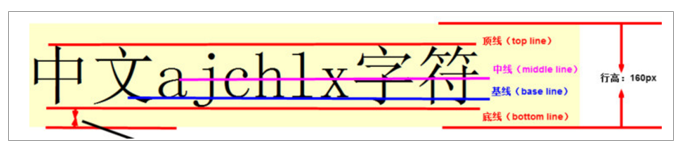

### font-size

字体大小设置的是文字的相对大小

文字的相对大小：1000、2048、1024

文字顶线到底线的距离，是文字的实际大小（content-area）

行盒的背景，覆盖content-area

### 行高

顶线向上延伸的空间，和底线向下延伸的空间，两个空间相等，该空间叫做 gap

gap 默认是字体设计者决定的，从top到Bottom的区域（virtual-area）可调节

行高就是此区域

line-heig ：normal 默认值，使用文字默认的gap

### virtual-align

决定参考线：font-size 、line-height、font-family

一个元素如果子元素出现行盒，该元素内部也会产生参考线

virtual-align ：

bseline 该元素基线与父元素基线对齐

super ：该元素的基线与父元素上基线对齐

sub：与下基线对齐

text-top：该元素的 virtual-area 顶边对齐父元素的 text-top

text-bottom：该元素的 virtual-area 顶边对齐父元素的 text-bottom

top: 该元素的 virtual-area 顶边对齐 line-box 的顶边

bottom：该元素的 virtual-area 顶边对齐 line-box 的底边 

middle：该元素的中线对齐父元素的X字母高度一半的位置对齐

行盒组合起来，可以形成多行，每一行的区域叫做 line-box，它的顶边石改行行内所有行盒的最高顶边

实际上，一个元素实际占用高度（高度自动），计算高度通过line-box计算

行盒：inline-box

行框：line-box 是承载文字内容的必要条件，以下情况不生成行框

元素内部没有任何行盒、某元素字体大小为0

数值：相对于基线偏移量，上正下负

百分比：相对于基线偏移量，低昂对于自身的 virtual-area 高度

### 可替换元素和行块盒

图片：基线位置位于图片的下外边距

表单元素：基线位置在内容底边

行块盒：

+ 行块盒最后一行有line-box ，用最后一行的基线作为整个行块盒的基线
+ 行快盒内部无行盒，则使用下外边距作为基线

## 堆叠上下文 stack context

是一块由某个元素创建的区域，规定了该区域中内容 Z 轴排列先后顺序

那些元素可以创建？

+ html 元素（根元素）
+ 设置了 z-index 数值的定位元素（非auto 值）

同一个堆叠上下文中在 Z 轴上的排列

从后往前（从下往上靠近用户）

1. 创建堆叠上下文的元素的背景和边框
2. 堆叠级别为负值的堆叠上下文
3. 常规流非定位的块盒
4. 非定位的浮动盒子
5. 常规流非定位行盒
6. 任何 z-index 是auto的定位子元素，以及z-index 是0 的堆叠上下文
7. 堆叠级别为正值的堆叠上下文
8. 规则一样，书写后边的覆盖前边

每个堆叠上下文独立于其他独立上下文，之间不可互相穿插，每一个都为一个整体

子元素宽度设置50%无法并排显示的问题

一个div中有两个inline-block元素，width都是50%，为第二个会被挤下去

原因:空白折叠

## CSS 优化

减少选择器复杂度（避免嵌套过深，如 `div > .class` 优于 `div .class .child`）

合并重复样式，使用 CSS 预处理器（Sass/Less）的变量、混合宏复用代码

避免使用 `@import`（会阻塞渲染，建议用 `<link>` 引入）

关键 CSS 内联（首屏必要样式写入 `<style>`，减少请求）

减少重排（Reflow）和重绘（Repaint）：

- 避免频繁操作 DOM 样式，建议集中修改（如通过 `class` 批量切换）
- 使用 `transform`、`opacity` 触发合成层（Composite），减少重排重绘

### 加载优化

| **优化点**     | **做法**                             |
| -------------- | ------------------------------------ |
| 避免 `@import` | 用 `<link>`引入（`@import`串行加载） |
| 关键 CSS 内联  | 首屏样式写入 `<style>`               |
| 压缩 CSS       | 生产环境开启 Gzip                    |

### 渲染优化

| **优化点**       | **做法**                               |
| ---------------- | -------------------------------------- |
| 减少选择器复杂度 | `div > .class`优于 `div .class .child` |
| 集中修改样式     | 用 `classList`批量切换                 |
| 使用 GPU 加速    | `transform`/`opacity`替代位置动画      |
| 避免 Table 布局  | 小改动导致整体重排                     |
| 缓存布局值       | 避免重复读取 `offsetTop`等             |

### 代码组织

```css
/* 使用 CSS 变量统一管理 */
:root {
  --primary-color: #1890ff;
  --map-height: 600px;
}

/* 避免重复代码 */
.btn {
  padding: 10px 20px;
  border-radius: 4px;
  transition: all 0.3s;
}
```

------

# CSS 优化

减少选择器复杂度（避免嵌套过深，如 `div > .class` 优于 `div .class .child`）

合并重复样式，使用 CSS 预处理器（Sass/Less）的变量、混合宏复用代码

避免使用 `@import`（会阻塞渲染，建议用 `<link>` 引入）

关键 CSS 内联（首屏必要样式写入 `<style>`，减少请求）

减少重排（Reflow）和重绘（Repaint）：

- 避免频繁操作 DOM 样式，建议集中修改（如通过 `class` 批量切换）
- 使用 `transform`、`opacity` 触发合成层（Composite），减少重排重绘

### 加载优化

| **优化点**     | **做法**                             |
| -------------- | ------------------------------------ |
| 避免 `@import` | 用 `<link>`引入（`@import`串行加载） |
| 关键 CSS 内联  | 首屏样式写入 `<style>`               |
| 压缩 CSS       | 生产环境开启 Gzip                    |

### 渲染优化

| **优化点**       | **做法**                               |
| ---------------- | -------------------------------------- |
| 减少选择器复杂度 | `div > .class`优于 `div .class .child` |
| 集中修改样式     | 用 `classList`批量切换                 |
| 使用 GPU 加速    | `transform`/`opacity`替代位置动画      |
| 避免 Table 布局  | 小改动导致整体重排                     |
| 缓存布局值       | 避免重复读取 `offsetTop`等             |

### 代码组织

```css
/* 使用 CSS 变量统一管理 */
:root {
  --primary-color: #1890ff;
  --map-height: 600px;
}

/* 避免重复代码 */
.btn {
  padding: 10px 20px;
  border-radius: 4px;
  transition: all 0.3s;
}
```

