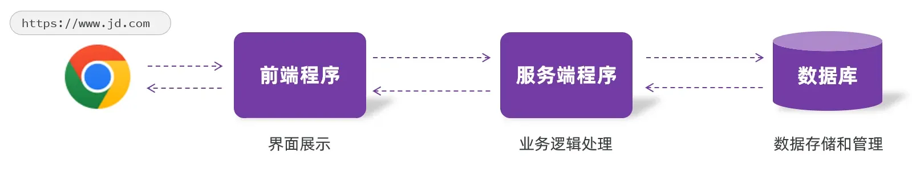
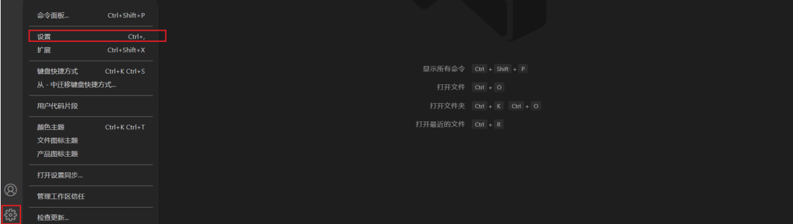
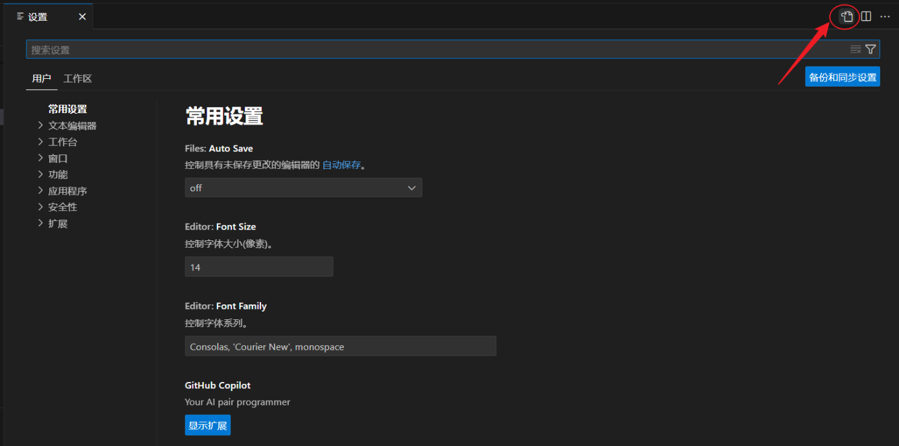
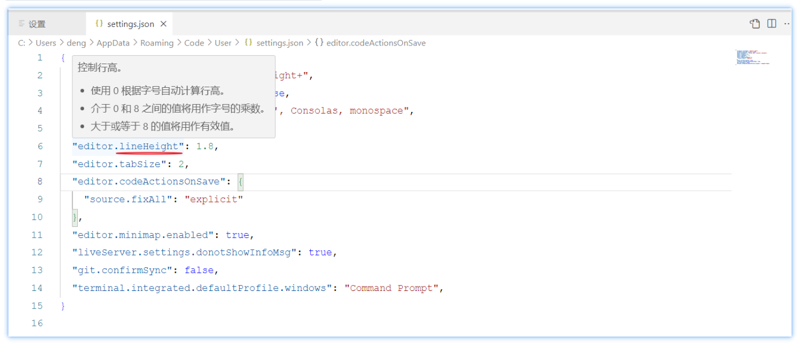
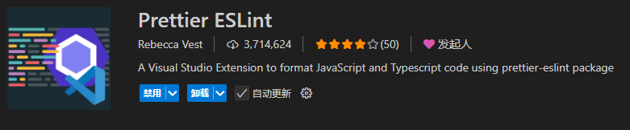

全球广域网，也称为万维网(www World Wide Web)，Web指的就是能够通过浏览器访问的网站


还有像CRM、OA、ERP这类的企业内部的管理系统等等，这些都是Web网站

CRM（客户关系管理）

聚焦客户，管理客户资料、跟进记录、商机、售后等，核心是拉新、留存、维护客户，提升成交与复购

OA（办公自动化）

聚焦内部办公，处理审批、公文、考勤、公告、流程协作等，核心是简化内部行政、办公流程，提效减负

ERP（企业资源计划）

聚焦全供应链 & 核心业务，整合采购、生产、库存、财务、销售、人力等企业各类资源，核心是统筹物资、资金、生产，把控整体经营成本与流转


## Web网站结构
 一个web网站核心呢是由三个部分组成的，分别是：前端程序、后端程序、数据库

+ 前端程序：负责将数据以好看的样式呈现出来
+ 后端程序：负责具体的业务逻辑的处理
+ 数据库：负责数据的存储和管理

具体的请求访问流程为：


+ 在浏览器地址栏输入url地址之后，此时首先访问到的是服务器中部署的前端程序，而前端程序仅仅负责将数据以好看的样式呈现出来，这个数据并不是在前端页面中写死的。
+ 所以此时需要在前端程序中，发送请求来请求服务端程序，服务端程序在查询数据库，然后将数据库查询的数据返回给前端。
+ 最终前端程序再将数据渲染展示在页面中。 而前端程序，浏览器是可以直接解析的，那浏览器解析了前端程序之后，最终就会呈现出一个精美的网页。

## Web前端
 前端开发的主要职责：**将后端数据，以美观、易用、交互友好的样式呈现给用户**，是用户直接看到、摸到、用到的页面部  

**主要明确以下三个问题：**

1. 网页由哪些部分组成 ?

+  网页由各类 HTML 元素构成，常见元素：文字、图片、音频、视频、超链接、表格、按钮、表单、输入框、下拉菜单等  

2. 网页背后的本质是什么 ?

+ 前端程序员写的前端代码 (备注：在前后端分离的开发模式中)

3. 前端的代码是如何转换成用户眼中的网页的 ?

+ 通过浏览器转化（解析和渲染）成用户看到的网页
+ 浏览器中对代码进行解析和渲染的部分，称为**浏览器内核**

市面上的浏览器非常多，比如：IE、火狐Firefox、苹果safari、欧朋、谷歌Chrome、QQ浏览器等等


**不同的浏览器内核不同**，对于相同的前端代码解析的效果也会存在差异, 必须遵守统一 **Web 标准**

## Web标准
**Web标准**也称为**网页标准**，由一系列的标准组成

大部分由W3C（ World Wide Web Consortium，万维网联盟）负责制定

HTML ：负责网页结构

+ 作用：搭建页面骨架，定义**有什么内容**（标题、段落、图片、按钮等）

CSS ：负责网页表现

+ 作用：美化页面，设置**外观、位置、颜色、大小、布局、样式**

JavaScript ：负责网页行为

+ 作用：实现**交互效果**，让页面 “动起来”
+ 例如：点击按钮弹出提示、表单验证、轮播图切换、数据加载等

## 前端常用技术栈
学会 HTML/CSS/JS 后，实际工作会使用**框架 + 插件库**提升开发效率

**Vue ：前端主流框架**

+ 定位：**基于 JavaScript 的渐进式前端框架**
+ 作用：简化原生代码，快速开发复杂页面（单页应用 SPA）
+ 核心优势：数据驱动视图、组件化开发、代码复用、易上手、生态强大
+ 不用从零手写所有功能，Vue 提供一套成熟模板，快速搭建项目

**Element Plus ： Vue 前端 UI 组件库**

+ 定位：**基于 Vue 的现成 UI 组件库**
+ 作用：提供大量写好的美观组件，直接使用，不用自己写样式
+ 常见组件：按钮、输入框、表格、弹窗、分页、导航、表单、下拉框等
+ 样式统一、适配移动端 / PC 端、大幅节省开发时间

**Axios ： 前端网络请求工具**

+ 定位：**基于 Promise 的 HTTP 客户端**。
+ 作用：专门负责**前端向后端发送请求、获取数据**
+ 例如：获取用户列表、提交表单、查询商品、加载新闻数据等。
+ 核心功能：发送 GET/POST 请求、处理请求头、处理响应数据、捕获异常

**ECharts ： 数据可视化图表库**

+ 定位：**百度开源的前端图表库**。
+ 作用：将数据转换成**直观图表**，用于数据展示、大屏可视化
+ 常见图表：折线图、柱状图、饼图、雷达图、地图、仪表盘等
+ 使用场景：后台管理系统数据统计、电商报表、企业数据大屏  
			

##  VS Code  常用插件
**Chinese (Simplified）**

+ 简体中文

**翻译(英汉词典) **

+ 翻译本地77万词条英汉词典，不依赖任何在线翻译API

**Auto Rename Tag** 

+ 自动重命名成对的 HTML/XML 标签

**JavaScript (ES6) code snippets **

+ 支持ES6语法提示

**Path Intellisense  **

+ 路径提示插件

**Chinese Lorem** 

+ 简体中文的乱数假文

Auto Close Tag 

+ 自动闭合HTML/XML标签

**HTML CSS Support** 

+ HTML id 和 class 属性补全功能

**Live Server** 

+ 在浏览器中实时预览页面的变化

**Prettier - Code formatter** 

+ 代码格式化工具

**any-rule  **

+ 正则表达式

**Easy LESS** 

+ 轻松处理 LESS 文件

**ESLint **

+ ESLint 集成到 VS Code 中

**TRAE AI  **

+ 字节跳动豆包旗下的智能编程助手

**TONGYI Lingma **

+ 基于通义大模型的智能编码辅助工具

## VsCode配置
打开配置面板，根据自己的喜好，可以修改字体、背景样式等偏好设置。 点击 "设置" 按钮


然后点击右上角 "打开设置" 的图标


然后在打开的 `settings.json` 中增加如下配置信息：

```plain
{
  "workbench.colorTheme": "Default Light+",
  "workbench.statusBar.visible": false,
  "editor.fontFamily": "'Courier New', Consolas, monospace",
  "editor.fontSize": 15,
  "editor.lineHeight": 1.8,
  "editor.tabSize": 2,
  "editor.codeActionsOnSave": {
    "source.fixAll": "explicit"
  },
  "editor.minimap.enabled": true,
  "liveServer.settings.donotShowInfoMsg": true,
  "git.confirmSync": false,
  "terminal.integrated.defaultProfile.windows": "Command Prompt"
}
```

具体配置项的含义，鼠标放在配置项上，会自动悬浮展示出来


## Emmet  语法 
读音（国际音标）

+ 英式发音：/ˈemɪt/
+ 美式发音：/ˈemɪt/
+ 发音要点：重音在首音节，读起来类似中文 “埃米特”，结尾 “-met” 发短音 /mɪt/，不拖长

Emmet语法的前身是Zen coding,使用缩写,来提高html/css的编写速度, Vscode内部已经集成该语法

**快速生成HTML结构语法**

+ 标签：`div` → `<div></div>`
+ 多个：`div*3` → 3 个 div
+ 父子：`ul>li` → ul 里包 li
+ 兄弟：`div+p` → div 后面紧跟 p
+ class：`.demo` → `<div class="demo"></div>`
+ id：`#two` → `<div id="two"></div>`
+ 自增：`div.item$*3` → item1、item2、item3
+ 内容：`h1{标题}` → `<h1>标题</h1>`
+ 组合示例：标签名[属性名=“属性值”]>{标签内容}  $表示自增占位符

```plain
(h2[id="chapter$"]>{章节$})+(p>lorem)*6
```

+ shift + alt + 方向下快速复制

**快速生成CSS样式语法**

+ `w200` → `width: 200px;`
+ `lh26px` → `line-height: 26px;`
+ `m10` → `margin: 10px;`
+ `p5` → `padding: 5px;`

**快速格式化代码**

+ 手动格式化：**Shift + Alt + F**（Windows/Linux）、**Shift + Option + F**（Mac）
+ 推荐：**保存自动格式化**

保存自动格式化设置

1. 打开设置：`Ctrl+,`
2. 搜索：`Editor: Format On Save` → 勾选
3. 缩进：Tab 设为 **2 个空格**

## vscode 常用快捷键
| 快捷键 | 作用 |
| :---: | :---: |
| ctrl + c | 复制 |
| ctrl + v | 粘贴 |
| ctrl + x | 剪切 |
| ctrl + s | 保存 |
| alt + 上箭头 | 上移一行 |
| shift+ alt + 下箭头 | 快速复制一行 |
| tab | 往右缩进 |
| shift + tab | 往左缩进 |
| ctrl+ D | 修改多个 |
| win + D | 返回桌面 |
| ctrl + F | 查找 |
|  |  |
|  |  |

## Prettier 和 ESLint
是前端开发中常用的代码规范工具，以下是相关介绍：

### ESLint
是一个静态代码分析工具。主要用于识别和报告 JavaScript 代码中的模式，可检测代码中潜在错误和问题模式，如未使用的变量、未处理的 Promise 等。还能通过配置规则集来强制执行编码规范和最佳实践，并且对可自动修复的问题提供一键修复功能，同时支持 React、Vue 等框架的特定规则检查。

### Prettier
是一款纯粹的代码格式化工具，专注于代码风格的统一，可自动调整代码格式，包括缩进、引号、换行等，支持 JS、TS、HTML、CSS、JSON、Markdown 等多种语言。它能消除团队内部关于代码风格的争论，让开发者专注于逻辑实现而非格式化调整。

**两者配合使用：**

虽然 ESLint 也有一定的代码风格检查功能，但格式化能力较弱，而 Prettier 在格式化方面更专业，因此最佳实践是将两者结合使用。不过，它们的部分规则可能会冲突，可通过安装`eslint-config-prettier`关闭 ESLint 中与 Prettier 冲突的格式规则，还可使用`eslint-plugin-prettier`将 Prettier 作为 ESLint 的一个插件，让 Prettier 覆盖 ESLint 中冲突的格式规则。

### Prettier ESLint  插件
在 VS Code 中，Rebecca Vest 开发的 Prettier ESLint 插件是一款 “整合型工具”—— 它底层依赖 `prettier-eslint` 包，能自动串联 ESLint（代码质量检查） 和 Prettier（代码格式化） 的工作流，无需你手动配置两者的冲突，一键实现 “先修复代码质量问题、再统一格式风格” 的效果，大幅简化前端项目的代码规范落地流程

核心作用


普通情况下，若单独使用 Prettier 和 ESLint，需手动安装 `eslint-config-prettier`（关闭 ESLint 与 Prettier 冲突的格式规则）、`eslint-plugin-prettier`（将 Prettier 作为 ESLint 规则）来避免冲突；

这款插件已内置上述逻辑，核心价值是：自动执行「ESLint 修复 → Prettier 格式化」的串联操作，既保证代码符合质量规范（如未使用变量、语法错误），又统一格式（如缩进、引号、换行），无需手动写复杂配置

安装与启用

**安装插件**

打开 VS Code，进入左侧「插件面板」，在搜索框输入 Prettier ESLint（作者是 Rebecca Vest）

**启用插件**

安装后，需将其设为默认代码格式化器（否则可能优先使用 VS Code 自带或其他插件的格式化功能）

项目依赖准备

插件本身是执行器，但需要项目中安装 Prettier 和 ESLint 的核心依赖才能工作  
在前端项目根目录，打开终端执行以下命令安装依赖：

```bash
# npm 安装
npm install --save-dev prettier eslint

# 或 yarn 安装
yarn add --dev prettier eslint
```

配置规则（按需调整）

插件会自动读取项目中的 ESLint 配置文件 和 Prettier 配置文件，无需在插件中额外设置

**配置 ESLint（代码质量规则）**

在项目根目录创建 ESLint 配置文件（任选一种格式）：

+ `.eslintrc.js`（推荐，支持 JS 逻辑）
+ `.eslintrc.json`
+ `.eslintrc`

示例 `.eslintrc.js` 配置（适用于 JS/TS 项目）：

```javascript
module.exports = {
  env: {
    browser: true, // 支持浏览器环境
    es2021: true,  // 支持ES2021语法
    node: true     // 支持Node环境
  },
  extends: [
    "eslint:recommended", // 启用ESLint官方推荐规则
    "plugin:@typescript-eslint/recommended" // 若用TS，需安装@typescript-eslint/eslint-plugin
  ],
  parser: "@typescript-eslint/parser", // 若用TS，指定TS解析器
  parserOptions: {
    ecmaVersion: "latest" // 支持最新ECMAScript语法
  },
  plugins: ["@typescript-eslint"], // 若用TS，启用TS插件
  rules: {
    // 自定义规则（示例）
    "no-unused-vars": "warn", // 未使用的变量警告
    "no-console": "off",      // 允许使用console
    "@typescript-eslint/explicit-module-boundary-types": "off" // 关闭TS导出函数类型声明要求
  }
};
```

**配置 Prettier（代码格式规则）**

在项目根目录创建 Prettier 配置文件（任选一种格式）：

+ `.prettierrc.js`
+ `.prettierrc.json`
+ `.prettierignore`（指定不需要格式化的文件，如 `node_modules/`、`dist/`）

示例 `.prettierrc.js` 配置：

```javascript
module.exports = {
  printWidth: 120,        // 每行代码最大长度（超过自动换行）
  tabWidth: 2,            // 缩进宽度（2个空格）
  useTabs: false,         // 不使用Tab缩进，用空格
  singleQuote: true,      // 使用单引号（代替双引号）
  semi: true,             // 语句末尾加分号
  trailingComma: "es5",   // 对象/数组最后一个元素后加逗号（ES5兼容）
  bracketSpacing: true,   // 对象前后加空格（如 { name: 'foo' }）
  arrowParens: "always"   // 箭头函数参数必须加括号（如 (x) => x）
};
```

**使用插件格式化代码**

插件支持 手动格式化 和 自动格式化 两种方式，按需选择：

手动格式化（临时触发）

+ 打开需要格式化的文件（如 `.js`、`.ts`、`.jsx`、`.tsx`）；
+ 右键点击文件内容，选择「格式化文档」（Format Document）；
+ 或使用快捷键：`Shift+Alt+F`（Windows/Linux）、`Shift+Option+F`（Mac）。

**自动格式化（保存时触发，推荐）**

开启 “保存文件时自动格式化”，无需手动操作：

1. 打开 VS Code 设置（`Ctrl+,` / `Cmd+,`）；
2. 搜索 `Editor: Format On Save`，勾选该选项；
3. 后续编辑文件后按 `Ctrl+S` / `Cmd+S` 保存，插件会自动执行「ESLint 修复 → Prettier 格式化」。

