黑马程序员前端接口文档

[https://www.apifox.cn/apidoc/docs-site/1937884](https://www.apifox.cn/apidoc/docs-site/1937884)

# Ajax 核心基础
**定义**：Ajax（Asynchronous JavaScript and XML）即 **异步 JavaScript 和 XML**

是浏览器与服务器进行数据通信的技术 ，通过 JS 异步发起 HTTP 请求

获取数据后**无需刷新整个页面，**局部更新 DOM，提升用户体验

“Asynchronous” 常见意思为 “异步的”。在计算机领域，指任务的执行不依赖于其他任务按顺序完成，各任务可在不同时间点启动、运行和结束，无需等待前一个任务完成后才开始下一个，提高系统效率。

## **Ajax 核心价值**

**异步请求 + 局部更新 + 提升用户体验**

**应用场景：**

1. **用户名检测**：注册用户时，动态检测用户名是否被占用
2. **搜索提示**：当输入搜索关键字时，动态加载搜索提示列表
3. **数据分页显示**：当点击页码值的时候，根据页码值动态刷新表格的数据
4. **数据的增删改查**：数据的添加、删除、修改、查询操作，来实现数据的交互
5. **数据加载**：数据页无限滚动（滚动加载更多内容）、**地图拖拽**（如Google Maps的平滑移动）

**优势：**

+ **异步通信**：浏览器在后台发送请求，不阻塞用户操作
+ **局部刷新**：仅更新页面中需要变化的部分，提升用户体验和性能

**缺点：**

+ **破坏浏览器机制：**无法直接通过“后退”按钮返回前一步操作
+ **跨域问题(同源)**
+ **SEO 不友好**：搜索引擎难以抓取动态生成的内容
+ **依赖 JavaScript**：若浏览器禁用 JS 则功能失效

## **关于跨域**

### 跨域（同源策略）

**定义**

浏览器出于**安全**，限制网页中的 JavaScript 只能向**同源**的服务器发送请求，禁止向**非同源**服务器发起请求（主要限制 `XMLHttpRequest` / `fetch`）

**同源判定（三要素必须完全一致）**

- 协议（http /https）
- 域名（主域名 / 子域名 / IP）
- 端口号

**跨域示例**

**当前页面：**

```
http://example.com:8080
```

**以下均为跨域：**

- `https://example.com:8080`（协议不同）
- `http://api.example.com:8080`（子域名不同）
- `http://example.com:8090`（端口不同）
- `http://other.com:8080`（域名不同）

目的：防止恶意网站窃取用户数据、CSRF 攻击、脚本注入等安全风险

------

### JSONP（JSON with Padding）

**原理**

利用 **script 标签不受同源策略限制** 的特性实现跨域

**流程**

- 前端**提前定义一个回调函数**（如 `getData(data)`）
- 动态创建 `<script>`，`src` 指向跨域接口，并带上回调函数名
- 服务器返回一段 **JS 函数调用代码**，把数据作为参数传入
- 浏览器解析执行 JS，自动调用回调函数，前端拿到数据

**特点**

- **只支持 GET 请求**，不支持 POST/PUT/DELETE
- 老方案，现在基本被 CORS 取代
- 有安全风险（XSS），兼容性极好

------

### CORS（跨域资源共享）

**定义**

- **CORS（Cross-Origin Resource Sharing）** 是**官方标准、现代主流**的跨域解决方案

- **由服务器配置开启**，浏览器自动遵守

- 通过服务器在**响应头**中添加规则，告诉浏览器：“我允许这个域名访问我的资源”，浏览器就会放行跨域请求

**核心：服务器响应头（最重要）**

服务器必须返回以下 HTTP 响应头，常用配置：

```
# 允许哪些域名跨域（* 代表所有，生产不推荐）
Access-Control-Allow-Origin: http://localhost:8080

# 允许的请求方法
Access-Control-Allow-Methods: GET,POST,PUT,DELETE,OPTIONS

# 允许携带的请求头
Access-Control-Allow-Headers: Content-Type,Authorization

# 是否允许携带 Cookie/认证信息
Access-Control-Allow-Credentials: true
```

**简单请求 vs 预检请求（OPTIONS）**

CORS 把请求分为两类：

**① 简单请求（直接发送，无预检）**

满足以下所有条件：

- 请求方法：`GET / HEAD / POST`
- 请求头仅包含：`Accept、Accept-Language、Content-Type(限:application/x-www-form-urlencoded、multipart/form-data、text/plain)`

**② 非简单请求（先发 OPTIONS 预检）**

如：`PUT/DELETE`、`Content-Type: application/json`、自定义请求头

浏览器会**先发送 OPTIONS 请求**询问服务器是否允许，服务器通过后，才发送真实请求

**CORS 优势（对比 JSONP）**

- 支持 **所有 HTTP 方法**（GET/POST/PUT/DELETE）
- 支持 **application/json** 等复杂请求体
- 更安全、更规范
- 支持携带 Cookie/Token

## **技术组成**

本质上不是新编程语言，而是对现有技术（如HTML、CSS、JavaScript、XML）的组合

+ **XMLHttpRequest**：传统AJAX核心对象
+ **HTML/CSS：**页面结构与样式展示
+ **JavaScript：**编写交互逻辑（如事件处理、DOM操作）
+ **DOM操作**：通过JavaScript动态修改页面内容
+ **数据格式：**早期用XML，现多改用JSON（更轻量）

## **工作流程**

+ 触发事件（页面加载、按钮点击）
+ 创建 XMLHttpRequest 对象，发送请求
+ 服务器响应请求
+ JavaScript 读取响应，执行对应操作

# HTTP 协议与请求基础
## URL 地址
URL 即统一资源定位符（Uniform Resource Locator），俗称网页地址、网址，是因特网上标准资源的地址

**完整结构**

**协议://域名:端口/路径?参数1=值1&参数2=值2#片段**

**示例**：`https://www.example.com:443/products?sort=price#top`

+ 协议：`https`（安全传输）
+ 域名：`www.example.com`（服务器地址）
+ 端口：`443`（HTTPS 默认端口，可省略）
+ 路径：`/products`（产品目录）
+ 查询参数：`sort=price`（按价格排序）
+ 片段标识符：`#top`（跳转到页面顶部）

**协议（Scheme）**

- **定义**：指定资源访问的通信协议，决定数据传输方式

+ `http`/`https`：网页传输（`https` 加密，更安全）
+ `ftp`：文件传输
+ `mailto`：邮件链接（如 `mailto:user@example.com`）

- **示例**：`https://www.example.com` 中的 `https`

**域名（Domain）或主机地址**

- **定义**：标识服务器位置，可是域名（如 `www.baidu.com`）或 IP 地址（如 `192.168.1.1`）

- 需通过 DNS 解析

- **作用：**技术层面看域名对应着网站服务器的 IP 地址，为了方便记忆和访问，使用域名代替复杂的 IP 地址

- **示例**：`https://www.example.com` 中的 `www.example.com`

**端口（Port）（可选）**

- **定义**：服务器监听的端口号，默认端口（如 HTTP 80、HTTPS 443）可省略
- **格式**：`域名:端口`（如 `https://example.com:8080` 中的 `8080`）
- **注意**：非默认端口需服务器配置支持，否则无法访问

**路径（Path）**

- **定义**：资源在服务器上的位置，类似文件系统路径，可包含目录和文件名

- **示例**：`https://example.com/blog/post1` 中的 `/blog/post1`

指向服务器 `blog` 目录下的 `post1` 资源

**查询参数（Query Parameters）（可选）**

- **定义**：以键值对（`key=value`）传递额外信息，以 `?` 开头，**多参数用 `&` 分隔**
- **用途**：筛选数据（如搜索、分页）

- 如 `https://example.com/search?q=book&page=2` 中，`q=book`（搜索关键词）、`page=2`（页码）

```html
<script>
  // http://hmajax.itheima.net/api/city?pname=河北省
  axios
    .get("http://hmajax.itheima.net/api/city", {
      params: {
        pname: "河北省",
      },
    })
    .then((result) => {
      console.log(result.data.list);
    });
</script>
```

**片段标识符（Fragment Identifier）（可选）**

- **定义**：页面内锚点，以 `#` 开头，用于定位资源内的特定部分（如网页中的章节）

- **示例**：`https://example.com/article#section3` 中的 `#section3`
- 直接跳转到文章的第 3 节（客户端处理，不发送到服务器）

**特点**

- **唯一性**：每个资源对应唯一 URL，确保精准定位

- **SEO 优化**：简洁的路径（如 `/category/product`）和合理参数（如 `https://example.com/blog/url-structure`）提升搜索引擎友好度

- **安全**：`https` 协议加密数据，防止中间人攻击；参数需过滤转义，避免 SQL 注入等漏洞

- **动态交互**：通过路径（如 RESTful API 的 `/users/123`）和查询参数（如 `?limit=10`）实现动态数据获取

**总结**

URL 结构是互联网资源的 “坐标”，通过协议、域名、路径等部分，清晰描述资源位置和访问方式

+ 正确构建网址，确保资源访问（如前端路由、API 调用）
+ 排查网络问题（如域名解析失败、端口错误）
+ 优化网站（如 URL 规范化、SEO 友好设计）

例如，在 Web 开发中，React/Vue 等框架通过解析 URL 路径实现路由跳转；后端 API 利用查询参数进行数据过滤，提升接口灵活性

## HTTP 协议概述
HTTP（HyperText Transfer Protocol，超文本传输协议）是一种应用层协议，基于TCP/IP协议实现客户端与服务器之间的通信，主要用于传输超文本（如HTML页面）、图像、视频等资源

TCP/IP 协议是 Transmission Control Protocol/Internet Protocol 的缩写，即传输控制协议 / 网际协议。它是一组用于实现计算机网络通信的协议簇。

从功能上看，TCP 协议主要负责在应用程序之间提供可靠的、面向连接的数据传输服务。比如我们在浏览网页、下载文件时，TCP 协议能确保数据准确无误且按顺序到达目的地，若数据在传输过程中出现丢失或损坏，它会要求重发。

IP 协议则主要负责网络层的寻址和路由功能，为每个网络设备分配唯一的 IP 地址，以此确定数据传输的路径，让数据能在不同网络之间准确传输。

TCP/IP 协议是互联网的基础核心协议，广泛应用于各种网络环境，无论是家庭网络、企业网络还是互联网，众多网络应用和服务如电子邮件、即时通讯、视频流等都依赖它实现信息的可靠传输和网络连接。

+ **无状态性：**每次请求独立，服务器不保留客户端状态（需通过Cookie、Session等机制管理状态）
+ **无连接性（早期版本）：**HTTP/1.0及之前版本默认每次请求后关闭连接；HTTP/1.1引入持久连接（Keep-Alive），允许多个请求复用同一TCP连接
+ **基于请求-响应模型：**客户端发起请求，服务器返回响应，遵循“一问一答”模式  

## 请求与响应模型
一次完整的HTTP交互包含以下步骤：

**建立连接：**客户端通过TCP三次握手与服务器建立连接（HTTP/3使用QUIC协议，基于UDP）

*“TCP 三次握手” 指的是 TCP（传输控制协议）在建立连接时所采用的一种机制，通过三次消息交互来确保通信双方都做好了数据传输准备。具体过程如下：  
首先，客户端向服务器发送一个带有 SYN（同步Synchronize）标志的数据包，这是第一次握手，表明客户端想要与服务器建立连接，并在数据包中会携带一个初始序号（Sequence Number）。  
接着，服务器收到客户端的 SYN 包后，会返回一个带有 SYN 和 ACK（确认Acknowledgment）标志的数据包，这是第二次握手。服务器在这个数据包中，一方面会确认收到了客户端的 SYN 包，通过 ACK 序号为客户端的初始序号加 1 来表示；另一方面服务器也会发送自己的初始序号。  
最后，客户端收到服务器的 SYN + ACK 包后，会再向服务器发送一个只带有 ACK 标志的数据包，这是第三次握手。客户端在这个数据包中，ACK 序号为服务器的初始序号加 1，以此确认收到了服务器的 SYN + ACK 包。通过这三次握手，客户端和服务器就建立起了可靠的 TCP 连接，后续可以进行数据传输。例如在浏览器访问网页时，浏览器（客户端）与网站服务器之间建立连接就会用到 TCP 三次握手。*

**发送请求：**客户端构造**请求报文**，包含：


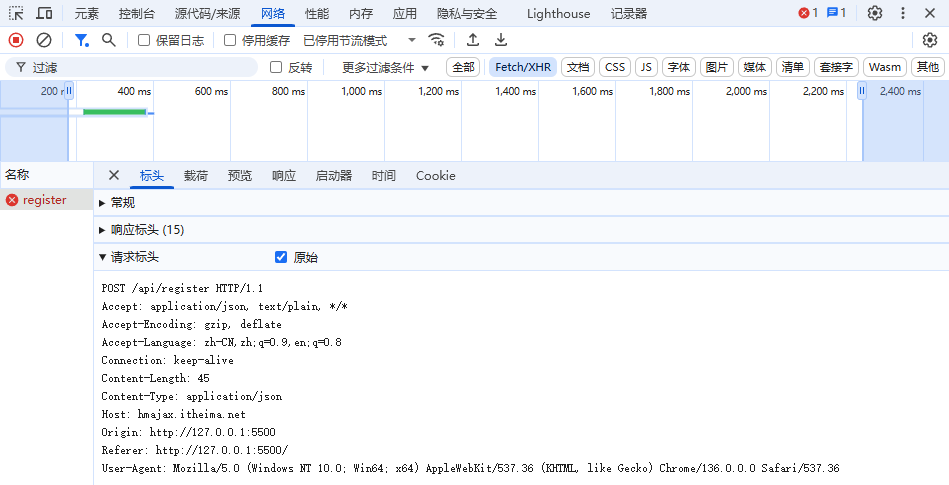

+ **请求行：**方法（GET/POST等）、URI、协议版本（如GET /index.html HTTP/1.1）

+ **请求头：**附加信息（如Host: example.com、User-Agent）

+ **请求体（可选）：**POST/PUT方法提交的数据（如表单内容）


  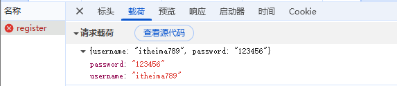

**处理请求：**服务器解析请求，执行逻辑（如查询数据库、生成动态页面）

**返回响应：**服务器构造**响应报文**，包含：


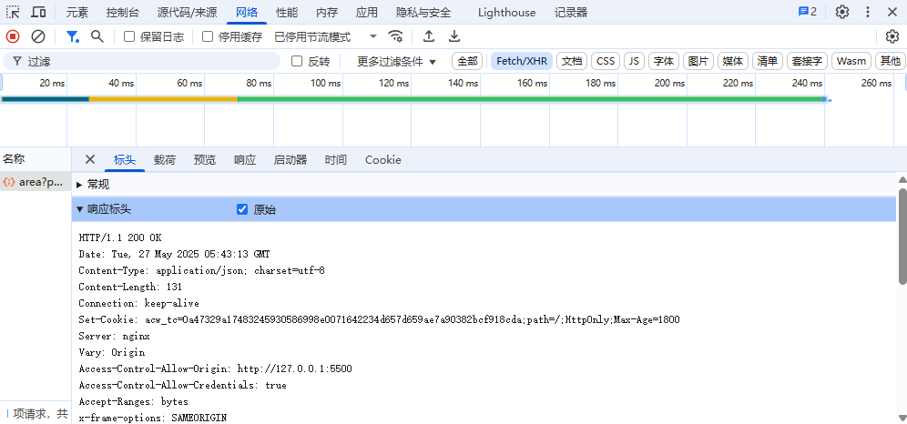

+ **状态行：**协议版本、状态码（如200 OK）、状态描述
+ **响应头：**元数据（如Content-Type/json、Content-Length）
+ **响应体：**实际数据（如HTML页面、JSON）

关闭连接：HTTP/1.1默认保持连接复用，HTTP/2/3支持长连接

通过开发者工具（如 Chrome 的 Network 面板）可实时查看实际请求头和响应头，帮助调试接口

## 请求方法（HTTP Method）
| **方法** | **作用** | **数据位置** | **典型场景** |
| :--- | :--- | :--- | :--- |
| `GET` | 获取资源（读） | URL 参数（例：`?id=1`） | 查商品列表、获取用户信息 |
| `POST` | 创建资源（写） | 请求体（Body） | 登录、提交表单 |
| `PUT` | 更新资源（全量修改） | 请求体 | 修改用户信息（全部字段） |
| `DELETE` | 删除资源 | URL 参数 | 删除购物车商品 |

**注意**：生产环境中`GET`请求**不允许修改**服务器数据，`POST`/`PUT`/`DELETE`用于写操作

**实例：**

```javascript
//GET 请求：获取ID=123的商品信息
GET/api/products?id=123
//返回商品 ID 为 123 的详情
//POST 请求示例：提交用户名和密码
POST /api/login
Body: { "username": "john", "password": "123456" }
//提交登录信息
```

**axios-查询案例**

+ **url**：请求的 URL 网址
+ **method**：请求的方法，`GET` 可以省略（不区分大小写）
+ **data**：提交数据（用于携带请求体内容，如 POST/PUT 请求的参数）

```javascript
axios({
  url: '目标资源地址',
  method: '请求方法', // 如 'GET', 'POST', 'PUT' 等（GET 可省略）
  data: {
    参数名: 值 // 接口所需的请求体参数
  }
}).then((result) => {
  // 处理响应数据（如渲染页面、更新状态等）
  console.log('服务器响应：', result);
});

-------------------------------------
// https://hmajax.itheima.net/api/province
axios({
  url: "https://hmajax.itheima.net/api/province",
  // method: "get",  // 默认get可以省略
}).then((result) => {
  console.log(result);
  console.log(result.status); // 200
  document.querySelector("p").innerHTML = result.data.list.join("<br>");
});
```

+ **method 简化**：当使用 `GET` 时，可省略 `method` 字段（axios 默认使用 `GET`）
+ **data 场景**：适用于需要发送请求体的请求（如 POST 提交表单、JSON 数据）；
+ `GET` 请求的参数通常通过 `params` 配置（若需查询参数可补充 `params: { key: value }`）
+ **响应处理**：`then` 回调接收服务器返回的响应对象（包含 `data`、`status`、`headers` 等属性），可根据业务需求解析数据（如 `result.data` 获取响应体）

## 状态码（Status Code）
HTTP响应状态码：用来表明请求是否成功完成


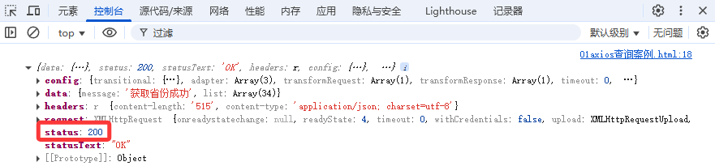

| 类别 | 含义 | 常见状态码 | 处理策略 |
| --- | --- | --- | --- |
| **2xx** | 成功 | 200（OK）、201（Created） | 继续处理响应数据 |
| 3xx | 重定向 | 301（永久重定向）、302（临时重定向） | 更新 URL 或重新发送请求 |
| **4xx** | 客户端错误 | 400（参数错误）、404（资源不存在） | 检查请求参数、URL 或权限设置 |
| 5xx | 服务器错误 | 500（内部错误）、503（服务不可用） | 联系运维、重试或启用备用服务 |

+ **1xx（信息类）**：`100 Continue`（客户端继续发送请求体）
+ **2xx（成功）**：`200 OK`（请求成功，返回数据）
+ **3xx（重定向）**：`301 Moved Permanently`（资源永久转移，自动跳转到新地址）
+ **4xx（客户端错误）**：`404 Not Found`（请求的资源不存在）、`403 Forbidden`（无权限访问）
+ **5xx（服务器错误）**：`500 Internal Server Error`（服务器代码出错）

## 数据格式
**JSON（主流）**  JavaScript Object Notation

轻量级数据格式，形如`{ "key": "value" }`

以下是一个典型的 JSON 数据示例，展示了包含多种数据类型（字符串、数字、布尔值、数组、嵌套对象）的结构化数据：

```json
{
  "name": "张三",
  "age": 25,
  "isStudent": true,
  "hobbies": ["跑步", "摄影"],
  "address": {
    "city": "加利福尼亚",
    "zipCode": 200000
  },
  "skills": [
    {"name": "Python", "level": "中级"},
    {"name": "JavaScript", "level": "初级"}
  ],
  "contact": null
}
```

**示例说明：**

+ **根结构**：整个 JSON 以对象`{}`作为根节点，包含多个键值对
+ **字符串（String）**：如`"张三"`、`"加利福尼亚"`，需用双引号包裹
+ **数字（Number）**：如`25`、`200000`，支持整数和浮点数
+ **布尔值（Boolean）**：如`true`、`false`，注意首字母小写
+ **数组（Array）**：如`hobbies`和`skills`，用`[]`包裹，元素间用逗号分隔
+ **嵌套对象（Nested Object）**：如`address`，对象内部也是键值对结构
+ **空值（Null）**：如`contact": null`，表示无值或未知状态

**常见应用场景：**

+ **前后端数据交互**：服务器返回用户信息、商品列表等数据
+ **配置文件**：存储应用程序的配置项（如接口地址、主题设置）
+ **日志记录**：结构化记录用户行为或系统日志
+ **API 响应**：RESTful API 通常以 JSON 格式返回数据

**用`JSON.parse()`转 JS 对象，`JSON.stringify()`转字符串**

**JSON 生成（Java）：**

```java
JSONObject obj = new JSONObject();
obj.put("name", "手机");
obj.put("price", 3000);
System.out.println(obj.toString());
```

**JSON 解析（JavaScript）：**

```javascript
const data = JSON.parse('{"name": "手机", "price": 3000}');
console.log(data.name); // 输出：手机
```

**XML（历史）**：早期用 XML，现在基本被 JSON 取代（JSON 更简洁易读）

# Axios 请求库
**基本定义：**Axios 是基于**Promise**的异步 HTTP 请求库，支持浏览器和 Node.js 环境，用于发送 HTTP 请求（如 GET、POST 等），实现前后端数据交互。它封装了原生 XHR（浏览器）和 Node.js `http` 模块，提供简洁 API，被 Vue、React 等框架推荐，是现代前端网络请求的核心工具

在 JavaScript 里，Promise 是处理异步操作的一种对象。它可以被看作是一个代表异步操作最终完成（或失败）及其结果值的占位符。打个比方，就如同你点外卖，下单之后会得到一个订单号，这个订单号就类似于 Promise，它保证你之后能收到外卖，但外卖送到需要一定时间。

```javascript
axios({
  url: '目标资源地址',
  method: '请求方法', // 如 'GET', 'POST', 'PUT' 等（GET 可省略）
  data: {
    参数名: 值 // 接口所需的请求体参数
  }
}).then((result) => {
  // 处理响应数据（如渲染页面、更新状态等）
  console.log('服务器响应：', result);
});

//  GET 请求
axios.get('https://api.example.com/data')
  .then(res => console.log(res.data))
  .catch(err => console.error(err));

//  POST 请求（带数据）
axios.post('https://api.example.com/user', { name: 'Alice' })
  .then(res => console.log('用户创建成功'));
```

## Axios 基础概念
**定义：**  

Axios 是一个用于发送 HTTP 请求的库，基于 Promise 实现，支持浏览器和 Node.js 环境，可替代传统的 XHR 和 Fetch API

**跨环境支持**：

+ **浏览器**：通过 XHR 发送请求，内置 XSRF 防御，支持 CORS 跨域
+ **Node.js**：使用 `http` 模块，适用于服务端 API 调用

**Promise 化 API**：  

支持 `async/await` 和链式调用（`.then()`/`.catch()`），简化异步逻辑，避免回调地狱

**回调地狱**是当处理多个异步操作时，由于层层嵌套回调函数而导致代码变得复杂、难以阅读和维护的一种情况

在异步进阶会详细讲解

**举个生活中的例子**：要完成一系列任务

1. 等快递员送货（异步操作 1）
2. 收到货后拆包裹（依赖操作 1 的结果）
3. 用包裹里的材料做饭（依赖操作 2 的结果）
4. 邀请朋友来吃饭（依赖操作 3 的结果）

**拦截器**：

+ **请求拦截**：统一处理请求头（如添加 Token）、参数格式化
+ **响应拦截**：全局解析数据、处理错误（如 401 登录失效）
+ **数据转换**：自动转换请求体为 JSON，响应数据解析为 JS 对象，无需手动处理
+ **并发请求**：通过 `axios.all()` 批量发送请求，`axios.spread()` 处理多响应，提升效率
+ **取消请求**：支持 `AbortController` 取消正在进行的请求（如防抖、页面卸载场景）

**典型场景：**

+ **前端数据渲染**：在 React/Vue 组件中发起请求，获取数据后渲染页面（如 `useEffect` 钩子）
+ **表单提交**：发送 POST 请求提交用户数据，配合拦截器处理 loading 和错误提示
+ **文件传输**：支持 `FormData` 上传文件，监听进度（`onUploadProgress`）
+ **服务端通信**：Node.js 环境中调用第三方 API（如支付、数据聚合），实现全栈交互

**优势与对比：vs 原生 XHR**：封装繁琐操作，代码更简洁，天然支持 Promise

**vs Fetch API**：

+ 错误处理更直观（HTTP 状态非 2xx 时 reject），内置拦截器，兼容性更好（支持旧浏览器）

**轻量与生态**：无 DOM 依赖（适合现代框架），社区丰富（插件如 `axios-mock-adapter` 用于测试）

**核心特点：**

+ 基于Promise，避免回调地狱，支持 async/await

+ 浏览器端支持 XMLHttpRequest，Node 端支持 http 模块

+ 支持请求 / 响应拦截器，方便统一处理请求参数和响应数据

  支持请求取消、请求超时、请求重试等高级功能

+ 自动转换请求和响应数据（如 JSON 序列化 / 反序列化）

## 基本用法
**安装引入**

```bash
pnpm/npm install axios
# 或 yarn add axios
<script src="https://unpkg.com/axios/dist/axios.min.js"></script>
```

**基本请求示例**

```javascript
// 发送 GET 请求
axios.get('/api/data')
  .then(response => {
    console.log(response.data);
  })
  .catch(error => {
    console.error('请求错误:', error);
  });

// 发送 POST 请求
axios.post('/api/user', { name: 'John', age: 30 })
  .then(response => {
    console.log(response.data);
  });

// 并发请求
axios.all([
  axios.get('/api/data1'),
  axios.get('/api/data2')
])
.then(
    axios.spread((res1, res2) => {
      console.log(res1, res2);
    })
  );
// .then((responses) => {
//   console.log(responses);
//   // responses 是包含两个响应的数组
//   const result1 = responses[0];
//   const result2 = responses[1];
//   console.log(result1.data, result2.data); // 打印响应数据
// });
```

“spread” 常见词性为动词和名词。作动词时，最基本含义为 “展开、铺开”

**请求配置参数**  

发送请求时可传递配置对象，常用参数：

```javascript
axios({
  method: 'get',         // 请求方法（get/post/put/delete 等）
  url: '/api/data',       // 请求 URL
  data: { key: value },   // POST/PUT 请求的请求体
  params: { id: 1 },      // GET 请求的 URL 参数
  headers: { 'X-Token': 'xxx' }, // 请求头
  baseURL: 'https://api.example.com', // 基础 URL
  timeout: 5000,          // 请求超时时间（毫秒）
  withCredentials: true,  // 跨域请求时携带 cookie
  responseType: 'json',   // 响应类型（json/blob/text 等）
  onUploadProgress: progressEvent => { /* 上传进度处理 */ },
  onDownloadProgress: progressEvent => { /* 下载进度处理 */ }
});
```

## 响应结构
Axios 的响应包含以下属性：

```javascript
{
  data: {},                // 服务器返回的响应数据
  status: 200,             // HTTP 状态码
  statusText: 'OK',        // 状态文本
  headers: {},             // 响应头
  config: {},              // 请求配置
  request: {}              // 原始请求对象（浏览器中为 XHR）
}
```

## 拦截器（Interceptors）
拦截器用于全局处理请求和响应，例如添加 token、处理错误：

```javascript
// 请求拦截器：发送请求前做点什么
axios.interceptors.request.use(
  config => {
    // 添加 token 到请求头
    const token = localStorage.getItem('token');
    if (token) {
      config.headers['Authorization'] = `Bearer ${token}`;
    }
    return config;
  },
  error => {
    return Promise.reject(error);
  }
);

// 响应拦截器：接收响应后做点什么
axios.interceptors.response.use(
  response => {
    // 成功响应处理（如统一解析数据）
    return response.data;
  },
  error => {
    // 错误响应处理（如 token 过期、404 等）
    if (error.response) {
      // 服务器返回了状态码（4xx/5xx）
      switch (error.response.status) {
        case 401:
          // 未授权，跳转登录页
          break;
        case 404:
          // 资源不存在
          break;
      }
    } else if (error.code === 'ERR_NETWORK') {
      // 网络错误（如断网）
      console.log('网络连接失败');
    }
    return Promise.reject(error);
  }
);
```

## 实例创建与配置
通过 `axios.create()` 创建自定义实例，用于不同场景的请求：

```javascript
// https://hmajax.itheima.net/api/province
// https://hmajax.itheima.net/api/city
// https://hmajax.itheima.net/api/area
// 创建axios实例
const axiosApi = axios.create({
  baseURL: "https://hmajax.itheima.net/api",
});
// 实例上也可添加拦截器
// api.interceptors.request.use(...);
// 使用实例发送请求
axiosApi.get("/province").then((result) => {
  console.log(result);
});
// 使用实例发送请求
axiosApi
  .get("/city", {
    params: {
      pname: "河北省",
    },
  })
  .then((result) => {
    console.log(result);
  });
```

## 错误处理
**请求错误类型**

+ **网络错误**：如超时（`ERR_TIMEOUT`）、断网（`ERR_NETWORK`）
+ **服务器错误**：如 404（资源不存在）、500（服务器内部错误）
+ **业务错误**：如服务器返回 `{ code: 400, message: '参数错误' }`


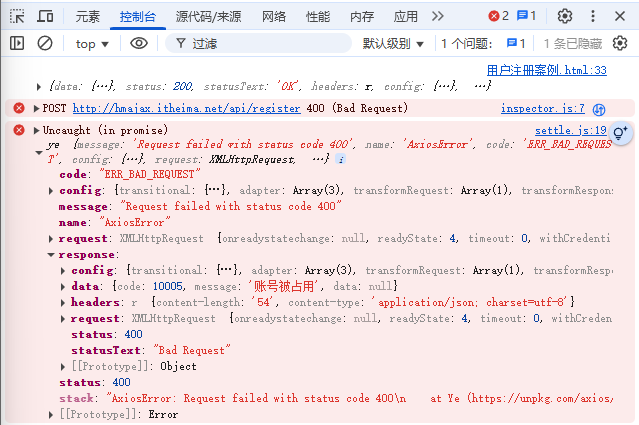

**错误捕获方式**

```javascript
// 方式一：通过 catch 捕获
axios.get('/api/invalid-url')
  .catch(error => {
    if (axios.isAxiosError(error)) {
      // 是 Axios 错误，可访问 error.response
      console.log('错误状态码:', error.response?.status);
    } else {
      // 其他错误（如 Promise 拒绝）
      console.log('未知错误:', error);
    }
  });

// 方式二：通过响应拦截器统一处理
axios.interceptors.response.use(
  undefined,
  error => {
    // 统一错误处理（如提示用户）
    return Promise.reject(error);
  }
);
```

## 高级功能
**取消请求（Cancel Token）**  

通过 `CancelToken` 取消未完成的请求，避免内存泄漏：

```javascript
const source = axios.CancelToken.source();

axios.get('/api/data', {
  cancelToken: source.token
}).catch(error => {
  if (axios.isCancel(error)) {
    console.log('请求已取消:', error.message);
  }
});

// 取消请求
source.cancel('请求被用户取消');
```

**请求重试**  

可通过第三方库（如 `axios-retry`）实现请求重试：

```bash
npm install axios-retry
```

```javascript
import axios from 'axios';
import axiosRetry from 'axios-retry';

axiosRetry(axios, {
  retries: 3,                 // 重试次数
  retryDelay: retryCount => { // 重试间隔
    return retryCount * 1000; // 第一次 1s，第二次 2s，第三次 3s
  },
  shouldResetTimeout: true    // 重置超时时间
});
```

**浏览器 XSRF 防护**  

通过配置 `withCredentials` 和 XSRF 相关参数：

```javascript
axios.defaults.withCredentials = true;
axios.defaults.xsrfCookieName = 'XSRF-TOKEN'; // cookie 中 XSRF 字段名
axios.defaults.xsrfHeaderName = 'X-XSRF-TOKEN'; // 请求头中 XSRF 字段名
```

**最佳实践：**

- **实例封装**：通过 `axios.create()` 创建自定义实例，统一配置基础 URL、超时、拦截器，模块化管理 API

- **错误处理**：全局捕获错误（如网络超时、404），提供统一提示（如 Toast 组件）

- **TypeScript 支持**：利用类型定义增强代码健壮性，配合接口声明确保数据类型安全

## form-serialize 插件
“serialize” 常见含义为 “使序列化；连载；使成系列” 。在计算机编程领域，特别是涉及到数据处理时，“serialize” 通常指将数据结构或对象转换为一种可以存储或传输的格式，以便在需要时可以恢复为原来的数据结构或对象，比如将复杂的对象转化为字节流或 JSON 字符串等形式，这就是 “序列化” 操作

**核心功能**

+ 快速收集表单数据，基于元素 `name` 属性生成键值对
+ 能够把表单数据序列化为查询字符串、JSON 对象或者数组
+ 支持嵌套字段，例如 `user[name]` 这种形式
+ 可以处理复选框、单选按钮以及文件上传等情况
+ 具备自定义序列化格式的能力

**参数**：

**表单 DOM**：`document.querySelector('.example-form')` 选中目标表单

**配置对象**：

+ `hash: true` 输出对象（`{ key: value }`），返回 JSON 对象
+ `hash:false` 输出查询字符串（`key=value`）
+ `empty: true` → 包含空值（如空输入框），`false` 忽略空值

```javascript
const form = document.querySelector('.example-form')
const jsonData = serialize(form, { hash: true });
```

**代码作用**：收集`.example-form`表单数据，生成包含空值的对象并打印

**应用场景：**

+ 表单提交前的数据序列化（如 AJAX 请求前处理），替代手动遍历表单元素，提升效率

**关键：**

+ 表单元素必须有`name`属性，否则无法被`serialize`识别
+ 配置参数灵活控制输出格式（对象 / 字符串）和空值处理，适配不同 HTTP 请求需求（如 POST 的`data`需对象，GET 的`params`需查询字符串）

## Bootstrap 弹框-属性控制

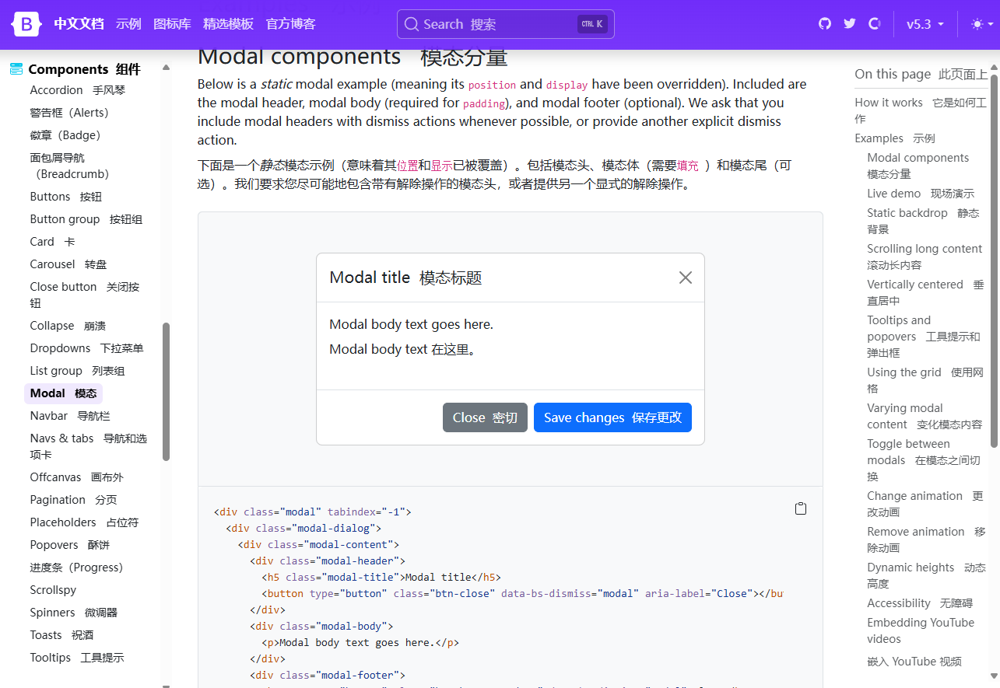

使用属性方式控制 Bootstarp 弹框的显示和隐藏

**Bootstrap 弹框**

不离开当前页面，显示单独内容，供用户操作

需求：使用 Bootstrap 弹框，先做个简单效果，点击按钮，让弹框出现，点击 X 和 Close 让弹框隐藏

**使用 Bootstrap 弹框**

1. 先引入 bootstrap.css 和 bootstrap.js 到自己网页中

```javascript
<script src="https://code.jquery.com/jquery-3.3.1.slim.min.js" integrity="sha384-q8i/X+965DzO0rT7abK41JStQIAqVgRVzpbzo5smXKp4YfRvH+8abtTE1Pi6jizo" crossorigin="anonymous"></script>
<script src="https://cdnjs.cloudflare.com/ajax/libs/popper.js/1.14.7/umd/popper.min.js" integrity="sha384-UO2eT0CpHqdSJQ6hJty5KVphtPhzWj9WO1clHTMGa3JDZwrnQq4sF86dIHNDz0W1" crossorigin="anonymous"></script>
<script src="https://stackpath.bootstrapcdn.com/bootstrap/4.3.1/js/bootstrap.min.js" integrity="sha384-JjSmVgyd0p3pXB1rRibZUAYoIIy6OrQ6VrjIEaFf/nJGzIxFDsf4x0xIM+B07jRM" crossorigin="anonymous"></script>
```

2. 准备弹框标签，确认结构（可以从 Bootstrap 官方文档的 Modal 里复制基础例子）- 运行到网页后，逐一对应标签和弹框每个部分对应关系

**自定义属性控制 Bootstarp 弹框显示隐藏**

```html
!-- Button trigger modal 触发模态框的按钮-->
<button
  type="button"
  class="btn btn-primary"
  data-toggle="modal" 
  data-target="#exampleModal" 
>
  启动!
</button>
<!-- 
按钮类型：type="button" 定义这是一个普通按钮（非提交 / 重置按钮）
样式类：class="btn btn-primary" 使用 Bootstrap 的类，定义这是一个蓝色主按钮
数据属性：data-toggle="modal" 告诉 Bootstrap 这是一个模态框触发器
数据目标：data-target="#exampleModal" 指定要触发的模态框的css选择器
按钮文本：启动!文字 按钮上显示的文字 
-->
<!-- Modal模态框 -->
<div
  class="modal fade"
  id="exampleModal"
  tabindex="-1"
  role="dialog"  
  aria-labelledby="exampleModalLabel"
  aria-hidden="true"
>
<!-- 
类名：class="modal fade"
  modal：Bootstrap 定义的模态框基础类
  fade：添加淡入淡出的过渡动画效果
ID：id="exampleModal" 模态框的唯一标识，与按钮的data-target对应
tabindex="-1"：使模态框可以通过键盘导航访问（-1 表示不可见时不获取焦点）
无障碍属性：
  role="dialog"：声明这是一个对话框
  aria-labelledby="exampleModalLabel"：指定模态框标题的关联元素
  aria-hidden="true"：初始状态下模态框对屏幕阅读器不可见
-->  
  <!-- 模态框对话框部分 -->
  <div class="modal-dialog" role="document">
    <div class="modal-content">
      <!-- 
      对话框容器：class="modal-dialog" 定义模态框的对话框区域
      角色声明：role="document" 表示对话框包含文档内容
      内容容器：class="modal-content" 定义模态框的内容区域，包含头部、主体和底部
      -->
      <!-- 模态框头部标题栏 -->
      <div class="modal-header">
        <h5 class="modal-title" id="exampleModalLabel">Modal title</h5>
        <!-- 
        标题元素：
        class="modal-title"：Bootstrap 定义的模态框标题类
        id="exampleModalLabel"：与aria-labelledby关联的标题 ID
        文本内容：Modal title 模态框的标题文字 
        -->
        <button
          type="button"
          class="close"
          data-dismiss="modal"
          aria-label="Close"
        >
          <span aria-hidden="true">&times;</span>
        </button>
        <!-- 
        关闭按钮：
          class="close"：Bootstrap 定义的关闭按钮样式
          data-dismiss="modal"：点击时关闭模态框
          内联文本：&times; 显示为 "×" 符号，作为关闭图标
        -->
      </div>
      <!-- 模态框主体 -->
      <!-- 
      主体容器：class="modal-body" 定义模态框的主要内容区域
      内容占位：... 实际开发中这里会放置表单、文本或其他内容
       -->
      <div class="modal-body">...</div>
      <!-- 模态框底部按钮栏 -->
      <div class="modal-footer">
        <button
          type="button"
          class="btn btn-secondary"
          data-dismiss="modal"
        >Close
        </button>
        <!-- 关闭按钮：
        class="btn btn-secondary"：灰色次要按钮样式
        data-dismiss="modal"：点击时关闭模态框
        文本内容：Close 按钮显示文字 
        -->
        <button type="button" class="btn btn-primary">Save changes</button>
        <!-- 
        保存按钮：
        class="btn btn-primary"：蓝色主按钮样式
        文本内容：Save changes 按钮显示文字，用于提交操作
        -->
      </div>
    </div>
  </div>
</div>
```


**使用 JS 方式控制 Bootstarp 弹框显示隐藏**

显示之前，隐藏之前，需要执行一些 JS 逻辑代码，需要引入 JS 控制弹框显示/隐藏的方式

例如：

+ 点击编辑姓名按钮，在弹框显示之前，在输入框填入默认姓名
+ 点击保存按钮，在弹框隐藏之前，获取用户填入的名字并打印

```javascript
// 创建弹框对象
const modalDom = document.querySelector('css选择器')
const modal = new bootstrap.Modal(modelDom)

// 显示弹框
modal.show()
// 隐藏弹框
modal.hide()
```

## 案例 - 图书管理
因为增删改查的业务在前端实际开发中非常常见，思路是可以通用的，所以总结下思路

**渲染列表（查）**

核心思路：获取数据 ---- 渲染数据

```javascript
// 获取数据渲染数据封装为函数方便调用
function renderBookList() {
// 1.1 获取数据
axios({
  url: "http://hmajax.itheima.net/api/books",
  method: "get",
  params: {
    creator: "admin",
  },
}).then((res) => {
  const bookList = res.data.data;
// 1.2 渲染数据
  document.querySelector(".list").innerHTML = bookList //获取表格tbody追加表格
    //map映射为新数组['<tr>...</tr>','<tr>...</tr>'...]
    .map((item, index) => {  
      return `
        <tr>
          <td>${index + 1}</td>
          <td>${item.bookname}</td>
          <td>${item.author}</td>
          <td>${item.publisher}</td>
          <td data-id=${item.id}>    // 注意此处添加自定义属性 id值
            <span class="del">删除</span>
            <span class="edit">编辑</span>
          </td>
        </tr>
      `;
    })
    .join(""); //数组拼接为字符串
});
}
renderBookList(); //  调用查询并渲染，刷新页面图书列表
```

**新增图书（增）**

核心思路：准备页面标签---- 收集数据提交（必须）---- 刷新页面列表（可选）

```javascript
// 2.1 创建弹框对象
const modal = new bootstrap.Modal(document.querySelector(".add-modal"));
// 给“新增按钮”绑定点击事件
document.querySelector(".add-btn").addEventListener("click", () => {
  // 收集新增表单数据
  const bookFormData = serialize(document.querySelector(".add-form"), {
    hash: true,
    empty: true,
  });
  // 向服务器提交数据
  axios({
    url: "http://hmajax.itheima.net/api/books",
    method: "post",
    data: { //因接口需要添加创建者，先展开书籍信息再添加
      ...bookFormData, 
      creator: "admin",
    },
  }).then((result) => {
    renderBookList(); //刷新页面图书列表
    document.querySelector(".add-form").reset(); //重置表单
    modal.hide(); //隐藏弹框
  });
});
```

**删除图书（删）**

核心思路：

绑定点击事件（获取删除的图书唯一标识）-- 调用删除接口（让服务器删除此数据）-- 重新刷新

```javascript
// 给删除元素添加点击事件，利用事件委托添加给 <tbody class="list">
document.querySelector(".list").addEventListener("click", (e) => {
  // 判断当前点击的元素是否是"删除"按钮
  if (e.target.classList.contains("del")) { //根据类名判断
    // 获取图书对象的自定义id属性、
    //<td data-id=${item.id}>    // 注意此处添加自定义属性 id值
      //<span class="del">删除</span>
      //<span class="edit">编辑</span>
    //</td>
    const id = e.target.parentNode.dataset.id; //span点击的父级td
    // 调用服务器删除图书接口
    axios({
      url: `http://hmajax.itheima.net/api/books/${id}`,
      method: "delete",
    }).then((result) => {
      // 刷新页面图书列表
      renderBookList();
    });
  }
});
```

**编辑图书（改）**

核心思路：

准备编辑图书表单 -- 表单回显编辑的数据 -- 点击修改收集数据 -- 提交服务器保存 -- 重新刷新

```javascript
// 4.1 创建"编辑图书弹框"对象
const editModal = new bootstrap.Modal(document.querySelector(".edit-modal"));
// 4.2 监听图书信息表单中"编辑按钮"点击
// 给编辑元素添加点击事件，利用事件委托添加给 <tbody class="list">
document.querySelector(".list").addEventListener("click", (e) => {
  // 判断点击的是否是编辑按钮
  if (e.target.classList.contains("edit")) {
    // 获取图书对象id，请求数据显示在表单里
    const id = e.target.parentNode.dataset.id;
    // 4.3 表单先显示正在编辑的数据
    axios({ // 根据id查询
      url: `https://hmajax.itheima.net/api/books/${id}`,
      method: "get",
    }).then((result) => {
      // 加载数据显示给表单
      const bookFormData = result.data.data;
      // 简化写法 遍历获取表单所有input标签逐个赋值
      document.querySelectorAll(".edit-form input").forEach((item) => {
        item.value = bookFormData[item.name];
      });
      //或者反过来遍历数据对象，使用属性去获取对应的标签，快速赋值
      const keys = Object.keys (bookFormData)
      keys.forEach(key => {
      document.querySelector(".edit-form .${key}").value = bookFormData[key]
      editModal.show(); // 完成数据业务后再显示编辑弹框
    });
  }
});
// 4.3 监听"编辑图书弹框"中的"修改按钮"点击
document.querySelector(".edit-btn").addEventListener("click", () => {
  // 获取修改完成的表单数据
  const bookFormData = serialize(document.querySelector(".edit-form"), {
    hash: true,
    empty: true,
  });
  // id隐藏，无需让用户修改操作
  // <input type="hidden" class="id" name="id" />
  // 4.4 提交编辑后的数据给服务器
  axios({
    url: `https://hmajax.itheima.net/api/books/${bookFormData.id}`,
    method: "put",
    data: {
      ...bookFormData,
      creator: "admin",
    },
  }).then((result) => {
    renderBookList();     // 刷新图书列表
    editModal.hide();     // 隐藏弹框
  });
});
```

## 案例 - 图片上传
用文件选择元素 --- 获取到文件对象 --- 装入 FormData 表单对象 ---- 发给服务器 ---- 得到图片在服务器的 URL 网址----再通过 img 标签加载图片显示

```html
<!-- 文件选择元素 -->
<input type="file" class="upload">
<div class="myimg">
  
</div>
<script src="...axios.min.js"></script>
<script>
  // 文件选择input元素添加change改变事件
  document.querySelector(".upload").addEventListener("change", function (e) {
    console.log(e.target.files);
    // 获取图片文件
    const file = e.target.files[0];
    // 创建 FormData 对象
    const formData = new FormData();
    // 添加图片文件
    formData.append("img", file);
    // 提交到服务器
    axios({
      url: "https://hmajax.itheima.net/api/uploadimg",
      method: "POST",
      data: formData,
    }).then((res) => {
      console.log(res);
      const imgUrl = res.data.data.url;
      document.querySelector(".myimg img").src = imgUrl;
    });
  });
</script>
```

# XMLHttpRequest对象(了解)
XMLHttpRequest 对象是 Ajax 的核心组件，用于在 JavaScript 中创建 HTTP 请求并处理响应

## 工作流程
1. **创建实例**：`const xhr = new XMLHttpRequest();`
2. **配置请求**：`xhr.open(method, url, async)`
3. **监听事件**：通过回调函数处理请求状态
4. **发送请求**：`xhr.send(data)`
5. **处理响应**：从 `xhr.responseText` 或 `xhr.response` 获取数据

## 生命周期
**初始化（`open()`）**

+ **方法调用：**通过 `xhr.open(method, url, async)` 初始化请求
+ 设置请求方法（如 `GET`/`POST`）、目标 URL 和异步标志（默认 `true`）
+ **状态变化：**调用 `open()` 后
+ `readyState` 从 `0`变为 `1`，此时可设置请求头（如 `Content-Type`）

**发送请求（`send()`）**

+ **发送数据**：调用 `xhr.send(data)` 发送请求体
+ 数据可为 `null`（GET 请求）、`FormData`、`Blob` 或 `JSON` 字符串
+ **状态变化**：`send()` 执行后
+ `readyState` 变为 `2`（HEADERS_RECEIVED），服务器响应头已接收

**接收响应（`readyState` 变化）**

+ **状态追踪：**`readyState` 依次变化
+  `3`（LOADING，正在接收响应体）和 `4`（DONE，请求完成）
+ **数据解析：**当 `readyState === 4` 且 `status === 200` 时
+ 通过 `responseText` 或 `response` 属性获取响应数据

**清理与复用**

+ 请求完成后，可通过 `xhr.abort()` 中止请求，或复用对象发送新请求（需重新调用 `open()`）

## 核心属性
**请求状态码：readyState**

+ 0：未初始化（未调用**open()**）
+ 1：已打开（**open()**已调用），未调用`send`
+ 2：已发送（**send()**已调用），头信息已接收
+ 3：接收中（响应头已接收，数据解析中）
+ 4：完成（响应数据接收完毕）

**HTTP 状态码：status**

（如 200、404、500）

**响应内容：responseType**

+ `xhr.responseXML` 接收 xml 格式的响应数据
+ `xhr.responseText` 接收文本格式的响应数据

**同步异步请求：**

+ 异步请求（async = true）：页面不会被阻塞，请求在后台进行
+ 同步请求（async = false）：页面会被阻塞，直到请求完成（不推荐）

**超时时间：timeout跨域请求凭证：withCredentials**

## 核心方法
**创建XHR对象：new XMLHttpRequest()**

所有现代浏览器（IE7+、Edge、Firefox、Chrome、Safari 以及 Opera）均内建 XMLHttpRequest 对象

XMLHttpRequest 用于在后台与服务器交换数据，在不重新加载整个网页的情况下对某部分进行更新

**初始化请求：xhr.open(method, url, async)**

+ **method**：请求方法，GET、POST等
+ **url**：请求地址URL
+ **async**：是否异步（默认为**true**）

**设置请求头：xhr.setRequestHeader(header, value)**

+ 需在**open**之后调用，一般不用设置

**发送请求：xhr.send(body)**

+ **body**：POST请求时传递的数据（如**"name=John&age=20"**）
+ POST 请求需结合 `setRequestHeader()` 指定数据格式

**取消正在进行的请求：xhr.abort()监听响应：onXXX**

+ `onload`：请求完成且状态码合法时触发（替代 `readyState === 4` 的检查）
+ `onerror`：网络错误或跨域问题导致请求失败时触发
+ `ontimeout`：请求超时（需提前设置 `xhr.timeout = 5000`）
+ `onprogress`监听数据传输进度，适用于大文件上传或下载：

```javascript
xhr.upload.onprogress = function(e) {
  const percent = (e.loaded / e.total) * 100;
  console.log(`上传进度：${percent}%`);
};
```

`onreadystatechange`（更底层，需检查`readyState`）

**推荐使用 `addEventListener` 替代传统的 `onload`/onerror**

+ 支持为同一事件注册多个回调
+ 更好的事件流控制（捕获 / 冒泡）
+ 更清晰的代码结构

```javascript
const xhr = new XMLHttpRequest();
xhr.open('GET', '/api/data', true);

// 监听请求开始
xhr.addEventListener('loadstart', () => {
  console.log("请求开始");
});

// 监听下载进度
xhr.addEventListener('progress', (event) => {
  if (event.lengthComputable) {
    const percent = (event.loaded / event.total) * 100;
    console.log(`下载进度: ${percent}%`);
  }
});

// 监听请求成功
xhr.addEventListener('load', () => {
  if (xhr.status === 200) {
    console.log("请求成功:", xhr.responseText);
  } else {
    console.error("HTTP 错误:", xhr.status);
  }
});

// 监听网络错误（如断网）
xhr.addEventListener('error', () => {
  console.error("网络错误");
});

// 监听超时
xhr.addEventListener('timeout', () => {
  console.error("请求超时");
});

// 监听请求结束（无论成功或失败）
xhr.addEventListener('loadend', () => {
  console.log("请求结束");
});

// 发送请求
xhr.send();
```

## 数据传输方式
**URL 参数（GET 请求）**

查询参数：携带额外信息给服务器，返回匹配想要的数据

+ 数据通过 URL 传递：
+ 查询参数原理要携带的位置和语法：[http://xxxx.com/xxx/xxx](http://xxxx.com/xxx/xxx)?参数名1=值1&参数名2=值2

```javascript
/**
 * 目标：使用XHR携带查询参数，展示某个省下属的城市列表
*/
const xhr = new XMLHttpRequest()
xhr.open('GET', 'http://hmajax.itheima.net/api/city?pname=辽宁省')
xhr.addEventListener('loadend', () => {
  console.log(xhr.response)
  const data = JSON.parse(xhr.response)
  console.log(data)
  document.querySelector('.city-p').innerHTML = data.list.join('<br>')
})
xhr.send()
```

+ 原生 XHR 需要自己在 url 后面携带查询参数字符串
+ axios 自动把 params 参数拼接到 url 字符串后面

**FormData（POST 请求）**

+ 适用于表单提交或文件上传：

```javascript
const formData = new FormData();
formData.append('username', 'admin');
formData.append('avatar', fileInput.files[0]);
xhr.send(formData);
```

**二进制文件上传**

+ 使用 `Blob` 或 `ArrayBuffer` 传输二进制数据：

```javascript
const blob = new Blob([binaryData], { type: 'image/png' });
xhr.send(blob);
```

**JSON 数据**

+ 设置 `Content-Type: application/json` 并发送 JSON 字符串：

```javascript
xhr.setRequestHeader('Content-Type', 'application/json');
xhr.send(JSON.stringify({ title: 'Hello', content: 'World' }));
```

## GET **查询参数**
参数直接拼接在URL后（查询字符串）

```javascript
// 示例：获取用户信息
xhr.open('GET', '/api/user?name=John&age=20', true);
xhr.send();
```

多个查询参数拼接很麻烦，用 URLSearchParams 把参数对象转成“参数名=值&参数名=值“格式的字符串，语法如下：

```javascript
// 1. 创建 URLSearchParams 对象
const paramsObj = new URLSearchParams({
  参数名1: 值1,
  参数名2: 值2
})

// 2. 生成指定格式查询参数字符串
const queryString = paramsObj.toString()
// 结果：参数名1=值1&参数名2=值2
```

+ 可见性：参数暴露在URL中（不适合敏感信息）
+ 长度限制：受浏览器URL长度限制（通常约2000字符）

需求：查询河北省下属的城市列表

```javascript
/**
 * 目标：使用XHR携带查询参数，展示某个省下属的城市列表
*/
const xhr = new XMLHttpRequest()
xhr.open('GET', 'http://hmajax.itheima.net/api/city?pname=辽宁省')
xhr.addEventListener('loadend', () => {
  console.log(xhr.response)
  const data = JSON.parse(xhr.response)
  console.log(data)
  document.querySelector('.city-p').innerHTML = data.list.join('<br>')
})
xhr.send()
```

## POST **数据提交**
参数通过请求体（Body）传递

```javascript
//发送表单数据：
xhr.open('POST', '/api/login', true);
xhr.setRequestHeader('Content-Type', 'application/x-www-form-urlencoded');
xhr.send('username=john&password=123456'); // 格式类似URL参数
//发送 JSON 数据：
xhr.open('POST', '/api/addProduct', true);
xhr.setRequestHeader('Content-Type', 'application/json');
xhr.send(JSON.stringify({ name: "手机", price: 2999 }));
------------------------------------------------------------------------

const xhr = new XMLHttpRequest()
xhr.open('请求方法', '请求url网址')
xhr.addEventListener('loadend', () => {
  console.log(xhr.response)
})

// 1.设置请求头- 告诉服务器传递的内容类型，是JSON 字符串
xhr.setRequestHeader('Content-Type', 'application/json')
// 2. 准备数据对象
const user = { username: 'itheima007', password: '7654321' }
// 对象转成 JSON 字符串
const userStr = JSON.stringify(user)
// 3. 发送请求体数据
xhr.send(userStr)
```

`JSON.stringify` 是 JavaScript 中的一个方法，用于将 JavaScript 对象或值转换为 JSON 字符串。它的主要作用是将复杂的数据结构，比如对象、数组等，转化为一种可以被存储、传输并且能被其他系统或程序轻松解析的字符串格式。

当**花括号**里**包含键值对**时，这就是**对象字面量**，属于对象类型

`{ username: 'itheima007', password: '7654321' }`

JSON（JavaScript Object Notation）格式和 JavaScript 对象字面量很相似，但存在一些差异

JSON 要求**属性名必须用双引号**括起来，并且它只是一种数据格式，并非 JavaScript 中的对象

`{ "username": "itheima007", "password": "7654321" }` 

+ 不可见性：参数在请求体中（相对安全）
+ 无长度限制：适合大数据传输（如文件上传）

注意：

1. 没有 axios 时需要自己设置请求头 **Content-Type：application/json**，来告诉服务器端发过去的内容类型是 JSON 字符串，让他转成对应数据结构取值使用
2. 没有 axios 前端要传递的请求体数据，需要自己把 JS 对象转成 JSON 字符串
3. 原生 XHR 需要在 send 方法调用时，传入请求体携带

**语义化差异**

+ **GET**：用于**获取数据**（查询、搜索）
+ **POST**：用于**提交数据**（创建、修改资源）

## 请求头
告诉服务器“我要发送什么格式的数据”。

```javascript
xhr.open('POST', '/api/submit', true);
// 设置内容类型（必须与发送的数据格式匹配！）
xhr.setRequestHeader('Content-Type', 'application/json');
xhr.send(JSON.stringify({ name: "John" }));
// 自定义头（需服务端支持CORS）
xhr.setRequestHeader('X-Requested-With', 'XMLHttpRequest');
```

**常见Content-Type类型application/x-www-form-urlencoded**：默认表单格式（键值对）

+ text复制下载name=John&age=20

**application/json：JSON格式**

+ json复制下载{ "name": "John", "age": 20 }
+ **multipart/form-data**：文件上传

## 响应头
```javascript
// 获取特定响应头（如服务器返回的Token）
const token = xhr.getResponseHeader('Authorization');

// 获取全部响应头（字符串形式）
const headers = xhr.getAllResponseHeaders();
```

**处理状态码**

```javascript
xhr.onreadystatechange = function() {
  if (xhr.readyState === 4) {
    if (xhr.status >= 200 && xhr.status < 300) {  // 2xx 均为成功
      console.log('成功:', xhr.responseText);
    } else if (xhr.status === 401) {
      alert('请先登录！');
    } else {
      console.error('请求失败:', xhr.status);
    }
  }
};
```

**案例1：GET请求获取省份列表**

```html
<p class="my-p"></p>
<script>
  /**
   * 目标：使用XMLHttpRequest对象与服务器通信
   *  1. 创建 XMLHttpRequest 对象
   *  2. 配置请求方法和请求 url 地址
   *  3. 监听 loadend 事件，接收响应结果
   *  4. 发起请求
  */
  // 1. 创建 XMLHttpRequest 对象
  const xhr = new XMLHttpRequest()

  // 2. 配置请求方法和请求 url 地址
  xhr.open('GET', 'http://hmajax.itheima.net/api/province')

  // 3. 监听 loadend 事件，接收响应结果
  xhr.addEventListener('loadend', () => {
    console.log(xhr.response)
    const data = JSON.parse(xhr.response)
    console.log(data.list.join('<br>'))
    document.querySelector('.my-p').innerHTML = data.list.join('<br>')
  })

  // 4. 发起请求
  xhr.send()
</script>
```

**案例2：POST请求提交用户注册表单**

```javascript
<!-- HTML表单 -->
<form id="register-form">
  <input type="text" name="username" placeholder="用户名">
  <input type="password" name="password" placeholder="密码">
  <button type="submit">注册</button>
</form>
```

```javascript
/**
 * 目标：使用xhr进行数据提交-完成注册功能
*/
document.querySelector('.reg-btn').addEventListener('click', () => {
  const xhr = new XMLHttpRequest()
  xhr.open('POST', 'http://hmajax.itheima.net/api/register')
  xhr.addEventListener('loadend', () => {
    console.log(xhr.response)
  })

  // 设置请求头-告诉服务器内容类型（JSON字符串）
  xhr.setRequestHeader('Content-Type', 'application/json')
  // 准备提交的数据
  const userObj = {
    username: 'itheima007',
    password: '7654321'
  }
  const userStr = JSON.stringify(userObj)
  // 设置请求体，发起请求
  xhr.send(userStr)
})
```

---

**关键细节说明**

1. **URL编码**：使用**encodeURIComponent()**处理特殊字符（如空格转为**%20**）
2. **安全性**：POST请求的密码仍需通过HTTPS加密传输

**错误处理**：在**onerror**事件中捕获网络错误

```javascript
xhr.onerror = function() {
  console.error('网络错误，请检查连接');
};
```

## 最佳实践
设置响应类型

```javascript
// 获取 JSON 数据
xhr.responseType = 'json';

// 获取二进制文件（如图片）
xhr.responseType = 'blob';
```

超时处理

```javascript
xhr.timeout = 5000; // 5 秒超时
xhr.addEventListener('timeout', () => {
  console.error("请求超时");
});
```

发送 POST 请求

```javascript
xhr.open('POST', '/api/login', true);
xhr.setRequestHeader('Content-Type', 'application/json');

const data = {
  username: 'john',
  password: '123456'
};

xhr.send(JSON.stringify(data));
```

跨域请求

```javascript
// 允许发送跨域 cookies
xhr.withCredentials = true;
```

上传进度监听

```javascript
// 监听上传进度（使用 xhr.upload 对象）
xhr.upload.addEventListener('progress', (event) => {
  if (event.lengthComputable) {
    const percent = (event.loaded / event.total) * 100;
    console.log(`上传进度: ${percent}%`);
  }
});
```

响应头处理

```javascript
xhr.addEventListener('load', () => {
  if (xhr.status === 200) {
    // 获取特定响应头
    const contentType = xhr.getResponseHeader('Content-Type');
    console.log("响应类型:", contentType);
  }
});
```

错误处理增强

```javascript
xhr.addEventListener('load', () => {
  switch (xhr.status) {
    case 200:
      console.log("成功:", xhr.response);
      break;
    case 401:
      console.log("未授权，需要登录");
      break;
    case 404:
      console.log("资源不存在");
      break;
    default:
      console.log("未知错误:", xhr.status);
  }
});
```

# 同步异步机制
## 同步代码（Synchronous）
定义：代码按顺序逐行执行，前一个任务完成后才会执行下一个任务，后续任务会被阻塞

**执行流程**：

```javascript
console.log("开始");
// 模拟一个耗时2秒的同步任务（如计算密集型操作）
for (let i = 0; i < 1000000000; i++) {}
console.log("结束"); // 必须等循环完成后才会输出
```

**特点**：

+ 代码顺序即执行顺序，逻辑简单直观。
+ 长时间运行的同步任务会阻塞主线程（如浏览器卡死）

## 异步代码（Asynchronous）
**定义**：任务发起后不阻塞后续代码执行，任务完成时通过回调、Promise 等机制通知程序处理结果

**执行流程**：

```javascript
console.log("开始");
// 模拟异步任务（如网络请求、定时器）
setTimeout(() => {
  console.log("异步任务完成");
}, 2000);
console.log("结束"); // 不等定时器完成就会输出
```

**特点**：

+ 不阻塞主线程，提高程序响应性
+ 异步任务的结果处理与代码顺序无关，需要特定机制（如回调）处理

## 典型场景
| **场景** | **同步代码** | **异步代码** |
| :--- | :--- | :--- |
| **文件读取** | `const data = fs.readFileSync("file");` | `fs.readFile("file", (err, data) => {});` |
| **网络请求** | （几乎不使用，会阻塞页面） | `fetch(url).then(response => {});` |
| **定时器** | （无意义，同步定时器会阻塞） | `setTimeout(() => {}, 1000);` |
| **数据库查询** | （极少使用，影响性能） | `db.query("SELECT *", (err, results) => {});` |

JavaScript 是**单线程**语言，通过**事件循环（Event Loop）** 机制实现异步，常见异步方案包括

+ **回调函数（Callback）**
+ **Promise**
+ **async/await（Promise 的语法糖）总结同步的性能风险**

长时间同步任务（如复杂计算、IO 操作）会阻塞主线程，导致界面卡顿（浏览器中）或程序无响应

**异步的性能优势**

释放主线程资源，允许并行处理多个任务，提升用户体验（如网页滚动时仍可加载图片）

合理使用异步（如 `Promise.all` 并行请求）可减少整体耗时

+ **同步**：排队买票，必须等前一个人买完才轮到你，期间你只能等待
+ **异步**：点外卖，下单后不需要一直等在店里，可以回家做其他事情，外卖送到时电话通知你

**优先使用异步**：

+ 对耗时操作（网络、IO）一律使用异步 API
+ 在浏览器中，避免在主线程执行大量同步计算，可使用 `Web Worker` 分线程处理

**合理处理异步结果**：

+ 复杂流程用 `Promise` 或 `async/await` 替代回调函数
+ 并行任务用 `Promise.all` 优化效率

**警惕异步中的坑**：

+ 异步任务的状态管理（如 Promise 的 pending 状态可能导致逻辑漏洞）
+ 错误处理的完整性（确保 `.catch()` 能捕获所有可能的异常）

## 回调函数
回调函数是 JavaScript 中一种基本的编程模式，它允许你将一个函数作为参数传递给另一个函数，并在某个事件发生或某个操作完成后执行，典型的定时器，计时器函数

简单来说，回调函数就是 “回头再调用” 的函数

回调函数的核心作用：解耦 “做事” 和 “处理结果”

```javascript
// 定义一个名为 makeCake 的函数，接受一个回调函数作为参数
function makeCake(callback) {
  // callback参数 = 箭头函数：
  // (cake) => { console.log("蛋糕制作完成", cake); }
  console.log("开始制作蛋糕");
  // setTimeout 模拟异步操作，延迟 3 秒执行
  setTimeout(() => {
    const cake = "生日蛋糕";
    console.log("蛋糕制作完成，耗时3秒", cake);
    // callback 是一个待执行的函数
    callback(cake);
  }, 3000);
  // 当这个操作完成后（即 3 秒后），代码执行以下步骤：
  // 创建变量 cake 并赋值为 "生日蛋糕"
  // 调用之前存储的 callback 函数，并将 cake 作为参数传递给它
  // 即执行 callback(cake)
}
//
makeCake((Readycake) => {
  // 当蛋糕制作完成后，回调函数被触发，并打印接收到的蛋糕信息
  console.log("蛋糕制作完成", Readycake);
});
console.log("这里代码无需等待3秒");
```

## 回调地狱（Callback Hell）
是指多个嵌套的回调函数导致的代码结构混乱问题，每个异步操作依赖前一个的结果，形成多层嵌套，回调函数嵌套层级过深，导致代码可读性和可维护性急剧下降的情况

假设你要完成一系列依赖的异步操作：

1. 买菜 → 2. 洗菜 → 3. 切菜 → 4. 炒菜 → 5. 装盘

每个步骤都依赖前一个步骤的结果，用回调函数实现会变成这样：

```javascript
buyVegetables(function(vegetables) {
  washVegetables(vegetables, function(cleanVegetables) {
    cutVegetables(cleanVegetables, function(cutVegetables) {
      cookVegetables(cutVegetables, function(cookedFood) {
        serveFood(cookedFood, function(readyDish) {
          console.log("终于可以吃了：", readyDish);
        });
      });
    });
  });
});
```

回调函数是异步编程的基础，通过将函数作为参数传递给异步操作，在操作完成后触发

回调地狱：多层嵌套回调导致代码难以维护，如连续读取多个文件时的嵌套结构  

解决方案：

+ 命名函数：拆分回调为独立函数，减少嵌套。
+ Promise 化：将回调转换为 Promise 链式调用

# Promise
“Promise” 常见词性为名词和动词。作名词时，它意为 “承诺；诺言；许诺” 

**JS 异步编程解决方案，用来处理异步回调地狱，替代层层嵌套回调函数**

Promise 对象用于表示一个**异步操作的最终状态**（完成或失败）及其**结果值**

+ 逻辑更清晰（成功或失败会关联后续的处理函数）
+ 了解 axios 函数内部运作的机制
+ 能解决回调地狱问题

语法：

`resolve` 常见意思为 “解决”，强调找到问题、困难等的解决方案，如 resolve a problem（解决问题） 

`reject` 常见词性为动词，确切含义为 “拒绝；否决；拒收；不予考虑” 

```javascript
// 1. 创建 Promise 对象
const p = new Promise((resolve, reject) => {
  // 2. 执行异步任务-并传递结果
  // 成功调用: resolve(值) 触发 then() 执行
  // 失败调用: reject(值) 触发 catch() 执行
})
// 3. 接收结果
p.then(result => {
  // 成功
}).catch(error => {
  // 失败
})
```

**链式调用：**通过 `.then()` 串联异步操作，避免嵌套

**异常捕获：**使用 `.catch()` 统一处理链中错误，或在 `.then()` 中传入第二个错误处理函数

```javascript
// promise重写以上函数
// 定义一个返回 Promise 的异步函数，用于制作蛋糕
function cookCake() {
  // 创建并返回一个 Promise 对象
  return new Promise((resolve, reject) => {
    // 使用 setTimeout 模拟一个耗时 3 秒的异步操作
    setTimeout(() => {
      // 假设蛋糕制作成功（实际应用中可能是基于某个条件判断
      const success = true;
      if (success) {
        const cake = "promise蛋糕";
        // 通过 resolve 方法将蛋糕对象作为成功结果传递给 Promise
        resolve(cake);
      } else {
        const error = "promise蛋糕制作失败";
        // 通过 reject 方法将错误信息作为失败原因传递给 Promise
        reject(error);
      }
    }, 3000);
  });
}
// 调用cookCake函数，并处理其返回的 Promise
cookCake()
// 使用 then 方法处理 Promise 成功的情况
  .then((cake) => {
    // 当 Promise 被 resolve 时，此回调函数被触发，
    // 参数 cake 即为 resolve 传递的值
    console.log("promise蛋糕制作完成", cake);
  })
  // 使用 catch 方法处理 Promise 失败的情况
  .catch((error) => {
    // 当 Promise 被 reject 时，此回调函数被触发，
    // 参数 error 即为 reject 传递的值
    console.log("promise蛋糕制作失败", error);
  });
```

批量处理：

+ `Promise.all([p1, p2])`：所有 Promise 成功时返回结果数组，任一失败则整体失败
+ `Promise.race([p1, p2])`：返回最先完成的 Promise（无论成功或失败）

 

## Promise  状态
概念：一个Promise对象，必然处于以下几种状态之一  

**待定（pending） ：**初始状态，既没有被兑现，也没有被拒绝 

**已兑现（fulfilled） ：**意味着，操作成功完成，调用 `resolve()` 后

**已拒绝（rejected） ：**意味着，操作失败  ，调用 `reject()` 后

`pending`常见含义为 “待定的；待处理的；即将发生的”

`fulfilled`意为操作成功完成，即已兑现

`rejected`意思是操作失败，被拒绝

每个 Promise 对象一旦被兑现/拒绝，那就是已敲定了，状态无法再被改变


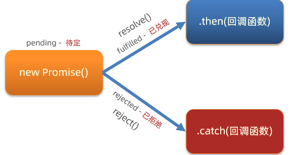

## Promise 链式调用
回调地狱： a(b(c(d(e()))))  

链式调用： a → b → c → d → e

把 **嵌套的回调** 改为 **线性的链式调用**，**每个异步**操作**返回**一个 **Promise概念：**依靠 then() 方法会**返回一个新生成的 Promise 对象**特性，继续串联下一环任务，直到结束

**细节：**then() 回调函数中的返回值，会影响新生成的 Promise 对象最终状态和结果

**好处：**通过链式调用，解决回调函数嵌套问题


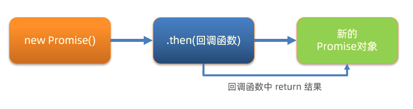

```javascript
/**
 * 目标：掌握Promise的链式调用
 * 需求：把省市的嵌套结构，改成链式调用的线性结构
*/
// 1. 创建Promise对象-模拟请求省份名字
const p = new Promise((resolve, reject) => {
  setTimeout(() => {
    resolve('北京市')
  }, 2000)
})

// 2. 获取省份名字
const p2 = p.then(result => {
  console.log(result)
  // 3. 创建Promise对象-模拟请求城市名字
  // return Promise对象最终状态和结果，影响到新的Promise对象
  return new Promise((resolve, reject) => {
    setTimeout(() => {
      resolve(result + '--- 北京')
    }, 2000)
  })
})

// 4. 获取城市名字
p2.then(result => {
  console.log(result)
})

// then()原地的结果是一个新的Promise对象
console.log(p2 === p)
```

```javascript
buyVegetables()
  .then(vegetables => washVegetables(vegetables))
  .then(cleanVegetables => cutVegetables(cleanVegetables))
  .then(cutVegetables => cookVegetables(cutVegetables))
  .then(cookedFood => serveFood(cookedFood))
  .then(readyDish => {
    console.log("终于可以吃了：", readyDish);
  })
  .catch(error => {
    console.error("做菜失败：", error.message);
  });
-----------------------------------------------
// Promise 链式调用
// 1.制作蛋糕
function makeFood() {
  return new Promise((resolve, reject) => {
    setTimeout(() => {
      const success = true;
      if (success) {
        const cake = "链式蛋糕";
        console.log("链式蛋糕3S制作完成", cake);
        resolve(cake);
      } else {
        const error = "链式蛋糕制作失败";
        reject(error);
      }
    }, 3000);
  });
}
// 2.装饰蛋糕
function decorateCake(cake) {
  return new Promise((resolve, reject) => {
    setTimeout(() => {
      const success = true;
      if (success) {
        const decorateCake = `${cake}水果装饰`;
        console.log("链式蛋糕5S装饰完成", decorateCake);
        resolve(decorateCake);
      } else {
        const error = "链式蛋糕装饰失败";
        reject(error);
      }
    }, 5000);
  });
}
// 3. 包装蛋糕（返回 Promise）
function packCake(decoratedCake) {
  return new Promise((resolve, reject) => {
    setTimeout(() => {
      const success = true;
      if (success) {
        const packedCake = `精美的礼盒装 ${decoratedCake}`;
        console.log("蛋糕包装1S完成:", packedCake);
        resolve(packedCake);
      } else {
        reject("包装失败: 礼盒损坏!");
      }
    }, 1000);
  });
}
// 链式调用
makeFood()
  .then((cake) => decorateCake(cake))
  .then((decoratedCake) => packCake(decoratedCake))
  .then((packedCake) => {
    console.log("最终的蛋糕:", packedCake);
  })
  .catch((error) => {
    console.log("发生错误:", error);
  });
```

每个 Promise 对象中管理一个异步任务，用 then 返回 Promise 对象，串联起来
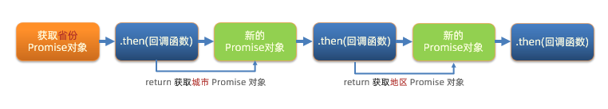

```javascript
/**
 * 目标：把回调函数嵌套代码，改成Promise链式调用结构
 * 需求：获取默认第一个省，第一个市，第一个地区并展示在下拉菜单中
*/
let pname = ''
// 1. 得到-获取省份Promise对象
axios({url: 'http://hmajax.itheima.net/api/province'}).then(result => {
  pname = result.data.list[0]
  document.querySelector('.province').innerHTML = pname
  // 2. 得到-获取城市Promise对象
  return axios({url: 'http://hmajax.itheima.net/api/city', params: { pname }})
}).then(result => {
  const cname = result.data.list[0]
  document.querySelector('.city').innerHTML = cname
  // 3. 得到-获取地区Promise对象
  return axios({url: 'http://hmajax.itheima.net/api/area', params: { pname, cname }})
}).then(result => {
  console.log(result)
  const areaName = result.data.list[0]
  document.querySelector('.area').innerHTML = areaName
})
```

**关键规则每个 `.then()` 返回新的 Promise**：

+ 如果前一个 `.then()` 的回调返回值是 Promise，则下一个 `.then()` 会等待这个 Promise 解决

**参数传递**：

+ 前一个 `.then()` 的返回值会作为参数传递给下一个 `.then()`

**错误处理**：

+ 任何一个环节出错，都会直接跳到最近的 `.catch()`

## Promise 总结
**Promise 本质上是回调函数的语法糖**，它并没有改变 JavaScript 的异步执行模型，而是通过更优雅的 API 让异步代码更易读、易维护。以下是详细解释：

**核心价值**

+ **代码可读性**：用线性链式调用（`.then()`）替代嵌套回调，避免 “回调地狱”
+ **错误处理统一**：所有错误可以通过一个 `.catch()` 捕获，无需在每个回调中单独处理
+ **状态管理**：Promise 有明确的状态（pending/fulfilled/rejected），且状态一旦改变就不可逆转，避免了回调函数可能出现的重复调用问题

**Promise 与回调函数的关系底层实现依赖回调**

Promise 内部依然使用回调函数，例如：

```javascript
new Promise((resolve, reject) => {
  // 异步操作完成后
  resolve(value); // 本质上是调用后续的 .then() 回调
});
```

**显式的状态管理**

回调函数本身没有状态，而 Promise 有明确的状态机，使得异步流程更可控

**性能方面的考量**

无显著性能提升

Promise 不会让异步操作执行得更快，例如：

```javascript
// 回调实现
setTimeout(() => console.log("回调"), 1000);

// Promise 实现
new Promise(resolve => {
  setTimeout(() => resolve(), 1000);
}).then(() => console.log("Promise"));
```

两者的耗时几乎相同，因为它们都依赖 `setTimeout` 这个异步 API

**轻微的额外开销**

Promise 的链式调用会引入极少量的额外开销（创建 Promise 对象、状态转换等），但在大多数场景下可以忽略不计

## Promise 和 XHR
用 Promise 管理 XHR 异步任务

步骤：

1. 创建 Promise 对象
2. 执行 XHR 异步代码，获取省份列表数据
3. 关联成功或失败回调函数，做后续的处理

错误情况：用地址错了404演示

获取省份列表核心代码如下：

```javascript
/**
 * 目标：使用Promise管理XHR请求省份列表
 *  1. 创建Promise对象
 *  2. 执行XHR异步代码，获取省份列表
 *  3. 关联成功或失败函数，做后续处理
*/
// 1. 创建Promise对象
const p = new Promise((resolve, reject) => {
  // 2. 执行XHR异步代码，获取省份列表
  const xhr = new XMLHttpRequest()
  xhr.open('GET', 'http://hmajax.itheima.net/api/province')
  xhr.addEventListener('loadend', () => {
    // xhr如何判断响应成功还是失败的？
    // 2xx开头的都是成功响应状态码
    if (xhr.status >= 200 && xhr.status < 300) {
      resolve(JSON.parse(xhr.response))
    } else {
      reject(new Error(xhr.response))
    }
  })
  xhr.send()
})

// 3. 关联成功或失败函数，做后续处理
p.then(result => {
  console.log(result)
  document.querySelector('.my-p').innerHTML = result.list.join('<br>')
}).catch(error => {
  // 错误对象要用console.dir详细打印
  console.dir(error)
  // 服务器返回错误提示消息，插入到p标签显示
  document.querySelector('.my-p').innerHTML = error.message
})
```

## 模拟 axios 函数封装
核心语法：

```javascript
function myAxios(config) {
  return new Promise((resolve, reject) => {
    // XHR 请求
    // 调用成功/失败的处理程序
  })
}

myAxios({
  url: '目标资源地址'
}).then(result => {
    
}).catch(error => {
    
})
```

1. 定义 myAxios 函数，接收配置对象，返回 Promise 对象
2. 发起 XHR 请求，默认请求方法为 GET
3. 调用成功/失败的处理程序
4. 使用 myAxios 函数，获取省份列表展示

```javascript
// 1. 定义myAxios函数，接收配置对象，返回Promise对象
function myAxios(config) {
  return new Promise((resolve, reject) => {
    // 2. 发起XHR请求，默认请求方法为GET
    const xhr = new XMLHttpRequest()
    xhr.open(config.method || 'GET', config.url)
    xhr.addEventListener('loadend', () => {
      // 3. 调用成功/失败的处理程序
      if (xhr.status >= 200 && xhr.status < 300) {
        resolve(JSON.parse(xhr.response))
      } else {
        reject(new Error(xhr.response))
      }
    })
    xhr.send()
  })
}

// 4. 使用myAxios函数，获取省份列表展示
myAxios({
  url: 'http://hmajax.itheima.net/api/province'
}).then(result => {
  console.log(result)
  document.querySelector('.my-p').innerHTML = result.list.join('<br>')
}).catch(error => {
  console.log(error)
  document.querySelector('.my-p').innerHTML = error.message
})
```

## Promise.all 静态方法
概念：**合并多个 Promise 对象**，等待所有同时成功完成（或某一个失败），做后续逻辑
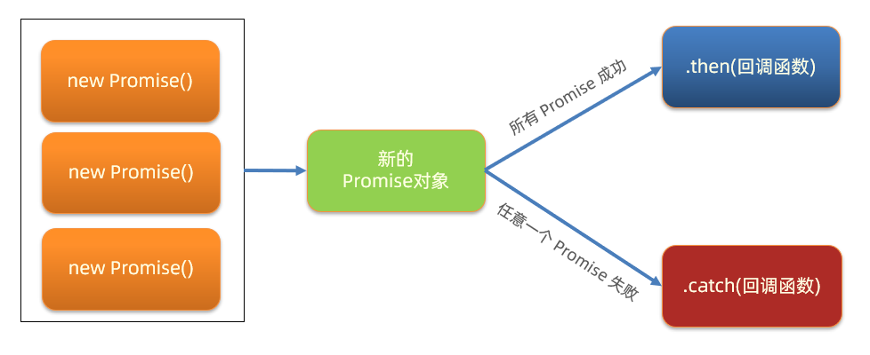

`Promise.all` 是 JavaScript 中用于并行处理多个 Promise 的静态方法

接收一个**可迭代对象（通常是数组）**，其中包含多个 Promise，并返回一个新的 Promise

这个新 Promise 会在所有输入的 Promise **都成功完成**时才成功

其结果是一个包含所有输入 Promise 结果的数组，顺序与输入的 Promise 顺序一致

如果任何一个输入的 Promise 被拒绝（rejected）

则整个 `Promise.all` 返回的 Promise 会立即被拒绝，并携带第一个被拒绝的原因

**核心特性并行执行**：所有 Promise 同时开始执行，不会按顺序等待

**全部成功才成功**：只有所有 Promise 都成功，返回的 Promise 才会成功

**失败优先**：只要有一个 Promise 失败，整个操作就失败，返回第一个失败的原因

**结果顺序固定**：无论 Promise 实际完成的时间如何，结果数组的顺序与输入 Promise 的顺序一致

**基本语法**

```javascript
Promise.all(iterable)
  .then(results => {
    // 所有 Promise 都成功时执行，results 是包含所有结果的数组
  })
  .catch(error => {
    // 任何一个 Promise 失败时执行，error 是第一个失败的原因
  });
```

**示例代码**

以下是一个使用 `Promise.all` 的完整示例：

通过 `axios` 发起四个城市的天气请求，每个请求返回 **Promise 对象**，分别对应北京、上海、广州、深圳，四个城市的天气会**同时显示**在页面上（因为并行请求效率更高）

```javascript
// 1. 定义四个城市的天气请求（返回 Promise 对象）
const bjPromise = axios({
  url: 'http://hmajax.itheima.net/api/weather',
  params: { city: '110100' } // 北京
});
const shPromise = axios({
  url: 'http://hmajax.itheima.net/api/weather',
  params: { city: '310100' } // 上海
});
const gzPromise = axios({
  url: 'http://hmajax.itheima.net/api/weather',
  params: { city: '440100' } // 广州
});
const szPromise = axios({
  url: 'http://hmajax.itheima.net/api/weather',
  params: { city: '440300' } // 深圳
});

// 2. 使用 Promise.all 并行执行所有请求
Promise.all([bjPromise, shPromise, gzPromise, szPromise])
  .then((results) => {
    // results 是按顺序排列的响应数组，对应 [北京, 上海, 广州, 深圳]
    const [bjRes, shRes, gzRes, szRes] = results;
    const weatherData = {
      北京: bjRes.data.weather,
      上海: shRes.data.weather,
      广州: gzRes.data.weather,
      深圳: szRes.data.weather
    };

    // 渲染到页面
    const container = document.getElementById('weather-container');
    container.innerHTML = Object.entries(weatherData)
      .map(([city, weather]) => `<div>${city}：${weather}</div>`)
      .join('');
    console.log('所有城市天气请求成功：', weatherData);
  })
  .catch((error) => {
    // 只要有一个请求失败，立即进入此处
    console.error('天气请求失败：', error.message);
    document.getElementById('weather-container').innerHTML = 
      `<p style="color: red;">${error.message}</p>`;
  });
```

**应用场景批量数据请求**：需要同时获取多个 API 的数据，全部成功后再处理

**并行任务处理**：多个独立的异步操作可以同时执行，提高效率

**资源加载**：页面需要加载多个资源（如图片、脚本），全部加载完成后再显示内容

**注意事项**

+ 如果输入的 Promise 中有非 Promise 值（如普通值），它们会被直接视为已解决的 Promise，并包含在结果数组中
+ 如果需要处理所有 Promise 的结果（无论成功或失败），可以使用 `Promise.allSettled`
+ 如果只关心第一个完成的 Promise（无论成功或失败），可以使用 `Promise.race`

# async / await
**语法糖：**`async/await` 基于 Promise，使异步代码写法类似同步，提升可读性

在 async 函数内，使用 await 关键字取代 then 函数，等待**获取 Promise 对象成功状态**的结果值 

`async`在编程中是用于定义异步函数的关键字

`awai` 在异步编程中，是一个关键字，用于暂停异步函数的执行，直到其所等待的 Promise 被解决（resolved）或被拒绝（rejected）。它只能在标记为 “async” 的异步函数内部使用

## 基本语法
```javascript
/**
 * 概念：在async函数内，使用await关键字，获取Promise对象"成功状态"结果值
 * 注意：await必须用在async修饰的函数内（await会阻止"异步函数内"代码继续执行，原地等待结果）
*/
// 1. 定义async修饰函数
async function getData() {
  // 2. await等待Promise对象成功的结果
  const pObj = await axios({url: 'http://hmajax.itheima.net/api/province'})
  const pname = pObj.data.list[0]
  const cObj = await axios({url: 'http://hmajax.itheima.net/api/city', params: { pname }})
  const cname = cObj.data.list[0]
  const aObj = await axios({url: 'http://hmajax.itheima.net/api/area', params: { pname, cname }})
  const areaName = aObj.data.list[0]

  document.querySelector('.province').innerHTML = pname
  document.querySelector('.city').innerHTML = cname
  document.querySelector('.area').innerHTML = areaName
}

getData()
```

优化技巧：

+ 并行请求：结合 `Promise.all()` 加速多个异步操作
+ 错误处理：用 `try-catch` 包裹 `await`，避免未捕获的异常

## 错误处理
`async/await`使用传统的`try/catch`块来捕获和处理错误，比 Promise 链中的`.catch()`更直观

```javascript
try {
  // 要执行的代码
} catch (error) {
  // error 接收的是，错误消息
  // try 里代码，如果有错误，直接进入这里执行
}

/**
 * 目标：async和await_错误捕获
*/
async function getData() {
  // 1. try包裹可能产生错误的代码
  try {
    const pObj = await axios({ url: 'http://hmajax.itheima.net/api/province' })
    const pname = pObj.data.list[0]
    const cObj = await axios({ url: 'http://hmajax.itheima.net/api/city', params: { pname } })
    const cname = cObj.data.list[0]
    const aObj = await axios({ url: 'http://hmajax.itheima.net/api/area', params: { pname, cname } })
    const areaName = aObj.data.list[0]

    document.querySelector('.province').innerHTML = pname
    document.querySelector('.city').innerHTML = cname
    document.querySelector('.area').innerHTML = areaName
  } catch (error) {
    // 2. 接着调用catch块，接收错误信息
    // 如果try里某行代码报错后，try中剩余的代码不会执行了
    console.dir(error)
  }
}

getData()
```

并行执行多个异步操作

虽然`await`会暂停函数执行，但可以通过`Promise.all`来并行执行多个不依赖的异步操作，提高效率

```javascript
async function fetchAllData() {
    // 同时发起多个请求
    const [users, posts, comments] = await Promise.all([
        fetch('https://api.example.com/users').then(res => res.json()),
        fetch('https://api.example.com/posts').then(res => res.json()),
        fetch('https://api.example.com/comments').then(res => res.json())
    ]);
    
    return { users, posts, comments };
}
```

循环中的异步操作

在循环中使用`await`时需要特别注意，不同的循环方式会产生不同的执行效果

顺序执行（使用`for`/`for...of`）

```javascript
async function processItems(items) {
    for (const item of items) {
        // 逐个处理，等待前一个完成后再处理下一个
        await processItem(item); 
    }
}
```

并行执行（使用`map`+`Promise.all`）

```javascript
async function processItemsInParallel(items) {
    // 同时处理所有项
    const promises = items.map(item => processItem(item));
    await Promise.all(promises);
}
```

在类方法中使用

```javascript
class DataFetcher {
    constructor(apiBaseUrl) {
        this.apiBaseUrl = apiBaseUrl;
    }
    
    async fetchData(endpoint) {
        const response = await fetch(`${this.apiBaseUrl}/${endpoint}`);
        return response.json();
    }
    
    async fetchUserAndPosts(userId) {
        const user = await this.fetchData(`users/${userId}`);
        const posts = await this.fetchData(`posts?userId=${userId}`);
        return { user, posts };
    }
}
```

# 事件循环
JavaScript 的事件循环（Event Loop）是其**并发**模型的核心：作为**单线程**运行时的调度机制，负责 **依次执行同步代码、调度异步任务（如事件回调、定时器、异步 IO 等）** ，通过循环从任务队列中提取任务执行，实现非阻塞的并发能力，这与 C、Java 等多线程并发模型截然不同

```javascript
console.log(1)
setTimeout(() => {
  console.log(2)
}, 2000)
console.log(3)
//结果为：1 3 2   js不会选择原地等待2秒
-------------------------
console.log(1)
setTimeout(() => {
  console.log(2)
}, 0)
console.log(3)
//结果为：1 3 2
-------------------------
```

**作用：**事件循环负责执行代码，收集和处理事件以及执行队列中的子任务

> JavaScript 单线程（某一刻只能执行一行代码），为了让耗时代码**不阻塞其他代码**运行，设计了事件循环模型
>
> **概念：执行代码和收集异步任务的模型，在调用栈空闲，反复调用任务队列里回调函数的执行机制**

```javascript
console.log(1)  
setTimeout(() => {
  console.log(2)
}, 0)
console.log(3)
setTimeout(() => {
  console.log(4)
}, 2000)
console.log(5)
```

执行流程：

**同步代码优先执行**：`console.log(1)`、`console.log(3)`、`console.log(5)` 依次执行，输出 `1 3 5`

**异步任务（`setTimeout`）入队**：

+ 第一个 `setTimeout`（延迟 `0ms`）的回调 `console.log(2)` 先进入任务队列
+ 第二个 `setTimeout`（延迟 `2000ms`）的回调 `console.log(4)` 后入队（但延迟更久，最后执行）

**事件循环调度**：同步代码执行完后，事件循环从任务队列取出第一个异步任务（`console.log(2)`）执行，输出 `2`；待延迟结束后，执行第二个异步任务，输出 `4`

最终输出：`1 3 5 2 4`（与图中控制台输出一致）

核心逻辑：

+ **同步代码立即执行**
+ **异步任务（如 `setTimeout`）先入队列，待同步完成后按顺序（及延迟）执行**


## 宏任务与微任务
ES6 之后引入了 Promise 对象， 让 JS 引擎也可以发起异步任务

异步任务划分为了

+ **宏任务：**由**浏览器环境**执行的**异步**代码
+ **微任务：**由 **JS 引擎环境**执行的**异步**代码

宏任务和微任务具体划分：


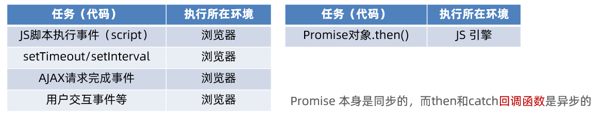


> 调用栈空闲后尝试调用任务队列，**优先调度微任务队列！！**
>
> **微任务队列空闲后，调用宏任务队列**

## 事件循环练习
```javascript
console.log(1)

setTimeout(() => {
  console.log(2)
  const p = new Promise(resolve => resolve(3))
  p.then(result => console.log(result))
}, 0)

const p = new Promise(resolve => {
  setTimeout(() => {
    console.log(4)
  }, 0)
  resolve(5)
})

p.then(result => console.log(result))

const p2 = new Promise(resolve => resolve(6))

p2.then(result => console.log(result))

console.log(7)
```

**核心规则：同步代码优先执行**（调用栈直接处理）

**微任务（Promise.then/catch/finally）**

+ 在当前宏任务执行完毕后，**立即清空微任务队列** 再执行下一个宏任务

**宏任务（setTimeout、setInterval 等）**

+ 入队后，需等待 “同步代码→微任务” 都处理完，才会依次执行

**执行步骤：同步代码执行（调用栈处理）：**

+ `console.log(1)` → 输出 `1`
+ 第一个 `setTimeout`（宏任务，记为 **宏 1**）：回调入**宏任务队列**，暂不执行
+ `new Promise((resolve) => { ... })`（记为 `p`）：
    - 构造函数内代码是**同步的**：
        * 内部 `setTimeout`（宏任务，记为 **宏 2**）入**宏任务队列**
        * `resolve(5)` 同步执行 → `p` 变为 resolved
        * 其 `then` 回调（`console.log(5)`）入**微任务队列**（记为 **微 1**）
+ `p.then(result => console.log(result))` → 就是上面的 **微 1**，已入队
+ `new Promise((resolve) => resolve(6))`（记为 `p2`）：
    - `resolve(6)` 同步执行 → `p2` 变为 resolved，其 `then` 回调（`console.log(6)`）入**微任务队列**（记为 **微 2**）
+ `console.log(7)` → 输出 `7`

**同步代码执行完毕，处理 微任务队列：**

微任务队列此时有 **微 1（输出 5）、微 2（输出 6）**，依次执行：

+ 微 1：`console.log(5)` → 输出 `5`
+ 微 2：`console.log(6)` → 输出 `6`

**处理 宏任务队列（按入队顺序，先取宏 1）：**

宏 1 是第一个 `setTimeout` 的回调，执行其中的代码：

+ `console.log(2)` → 输出 `2`
+ `new Promise(resolve => resolve(3))`：
    - 构造函数内 `resolve(3)` 同步执行 → 其 `then` 回调（`console.log(3)`）入**微任务队列**（记为 **微 3**）
+ 此时，**宏 1 的同步代码执行完毕**，需先处理新产生的 **微任务队列**（微 3）：
    - 微 3：`console.log(3)` → 输出 `3`

** 处理下一个宏任务（宏 2，即 `p` 构造函数内的 `setTimeout` 回调）：**

+ `console.log(4)` → 输出 `4`

最终输出顺序：

`1 → 7 → 5 → 6 → 2 → 3 → 4`

> **核心难点:**
>
> **宏任务执行过程中产生的微任务，会在当前宏任务结束后、下一个宏任务开始前立即执行（插队处理）**

# 案例
## 商品分类
获取-一级商品分类

GET    https://hmajax.itheima.net/api/category/top

获取-二级商品分类

GEThttps://hmajax.itheima.net/api/category/sub

请求参数Query 参数

id string 

顶级分类id

必需示例值:1005000

```html
<!DOCTYPE html>
<html lang="en">

<head>
  <meta charset="UTF-8">
  <meta name="viewport" content="width=device-width, initial-scale=1.0">
  <title>Document</title>
  <script src="https://unpkg.com/axios/dist/axios.min.js"></script>
  <style>
    .app {
      width: 100%;
      height: 100%;
    }
    .app ul{ 
      display: flex;
      flex-wrap: wrap;
    }
    .app ul li{ 
      /* 水平列布局 */
      justify-content: center;
      align-items: center;
      /* 去除默认样式 */
      list-style: none;
    }
    .app ul li img{ 
      width: 100px;
      height: 100px;
    }
  </style>

</head>

<body>
  <div class="app">
    <ul>
      <p>1</p>
      <li>
        <a href="">
           
          <p>22</p>
        </a>
      </li>
    </ul>
  </div>

  <script>
    async function getTop() {
      const Top = await axios({
        url: 'https://hmajax.itheima.net/api/category/top'
      })
      console.log(Top.data.data)
      const second = Top.data.data.map(item => {
        return axios({
          url: 'https://hmajax.itheima.net/api/category/sub?id=' + item.id
        })
      })
      console.log(second) // [Promise, Promise] 二级请求promise对象
      const secondData = await Promise.all(second)
      console.log(secondData)
      const secondLists = secondData.map(item => {
        // return item.data.data
        const secondData = item.data.data
        return `
        <h3>${secondData.name}</h3>
        <ul>
          ${secondData.children.map(item => {
          return `
            <li>
              <a href="">
                
                <p>${item.name}</p>
              </a>
            </li>
          `
        }).join('')}
        </ul>
        `
      }).join('')
      console.log(secondLists)
      document.querySelector('.app').innerHTML = secondLists
    }
    getTop()
  </script>
</body>

</html>
```

## 省份菜单

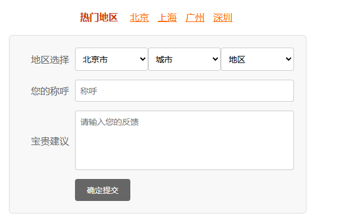

**GET**https://hmajax.itheima.net/api/province

**GET**https://hmajax.itheima.net/api/city 

| 参数名 | 类型 | 示例 | 是否必须 |
| --- | --- | --- | --- |
| **pname** | **string** | **辽宁省** | 必需 |

**GET**https://hmajax.itheima.net/api/area

| 参数名 | 类型 | 示例 | 是否必须 |
| --- | --- | --- | --- |
| **pname** | **string** | **辽宁省** | 必需 |
| **cname** | **string** | **大连市** | 必需 |

```html
<!DOCTYPE html>
<html lang="en">

<head>
  <meta charset="UTF-8">
  <meta name="viewport" content="width=device-width, initial-scale=1.0">
  <title>Document</title>
  <script src="https://unpkg.com/axios/dist/axios.min.js"></script>
  <style>
    /* 全局样式重置 */
    * {
      margin: 0;
      padding: 0;
      box-sizing: border-box;
      font-family: "Microsoft YaHei", sans-serif;
    }

    /* 容器布局 */
    .container {
      width: 500px;
      margin: 30px auto;
    }

    /* 热门校区导航 */
    .nav {
      text-align: center;
      margin-bottom: 20px;
    }

    .nav .title {
      color: #c30;
      /* 标题颜色（模拟截图的棕色） */
      font-weight: bold;
      margin-right: 10px;
    }

    .nav .city {
      color: #f60;
      /* 城市链接颜色 */
      margin: 0 5px;
      cursor: pointer;
      text-decoration: underline;
    }

    /* 表单区域 */
    .form-box {
      background: #f8f8f8;
      padding: 20px;
      border: 1px solid #ddd;
      border-radius: 6px;
    }

    .form-group {
      display: flex;
      align-items: center;
      margin-bottom: 15px;
    }

    .form-group label {
      width: 80px;
      text-align: right;
      margin-right: 10px;
      color: #666;
    }

    .form-group select,
    .form-group input,
    .form-group textarea {
      flex: 1;
      padding: 8px;
      border: 1px solid #ccc;
      border-radius: 4px;
      font-size: 14px;
    }

    .form-group textarea {
      height: 100px;
      resize: none;
      /* 禁止拉伸 */
    }

    /* 提交按钮 */
    button {
      margin-left: 90px;
      /* 与label宽度对齐 */
      padding: 10px 20px;
      background: #666;
      color: #fff;
      border: none;
      border-radius: 4px;
      cursor: pointer;
    }

    button:hover {
      background: #555;
    }
  </style>
</head>

<body>
  <div class="container">
    <!-- 热门地区导航 -->
    <div class="nav">
      <span class="title">热门地区</span>
      <span class="city">北京</span>
      <span class="city">上海</span>
      <span class="city">广州</span>
      <span class="city">深圳</span>
    </div>

    <!-- 反馈表单 -->
    <div class="form-box">
      <div class="form-group">
        <label>地区选择</label>
        <select class="provinceOption">
          <option>省份</option>
        </select>
        <select class="cityOption">
          <option>城市</option>
        </select>
        <select class="areaOption">
          <option>地区</option>
        </select>
      </div>

      <div class="form-group">
        <label>您的称呼</label>
        <input class="username" type="text" placeholder="称呼" />
      </div>

      <div class="form-group">
        <label>宝贵建议</label>
        <textarea class="feedback" placeholder="请输入您的反馈"></textarea>
      </div>

      <button class="submit" type="submit">确定提交</button>
    </div>
  </div>
  <script>
    // 1.设置省份数据到下拉菜单
    axios({
      url: 'https://hmajax.itheima.net/api/province'
    }).then(res => {
      const proviceStr = res.data.list.map(item =>
        `<option value="${item}">${item}</option>`
      ).join('')
      console.log(proviceStr)
      document.querySelector('.provinceOption').innerHTML += proviceStr
    })
    // 2.设置城市数据到下拉菜单
    async function getCity(provice) {
      // console.log('获取城市数据'+provice)
      const city = await axios({
        url: 'https://hmajax.itheima.net/api/city?pname=' + provice
      })
      console.log(city.data.list)
      const cityStr = city.data.list.map(item =>
        `<option value="${item}">${item}</option>`
      ).join('')
      document.querySelector('.cityOption').innerHTML += cityStr
    }
    // 用户选择省下拉框时调用获取城市数据
    document.querySelector('.provinceOption').addEventListener('change', e => {
      getCity(e.target.value)
      // 清空上一次的城市数据
      document.querySelector('.cityOption').innerHTML = '<option value="">城市</option>'
    })

    // 3.获取设置地区数据到下拉框
    async function getArea(city) {
      const area = await axios({
        url: 'https://hmajax.itheima.net/api/area',
        params: {
          pname: document.querySelector('.provinceOption').value,
          cname: city
        }
      })
      console.log(area.data)
      const areaStr = area.data.list.map(item => `<option value="${item}">${item}</option>`
      ).join('')
      document.querySelector('.areaOption').innerHTML += areaStr
    }
    // 用户选择下拉框时调用获取地区数据
    document.querySelector('.cityOption').addEventListener('change', e => {
      getArea(e.target.value)
      document.querySelector('.areaOption').innerHTML = '<option value="">地区</option>'
    })
    async function submit() {
      const data = {
        province: document.querySelector('.provinceOption').value,
        city: document.querySelector('.cityOption').value,
        area: document.querySelector('.areaOption').value,
        nickname: document.querySelector('.username').value,
        feedback: document.querySelector('.feedback').value
      }
      console.log(data)
      try {
        // post 提交
        const res = await axios({
          url: 'https://hmajax.itheima.net/api/feedback',
          method: 'post',
          data
        })
        console.log(res)
        alert(res.data.message)
      } catch (err) {
        console.log(err)
        alert(err.response.data.message)
      }
    }
    // 提交反馈
    document.querySelector('.submit').addEventListener('click', e => {
      submit()
    })
  </script>
</body>

</html>
```

