# JavaScript 简介
## JavaScript 概念
**概念**：JavaScript 是一种运行在**客户端（浏览器）** 的编程语言

**作用**：

+ 网页特效 (监听用户的一些行为让网页作出对应的反馈)
+ 表单验证 (针对表单数据的合法性进行判断)
+ 数据交互 (获取后台的数据, 渲染到前端)
+ 服务端编程 (node.js)

**主要应用场景**

+ 网页交互：DOM 操作、表单验证、动画效果
+ 前端框架：React、Vue、Angular 等构建复杂单页应用（SPA）
+ 后端开发：Node.js 实现服务器端逻辑（如 Express、NestJS）
+ 跨平台开发：Electron（桌面应用）、React Native（移动应用）
+ 工具生态：Webpack、Babel、ESLint 等构建工具链

**组成：**

**ECMAScript**：规定了 JS 基础语法核心，变量、数据类型、函数、对象等

**BOM**：浏览器对象模型，用于操作浏览器本身，如：页面弹窗

**DOM**：文档对象模型，用于操作 HTML 文档，如：改变标签内的内容

## 术语解释

**ECMA 国际**：负责制定信息技术行业标准的国际组织，主导 ECMAScript 脚本语言标准的更新与维护

**ECMAScript**：JS 的官方标准化规范，定义基础语法、数据类型、函数等核心规则，简称 ES

**ES6**：全称 ECMAScript 6.0，是 JS 历史上**最重大、最颠覆、影响最深远**的一次更新，2015.06 发版

**JavaScript**：主流客户端编程语言，最初运行在浏览器中，网页交互、数据处理，服务端、跨平台开发

**Node.js**：基于 JavaScript 的运行环境，让 JS 脱离浏览器，可实现后端服务器开发

**DOM**：文档对象模型，将 HTML 文档抽象为对象结构，用来操作页面标签、内容、样式

**BOM**：浏览器对象模型，提供操作浏览器窗口、弹窗、地址栏等浏览器本身功能的接口

**React**：主流前端框架，用于搭建用户界面，常用来开发单页应用

**Vue**：轻量易用的前端框架，上手简单，广泛应用于各类网页与前端项目

**Angular**：完整的前端框架，功能全面，适合开发大型企业级前端项目

**SPA**：单页应用，页面仅首次加载整体资源，后续通过局部刷新实现页面切换，体验更流畅

**Express**：基于 Node.js 的后端开发框架，简洁轻量，用于快速搭建 Web 服务

**NestJS**：基于 Node.js 的后端框架，架构规范，适合开发大型、可维护的服务端项目

**Electron**：跨平台桌面应用开发工具，使用前端技术即可制作 Windows、Mac 桌面软件

**React Native**：跨平台移动应用框架，用前端语法开发可同时运行在安卓、iOS 的手机应用

**Webpack**：前端打包构建工具，可整合、压缩、编译各类前端资源文件

**Babel**：JavaScript 转译工具，将高版本 JS 语法转为低版本，兼容老旧运行环境

**ESLint**：代码检查工具，用来规范 JS 代码格式、排查语法错误与不规范写法

## JavaScript 历史
**1995年**：由 Brendan Eich（就职于 Netscape 公司）在 10天内 设计完成，最初命名为 Mocha → LiveScript → JavaScript（为蹭当时热门的 Java 语言热度）

**1996年**：微软推出类似语言 **JScript**，导致兼容性问题，推动标准化需求

**1997年**：JavaScript 的语法规范提交至 **ECMA International**（欧洲计算机制造商协会），正式定名为 **ECMAScript**（简称 **ES**），首个标准 **ES1** 发布

**1999年**：**ES3** 成为广泛支持的里程碑版本，新增正则表达式、异常处理等

**2009年**：**ES5** 引入严格模式（`"use strict"`）、JSON 支持，并修复早期设计缺陷

**2015年**：**ES6（ES2015）** 重大更新，标志现代 JavaScript 的起点，新增：

+ 块级作用域变量（`let`/`const`）
+ 箭头函数（`=>`）、类（`class`）
+ 模块化（`import`/`export`）
+ Promise、解构赋值等等，

**2015年后**：每年发布新版本（ES2016/ES7、ES2017/ES8 等），采用渐进式更新策略，例如：

+ **ES2016**：`Array.prototype.includes`
+ **ES2020**：可选链（`?.`）、空值合并（`??`）
+ **ES2023**：数组支持 `toSorted`、`findLast` 方法

## ECMAScript
网景开发了 JavaScript ，一年后微软又模仿 JavaScript 开发了 JScript ，1997年：首个标准 ES1，为了统一网景（JavaScript）与微软（JScript）的分歧，几个公司联合 ECMA 组织定制了 JavaScript 语言的标准，被称为 ECMAScript 标准

官方标准：ECMAScript 是 JavaScript 语言的规范标准，由国际组织 ECMA International 制定，定义语言的语法、类型、核心功能等

**JavaScript** 是 ECMAScript 标准的**实现与扩展**

例如浏览器中的 DOM/BOM API 属于 JS 而非 ES 标准

# 基础语法
## 引入方式
**行内式**

是将JavaScript代码作为HTML标签的属性值使用

```html
<a href="javascript:alert('弹框');"> test </a>
<input type="button" onclick="alert('按钮弹框'); " value="test" >
```

**嵌入式**

在HTML中运用`<script>`标签及其相关属性可以嵌入 JavaScript 脚本代码

```html
<script type="text/javascript">
  // 此处为JavaScript代码
</script>
```

> 将`<script>`放在HTML文件的底部附近的原因是浏览器会按照代码在文件中的顺序加载 HTML
>
> 如果先加载的 JavaScript 期望修改其下方的 HTML，那么它可能由于 HTML 尚未被加载而失效
>
> 因此**将 JavaScript 代码放在 HTML页面的底部附近**通常是最好的策略

**外链式(推荐)**

将所有的 JavaScript 代码放在一个或多个以 .js 为扩展名的外部 JavaScript 文件中

通过`<srcipt>`标签将这些 JavaScript 文件链接到HTML文档中

```html
<script type="text/Javascript" src="脚本文件路径" >
</script>
```

+ 利于后期修改和维护
+ 减轻文件体积、加快页面加   载速度

**script标签中间无需写代码，否则会被忽略！**

script标签写`</body>`上面

**标签属性**

`type`属性

+ 默认的`type`就是 JavaScript ，所以不必显式地把`type`指定为 JavaScript 

`src`属性

+ 引入一个外部的js文件时，使用该属性指向文件的地址
+ script标签一旦用于引入外部文件了，在内部编写代码浏览器会忽略

```html
<script type="text/javascript" src="文件路径">
    ...
  //忽略此处的js代码
</script>
```

## 注释
通过注释可以屏蔽代码被执行或者添加备注信息

**单行注释**

使用 `// ` 注释单行代码

```html
<script>
  // 单行注释
  // 一次只能注释一行
  // 可以重复注释
  document.write('单行注释');
</script>
```

**多行注释**

使用 `/* */` 注释多行代码

```html
<script>
  /*
    多多多多多
    行行行行行
    注释注释
    */
  document.write('多行注释')
</script>
```

**注：编辑器中单行注释的快捷键为** `ctrl+/`

## 结束符
JavaScript的语法和Java语言类似，每个语句以`;`结束，语句块用`{...}`

JavaScript并**不强制要求**在每个语句的结尾加`;`

浏览器中负责执行JavaScript代码的引擎会自动在每个语句的结尾补上`;`

注意：为了风格统一，结束符要么每句都写，要么每句都不写（按照开发要求）

```javascript
var x = 1;
var x = 1; var y = 2; // 不建议一行写多个语句!
```

## 输入输出
输出和输入即人和计算机的交互，用户通过键盘、鼠标等向计算机输入信息，计算机处理后再展示结果给用户，这便是一次输入和输出的过程

**输出**

JavaScript 可以接收用户的输入，然后再将输入的结果输出：

`window.alert()` 会以**弹窗**形式展示（输出）给用户，`window. ` 可省略

`console.log()`会在**控制台打印**输出

`document.wirte()` **向body 输出**内容

> 注意：如果书写内容包含标签
>
> `document.write('<h1>这是一级标签</h1>')`
>
> 其中标签也会被解析成网页元素

**输入**

向 `prompt()` 输入任意内容会以**弹窗形式**出现在浏览器中

```javascript
// 输出语句
document.write('body内输出')
document.write('<h1>输出标签<h1>')
alert('弹框输出');
console.log('控制台输出')
// 输入语句
prompt('请输入您的姓名:')
```

## 变量

变量是计算机存储数据的“容器”

**内存：** 计算机中存储数据的地方，相当于一个空间 

**变量本质：** 是程序在**内存中**申请的一块用来**存放数据**的小**空间**

通过**变量名**可以到内存中找到对应的**空间**，就可以得到里面的数据

变量不是数据本身，它们仅仅是一个用于存储数值的容器

**变量声明**

声明(定义)变量有两部分构成：**声明关键字、变量名（标识）**

```javascript
// let 变量名
// 声明(定义)变量有两部分构成：声明关键字、变量名（标识）
// let 即关键字，所谓关键字是系统提供的专门用来声明（定义）变量的词语
// age 即变量的名称，也叫标识符
let age
```

关键字是 JavaScript 中内置的一些英文词汇（单词或缩写），它们代表某些特定的含义

如 `let` 的含义是声明变量的

**变量赋值**

声明（定义）变量相当于创造了一个空的“容器”，通过赋值向这个容器中添加数据

```javascript
let age
// 赋值，将 18 这个数据存入了 age 这个“容器”中
age = 18
// 这样 age 的值就成了 18
document.write(age)
// 也可以声明和赋值同时进行
let str = 'hello world!'
alert(str);
```

## 关键字
JavaScript 使用专门的关键字 `let` 和 `var`来声明（定义）变量

 `let`注意事项：

+ 允许声明时不初始化，但必须在声明后赋值才能使用
+ 变量会提升，但存在暂时性死区（TDZ）
+ 禁止重复声明同一作用域内的变量，否则报错
+ 每次循环迭代都会创建新的块级作用域变量
+ 全局声明的变量不会添加到全局对象中

```javascript
//声明赋值
let f;
f = 5; // 合法
//变量提升
console.log(b); // 报错：Cannot access 'b' before initialization
let b = 5;
//禁止重复声明
let d = 1;
let d = 2; // 报错：Identifier 'd' has already been declared
//循环
for (let j = 0; j < 3; j++) {}
console.log(j); // 报错：j未定义
//全局声明
let globalLet = 20;
console.log(window.globalLet); // 输出undefined
```

 `var` 注意事项：

+ 允许声明时不初始化，后续赋值
+ 变量会被提升到作用域顶部，但初始化为 `undefined`
+ 允许在同一作用域内重复声明变量，后续声明会覆盖前面的值
+ 循环中声明的变量会泄漏到全局作用域
+ 在全局作用域声明的变量会成为全局对象（如`window`）的属性

```javascript
//声明赋值
var e;
e = 5; // 合法
//变量提升
console.log(a); // 输出undefined
var a = 5;
//重复声明
var c = 1;
var c = 2; // 合法，c变为2
//循环中声明
for (var i = 0; i < 3; i++) {}
console.log(i); // 输出3（全局变量）
//全局声明
var globalVar = 10;
console.log(window.globalVar); // 输出10（浏览器环境）
```

`let`相较于 `var`提供了更严格的作用域和变量声明规则

```javascript
//var变量会泄漏到外层作用域
function example() {
  var x = 10;
  if (true) {
    var x = 20; // 覆盖外层x
  }
  console.log(x); // 输出20
}
//let变量仅在声明它的{}块内有效，包括if、for等结构
if (true) {
  let y = 10;
}
console.log(y); // 报错：y未定义
```

| 特性 | `var` | `let` |
| --- | --- | --- |
| 作用域 | 函数作用域 | 块级作用域 |
| 变量提升 | 提升并初始化为`undefined` | 提升但存在暂时性死区 |
| 重复声明 | 允许 | 禁止 |
| 循环变量泄漏 | 会泄漏到全局 | 不会泄漏 |
| 全局对象属性 | 是 | 否 |
| 声明前访问 | `undefined` | `ReferenceError` |

**推荐使用 `let` 声明变量！！！**

1. **避免意外作用域泄漏**（块级作用域更严格）
2. **防止变量提升导致的逻辑错误**（暂时性死区）
3. **禁止重复声明**（减少代码冲突）
4. **解决循环中的闭包问题**（每次循环独立作用域）
5. **避免污染全局对象最佳实践**

+ 默认使用 `let`
+ 需要常量时用 `const`
+ 避免使用 `var`（除非需要兼容旧代码）

## 变量名命名规则
+ 只能是**字母、数字、下划线、$**，且**不能数字开头**
+ 字母**严格区分大小写**，如 Age 和 age 是不同的变量
+ JavaScript 内部已占用于单词（关键字或保留字）不允许使用
+ 尽量保证变量具有一定的语义，见字知义
+ **遵循小驼峰命名，第一个单词首字母小写，后面大小 userName**

```javascript
let age = 18 // 正确
let age1 = 18 // 正确
let _age = 18 // 正确
let 1age = 18; // 错误，不可以数字开头
let $age = 18 // 正确
let Age = 24 // 正确，它与小写的 age 是不同的变量
let let = 18; // 错误，let 是关键字
let int = 123 // 不推荐，int 是保留字
```

## 常量
**概念：使用 const 声明的变量称为“常量”**

**使用场景：** 当某个变量永远不会改变的时候，就可以使用 const 来声明

**命名规范：** 和变量一致,通常**全字母大写**

```javascript
const PI = 3.14
```

> 注意： 常量**不允许重新赋值（只读）**，**声明的时候必须赋值（初始化）**
>
> **常量值为对象时其属性和方法允许重新赋值**

```html
<script>
  // 必须要有值
  const version = '1.0.0';

  // 不能重新赋值
  // version = '1.0.1';

  // 常量值为对象类型
  const user = {
    name: '小明',
    age: 18
  }

  // 不能重新赋值
  user = {};

  // 属性和方法允许被修改
  user.name = '小小明';
  user.gender = '男';
</script>

```

# 数据类型
计算机程序可以处理大量的数据，为了方便数据的管理，将数据分成了不同的类型：

**基本数据类型：存栈，值传递，不可变**

| 数据类型 | 描述 |
| :---: | --- |
| **number** | 数字（整数、小数、NaN(Not a Number)） |
| **string** | 字符串，单双引('...')、双引号("...")、反引号皆可，正常使用推荐单引号 |
| **boolean** | 布尔；true，false |
| **null** | 对象为空； 使用 `typeof` 时返回 `object` |
| **undefined** | 当声明的变量未初始化时，该变量的默认值是 undefined |
| **Symbol** | ES6 新增的原始数据类型，代表独一无二的值 |
| **bigint** | 大整数，如超大范围坐标，**必须加 `n`后缀**，不能与普通 Number 混合运算  |

**引用数据类型：存堆，址传递，共享数据**

+ Object ： 任意对象
+ Function： 一种特别的对象(可以执行) —内部包含可运行的代码
+ Array： 一种特别的对象(key为数值下标属性，内部数据是有序的)

| **维度** | **基本数据类型** | **引用数据类型** |
| :--- | :--- | :--- |
| 存储方式 | 栈内存中直接存储值 | 堆内存中存储值，栈内存存储地址 |
| 赋值 / 传参 | 复制值（独立副本） | 复制地址（共享同一份数据） |
| 比较方式 | 比较值是否相等 | 比较地址是否相同（引用相等） |

## 数值类型
数学中学习到的数字，可以是整数、小数、正数、负数

```javascript
let score = 100 // 正整数
let price = 12.345 // 小数
let temperature = -40 // 负数

document.write(typeof score) // 结果为 number
document.write(typeof price) // 结果为 number
document.write(typeof temperature) // 结果为 number

console.log('老师'-2)// NaN
//NaN 代表一个计算错误。它是一个不正确的或者一个未定义的数学操作所得到的结果
//NaN 是粘性的,任何对 NaN 的操作都会返回 NaN
console.log(NaN + 2)// NaN
//Number表示的数字大小有限，范围：± 1.7976931348623157e+308，超出返回± Infinity
Number.MAX_VALUE = 1.7976931348623157e+308
```

**JavaScrip是弱数据类型语言**，其中的数值类型与数学中的数字是一样的

分为正数、负数、小数等，只有赋值后才知晓数据库类型

Java这种强数据类型语言区分整数、浮点等，且声明变量时已经知晓数据类型

## 字符串类型
通过单引号（ `''`） 、双引号（ `""`）或反引号包裹的数据

单引号和双引号没有本质上的区别，**推荐使用单引号**

注意事项：

1. 无论单引号或是双引号必须成对使用
2. 单引号/双引号可以互相嵌套，但是**不能自已嵌套自已**
3. 必要时可以使用转义符 `\`，输出单引号或双引号

```javascript
let user_name = '小明' // 使用单引号
let gender = "男" // 使用双引号
let str = '123' // 看上去是数字，但是用引号包裹了就成了字符串了
let str1 = '' // 这种情况叫空字符串

documeent.write(typeof user_name) // 结果为 string
documeent.write(typeof gender) // 结果为 string
documeent.write(typeof str) // 结果为 string
```

**字符串拼接：**

`+`号运算符实现字符串拼接

数字相加，字符相连

**模版字符串：**

语法：字符串必须用**反引号**` `` `

内容：`${}`包裹变量名

```javascript
let age = 20
console.log('我今年' + age + '了')
console.log(`我今年${age}岁了`)
```

**去除字符串左右的空格**

`str.trim()`

```javascript
const str = '          im a teacher  '
console.log(str.trim())  // 去除字符串左右的空格
```

**字符串截取**

从开始位置截取到结束位置（不包括结束位置）

`字符串.substring(起始索引号, [结束索引号])`

```javascript
const str = 'hello'
str.substring(0,1)
```

## 布尔类型
表示肯定的数据用 `true`，表示否定的数据用 `false`

```javascript
let Bool = true // 是
Bool = false // 否
document.write(typeof Bool) // 结果为 boolean
```

## undefined
未定义是比较特殊的类型，只有一个值 undefined

**只声明变量，不赋值的情况下，变量的默认值为 undefined**

```javascript
let tmp;
document.write(typeof tmp) // 结果为 undefined
```

**注：JavaScript 中变量的值决定了变量的数据类型开发场景：** 值传递的时候，如果检测变量为undefined就说明值没有传递过来

##  Null
空值专门用来表示为空的**对象**，Null类型的值只有一个

Null 值表示一个**空对象指针**，而这也正是使用 typeof 操作检测 null 时会返回 **object**

```javascript
var a = null;
console.log(typeof a); // object
// 注：实际上，undefined 值是派生自 null 值得，因此 ECMA-262 规定对他们相等性测试要返回 TRUE
console.log(null == undefined); // TRUE
```

## 复杂数据类型
就是一组数据和功能的集合

```javascript
let person = {};
person.name="aini";
person.age=18;
person.say = function(){
console.log("my name is aini");

console.log(person); // {name: 'aini', age: 18, say: ƒ}
```

引用数据类型

```javascript
let arr = [1, 3, 4, 5];
console.log(arr); // (4) [1, 3, 4, 5]
function show(){};
console.log(show); // ƒ show(){}
let date = new Date();//  Mon Sep 12 2022 14:04:42 GMT+0800 (中国标准时间)
console.log(date);
```

## 类型转换
| 语句 | 作用 |
| --- | --- |
| Number(‘12’) | 转换为数字型 |
| parseInt(‘12px’) | 转换为整数数字型 |
| parseFloat(‘12.5px’) | 转换为小数数字型 |
| String(12) | 转换为字符串型 |
| 变量.toString() | 转换为字符串型 |
| Boolean() | 转换为布尔型 |

## 隐式转换
某些运算符被执行时，系统内部**自动将数据类型进行转换**，这种转换称为隐式转换

```javascript
let num = 10 // 数值
let num2 = '5' // 字符串

console.log(num + num2) // 结果为 105
console.log(typeof (num + num2)) //类型转换为string字符
// 原因是将数值 num 转换成了字符串，相当于 '10'
// 然后 + 将两个字符串拼接到了一起

console.log(num - num2) // 结果为 5
console.log(typeof (num - num2)) //类型转换为number数字
// 原因是将字符串 num2 转换成了数值，相当于 5
// 然后数值 10 减去 数值 5

let a = prompt('请输入一个数字')
let b = prompt('请再输入一个数字')

console.log(a + b);
```

**规则：**

+ `+`号两边只要有一个是**字符串**，都会把另外一个转成字符串
+ 除了`+`以外的算术运算符 比如`- * /`等都会把数据转成**数字类型缺点：**

+ 转换类型不明确，靠经验才能总结

**技巧：**

+ `+`号作为正号解析可以转换成数字型
+ 任何数据和字符串相加结果都是字符串

## 显式转换
过度依靠系统内部的隐式转换是不严谨的，通常需要对数据进行显示转换

**转换为数字型**

`Number(数据) `转成**数字**类型

`parselnt(数据) `只**保留整数**

`parseFloat(数据)`  可以**保留小数**转换为数字型

```javascript
console.log(parseInt('12px')); //12
console.log(parseFloat('12.3px')); //12.3
```

通过 `Number` 显示转换成数值类型，当转换失败时结果为 `NaN`（Not a Number）

```html
<script>
  let t = '12'
  let f = 8
  // 显式将字符串 12 转换成数值 12
  t = Number(t)
  //可以直接加一个+号转为数字
  let num = +prompt('请输入数字')

  // 检测转换后的类型
  // console.log(typeof t);
  console.log(t + f) // 结果为 20

  // 并不是所有的值都可以被转成数值类型
  let str = 'hello'
  // 将 hello 转成数值是不现实的，当无法转换成
  // 数值时，得到的结果为 NaN （Not a Number）
  console.log(Number(str))
</script>
```

 **Boolean(内容)**

`'空字符串' `、`0`、`undefined`、`null`、`false`、`NaN` 转换为布尔值后都是**false其余则为true**

有字符串的加法 “ ” + 1 ，结果是 “1” 

减法 - （像大多数数学运算一样）只能用于数字，它会使空字符串 "" 转换为 0 

null 经过数字转换之后会变为 0 

undefined 经过数字转换之后会变为 NaN

## 类型检测
### `typeof` 操作符
用于检测**基本数据类型**（松散数据类型），返回结果为**字符串**

**工作原理**：检测变量的类型标签（type tag）

可能返回以下字符串：

+ `"undefined"`
+ `"boolean"`
+ `"string"`
+ `"number"`
+ `"object"`（包含特殊情况：`null` 会返回 `"object"`，属于历史遗留问题）
+ `"function"`（若检测的是函数，会返回此值）

```javascript
console.log(typeof undefined); // "undefined"
console.log(typeof true);      // "boolean"
console.log(typeof "hello");   // "string"
console.log(typeof 123);       // "number"
console.log(typeof {});        // "object"
console.log(typeof null);      // "object"（特殊情况，需注意）
console.log(typeof function(){}); // "function"
```

+ 基本类型除了 `null`，typeof 都能正确识别，null → object（bug）
+ 无法区分数组`[]`、对象`{}`、日期`new Date()`、正则，都返回 `object`
+ 只有函数特殊：typeof 是 `function`

### `instanceof` 操作符
基于原型链判断**一个对象是否为某个构造函数的实例**，返回布尔值（`true`/`false`）

**工作原理**：检查左侧对象的原型链（`__proto__`）上是否存在右侧构造函数的`prototype`属性

**优点**：

+ **能区分具体的对象类型**：`[] instanceof Array` 返回 `true`
+ **支持自定义类型判断**：可以判断自定义类的实例

**缺点**：

+ **无法判断基本数据类型**：`'hello' instanceof String` 返回 `false`
+ 基本类型不是对象，没有原型链，它不是由`String`构造函数创建的对象实例
+ **原型链可被修改**：如果手动修改了对象的原型，`instanceof`的结果可能不准确
+ **跨 iframe 问题**：在不同的 iframe 中，同一个构造函数（如`Array`）的`prototype`是不同的，导致`instanceof`判断失败

**注意事项基本数据类型**检测时，**始终返回 `false`无法判断引用数据类型**（数组、普通对象、函数等）都是 `Object` 的实例，因此检测 “引用类型” 与 `Object` 构造函数时，`instanceof` 始终返回 `true`

`null` 特殊：`null instanceof Object` 返回 `false`（因为 `null` 不是对象实例，且原型链为 `null`）

```javascript
// 基本类型检测（返回 false）
var str = "w";
console.log(str instanceof String); // false
console.log(str instanceof Number); // false

// 引用类型检测
var o = new Object();
console.log(o instanceof Object); // true
console.log(o instanceof String); // false

var color = new Array();
console.log(color instanceof Object); // true（所有引用类型都是 Object 实例）
console.log(color instanceof Array);  // true（color 是 Array 构造的实例）
```

两者核心区别

| **对比维度** | **typeof** | **instanceof** |
| :--- | :--- | :--- |
| 检测目标 | 基本数据类型（`null`特殊） | 引用类型的 “具体构造类型” |
| 返回值类型 | 字符串 | 布尔值 |
| 适用场景 | 快速判断 “基本类型” | 精确判断 “引用类型的构造来源” |
| 特殊情况 | `typeof null`返回 `"object"` | 基本类型检测始终返回 `false` |

### Object.prototype.toString.call ()
这是最可靠、最全面的类型判断方法

**工作原理**：每个 JS 值**底层都藏着一个真实的内部类型标签，** JS 引擎在创建任何值时都会给它贴一个**内部标记，** 调用`Object`原型对象上的`toString`方法，并使用`call`改变其`this`指向，使其作用于待检测的变量，这会返回一个格式为`"[object Type]"`的字符串，其中`Type`是变量的内部`[[Class]]`属性

这个属性的作用是**标记对象的'类型分类'**，其值是一个字符串

+ 数组的 `[[Class]]` 是 `"Array"`
+ 日期的 `[[Class]]` 是 `"Date"`
+ null/undefined 也有特殊的 `[[Class]]` 标记
+ 数字 → `Number`
+ 字符串 → `String`
+ null → `Null`
+ 函数 → `Function`

`Object.prototype.toString` 这个原生方法的核心功能是**读取对象的 `[[Class]]` 属性**，并返回固定格式的字符串：格式为 `[object [[Class]] 值]`，例如：

+ 数组的 `[[Class]]` 是 `"Array"` → 调用后返回 `"[object Array]"`
+ null 的 `[[Class]]` 是 `"Null"` → 返回 `"[object Null]"`
+ 自定义对象的 `[[Class]]` 是 `"Object"` → 返回 `"[object Object]"`

`toString` 是 `Object.prototype` 的方法，直接调用对象的 `toString`（如 `[1,2].toString()`）会触发方法覆盖，因为**数组、字符串等原生对象重写**了 `toString` 方法，不再执行 `Object.prototype.toString` 的逻辑：

+ 数组的 `toString()`：返回元素拼接的字符串（如 `[1,2].toString() → "1,2"`）
+ 数字的 `toString()`：返回数字的字符串形式（如 `123.toString() → "123"`）

而 `call()` 的作用是强制将 `Object.prototype.toString` 的 `this` 指向目标值，从而读取到目标值的真实 `[[Class]]` 属性

```javascript
Object.prototype.toString.call([])
```

**判断变量是不是数组的方法**

+ `Array.isArray(arr)`：ES5 新增，最直接准确
+ `arr instanceof Array`：基于原型链，但多 iframe 场景可能不准
+ `Object.prototype.toString.call(arr) === '[object Array]'`：最稳妥，能精准识别

## 基本数据类型不可变性 (Immutable)
基本类型的值**无法被直接修改**，所有“修改”操作都是**重新赋值**

```typescript
let str = "gis";
str[0] = "G"; // 无效，不会报错，但原字符串不变
str = "Gis";  // 这才是重新赋值，而非修改原值
```

**字符串不能通过下标修改**因为基本类型在栈中存储，值不可变，修改会生成新值

## 基本类型的包装对象
基本类型特点：`string`、`number`、`boolean` 属于原始值，本身没有属性和方法

包装对象机制：当对原始值调用属性 / 方法时，JS 会自动临时创建对应的内置包装对象（`String`/`Number`/`Boolean`）

执行流程：

+ 临时实例化包装对象 → 调用方法 / 读取属性 → 执行完毕后立刻销毁该临时对象

`'hello'.toUpperCase()`等价于底层隐式执行

```javascript
// 1. 临时创建 String 包装对象
const temp = new String('hello');
// 2. 调用方法
temp.toUpperCase();
// 3. 临时对象销毁
temp = null;
```

补充：正因对象会即时销毁，无法给基本类型变量动态添加属性

## null 和 undefined 的区别
`undefined`：变量声明未赋值、函数无返回值、对象无此属性时的默认值

`null`：表示**主动清空的空值**，**常用来释放对象引用**

类型上：`typeof undefined`是`"undefined"`，`typeof null`是`"object"`

**应用场景**：

+ 实例未初始化用 `undefined`
+ 清空对象引用用 `null`

# 运算符
## 算术运算符
算术运算符：也叫数学运算符，主要包括加、减、乘、除、取余（求模）等

| 运算符 | 作用 |
| --- | --- |
| + | 求和 |
| - | 求差 |
| * | 求积 |
| / | 求商 |
| **%** | 取模（取余数），开发中经常用于作为某个数字是否被整除 |

注意：在计算失败时，显示的结果是 NaN （not a number）

```javascript
// 算术运算符
console.log(1 + 2 * 3 / 2) //  4 
let num = 10
console.log(num + 10)  // 20
console.log(num + num)  // 20

// 1. 取模(取余数)  使用场景：  用来判断某个数是否能够被整除
console.log(4 % 2) //  0  
console.log(6 % 3) //  0
console.log(5 % 3) //  2
console.log(3 % 5) //  3

// 2. 注意事项 : 如果我们计算失败，则返回的结果是 NaN (not a number)
console.log('字符串' - 2)   //NaN
console.log('字符串' * 2)   //NaN
console.log('字符串' + 2)   // '字符串2'
```

## 赋值运算符
赋值运算符：对变量进行赋值的运算符

`=` **将等号右边的值赋予给左边, 要求左边必须是一个容器**

| 运算符 | 作用 |
| --- | --- |
| += | 加法赋值 |
| -+ | 减法赋值 |
| *= | 乘法赋值 |
| /= | 除法赋值 |
| %= | 取余赋值 |

```javascript
let num = 1
// num = num + 1
// 采取赋值运算符
// num += 1
num += 1
console.log(num)  //2
```

## 自增/自减运算符
| 符号 | 作用 | 说明 |
| --- | --- | --- |
| ++ | 自增 | 变量自身的值加1，例如: x++ |
| -- | 自减 | 变量自身的值减1，例如: x-- |

> 1. ++在前和++在后在单独使用时二者并没有差别，而且一般开发中都是独立使用
> 2. ++在后（后缀式）会使用更多
> 3. 只有变量能够使用自增和自减运算符
> 4. ++、-- 可以在变量前面也可以在变量后面，比如: x++  或者  ++x

```javascript
// let num = 10
// num = num + 1
// num += 1
// // 1. 前置自增
// let i = 1
// ++i
// console.log(i)

// let i = 1
// console.log(++i + 1)
// 2. 后置自增
// let i = 1
// i++
// console.log(i)
// let i = 1
// console.log(i++ + 1)

// 了解 
let i = 1
console.log(i++ + ++i + i)
```

## 比较运算符
使用场景：比较两个数据大小、是否相等，根据比较结果返回一个布尔值（true / false）

| 运算符 | 作用 |
| --- | --- |
| > | 左边是否大于右边 |
| < | 左边是否小于右边 |
| >= | 左边是否大于或等于右边 |
| <= | 左边是否小于或等于右边 |
| === | 左右两边是否`类型`和`值`都相等（**推荐使用**） |
| == | 左右两边`值`是否相等 |
| != | 左右值不相等 |
| !== | 左右两边是否不全等 |

```javascript
console.log(3 > 5)
console.log(3 >= 3)
console.log(2 == 2)
// 比较运算符有隐式转换 把'2' 转换为 2  双等号 只判断值
console.log(2 == '2')  // true
// console.log(undefined === null)
// === 全等 判断 值 和 数据类型都一样才行
// 以后判断是否相等 请用 ===  
console.log(2 === '2')
console.log(NaN === NaN) // NaN 不等于任何人，包括他自己
console.log(2 !== '2')  // true  
console.log(2 != '2') // false 
console.log('-------------------------')
console.log('a' < 'b') // true
console.log('aa' < 'ab') // true
console.log('aa' < 'aac') // true
console.log('-------------------------')
```

`==`：**宽松相等**，会自动做类型转换后比较（如`1 == '1'`为`true`）

`===`：**严格相等**，类型和值都必须相同（如`1 === '1'`为`false`）开发推荐用`===`

## 逻辑运算符
使用场景：可以把多个布尔值放到一起运算，最终返回一个布尔值

| 符号 | 名称 | 读法 | 特点 | 口诀 |
| --- | --- | --- | --- | --- |
| && | 逻辑与 | 并且 | 符号两边有一个假的结果为假 | 一假则假 |
| \| \| |逻辑或| 或者 | 符号两边**有一个为真**，结果就为真 | 一真则真 |
| ! | 逻辑非 | 取反 | true变false  false变true | 真变假，假变真 |


逻辑运算真值表

| A     | B     | A && B | A \|\| B | !A    |
| :---- | :---- | :----- | :------- | :---- |
| false | false | false  | false    | true  |
| false | true  | false  | true     | true  |
| true  | false | false  | true     | false |
| true  | true  | true   | true     | false |


```javascript
// 逻辑与 一假则假 
console.log(true && true) 
console.log(false && true)
console.log(3 < 5 && 3 > 2)
console.log(3 < 5 && 3 < 2)
console.log('-----------------')
// 逻辑或 一真则真
console.log(true || true)
console.log(false || true)
console.log(false || false)
console.log('-----------------')
// 逻辑非  取反
console.log(!true)
console.log(!false)

console.log('-----------------')

let num = 6
console.log(num > 5 && num < 10)
console.log('-----------------')

```

## 位运算符
用于对数字的**二进制位**进行直接操作。JavaScript 中，数字以 64 位双精度浮点数存储

但位操作会先将其转换为 32 位有符号整数，操作后再转回 64 位

| **操作符** | **名称** | **语法** | **描述** | **典型用途** |
| :--- | :--- | :--- | :--- | :--- |
| ~ | 按位非 | ~x | 二进制位取反 | 简化判断（如 `~indexOf()`） |
| & | 按位与 | x & y | 对应位都为 1 则为 1 | 判断奇偶、提取特定位 |
| `|` | 按位或 | `x | y` | 对应位有 1 则为 1 | 数字取整、合并位 |
| ^ | 按位异或 | x ^ y | 对应位不同则为 1 | 交换变量、检测差异位 |
| << | 左移 | x << n | 左移 n 位，右补 0 | 快速计算乘以 2 的 n 次方 |
| >> | 有符号右移 | x >> n | 右移 n 位，左补符号位 | 快速计算除以 2 的 n 次方（正数） |
| >>> | 无符号右移 | x >>> n | 右移 n 位，左补 0 | 处理无符号整数场景 |

**按位非（~）**

```javascript
~ 操作数
```

对操作数的每个二进制位取反（0 变 1，1 变 0）

包括符号位（32 位有符号整数的最高位为符号位：0 表示正数，1 表示负数）

按位非的结果等价于 `-(x + 1)`（数学上的快捷计算）

```javascript
console.log(~5);  // -6
// 5 的 32 位二进制：00000000 00000000 00000000 00000101
// 取反后：11111111 11111111 11111111 11111010（对应十进制 -6）

console.log(~0);  // -1
console.log(~-1); // 0
```

**按位与（&）**

```javascript
操作数1 & 操作数2
```

对两个操作数的**对应二进制位**进行与操作：只有当两个位都为 1 时，结果位才为 1，否则为 0

+ 判断奇偶数（`num & 1`：结果为 1 则是奇数，0 则是偶数）
+ 提取二进制中的特定位。

```javascript
console.log(5 & 3);  // 1
// 5: 00000101
// 3: 00000011
// 与: 00000001（十进制 1）

console.log(6 & 1);  // 0（6 是偶数）
console.log(7 & 1);  // 1（7 是奇数）
```

**按位或（|）**

```javascript
操作数1 | 操作数2
```

对两个操作数的**对应二进制位**进行或操作：只要有一个位为 1，结果位就为 1，否则为 0

+ 对数字取整（`num | 0`，等价于 `Math.floor(num)` 但效率更高）
+ 合并二进制位

```javascript
console.log(5 | 3);  // 7
// 5: 00000101
// 3: 00000011
// 或: 00000111（十进制 7）

console.log(3.7 | 0);  // 3（取整）
console.log(-2.3 | 0); // -2（取整）
```

**按位异或（^）**

```javascript
操作数1 ^ 操作数2
```

对两个操作数的**对应二进制位**进行异或操作：两个位不同时结果为 1，相同时为 0

特性

+ 任何数与 0 异或结果为其本身（`x ^ 0 = x`）
+ 任何数与自身异或结果为 0（`x ^ x = 0`）
+ 异或满足交换律和结合律（`a ^ b ^ c = a ^ c ^ b`）

常用场景

+ 交换两个变量的值（无需临时变量）
+ 检测二进制中不同的位

```javascript
console.log(5 ^ 3);  // 6
// 5: 00000101
// 3: 00000011
// 异或: 00000110（十进制 6）

// 交换变量
let a = 10, b = 20;
a ^= b;  // a = 10 ^ 20
b ^= a;  // b = 20 ^ (10 ^ 20) = 10
a ^= b;  // a = (10 ^ 20) ^ 10 = 20
console.log(a, b);  // 20 10
```

**左移（<<）**

```javascript
操作数 << 移动位数
```

将操作数的二进制位**向左移动指定的位数**，右边空出的位补 0，左边超出 32 位的部分截断

左移 `n` 位等价于 **操作数 * 2^n**（数学上的快捷计算，仅适用于正数）

```javascript
console.log(5 << 1);  // 10（5 * 2^1 = 10）
// 5: 00000101 → 左移1位 → 00001010（10）

console.log(3 << 2);  // 12（3 * 2^2 = 12）
// 3: 00000011 → 左移2位 → 00001100（12）
```

**有符号右移（>>）**

```javascript
操作数 >> 移动位数
```

将操作数的二进制位**向右移动指定的位数**

右边超出的位截断，左边空出的位补**符号位**（正数补 0，负数补 1）

正数右移 `n` 位等价于 **Math.floor(操作数 / 2^n)**

```javascript
// 正数右移
console.log(10 >> 1);  // 5（10 / 2^1 = 5）
// 10: 00001010 → 右移1位 → 00000101（5）

// 负数右移（符号位补1）
console.log(-10 >> 1);  // -5
// -10 的二进制（补码）：11111111 11111111 11111111 11110110
// 右移1位 → 11111111 11111111 11111111 11111011（-5）
```

**无符号右移（>>>）**

```javascript
操作数 >>> 移动位数
```

将操作数的二进制位**向右移动指定的位数**，右边超出的位截断，左边空出的位**一律补 0**（不考虑符号位）

+ 正数无符号右移与有符号右移结果相同
+ 负数无符号右移后会变成正数（因为符号位被 0 填充）

```javascript
// 正数无符号右移
console.log(10 >>> 1);  // 5（与 >> 结果相同）

// 负数无符号右移（结果为正数）
console.log(-1 >>> 0);  // 4294967295
// -1 的 32 位二进制全为 1，右移0位后仍全为1，对应无符号整数 2^32 - 1 = 4294967295
```

## 运算符优先级
同时使用多个运算符编写程序时，会按着某种顺序先后执行，称为优先级  
JavaScript中优先级越高越先被执行，**优先级相同时以书从左向右执行**

+ 乘、除、取余优先级相同
+ 加、减优先级相同
+ 乘、除、取余优先级大于加、减
+ 使用`()`可以提升优先级
+ 总结：先乘除后加减，有括号先算括号里面的

逻辑运算符优先级： ！> && >  ||  

| 优先级 | 顺序 |
| --- | --- |
| 1 | （） |
| 2 | ++   --   ！ |
| 3 | 先乘除 后加减 |
| 4 | >   >=   <   <= |
| 5 | ==   !=   ===  !== |
| 6 | 先 && 后 `||` |
| 7 | = |

# 流程控制
+ 代码从**上往下执行**，这种叫**顺序结构**
+ 有的时候要**根据条件选择执行**代码，这种就叫**分支结构**
+ 某段代码被**重复执行**，就叫**循环结构**

| 语句 | 作用 |
| --- | --- |
| **if...else...** | if分支语句 |
| 条件 ？ 表达式1 : 表达式2 | 三元表达式 |
| switch case | switch分支语句 |
| while | while循环 |
| **for** | for循环 |
| break | 中止循环 |
| continue | 中止本次循环继续下一次循环 |

## 分支语句
分支语句可以根据条件判定真假，来选择性的执行想要的代码

### if 分支语句
```javascript
if(条件表达式) {
  // 满足条件要执行的语句
}
```

条件表达式结果为 true 时，进入大括号里执行代码；为false，则不执行大括号里面代码

小括号内的结果若不是布尔类型时，会发生类型转换为布尔值，类似 `Boolean()`

如果大括号只有一个语句，大括号可以省略，不提倡这么做

```javascript
// 1. 用户输入
let num = +prompt('请输入成绩')
// 2. 进行判断输出
if (score < 600) {
  alert('寄')
}
console.log('-----------------')
```

### if双分支语句
如果有两个条件的时候，可以使用 if else 双分支语句

```javascript
if (条件表达式){
  // 满足条件要执行的语句
} else {
  // 不满足条件要执行的语句
}
```

```javascript
// 1. 用户输入
let uname = prompt('请输入用户名:')
let pwd = prompt('请输入密码:')
// 2. 判断输出
if (uname === 'user' && pwd === '123456') {
  alert('登录成功')
} else {
  alert('用户名或者密码错误')
}
```

### if 多分支语句
使用场景： 适合于有多个条件的时候

```javascript
// 1. 用户输入
let score = +prompt('请输入成绩：')
// 2. 判断输出
if (score >= 90) {
  alert('成绩优秀')
} else if (score >= 70) {
  alert('成绩良好')
} else if (score >= 60) {
  alert('成绩及格')
} else {
  alert('成绩不及格')
}
```

### 三元运算符（三元表达式）
**使用场景**： 一些简单的**双分支**，可以使用三元运算符（三元表达式）

**符号**：**? 与 : 配合使用**	

```javascript
条件 ? 表达式1 ： 表达式2
```

```javascript
// 三元运算符（三元表达式）
// 1. 语法格式
// 条件 ? 表达式1 : 表达式2 

// 2. 执行过程 
// 2.1 如果条件为真，则执行表达式1
// 2.2 如果条件为假，则执行表达式2

// 5 > 3 ? '真的' : '假的'
console.log(5 < 3 ? '真的' : '假的')

// let age = 18 
// age = age + 1
//  age++

// 1. 用户输入 
let num = prompt('请您输入一个数字:')
// 2. 判断输出- 小于10才补0
// num = num < 10 ? 0 + num : num
num = num >= 10 ? num : 0 + num
alert(num)
```

### switch 语句
使用场景： 适合于有**多个条件**的时候，大部分情况下和 if多分支语句功能相同

注意：

1. switch case语句一般用于**等值判断**, if适合于**区间判断**
2. switch case一般需要配合**break关键字**使用 没有break会造成**case穿透**
3. if 多分支语句开发要比switch更重要，使用也更多

```javascript
// switch分支语句
// 1. 语法
// switch (表达式) {
//   case 值1:
//     代码1
//     break

//   case 值2:
//     代码2
//     break
//   ...
//   default:
//     代码n
// }

switch (x) {
  case 1:
  console.log('您选择的是1')
  break  // 退出switch
  case 2:
  console.log('您选择的是2')
  break  // 退出switch
  case 3:
  console.log('您选择的是3')
  break  // 退出switch
  default:
  console.log('没有符合条件的')
}
```

**if 多分支语句和 switch的区别：**

共同点：

+ 都能实现多分支选择，多选1 
+ 大部分情况下可以互换

区别：

+ switch…case 语句通常处理case为比较**确定值**的情况，而if…else…语句更加灵活，通常用于**范围判断**(大于，等于某个范围)。
+ switch 语句进行判断后直接执行到程序的语句，效率更高，而if…else语句有几种判断条件，就得判断多少次
+ switch 一定要注意必须是 **===**  全等，一定注意数据类型，同时注意break否则会有穿透效果

结论：

+ 当分支比较少时，if…else语句执行效率高。
+ 当分支比较多时，switch语句执行效率高，而且结构更清晰

### 断点调试
作用：学习时可以帮助更好的理解代码运行，可以更快找到bug

浏览器打开调试界面

1. 按F12打开开发者工具
2. 点到源代码一栏 （ sources ）
3. 选择代码文件

断点：在某句代码上加的标记就叫断点，当程序执行到这句有标记的代码时会暂停下来

## 循环语句
使用场景：重复执行指定的一段代码，比如输出10次 'hello'

### while循环
while :  在…. 期间， while循环就是在满足条件期间，重复执行某些代码

```javascript
while (条件表达式) {
   // 循环体    
}
```

```javascript
// while循环: 重复执行代码
let i = 1
while (i <= 3) {
  document.write('mikumikumi')
  i++   // 这里千万不要忘了变量自增否则造成死循环
}
```

> **循环三要素：**
>
> + 初始值 （经常用变量）
> + 终止条件
> + 变量的变化量

```javascript
//1. 变量的起始值
// let i = 1
//2. 终止条件
// while (i <= 3) {
//   document.write('我要循环三次 <br>')
//3. 变量的变化量
//   i++
// }
// 1. 变量的起始值
let end = +prompt('请输入次数:')
let i = 1
// 2. 终止条件
while (i <= end) {
document.write(`循环${end}次`)
// 3. 变量的变化量
i++
}
```

### 中止循环
`break`   中止整个循环，一般用于结果已经得到, 后续的循环不再需要（提高效率）  

`continue`  中止本次循环，一般用于排除或者跳过某一个选项的时候

```javascript
let i = 1
while (i <= 5) {
  console.log(i)
  if (i === 3) {
    // 退出循环
    break  
  }
  i++
}
-----------------------------------
let i = 1
while (i <= 5) {
  if (i === 3) {
    i++
    //跳过
    continue
  }
  console.log(i)
  i++
}
```

### 无限循环
`while(true) `（常用）

`for(;;) `

使用**break退出循环**

```javascript
// 无限循环  
// 需求： 页面会一直弹窗询问你爱我吗？
// (1). 如果用户输入的是 '爱'，则退出弹窗
// (2). 否则一直弹窗询问

// 1. while(true) 无限循环
while (true) {
  let love = prompt('你爱我吗?')
  if (love === '爱') {
    break
  }
}

// 2. for(;;) 无限循环
for (; ;) {
  let love = prompt('你爱我吗?')
  if (love === '爱') {
    break
  }
}
```

### for 循环
`for` 是另一种循环控制的话句，和 `while` 只是语法上存在差异

```javascript
// 1. 语法格式
// for(起始值; 终止条件; 变化量) {
//   // 要重复执行的代码
// }

// 2. 示例：在网页中输入标题标签
// 起始值为 1
// 变化量 i++
// 终止条件 i <= 6
for(let i = 1; i <= 6; i++) {
  document.write(`<h${i}>循环控制，即重复执行<h${i}>`)
}
```

变化量和死循环，`for` 循环和 `while` 一样，如果不合理设置增量和终止条件，便会产生死循环

跳出和终止循环

```javascript
// 1. continue 
for (let i = 1; i <= 5; i++) {
    if (i === 3) {
        continue  // 结束本次循环，继续下一次循环
    }
    console.log(i)
}
// 2. break
for (let i = 1; i <= 5; i++) {
    if (i === 3) {
        break  // 退出结束整个循环
    }
    console.log(i)
}
```

> + **哪种语句都离不开循环的3个特征，即起始值、变化量、终止条件**
> + 起始值、变化量、终止条件，由开发者根据逻辑需要进行设计，规避死循环的发生
> + 明确循环的次数的时候推荐使用`for`循环,当不明确循环的次数的时候推荐使用`while`
> + `for` 的语法结构更简洁，故 `for` 循环的使用频次会更多

### 循环嵌套
 JavaScript 中任何一种循环语句都支持循环的嵌套

```javascript
// 1. 外面的循环 记录第n天 
for (let i = 1; i < 4; i++) {
  document.write(`第${i}天 <br>`)
  // 2. 里层的循环记录 几个单词
  for (let j = 1; j < 6; j++) {
    document.write(`记住第${j}个单词<br>`)
  }
}
```

记住，外层循环循环一次，里层循环循环全部

#### 倒三角
```javascript
 // 外层打印几行
for (let i = 1; i <= 5; i++) {
    // 里层打印几个星星
    for (let j = 1; j <= i; j++) {
        document.write('★')
    }
    document.write('<br>')
}
```

#### 九九乘法表
css

```css
span {
  display: inline-block;
  padding: 5px 5px;
  margin: 2cappx;
  border: 1px solid #008c8c;
  border-radius: 5px;
  width: 55px;
  background-color: rgba(0, 140, 140, 0.153);
}
```

JavaScript 

```javascript
for (let i = 1; i <= 9; i++) {
  for (j = 1; j <= i; j++) {
    document.write(`<span>${i}*${j}=${i * j}</span>`)
  }
  document.write(`<br>`)
}
```

# 数组
**数组：** `Array`是一种可以按顺序保存数据的数据类型 

使用场景：如果有多个数据可以用数组保存起来，然后放到一个变量中，方便管理

## 定义数组
```html
<script>
  // 1. 使用 [] 定义一个空数组
  // 定义一个空数组，然后赋值给变量 arr
  // let arr = [];

  // 2. 定义非空数组
  let arr = ['小明', '小刚', '小红', '小丽', '小米']
</script>
```

通过 `[]` 定义数组，数据中可以存放真正的数据，称为**数组单元**，数组单元之间使用`英文逗号`分隔

## 数组索引
通过数据单元在数组中的**编号**便可以轻松**访问**到数组中的数据单元

数据单元在数组中的编号称为**索引值**，也称其为**下标**

索引值实际是按着数据单元在数组中的位置，从`0` 开始依次排列

```html
<script>
  let classes = ['小明', '小刚', '小红', '小丽', '小米']
  
  // 1. 访问数组，语法格式为：变量名[索引值]
  document.write(classes[0]) // 结果为：小明
  document.write(classes[1]) // 结果为：小刚
  document.write(classes[4]) // 结果为：小米
  
  // 2. 通过索引值还可以为数组单重新赋值
  document.write(classes[3]) // 结果为：小丽
  // 重新为索引值为 3 的单元赋值
  classes[3] = '小小丽'
  document.wirte(classes[3]); // 结果为： 小小丽
</script>

```

> 数组做为数据的集合，它的**单元值**可以是**任意数据类型**

```html
<script>
  // 数组单值类型可以是任意数据类型
  // a数组单元值的类型为字符类型
  let list = ['HTML', 'CSS', 'JavaScript']
  // b数组单元值的类型为数值类型
  let scores = [78, 84, 70, 62, 75]
  // c混合多种类型
  let mixin = [true, 1, false, 'hello']
</script>

```

**数组长度属性**

数组在 JavaScript 中并不是新的数据类型，**属于对象类型**

`length` 属性获取数组**长度**

```html
<script>
  // 定义一个数组
  let arr = ['html', 'css', 'javascript']
  // 数组对应着一个 length 属性，它的含义是获取数组的长度
  console.log(arr.length) // 3
</script>
```

## 操作数组
数组本质是**数据集合**, 操作数据无非就是 **增 删 改 查** 语法：

| 说明 | 单词 |
| --- | --- |
| 数组.length | 得到数组的长度 |
| 数组.push(新增元素) | 数组末尾新增元素 |
| 数组.unshift(新增元素) | 数组开头新增元素 |
| 数组.pop() | 删除最后一个元素 |
| 数组.shift() | 删除第一个元素 |
| 数组.splice(下标,个数,可选) | 从指定位置删除/新增数组元素 |
| 数组.sort() | 对数组进行升序/降序排序 |

> `push(新内容)`动态向数组的**尾部添加**一个单元，并返回新长度
>
> `unshit(新内容)` 动态向数组**头部添加**一个单元，并返回新长度
>
> `pop() ` **删除最后**一个单元，返回删除元素
>
> `shift()`  **删除第一**个单元
>
> `splice(操作下标，删除个数) ` **动态删除任意单元**，若不写删除个数，默认删除后面所有元素

使用以上方法时，都是直接在原数组上进行操作，即成功调任何一个方法，原数组都跟着发生相应的改变。并且在添加或删除单元时 `length` 并不会发生错乱

```html
<script>
  // 定义一个数组
  let arr = ['html', 'css', 'javascript']

  // 1. push 动态向数组的尾部添加一个单元
  arr.push('Nodejs','Vue2')
  console.log(arr)
  arr.push('Vue3')

  // 2. unshit 动态向数组头部添加一个单元
  arr.unshift('VS Code')
  console.log(arr)

  // 3. splice 动态删除任意单元
  arr.splice(2, 1) // 从索引值为2的位置开始删除1个单元
  console.log(arr)

  // 4. pop 删除最后一个单元
  arr.pop()
  console.log(arr)

  // 5. shift 删除第一个单元
  arr.shift()
  console.log(arr)
</script>

```

## 数组排序
`数组.sort()`对数组进行升序/降序排序

```javascript
let arr = [5, 3, 1, 2, 4]
arr.sort()
arr.s
console.log(arr)
//升序
arr.sort(function (a, b) {
  return a - b
})

//降序
arr.sort(function (a, b) {
  return b - a
})
```

算法可视化网站[https://visualgo.net/zh/sorting](https://visualgo.net/zh/sorting)

## **遍历数组**

**数组长度：** 数组中数据的个数，通过数组.length属性获得

**数组元素：数组中数据**，也称为数组**元素**

```javascript
let arr = ['张三', '李四', '王五']
for (let index = 0; index < arr.length; index++) {
    console.log(arr[index]) 
}
```

**forEach**

```javascript
arr.forEach(function (element, index) { /* … */ })
```

+ `element`是数组元素
+ `index`是数组元素的索引号

练习-求最大值最小值

```javascript
let arr = [99, 26, 63, 35, 33]
let max = arr[0]
let min = arr[0]
//最大值
for (let index = 1; index < arr.length; index++) {
  console.log(arr[index])
  max = arr[index] > max ? arr[index] : max
  min = arr[index] < min ? arr[index] : min
}
console.log(`最大值为${max}`);
console.log(`最小值为${min}`);
```

练习-数组筛选

	需求:将数组[2,0,6,1,77,0,52,0,25,7]中大于等于 10 的元素选出来，放入新数组

```javascript
let arr = [2, 0, 6, 1, 77, 0, 52, 0, 25, 7]
//申明新数组
let newArr = []
//遍历筛选
for (let i = 0; i < arr.length; i++) {
    //筛选判断
  if (arr[i] >= 10) {
      //追加到新数组
    newArr.push(arr[i])
  }
}
console.log(newArr);
```

冒泡排序

冒泡排序是一种简单的排序算法。它重复地走访要排序的数列，一次比较两个数据元素，如果顺序不对则进行交换，并一直重复这样的走访操作，直到没有要交换的数据元素为止。就如同气泡会不断向上冒一样，每一轮比较都会将当前未排序部分的最大（或最小）元素 “冒泡” 到最后（或最前）位置。例如，对数列 [5, 3, 4, 1, 2] 进行冒泡排序，第一轮比较 5 和 3，交换位置得到 [3, 5, 4, 1, 2]，接着 5 和 4 比较交换得到 [3, 4, 5, 1, 2] ，5 和 1 比较交换得到 [3, 4, 1, 5, 2] ，5 和 2 比较交换得到 [3, 4, 1, 2, 5]，第一轮结束，最大的数 5 已在最后位置。然后进行第二轮，对前面 4 个数重复上述操作，逐步将数列排好序

```javascript
//冒泡排序
let arr = [5, 3, 4, 1, 2]
//一共需要4轮冒泡
for (let i = 0; i < arr.length - 1; i++) {
  //每次冒泡中需要交换的次数每次少一
  for (let j = 0; j < arr.length - i - 1; j++) {
    if (arr[j + 1] < arr[j]) {
      let temp = arr[j + 1]
      arr[j + 1] = arr[j]
      arr[j] = temp
      console.log(arr)
    }
  }
}
```

## map
`map()` 是 JavaScript 数组的内置方法，用于**遍历数组元素**，对每个元素执行回调函数

将结果收集到**新数组**中，**不修改原始数组**

它是函数式编程的核心工具，**专注于数据转换（如映射、提取、计算）语法与参数**

```javascript
const newArray = array.map(
  (currentValue, index, array) => { /* 处理逻辑 */ },
  thisArg // 可选，指定回调中的 this（箭头函数忽略）
);
```

+ **currentValue**：当前元素（必选）
+ **index**：当前元素索引（可选）
+ **array**：原始数组（可选）
+ **thisArg**：回调中 `this` 的指向（可选，箭头函数不生效）

**工作原理**

+ **遍历与转换**：按顺序处理每个元素，回调返回值作为新数组的对应元素
+ **不变性**：原始数组保持不变，即使元素在遍历中被修改（`map` 仍使用遍历前的值）
+ **空数组处理**：对空数组不执行任何操作，直接返回空数组

**典型示例**

+ **数字转换**：

```javascript
const nums = [1, 2, 3];
const doubled = nums.map(n => n * 2); // [2, 4, 6]
```

+ **对象属性提取**：

```javascript
const users = [{ id: 1, name: 'Alice' }, { id: 2, name: 'Bob' }];
const names = users.map(u => u.name); // ['Alice', 'Bob']
```

**与 `forEach` 的区别**

| **特性** | **map** | **forEach** |
| :--- | :--- | :--- |
| **返回值** | 新数组（转换结果） | `undefined`（无返回值） |
| **用途** | 数据转换（映射、提取） | 副作用操作（如打印、DOM 操作） |
| **性能** | 适合生成新数据（如 React 列表渲染） | 适合简单遍历（无数据生成需求） |

## join
`join()` 是 JavaScript 数组的内置方法，用于**将数组元素转换为字符串**，并通过指定的**分隔符**连接

它不会修改原数组，而是返回一个新字符串，常用于数据格式化、URL 参数拼接等场景

**语法与参数**

```javascript
array.join(separator);
```

**separator**（可选）：  

+ 用于连接元素的字符串。默认值为 `,`（逗号），若传入**空字符串 ''**，则元素直接拼接无分隔符

**核心特性**

**类型转换**：  

+ 所有元素会先转为字符串（通过 `String()` 方法），包括 `null`、`undefined` 和对象（对象转为 `[object Object]`）

**稀疏数组处理**：  

+ 空元素（如 `[1, , 3]`）会被视为空字符串，结果可能包含连续分隔符（如 `1,,3`）

**原数组不变**：  

+ 调用后原数组内容保持不变

**基础用法**：

```javascript
const arr = ['Hello', 'World'];
arr.join(); // "Hello,World"（默认逗号）
arr.join(' '); // "Hello World"（空格分隔）
arr.join('-'); // "Hello-World"（连字符分隔）
```

**构建 URL 参数**：

```javascript
const params = ['page=1', 'limit=10', 'sort=name'];
const url = `https://api.example.com?${params.join('&')}`;
// "https://api.example.com?page=1&limit=10&sort=name"
```

## 数组筛选
> + filter () 方法创建一个新的数组，新数组中的元素是**符合条件的所有元素**
> + 主要使用场景：筛选数组符合条件的元素，并**返回**筛选之后元素的**新数组**，不影响原数组

```javascript
//数组筛选filter()
let arr = [1, 2, 3, 4, 5, 6, 7, 8, 9, 10]
let newArr = arr.filter(function (element, index, array) {
  return element > 5
  // return index > 5
})
```

三个参数：

+ `element`：当前正在处理的**数组元素**
+ `index`（可选）：当前正在处理的元素的**索引**
+ `array`（可选）：调用 `filter()` 方法的数组

## 展开运算符
`...`将一个**数组/对象**进行展开

运用场景： 求数组最大值(最小值)、合并数组等

```javascript
let arr = [1,2,3,4,5]
console.log(...arr) //1 2 3 4 5
--------------------------------
Math.max(...arr)
Math.min(...arr)
//合并数组
let arr1 = [1,2,3]
let arr2 = [4,5,6]
let arr3 = [...arr1,...arr2]
console.log(arr3) //[1,2,3,4,5,6]
```

# 函数
**函数-Function：** 是可以被**重复使用的代码块**  

函数可以把具有相同或相似逻辑的代码“包裹”起来，通过函数调用执行这些被“包裹”的代码逻辑

这么做的优势是有利于精简代码**方便复用**

## 声明（定义）
声明一个完整函数包括**关键字、函数名、形式参数、函数体、返回值**5个部分

**方式一：利用关键字 `function` 定义函数 （声明函数）**

```javascript
function 函数名([形参1,形参2...形参N]){  
	// 语句...  函数体
  return 返回值
} 
// 关键字function + 函数名sum + 形参a、b + 函数体 + 返回值
function sum(a, b) {
  // 函数体：计算两数之和
  let result = a + b;
  // 返回计算结果
  return result;
}

// 调用示例
console.log(sum(3, 5)); // 输出：8
```

**方式二： Function 构造函数创建函数注意：因性能和可读性问题较少使用**

function实际上也是对象，所以可以使用function对象的构造函数来创建一个函数；

```javascript
const 变量名 = new Function(形参1，形参2，代码体)；
// 用Function构造函数创建函数，保存到变量multiply中
// 形参x、y，代码体为返回两数乘积
const multiply = new Function('x', 'y', 'return x * y;');

// 调用示例
console.log(multiply(4, 6)); // 输出：24
```

**方式三：函数表达式（匿名函数赋值给变量）**

可以直接把定义函数保存在变量中，该变量名实际上就是函数

```javascript
const 变量名 = function（参数1，参数2）{表达式语句}
// 匿名函数赋值给变量subtract，变量名即为函数名
const subtract = function(a, b) {
  // 函数体：计算两数之差
  return a - b;
};

// 箭头函数
const subtract = (a, b) => {
  // 函数体：计算两数之差
  return a - b;
};
// 调用示例
console.log(subtract(10, 3)); // 输出：7
```

## 调用
声明（定义）的函数必须调用才会真正被执行，使用 `()` 调用函数

函数可以**多次调用**，每次调用都会**重新执行**函数体里面代码

```html
<script>
  // 声明（定义）了最简单的函数，既没有形式参数，也没有返回值
  function sayHi() {
    console.log('嗨~')
  }
  // 函数调用，这些函数体内的代码逻辑会被执行
  // 函数名()

  sayHi()
  // 可以重复被调用，多少次都可以
  sayHi()
</script>

```

## 命名规范
和变量命名基本一致，尽量**小驼峰式命名法** `getLocation`，前缀应该为动词  
命名建议:常用动词约定

| 动词 | 含义 |
| --- | --- |
| can | 判断是否可执行某个动作 |
| has | 判断是否含义某个值 |
| is | 判断是否为某个值 |
| get | 获取某个值 |
| set | 设置某个值 |
| load | 加载某些数据 |

## 参数
通过向函数**传递参数**，可以让函数更加灵活多变，参数可以理解成是一个变量

声明（定义）一个功能为打招呼的函数

+ 传入数据列表
+ 声明这个函数需要传入几个数据
+ 多个数据用逗号隔开

```html
<script>
  // 声明（定义）一个功能为打招呼的函数
  // function sayHi() {
  //   console.log('嗨~')
  // }
  // 调用函数
  // sayHi()
  // 这个函数似乎没有什么价值，除非能够向不同的人打招呼
  // 这就需要借助参数来实现了
  function sayHi(name) {
    // 参数 name 可以被理解成是一个变量
    console.log(name)
    console.log('嗨~' + name)
  }

  // 调用 sayHi 函数，括号中多了 '小明'
  // 这时相当于为参数 name 赋值了
  sayHi('小明')// 结果为 小明

  // 再次调用 sayHi 函数，括号中多了 '小红'
  // 这时相当于为参数 name 赋值了
  sayHi('小红') // 结果为 小红
</script>

```

> 1. 声明（定义）函数时的**形参**没有数量限制，当有多个形参时使用 `,` 分隔
> 2. **调用函数**传递的实参要与形参的**顺序一致**

## 形参和实参
形参：**声明**函数时写在函数名右边小括号里的叫形参（形式上的参数）

实参：**调用**函数时写在函数名右边小括号里的叫实参（实际上的参数）

执行过程： 会把**实参的数据传递给形参**，从而提供给**函数内部**使用

> 可以把形参理解为变量，开发中尽量保持形参和实参个数一致
>
> 如果形参过多 会自动填上undefined 
>
> 如果实参过多 那么多余的实参会被忽略

```html
<script>
  // 声明（定义）一个计算任意两数字和的函数
  // 形参 x 和 y 分别表示任意两个数字，它们是两个变量
  function count(x, y) {
    console.log(x + y);
  }
  // 调用函数，传入两个具体的数字做为实参
  // 此时 10 赋值给了形参 x
  // 此时 5  赋值给了形参 y
  count(10, 5); // 结果为 15
</script>
```

## 参数默认值
形参:可以看做变量，但是如果一个变量不给值，默认值为undefined

如果做用户不输入实参，则出现 undefined+undefined 结果是`NaN`

不输入实参时可以给**形参默认值**，可以默认为 0,这样程序更严谨

```javascript
function sum(x, y) {
  console.log(x + y)
}
sum(5, 10) //15
sum()			// NaN
-----------------------------------------
//直接设置形参默认值更方便简单
function sum(x = 0, y = 0) {
  console.log(x + y)
}
sum() //0

---------------------------------
function getSum(x, y) {
  x = x || 0 //逻辑或中断，若没有传入x则x=0
  y = y || 0
  console.log(x + y)
}
getSum(2)			//2+0
```

> **补充：逻辑中断**
>
> 存在于逻辑运算符 && 和 || 中，左边如果满足一定条件会中断代码执行，也称为逻辑短路
>
> `false && anything` 逻辑**与**左边false则中断，如果左边为true，则返回右边代码的值
>
> `true || anything ` 逻辑**或**左边true则中断，如果左边为false，则返回右边代码的值

## 返回值
函数的本质是封装（包裹），函数体内的逻辑执行完毕后，**函数外部**要想获得函数内部逻辑的执行结果

需要通过 `return` 这个关键字，将内部执行结果传递到函数外部，这个被传递到外部的结果就是返回值

```html
<script>
  // 定义求和函数
  function count(a, b) {
    let s = a + b
    // s 即为 a + b 的结果
    // 通过 return 将 s 传递到外部
    return s
  }

  // 调用函数，如果一个函数有返回值
  // 那么可将这个返回值赋值给外部的任意变量
  let total = count(5, 12)
</script>
```

> 总结：
>
> 1. 在函数体中使用`return `关键字能将内部的执行结果交给函数外部使用
> 2. 函数内部**只能出现1 次 return**，并且 return 下一行代码不会再被执行，所以return 后面的数据不要换行写
> 3. `return`会**立即结束**当前函数
> 4. 函数可以**没有**`return`，这种情况**默认返回值**为 `undefined`

练习-函数返回值

求任意2个数中的最大值，并返回  

求任意数组中的最大值并返回这个最大值  

求任意数组中的最小值并返回这个最小值

```javascript
let arr = [52, 93, 73, 64, 84]
function getMaxMin(arr = []) {
  let max = arr[0]
  let min = arr[0]
  for (let i = 0; i < arr.length; i++) {
    max = max > arr[i] ? max : arr[i]
    min = min < arr[i] ? min : arr[i]
  }
  return [max, min]
}
let newArr = getMaxMin(arr)
console.log(`最大值为：${newArr[0]}，最小值为：${newArr[1]}`);
```

## 作用域
**作用域（scope）**： 变量或者值在代码中**可用性的范围**

作用域的使用提高了程序逻辑的局部性，增强了程序的可靠性，减少了名字冲突

**全局作用域**

作用于**所有**代码执行的环境(整个 script 标签内部)或者一个独立的 js 文件

处于全局作用域内的变量，称为全局变量

**局部作用域**

作用于**函数内**的代码环境，就是局部作用域。也称为函数作用域

在JavaScript中，根据作用域的不同，变量可以分为：

**全局变量：处于全局**作用域的变量;

**局部变量：处于局部**作用域内的变量

> 如果函数内部，变量没有声明，直接赋值，也当全局变量看，但是强烈不推荐
>
> 但是有一种情况，函数内部的形参可以看做是局部变量

**变量的访问原则**

+ 只要是代码，就至少有一个作用域
+ 写在函数内部的局部作用域
+ 如果函数中还有函数，那么在这个作用域中就又可以诞生一个作用域
+ **访问原则: 就近原则在能够访问到的情况下先局部，局部没有再找全局**

## 匿名函数
函数可以分为具名函数和匿名函数

匿名函数：**没有名字**的函数,无法直接使用

**函数表达式**

```javascript
// 声明
let fn = function() { 
   console.log('函数表达式')
}
// 调用
fn()

//用于webAPI部分
-----------------------
<script>
  const btn = document.querySelector('button')
  btn.onclick = function(){
    alert('匿名函数弹窗')
  }
</script>
```

> 类似变量，匿名函数需要先声明，后使用
>
> 而具名函数可以调用在任何位置

在编程中，函数一般分为具名函数和匿名函数。匿名函数指的是没有名字的函数，它不能像具名函数那样直接通过函数名来调用

函数表达式是一种声明匿名函数的方式。例如 “let fn = function () { console.log (' 函数表达式 ') }”，这里通过 “let fn” 将匿名函数赋值给变量 “fn”，之后就可以通过 “fn ()” 来调用这个函数

在 webAPI 部分，也常使用匿名函数。如 “const btn = document.querySelector ('button') btn.onclick = function (){ alert (' 匿名函数弹窗 ') }”，这里给按钮的点击事件绑定了一个匿名函数，当按钮被点击时，就会执行这个匿名函数中的代码，弹出提示框

## 立即执行函数
IIFE (立即执行函数表达式) (Immediately Invoked Function Expression)

避免全局变量之间互相污染

**定义一个函数的同时就立即执行它**

这种函数在创建后不会被存储在任何变量中，也不会被再次调用

执行完后其作用域内的变量等资源通常会被释放

```javascript
(function(形参){
  xxxx
})(实参);

(function(){xxxx}());

(function (形参) {
  console.log('不调用立即执行')
})(实参);

(function (a, b) {
  console.log(a + b);
})(1, 2)
```

> **无需调用，立即执行，其实本质已经调用了**
>
> 多个立即执行函数之间**必须用分号隔开**

# 对象
对象数据类型可以被理解成是一种数据集合。它由**属性**和**方法**两部分构成

对象（object）：JavaScript里的一种**数据类型**

 可以理解为是一种**无序的数据集合**， 注意数组是有序的数据集合

用来描述某个事物，例如描述一个人

+ 人有姓名、年龄、性别等信息、还有吃饭睡觉打代码等功能
+ 如果用多个变量保存则比较散，用对象比较统一

 比如描述个人信息： 

+ 静态特征 (姓名, 年龄, 身高, 性别, 爱好) => 可以使用数字, 字符串, 数组, 布尔类型等表示 
+ 动态行为 (点名, 唱, 跳, rap) => 使用函数表示

```javascript
let 对象名 = {
    属性名1: 属性值1,
    属性名2: 属性值2,
    属性名3: 属性值3,
    方法名称: function(形参列表){}
};

let obj = {
  uname: '姓名', // name浏览器全局慎用：避免与 window.name 冲突
  age: 18,
  gender: '男'
}
```

## 语法
声明一个对象类型的变量与之前声明一个数值或字符串类型的变量没有本质上的区别

**创建对象**：

+ 字面量：`let obj = {name: 'xxx'};`
+ 构造函数：`let obj = new Object(); obj.name = 'xxx';`
+ 自定义构造函数：`function Person(n){this.name=n;}`，再`new Person('xxx')`

```html
<script>
// 声明字符串类型变量
let str = 'hello world!'

// 声明数值类型变量
let num = 199

// 声明对象类型变量，使用一对花括号
// user 便是一个对象了，目前它是一个空对象
let user = {}
</script>
```

## 属性
**数据描述性的信息称为属性**，如人的姓名、身高、年龄、性别等，一般是名词性的

1. 属性都是**成对**出现的，包括属性**名和值**，之间使用英文冒号 `:` 分隔
2. 多个属性之间使用英文逗号 `,` 分隔
3. 属性就是依附在对象上的**变量**
4. 属性名可以使用 `""` 或 `''`，一般情况下省略，除非名称遇到特殊符号如空格、中横线等

```html
<script>
// 通过对象描述一个人的数据信息
// person 是一个对象，它包含了一个属性 name
// 属性都是成对出现的，属性名 和 值，它们之间使用英文 : 分隔
let person = {
  uname: '小明', // 描述人的姓名
  age: 18, // 描述人的年龄
  stature: 185, // 描述人的身高
  gender: '男', // 描述人的性别
}
</script>

```

### 访问属性
声明对象，并添加了若干属性后，可以使用  `.` 或 []  获得对象中属性对应的值

**对象名.属性**

**对象名['属性']**   中括号`[]`中书写的是字符串或者变量名

对于多词属性比如**中横线分割**的属性，点操作就不能用了,可以采取：**对象['属性']** 方式， 单引号和双引号都可以，当然也可以用于其他正常属性

**总结： 多词属性或者需要解析变量的时候使用 [] 语法，其余的直接使用点语法**

例如`'pig-name' : '佩奇' `需要使用`person['pig-name']`,否则减号 `-` 会被解析

```html
<script>
let person = {
  uname: '小明', // 描述人的姓名
  age: 18, // 描述人的年龄
  stature: 185, // 描述人的身高
  gender: '男', // 描述人的性别
};
---------------------------------------
// 访问人的名字
console.log(person.name) // 结果为 小明
// 访问人的身高
console.log(person['stature']) // 结果为 185
// 或者
console.log(person.stature) // 结果同为 185
</script>

```

### 修改属性
可以使用 `.` 或 `[]` 获得对象中属性对应的值，再重新赋值

**对象名.属性 = 新值**

```html
<script>
let person = {
  uname: '小明', // 描述人的姓名
  age: 18, // 描述人的年龄
  stature: 185, // 描述人的身高
  gender: '男', // 描述人的性别
};
---------------------------------------
// 修改人的名字
person.name = '小红' // 修改小明为小红
person['age'] = 19
</script>
```

### 添加属性
扩展：也可以**动态为对象添加属性**，动态添加与直接定义是一样的，只是语法上更灵活

```html
<!DOCTYPE html>
<html lang="en">
<head>
  <meta charset="UTF-8">
  <title>JavaScript 基础 - 对象语法</title>
</head>
<body>

  <script>
    // 声明一个空的对象（没有任何属性）
    let user = {}
    // 动态追加属性
    user.name = '小明'
    user['age'] = 18
    
    // 动态添加与直接定义是一样的，只是语法上更灵活
  </script>
</body>
</html>

```

### 删除属性
可以使用 `delete 对象名.属性`删除对象中属性对应的值

```javascript
let person = {
  name: '小明', // 描述人的姓名
  age: 18, // 描述人的年龄
  stature: 185, // 描述人的身高
  gender: '男', // 描述人的性别
};
---------------------------------------
// 删除人的名字
Delete person.name  
```

## 方法和调用
数据行为性的信息称为方法，如跑步、唱歌等，一般是动词性的，其**本质是函数**

1. 方法是由**方法名**和**函数**两部分构成，它们之间使用**英文冒号:** 分隔
2. 多个属性之间使用英文逗号 `,` 分隔
3. 方法是依附在对象中的**函数**
4. 方法名可以使用 `""` 或 `''`，一般情况下省略，除非名称遇到特殊符号如空格、中横线等

```html
<script>
// 方法是依附在对象上的函数
let person = {
  name: '小红',
  age: 18,
  // 方法是由方法名和函数两部分构成，它们之间使用 : 分隔
  singing: function () {
    console.log('lalalalalala...')
  },
  run: function () {
    console.log('run...')
  }
}
</script>

```

声明对象，并添加了若干方法后，可以**使用 `.` 或 `[]` 调用**对象中**函数**

```html
<script>
// 方法是依附在对象上的函数
let person = {
  name: '小红',
  age: 18,
  // 方法是由方法名和函数两部分构成，它们之间使用 : 分隔
  singing: function () {
    console.log('lalalalalala...')
  },
  run: function () {
    console.log('run...run...')
  }
}

// 调用对象中 singing 方法
person.singing()
// 调用对象中的 run 方法
person.run()

</script>

```

扩展：也可以动态为对象添加方法，动态添加与直接定义是一样的，只是语法上更灵活

```html
<script>
// 声明一个空的对象（没有任何属性，也没有任何方法）
let user = {}
// 动态追加属性
user.name = '小明'
user.['age'] = 18

// 动态添加方法
user.move = function () {
  console.log('移动...')
}
</script>

```

**注：无论是属性或是方法，同一个对象中出现名称一样的，后面的会覆盖前面的**

`null`也是 JavaScript 中数据类型的一种，通常只用它来表示不存在的对象

使用 typeof 检测类型它的类型时，结果为 `object`

## JSON 对象
JSON对象：**J**ava**S**cript **O**bject **N**otation，JavaScript对象标记法，是通过JavaScript标记法书写的文本

```json
{
  "key":value,
  "key":value,
  "key":value
}
```

其中，**key必须使用引号并且是双引号标记，value可以是任意数据类型**

而由于语法简单，层级结构鲜明，现多用于作为数据载体，在网络中进行数据传输


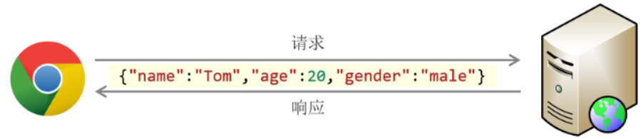

代码演示:

```javascript
//  JSON - JS对象标记法
let person = {
  name: 'itcast',
  age: 18,
  gender: '男'
}
alert(JSON.stringify(person)); //js对象 --> json字符串

let personJson = '{"name": "heima", "age": 18}';
alert(JSON.parse(personJson).name);
```

API说明：

`JSON.stringify(...)` ：作用就是将 js 对象，转换为 json 格式的字符串

`JSON.parse(...)` ：作用就是将 json 格式的字符串，转为 js 对象

## **遍历对象**
for 遍历对象的问题：**对象没有长度length**，而且是**无序**的

**for in**语法中的 **k**是一个变量, 在循环的过程中依次代表对象的**属性名** 

- 由于 `k`是变量, 所以必须使用 `[ ]`语法解析

`k`是获得对象的**属性名**， **对象名[k]是获得属性值**

- 一般不用这种方式遍历**数组**、主要是用来遍历**对象**

```javascript
let obj = {
    uname: 'pink'
}
for(let k in obj) {
    // k代表每一个属性的属性名  结果为字符串  带引号    
    // obj.'uname'     k ===  'uname'
    // obj[k]  属性值    obj['uname']   obj[k]
    console.log(k)
    console.log(obj[k])
}
```

**for in 不提倡遍历数组 因为 k 是 字符串类型!**  

遍历数组

```javascript
let arr = ['ws', 'ssw', '11', 4]
for (let k in arr) {
  console.log(k);
  console.log(arr[k]);
}
```

定义一个存储若干学生信息的数组，遍历打印

```javascript
let students = [
  { name: '小明', age: '19', gender: '男', hometown: '山东省' },
  { name: '小白', age: '25', gender: '女', hometown: '江苏省' },
  { name: '小水', age: '20', gender: '女', hometown: '加利福尼亚' },
  { name: '小法', age: '21', gender: '男', hometown: '德克萨斯' },
  { name: '小冰', age: '17', gender: '男', hometown: '纳米比亚' },
]
//定义拼接表格
let str = ''
// 遍历循环数组对象
for (let i = 0; i < students.length; i++) {
  //console.log(students[i]);
  //for (let k in students[i]) {
  //  console.log(students[i][k]);
  //}
  //拼接字符串
  str += `
    <tr>
      <td>${i + 1}</td>
      <td>${students[i].name}</td>
      <td>${students[i].age}</td>
      <td>${students[i].gender}</td>
      <td>${students[i].hometown}</td>
    </tr>
  `
}
//根据数据写入页面渲染表格
document.write(`
  <table class="table-cheerful">
    <thead>
      <tr>   
        <th>序号</th>
        <th>姓名</th>
        <th>年龄</th>
        <th>性别</th>
        <th>家乡</th>
      </tr>
    </thead>
    <tbody>
      ${str}
    </tbody>
  </table>
`)
```

# 内置对象
JavaScript 内置对象是语言本身提供的预定义对象，涵盖数据操作、数学运算、日期处理、集合管理等核心功能，无需实例化即可直接使用

## Object
所有对象的基类，提供对象操作的基本方法，如 `Object.keys()`（获取对象键名数组）、`Object.assign()`（合并对象）等

## String
处理文本数据

字符串截取（`substring`）

大小写转换（`toUpperCase`/`toLowerCase`）

模式匹配（`match`）等方法

## Number
提供数值处理功能，包含常量（如 `Number.MAX_VALUE`）和方法（如 `Number.isNaN()` 检测非数值）

## Math
`Math` 是 JavaScript 中内置的对象，称为**数学对象**，这个对象下即包含了属性，也包含了许多的方法

| 属性/方法 | 作用 | 说明 |
| --- | --- | --- |
| PI | 圆周率 | Math.PI 属性，返回圆周率 |
| max | 找最大值 | Math.max(8, 3, 1) 方法，返回 8 |
| min | 找最小值 | Math.min(8, 3, 1) 方法，返回 1 |
| abs | 绝对值 | Math.abs(-1) 方法，返回 1 |
| ceil | 向上取整 | Math.ceil(3.1) 方法，返回 4 |
| floor | 向下取整 | Math.floor(3.8) 方法，返回 3 |
| round | 四舍五入取整 | Math.round(3.8) 方法，返回 4 |

[Math对像在线文档](https://developer.mozilla.org/zh-CN/docs/Web/JavaScript/Reference/Global_Objects/Math)

属性

+ Math.PI，获取圆周率

```javascript
// 圆周率
console.log(Math.PI);
```

方法

+ **Math.random，生成 0 到 1 间的随机数**

```javascript
// 0 ~ 1 之间的随机数, 包含 0 不包含 1
Math.random()
// 得到一个随机数， 作为数组的索引号
let random = Math.floor(Math.random() * arr.length)
// 取到 N ~ M 的随机整数
function getRandom(N, M) {
  return Math.floor(Math.random() * (M - N + 1)) + N
}
console.log(getRandom(4, 8))
```

+ Math.ceil，数字向上取整

```javascript
// 舍弃小数部分，整数部分加1
Math.ceil(3.4)
```

+ Math.floor，数字向下取整

```javascript
// 舍弃小数部分，整数部分不变
Math.floor(4.68)
```

+ Math.round，四舍五入取整

```javascript
// 取整，四舍五入原则
Math.round(5.46539)
Math.round(4.849)
```

+ Math.max，在一组数中找出最大的

```javascript
// 找出最大值
Math.max(10, 21, 7, 24, 13)
```

+ Math.min，在一组数中找出最小的

```javascript
// 找出最小值
Math.min(24, 18, 6, 19, 21)
```

+ Math.pow，幂方法

```javascript
// 求某个数的多少次方
Math.pow(4, 2) // 求 4 的 2 次方
Math.pow(2, 3) // 求 2 的 3 次方
```

+ Math.sqrt，平方根

```javascript
// 求某数的平方根
Math.sqrt(16)
```

## Date
日期对象：用来表示日期和时间的对象

作用：可以得到当前系统日期和时间，Date是JavaScript内置对象

日期对象使用必须先**new Date()实例化**：创建一个**日期对象**并获取时间

在代码中发现了 `new` 关键字时，一般将这个操作称为实例化

```javascript
// 实例化
// const date = new Date(); // 获取当前系统默认时间
const date = new Date('2020-05-01 00:00:00') // 获取指定时间
// date 变量即所谓的时间对象
console.log(typeof date)
```

**格式化日期对象**

```javascript
 // 1. 实例化
const date = new Date();
// 2. 调用时间对象方法
// 通过方法分别获取年、月、日，时、分、秒
const year = date.getFullYear(); // 四位年份
const month = date.getMonth(); // 0 ~ 11
```

| 方法 | 作用 | 说明 |
| --- | --- | --- |
| getFullYear | 获取年份 | 四位年份 |
| getMonth | 获取月份 | 取值为 **0 ~ 11** |
| getDate | 获取月份中的每一天 | 不同月份取值也不相同 |
| getDay | 获取星期 | 取值为**0 ~ 6** |
| getHours | 获取小时 | 取值为 0 ~ 23 |
| getMinutes | 获取分钟 | 取值为 0 ~ 59 |
| getSeconds | 获取秒 | 取值为 0 ~ 59 |

格式化日期对象另外一种方法

| 方法 | 返回值 | 格式 |
| --- | --- | --- |
| toLocaleString() | 该日期对象的字符串（包含日期和时间） | 2099/9/20 18:30:43 |
| toLocaleDateString() | 日期对象**日期部分**的字符串 | 2099/9/20 |
| toLocaleTimeString() | 日期对象**时间部分**的字符串 | 18:30:43 |

**时间戳**

**时间戳：是指1970年01月01日00时00分00秒起至现在的总毫秒数(数字型)**

它是一种特殊的**计量时间**的方式

注：ECMAScript 中时间戳是以**毫秒**计的

**使用场景：** 计算倒计时效果，需要借助于时间戳完成

算法： 

+ 未来的时间戳 - 现在的时间戳 = **剩余时间毫秒数** 
+ 剩余时间毫秒数**转换**为**年月日时分秒**就是倒计时时间

```javascript
// 1. 实例化
const date = new Date()
// 2. 获取时间戳
console.log(date.getTime())
// 还有一种获取时间戳的方法
console.log(+new Date())
console.log(+new Date('2077-8-15'))
// 还有一种获取时间戳的方法
console.log(Date.now())
```

获取时间戳的方法，分别为 `getTime `和 `Date.now` 和  `+new Date()`

`getTime() ` 需要实例化

`+new Date()`  本质转换为数字（推荐）

`Date.now() ` 无需实例化但是只能得到**当前的时间戳**

通过时间戳得到是毫秒，需要转换为秒计算 

**转换公式：**

+ d = parseInt(总秒数/ 60/60 /24); // 计算天数 
+ h = parseInt(总秒数/ 60/60 %24) // 计算小时 
+ m = parseInt(总秒数 /60 %60 ); // 计算分数 
+ s = parseInt(总秒数%60); // 计算当前秒数

首先获取一个代表总秒数的数值，通过**取模运算（即 “%” 操作符）**，用总秒数对 60 取模，得到一个 0 到 59 之间的余数，这个余数代表了在一分钟内的秒数

# 数据类型内存
**基本数据类型 （简单数据类型）**

+ number 数字型 
+ string 字符串型 
+ boolean 布尔型 
+ undefined 未定义型 
+ null 空类

**引用数据类型（复杂数据类型）**

+ Object、Function、Array

**内存中堆栈空间分配区别：**

+ **栈：** 优点**访问速度快**，**基本数据类型**存放到栈里面 
+ **堆：** 优点**存储容量大**，**引用数据类型**存放到堆里面

## 基本类型内存分配-栈
基本数据类型: **变量的数据直接存放在栈空间中** 

优点：访问速度快
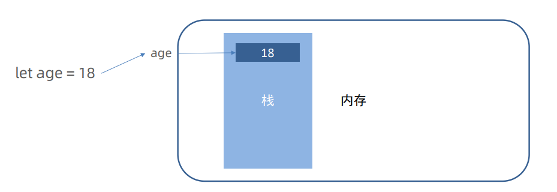

## 引用类型内存分配-堆
引用类型（复杂数据类型）：如 Object、Array、Function 等

**引用类型变量（栈空间）** 里存放的是**地址真正数据**存放在**堆空间**中

优点：容量大
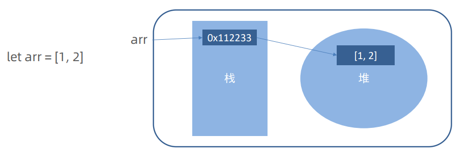

| **术语** | **解释** | **举例** |
| :--- | :--- | :--- |
| 关键字 | 在 JavaScript 中有特殊意义的词汇 | let、var、function、if、else、switch、case、break |
| 保留字 | 在目前的 JavaScript 中没意义，但未来可能会具有特殊意义的词汇 | int、short、long、char |
| 标识（标识符） | 变量名、函数名的另一种叫法 | 无 |
| 表达式 | 可以被求值的代码，一般配合运算符出现 | 10 + 3、age >= 18 |
| 语句 | 一段可执行的代码 | if () for() |

# WebApi
声明变量优先使用`const`（常量声明），若需要修改再改为`let`

`const` 声明的值**不能更改**，而且`const`声明变量的时候需要里面**进行初始化**

但是对于**引用数据类型**，const声明的变量，里面存的不是值，是**地址**，**数组和对象建议使用const声明**

严格意义上讲，之前的知识绝大部分属于 `ECMAScript` 的知识体系，ECMAScript 简称 ES 它提供了一套语言标准规范，如变量、数据类型、表达式、语句、函数等语法规则都是由 ECMAScript 规定的

浏览器将 ECMAScript 大部分的规范加以实现，并且在此基础上又扩展一些实用的功能，这些被扩展出来的内容我们称为 Web APIs

`ECMAScript` 运行在浏览器中然后再结合 `Web APIs `才是真正的 JavaScript

**Web APIs 的核心是 DOM 和 BOM**

**API:** 应用程序接口（Application Programming Interface）

**接口**：无需关心内部如何实现，程序员只需要调用就可以很方便实现某些功能

**WebApi**：使用 JavaScript 去操作页面文档和浏览器

**DOM (文档对象模型) : 使用 JavaScript 去操作页面文档**

**BOM（浏览器对象模型）: 使用JavaScript 去操作浏览器**

# DOM-元素
| **描述** | **属性 / 方法** | **效果** |
| :--- | :--- | :--- |
| 获取 DOM 对象 | document.querySelector() | 获取指定的第一个元素 |
| | document.querySelectorAll() | 获取指定的所有元素 |
| 操作元素内容 | 元素.innerText | 操作元素内容，不解析标签 |
| | 元素.innerHTML | 操作元素内容，解析标签 |
| 操作元素样式 | 元素.style.width | 通过 style 操作样式 |
| | 元素.className | 通过类名操作样式 |
| | 元素.classList.add () | 增加类名 |
| | 元素.classList.remove () | 删除类名 |
| | 元素.classList.toggle () | 切换类名 |
| 间隔函数 | setInterval(function() {}, 1000) | 定时器，每隔指定时间重复执行 |

## DOM 介绍
**DOM（Document Object Model）文档对象模型**

**作用：DOM用来操作网页文档**，开发网页特效和实现用户交互

**核心思想：把网页内容当做对象**来处理，**通过对象**的**属性**和方法对网页内容操作
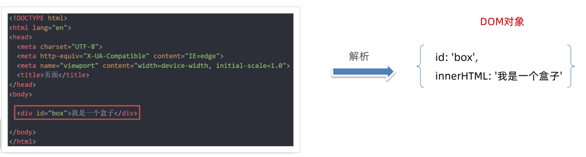

### DOM 树
将 HTML 文档以树状结构直观的表现出来，我们称之为文档树或 DOM 树

**文档树直观的体现了标签与标签之间的关系**


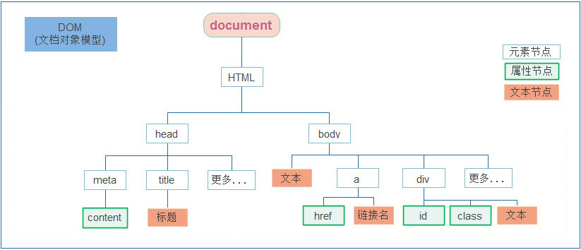

### document 对象
是 DOM 里提供的一个**对象** ，是DOM顶级对象

作为网页内容的**入口**，所以它提供的属性和方法都是**用来访问和操作网页内容**的

例：document.write() 

**网页所有内容都在document里面**

`document`是 JavaScript 内置的专门用于 DOM 的对象，该对象包含了若干的属性和方法

`document` 是学习 DOM 的核心

```html
<script>
  // document 是内置的对象
  // console.log(typeof document);

  // 1. 通过 document 获取根节点
  console.log(document.documentElement); // 对应 html 标签

  // 2. 通过 document 节取 body 节点
  console.log(document.body); // 对应 body 标签

  // 3. 通过 document.write 方法向网页输出内容
  document.write('Hello World!');
</script>

```

### DOM 节点
节点是文档树的组成部分，**每一个节点都是一个DOM对象**，主要分为元素节点、属性节点、文本节点等

**【元素节点】** 其实就是 HTML 标签， `head`、`div`、`body` 等都属于元素节点

**【属性节点】** 是指 HTML 标签中的属性， `a` 标签的 `href` 属性、`div` 标签的 `class` 属性

**【文本节点】** 是指 HTML 标签的文字内容，如 `title` 标签中的文字

**【根节点】** 特指 `html` 标签

其它...

+ Document：整个文档对象
+ Element：元素对象
+ Attribute：属性对象
+ Text：文本对象
+ Comment：注释对象

## 获取 DOM 元素
查找元素DOM元素就是利用 JS 选择页面中标签元素

### **CSS选择器 (重点)**
通过CSS选择器获取DOM元素查看 css 笔记部分

**选择匹配的第一个元素 querySelector**

+ **语法：document.querySelector('css选择器')**
+ **参数：** 包含 **一个或多个**有效的CSS选择器 **字符串** 
+ **返回值：** CSS选择器匹配的 **第一个元素**,一个 HTMLElement **对象**
+ 如果没有匹配到，则返回 null

**选择匹配的多个元素 querySelectorAll**

+ **语法：**  `document.querySelectorAll('css选择器')`
+ **参数：** 包含一个或多个有效的CSS选择器 **字符串** 
+ **返回值：** CSS选择器匹配的NodeList **对象集合**,得到一个**伪数组**(**有长度有索引号的数组**) 
+ 但是**没有 pop() push() 等数组方法**，想要得到里面的每一个对象，则需要遍历（for）的方式获得

```html
<body>
  <div></div>
  <div></div>
  <div class="box"></div>
  <div id="box2"></div>
  <div></div>
  <ul>
    <li>li1</li>
    <li>li2</li>
    <li>li3</li>
  </ul>
  <script>
    const box = document.querySelector('div')
    const box1 = document.querySelector('.box')
    const box2 = document.querySelectorAll('div') //伪数组
    const li = document.querySelector('ul li:nth-child(2)')
    console.dir(box) //专门输出对象格式数据
    console.dir(box1)
    console.dir(box2)
    console.dir(li)
  </script>
</body>

```

### 其他方式(不常用)
根据**ID**获取一个元素

+ `getElementById('nav')` 

根据**标签**获取一类元素，获取页面所以div,返回**伪数组**

+ `getElementsByTagName('div')`

根据**类名**获取元素，获取页面所以类名为checked 的元素，返回**伪数组**

+ `getElementsByClassName('checked')`

```html
<div id="box"></div>
<div></div>
<div class="box"></div>
<div class="box"></div>
<div></div>
<ul class="#nav">导航
  <li>首页</li>
  <li>介绍</li>
  <li>联系</li>
</ul>
<script>
  const nav = document.getElementById('nav')
  const div = document.getElementsByTagName('div')
  const box = document.getElementsByClassName('box')
  console.dir(nav)
  console.dir(div)
  console.dir(box)
</script>

```

## 操作元素内容
DOM对象都是根据标签生成的，所以操作标签，本质上就是**操作DOM对象**

操作对象使用的点语法(增删改查)

如果想要修改标签元素的里面**的内容**，则可以使用如下几种方式:

**对象.innerText 属性**

**对象.innerHTML 属性**

`innerText` 将**文本内容**添加/更新到任意标签位置，文本中包含的标签**不会被解析**

```html
<div id="box">box内容</div>
<script>
    //获取div标签
    const box = document.querySelector('#box')
    //获取innerText 属性
    console.log(box.innerText)
    //修改innerText 属性
    box.innerText = '修改内容'
    //注意：不解析标签，以下内容为纯文本
    box.innerText = '<strong>修改内容</strong>'
</script>

```

`innerHTML` 将文本内容添加/更新到任意标签位置，文本中包含的标签**会被解析**

```html
<script>
      //获取div标签
    const box = document.querySelector('#box')
    //获取innerHTML 属性
    console.log(box.innerHTML)
    //修改innerHTML 属性
    box.innerHTML = '修改内容'
    //注意：会解析标签，以下内容会加粗
    box.innerHTML = '<strong>修改内容</strong>'
</script>

```

总结：如果文本内容中包含 `html` **标签**时推荐使用 `innerHTML`，否则建议使用 `innerText` 属性

## 操作元素属性
直接能过属性名修改，最简洁的语法

可以通过 JS 设置/修改标签元素**属性**，比如通过 src更换图片

最常见的属性比如:href、title、src等

```html
<script>
  // 1. 获取 img 对应的 DOM 元素
  const pic = document.querySelector('.pic')
    // 2. 修改属性
  pic.src = './images/lion.webp'
  pic.width = 400;
  pic.alt = '图片不见了...'
</script>

```

**style 属性控制CSS**

`对象.style.样式属性 = 值`

使用`.style`设置的样式，都会出现在**行内样式**上，权重高

通过元素节点获得的 `style` 属性本身的数据类型也是对象

如 `box.style.color`、`box.style.width` 分别获取元素节点 CSS 的 `color` 和 `width` 值

```html
<style>
  .box {
    width: 200px;
    height: 200px;
    background-color: pink;
  }
</style>
<div class="box"></div>
<script>
  // 1. 获取元素
  const box = document.querySelector('.box')
  //2. 修改样式属性 对象.style.样式属性 = '值'  别忘了跟单位
  box.style.width = '300px'
  // 多组单词的采取 小驼峰命名法
  // css 属性的 - 连接符与 JavaScript 的 减 运算符
  // 冲突，所以要改成驼峰法
  box.style.backgroundColor = 'red'
  box.style.border = '3px solid blue'
</script>

```

任何标签都有 `style` 属性，通过 `style` 属性可以动态更改网页标签的样式

修改样式通过style属性引出，**行内样式表**  

如果属性有 - 连接符，需要转换为小驼峰命名法  

赋值的时候，需要的时候不要忘记加css单位

**类名(className) 操作CSS**

`元素.className = 'active'`

如果**修改的样式比较多**，直接通过style属性修改比较繁琐

通过借助于css类名的形式

```html
<style>
  div {
    width: 200px;
    height: 200px;
    background-color: pink;
  }
  .box {
    width: 300px;
    height: 300px;
    background-color: skyblue;
  }
</style>
<div class="nav">123</div>
<script>
  // 1. 获取元素
  const div = document.querySelector('.nav')
  // 2.添加类名  class 是个关键字 用 className
  div.className = 'box'
  //如果需要添加一个类,需要保留之前的类名
  //div.className = 'nav box'
</script>

```

由于class是关键字, 所以使用className去代替

**className是使用新值换旧值classList 操作类控制CSS**

**追加**一个类  

`对象.classList.add('类名')`

**删除**一个类  

`对象.classList.remove('类名')`  

**切换**一个类  

`对象.classList.toggle('类名')`

**判断**类名是否存在，返回布尔值

`对象.classList.contains('类名')`

为了解决className 容易覆盖以前的类名，可以通过`classList`方式**追加和删除类名**

```html
<style>
.box {
  width: 200px;
  height: 200px;
  color: #333;
  }
.active {
  color: red;
  background-color: pink;
}
</style>
<div class="box ">文字</div>
<script>
  // 通过classList添加
  // 1. 获取元素
  const box = document.querySelector('.box')
  // 2. 修改样式
  // 2.1 追加类 add() 类名不加点，并且是字符串
  // box.classList.add('active')
  // 2.2 删除类  remove() 类名不加点，并且是字符串
  // box.classList.remove('box')
  // 2.3 切换类  toggle() 有就删掉，没有就加上
  box.classList.toggle('active')
  //拓展：判断是否存在某个类名，返回一个布尔值
  box.classList.contains('abc') //false
</script>

```

## 操作表单元素属性
表单很多情况也需要修改属性，比如点击眼睛可以看到密码，本质是把表单类型转换为文本框

正常的有属性有取值的跟其他的标签属性没有任何区别

**获取：** DOM对象.属性名

**设置：** DOM对象.属性名= 新值

```html
<input type="text" value="请输入">
<button disabled>按钮</button>
<input type="checkbox" name="" id="" class="agree">
<script>
  // 1. 获取元素
  let input = document.querySelector('input')
  // 2. 取值或者设置值  得到input里面的值可以用 value
  // console.log(input.value)
  input.value = '小米手机'
  input.type = 'password'

  // 2. 启用按钮
  let btn = document.querySelector('button')
  // disabled 不可用   =  false  这样可以让按钮启用
  btn.disabled = false
  // 3. 勾选复选框
  let checkbox = document.querySelector('.agree')
  checkbox.checked = false
</script>

```

## 自定义属性
**标准属性:** 标签天生**自带**的属性 比如`class id title`等, 可以直接使用`点语法`操作比如： disabled、checked、selected

**自定义属性：**

在html5中推出来了专门的**data-自定义属性**

在标签上一律以`data-`开头

在DOM对象上一律以`dataset` **对象方式获取**

`对象.dataset` 获取到的为**对象集合使用场景：通过自定义属性可以存储数据**，后期可以使用这个数据

```html
<body>
  <div data-id="1" data-spm="不知道">1</div>
  <div data-id="2">2</div>
  <div data-id="3">3</div>
  <div data-id="4">4</div>
  <div data-id="5">5</div>
  <script>
    const one = document.querySelector('div')
    console.log(One.dataset)
    //DOMStringMap {id: '1', info: '信息'}
    console.log(one.dataset.id)  // 1
    console.log(one.dataset.spm)  // 不知道
  </script>
</body>

```

## 定时器
**间歇函数**

`setInterval` 是 JavaScript 内置的函数，间隔固定的时间**自动重复**执行另一个函数，也叫定时器函数

**setInterval(函数名, 间隔时间) 函数名不要加小括号**

```html
<script>
  // 1. 定义一个普通函数
  function repeat() {
    console.log('不知疲倦的执行下去....')
  }
  // 2. 使用 setInterval 调用 repeat 函数
  // setInterval(函数名, 间隔时间)  函数名不要加小括号
  // 间隔 1000 毫秒，重复调用 repeat
  setInterval(repeat, 1000)
  // 多个定时器序号不一样
  let n = setInterval(fn, 1000)
  // setInterval('fn()', 1000)
  console.log(n)
  // 关闭指定的定时器
  clearInterval(n)
  
  //匿名函数写法
  let timerID = setInterval(function () {
    console.log('定时器')
  }, 1000)
  console.log(timerID) //返回一个定时器ID 唯一值
  clearInterval(timerID)
</script>

```

**关闭定时器**

` let 变量名 = setInterval(函数名, 间隔时间)`  

`clearInterval(变量名)`

**重新打开**

`变量名 = setInterval(函数名, 间隔时间)`

# DOM-事件
事件：事件是程序在运行的时候，发生的特定动作或者特定的事情

以前写的代码都是自动执行的，如果希望一段代码在**某个特定的时机才去执行**

例如：用户使用【鼠标点击】网页中的一个按钮、用户使用【鼠标拖拽】网页中的一张图片

| 描述 | 属性/方法 | 效果 |
| --- | --- | --- |
| 事件监听 | 元素.addEventListener() | 事件监听，事件绑定，事件注册 |
| 鼠标事件 | click | 鼠标点击 |
| 鼠标事件 | mouseenter | 鼠标进入 |
| 鼠标事件 | mouseleave | 鼠标离开 |
| 焦点事件 | focus | 获得焦点 |
| 焦点事件 | blur | 失去焦点 |
| 键盘事件 | keydown | 键盘按下 |
| 键盘事件 | keyup | 键盘抬起 |
| 文本事件 | input | 当表单value 被修改时触发 |
| 事件对象 | e.key | 判断用户按下哪个键 |
| 环境对象 | this | 谁调用，指向谁 |

## 事件监听
就是让程序**检测是否有事件产生**，一旦有事件触发，就立即调用一个函数做出响应

也称为绑定事件或者注册事件

事件发生后，想要执行的代码写到**事件处理函数**里面

当**触发**指定的事件时，则事件处理函数就会被**执行**

事件监听是将事件处理函数**注册到元素对象**身上

比如鼠标经过显示下拉菜单，比如点击可以播放轮播图等等

结合 DOM 使用事件时，需为 DOM 对象添加事件监听，事件发生（触发）时，便立即调用一个函数

`元素对象.addEventListener('事件类型'，要执行的函数)` 

是 DOM 对象专门用来添加事件监听的方法

它的两个参数分别为【事件类型】和【事件回调】

**事件监听三要素**

+ **事件源**：哪个dom元素被事件触发了，要获取dom元素
+ **事件类型**：什么方式触发，鼠标单击click、鼠标经过mouseover 等
+ **事件调用的函数：** 要做什么事

```html
<button>点击</button>
<script>
  // 需求： 点击了按钮，弹出一个对话框
  // 事件源：按钮元素
  const btn = document.querySelector('button')
  //事件类型：什么方式触发，鼠标单击click
  btn.addEventListener('click',helloWorld)
  // 事件调用的函数，要做什么事
  function helloWorld(){
    alert('helloWorld')
  }
</script>

```

> 事件类型要加引号，小写 
>
> 函数是点击之后再去执行，每次点击都会执行一次

**事件监听版本**

DOM LO  

`事件源.on事件=function(){}`  

DOM L2  

`事件源.addEventListener(事件，事件处理函数)`  

区别:  

on方式会被**覆盖**，addEventListener方式可**绑定多次**，拥有事件更多特性，推荐使用

## 事件类型
`click` 是【点击】的意思，监听（等着）用户鼠标的单击操作，除了【单击】还有【双击】`dblclick`

```html
<script>
  // 双击事件类型
  btn.addEventListener('dblclick', function () {
    console.log('等待事件被触发...');
    // 改变 p 标签的文字颜色
    const text = document.querySelector('.text')
    text.style.color = 'red'
  })

  // 只要用户双击击了按钮，事件便触发了！！！
</script>

```

【事件类型】决定了事件被触发的方式，如 `click` 代表鼠标单击，`dblclick` 代表鼠标双击

将众多的事件类型分类可分为：鼠标事件、键盘事件、表单事件、焦点事件等

| 描述 | 属性/方法 | 效果 |
| --- | --- | --- |
| 鼠标事件 | click | 鼠标点击 |
| 鼠标事件 | mouseenter | 鼠标进入 |
| 鼠标事件 | mouseleave | 鼠标离开 |
| 焦点事件 | focus | 获得焦点 |
| 焦点事件 | blur | 失去焦点 |
| 键盘事件 | keydown | 键盘按下时触发 |
| 键盘事件 | keyup | 键盘抬起时触发 |
| 文本事件 | input | 当表单value 被修改时触发 |

### 鼠标事件
鼠标事件是指跟鼠标操作相关的事件，如单击、双击、移动等

`mouseenter` 监听鼠标是否**移入** DOM 元素

```html
<body>
  <h3>鼠标事件</h3>
  <p>监听与鼠标相关的操作</p>
  <hr>
  <div class="box"></div>
  <script>
    // 需要事件监听的 DOM 元素
    const box = document.querySelector('.box');

    // 监听鼠标是移入当前 DOM 元素
    box.addEventListener('mouseenter', function () {
      // 修改文本内容
      this.innerText = '鼠标移入了...';
      // 修改光标的风格
      this.style.cursor = 'move';
    })
  </script>
</body>

```

`mouseleave`监听鼠标是否**移出** DOM 元素

```html
<body>
  <h3>鼠标事件</h3>
  <p>监听与鼠标相关的操作</p>
  <hr>
  <div class="box"></div>
  <script>
    // 需要事件监听的 DOM 元素
    const box = document.querySelector('.box');

    // 监听鼠标是移出当前 DOM 元素
    box.addEventListener('mouseleave', function () {
      // 修改文本内容
      this.innerText = '鼠标移出了...';
    })
  </script>
</body>

```

### 键盘事件
`keydown`   键盘按下触发  

`keyup`   键盘抬起触发

```javascript
input.addEventListener('keydown', function () {
  console.log('键盘按下了')
})
input.addEventListener('keyup', function () {
  console.log('键盘弹起了')
})
```

### 焦点事件
`focus`  获得焦点

`blur` 失去焦点

```html
<input type="text">
<script>
  const input = document.querySelector('input')
  input.addEventListener('focus', function () {
    console.log('有焦点触发')
  })
  input.addEventListener('blur', function () {
    console.log('失去焦点触发')
  })
</script>

```

### 文本框输入事件
`input ` 

`input.value`获取输入框值

```javascript
input.addEventListener('input', function () {
    console.log(input.value)
  })
```

**注意：三者的执行顺序： keydown → input → keyup**

## **事件对象（重要）**

**基本概念**

+ 也是个**对象**，这个对象里有事件触发时的**相关信息，包含属性和方法**
+ 例如:鼠标点击事件中，事件对象就存了鼠标点在哪个位置等信息

**使用场景**

+ 可以判断用户按下哪个键，比如按下回车键可以发布新闻
+ 可以判断鼠标点击了哪个元素，从而做相应的操作

任意**事件**类型被**触发**时与事件**相关的信息**会被**以对象的形式**记录下来，称这个对象为事件对象

**语法：** 

+ 注册事件中，回调函数的**第一个参数**就是**事件对象** 
+ 一般命名为`event、ev、e`

```html
<body>
  <h3>事件对象</h3>
  <hr>
  <div class="box"></div>
  <script>
    // 获取 .box 元素
    const box = document.querySelector('.box')

    // 添加事件监听
    box.addEventListener('click', function (e) {
      console.log('任意事件类型被触发后，相关信息会以对象形式被记录下来...');

      // 事件回调函数的第1个参数即所谓的事件对象
      console.log(e)
    })
  </script>
</body>

```

**常用属性**

| 属性 | 描述 | **示例场景** |
| :--- | :--- | :--- |
| `e.target` | 触发事件的元素（事件源） | 事件委托中识别具体触发项 |
| `e.currentTarget` | 绑定事件的元素 | `this` 通常等同于此值 |
| `e.type` | 事件类型（如 `"click"`、`"keydown"`） | 判断事件类型以执行不同逻辑 |
| `e.clientX`/`Y` | 鼠标在视口内的坐标（不随滚动变化） | 拖拽元素时实时更新位置 |
| `e.pageX`/`Y` | 鼠标相对于整个文档的坐标（包含滚动） | 绘制画布时准确定位绘制点 |
| `e.key` | 键盘事件的按键值（如 `"Enter"`） | 监听回车键提交表单 |
| `e.eventPhase` | 事件当前阶段：1捕获、2目标、3冒泡 | 调试事件传播流程 |
| `e.bubbles` | 布尔值，表示事件是否支持冒泡 | 判断是否需要阻止冒泡 |

**常用方法**

| 方法 | 描述 | 示例场景 |
| :--- | :--- | :--- |
| `e.preventDefault()` | 阻止事件的默认行为（如表单提交、链接跳转） | 表单验证失败时阻止提交 |
| `e.stopPropagation()` | 停止事件在DOM树中的传播（阻止冒泡或捕获） | 嵌套元素点击时避免父元素触发事件 |
| `e.stopImmediatePropagation()` | 阻止事件传播并停止执行当前元素的其他同类型事件监听器 | 确保某个监听器优先级最高时使用 |

**应用场景表单验证：** 通过 `e.target.value` 获取输入值，结合 `e.preventDefault()` 阻止无效提交

**事件委托：** 利用事件冒泡，在父元素监听子元素事件，通过 `e.target` 识别具体触发元素

**拖拽功能：** 结合 `mousedown`、`mousemove` 事件，使用 `clientX/Y` 实时更新元素位置

## 环境对象 this
环境对象指的是函数内部特殊的变量 `this` ，它代表着当前函数运行时所处的环境

```html
<script>
  // 声明函数
  function sayHi() {
    // this 是一个变量
    console.log(this);
  }

  // 声明一个对象
  let user = {
    name: '张三',
    sayHi: sayHi // 此处把 sayHi 函数，赋值给 sayHi 属性
  }
  
  let person = {
    name: '李四',
    sayHi: sayHi
  }

  // 直接调用
  sayHi() // window
  window.sayHi() // window

  // 做为对象方法调用
  user.sayHi()// user
  person.sayHi()// person
</script>

```

结论：

1. **this 本质上是一个变量，数据类型为对象**
2. 函数的调用方式不同 `this` 变量的值也不同
3. **【谁调用 `this` 就是谁】是判断 `this`值的粗略规则**
4. 函数直接调用时实际上 `window.sayHi()` 所以 `this` 的值为 `window`

## 排他思想
+ 是一种思路，目的是**突出显示某个元素**
+ 比如有多个元素，当鼠标经过时，只有**当前元素**会添加高亮样式，其余的元素移除样式

排除其他人，保留我自己；常用于tab栏切换

实现鼠标经过按钮时，当前按钮高亮显示

```html
<body>
  <button class="active">按钮1</button>
  <button>按钮2</button>
  <button>按钮3</button>
  <button>按钮4</button>
  <button>按钮5</button>
  <script>
    // 需求: 鼠标经过每一个小盒子,当前盒子高亮显示
    // 1. 先获取全部小盒子, 给每一个小盒子添加事件(遍历)
    const btns = document.querySelectorAll('button')
    for (let i = 0; i < btns.length; i++) {
      // console.log(btns[i])
      // 2. 给每一个小盒子添加鼠标经过事件
      btns[i].addEventListener('mouseenter', function () {
        // 3. 让当前这个小盒子高亮 this
        // 3.1 先清除所有人的样式
        for (let j = 0; j < btns.length; j++) {
            btns[j].classList.remove('active')
        }
        // 3.2 给当前的添加
        this.classList.add('active')
      })
    }
  </script>
  <!-- 用 forEach 替代传统 for 循环，代码更简洁 -->
  <script>
    const btns = document.querySelectorAll('button');
    btns.forEach(btn => {
      btn.addEventListener('mouseenter', function() {
        // 清除所有按钮的 active 类
        btns.forEach(b => b.classList.remove('active'));
        // 为当前按钮添加 active 类
        this.classList.add('active');
      });
    });
  </script>
</body>
```

**获取所有按钮元素**

使用 `document.querySelectorAll('button')` 方法获取页面中所有的 `<button>` 元素

并将其存储在 `btns` 常量中

```javascript
const btns = document.querySelectorAll('button')
```

**遍历按钮元素并添加鼠标经过事件**  
通过 `for` 循环遍历 `btns` 数组，为每个按钮元素添加 `mouseenter` 事件监听器

```javascript
for (let i = 0; i < btns.length; i++) {
    btns[i].addEventListener('mouseenter', function () {
        // 后续操作在事件处理函数内
    })
}
```

**在鼠标经过事件处理函数中实现高亮逻辑清除所有按钮的高亮样式**：

再次使用 `for` 循环遍历 `btns` 数组，移除每个按钮上的 `active` 类名

```javascript
for (let j = 0; j < btns.length; j++) {
    btns[j].classList.remove('active')
}
```

**为当前鼠标经过的按钮添加高亮样式**：

使用 `this` 关键字（在事件处理函数中 `this` 指向触发事件的元素，即当前鼠标经过的按钮），为其添加 `active` 类名

```javascript
this.classList.add('active')
```


## 回调函数
如果将**函数 A 做为参数传递给函数 B**时，我们称**函数 A 为回调函数**

```html
<script>
  // 声明 foo 函数
  function foo(arg) {
    console.log(arg);
  }

  // 普通的值做为参数
  foo(10);
  foo('hello world!');
  foo(['html', 'css', 'javascript']);

  function bar() {
    console.log('函数也能当参数...');
  }
  // 函数也可以做为参数！！！！
  foo(bar);
</script>

```

函数 `bar` 做参数传给了 `foo` 函数，`bar` 就是所谓的回调函数

回顾**间歇函数** `setInterval` 

```html
<script>
  function fn() {
    console.log('我是回调函数...');
  }
  // 调用定时器
  setInterval(fn, 1000);
</script>

```

**fn` 函数做为参数传给了 `setInterval** ，这便是回调函数的实际应用了

```html
<script>
  // 调用定时器，匿名函数做为参数
  setInterval(function () {
    console.log('我是回调函数...');
  }, 1000);
</script>

```

结论：

1. 回调函数本质还是函数，只不过把它当成参数使用
2. **使用匿名函数做为回调函数比较常见**

## 事件流
解决一些疑惑，比如点击子盒子会会弹出2次的问题

| **描述** | **属性 / 方法** | **效果** |
| :--- | :--- | :--- |
| 事件流 | addEventListener (' 事件类型 ', 回调函数，true/false) | 捕获还是冒泡 |
| **事件委托** | **事件对象.target.tagName** | **得到目标元素** |
| 其他事件 | load | 加载事件，全部资源加载完毕 |
| | DOMContentLoaded | 加载事件，HTML 文档加载完毕 |
| | scroll | 滚动事件 |
| | resize | 尺寸事件 |
| 元素尺寸与位置 | scrollLeft 和 scrollTop | 页面 / 元素被卷去的头部和左侧（滚动），可读写 |
| | offsetLeft 和 offsetTop | 元素位置距离定位父级左上距离，只读 |
| | clientWidth 和 clientHeight | 元素大小，不包含 border、padding 等，只读 |
| | offsetWidth 和 offsetHeight | 元素大小，包含 border、padding 等，只读 |

**事件流**指的是事件完整执行过程中的流动路径
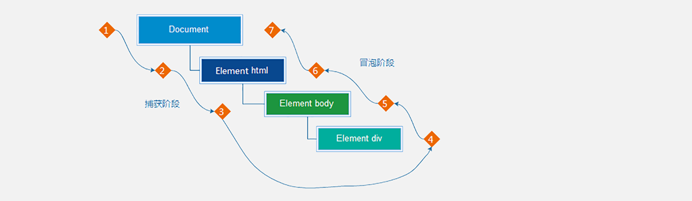

说明：假设页面里有个div，当触发事件时，会经历两个阶段，

**捕获阶段、冒泡阶段**

简单来说：捕获阶段是从父到子  冒泡阶段是从子到父

实际工作都是使用**事件冒泡为主**

## 事件捕获
**事件捕获概念:**

当一个元素的事件被触发时，会从**DOM的根元素**开始依次调用**同名事件 (从外到里)** 事件捕获

**爷爷先得知消息，再依次往内传递；** 比如儿子在学校有个活动（相当于触发事件），爷爷先知道这个消息，然后告诉爸爸，爸爸再告诉儿子

`DOM元素.addEventListener(事件类型，事件处理函数，是否使用捕获机制)`

`addEventListener`第三个参数

- 传入 `true` 代表是**捕获**阶段触发(很少使用)
- 传入`false`代表**冒泡**阶段触发，**默认就是false**
- 若是用 L0 事件监听，则只有冒泡阶段，没有捕获

```html
<body>
  <div class="father">
    <div class="son"></div>
  </div>
  <script>
    const fa = document.querySelector('.father')
    const son = document.querySelector('.son')
    // 山东  济南  蓝翔   捕获阶段
    // 蓝翔  济南  山东   冒泡阶段
    document.addEventListener('click', function () {
      alert('我是爷爷')
    }, true)
    fa.addEventListener('click', function () {
      alert('我是爸爸')
    }, true)
    son.addEventListener('click', function () {
      alert('我是儿子')
    }, true)
    //执行结果：我是爷爷 --- 我是爸爸 --- 我是儿子
  </script>
</body>

```

当单击事件触发时，其祖先元素的单击事件也【相继触发】

结合事件流的特征，我们知道当某个元素的事件被触发时，事件总是会先经过其祖先才能到达当前元素，然后再由当前元素向祖先传递，事件在流动的过程中遇到相同的事件便会被触发。

再来关注一个细节就是事件相继触发的【执行顺序】，事件的执行顺序是可控制的，即可以在捕获阶段被执行，也可以在冒泡阶段被执行。

## 事件冒泡
**事件冒泡概念:**

当一个元素的事件被触发时，**同样的事件**将会在该元素的**所有祖先元素**中**依次被触发孙子先得知消息，再依次往外传递；** 儿子先知道活动消息，然后告诉爸爸，爸爸再告诉爷爷，最后爷爷也知道了，像气泡一样逐层向外层元素冒泡传递

**当一个元素触发事件后，会依次向上调用所有父级元素的同名事件**

+ 事件冒泡是`默认`存在的，或者第三个参数传入 `false` 都是冒泡
+ **实际工作都是使用事件冒泡为主**

```html
<body>
  <div class="father">
    <div class="son"></div>
  </div>
  <script>
    const fa = document.querySelector('.father')
    const son = document.querySelector('.son')
    document.addEventListener('click', function () {
      alert('我是爷爷')
    }, false)
    fa.addEventListener('click', function () {
      alert('我是爸爸')
    }, false)
    son.addEventListener('click', function () {
      alert('我是儿子')
    }, false)
    
  </script>
</body>

```

**总结：**

+ `addEventListener` 第3个参数决定了事件是在捕获阶段触发还是在冒泡阶段触发
+ `addEventListener` 第3个参数为  `true` 表示捕获阶段触发，`false` 表示冒泡阶段触发，默认值为 `false`
+ 事件流只会在父子元素具有相同事件类型时才会产生影响
+ 绝大部分场景都采用默认的冒泡模式（其中一个原因是早期 IE 不支持捕获）

### 阻止冒泡
阻止冒泡是指阻断事件的流动，保证事件只在当前元素被执行，而不再去影响到其对应的祖先元素

问题：因为默认就有冒泡模式的存在，所以容易导致事件影响到父级元素

需求：若想把事件就限制在当前元素内，就需要阻止事件冒泡

前提：阻止事件冒泡需要拿到事件对象

语法：`事件对象.stopPropagation()`

注意：此方法可以**从当前元素阻断事件流动传播**，不光在冒泡阶段有效，捕获阶段也有效

```html
<body>
  <div class="father">
    <div class="son"></div>
  </div>
  <script>
    const fa = document.querySelector('.father')
    const son = document.querySelector('.son')
    document.addEventListener('click', function () {
      alert('我是爷爷')
    }, false)
    fa.addEventListener('click', function () {
      alert('我是爸爸')
    }, false)
    son.addEventListener('click', function (e) {
      alert('我是儿子')
      //阻止流动
      e.stopPropagation()
    }, false)
        //运行结果：点击子元素，只显示‘我是儿子’
  </script>
</body>

```

事件对象中的 `ev.stopPropagation` 方法专门用来阻止事件冒泡

### 阻止默认行为
比如 阻止链接的跳转，表单域跳转  

语法:`e.preventDefault()`

```html
<body>
  <form action="http://www.itcast.cn">
    <input type="submit" value="免费注册">
  </form>
  <a href="http://www.baidu.com">百度一下</a>
  <script>
    const form = document.querySelector('form')
    form.addEventListener('submit', function (e) {
      // 阻止默认行为  提交
      e.preventDefault()
    })

    const a = document.querySelector('a')
    a.addEventListener('click', function (e) {
      e.preventDefault()
    })
  </script>
</body>

```

### 解绑事件监听
`on`事件方式，直接使用null覆盖偶就可以实现事件的解绑  

语法:

```javascript
//绑定事件
btn.onclick=function(){
alert('点击了')
// 解绑事件
btn.onclick = nul1
```

`addEventListener`方式

 `removeEventListener(事件类型, 事件处理函数, [获取捕获或者冒泡阶段])`

```javascript
function fn(){
alert('点击了')
// 绑定事件
btn.addEventListener('click',fn)
// 解绑事件
btn.removeEventListener('click',fn)
```

**注意：匿名函数无法被解绑**

**鼠标经过事件的区别** 

鼠标经过事件： 

+ mouseover 和 mouseout 会有冒泡效果 
+ **mouseenter 和 mouseleave 没有冒泡效果 (推荐)两种注册事件的区别** 

传统on注册（L0） 

+ 同一个对象,后面注册的事件会覆盖前面注册(同一个事件) 
+ 直接使用null覆盖偶就可以实现事件的解绑 
+ 都是冒泡阶段执行的

事件监听注册（L2） 

+ 语法: addEventListener(事件类型, 事件处理函数, 是否使用捕获) 
+ 后面注册的事件不会覆盖前面注册的事件(同一个事件) 
+ 可以通过第三个参数去确定是在冒泡或者捕获阶段执行
+ 必须使用removeEventListener(事件类型, 事件处理函数, 获取捕获或者冒泡阶段)

 匿名函数无法被解绑

## **事件委托**
事件委托是利用事件流的特征解决一些开发需求的知识技巧 

**优点：** 减少注册次数，可以提高程序性能 

**原理：事件委托其实是利用事件冒泡的特点，集体委托给了父元素**

原本需要注册在**子元素**的事件**委托给父元素**，让父元素担当事件监听的职务

给父元素注册事件，当我们触发子元素的时候，会**冒泡**到父元素身上，从而触发父元素的事件

实现：**事件对象.target. tagName 可以获得真正触发事件的元素**

```javascript
if (e.target.tagName === 'LI') {
  e.target.style.color = 'red'
}
```

`ul li `父子点击事件

`ul.addEventListener('click' , function(){}) `执行父级点击事件

大量的事件监听是比较耗费性能的，如下代码所示

```html
<script>
  // 假设页面中有 10000 个 button 元素
  const buttons = document.querySelectorAll('table button');

  for(let i = 0; i <= buttons.length; i++) {
    // 为 10000 个 button 元素添加了事件
    buttons.addEventListener('click', function () {
      // 省略具体执行逻辑...
    })
  }
</script>

```

利用事件流的特征，可以对上述的代码进行优化，事件的的冒泡模式总是会将事件流向其父元素的，如果父元素监听了相同的事件类型，那么父元素的事件就会被触发并执行

```html
<script>
  // 假设页面中有 10000 个 button 元素
  let buttons = document.querySelectorAll('table button');
  
  // 假设上述的 10000 个 buttom 元素共同的祖先元素是 table
  let parents = document.querySelector('table');
  
  parents.addEventListener('click', function () {
    console.log('点击任意子元素都会触发事件...');
  })
</script>

```

最终目的是保证只有点击 button 子元素才去执行事件的回调函数

**如何判断用户点击是哪一个子元素呢？**

事件对象中的属性 `target` 或 `srcElement`属性表示真正触发事件的元素，一个元素类型的节点

`e.target.tagName`拿到当前事件源的**大写标签名字**

```html
<body>
  <ul>
    <li>第1个孩子</li>
    <li>第2个孩子</li>
    <li>第3个孩子</li>
    <li>第4个孩子</li>
    <li>第5个孩子</li>
    <p>我不需要变色</p>
  </ul>
  <script>
    // 点击每个小li 当前li 文字变为红色
    // 按照事件委托的方式  委托给父级，事件写到父级身上
    // 1. 获得父元素
    const ul = document.querySelector('ul')
    ul.addEventListener('click', function (e) {
      // alert(11)
      // this.style.color = 'red'
      console.dir(e.target) // 就是我们点击的那个对象
      e.target.style.color = 'red'
      // 需求只要点击li才会有效果
      //标签名必须要大写 LI
      if (e.target.tagName === 'LI') {
        e.target.style.color = 'red'
      }
    })
  </script>
</body>

```

优化过的代码只对祖先元素添加事件监听，相比对 10000 个元素添加事件监听执行效率要高许多！！！

案例-tab栏切换改造 需求：优化程序，将tab切换案例改为事件委托写法 思路： 

①：给a的父级 注册点击事件，采取事件委托方式 

②： 如果点击的是A , 则进行排他思想，删除添加类 

③： 注意判断的方式 利用 e.target.tagName 

④： 因为没有索引号了，所以这里我们可以自定义属性，给5个链接添加序号

⑤： 下面大盒子获取索引号的方式 e.target.dataset.id 号， 然后进行排他思想

## 其他事件
### 页面加载事件
加载外部资源（如图片、外联CSS和JavaScript等）加载完毕时触发的事件

有些时候需要等页面资源全部处理完了做一些事情

**事件名：load**

监听页面所有资源加载完毕：

```html
<head>
  <meta charset="UTF-8">
  <meta http-equiv="X-UA-Compatible" content="IE=edge">
  <meta name="viewport" content="width=device-width, initial-scale=1.0">
  <title>Document</title>
  <script>
    // 等待页面所有资源加载完毕，就回去执行回调函数
    // window.addEventListener('load', function () {
    //   const btn = document.querySelector('button')
    //   btn.addEventListener('click', function () {
    //     alert(11)
    //   })
    // })

    // img.addEventListener('load', function () {
    //   // 等待图片加载完毕，再去执行里面的代码
    // })

    document.addEventListener('DOMContentLoaded', function () {
      const btn = document.querySelector('button')
      btn.addEventListener('click', function () {
        alert(11)
      })
    })
  </script>
</head>
<body>
  <button>点击</button>
</body>

```

### HTML元素加载
当初始的 HTML 文档标签被完全加载和解析完成之后，`DOMContentLoaded `事件就会触发，而无需等待样式表、图像等完全加载

`事件名:DOMContentLoaded`

监听页面DOM加载完毕:

给document 添加 DOMContentLoaded 事件

### 元素滚动事件
滚动条在滚动的时候**持续触发的事件**

很多网页需要检测用户把页面滚动到某个区域后做一些处理，比如固定导航栏，比如返回顶部

事件名:`scroll`

监听整个页面滚动:

```javascript
//页面滚动事件
window.addEventListener('scroll'，function(){
    //执行的操作
})
```

给 window 或 document 添加 scroll 事件

监听某个元素的内部滚动直接给某个元素加即可

`document.documentElement` HTML 文档返回对象为**HTML元素**

使用场景:

想要页面滚动一段距离，比如100px，就让某些元素显示隐藏，可以使用scroll 来检测滚动的距离


**scrollLeft和scrollTop (属性)**

+ 获取被卷去的大小
+ 获取元素内容往左、往上滚出去看不到的距离
+ 这两个值是可读写的
+ 尽量在scroll事件里面获取被卷去的距离


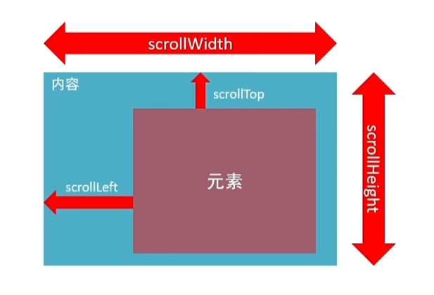

获取元素内容往左、往上滚出去看不到的距离

```html
<body>
  <div>
    我里面有很多很多的文字
    我里面有很多很多的文字
    我里面有很多很多的文字
    我里面有很多很多的文字
    我里面有很多很多的文字
    我里面有很多很多的文字
    我里面有很多很多的文字
    我里面有很多很多的文字
    我里面有很多很多的文字
    我里面有很多很多的文字
    我里面有很多很多的文字
    我里面有很多很多的文字
    我里面有很多很多的文字
    我里面有很多很多的文字

  </div>
  <script>
    const div = document.querySelector('div')
    // 页面滚动事件
    window.addEventListener('scroll', function () {
      // console.log('我滚了')
      // 获取html元素写法  
      // document.documentElement  
      // console.log(document.documentElement.scrollTop)
      const n = document.documentElement.scrollTop
      if (n >= 100) {
        div.style.display = 'block'
      } else {
        div.style.display = 'none'
      }
    })
    // const div = document.querySelector('div')
    // div.addEventListener('scroll', function () {
    //   // console.log(111)
    //   // scrollTop 被卷去的头部
    //   console.log(div.scrollTop)
    // })
  </script>
</body>

```

这两个值是可读写的

```javascript
xxxxxxxxxx 
<script>  
   document.documentElement.scrollTop = 800  
   window.addEventListener('scroll', function () {
     // 必须写到里面    
     const n = document.documentElement.scrollTop    
     // 得到是什么数据   数字型 不带单位    
     console.log(n)  
   })
</script>
```

### 页面尺寸事件
会在窗口尺寸改变的时候触发事件：`resize`

```javascript
window.addEventListener('resize', function() {
    // xxxxx
})
```

检测屏幕宽度：

```javascript
window.addEventListener('resize', function() {
    let w = document.documentElement.clientWidth
    console.log(w)
})
```

获取宽高：

获取元素的可见部分宽高（不包含边框，margin，滚动条等）

`clientWidth和clientHeight`

```html
<style>
  div {
    display: inline-block;
    /* width: 200px; */
    height: 200px;
    background-color: pink;
    padding: 10px;
    border: 20px solid red;
  }
</style>
---------------------------------------------------
<div>123123123123123123123123123123123123123</div>
<script>
  const div = document.querySelector('div')
  console.log(div.clientWidth)
</script>

```

## 元素尺寸与位置
获取元素的自身宽高、包含元素自身设置的宽高、padding、border

获取出来的是数值,方便计算

注意: 获取的是可视宽高, 如果盒子是隐藏的,获取的结果是0

大小：**offsetWidth 和 offsetHeight**

+ 作用：获取元素自身的宽高，包含元素自身设置的宽高、`padding`、`border`
+ 特点：返回的是数字（不带单位），且为只读属性

位置：**offsetLeft 和 offsetTop**

+ 作用：获取元素距离自己 **定位父级元素** 的左、上距离（类似绝对定位）
+ 若父级都没有定位，则以 **浏览器文档** 为准
+ 特点：返回的是数字（不带单位），且为只读属性

# DOM-节点
**DOM树：DOM 将 HTML文档以树状结构**直观的表现出来，我们称之为`DOM树`或者`节点树`

**节点（Node）：** 是DOM树(节点树)中的单个点；包括文档本身、元素、文本以及注释

**元素节点（重点）**

+ 所有的标签 比如 `body、 div`
+ `html `是根节点

**属性节点**

+ 所有的属性 比如` href`

**文本节点**

+ 所有的文本

**利用节点关系可以更好的操作元素（比如查询更方便）**

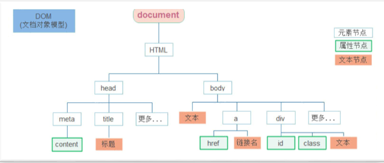

之前 DOM 的操作都是针对元素节点的属性或文本的，除此之外也有专门针对元素节点本身的操作，如插入、复制、删除、替换等

## 查找节点
DOM 树中的任意节点都不是孤立存在的，它们要么是父子关系，要么是兄弟关系，不仅如此，我们可以依据节点之间的关系查找节点

利用**节点关系**查找节点，返回的都是**对象**

+ 父节点
+ 子节点
+ 兄弟节点

有了查找节点可以使我们**选择元素**更加方便

### 查找父节点
`子元素.parentNode`返回最近一级的父节点，找不到返回为null

```html
<body>
  <div class="pop">
    <a href="javascript:;" class="close"></a>
  </div>
  <script>
    // 点击关闭按钮可以关闭父盒子
    const closeBtn = document.querySelector('.close')
    // 利用孩子选取父节点,返回的也是一个元素对象
    console.log(closeBtn.parentNode)
    closeBtn.addEventListener('click', function () {
      this.parentNode.style.display = 'none'
    })
  </script>
</body>

```

### 查找子节点
获得所有子节点、包括文本节点（空格、换行）、注释节点等

`父元素.children` 仅获得**所有元素节点**  返回的还是一个**伪数组**

`元素.nextElementSibling` 下一个兄弟节点

`元素.previousElementSibling` 上一个兄弟节点

```html
<body>
  <ul>
    <li>我是第1个孩子</li>
    <li>我是第2个孩子</li>
    <li>我是第3个孩子</li>
    <li>我是第4个孩子</li>
  </ul>
  <script>
    // 1. 查询子节点
    const ul = document.querySelector('ul')
    console.log(ul.children)
    console.log(ul.children[0]) // 第一个孩子
    console.log(ul.children[2]) // 第三个孩子
     // 2. 查询兄弟节点
    const li2 = document.querySelector('ul li:nth-child(2)')
    // console.log(li2)
    console.log(li2.previousElementSibling) // 上一个兄弟
    console.log(li2.nextElementSibling)  // 下一个兄弟
  </script>
</body>

```

## 增加节点
很多情况下需要在页面中增加元素；比如，点击发布按钮，可以新增一条信息

一般情况下新增节点按照如下操作：

+ **创建**一个新的节点
+ **追加**新的节点到指定的元素内部

父元素**最后一个子节点之后**，插入节点元素

+ `element.append()`

父元素**第一个子元素的之前**，插入节点元素

+ `element.prepend()`

**动态创建任意 DOM 节点**

+ `createElement` 动态创建

**复制现有的 DOM 节点，传入参数 true 会复制所有子节点**

+ `cloneNode` 复制

**在父节点中任意子节点之前插入新节点**

+ `insertBefore` 

如下代码演示：

```html
<body>
  <ul>
    <li>我是小li</li>
  </ul>
  <script>
    // 1. 创建节点
    const li = document.createElement('li')
    li.innerHTML = '我是放到后面的'
    console.log(li)

    // 2. 追加给父元素
    const ul = document.querySelector('ul')
    // 2.1 append 放到ul 的最后面 类似css的 after伪元素
    ul.append(li)
    // 2.2 prepend放到 ul 的最前面 类似css的 before伪元素
    const firstli = document.createElement('li')
    firstli.innerHTML = '我是放到前面的'
    ul.prepend(firstli)
  </script>
</body>

```

## 删除节点
若一个节点在页面中已不需要时，可以删除它，在 JavaScript 原生DOM操作中，要删除元素必须通过父元素删除

首先由父节点删除子节点，其次是要删除哪个子节点

`父元素.element.remove()`

+ 把对象从它所属的 DOM 树中删除
+ 删除节点和隐藏节点（display:none） 区别： 隐藏节点还是存在的，删除则从DOM树中删除

```html
<!DOCTYPE html>
<html lang="en">

  <head>
    <meta charset="UTF-8">
    <meta http-equiv="X-UA-Compatible" content="IE=edge">
    <meta name="viewport" content="width=device-width, initial-scale=1.0">
    <title>删除节点</title>
  </head>
  <body>
    <div class="remove">我要删除</div>
    <div class="none">我要隐藏</div>
    <script>
      // 1. 删除节点, remove 会从dom树中删除这个元素
      const remove = document.querySelector('.remove')
      remove.remove()

      // 2. display:none 隐藏元素，页面看不见，但是dom树中还存在这个标签
      const none = document.querySelector('.none')
      none.style.display = 'none'
    </script>
  </body>
</html>

```

## M端事件
M端(移动端)有自己独特的地方。比如`触屏事件 touch`（也称触摸事件），Android 和 IOS都有。

touch 对象代表一个触摸点。触摸点可能是一根手指，也可能是一根触摸笔。触屏事件可响应用户手指（或触控笔）对屏幕或者触控板操作

常见的触屏事件如下：

| 触屏touch事件 | 说明 |
| --- | --- |
| touchstart | 手指触摸到一个DOM元素时触发 |
| touchmove | 手指在一个DOM元素上滑动时触发 |
| touchend | 手指从一个DOM元素上移开时触发 |

```html
<body>
  <div class="box"></div>
  <script>
    // 触摸事件
    const box = document.querySelector('.box')
    // 1. 手指触屏开始事件 touchstart
    box.addEventListener('touchstart', function () {
      console.log('我开始摸了')
    })
    // 2. 手指触屏滑动事件 touchmove
    box.addEventListener('touchmove', function () {
      console.log('我一直摸')
    })

    // 3. 手指触屏结束事件  touchend
    box.addEventListener('touchend', function () {
      console.log('我摸完了')
    })
  </script>
</body>

```

## JS插件
插件: 就是别人写好的一些代码,只需要复制对应的代码,就可以直接实现对应的效果

### swiper
+ 是纯javascript打造的滑动特效插件，面向手机、平板电脑等移动终端
+ 能实现触屏焦点图、触屏Tab切换、触屏轮播图切换等常用效果
+ 开源、免费、稳定、使用简单、功能强大，是架构移动终端网站的重要选择
+ [熟悉官网](https://www.swiper.com.cn/)
+ [查看基本使用流程](https://www.swiper.com.cn/usage/index.html)      
+ [在线演示demo](https://www.swiper.com.cn/demo/index.html)

### AlloyFinger
AlloyFinger 是腾讯 AlloyTeam 团队开源的超轻量级 Web 手势插件，为元素注册各种手势事件

github地址：[https://github.com/AlloyTeam/AlloyFinger](https://github.com/AlloyTeam/AlloyFinger)

使用步骤：

1. 下载js库：[http://alloyteam.github.io/AlloyFinger/alloy_finger.js](http://alloyteam.github.io/AlloyFinger/alloy_finger.js)
2. 将AlloyFinger库引入当前文件：<scriptsrc="alloy_finger.js">

或者使用在线地址：

`https://unpkg.com/alloyfinger@0.1.16/alloy_finger.js`

3. 配置

```javascript
new AlloyFinger(element, {  // element 是给哪个元素做滑动事件
  swipe: function (e) {
    // 滑动的时候要做的事情 e.direction 可以判断上下左右滑动 Left  Right 等
  }
})
```


# BOM-浏览器
 **BOM** (Browser Object Model ) 是浏览器对象模型

## window 对象
window对象是一个**全局对象**，也可以说是JavaScript中的顶级对象

+ 像`document`、`alert()`、`console.log()`这些都是window的属性，基本BOM的属性和方法都是window的
+ 所有通过`var`定义在全局作用域中的变量、函数都会变成window对象的属性和方法
+ **window对象下的属性和方法调用的时候可以省略window**


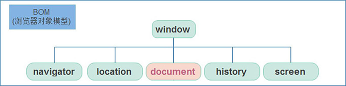

```javascript
window.alert('完全弹框')
window.console.log('hello')
```

**注意：** `name`关键字少用，它是window的一个对象

## 定时器-延迟函数
JavaScript 内置的一个用来让代码**延迟执行**的函数 `setTimeout`

**语法：** `setTimeout(回调函数, 延迟时间毫秒)`

**setTimeout 仅仅只执行一次，** 可以理解为就是把一段代码延迟执行, 平时省略window

`setInterval`间歇函数 每隔一段时间就执行一次，平时省略window

清除延时函数：`clearTimeout(timerId)`

**注意**

+ 延时函数需要等待,所以**后面的代码先执行**（异步任务）
+ 返回值是一个**正整数**，表示定时器的**编号**

```html
<body>
  <script>
    // 定时器之延迟函数
    // 1. 开启延迟函数
    let timerId = setTimeout(function () {
      console.log('我只执行一次')
    }, 3000)

    // 1.1 延迟函数返回的还是一个正整数数字，表示延迟函数的编号
    console.log(timerId)

    // 1.2 延迟函数需要等待时间，所以下面的代码优先执行

    // 2. 关闭延迟函数
    clearTimeout(timerId)

  </script>
</body>

```

滥用定时器可能导致**内存泄漏**，需及时用 `clearTimeout()`/`clearInterval()` 清理

## location对象
`location (地址)` **拆分并保存**了 `URL 地址`的各个组成部分， 它是一个**对象**

直接修改 `location` 属性会触发页面加载，需谨慎操作

| 属性/方法 | 说明 |
| --- | --- |
| **location.href** | 属性，获取完整的 URL 地址，赋值时用于地址的跳转 |
| location.search | 属性，获取地址中携带的参数，**符号 ？后面**部分 |
| location.hash | 属性，获取地址中的啥希值，**符号 # 后面**部分 |
| location.reload() | 方法，用来刷新当前页面，传入参数 true 时表示强制刷新 |

```html
<body>
  <form>
    <input type="text" name="search"> <button>搜索</button>
  </form>
  <a href="#/music">音乐</a>
  <a href="#/download">下载</a>
  <button class="reload">刷新页面</button>
  <script>
    // location 对象  
    // 1. href属性 （重点） 得到完整地址，赋值则是跳转到新地址
    console.log(location.href)
    // location.href = 'http://www.itcast.cn'

    // 2. search属性  得到 ? 后面的地址 
    console.log(location.search)  // ?search=笔记本

    // 3. hash属性  得到 # 后面的地址 后续vue会用
    console.log(location.hash)

    // 4. reload 方法  刷新页面
    const btn = document.querySelector('.reload')
    btn.addEventListener('click', function () {
      // location.reload() // 页面刷新
      location.reload(true) // 强制页面刷新 ctrl+f5，从服务器获取最新数据
    })
  </script>
</body>

```

## navigator对象
navigator是**对象**，该对象下记录了**浏览器自身的相关信息**

常用属性和方法：

+ 通过` navigator.userAgent` 检测浏览器的版本及平台
+ `userAgent` 易被篡改，不可完全依赖其做功能判断

```javascript
// 检测 userAgent（浏览器信息）
(function () {
  const userAgent = navigator.userAgent
  // 验证是否为Android或iPhone
  const android = userAgent.match(/(Android);?[\s\/]+([\d.]+)?/)
  const iphone = userAgent.match(/(iPhone\sOS)\s([\d_]+)/)
  // 如果是Android或iPhone，则跳转至移动站点
  if (android || iphone) {
    location.href = 'http://m.itcast.cn'
  }})();
```

## histroy对象
history (历史)对象主要**管理历史记录**， 该对象与浏览器地址栏的操作相对应，如**前进、后退**等

**使用场景：** history对象一般在实际开发中比较少用，但是会在一些OA 办公系统中见到

| history对象方法 | 作用 |
| --- | --- |
| history.back() | 后退 |
| history.forward() | 前进 |
| history.go(参数) | 参数为1前进，参数为-1后退 |

```html
<body>
  <button class="back">←后退</button>
  <button class="forward">前进→</button>
  <script>
    // histroy对象

    // 1.前进
    const forward = document.querySelector('.forward')
    forward.addEventListener('click', function () {
      // history.forward() 
      history.go(1)
    })
    // 2.后退
    const back = document.querySelector('.back')
    back.addEventListener('click', function () {
      // history.back()
      history.go(-1)
    })
  </script>
</body>

```

## **本地存储（重点）**
本地存储：将**数据存储在本地**浏览器中

优点：

+ 页面刷新或者关闭不丢失数据，实现数据持久化
+ 容量较大，sessionStorage和 localStorage 约 5M 左右

### localStorage（重点）
**作用:** 数据可以**长期保留**在**本地浏览器**中，刷新页面和关闭页面数据也不会丢失

**特性：**

+ **以键值对**的形式存储，并且存储的是**字符串**， 省略了window
+ **生命周期**：需手动清除（通过代码或浏览器设置）
+ **作用域**：同域名、同协议下所有窗口共享数据
+ **容量**：通常为 5MB
+ **适用场景**：用户偏好设置（如主题、语言）、长期登录状态

**方法：**

+ **存储数据：** localStorage.**setItem**（key,value）
+ **读取数据：** localStorage.**getItem**（key）
+ **删除数据：** localStorage.**removeItem**（key）

```javascript
// 本地存储 - localstorage 存储的是字符串 
// 1. 存储
localStorage.setItem('age', 18)
// 2. 获取
console.log(typeof localStorage.getItem('age'))
// 3. 删除
localStorage.removeItem('age')
```

### sessionStorage（了解）
**定义**：会话级临时存储，数据仅在当前标签页有效

**特性：**

+ 用法跟localStorage基本相同
+ 在同一个窗口(页面)下数据可以共享
+ 以键值对的形式存储使用
+ 区别是：当页面**浏览器被关闭**时，存储在 sessionStorage 的数据**会被清除**
+ **适用场景**：表单输入暂存、单页应用（SPA）临时状态管理

存储：sessionStorage.setItem(key,value)

获取：sessionStorage.getItem(key)

删除：sessionStorage.removeItem(key)

**浏览器查看本地存储**


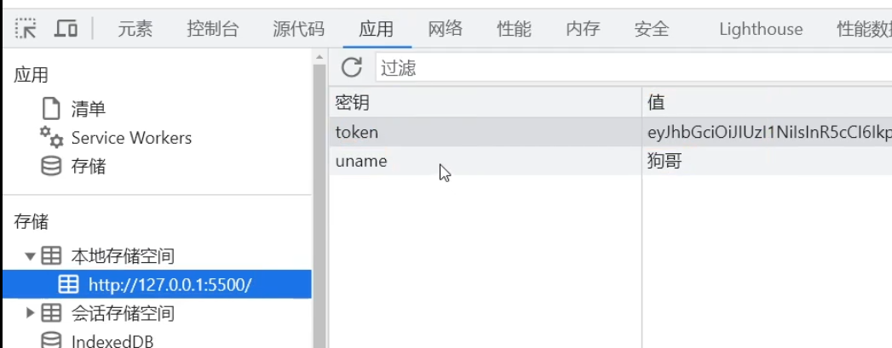

### localStorage 存储复杂数据类型
**问题：** 本地只能存储字符串,无法存储复杂数据类型.

**解决：对象转换为JSON字符串**

**语法：JSON.stringify(复杂数据类型)**

JSON字符串：

+ 是字符串格式数据、常用于前后端交互
+ 属性名使用双引号引起来，不能单引号
+ 属性值如果是字符串型也必须双引号

```html
<body>
  <script>
    // 本地存储复杂数据类型
    const goods = {
      name: '小米',
      price: 1999
    }
    // localStorage.setItem('goods', goods)
    // console.log(localStorage.getItem('goods'))

    // 1. 把对象转换为JSON字符串  JSON.stringify
    localStorage.setItem('goods', JSON.stringify(goods))
    // console.log(typeof localStorage.getItem('goods'))

  </script>
</body>

```

**问题：** 因为本地存储里面取出来的是字符串，不是对象，无法直接使用

**解决： JSON字符串转换为对象语法：JSON.parse(JSON字符串)**

```html
<body>
  <script>
    // 本地存储复杂数据类型
    const goods = {
      name: '小米',
      price: 1999
    }
    // localStorage.setItem('goods', goods)
    // console.log(localStorage.getItem('goods'))

    // 1. 把对象转换为JSON字符串  JSON.stringify
    localStorage.setItem('goods', JSON.stringify(goods))
    // console.log(typeof localStorage.getItem('goods'))

    // 2. 把JSON字符串转换为对象  JSON.parse
    console.log(JSON.parse(localStorage.getItem('goods')))

  </script>
</body>

```

# 正则表达式
**正则表达式**（Regular Expression）是一种字符串匹配的**模式（规则）使用场景：**

+ 例如验证表单：手机号表单要求用户只能输入11位的数字 **(匹配)**
+ 过滤掉页面内容中的一些**敏感词(替换)**，或从字符串中获取我们想要的**特定部分(提取**)等


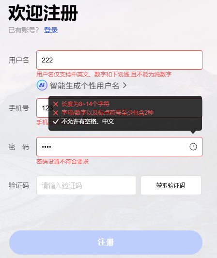

## 语法
**定义规则**

```javascript
const reg =  /表达式/
```

+ 其中` /   / `是正则表达式**字面量**
+ 正则表达式也是`对象 `

**使用正则**

+ `test()方法`   用来查看正则表达式与指定的字符串是否匹配
+ 如果正则表达式与指定的字符串匹配 ，返回`true`，否则`false`

```html
<body>
  <script>
    // 正则表达式的基本使用
    const str = 'web前端开发'
    // 1. 定义规则
    const reg = /web/

    // 2. 使用正则  test()
    console.log(reg.test(str))  // true  如果符合规则匹配上则返回true
    console.log(reg.test('java开发'))  // false  如果不符合规则匹配上则返回 false
  </script>
</body>

```

## 元字符
**普通字符:**

+ 大多数的字符仅能够描述它们本身，这些字符称作普通字符，例如所有的字母和数字
+ 普通字符只能够匹配字符串中与它们相同的字符
+ 比如，规定用户只能输入英文26个英文字母，普通字符的话  `/[abcdefgh……tuvwxyz]/`

**元字符(特殊字符）**

+ 是一些具有**特殊含义的字符**，可以极大提高了灵活性和强大的匹配功能。
+ 比如，规定用户只能输入英文26个英文字母，换成元字符写法： `/[a-z]/ `

**分类：** 

+ **边界符**（表示位置，开头和结尾，必须用什么开头，用什么结尾
+ **量词** （表示重复次数）
+ **字符类** （比如 \d 表示 0~9）

### 边界符
正则表达式中的边界符（位置符）用来提示字符所处的位置，主要有两个字符

| 边界符 | 说明 |
| --- | --- |
| ^ | 匹配行首的文本，**以谁开始** |
| $ | 匹配行尾的文本，**以谁结束** |

**如果 `^和 $` 在一起，表示必须是精确匹配** 

```html
<body>
  <script>
    // 元字符之边界符
    // 1. 匹配开头的位置 ^
    const reg = /^web/
    console.log(reg.test('web前端'))  // true
    console.log(reg.test('前端web'))  // false
    console.log(reg.test('前端web学习'))  // false
    console.log(reg.test('we'))  // false

    // 2. 匹配结束的位置 $
    const reg1 = /web$/
    console.log(reg1.test('web前端'))  //  false
    console.log(reg1.test('前端web'))  // true
    console.log(reg1.test('前端web学习'))  // false
    console.log(reg1.test('we'))  // false  

    // 3. 精确匹配 ^ $
    const reg2 = /^web$/
    console.log(reg2.test('web前端'))  //  false
    console.log(reg2.test('前端web'))  // false
    console.log(reg2.test('前端web学习'))  // false
    console.log(reg2.test('we'))  // false 
    console.log(reg2.test('web'))  // true
    console.log(reg2.test('webweb'))  // flase 
  </script>
</body>

```

### 量词
量词用来设定某个模式重复次数

| 量词 | 说明 |
| --- | --- |
| * | 重复零次或更多次 |
| + | 重复一次或更多次 |
| ？ | 重复零次或一次 |
| {n} | 重复n次 |
| {n,} | 重复n次或者更多次 |
| {n,m} | 重复n到m次 |

**注意： 逗号左右两侧千万不要出现空格**

```html
<body>
  <script>
    // 元字符之量词
    // 1. * 重复次数 >= 0 次
    const reg1 = /^w*$/
    console.log(reg1.test(''))  // true
    console.log(reg1.test('w'))  // true
    console.log(reg1.test('ww'))  // true
    console.log('-----------------------')

    // 2. + 重复次数 >= 1 次
    const reg2 = /^w+$/
    console.log(reg2.test(''))  // false
    console.log(reg2.test('w'))  // true
    console.log(reg2.test('ww'))  // true
    console.log('-----------------------')

    // 3. ? 重复次数  0 || 1 
    const reg3 = /^w?$/
    console.log(reg3.test(''))  // true
    console.log(reg3.test('w'))  // true
    console.log(reg3.test('ww'))  // false
    console.log('-----------------------')

    // 4. {n} 重复 n 次
    const reg4 = /^w{3}$/
    console.log(reg4.test(''))  // false
    console.log(reg4.test('w'))  // flase
    console.log(reg4.test('ww'))  // false
    console.log(reg4.test('www'))  // true
    console.log(reg4.test('wwww'))  // false
    console.log('-----------------------')

    // 5. {n,} 重复次数 >= n 
    const reg5 = /^w{2,}$/
    console.log(reg5.test(''))  // false
    console.log(reg5.test('w'))  // false
    console.log(reg5.test('ww'))  // true
    console.log(reg5.test('www'))  // true
    console.log('-----------------------')

    // 6. {n,m}   n =< 重复次数 <= m
    const reg6 = /^w{2,4}$/
    console.log(reg6.test('w'))  // false
    console.log(reg6.test('ww'))  // true
    console.log(reg6.test('www'))  // true
    console.log(reg6.test('wwww'))  // true
    console.log(reg6.test('wwwww'))  // false

    // 7. 注意事项： 逗号两侧千万不要加空格否则会匹配失败

  </script>

```

### 范围
表示字符的范围，定义的规则**限定在某个范围**，比如只能是英文字母，或者数字等等

**[abc]**：匹配包含的单个字符，即只有 `a`、`b`、`c` 这三个单字符时返回 `true`，可理解为“多选一”

**[a-z]**：连字符，用于指定字符范围。`[a-z]` 表示匹配 `a` 到 `z` 的 26 个英文字母

**[^abc]**：取反符。例如 `[^a-z]` 表示匹配除了小写字母以外的字符

```html
<body>
  <script>
    // 元字符之范围  []  
    // 1. [abc] 匹配包含的单个字符， 多选1
    const reg1 = /^[abc]$/
    console.log(reg1.test('a'))  // true
    console.log(reg1.test('b'))  // true
    console.log(reg1.test('c'))  // true
    console.log(reg1.test('d'))  // false
    console.log(reg1.test('ab'))  // false

    // 2. [a-z] 连字符 单个
    const reg2 = /^[a-z]$/
    console.log(reg2.test('a'))  // true
    console.log(reg2.test('p'))  // true
    console.log(reg2.test('0'))  // false
    console.log(reg2.test('A'))  // false
    // 想要包含小写字母，大写字母 ，数字
    const reg3 = /^[a-zA-Z0-9]$/
    console.log(reg3.test('B'))  // true
    console.log(reg3.test('b'))  // true
    console.log(reg3.test(9))  // true
    console.log(reg3.test(','))  // flase

    // 用户名可以输入英文字母，数字，可以加下划线，要求 6~16位
    const reg4 = /^[a-zA-Z0-9_]{6,16}$/
    console.log(reg4.test('abcd1'))  // false 
    console.log(reg4.test('abcd12'))  // true
    console.log(reg4.test('ABcd12'))  // true
    console.log(reg4.test('ABcd12_'))  // true

    // 3. [^a-z] 取反符
    const reg5 = /^[^a-z]$/
    console.log(reg5.test('a'))  // false 
    console.log(reg5.test('A'))  // true
    console.log(reg5.test(8))  // true

  </script>
</body>

```

### 字符类
某些常见模式的简写方式，区分字母和数字

| 字符类 | 说明 |
| --- | --- |
| \d | [0-9] 匹配0-9之间任意数字 |
| \D | [^0-9] 匹配所有0-9之外的字符 |
| \w | [A-Za-z0-9_]] 匹配任意字母、数字、下划线 |
| \W | [^A-Za-z0-9_] 匹配除所有除去字母、数字、下划线以外的字符 |
| \s | [\t\r\n\v\f] 匹配空格（制表符、换行符、空格符等） |
| \S | [^\t\r\n\v\f] 匹配非空格字符 |

## 替换和修饰符
replace 替换方法，可以完成字符的替换

```html
<body>
  <script>
    // 替换和修饰符
    const str = '欢迎大家学习前端，相信大家一定能学好前端，都成为前端大神'
    // 1. 替换  replace  需求：把前端替换为 web
    // 1.1 replace 返回值是替换完毕的字符串
    // const strEnd = str.replace(/前端/, 'web') 只能替换一个
  </script>
</body>

```

修饰符约束正则执行的某些细节行为，如是否区分大小写、是否支持多行匹配等

+ `i` 是单词 `ignore` 的缩写，正则匹配时字母不**区分大小写**
+ `g` 是单词 `global `的缩写，匹配**所有满足**正则表达式的结果

```html
<body>
  <script>
    // 替换和修饰符
    const str = '欢迎大家学习前端，相信大家一定能学好前端，都成为前端大神'
    // 1. 替换  replace  需求：把前端替换为 web
    // 1.1 replace 返回值是替换完毕的字符串
    // const strEnd = str.replace(/前端/, 'web') 只能替换一个

    // 2. 修饰符 g 全部替换
    const strEnd = str.replace(/前端/g, 'web')
    console.log(strEnd) 
  </script>
</body>

```

## 正则插件


## change 事件
给input注册 change 事件，值被修改并且失去焦点后触发

## 判断是否有类
元素.classList.contains() 看看有没有包含某个类，如果有则返回true，么有则返回false

```javascript
// 添加类名
元素.classList.add('类名')
// 删除类名
元素.classList.remove('类名')
// 切换类名
元素.classList.toggle('类名')
// 判断是否包含某个类名，存在返回true，没有返回false
元素.classList.contains('类名')
```

# 作用域
**概念：** 作用域决定了变量、函数和对象的**可访问范围**，是代码执行时查找变量的规则体系

## 函数作用域
在函数**内部声明的变量**只能在函数内部被访问，外部无法直接访问

```html
<script>
  // 声明 counter 函数
  function counter(x, y) {
    // 函数内部声明的变量
    const s = x + y
    console.log(s) // 18
  }
  // 设用 counter 函数
  counter(10, 8)
  // 访问变量 s
  console.log(s)// 报错
</script>

```

总结：

1. 函数内部声明的变量，在函数外部无法被访问
2. 函数的参数也是函数内部的局部变量
3. 不同函数内部声明的变量无法互相访问
4. 函数执行完毕后，函数内部的变量实际被清空了

## 块作用域
**（ES6引入）：`let` 和 `const` 在 `{}` 内有效（如 `if`、`for`）**

```html
<script>
  {
    // age 只能在该代码块中被访问
    let age = 18;
    console.log(age); // 正常
  }
  // 超出了 age 的作用域
  console.log(age) // 报错
  
  let flag = true;
  if(flag) {
    // str 只能在该代码块中被访问
    let str = 'hello world!'
    console.log(str); // 正常
  }
  // 超出了 age 的作用域
  console.log(str); // 报错
  
  for(let t = 1; t <= 6; t++) {
    // t 只能在该代码块中被访问
    console.log(t); // 正常
  }
  // 超出了 t 的作用域
  console.log(t); // 报错
</script>

```

JavaScript 中除了变量外还有常量，常量与变量本质的区别是【常量必须要有值且不允许被重新赋值】

常量值为对象时其属性和方法允许重新赋值

```html
<script>
  // 必须要有值
  const version = '1.0.0';

  // 不能重新赋值
  // version = '1.0.1';

  // 常量值为对象类型
  const user = {
    name: '小明',
    age: 18
  }

  // 不能重新赋值
  user = {};

  // 属性和方法允许被修改
  user.name = '小小明';
  user.gender = '男';
</script>

```

总结：

+ `let` 声明的变量会产生块作用域，`var` 不会产生块作用域
+ `const` 声明的常量也会产生块作用域
+ 不同**代码块**之间的变量无法互相访问
+ 推荐使用 `let` 或 `const`

开发中 `let` 和 `const` 经常不加区分的使用，担心某个值会被修改时则使用 `const` 声明成常量

## 全局作用域
`<script>` 标签和 `.js` 文件的最外层就是所谓的全局作用域，在函数或代码块外声明的变量，可在任何地方访问。但滥用会导致命名冲突和全局污染

```html
<script>
  // 此处是全局
  function sayHi() {
    // 此处为局部
  }
  // 此处为全局
</script>
```

全局作用域中声明的变量，任何其它作用域都可以被访问

```html
<script>
  // 全局变量 name
  const name = '小明'
  // 函数作用域中访问全局
  function sayHi() {
    // 此处为局部
    console.log('你好' + name)
  }
  // 全局变量 flag 和 x
  const flag = true
  let x = 10
  // 块作用域中访问全局
  if(flag) {
    let y = 5
    console.log(x + y) // x 是全局的
  }
</script>
```


总结：

+ 为 `window` 对象动态添加的属性默认也是全局的，不推荐
+ 函数中未使用任何关键字声明的变量为全局变量，不推荐
+ 优先使用 `let/const` 代替 `var`，减少变量污染

## 作用域链

嵌套关系的**作用域链串联**起来形成**作用域链**

**概念：** 当**访问变量**时，引擎从**当前作用域逐级向上查找**，直到全局作用域，形成作用域链

```html
<script>
  // 全局作用域
  let a = 1
  let b = 2
  // 局部作用域
  function fun() {
    let a = 10
    //局部作用域
    function demo() { //
      a = 20
      console.log(a) //就近原则，a为20
      console.log(b) //就近原则，demo()作用域没有，往上fun()作用域没有，再往上全局b为2
      console.log(d) //一直找，直到全局依然找不到，报错
    }
    demo() //调用demo函数
  }
  fun() //调用fun函数
</script>
```

总结：

+ 作用域链本质上是底层的变量查找机制
+ 嵌套关系的作用域串联起来形成了作用域链
+ **查找规则：就近原则**
+ 当前作用域用找不到，则会逐级查找父级作用域直到全局作用域
+ **都找不到则提示错误，这个变量没有被定义过  ReferenceError: d is not defined**
+ 子作用域能够访问父作用域，父级作用域无法访问子级作用域

## 闭包
Closure 是**函数及其相关的引用环境的组合，** 使得**内部函数可以访问外部函数的作用域**即使外部函数已执行完毕，简单来说闭包是 **“函数记忆其诞生环境的能力”形成条件**

+ **函数嵌套**：内部函数定义在外部函数中
+ **内部函数引用外部变量**：内部函数需使用外部函数的变量或参数
+ **内部函数被外部引用**：内部函数被返回、传递给其他函数，或作为事件回调

**核心原理**

+ **词法作用域（Lexical Scoping）**：函数定义时确定作用域链，而非执行时
+ **环境保留**：外部函数执行完毕后，其作用域因闭包引用而保留，不会被垃圾回收

**闭包 = 内层函数 + 外层函数变量**

外层函数执行结束后，本该销毁的变量，因为被内层引用而保留，内层函数在任何地方调用，都能访问到这个外层变量

**一个函数嵌套另一个函数，内部函数引用了外部函数的变量或参数， 导致外部函数作用域不会被销毁**


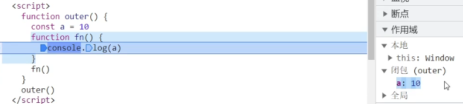

```javascript
// 1. 闭包 = 内层函数 + 外层函数变量
function outer() { //outer形成闭包
  const a = 10 //作用域在other
  function fn() {
    console.log(a) //内层函数fn 访问
  }
  fn()
}
outer()
```

**闭包作用：** 实现数据的私有，统计函数的调用次数

```javascript
//案例-记录函数调用次数
let count = 1  //此时count为全局，容易被修改
function fn() {
  count++
  console.log(`函数被调用${count}次`)
}
fn() //调用1次
fn() //调用2次
count = 10 //污染count全局，不安全
fn() //调用11次
-----------------------------------------
// 闭包的写法  统计函数的调用次数
function outer() {
  let count = 1 //局部作用域outer
  function fun() { //内层函数
    count++
    console.log(`函数被调用${count}次`)
  }
  return fun //返回fun()函数
}
-----------------------------------------------------
const re = outer() //函数返回值为函数fun
re() //实际上在调用函数fun
// const re = function fun() {
//   count++
//   console.log(`函数被调用${count}次`)
// }
re()
//闭包存在的问题： 可能会造成内存泄漏
```

**优点**

+ **数据私有化**：隐藏实现细节，增强代码安全性，避免全局污染
+ **状态持久化**：延长变量生命周期，支持复杂逻辑
+ **灵活的函数设计**：支持高阶函数、柯里化等模式

**缺点**

+ **内存泄漏风险**：闭包长期持有外部变量引用，可能阻止垃圾回收，直到闭包本身被销毁
+ **性能影响**：频繁创建闭包可能增加内存占用和计算开销

**最佳实践**

+ **及时解除引用**：不再需要的闭包变量置为 `null`
+ **避免循环中滥用闭包**：优先使用 `let` 或 IIFE
+ **模块化封装**：用闭包隔离代码，减少全局污染

# 垃圾回收
## 概述
JavaScript 的垃圾回收（Garbage Collection, GC）**自动管理内存分配与释放**，通过识别不再被程序使用的对象（即“垃圾”），回收其内存空间以避免内存泄漏和程序崩溃

**核心目标：**

+ **自动化内存管理**：开发者无需手动释放内存
+ **防止内存泄漏**：避免无效对象长期占用内存
+ **性能优化**：通过高效回收策略减少程序卡顿

**内存泄漏**：不再用到的内存没有及时释放

**泄漏案例**：未清除的事件监听、未释放的闭包引用（如全局变量持有闭包）

## 内存的生命周期 
JS环境中分配的内存, 一般有如下生命周期： 

+ **内存分配：** 当我们声明变量、函数、对象的时候，系统会自动为他们分配内存 
+ **内存使用：** 即读写内存，也就是使用变量、函数等 
+ **内存回收：** 使用完毕，由垃圾回收自动回收不再使用的内存

**内存泄漏：** 程序中分配的**内存**由于某种原因程序**未释放或无法释放**叫做内存泄漏

> 说明： 全局变量一般不会回收(关闭页面回收)；一般情况下**局部变量**的值, 不用了,会被自动回收掉

```javascript
//变量分配内存
const age = 18
//对象分配内存
const obj = {
  age:19
}
//为函数分配内存
function fn(){
  const age = 18
}
fn()
fn() 不会报错const
```

## 引用计数（Reference Counting）
**原理**：为每个对象维护一个引用计数器，当引用数为 0 时回收

```javascript
let a = { name: "Alice" };  // 引用数=1
let b = a;                  // 引用数=2
a = null;                   // 引用数=1
b = null;                   // 引用数=0 → 回收
```

**缺点**：

+ **循环引用问题**：若对象相互引用，计数器永不归零（如 `A.link = B; B.link = A`）
+ **性能开销**：频繁更新计数器影响效率
+ 现代的浏览器已经不再使用引用计数算法了

## 标记-清除（Mark-and-Sweep）
流程（主流算法）：

+ **标记阶段**：从根对象（全局变量、活动函数作用域等）出发，遍历所有可达对象并标记为“活动”
+ **清除阶段**：释放未标记对象的内存

**优势**：

+ 解决循环引用问题（不可达对象即使相互引用也会被回收）
+ 内存利用率高，适合复杂对象结构

**缺点**：

+ **内存碎片化：** 清除后内存空间不连续（需标记-整理算法优化）
+ **全停顿（Stop-The-World）**：执行时暂停程序，可能引起卡顿

## 现代引擎优化策略
**分代回收（Generational Collection）**

原理：基于“对象生命周期越短，越可能快速死亡”的假设，将内存分为：

+ **新生代**：存放短生命周期对象，使用 **Scavenger 算法**（复制存活对象至连续空间，清空原区域）
+ **老生代**：存放长期存活对象，使用 **标记-清除-整理算法**（清除后压缩内存消除碎片）

**增量回收（Incremental GC）**

+ **原理**：将垃圾回收任务拆分为多个小任务，穿插在程序执行间隙，减少单次停顿时间

**并行与并发回收**

+ **并行回收**：利用多线程加速 GC（如 V8 的主线程和辅助线程协同工作）
+ **并发回收**：GC 与程序逻辑同时执行（需写屏障技术维护引用一致性）

## 触发时机
+ **内存阈值触发**：堆内存使用量超过预设阈值时自动执行
+ **空闲时间触发**：浏览器/Node.js 在事件循环空闲时执行回收
+ **手动触发**：部分引擎支持 API（如 `window.gc()`，但需谨慎使用）

# 预解析
## 变量提升
变量提升是 JavaScript 中比较奇怪的现象，它允许在变量声明之前即被访问

+ 变量在未声明即被访问时会报语法错误

> + 只有`var`声明的变量放在当前**作用域最前面， 自动初始化为**`undefined`
> + 只提升变量**声明**，不提升变量**赋值**

> + `let、const` 声明的变量同样存在变量提升， 只是提升后不会初始化，处于「暂时性死区 TDZ」  ；推荐使用 `let`先声明再访问变量

```html
<script>
  //当前作用域
  //提升到此处 var num ,不提升赋值
  console.log(num) //undefined  定义变量但未赋值
  var num = 10    //只提升声明，赋值还留在这里
  console.log(num) //10
</script>

```

注：关于变量提升的原理分析会涉及较为复杂的词法分析等知识，而开发中使用 `let` 可以轻松规避变量的提升，因此在此不做过多的探讨，有兴趣可[查阅资料](https://segmentfault.com/a/1190000013915935)

## 函数提升
函数提升与变量提升比较类似，是指函数在声明之前即可被调用

```html
<script>
  // 可调用函数
  foo()
  // 声明函数方式创建函数
  function foo() {
    console.log('声明之前即被调用...')
  }

  // 不存在提升现象
  bar()  // 错误
  // 函数表达式创建函数，严格来说是变量赋值，不能在赋值之前调用
  const bar = function () {
    console.log('函数表达式不存在提升现象...')
  }
</script>

```

总结：

+ 函数提升提升到**当前作用域最前面**
+ 函数提升只**提升声明，不提升调用**
+ 函数表达式**不存在**提升的现象
+ 函数提升能够使函数的声明调用更灵活

# 函数参数
函数参数的使用细节，能够提升函数应用的灵活度

## 默认参数
**概念**：ES6允许为函数参数设置默认值，当参数未被传递或传递值为**undefined**时使用的预设值

```javascript
// 设置参数默认值
function sayHi(name="小明", age=18) {
  document.write(`<p>大家好，我叫${name}，我今年${age}岁了。</p>`);
}
// 调用函数
sayHi();
sayHi('小红');
sayHi('小刚', 21);
```

**惰性求值**：默认值在调用时计算

```javascript
let counter = 0;
function demo(value = counter++) {
  console.log(value);
}
demo(); // 0 (调用时计算)
demo(); // 1
```

**作用域隔离**：默认参数会形成独立作用域

```javascript
let x = 10;
function test(a = x) { // 这里的x访问的是外层作用域
  let x = 20;
  console.log(a);
}
test(); // 10
```

**前向引用**：后面的参数可以引用前面的参数

```javascript
function createElement(width = 100, height = width * 0.75) {
  return { width, height };
}
console.log(createElement()); // {width: 100, height: 75}
```

## 动态参数（了解）
ES5及之前版本获取所有参数的唯一方式

`arguments` 是函数内部内置的伪数组变量，它包含了调用函数时传入的**所有实参**

```javascript
// 求和函数，计算所有参数的和
function sum() {
  console.log(arguments) //伪数组对象格式得到所有实参
  //可以循环遍历得到每一个实参
  let s = 0
  for(let i = 0; i < arguments.length; i++) {
    s += arguments[i]
  }
  console.log(s)
}
// 调用求和函数
sum(5, 10)// 两个参数
sum(1, 2, 4) // 两个参数
```

+ 箭头函数没有arguments对象
+ 无法准确反映默认参数的情况

```javascript
function demo(a = 1) {
  console.log(arguments.length);
}
demo(); // 0 (但实际a使用了默认值)
```

总结：

+ `arguments` 是一个伪数组
+ `arguments` 的作用是动态获取函数的实参

## 剩余参数
**剩余参数：** 允许函数接收**不定数量的参数**，并将其收集到一个**数组**中

用于获取**多余的实参，并形成一个真数组**

**语法：**

+ `...` 是语法符号，置于**最末函数形参**之前，用于获取多余的实参
+ **位置限制**：剩余参数必须是函数参数列表中的 **最后一个参数**，否则会触发语法错误
+ **唯一性**：每个函数只能有一个剩余参数
+ **类型**：剩余参数始终是数组，即使没有参数传入也是一个空数组

例如 `function sum(...numbers)`

**使用场景：解决形参实参**数量不匹配，需要接收**任意数量参数** 的函数，例如求和、日志记录等

```javascript
function valid(a, b, ...rest) {}   // 正确
function invalid(a, ...rest, b) {} // 错误
function getSum(...arr){
  console.log(arr)
}
getSum(1,2,3,4) //
---------------------------
//可以求和，但最少要求两个数的和,第三个参数写...arr
function getSum(a,b,...options){
  //// options始终是数组
  console.log(a + b, options) //(3)[4,5,6]
}
getSum(1,2,3,4) //
```

## 展开运算符
`...`将一个**数组/对象**进行展开

**函数调用展开**

```javascript
function calculate(x, y, z) {
  return x * y + z;
}
const nums = [2, 3, 4];
console.log(calculate(...nums)); // 2 * 3 + 4 = 10
```

**数组操作**

```javascript
let arr = [1,2,3,4,5]
console.log(...arr) //1 2 3 4 5
Math.max(...arr)
Math.min(...arr)
-------------------------------------
//合并数组
let arr1 = [1,2,3]
let arr2 = [4,5,6]
let arr3 = [...arr1,...arr2]
console.log(arr3) // [1,2,3,4,5,6]
-------------------------------------
```

**对象操作（ES2018+）**

```javascript
// 展开对象
let obj = {
  uname = '小明',
  age = 18
}
console.log{...obj} // 展开为一个新对象，只不过内容一样，对象地址为全新
console.log({...obj} === obj) //false
----------------------------------------------------
// 合并对象
let obj1 = {
  uname:'sss'
}
let obj2 = {
  age = 18
}
let obj3 = {
  ...obj1,
  ...obj2
}
```

展开对象时：

+ 后出现的属性覆盖前面的
+ 只展开可枚举的自有属性
+ 不展开原型链上的属性

**剩余参数：函数参数使用，得到真数组 展开运算符：数组中使用，数组展开**

# 箭头函数
**本质特性**：与传统函数完全不同的参数处理机制

+ 箭头函数（`=>`）是 ES6 的简洁函数语法，具有词法作用域 `this` 绑定
+ 箭头函数更适用于那些**本来需要匿名函数**的地方
+ 引入箭头函数的目的是更简短的函数写法并且**不绑定this**
+ 箭头函数的语法比函数表达式更简洁

注意：

+ 当只有**一个参数**时可以**省略参数的小括号**，其余不能省略（没有参数也需要写小括号）
+ 当函数体只有**一句代码**可以**省略函数体大括号**，这句代码就是返回值（可以不用写return）
+ 如果**返回**的是个**对象**，则需要把对象用**小括号**包裹
+ 箭头函数里面没有`arguments`，但是有**剩余参数**

```javascript
const fn = function () {
    console.log(123)
}
//1. 箭头函数 基本语法
const fn = () => {
   console.log(123)
}
fn()
const fn = (x) => {
   console.log(x)
 }
fn(1)
//2. 只有一个形参的时候，可以省略小括号
const fn = x => {
   console.log(x)
}
fn(1)
//3. 只有一行代码的时候，可以省略大括号
const fn = x => console.log(x)
fn(1)
//4. 只有一行代码的时候，可以省略return
const fn = x => x + x
console.log(fn(1))
// 5. 箭头函数可以直接返回一个对象,用小括号包裹,因为{}会识别为函数的{}
const fn = (uname) => ({ uname: uname })
console.log(fn('刘德华'))
```

总结：

1. 箭头函数属于表达式函数，因此不存在函数提升
2. 箭头函数只有一个参数时可以省略圆括号 `()`
3. 箭头函数函数体只有一行代码时可以省略花括号 `{}`，并自动做为返回值被返回

```javascript
// ✅ 合法写法
const valid = [
  x => x * 2,           // 单参数可省略括号
  () => Math.PI,        // 无参数必须空括号
  (x, y) => x + y,      // 多参数需要括号
  (x = 1) => x,         // 有默认值需要括号
  ({x}) => x            // 解构参数需要括号
];

// ❌ 非法写法
const invalid = [
  x, y => x + y,        // 缺少括号
  x => { y: x }         // 返回对象需要额外括号
];
```

## 箭头函数参数
箭头函数中没有 `arguments`，**只能使用 `...` 动态获取实参**

```javascript
// 传统函数参数特性
function regular(a, b) {
  console.log(arguments); // 类数组对象
  console.log(a, b);
}

// 箭头函数参数特性
const arrow = (a, b) => {
  // console.log(arguments); // 报错，没有arguments
  console.log(a, b);
};

// 剩余参数替代方案
const advancedArrow = (...args) => {
  console.log(args); // 真正的数组
};
// 1. 利用箭头函数来求和
const getSum = (...arr) => {
  let sum = 0
  for (let i = 0; i < arr.length; i++) {
    sum += arr[i]
  }
  return sum
}
const result = getSum(2, 3, 4)
console.log(result) // 9
```

## 箭头函数 this
以前函数中的this指向是根据如何调用来确定的，就是**this指向调用者**

箭头函数**没有自己的this**,它只会从**自己的作用域链的上一层沿用this**

+ 传统函数的this在调用时确定，指向调用它的对象
+ 箭头函数的this在定义时确定，继承外层作用域的this

```javascript
const classroom = {
  teacher: "张三",
  traditionalQuestion: function() {
    console.log("传统函数this:", this.teacher);
  },
  arrowQuestion: () => {
    console.log("箭头函数this:", this.teacher);
  }
};

classroom.traditionalQuestion(); // 张三
classroom.arrowQuestion();       // undefined
// 这个箭头函数定义在classroom里，但外层作用域是「全局作用域」
// 浏览器里全局作用域的this = window对象，window里没有teacher属性
---------------------------------------------------
// 以前this的指向：  谁调用的这个函数，this 就指向谁
console.log(this)  // 指向window
// 普通函数
function fn() {
  console.log(this)  // 指向window
}
window.fn() //谁调用指向谁
---------------------------------------------------
// 对象方法里面的this
const obj = {
  name: '李四',
  sayHi: function () {
    console.log(this)  // 指向obj
  }
}
obj.sayHi() //obj调，指向obj
-----------------------------------------------
//箭头函数的this  是上一层作用域的this 指向
const fn = () => {
  console.log(this)  // window
}
fn()
// 对象方法箭头函数 this
const obj = {
  uname: '张三',
  sayHi: () => {
    console.log(this)  // this 指向 obj上一层作用域 window
  }
}
obj.sayHi()
---------------------------------------
const obj = {
  uname: '张三',
  sayHi: function () {
    console.log(this)  // obj调用，指向obj
    let i = 10
    const count = () => {
      console.log(this)  // 继承上一层作用域obj的this 
    }
    count()
  }
}
obj.sayHi()
```

**注意：**

事件回调函数使用箭头函数时，this 为全局的 window

**根据需求是否选择需要，搞清楚使用的 this 指向**

因此 **DOM**事件回调函数为了简便，还是**不太推荐使用箭头函数**

**定时器**使用事件源，可以考虑箭头函数

```html
<button class="btn1">传统函数按钮</button>
<button class="btn2">箭头函数按钮</button>
<script>
  // 点击按钮禁用
  const btn1 = document.querySelector(".btn1");
  const btn2 = document.querySelector(".btn2");
  btn1.addEventListener("click", function () {
    console.log(this);   //this指向调用者btn1
    this.disabled = true;
  });
  //改写箭头函数，this会有问题
  btn2.addEventListener("click", () => {
    console.log(this);
    this.disabled = true; //箭头函数this指向上一层作用域Windows
  });
  //   应用场景
  // 点击按钮后三秒禁用
  btn2.addEventListener("click", function () {
    setTimeout(() => {
      console.log(this);
      this.disabled = true; //箭头函数this指向上一层作用域btn2
    }, 3000);
  });
</script>
```

# 解构赋值(重点)
解构赋值是 ES6 引入的 **模式匹配（Pattern Matching）** 机制

其核心思想是将**数据结构（如数组、对象）分解**为更小的部分，并按照指定规则**提取值到变量**中

这种语法并非简单的语法糖，而是对**数据访问模式**的抽象，使代码更贴合人类思维方式

+ **对称性与可读性**：解构赋值的左右结构对称（如 **let [a, b] = [1, 2]**），直观反映数据形态，降低代码理解成本
+ **解耦数据与逻辑**：将数据结构的解析过程与业务逻辑分离，提升代码模块化程度

## 必须加分号的场景
这些场景下如果省略分号，代码会直接语法报错，无法正常解析执行

**同一行书写多个独立语句**

**同一行内连续书写多个独立的 JavaScript 语句**时，分号是**唯一的语句分隔符**

必须添加，否则解析器无法区分不同语句的边界

```javascript
// 正确：用分号分隔同一行的 3 个独立语句
let a = 1; let b = 2; console.log(a + b);

// 错误：省略分号会报 SyntaxError，解析器无法区分语句边界
let a = 1 let b = 2 console.log(a + b);
```

常见的独立语句：变量声明（`let/const/var`）、表达式语句、函数调用、循环语句体等

**控制语句（`if/for/while/do-while`）的条件 / 循环体后，后续紧跟语句（非代码块）**

控制语句的语法要求中，条件部分后如果不使用 `{}` 包裹代码块，而是直接跟单个语句，且后续还有其他语句（或换行后存在 ASI 无法自动补全的情况），分号必须添加；尤其 `do-while` 循环的 `while` 条件后，**强制要求分号结尾**

```javascript
// 1. do-while 循环：while 条件后必须加分号（强制要求）
let i = 0;
do {
  i++;
  console.log(i);
} while (i < 5); // 此处分号不可省略，省略会报错

// 2. for 循环：循环头的多个表达式之间用分号分隔（语法要求），循环体后紧跟语句需分号
for (let j = 0; j < 3; j++) console.log(j); // 循环头的 ; 必须加，语句结尾可省略（ASI 补全）
for (let j = 0 j < 3 j++) console.log(j); // 错误：循环头省略 ; 报语法错

// 3. if 语句：非代码块后续语句需分号分隔
if (a > 0) console.log("正数"); let c = 3; // 此处 ; 分隔 if 后续语句，不可省略
```

**语句以括号 `(` 或方括号 `[` 开头，且前一行语句未以分号结尾**

这是**自动分号插入（ASI）机制无法覆盖的场景**，解析器会将前后两行语句视为一个整体，导致语法错误或逻辑异常，此时必须在开头为 `(` / `[` 的语句前手动添加分号

```javascript
// 示例 1：括号 ( 开头（函数调用/立即执行函数）
let x = 10
  (x + 5).toString() // 错误：解析器认为是 10(x + 5)，将 x 当作函数调用，报 TypeError

let x = 10
  ;(x + 5).toString() // 正确：手动加分号，避免和前一行合并

// 示例 2：方括号 [ 开头（数组操作/索引访问）
let y = 20
  [y, 30].forEach(item => console.log(item)) // 错误：解析器认为是 20[y, 30]，报语法错

let y = 20
  ;[y, 30].forEach(item => console.log(item)) // 正确：手动加分号分隔
```

常见场景：立即执行函数（IIFE）、数组字面量、括号包裹的表达式等。

**补充说明：自动分号插入（ASI）的局限性**

JavaScript 有「自动分号插入（Automatic Semicolon Insertion, ASI）」机制，会在解析代码时，在特定场景下自动补充分号，这也是很多代码省略分号仍能运行的原因

但 ASI **不是万能的**，它有明确的边界，且可能导致意外的语法解析结果

```javascript
// 典型坑：ASI 不会插入分号，导致返回值异常
function fn() {
  return
  { name: "张三" } // 被解析为 return; { name: "张三" }，返回 undefined 而非对象
}
```

总结

1. 同一行多个独立语句，必须用分号分隔；
2. `do-while` 循环的 `while` 条件后，必须加分号；
3. 以 `(`/`[` 开头的语句，前一行无分号时，必须手动在当前语句前加分号；
4. ASI 有局限性，依赖它可能踩坑，团队开发中建议统一分号风格（要么全加，要么严格遵循无分号规范规避 ASI 坑）

## 数组解构
数组解构是将**数组的单元值**快速批量赋值给一系列**变量**的简洁语法

**基本赋值**：通过位置匹配提取数组元素

**默认值**：当解构值为 `undefined` 时生效

**剩余元素**：`...` 收集未被解构的元素

```javascript
let [a, b] = [10, 20];  // a=10, b=20
let [x = 5, y = 7] = [1];  // x=1（覆盖默认值）, y=7
let [first, ...rest] = [1, 2, 3];  // rest=[2,3]
--------------------------------------------------
//应用场景，交换两个变量值
let x = 1;
let y = 2; //注意这里必须有分号
[x, y] = [y, x];
console.log(x, y);
```

1. 赋值运算符 `=` 左侧的 `[]` 用于批量声明变量，右侧数组的单元值将被赋值给左侧的变量
2. 变量的顺序对应数组单元值的位置依次进行赋值操作

3. 变量的数量大于单元值数量时，多余的变量将被赋值为  `undefined`
4. 变量的数量小于单元值数量时，可以通过 `...` 获取剩余单元值，但只能置于最末位

5. 允许初始化变量的默认值，且只有单元值为 `undefined` 时默认值才会生效

注：支持多维解构赋值，比较复杂后续有应用需求时再进一步分析 

```javascript
const users = ["张三", "王五", "赵六"];
//变量比值多
const [name1, name2, name3, name4] = users;
//多余的变量默认赋值undefined
console.log(name1, name2, name3, name4);
----------------------------------------------------
//变量比值少
const [name5, name6] = users;
//多余的值忽略
console.log(name5, name6);
-----------------------------------------------------
//避免出现undefined
const [name7, name8, name9, name10 = "十号"] = users;
console.log(name7, name8, name9, name10);
-----------------------------------------------------
//剩余参数解决参数和值不匹配
const [j, k, ...rest] = [1, 2, 3, 4, 5, 6, 7, 8, 9, 10];
console.log(j, k, rest);
//按需导入需要的参数
const [, a1, b1] = [1, 2, 3];
console.log(a1, b1);
--------------------------------------------------
//多维数组解构
const [a2, [b2, c2]] = [1, [2, 3]];
console.log(a2, b2, c2);
```

## 对象解构
ES6 对象属性方法简写

属性名属性值一致，简写只写属性名

```javascript
const obj = {
  uname: "uname",
  age,
  sing: function () {
    console.log("唱歌");
  },
  run() {
    console.log("跑步");
  },
};
```

对象解构是将**对象属性和方法**快速批量赋值给一系列**变量**的简洁语法

**属性匹配**：变量名需与对象属性名一致

**别名与默认值**：重命名属性并设置备用值

**嵌套解构**：深入提取嵌套对象属性

```html
<script>
 //对象解构赋值,和顺序无关，保证变量名与对象属性名一致
  const uname = "张三";
  const obj = {
    uname: "张三",
    uage: 18,
    usex: "男",
    attack() {
      console.log("攻击");
    },
    defend() {
      console.log("防御");
    },
  };
  //出现重名情况，使用别名解决
  let { uname: newName, uage, usex, attack } = obj;
  console.log(newName, uage, usex, attack);
  attack(); //攻击
</script>

```

总结：

1. 赋值运算符 `=` 左侧的 `{}` 用于批量声明变量，右侧对象的属性值将被赋值给左侧的变量
2. 对象属性的值将被赋值给与属性名相同的变量
3. 对象中找不到与变量名一致的属性时变量值为 `undefined`
4. 允许初始化变量的默认值，属性不存在或单元值为 `undefined` 时默认值才会生效

## 数组对象解构
数组是有序的元素集合，也是一种特殊的对象

数组里的元素是对象时，就成了数组对象

访问里面对象的属性可以用 ` arrPerson[0].name` （得到 `'张三'` ）

```javascript
//数组对象解构赋值
const arrPerson = [
  { name: "张三", age: 18, sex: "男" },
  { name: "王五", age: 18, sex: "男" },
  { name: "赵六", age: 18, sex: "男" },
];
const [
  { name: Pname, age: age1, sex: sex1 },
  { name: Pname1, age: age2, sex: sex2 },
  { name: Pname2, age: age3, sex: sex3 },
] = arrPerson;
console.log(Pname, age1, sex1, Pname1, age2, sex2, Pname2, age3, sex3);
```

## 多级对象解构
多级对象就是对象里面嵌套对象，像俄罗斯套娃，访问多级对象属性用链式语法

```javascript
const family = {
  father: {
      name: '爸爸',
      age: 40
  },
  mother: {
      name: '妈妈',
      age: 38
  }
};
//访问多级对象属性
console.log(family.father.name)
// 从family对象里father对象提取name值给fatherName变量
const { father: { name: fatherName } } = family; 
----------------------------------------------------------
// 定义对象pig
const pig = {
  name: '佩奇',
  family: {
    mother: '猪妈妈',
    father: '猪爸爸',
    sister: '乔治'
  },
  age: 6
};

// 多级对象解构，类似于改名操作
const { family: { mother, father, sister } } = pig;
console.log(mother, father, sister);
```

解构赋值：可以将数组中的值或对象的属性取出，赋值给其他变量

+ 需求 1：请把 msg 对象里面的 data 解构出来，后期使用
+ 需求 2：把 msg 当做参数传递给函数，但是函数里面只需要 data，用于后期渲染
+ 需求 3：防止变量名冲突，要求把 data 变量重命名为 myData

```html
<script>
  // 后台传递过来的数据
  const msg = {
    code: 200,
    msg: "获取新闻列表成功",
    data: [
      {
        id: 1,
        title: "新闻标题1",
        count: 58,
      },
      {
        id: 2,
        title: "新闻标题2",
        count: 56,
      },
      {
        id: 3,
        title: "新闻标题3",
        count: 1669,
      },
    ],
  };

  // 需求1：将以上msg对象采用对象解构的方式只选出data方面后面使用渲染页面
  const { data } = msg;
  console.log(data); //数组对象
  // 需求2： 上面msg是后台传递过来的数据，需要把data选出当做参数传递给函数
  // const { data } = msg
  // msg 虽然很多属性，但是我们利用解构只要 data值
  //函数声明时直接解构，参数解构
  function render({ data, code }) {
    // const { data } = arr
    // 我们只要 data 数据
    // 内部处理
    console.log(data, code);
  }
  render(msg);

  // 需求3， 为了防止msg里面的data名字混淆，要求渲染函数里面的数据名改为 myData
  function render2({ data: myData }) {
    // 要求将 获取过来的 data数据 更名为 myData
    // 内部处理
    console.log(myData);
  }
  render2(msg);
</script>

```

# 深入对象
## 创建对象的三种方式
**1. 利用对象字面量创建对象**

```javascript
const object = {
  name: '佩奇'
}
```

**2. 利用 new Object 创建对象**

**Object 是 JavaScript 中的内置构造函数**

**同理还有 `Array` `Function` `Date` `Math`(math 特殊，无需 new)**

使用 `new Object()` 可以创建一个空对象，也可以传入一个对象字面量来初始化对象

通过 `new Object()` 创建的对象继承自`Object.prototype`，拥有`Object` 原型链上所有方法和属性

```javascript
// 创建一个空对象
const emptyObject = new Object();
console.log(emptyObject); // {}

// 传入对象字面量初始化对象
const person = new Object({
  name: '李四',
  age: 30
});
console.log(person); // {name: '李四', age: 30}
```

**3. 利用自定义构造函数创建对象**

## 构造函数
**构造函数：** 是一种特殊的函数，主要用来**创建对象(初始化对象)**

构造函数是一种创建对象的模板，可以通过多次调用构造函数创建多个具有相同属性和方法的对象实例

使用 `new` 关键字调用构造函数时，会创建一个新的对象实例，并且 `this` 关键字会指向该实例

**构造函数本质上就是一个函数**

常规的 {...} 语法允许创建一个对象

函数名通常采用**大写字母开头**的命名规范

在构造函数内部，使用 `this` 关键字来定义对象的属性和方法

需要使用 `new` 关键字调用构造函数来创建对象实例

**new 函数名() 这一行为称为实例化函数，返回的结果为实例化对象**

**new Object（）new Date（）也是实例化构造函数**

```javascript
function Person(name, age) {
  //this.属性名 = 属性值
  this.name = name;
  this.age = age;
  this.sayHello = function() {
    console.log(`你好，我是 ${this.name}，今年 ${this.age} 岁。`);
  };
}
//创建对象实例
const person = new Person('王五', 5);
const person2 = new Person('张三', 3);
person.sayHello(); // 输出: 你好，我是 王五，今年 5 岁。
```

总结：

2. 使用 `new` 关键字调用函数的行为被称为实例化
3. 实例化构造函数时没有参数时可以省略 `()`
4. 构造函数的返回值即为新创建的对象
5. 构造函数内部的 `return` 返回的值无效！

注：实践中为了从视觉上区分构造函数和普通函数，习惯将构造函数的首字母大写

##  new实例化执行过程  
1. 创建新空对象，后续被填充各种属性和方法
2. 构造函数this指向新的空对象，构造函数里定义的属性和方法会添加到这个空对象上 
3. 执行构造函数代码，给之前的空对象添加各种属性和方法
4. 返回新对象

```javascript
// 定义一个构造函数
//定义了一个 Person 构造函数
//它接受 name 和 age 作为参数，并为对象添加 name、age 属性和 sayHello 方法
function Person(name, age) {
    this.name = name;
    this.age = age;
    this.sayHello = function () {
        console.log(`Hello, my name is ${this.name}, and I'm ${this.age} years old.`);
    };
}

// 模拟 new 操作符的行为
function myNew(constructor, ...args) {
    // 1. 创建新空对象
    const newObject = {};

    // 2. 构造函数 this 指向新对象
    // 通过修改原型链，让新对象继承构造函数的原型
    newObject.__proto__ = constructor.prototype;

    // 3. 使用 apply 方法将构造函数的 this 指向新对象，并传入参数执行构造函数
    const result = constructor.apply(newObject, args);

    // 4. 如果构造函数返回一个对象，则返回该对象；否则，返回新创建的对象
    return typeof result === 'object' && result!== null? result : newObject;
}

// 使用自定义的 myNew 函数创建实例
const person = myNew(Person, 'Alice', 25);

// 调用实例的方法
person.sayHello();
    
```

## 实例成员
通过构造函数创建的对象称为实例对象，**实例对象中的属性和方法称为实例成员**

```javascript
// 构造函数
function Person() {
  // 构造函数内部的 this 就是实例对象
  // 实例对象中动态添加属性
  this.name = '小明'
  // 实例对象动态添加方法
  this.sayHi = function () {
    console.log('大家好~')
  }
}
// 实例化，p1 是实例对象
// p1 实际就是 构造函数内部的 this
const p1 = new Person()
console.log(p1)
//实例化对象p1可以访问的属性和方法称为实例成员
console.log(p1.name) // 访问实例属性
p1.sayHi() // 调用实例方法
```

总结：

1. **构造函数内部 `this` 实际上就是实例对象**，为其动态添加的属性和方法即为实例成员
2. 为构造函数传入参数，动态创建结构相同但值不同的对象

注：构造函数创建的实例对象**彼此独立**互不影响

## 静态成员
在 JavaScript 中底层函数本质上也是对象类型，因此允许直接为函数动态添加属性或方法

**构造函数的属性和方法被称为静态成员**

```javascript
// 构造函数
function Person(name, age) {
  // 省略实例成员
}
// 静态属性
Person.eyes = 2
Person.arms = 2
// 静态方法
Person.walk = function () {
  console.log('^_^人都会走路...')
  // 静态方法中this 指向 Person构造函数
  console.log(this.eyes) 
}
//实例化对象
const p1 = new Person("小明", 18);
//console.log(P1.sex); P1 is not defined
```

总结：

1. 静态成员指的是添加到构造函数本身的属性和方法
2. 一般公共特征的属性或方法静态成员设置为静态成员
3. 静态成员方法中的 `this` 指向构造函数本身

## 内置构造函数
在 JavaScript 中**最主要**的数据类型有 6 种，**字符串、数值、布尔、undefined、null 和 对象**

常见的对象类型数据包括数组和普通对象

其中字符串、数值、布尔、undefined、null 也被称为简单类型或基础类型，对象也被称为引用类型

在 JavaScript 内置了一些构造函数，绝大部的数据处理都是基于这些构造函数实现的

JavaScript 基础阶段学习的 `Date` 就是内置的构造函数

```html
<script>
  // 实例化
    let date = new Date();
  
  // date 即为实例对象
  console.log(date);
</script>

```

字符串、数值、布尔、数组、普通对象也都有专门的构造函数，用于创建对应类型的数据

**称为包装类型**

### Object
`Object` 是内置的构造函数，用于创建普通对象

```html
<script>
  // 通过构造函数创建普通对象
  const user = new Object({name: '小明', age: 15})

  // 这种方式声明的变量称为【字面量】
  let student = {name: '杜子腾', age: 21}
  
  // 对象语法简写
  let name = '小红';
  let people = {
    // 相当于 name: name
    name,
    // 相当于 walk: function () {}
    walk () {
      console.log('人都要走路...');
    }
  }

  console.log(student.constructor);
  console.log(user.constructor);
  console.log(student instanceof Object);
</script>

```

**推荐使用字面量方式声明对象，而不是 `Object` 构造函数**

`Object.assign` 静态方法**创建新的对象,对象浅拷贝**

`Object.keys` 静态方法获取对象中**所有属性,** 该方法返回的是一个数组

`Object.values` 静态方法获取对象中**所有属性值,** 该方法返回的是一个数组

```javascript
const obj = { name: "佩奇", age: 6 };
// 获得对象的所有值，并且返回是一个数组
const valArr = Object.values(obj);
console.log(valArr); // ['佩奇', 6]
// 获得对象的所有键，并且返回是一个数组
const keyArr = Object.keys(obj);
console.log(keyArr); // ['name', 'age']
--------------------------------------
```

`Object.assign(目标对象, 源对象)` 方法主要用于将一个或多个源对象的属性拷贝到目标对象

```javascript
// 拷贝对象，把 o 拷贝给 obj
const o = { name: '佩奇', age: 6 };
const obj = {};
Object.assign(obj, o);
console.log(obj); // {name: '佩奇', age: 6}
```

**目标对象**：第一个参数是目标对象，即属性要被拷贝到的对象

**源对象**：后续的参数都是源对象，方法会将源对象的可枚举属性（自有且可枚举）拷贝到目标对象

**应用场景**：常用于在不改变原始对象的情况下，创建具有相同属性的新对象，方便进行操作和处理

在 JavaScript 中，当使用 `const o = obj` 这样的赋值语句时，实际上是让 `o` 和 `obj` 都指向同一个内存空间

也就是说，它们引用的是同一个对象

```javascript
const obj = { value: 10 };
const o = obj;
obj.value = 20;
console.log(o.value); // 20
```

**Object.assign() 是对象拷贝操作，会创建一个新的对象（目标对象**），并将源对象的属性复制过去，新对象和源对象是相互独立的（对于简单数据类型属性），修改其中一个对象的属性（简单数据类型属性）不会影响另一个对象 

**浅拷贝：**

+ 只拷贝**对象的第一层属性**；
+ 对于**基本数据类型**（字符串、数字、布尔等）：拷贝**值本身**（独立互不影响）；
+ 对于**引用数据类型**（对象、数组、函数）：**只拷贝内存地址（引用）**，不会创建新的子对象

而 `const o = obj` 这种赋值操作是引用传递，两个变量指向同一个对象，对其中一个变量所指向对象的属性进行修改，另一个变量所指向对象的相同属性也会改变

### Array
`Array` 是内置的构造函数，用于创建数组

```javascript
// 构造函数创建数组
let arr = new Array(5, 7, 8);
// 字面量方式创建数组
let list = ['html', 'css', 'javascript']
```

数组赋值后，无论修改哪个变量另一个对象的数据值也会相当发生改变

推荐使用字面量方式声明数组，而不是 `Array` 构造函数

| **方法** | **作用** | **说明** |
| :--- | :--- | :--- |
| forEach | **遍历**数组 | 不返回数组，经常用于**查找遍历数组元素** |
| filter | **过滤**数组 | **返回新数组**，返回的是**筛选满足条件**的数组元素 |
| map | **迭代**数组 | **返回新数组**，返回的**是处理之后**的数组元素，想要使用返回的新数组 |
| reduce | **累计器** | 返回累计处理的结果，经常用于求和等 |
| join | **拼接字符串** | 数组元素拼接为字符串，返回字符串 |
| find | **查找元素** | 返回符合测试条件的第一个数组元素值，没有则返回 undefined |
| every | **检测数组** | 数组**所有元素**是否都符合指定条件，通过返回 true，否则返回 false |
| some | **检测数组** | 数组中**有元素**满足条件返回 true，否则返回 false |

实例方法 `concat`  合并两个数组，返回生成新数组

实例方法 `sort` 对原数组单元值排序

实例方法 `splice` 删除或替换原数组单元

实例方法 `reverse` 反转数组

实例方法 `findIndex`  查找元素的索引值

**reduce 累计器**

```javascript
array.reduce(reducerFunction, initialValue);
arr.reduce(回调函数，起始值)
array.reduce(function (accumulator, currentValue, currentIndex, array) {
  
},initialValue);
array.reduce(function (上一次值, 当前处理的值, 当前元素索引可选, 数组本身可选) {
  
},初始值);

----------------------
//常用参数
const numbers = [1, 2, 3, 4, 5];
const sum = numbers.reduce((返回值/初始值, 当前值) => {
  返回值 + 当前值
}, 初始值);
```

`reducerFunction`：一个回调函数，它接收四个参数：

+ `accumulator` （累加器）：累积回调函数的返回值，是上一次回调函数返回的值，或者是初始值
+ `currentValue` ：当前正在处理的数组元素
+ `currentIndex` （可选）：当前正在处理的数组元素的索引
+ `array` （可选）：调用 `reduce()` 的数组本身

`initialValue` （可选）：作为第一次调用 `reducerFunction` 时 `accumulator` 的初始值

如果未提供，则使用数组的第一个元素作为初始值，并且会跳过第一个元素 

**工作原理初始化**：

+ 如果提供了 `initialValue`，则 `accumulator` 初始化为 `initialValue`，并且 `reducerFunction` 从数组的第一个元素开始执行。
+ 如果没有提供 `initialValue`，则 `accumulator` 初始化为数组的第一个元素，并且 `reducerFunction` 从数组的第二个元素开始执行。

**迭代**：

+ `reducerFunction` 会遍历数组中的每个元素（或从第二个元素开始，如果没有 `initialValue`）
+ 在每次迭代中，`reducerFunction` 会被调用，并接收 `accumulator` 、 `currentValue`、`currentIndex` 和 `array` 作为参数（后两个参数可选）
+ `reducerFunction` 的返回值会成为下一次迭代的 `accumulator` 

**返回结果** ：当数组中的所有元素都被处理完毕后，`reduce()` 函数会返回最终的 `accumulator` 的值

```javascript
//计算数组中所有元素的总和
const numbers = [1, 2, 3, 4, 5];
const sum = numbers.reduce((accumulator, currentValue) => {
  accumulator + currentValue
}, 0);
console.log(sum); // 15
//找出数组中的最大值。
const numbers = [3, 8, 1, 10, 5];
const max = numbers.reduce((accumulator, currentValue) => {
    return currentValue > accumulator? currentValue : accumulator;
}, numbers[0]);
console.log(max); // 10
//数组去重：
const arr = [1, 2, 2, 3, 4, 4, 5];
const unique = arr.reduce((acc, curr) => {
    if (!acc.includes(curr)){
      acc.push(curr)
    };
    return acc;
}, []);
console.log(unique); // [1, 2, 3, 4, 5]
```

**数组常见方法 - 伪数组转换为真数组常见伪数组**

+ 函数里的 `arguments` 对象，有索引和 `length` 属性，但不是真数组
+ **`querySelectorAll` 等获得 `NodeList` 对象，有索引和 `length` 属性，但不是真数组**
+ ` 元素.children` 返回的 子元素中所有的元素节点`HTMLCollection` 也是类似数组的对象

**注意：`querySelectorAll` 里面可以使用 `forEach` 方法转换为真数组静态方法 Array.from()**

+ **返回**：新数组（真数组）
+ **特性**：不修改原来的伪数组

```javascript
const paragraphs = document.querySelectorAll('p');
const paragraphsArray = Array.from(paragraphs);
```

### 包装类型
在 JavaScript 中的**字符串（String）、数值（Number）、布尔（Boolean）** 这几种

原本属于**基本数据类型**的数据，却**呈现出对象的使用特性**

1. 存储在**栈内存**中，只有值，没有引用；
2. **本身不具备任何属性和方法**

理论上**不能**写：  

`'hello'.length;`  // 理论上不允许，因为字符串不是对象

`123.toString(); `// 理论上不允许

**底层机制：三步「自动装箱」**

尝试对**基本类型**调用属性 / 方法时（比如 `str.length`），JavaScript 引擎会在**后台自动执行操作**：

以代码 `let a = 'abc'; console.log(a.length);` 为例

1. **创建临时包装对象**引擎瞬间创建一个对应的**包装对象实例**：`new String('abc')`、`new Number(123)`、`new Boolean(true)`
2. **调用对象的属性 / 方法**用这个临时对象去执行 `.length`、`.toString()` 等操作；
3. **立即销毁临时对象**执行完后，这个临时对象马上被销毁，变量 `a` 依然是原来的基本类型

**总结**：**基本类型还是基本类型，只是调用方法时，被临时 “包装” 成了对象，用完即焚**

如具有属性和方法,使得可以像操作对象一样对基本数据类型进行一些操作

**包装类型执行过程**

+ **创建实例**：当对基本数据类型调用方法时，JavaScript 引擎会临时创建一个对应的包装类型实例
+ 比如对字符串 `let str = "abc";` 调用 `str.charAt(0)` 时，引擎会创建一个 `String` 类型的实例，这个实例内部存储着字符串 `"abc"`
+ **调用方法**：创建好实例后，就可以调用实例上的特定方法，比如调用 `charAt` 方法获取字符串指定位置的字符
+ **销毁实例**：方法调用完成后，这个临时创建的包装类型实例就会被销毁。因为它只是为了满足临时的方法调用需求而创建的，并不需要长期存在，以节省内存等资源 

**包装类型的作用**

以 `String` 为例定义一个字符串变量 `let str = "hello";`

本质是基本数据类型，却可以调用 `str.length` 获取长度，或者 `str.toUpperCase()` 转换为大写

这是因为 **JavaScript 在后台自动将基本类型的 `str` 转换为 `String` 包装类型的实例**

这个实例拥有一系列操作字符串的方法

`Number` 和 `Boolean` 包装类型同理

比如 `Number` 包装类型实例有 `toFixed()` 等用于数值格式化的方法

```javascript
// 字符串类型
const str = 'hello world!'
// 统计字符的长度（字符数量）
console.log(str.length)

// 数值类型
const price = 12.345
// 保留两位小数
price.toFixed(2) // 12.34
```

之所以具有对象特征的原因是字符串、数值、布尔类型数据是 JavaScript 底层使用 Object 构造函数“包装”来的，被称为包装类型

注意：虽然包装类型带来了便利，但不要过度依赖它去创建对象

例如，**尽量避免使用 `new String("abc")` 这种显式创建 `String` 对象的方式**，因为它和基本类型的字符串在行为和比较上存在差异，容易导致一些难以排查的问题，正常使用基本类型配合自动的包装类型转换即可

### String
`String` 是内置的构造函数，用于创建字符串

```html
<script>
  // 使用构造函数创建字符串
  let str = new String('hello world!');

  // 字面量创建字符串
  let str2 = '你好，世界！';

  // 检测是否属于同一个构造函数
  console.log(str.constructor === str2.constructor); // true
  console.log(str instanceof String); // false
</script>

```

总结：

+ 实例属性 `length` 用来获取字符串的度长(重点)
+ 实例方法 `split('分隔符')` 用来将字符串拆分成数组(重点)
+ 实例方法 `substring（需要截取的第一个字符的索引[,结束的索引号]）` 用于字符串截取(重点)
+ 实例方法 `startsWith(检测字符串[, 检测位置索引号])` 检测是否以某字符开头(重点)
+ 实例方法 `includes(搜索的字符串[, 检测位置索引号])` 判断一个字符串是否包含在另一个字符串中，根据情况返回 true 或 false(重点)
+ 实例方法 `toUpperCase` 用于将字母转换成大写
+ 实例方法 `toLowerCase` 用于将就转换成小写
+ 实例方法 `indexOf`  检测是否包含某字符
+ 实例方法 `endsWith` 检测是否以某字符结尾
+ 实例方法 `replace` 用于替换字符串，支持正则匹配
+ 实例方法 `match` 用于查找字符串，支持正则匹配

注：String 也可以当做普通函数使用，这时它的作用是强制转换成字符串数据类型

### Number
`Number` 是内置的构造函数，用于创建数值

```javascript
// 使用构造函数创建数值
let x = new Number('10')
let y = new Number(5)

// 字面量创建数值
let z = 20
```

总结：

1. 推荐使用字面量方式声明数值，而不是 `Number` 构造函数
2. 实例方法 `toFixed` 用于设置保留小数位的长度

# 面向对象
## 编程思想
学习 JavaScript 中基于原型的面向对象编程序的语法实现，理解面向对象编程的特征

**面向过程**

面向过程就是分析出解决问题所需要的步骤，然后用函数把这些步骤一步一步实现，使用的时候再一个一个的依次调用就可以了

**面向对象**

面向对象是把事务分解成为一个个对象，然后由对象之间分工与合作

在面向对象程序开发思想中，每一个对象都是功能中心，具有明确分工

面向对象编程具有灵活、代码可复用、容易维护和开发的优点，更适合多人合作的大型软件项目

**面向对象的特性：**

+ **封装性**
+ **继承性**
+ **多态性**

**编程思想对比**

**面向过程**

优点：性能比面向对象高，适合跟硬件联系很紧密的东西，例如单片机就采用的面向过程编程。

缺点：不灵活、复用性较差

**面向对象**

优点：易维护、易复用、易扩展，由于面向对象有封装、继承、多态性的特性，可以设计出低耦合的系统，使系统 更加灵活、更加易于维护 

缺点：性能比面向过程低

## 构造函数
通过面向对象的**构造函数**实现的**封装**：

```html
<script>
  function Person() {
    this.name = '佚名'
    // 设置名字
    this.setName = function (name) {
      this.name = name
    }
    // 读取名字
    this.getName = () => {
      console.log(this.name)
    }
  }

  // 实例对象，获得了构造函数中封装的所有逻辑
  let p1 = new Person()
  p1.setName('小明')
  console.log(p1.name)

  // 实例对象
  let p2 = new Person()
  console.log(p2.name)
</script>

```

封装是面向对象思想中比较重要的一部分，js面向对象可以**通过构造函数实现封装**

同样的将变量和函数组合到了一起并能通过 this 实现数据的共享，所不同的是借助构造函数创建出来的实例对象之间是彼此不影响的

总结：

构造函数体现了面向对象的封装特性构造函数实例创建的对象彼此独立、互不影响

封装是面向对象思想中比较重要的一部分，js面向对象可以通过构造函数实现的封装

构造函数方法**存在浪费内存的问题**

# ES6 中的类和对象
ES6（ECMAScript 2015）引入了 `class` 关键字，让 JavaScript 中的「类和对象」语法更接近传统面向对象编程（比如 Java、C#）

但本质上它是 **「原型继承」的语法糖**（简化了之前通过构造函数 + 原型链实现面向对象的复杂写法）

类可以理解为「创建对象的模板」，它定义了对象的「属性和方法」

比如「人类」可以看作一个类，包含「姓名、年龄」等属性，以及「说话、走路」等方法

而具体的人（张三、李四）就是这个类的「对象（实例）」

## 类的基本语法
用 `class` 关键字声明一个类，基本结构如下：

```javascript
class 类名 {
  // 构造函数：初始化对象的属性（相当于ES5的构造函数）
  constructor(参数) {
    this.属性 = 参数; // this指向当前实例
  }

  // 实例方法：所有实例都能调用的方法
  方法名() { ... }

  // 静态方法：属于类本身，实例不能调用（用static关键字）
  static 静态方法名() { ... }
}
```

定义类并创建对象（实例）

```javascript
// 定义一个「人」类
class Person {
  // 构造函数：创建实例时自动执行，用来初始化属性
  constructor(name, age) {
    this.name = name; // 实例的name属性
    this.age = age;   // 实例的age属性
  }

  // 实例方法：所有Person实例都能调用
  sayHi() {
    console.log(`我叫${this.name}，今年${this.age}岁`);
  }

  // 静态方法：只能通过类名调用（Person.eat()），实例不能调用
  static eat() {
    console.log("人需要吃饭");
  }
}

// 用new关键字创建对象（实例）
const zhangsan = new Person("张三", 20);
const lisi = new Person("李四", 22);

// 调用实例方法
zhangsan.sayHi(); // 输出：我叫张三，今年20岁
lisi.sayHi();     // 输出：我叫李四，今年22岁

// 调用静态方法（只能通过类名）
Person.eat(); // 输出：人需要吃饭
zhangsan.eat(); // 报错：实例不能调用静态方法
```

## 类的继承（extends）
ES6 用 `extends` 关键字实现类的继承，让一个类（子类）可以复用另一个类（父类）的属性和方法，并添加自己的特性

```javascript
// 父类：Person
class Person {
  constructor(name, age) {
    this.name = name;
    this.age = age;
  }

  sayHi() {
    console.log(`我叫${this.name}，今年${this.age}岁`);
  }
}

// 子类：Student（继承自Person）
class Student extends Person {
  // 子类的构造函数
  constructor(name, age, grade) {
    // 必须先用super()调用父类的构造函数，才能用this
    super(name, age); // 相当于调用父类的constructor(name, age)
    this.grade = grade; // 子类新增的属性（年级）
  }

  // 子类新增的方法
  study() {
    console.log(`${this.name}在${this.grade}年级学习`);
  }

  // 重写父类的方法（覆盖父类的实现）
  sayHi() {
    console.log(`我是${this.grade}年级的${this.name}`);
  }
}

// 创建Student实例
const xiaoming = new Student("小明", 12, 6);

// 调用继承自父类的属性
console.log(xiaoming.age); // 12

// 调用子类自己的方法
xiaoming.study(); // 输出：小明在6年级学习

// 调用重写后的方法（不再用父类的sayHi）
xiaoming.sayHi(); // 输出：我是6年级的小明
```

`super` 的作用：在子类构造函数中，必须先用 `super()` 调用父类的构造函数

否则无法使用 `this`（因为子类实例的创建依赖父类的初始化）

方法重写：子类可以定义和父类同名的方法，会覆盖父类的方法（实现多态的基础）

## getter 和 setter（属性访问器）
类中可以用 `get` 和 `set` 关键字，定义属性的「读取器」和「设置器」，用来控制属性访问和修改

```javascript
class Person {
  constructor(name) {
    this._name = name; // 习惯用下划线表示私有属性（约定，非真正私有）
  }

  // getter：读取name时触发
  get name() {
    return this._name + "同学"; // 读取时自动加"同学"
  }

  // setter：修改name时触发
  set name(newName) {
    if (newName.length < 2) {
      console.log("名字太短了！");
      return;
    }
    this._name = newName; // 符合条件才修改
  }
}

const person = new Person("张三");
console.log(person.name); // 读取时触发getter，输出：张三同学

person.name = "李"; // 修改时触发setter，输出：名字太短了！（不会修改）
person.name = "李四"; // 符合条件，成功修改
console.log(person.name); // 输出：李四同学
```

## 类和对象的关系
+ 类是「模板」，定义了对象的结构（属性和方法）；
+ 对象是「实例」，是类的具体实现（比如 `Person` 是类，`zhangsan` 是对象）；
+ 一个类可以创建多个对象，这些对象共享类中定义的方法（底层还是通过原型实现的，和 ES5 的原型继承原理一致）

## 和 ES5 构造函数的区别
**ES6 的 `class` 本质是对「构造函数 + 原型链」的封装，比如：**

```javascript
// ES5 用构造函数创建类
function Person(name) {
  this.name = name;
}
Person.prototype.sayHi = function() { ... };

// ES6 class 等价于上面的写法（语法更简洁）
class Person {
  constructor(name) { this.name = name; }
  sayHi() { ... }
}
```

但 `class` 有一些更严格的规则（比如不能像调用普通函数一样调用类，必须用 `new`），且语法更清晰，尤其是继承部分（用 `extends` 替代了复杂的原型链操作）

总结：ES6 的 `class` 让 JavaScript 面向对象编程更直观，通过类可以快速定义对象模板，通过继承实现代码复用，是现代 JS 开发中创建对象的主流方式

# 原型 proto
“proto” 常见的含义为 “原型；雏形；最初形态”。在科技领域，它常指协议（protocol 的缩写），比如网络通信中的各种协议。在生物学中，“proto -” 作为前缀，常表示 “原始的；最初的”，如 “prototype”（原型；样本）就有基于此衍生的意思。例如，这个产品的 proto 版本展示了它最基础的功能，也就是最初形态的版本呈现了基础功能 

**prototype（原型对象）**—— 构造函数的「共享仓库」

**只有函数才有 `prototype` 属性**，它指向一个对象（称为「原型对象」）  

这个对象的作用是：存放「所有由该函数创建的实例」都能共享的属性和方法

**__ proto__（原型链指针）**—— 对象的「继承通道」

**每个对象（除了 `null`）都有 `__proto__` 属性**，它指向「创建这个对象的构造函数的 `prototype`」  

简单说：实例对象的 `__proto__` → 构造函数的 `prototype`原型对象

+ `null` 是原始值而非对象，无 `__proto__` 属性，不遵循对象的原型规则；
+ `typeof null === "object"` 是历史遗留 Bug，并非其真实类型；

**constructor（构造器指针）**—— 原型对象的「身份标签」

**原型对象（`prototype`）上有一个 `constructor` 属性**，它指向「这个原型对象对应的构造函数」

**实例的 `__proto__` 指向构造函数的 `prototype`原型对象**

**构造函数的 `prototype`原型对象 的 `constructor` 又指向构造函数本身**

## prototype 原型对象
构造函数通过**原型**分配的**函数**是**所有对象所共享**的

+ 每一个**构造函数**都有一个**prototype**属性，指向另一个对象，也称为**原型对象**
+ 这个对象可以挂载函数，对象实例化不会多次创建原型上函数，节约内存
+ 把那些**不变的方法**直接定义在**prototype 对象**上，这样所有**对象的实例**就可以**共享**这些方法
+ **构造函数和原型对象中的this 都指向实例化的对象**

```javascript
function Person() {
}
// 每个函数都有 prototype 属性
console.log(Person.prototype) //Object
```

```javascript
function Person(uname) {
  this.uname = uname
  // 此处未定义任何方法
}
// 为构造函数的原型对象添加方法
Person.prototype.sayHi = function () {
  console.log('Hi~');
}
// 实例化
let p1 = new Person('张三');
let p2 = new Person('李四');
p1.sayHi(); // 输出结果为 Hi~
// 两个实例都能调用 prototype 上的 sayHi 方法（共享通用功能）
console.log(p1.sayHi === p2.sayHi) //结果为true，实现了共享
```

构造函数 `Person` 中未定义任何方法，这时实例对象调用了原型对象中的方法 `sayHi`

```javascript
function Person() {
  // 此处定义同名方法 sayHi
  this.sayHi = function () {
    console.log('嗨!');
  }
}
// 为构造函数的原型对象添加方法
Person.prototype.sayHi = function () {
  console.log('Hi~');
}
let p1 = new Person();
p1.sayHi(); // 输出结果为 嗨!
```

构造函数 `Person` 中定义**与原型对象中同名方法**，这时实例对象调用则是**构造函中**的方法 `sayHi`

通过以上两个简单示例不难发现 JavaScript 中对象的工作机制：

**当访问对象的属性方法时，先在当前实例对象找，然后去原型对象找，且原型对象被所有实例共享**

```javascript
function Person() {
  // 此处定义同名方法 sayHi
  this.sayHi = function () {
    console.log('嗨!' + this.name)
  }
}

// 为构造函数的原型对象添加方法
Person.prototype.sayHi = function () {
  console.log('Hi~' + this.name)
}
// 在构造函数的原型对象上添加属性
Person.prototype.name = '小明'

let p1 = new Person()
p1.sayHi(); // 输出结果为 嗨!

let p2 = new Person()
p2.sayHi()
```

**结合构造函数原型的特征，实际开发重往往会将封装的功能函数添加到原型对象中给数组扩展方法**

需求：给数组扩展求最大值方法和求和方法

```javascript
const arr = [1, 2, 3]  
//求和方法（sum）
Array.prototype.sum = function () {  
  return this.reduce((acc, num) => acc + num, 0); 
};  
//求最大值方法（max）
Array.prototype.max = function () {  
  return Math.max(...this);
}; 

console.log(arr.sum()); // 输出 6  
console.log(arr.max()); // 输出 3  
```


## constructor 构造器指针

在编程领域，“constructor” 指构造函数。它是一种特殊的函数，用于在创建对象时初始化对象的属性和状态。当使用类创建新的实例（对象）时，构造函数会被自动调用。通过构造函数，可以为对象设置初始值，分配内存空间等

每个**原型对象**里面都有个constructor 属性（**constructor 构造函数**）

**作用：**

+ 该属性指向该**原型对象的构造函数**
+ 这个属性在创建对象的过程中自动设置，用于标识对象的 “类型”或“来源”
+ 标识对象的构造函数
+ 可用于动态创建同类型的新对象
+ 某些场景下用于类型检查（但不如 `instanceof` 可靠）


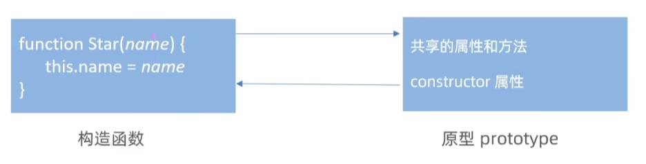

```javascript
// 定义构造函数
function Person(name, age) {
  this.name = name;
  this.age = age;
}

// 创建实例
const john = new Person("John", 30);

// 检查 constructor 属性
console.log(john.constructor); // 输出：[Function: Person]

// 手动验证
// 比如 john.constructor 告诉：「john 是用 Person 造出来的」
console.log(john.constructor === Person); // true
// Person.prototype 的 constructor 指向 Person 本身
console.log(Person.prototype.constructor === Person); // true
```

**constructor 不是原型对象才有的吗？为什么实例 john 也能访问 .constructor？**

**实例本身没有 constructor，它是从原型上「继承」来的！**

```plain
Person 构造函数
        ↓
Person.prototype（原型对象）
        ↓
john（实例对象）
```

**只有 `Person.prototype` 自己拥有 `constructor`**

**实例 john 自己没有 `constructor`**

```plain
console.log(john.hasOwnProperty('constructor')) // false
```

那为什么 `john.constructor` 能访问到？

因为 **JS 会沿着原型链向上找**：

1. 先看 `john` 自己有没有 `constructor` → **没有**
2. 自动去 `john.__proto__` 找 → 也就是 `Person.prototype`
3. `Person.prototype` 上 **真的有 constructor**
4. 所以 `john.constructor` === `Person.prototype.constructor`

---

```typescript
Person.prototype.constructor === Person   // true（原型上的constructor）

john.__proto__ === Person.prototype       // true（实例的__proto__指向原型）

john.constructor === Person               // true（继承来的）
```

---

**使用场景：**

如果有多个对象的方法，可以给原型对象采取对象形式赋值，但是这样就会**覆盖构造函数原型对象**原来的内容，这样修改后的原型对象 constructor 就**不再指向**当前构造函数了

此时以在修改后的原型对象中，**添加一个 constructor 指向原来的构造函数**

直接给 `Star.prototype` 赋值新对象时，新对象的 `constructor` 默认为 `Object`

添加 `constructor: Star` 可确保 `Star.prototype` 的 `constructor` 正确指向 `Star` 构造函数

避免后续通过原型创建实例时类型识别错误

```javascript
//采取对象形式赋值
function Star() {}
Star.prototype.sing = function () {
  console.log('唱歌')
}
Star.prototype.dance = function () {
  console.log('跳舞')
}
// 之前是给 Star.prototype 添加 sing 和 dance 方法,给原有对象追加 

// 下面赋值操作，直接赋值新对象会导致原型的 constructor 属性不再指向 Star
Star.prototype = {
  sing: function () {
    console.log('唱歌');
  },
  dance: function () {
    console.log('跳舞');
  },
  constructor: Star // 手动修复 constructor 指向，确保原型与构造函数的关联正确
  // 如果不加，指向 constructor ƒ Object() { [native code] }
};

const s1 = new Star();
console.log("prototype",s1.prototype); // undefined
console.log("prototype",Star.prototype); // Star {}
console.log("__proto__",s1.__proto__); // Star {}
console.log("constructor",s1.constructor); // Star
```

## __proto__原型链指针
为什么实例对象可以访问原型对象里面的属性和方法呢？

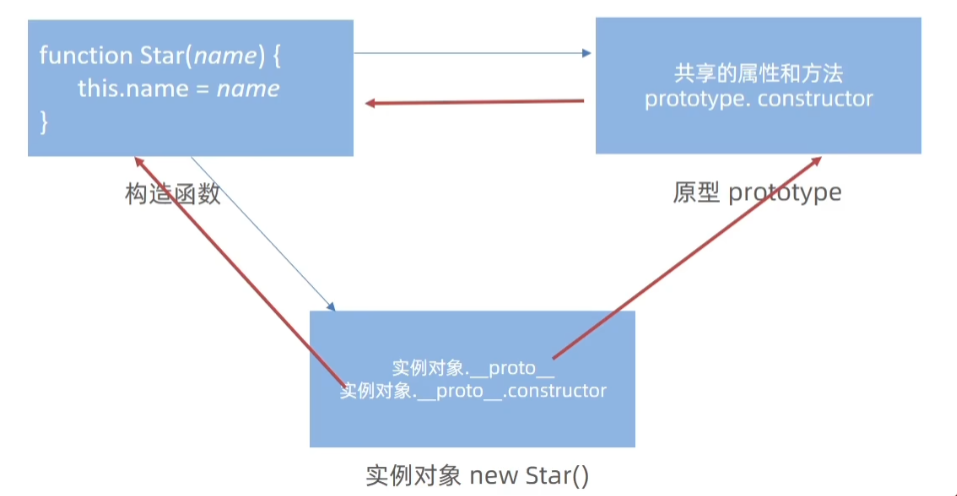

**对象（除了 `null`）都会有一个属性 `__proto__ `**

**实例的 `__proto__`指向构造函数的 prototype 原型对象**

之所以对象可以使用构造函数 `prototype` 原型对象的属性和方法

是因为对象有 `__proto__` 原型的存在

+ 当访问 `person1.sayHi` 时，JS 会先看 `person1` 自己有没有 `sayHi`
+ 如果没有，就通过 `__proto__` 找到`Person.prototype`，然后用里面的 `sayHi`

```javascript
function Person() {}  
const p = new Person();  
console.log(p.__proto__ === Person.prototype); // true
```

此时`p`（通过 `new Person()` 创建的实例）的 `__proto__` 指向构造函数 `Person` 的 `prototype`（原型对象）

这使得 `p` 可以访问 `Person.prototype` 上定义的属性和方法

原型对象的属性和方法，就是因为对象有 `__proto__` 原型的存在

+ `__proto__` 是 JavaScript 非标准属性，用于访问对象的原型
+ `[[prototype]]` 与 `__proto__` 意义相同，`[[prototype]]` 是对象内部原型关联的规范表示，`__proto__` 是其非标准的访问形式
+ `__proto__` 表明当前实例对象指向的原型对象（即构造函数的 `prototype`），借此实例可访问原型对象的属性和方法

**`__proto__`（原型对象）中包含 `constructor` 属性，该属性指向创建实例对象的构造函数，用于标识实例的构造来源**

```javascript
function Person() {}  
const p = new Person();  
console.log(Person.prototype.constructor === Person); // true  
console.log(p.__proto__ === Person.prototype); // true
// （`p.__proto__` 是 `Person.prototype`）
console.log(p.__proto__.constructor === Person);  //true
```

**原型链：当访问对象的属性或方法时，若自身没有则 JavaScript 会顺着 `__proto__` 到原型对象中查找**

```javascript
function Person() {}  
const p = new Person();  
Person.prototype.sayHi = function() {  
  console.log("Hi!");  
};  
p.sayHi(); 
// 输出 "Hi!"（`p` 自身没有 `sayHi`，但通过 `__proto__` 找到 `Person.prototype.sayHi`）
```

# 原型继承
继承是面向对象编程的另一个特征，通过继承进一步提升代码封装的程度

JavaScript 中大多是借助原型对象实现继承的特性。

原型继承是 JavaScript 中实现继承的一种机制，基于原型链，使对象能够继承另一个对象的属性和方法

## 核心原理
在 JavaScript 中，每个对象都有 `__proto__`（非标准属性，用于访问原型），指向其原型对象

当访问对象的属性或方法时，若对象自身没有，引擎会沿 `__proto__` 指向的原型对象查找，形成 “原型链”。原型继承正是利用这一特性，让子类通过原型链获取父类的属性和方法。

## 实现方式
原型继承是 JavaScript 继承机制的基础，理解它对掌握更复杂的继承模式（如组合继承、寄生组合继承）至关重要。尽管它有缺陷，但在学习和分析代码原型链关系时，仍是核心概念

```javascript

// 继续抽取   公共的部分放到原型上
// const Person1 = {
//   eyes: 2,
//   head: 1
// }
// const Person2 = {
//   eyes: 2,
//   head: 1
// }
// 构造函数  new 出来的对象 结构一样，但是对象不一样
function Person() {
  this.eyes = 2
  this.head = 1
}
// console.log(new Person)
// 女人  构造函数   继承  想要 继承 Person
function Woman() {
}
// Woman 通过原型来继承 Person
// 父构造函数（父类）   子构造函数（子类）
// 子类的原型 =  new 父类  
Woman.prototype = new Person()   // {eyes: 2, head: 1} 
// 指回原来的构造函数
Woman.prototype.constructor = Woman

// 给女人添加一个方法  生孩子
Woman.prototype.baby = function () {
  console.log('宝贝')
}
const red = new Woman()
console.log(red)
// console.log(Woman.prototype)
// 男人 构造函数  继承  想要 继承 Person
function Man() {

}
// 通过 原型继承 Person
Man.prototype = new Person()
Man.prototype.constructor = Man
const pink = new Man()
console.log(pink)

```

男人和女人都同时使用了同一个对象，根据引用类型的特点指向同一个对象，修改一个就会都影响

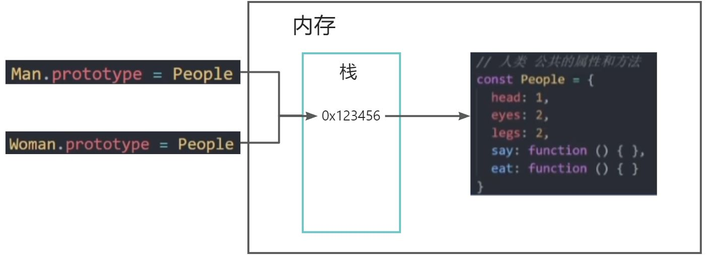

```javascript
// 父类构造函数  
function Father() {  
  this.fatherProperty = '父类属性';  
}  

Father.prototype.fatherMethod = function() {  
  console.log('父类方法');  
};  

// 子类构造函数  
function Son() {}  
// 关键：让 Son 的原型指向 Father 的实例  
Son.prototype = new Father();  

// 创建子类实例  
const son = new Son();  
console.log(son.fatherProperty); // 输出: 父类属性  
son.fatherMethod(); // 输出: 父类方法
```

此时，`son` 的 `__proto__` 指向 `Father` 的实例，通过原型链继承了 `Father` 的属性和方法

## 缺点
**引用类型属性共享问题**

+ 若父类原型中存在引用类型（如对象、数组），多个子类实例会共享该引用
+ 一个实例修改，其他实例也会受影响

```javascript
Father.prototype.sharedArray = [1, 2, 3];  
const son1 = new Son();  
const son2 = new Son();  
son1.sharedArray.push(4);  
console.log(son2.sharedArray); // 输出: [1, 2, 3, 4]（受 son1 修改影响）
```

**无法向父类构造函数传参**  

+ 上述实现中，`Son.prototype = new Father()` 直接调用 `Father` 构造函数，无法传递个性化参数，限制了父类初始化逻辑的灵活性

## 解决方法
原型继承的主要缺点是：引用类型属性被所有实例共享、创建子类实例时无法向父类构造函数传参

**寄生组合式继承**

这是一种高效的继承方式，结合原型链和构造函数的优点，仅调用一次父类构造函数，避免多余属性

```javascript
function Father() {  
    this.fatherProperty = '父类属性';  
}  
Father.prototype.fatherMethod = function() {  
    console.log('父类方法');  
};  

function Son() {  
    Father.call(this); // 借用构造函数，可传参并初始化自身属性  
    this.sonProperty = '子类属性';  
}  

// 优化原型链：创建一个以父类原型为原型的新对象，作为子类原型  
function createPrototype(obj) {  
    const prototype = Object.create(obj);  
    prototype.constructor = Son; // 恢复 constructor 指向  
    return prototype;  
}  
Son.prototype = createPrototype(Father.prototype);  

const son = new Son();  
console.log(son.fatherProperty); // 输出: 父类属性（继承父类）  
son.fatherMethod(); // 输出: 父类方法（继承原型方法）
```

此方式既实现了属性和方法的继承，又解决了引用类型共享问题，还能向父类传参

**使用 ES6 的 `class` 和 extends**

ES6 的 `class` 语法糖底层优化了继承逻辑，写法简洁且规避了原型继承的常见问题

```javascript
class Father {  
    constructor() {  
        this.fatherProperty = '父类属性';  
    }  
    fatherMethod() {  
        console.log('父类方法');  
    }  
}  

class Son extends Father {  
    constructor() {  
        super(); // 调用父类构造函数，可传参  
        this.sonProperty = '子类属性';  
    }  
}  

const son = new Son();  
console.log(son.fatherProperty); // 输出: 父类属性  
son.fatherMethod(); // 输出: 父类方法
```

通过 `extends`（继承）和 `super`（调用父类构造函数），清晰实现继承，代码更易读且安全

**利用 `Object.create()` 手动控制原型**

通过 `Object.create()` 创建新对象并指定原型，结合构造函数使用，增强可控性

```javascript
function Father() {  
    this.fatherProperty = '父类属性';  
}  
Father.prototype.fatherMethod = function() {  
    console.log('父类方法');  
};  

function Son() {  
    Father.call(this); // 传参并初始化属性  
    this.sonProperty = '子类属性';  
}  
Son.prototype = Object.create(Father.prototype, {  
    constructor: {  
        value: Son,  
        writable: true,  
        configurable: true  
    }  
});  

const son = new Son();
```

此方法确保子类原型正确，避免引用类型共享，同时支持向父类传参

总结

+ **寄生组合式继承**从原理上优化继承，适合深入理解底层逻辑时使用
+ **ES6 的 class** 语法简洁现代，推荐优先使用，尤其在新项目中
+ **Object.create()** 增加了原型控制的灵活性，可结合具体场景使用

## 其他继承方式（简要）
+ **构造函数继承**：通过 `call`/`apply` 在子类中调用父类构造函数，解决了引用类型共享问题，但无法继承父类原型方法。
+ **组合继承**：结合原型继承和构造函数继承，既让子类原型指向父类实例（继承原型方法），又在子类构造函数中调用父类构造函数（初始化自身属性），但会调用两次父类构造函数，存在性能冗余。

# 原型链
基于原型对象的继承使得不同构造函数的原型对象关联在一起，并且这种关联的关系是一种链状的结构

原型对象的链状结构关系称为原型链

## 查找规则
**当访问对象的属性或方法时，若对象自身没有，会顺着 `__proto__` 到原型对象中查找，形成 “原型链”**

```javascript
// function Objetc() {}
console.log(Object.prototype)
console.log(Object.prototype.__proto__)

function Person() {}
const ldh = new Person()
// console.log(ldh.__proto__ === Person.prototype)
// console.log(Person.prototype.__proto__ === Object.prototype)
console.log(ldh instanceof Person)
console.log(ldh instanceof Object)
console.log(ldh instanceof Array)
console.log([1, 2, 3] instanceof Array)
console.log(Array instanceof Object)
```

① 当访问一个对象的属性（包括方法）时，首先查找这个对象自身有没有该属性

② 如果没有就查找它的原型（也就是 __proto__指向的 prototype 原型对象）

③ 如果还没有就查找原型对象的原型（Object的原型对象）

④ 依此类推一直找到 Object 为止（null）

⑤ __proto__对象原型的意义就在于为对象成员查找机制提供一个方向，或者说一条路线

**⑥ 使用 instanceof 运算符用于检测构造函数的 prototype 属性是否出现在某个实例对象的原型链上原型链（Prototype Chain）** 是 JavaScript 实现继承和对象属性查找的核心机制

可以理解为对象之间通过 **原型（Prototype）** 连接形成的一条链条


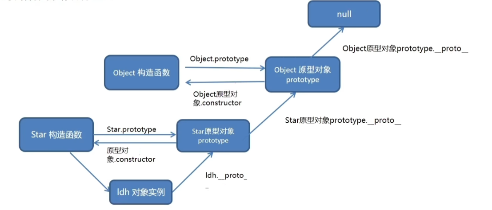

## 核心概念
每个对象都有一个「原型对象」**通过 `__proto__` 属性连接**：

每个对象（除了 `null`）都有一个隐藏属性 `__proto__`（读作 “双下划线 proto”）

指向该对象的 **原型对象**（Prototype Object）

```javascript
const obj = { name: "小明" };  
console.log(obj.__proto__); // 输出：Object.prototype（obj 的原型对象）
```

**原型对象也是一个对象**：

原型对象本身也有自己的 `__proto__`，指向更上层的原型，直到 `null`（原型链的终点）

```javascript
console.log(Object.prototype.__proto__); // 输出：null（原型链顶端）
```

**构造函数的 `prototype` 属性**

当用 `function` 声明一个 **构造函数** 时，构造函数自带一个 `prototype` 属性

它指向该构造函数的 **原型对象**

```javascript
function Person(name) {  
  this.name = name;  
}  
console.log(Person.prototype); // 输出：{ constructor: Person }
```

**构造函数创建的实例，其 `__proto__` 指向构造函数的 prototype**

```javascript
const tom = new Person("Tom");  
console.log(tom.__proto__ === Person.prototype); // 输出：true
```

## 工作原理：属性查找机制
当访问对象的 **属性或方法** 时，JavaScript 会按以下顺序查找：

1. **当前对象自身** 
2. **当前对象的原型对象（`__proto__`）** 
3. **原型对象的原型对象** → …… 
4. **直到 `null`（找不到则返回 `undefined`）**

举例：方法继承的本质

```javascript
// 构造函数  
function Animal(name) {  
  this.name = name;  
}  
// 在原型对象中添加方法  
Animal.prototype.speak = function() {  
  return "动物发出声音";  
};  

// 创建实例  
const dog = new Animal("小白");  
console.log(dog.speak()); // 输出："动物发出声音"
```

**查找过程**：

`dog` 自身没有 `speak` 方法 → 沿 `__proto__` 找到 `Animal.prototype` → 找到 `speak` 方法并调用

## 结构：从 Object 到 null
以 `new Person()` 创建的实例为例，原型链结构如下：

```plain
实例（dog）  
  __proto__ → Person.prototype  
    __proto__ → Object.prototype  
      __proto__ → null（原型链终点）
```

验证原型链

```javascript
const dog = new Animal("小白");  
console.log(dog.__proto__ === Animal.prototype); // true  
console.log(Animal.prototype.__proto__ === Object.prototype); // true  
console.log(Object.prototype.__proto__ === null); // true
```

## 应用：实现继承
+ **简单继承：通过原型链共享方法**

```javascript
// 父类（基类）  
function Animal(name) {  
  this.name = name;  
}  
Animal.prototype.speak = function() {  
  return "动物声音";  
};  

// 子类（派生类）  
function Dog(name, breed) {  
  Animal.call(this, name); // 继承属性  
  this.breed = breed; // 子类独有属性  
}  
// 关键：设置子类原型链指向父类原型对象  
Dog.prototype = new Animal(); // 继承方法  
Dog.prototype.constructor = Dog; // 修正构造函数指向  

// 创建子类实例  
const husky = new Dog("二哈", "哈士奇");  
console.log(husky.speak()); // 输出："动物声音"（来自父类原型）
```

**缺点**：原型链继承会共享引用类型属性（如数组），修改可能影响所有实例，需配合 **构造函数继承** 避免

+ **ES6 class 的底层原型链**

```javascript
class Animal {  
  constructor(name) { this.name = name; }  
  speak() { return "动物声音"; }  
}  
class Dog extends Animal {  
  constructor(name, breed) {  
    super(name); // 调用父类构造函数  
    this.breed = breed;  
  }  
}
```

**等价于 ES5 原型链继承**：

+ `Dog.prototype.__proto__ = Animal.prototype`
+ `Animal.prototype.__proto__ = Object.prototype`

## 常见问题与注意事项
**如何判断属性是否在当前对象上？**

+ **obj.hasOwnProperty(属性名)**：仅检查当前对象自身属性，不查原型链

```javascript
const dog = new Animal("小白");  
console.log(dog.hasOwnProperty("speak")); // 输出：false（speak 在原型上）
```

**原型链污染风险**

如果修改原型对象（如 `Object.prototype`），会影响所有继承它的对象，导致意外行为：

```javascript
Object.prototype.foo = "污染";  
const obj1 = {};  
const obj2 = { bar: "test" };  
console.log(obj1.foo); // 输出："污染"（来自原型链）  
console.log(obj2.foo); // 同样输出："污染"
```

**避免方法**：永远不要修改原生对象的原型（如 `Array.prototype`、`Object.prototype`）

**原型链的性能**

属性查找需要遍历链条，若链条过长（如多层继承），可能影响性能。但现代引擎已高度优化，日常开发中无需过度担心。

## 总结
**原型链是对象的「家谱」**：每个对象出生时都带着一张族谱（`__proto__`），当它需要某个技能（属性 / 方法）时，会先问自己 “我会吗？”，不会就问父母（原型对象），父母不会就问祖父母，直到找到或确认自己真的不会（`null`）

通过原型链，JavaScript 实现了轻量级的继承机制，这也是它被称为 “基于原型的语言”（Prototype-Based Language）的原因。理解原型链，就能真正搞懂 JavaScript 对象的本质！

# 深浅拷贝（Copy）
首先浅拷贝和深拷贝**只针对引用类型**

### 浅拷贝 **（Shallow Copy）**
“Shallow Copy” 常见的意思是 “浅拷贝”。在计算机编程领域，浅拷贝是一种对象复制方式。它创建一个新的对象，这个新对象会包含原对象元素的引用（对于可变对象，如列表、字典等），而非元素的副本。也就是说，新对象和原对象会共享部分数据结构。

**定义**：只复制**对象**的**第一层属性**

+ **属性**为**基本类型**：复制值（如 `age: 18`）
+ **属性**为**引用类型**（如对象、数组），拷贝的是**内存地址**（源对象和拷贝对象共享数据）

**常见方法：**

- **拷贝对象：Object.assign(target, source)**
- **展开运算符 `{ ...obj }`拷贝对象**
- **拷贝数组：`Array.prototype.slice()` 或 `[...arr]`**

“assign” 常见意思为 “分配；指派；指定”

“Object.assign (target, source)” 是 JavaScript 中的一个方法

它的作用是将源对象（source）的所有可枚举自有属性复制到目标对象（target）

“Array.prototype.slice ()”slice” 指的是 JavaScript 中数组对象的一个方法。该方法用于从数组中提取一部分元素，并返回一个新的数组，而不会改变原始数组

例如，假设有数组 `const arr = [1, 2, 3, 4, 5];`，使用 `arr.slice(1, 3)`，就会从索引 1（包含）到索引 3（不包含）提取元素，返回 `[2, 3]`。 它可以接受两个参数，第一个参数指定开始提取的索引位置，第二个参数（可选）指定结束提取的索引位置（不包含该位置的元素）。如果省略第二个参数，会一直提取到数组末尾

**slice() 方法的工作原理**：  

`slice()` 方法用于提取数组的一部分，并返回一个新的数组。

对数组进行拷贝时，会创建一个新的数组并将原数组的元素依次复制到新数组中

对于数组中的基本数据类型元素`slice()` 会直接复制这些值到新数组中

如果**原数组中包含引用类型（如对象或数组）的元素**，情况就会有所不同

**示例**：

```javascript
// 实现方式
// 1.Object.assign()
let objassign = {
  name: "ww",
  age: 18,
  hobby: ["唱", "跳"],
};
let newobjassign = Object.assign({}, objassign);
newobjassign.name = "ss";
console.log(objassign); //{name: "ww", age: 18}
// objassign 基本类型的值不受newobjassign的影响

newobjassign.hobby[0] = "rap";
console.log(objassign); //{name: "ww", age: 18, hobby: Array(2)}
// objassign 引用类型的值受newobjassign的影响
// 2.展开语法 ...
let objspread = {
  name: "ww",
  age: 18,
  hobby: ["唱", "跳"],
};
let newobjspread = { ...objspread };
// 3.数组的slice()
let arr = [1, 2, 3];
let newarr = arr.slice();
newarr[0] = 4;
console.log(arr); //[1, 2, 3] arr 的值不受newarr的影响
//数组中的引用类型
let arr = [[1, 2], 3];
let newarr = arr.slice();
newarr[0][0] = 4;
console.log(arr); // [[4, 2], 3]
```

**适用场景**：**仅复制基本类型属性**，或**无需完全隔离引用类型**的场景

浅拷贝对**基本类型属性独立，** 对**引用类型属性共享内存直接赋值和浅拷贝区别**

+ 直接赋值的方法，只要是对象，都会相互影响，因为是直接拷贝对象栈里面的地址
+ 浅拷贝如果是**一层对象**，不相互影响，如果出现多层对象拷贝还会相互影响

### 深拷贝 **（Deep Copy）**
“Deep Copy” 指深拷贝。在编程领域，尤其是涉及数据结构和对象操作时，深拷贝是一种创建对象副本的方式。它会递归地复制对象及其包含的所有嵌套对象，即不仅复制对象本身，还复制对象内部引用的其他对象，从而生成一个与原对象完全独立的副本。修改副本不会影响原对象，反之亦然

**深拷贝：** 拷贝的是**对象**，不是地址

**定义**：递归复制对象的**所有层级属性**，确保拷贝后的对象与原对象**完全独立**

**常见方法：**

1. **通过递归实现深拷贝**
2. lodash/cloneDeep
3. **通过 `JSON.parse(JSON.stringify(obj))`（局限性：无法复制函数、`Symbol`、`Date` 等）**

`JSON.stringify”`的作用是将 JavaScript 对象或值转换为 JSON 格式的**字符串**。可以把复杂的数据结构，如对象、数组等，转化为一种便于在网络传输、存储等场景下使用的字符串形式

`JSON.parse`用于将 JSON 格式的**字符串**转换为**JavaScript 对象**

JSON（JavaScript Object Notation）是一种轻量级的数据交换格式，常用于前后端数据传输

**递归实现深拷贝** 

通过递归逐层复制，确保所有嵌套的数组和对象都被完全复制，形成独立的内存结构

**函数递归：**

+ 如果一个函数在内部可以调用其本身，那么这个函数就是递归函数
+ 递归函数的作用和循环效果类似
+ 由于递归很容易发生“栈溢出”错误（stack overflow），所以必须要加退出条件 return

```javascript
let num = 1
// fn就是递归函数
function fn() {
  console.log('我要打印6次')
  if (num >= 6) {
    return
  }
  num++
  fn() // 函数内部调用函数自己
}
fn()
```

代码中的 `debugger` 语句会在浏览器调试工具中暂停执行，方便你观察每一步的复制过程

核心思路

+ **逐层遍历**：遍历原对象的所有属性，区分 “基础类型” 和 “引用类型”；
+ **类型判断**：基础类型直接赋值，引用类型（数组 / 对象）创建新容器后递归处理；
+ **终止条件**：遇到基础类型（ `number`、`string`、`boolean`、`null`、`undefined`）停止递归

递归实现深拷贝的核心思路是**逐层复制 + 类型判断**

1. **遇到基础类型（如数字、字符串）**：直接返回值，无需复制
2. **遇到引用类型（如对象、数组）**：

+ 创建一个新的空对象 / 数组
+ 遍历原对象的每个属性 / 元素，递归调用深拷贝函数处理
+ 将处理后的结果赋值给新对象的对应位置

3. **特殊情况处理**：

+ 循环引用（A 引用 B，B 又引用 A）：用一个 Map 记录已处理的对象，避免无限递归
+ 特殊对象（如 Date、RegExp）：单独处理，例如 new Date (date.getTime ()) 复制日期

4. **关键点**

+ **递归终止条件**：遇到基础类型时停止递归
+ **循环引用处理**：通过 Map 记录已处理对象，避免死循环
+ **类型区分**：区分数组和普通对象，创建对应容器
+ RegExp” 是 “Regular Expression” 的缩写，中文通常译为 “正则表达式”。它是一种强大的文本模式匹配工具，用于在文本中搜索、匹配、替换符合特定模式的字符串。

```javascript
let oldObjDeep = {
  name: "oldname",
  age: 18,
  hobby: ["唱", "跳"],
  info: {
    address: "北京",
    phone: "123456789",
  },
};
function deepCopy(newObj, oldObj) {
  //遍历所有属性
  for (let key in oldObj) {
    // key 为属性名 ，oldObj[key]为属性值
    // 利用 instanceof判断属性值的类型
    // 1.判断属性值是数组
    if (oldObj[key] instanceof Array) {
      newObj[key] = [];// 创建一个空数组
      // 递归调用深拷贝方法
      deepCopy(newObj[key], oldObj[key]);
      //此时递归遍历数组，将数组元素再次赋值
    // 2.判断属性值是对象
    } else if (oldObj[key] instanceof Object) {
      newObj[key] = {};// 创建一个空对象
      // 递归调用深拷贝方法
      deepCopy(newObj[key], oldObj[key]);
      //此时递归遍历对象，将对象属性再次赋值
    } else {
      // 3.基本数据类型直接赋值
      newObj[key] = oldObj[key];
    }
  }
}
deepCopy(newobjDeep, oldObjDeep);
console.log(newobjDeep);
newobjDeep.name = "newName";
newobjDeep.age = 22;
newobjDeep.info.address = "newCity";
console.log(newobjDeep); // newName 22 newCity
console.log(oldObjDeep); // oldName 18 oldCity
console.log(newobjDeep === oldObjDeep); // false
//递归逻辑
//数组处理：当遇到数组时，先为新对象创建空数组，再递归调用 deepCopy 处理数组的每个元素。
//对象处理：当遇到对象时，先为新对象创建空对象，再递归处理对象的每个属性。
//基本类型：直接复制值，无需递归
```

" instanceof” 是一种在 Java、JavaScript 等编程语言中用于**判断某个对象是否属于特定类或类型的运算符**

**lodash里面cloneDeep内部实现了深拷贝**

```html
<!-- 先引用 -->
<script src="./lodash.min.js"></script>
<script>
  const obj = {
    uname: 'pink',
    age: 18,
    hobby: ['乒乓球', '足球'],
    family: {
      baby: '小pink'
    }
  }
  const o = _.cloneDeep(obj)
  console.log(o)
  o.family.baby = '老pink'
  console.log(obj)
</script>
```

**JSON.parse(JSON.stringify(obj))`（局限性：无法复制函数、`Symbol`、`Date 等）**

```javascript
// JSON.stringify() 方法将 JavaScript 对象转换为 JSON 字符串
// JSON.parse() 方法将 JSON 字符串转换为 JavaScript对像
let newobjDeep = JSON.parse(JSON.stringify(objDeep));
newobjDeep.hobby[0] = "rap";
console.log(objDeep); //hobby ['唱', '跳']
// objDeep 的值不受newobjDeep的影响
```

# 异常处理
了解 JavaScript 中程序异常处理的方法，提升代码运行的健壮性

## throw
异常处理指**预估代码执行过程中可能发生的错误**，最大程度的避免错误的发生导致整个程序无法继续运行

throw 抛出异常信息，程序也会终止执行

throw 后面跟的是错误提示信息

**Error 对象**配合 throw 使用，能够设置更详细的错误信息

```javascript
function counter(x, y) {

  if(!x || !y) {
    // throw '参数不能为空!';
    throw new Error('参数不能为空!')
  }

  return x + y
}

counter()
```

## try ... catch
`try...catch` 用于捕获错误信息，注意 try/catch 是**同步**的，无法捕获例如 Promise 的错误  

通过 `try/catch` 捕获错误信息（浏览器提供的错误信息）`try` 试试 `catch` 拦住 `finally` 最后

将预估可能发生错误的代码写在 `try` 代码段中

如果 `try` 代码段中出现错误后，会执行 `catch` 代码段，并截获到错误信息

```javascript
 function foo() {
  try {
    //可能容易发送错误的地方
    // 查找 DOM 节点
    const p = document.querySelector('.p')
    p.style.color = 'red'
  } catch (error) {
    // try 代码段中执行有错误时，会执行 catch 代码段
    // 查看错误信息，但不中断程序
    console.log(error.message)
    // 终止代码继续执行
    return
  }
  finally {
    //不论程序是否有错，finally这里一定会执行
    alert('执行')
  }
  console.log('如果出现错误，我的语句不会执行')
  }
  foo()
```

## debugger
相当于断点调试

1. 本质：JavaScript 内置调试关键字 / 语句，用于手动触发代码断点
2. 作用：浏览器 / 开发工具打开开发者控制台 (调试面板) 时，代码执行到 `debugger` 会暂停，可逐行调试、查看变量、调用栈
3. 使用条件：仅在开启调试工具时生效；工具未打开，该行会被忽略
4. 用法：直接写在代码中

```javascript
let a = 1;
debugger; // 代码在此暂停
a = 2;
```

5. 场景：本地开发调试，线上环境建议移除，避免暴露逻辑

# 处理this
`this` 是 JavaScript 最具魅惑的知识点，不同的应用场合 `this` 的取值可能会有意想不到的结果

在此对【 `this` 默认的取值】情况进行归纳和总结

## 普通函数
**普通函数**的调用方式决定了 `this` 的值，即【**谁调用 `this` 的值指向谁**】，如下代码所示：

```html
<button>点击</button>
<script>
  // 普通函数
  function sayHi() {
    console.log(this)  
  }
  // 函数表达式
  const sayHello = function () {
    console.log(this)
  }
  // 函数的调用方式决定了 this 的值
  sayHi() // window
  window.sayHi()
    

// 普通对象
  const user = {
    name: '小明',
    walk: function () {
      console.log(this)
    }
  }
  // 动态为 user 添加方法
  user.sayHi = sayHi
  uesr.sayHello = sayHello
  // 函数调用方式，决定了 this 的值
  user.sayHi()
  user.sayHello()
  document
</script>

```

普通函数没有明确调用者时 `this` 值为 `window`，**严格模式**没有调用者时 `this` 值为 `undefined`

## 箭头函数
**箭头函数**中的 `this` 与普通函数完全不同，也不受调用方式的影响

**箭头函数中并不存在 `this` ！**

箭头函数中访问的 `this` 不过是**箭头函数所在作用域的 `this` 变量**

```html
<script>
    
  console.log(this) // 此处为 window
  // 箭头函数
  const sayHi = function() {
    console.log(this) // 该箭头函数中的 this 为函数声明环境中 this 一致
  }
  // 普通对象
  const user = {
    name: '小明',
    // 该箭头函数中的 this 为函数声明环境中 this 一致
    walk: () => {
      console.log(this)  //对象没有作用域this，指向最外层Windows
    },
    
    sleep: function () {
      let str = 'hello'
      console.log(this)
      let fn = () => {
        console.log(str)
        console.log(this) // 该箭头函数中的 this 与 sleep 中的 this 一致即user对象本身
      }
      // 调用箭头函数
      fn();
    }
  }

  // 动态添加方法
  user.sayHi = sayHi
  
  // 函数调用
  user.sayHi()
  user.sleep()
  user.walk()
</script>

```

在开发中【使用箭头函数前需要考虑函数中 `this` 的值】，**事件回调函数**使用箭头函数时，`this` 为全局的 `window`，因此DOM事件回调函数不推荐使用箭头函数，如下代码所示：

```html
<script>
  // DOM 节点
  const btn = document.querySelector('.btn')
  // 箭头函数 此时 this 指向了 window
  btn.addEventListener('click', () => {
    console.log(this)
  })
  // 普通函数 此时 this 指向了 DOM 对象
  btn.addEventListener('click', function () {
    console.log(this)
  })
</script>

```

同样由于箭头函数 `this` 的原因，**基于原型的面向对象也不推荐采用箭头函数**，如下代码所示：

```html
<script>
  function Person() {
  }
  // 原型对像上添加了箭头函数
  Person.prototype.walk = () => {
    console.log('人都要走路...')
    console.log(this); // window
  }
  const p1 = new Person()
  p1.walk()
</script>

```

## 改变this指向
以上归纳了普通函数和箭头函数中关于 `this` 默认值的情形，不仅如此 JavaScript 中还允许指定函数中 `this` 的指向，有 3 个方法可以动态指定普通函数中 `this` 的指向：

### call 
使用 `call` 方法**调用函数**，同时**指定函数中 `this` 的值**，使用方法如下代码所示：

1. `call` 方法能够在调用函数的同时指定 `this` 的值
2. `call` 方法调用函数时，第1个参数为 `this` 指定的值
3. `call` 方法的其余参数会依次自动传入函数做为函数的参数

```html
<script>
  // 普通函数
  function sayHi() {
    console.log(this);
  }

  let user = {
    name: '小明',
    age: 18
  }

  let student = {
    name: '小红',
    age: 16
  }

  // 调用函数并指定 this 的值
  sayHi.call(user); // this 值为 user
  sayHi.call(student); // this 值为 student

  // 求和函数
  function counter(x, y) {
    return x + y;
  }

  // 调用 counter 函数，并传入参数
  let result = counter.call(null, 5, 10);
  console.log(result);
</script>

```

### apply 
“apply” 常见词性为动词，基本含义为 “应用；运用”，强调将某种方法、理论、规则等用于特定的情境或对象

使用 `apply` 方法**调用函数**，同时指定函数中 `this` 的值，使用方法如下代码所示：

1. `apply` 方法能够在调用函数的同时指定 `this` 的值
2. `apply` 方法调用函数时，第1个参数为 `this` 指定的值
3. `apply` 方法**第2个参数为数组**，数组的**单元值**依次自动传入函数做为函数的**参数**

```html
<script>
  // 普通函数
  function sayHi() {
    console.log(this)  //Window
  }

  let user = {
    name: '小明',
    age: 18
  }

  let student = {
    name: '小红',
    age: 16
  }

  // 调用函数并指定 this 的值
  sayHi.apply(user) // this 值为 user
  sayHi.apply(student) // this 值为 student

  // 求和函数
  function counter(x, y) {
    return x + y
  }
  // 调用 counter 函数，并传入参数
  let result = counter.apply(null, [5, 10])
  console.log(result)
  //使用场景：求数组最大值
  // const max = Math.max(1, 2, 3)
  // console.log(max)
  const arr = [11,12,15,85]
  const max = Math.max.apply(Math, arr)
  console.log(max)
</script>

```

### bind 重点
“bind” 常见的词性为动词，基本含义为 “捆绑；系；约束；使结合；使黏合” 等

`bind` 方法并**不会调用函数**，而是创建一个**指定了 `this` 值的新函数**，使用方法如下代码所示：

```html
<button>发送验证码</button>
<script>
  // 普通函数
  function sayHi() {
    console.log(this)
  }
  let user = {
    name: '小明',
    age: 18
  }
  // 调用 bind 指定 this 的值，并创建一个新函数，但不调用
  let sayHello = sayHi.bind(user);
  // 调用使用 bind 创建的新函数
  sayHello()
  //需求：点击按钮后禁用，60S之后重新可以点击
  const btn = document.querySelector('button')
  btn.addEventListener('click',function () {
    //禁用按钮
    this.disabled = true
    Winodw.SetTimeout(function(){
      this.disabled = false   //this指向了Window，改用箭头函数
    },600000)
    //或者改用bind
    Winodw.SetTimeout(function(){
      this.disabled = false   //修改this指向，且不立刻调用，60S后调用
    }.bind(this),600000)
  }
</script>

```

注：`bind` 方法创建新的函数，与原函数的唯一的变化是改变了 `this` 的值

# 防抖节流
## 防抖（debounce）
防抖: 单位时间内，**频繁触发事件，只执行最后一次**

“debounce” 常见意思为 “防抖”，在编程领域，它是一种优化技术。比如在前端开发中，当用户频繁触发某个事件（如滚动窗口、输入框输入）时，若不进行处理，可能会导致大量不必要的 1 计算或请求。通过防抖技术，设置一个时间间隔，在该时间间隔内，如果事件再次被触发，就重新开始计时，只有当间隔时间内没有再次触发事件，才执行相应的操作。例如，搜索框输入时，用户不断输入字符，若每次输入都立即发起搜索请求，会造成服务器压力，使用防抖后，用户停止输入一段时间（如 500 毫秒）后，才会真正发起搜索请求，提高了性能和用户体验

举个栗子：电梯关门，只要有人进就会打断（重置关门逻辑），直到最后一个人进入停留三秒才会真的关门

使用场景：

+ 搜索框搜索输入，只需用户最后一次输入完，再发送请求
+ 手机号、邮箱验证输入检测

**lodash库**

```html
<!DOCTYPE html>
<html lang="en">

<head>
  <meta charset="UTF-8">
  <meta http-equiv="X-UA-Compatible" content="IE=edge">
  <meta name="viewport" content="width=device-width, initial-scale=1.0">
  <title>利用防抖实现性能优化</title>
  <style>
    .box {
      width: 500px;
      height: 500px;
      background-color: #ccc;
      color: #fff;
      text-align: center;
      font-size: 100px;
    }
  </style>
</head>
<body>
  <div class="box"></div>
  <script src="./js/lodash.min.js"></script>
  <script>
    // 利用防抖实现性能优化
    //需求： 鼠标在盒子上移动，里面的数字就会变化 + 1
    const box = document.querySelector('.box')
    let i = 1
    function mouseMove() {
      box.innerHTML = i++
      // 如果里面存在大量消耗性能的代码，比如dom操作，比如数据处理，可能造成卡顿
    }
    // 添加事件
    // box.addEventListener('mousemove', mouseMove)

    // 利用lodash库实现防抖 - 500毫秒之后采取+1
    // 语法: _.debounce(fun, 时间)
    box.addEventListener('mousemove', _.debounce(mouseMove, 500))
  </script>
</body>
</html>

```

**手写防抖函数**

核心思路：

**防抖的核心就是利用定时器 (setTimeout) 来实现**

①：声明一个定时器变量 

②:  当鼠标每次滑动都先判断是否有定时器了，如果**有定时器**先**清除以前的**定时器

③：如果**没有定时器则开启定时器**，记得存到变量里面

④：在定时器里面调用要执行的函数

```html
<!DOCTYPE html>
<html lang="en">

<head>
  <meta charset="UTF-8">
  <meta http-equiv="X-UA-Compatible" content="IE=edge">
  <meta name="viewport" content="width=device-width, initial-scale=1.0">
  <title>防抖函数实现</title>
  <style>
    .box {
      width: 500px;
      height: 500px;
      background-color: #ccc;
      color: #fff;
      text-align: center;
      font-size: 100px;
    }
  </style>
</head>
<body>
  <div class="box"></div>
  <script src="./js/lodash.min.js"></script>
  <script>
    // 利用防抖实现性能优化
    //需求： 鼠标在盒子上移动，里面的数字就会变化 + 1
    const box = document.querySelector('.box')
    let i = 1
    function mouseMove() {
      box.innerHTML = i++
      // 如果里面存在大量消耗性能的代码，比如dom操作，比如数据处理，可能造成卡顿
    }
    // box.addEventListener('mousemove', _.debounce(mouseMove, 500))

    // 手写防抖函数
    // 核心是利用 setTimeout定时器来实现
    // 1. 声明定时器变量
    // 2. 每次鼠标移动（事件触发）的时候都要先判断是否有定时器，如果有先清除以前的定时器
    // 3. 如果没有定时器，则开启定时器，存入到定时器变量里面
    // 4. 定时器里面写函数调用
    function debounce(fn, t) {
      let timer
      // return 返回一个匿名函数
      return function () {
        if (timer) clearTimeout(timer)
        timer = setTimeout(function () {
          fn()  // 加小括号调用 fn函数
        }, t)
      }
    }
    box.addEventListener('mousemove', debounce(mouseMove, 500))

    //  debounce(mouseMove, 500)  // 调用函数
    // debounce(mouseMove, 500)  = function () { 2.3.4}
  </script>
</body>
</html>

```

## 节流（throttle）
“throttle” 常见意思为 “节流”。在计算机编程领域，常指一种限制函数执行频率的技术，比如规定某个函数在一定时间间隔内只能执行一次，避免因频繁调用造成资源浪费或程序异常。例如，页面滚动事件可能会被设置节流，防止用户滚动时大量重复触发处理函数

核心思想：**固定频率执行**，强制函数在**一定时间内只执行一次**，即使在这段时间内事件被多次触发

举个栗子：

+ 技能冷却，期间无法继续释放技能
+ 换子弹期间不能射击

使用场景：

+ 高频事件：鼠标移动 mousemove、页面尺寸缩放 resize、滚动条等等限制事件的处理频率
+ 按钮点击：限制用户点击按钮的响应频率（如点赞、提交表单）
+ 游戏中的角色移动：控制角色移动的更新频率

lodash库

```html
<!DOCTYPE html>
<html lang="en">

<head>
  <meta charset="UTF-8">
  <meta http-equiv="X-UA-Compatible" content="IE=edge">
  <meta name="viewport" content="width=device-width, initial-scale=1.0">
  <title>利用防抖实现性能优化</title>
  <style>
    .box {
      width: 500px;
      height: 500px;
      background-color: #ccc;
      color: #fff;
      text-align: center;
      font-size: 100px;
    }
  </style>
</head>
<body>
  <div class="box"></div>
  <script src="./js/lodash.min.js"></script>
  <script>
    // 利用节流实现性能优化
    //需求： 鼠标在盒子上移动，里面的数字就会变化 + 1
    const box = document.querySelector('.box')
    let i = 1
    function mouseMove() {
      box.innerHTML = i++
      // 如果里面存在大量消耗性能的代码，比如dom操作，比如数据处理，可能造成卡顿
    }
    // box.addEventListener('mousemove', mouseMove)

    // 利用lodash库实现节流 - 500毫秒之后采取+1
    // 语法: _.throttle(fun, 时间)
    box.addEventListener('mousemove', _.throttle(mouseMove, 3000))

  </script>
</body>
</html>

```

**手写节流函数节流的核心就是利用定时器(setTimeout）来实现**

1.声明一个定时器变量

2.当鼠标每次滑动都先判断是否有定时器了，如果**有定时器**则**不开启**新定时器

3.如果没有定时器则开启定时器，记得存到变量里面

3.1定时器里面调用执行的函数

3.2定时器里面要把定时器清空

```html
<!DOCTYPE html>
<html lang="en">

<head>
  <meta charset="UTF-8">
  <meta http-equiv="X-UA-Compatible" content="IE=edge">
  <meta name="viewport" content="width=device-width, initial-scale=1.0">
  <title>利用节流实现性能优化</title>
  <style>
    .box {
      width: 500px;
      height: 500px;
      background-color: #ccc;
      color: #fff;
      text-align: center;
      font-size: 100px;
    }
  </style>
</head>
<body>
  <div class="box"></div>
  <script src="./js/lodash.min.js"></script>
  <script>
    // 利用节流实现性能优化
    //需求： 鼠标在盒子上移动，里面的数字就会变化 + 1
    const box = document.querySelector('.box')
    let i = 1
    function mouseMove() {
      box.innerHTML = i++
      // 如果里面存在大量消耗性能的代码，比如dom操作，比如数据处理，可能造成卡顿
    }
    // box.addEventListener('mousemove', mouseMove)

    // 利用lodash库实现节流 -
    // 语法: _.throttle(fun, 时间)
    // box.addEventListener('mousemove', _.throttle(mouseMove, 3000))

    // 手写一个节流函数- 每隔 500ms + 1

    // 节流的核心就是利用定时器(setTimeout) 来实现
    // 1.声明一个定时器变量
    // 2.当鼠标每次滑动都先判断是否有定时器了，如果有定时器则不开启新定时器
    // 3.如果没有定时器则开启定时器，记得存到变量里面
    // 3.1定时器里面调用执行的函数
    // 3.2定时器里面要把定时器清空
    function throttle(fn, t) {
      let timer = null
      return function () {
        if (!timer) {
          timer = setTimeout(function () {
            fn()
            // 清空定时器
            timer = null
          }, t)
        }
      }
    }

    box.addEventListener('mousemove', throttle(mouseMove, 3000))

  </script>
</body>
</html>

```

| 性能优化 | 说明 | 使用场景 |
| --- | --- | --- |
| 防抖 | 单位时间内频繁触发事件，只执行最后一次 | 搜索框输入、手机号、邮箱验证输入检测 |
| 节流 | 单位时间内频繁触发事件，只执行一次 | 高频事件:鼠标移动 mousemove、页面尺寸缩放 resize、滚动条滚动scroll 等等 |

节流和防抖的区别

节流: 

+ 就是指连续触发事件但是在 n 秒中只执行一次函数
+ 比如 可以利用节流实现 1s之内 只能触发一次鼠标移动事件 

防抖：

+ 如果在 n 秒内又触发了事件，则会重新计算函数执行时间

 节流和防抖的使用场景是

节流: 鼠标移动，页面尺寸发生变化，滚动条滚动等开销比较 大的情况下

防抖: 搜索框输入，设定每次输入完毕n秒后发送请求，如果期间还有输入，则从新计算时间

## 案例
通过监听视频的 `ontimeupdate` 和 `onloadeddata` 事件来记录并恢复视频播放位置

**ontimeupdate 事件**：

+ 在视频播放位置变化时触发，用于实时捕捉当前播放时间并保存（如存入 `localStorage`）

**onloadeddata 事件**：

+ 在当前帧数据加载完成但下一帧数据不足时触发，用于在页面加载时，从存储（如 `localStorage`）中读取上次保存的播放时间，并设置给视频的 `currentTime` 属性，实现从上次位置继续播放

“current” 表示 “当前的”

```html
<video id="myVideo" controls>  
  <source src="video.mp4" type="video/mp4">  
</video> 
<script src = 'lodash.js'>
<script>  
  const video = document.getElementById('myVideo');  
  // 加载时读取并设置播放位置  
  video.onloadeddata = function() {  
    const savedTime = localStorage.getItem('videoTime');  
    if (savedTime) {  
      video.currentTime = parseFloat(savedTime);  
    }  
  };  
  // 播放时保存位置  
  video.ontimeupdate = _.throttle(function() {  
    localStorage.setItem('videoTime', video.currentTime);  
  },1000);  
</script>
```

通过上述代码，`ontimeupdate` 实时保存播放进度，`onloadeddata` 在页面加载时恢复进度，从而实现记录并延续上一次视频播放位置的功能

# JS 执行机制
JavaScript 的执行机制是其核心特性之一，理解它能帮你搞懂代码的执行顺序

比如为什么`setTimeout`的延迟时间不准，为什么`Promise`比`setTimeout`先执行

这一切都围绕三个核心概念：**单线程**、**同步 / 异步任务**、**事件循环（Event Loop）**

## 单线程
JavaScript 从诞生起就是**单线程**—— 同一时间只能做一件事

为什么设计成单线程？

因为 JavaScript 主要用途是操作 DOM（比如增删改页面元素）

如果是多线程，两个线程同时操作同一个 DOM（一个删、一个改），浏览器就不知道该听谁的了

单线程的好处是简单、避免 DOM 冲突；

但问题也很明显：如果前一个任务耗时很长（比如加载一个大文件），后面的任务就会被 "卡住"（页面卡顿、无响应）

## 同步和异步
为了避免单线程的阻塞问题，JavaScript 将任务分成了两类：

**同步任务（Synchronous）**

定义：**立即执行**的任务，前一个任务完成后才能执行后一个

例子：console.log、变量赋值、普通函数调用等

执行位置：主线程的 "**调用栈**"（Call Stack）

**异步任务（Asynchronous）**

定义：**不立即执行**的任务，会暂时离开主线程，等条件成熟后再执行（不会阻塞后续同步任务）

例子：

+ 定时器（setTimeout、setInterval）
+ 网络请求（fetch、axios）
+ 事件回调（click、load）
+ Promise 的.then/.catch/.finally

## 事件循环
JavaScript 的事件循环（Event Loop）是其**并发**模型的核心：

作为**单线程**运行时的调度机制，负责**依次执行同步代码、调度异步任务（如事件回调、定时器、异步 IO 等）** 

通过循环从任务队列中提取任务执行，实现非阻塞的并发能力，这与 C、Java 等多线程并发模型截然不同

```javascript
console.log(1)
setTimeout(() => {
  console.log(2)
}, 2000)
console.log(3)
//结果为：1 3 2   js不会选择原地等待2秒
-------------------------
console.log(1)
setTimeout(() => {
  console.log(2)
}, 0)
console.log(3)
//结果为：1 3 2
-------------------------
```

**作用：** 事件循环负责执行代码，收集和处理事件以及执行队列中的子任务

JavaScript 单线程（某一刻只能执行一行代码）

为了让耗时代码**不阻塞其他代码**运行，设计了事件循环模型

**概念：执行代码和收集异步任务的模型，在调用栈空闲，反复调用任务队列里回调函数的执行机制**

```javascript
console.log(1)  
setTimeout(() => {
  console.log(2)
}, 0)
console.log(3)
setTimeout(() => {
  console.log(4)
}, 2000)
console.log(5)
```

执行流程：

**同步代码优先执行**：`console.log(1)`、`console.log(3)`、`console.log(5)` 依次执行，输出 `1 3 5`

**异步任务（`setTimeout`）入队**：

+ 第一个 `setTimeout`（延迟 `0ms`）的回调 `console.log(2)` 先进入任务队列
+ 第二个 `setTimeout`（延迟 `2000ms`）的回调 `console.log(4)` 后入队（但延迟更久，最后执行）

**事件循环调度**：同步代码执行完后，事件循环从任务队列取出第一个异步任务（`console.log(2)`）执行，输出 `2`；待延迟结束后，执行第二个异步任务，输出 `4`

最终输出：`1 3 5 2 4`

核心逻辑：

+ **同步代码立即执行**
+ **异步任务（如 `setTimeout`）先入任务队列，待同步完成后按顺序（及延迟）执行**


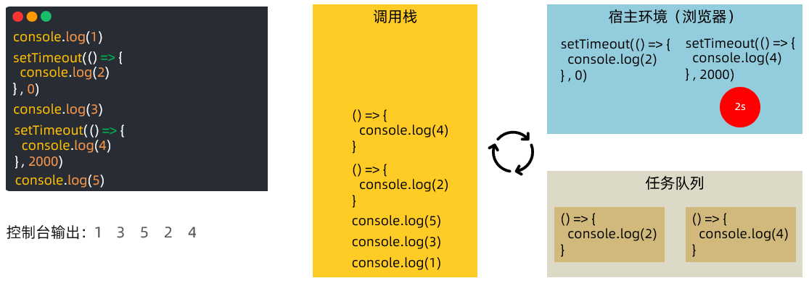

## 宏任务与微任务 ES6
ES6 之后引入了 Promise 对象， 让 JS 引擎也可以发起异步任务

异步任务划分为了

+ **宏任务：** 由 **浏览器环境**执行的**异步**代码
+ **微任务：** 由 **JS 引擎环境**执行的**异步**代码

宏任务和微任务具体划分：


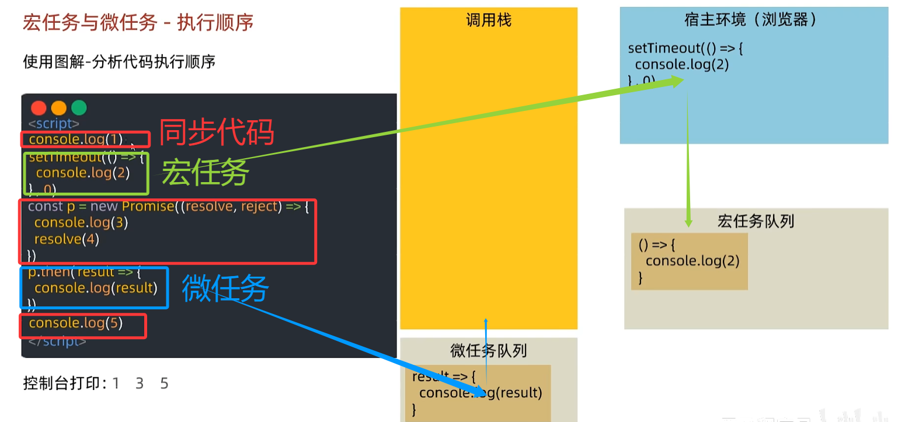

`1,3,5,4,2` 

**核心执行规则**

事件循环的优先级遵循 “**同步 → 所有微任务 →  一个宏任务**”  重复循环的三层逻辑，具体：

1. 执行完当前所有**同步代码**，清空调用栈
2. 立即清空**微任务队列**：按入队顺序执行所有微任务（哪怕执行中产生新的微任务，也会继续清空，直到队列空）
3. 微任务队列清空后，从**宏任务队列**取出「第一个宏任务」执行
4. 执行完该宏任务后，重复步骤 2-3（即 “一个宏任务 + 清空微任务” 为一个循环周期）

**每执行完一个宏任务**，都会先去检查**微任务队列**，执行其中**所有**的微任务，然后才会取下一个宏任务

**微任务的优先级高于宏任务**

## 事件循环练习
```javascript
console.log(1)  // 同步

// 宏任务1：setTimeout回调
setTimeout(() => {
  console.log(2)  // 宏任务1内的同步
  const p = new Promise(resolve => resolve(3)) // Promise 本身同步
  p.then(result => console.log(result)) // Promise.then回调 微任务3
}, 0)

// Promise p：构造函数内同步，then是微任务
const p = new Promise(resolve => {
  setTimeout(() => {   // 宏任务2（同步代码内的异步）
    console.log(4)   
  }, 0)
  resolve(5)  // 同步：标记p为resolved
})
p.then(result => console.log(result))  // 微任务1

const p2 = new Promise(resolve => resolve(6))  // 同步

p2.then(result => console.log(result))   // 微任务2

console.log(7) // 同步
```

**核心规则：同步代码优先执行**（调用栈直接处理）

**微任务（Promise.then/catch/finally）**

+ 在当前**宏任务执行完毕后**，**立即清空微任务队列**，再执行下一个宏任务

**宏任务（setTimeout、setInterval 等）**

+ 入队后，需等待 “同步代码→微任务” 都处理完，才会依次执行

**执行步骤：**

**step 1：执行所有同步代码（调用栈处理）：**

+ `console.log(1)` → 输出 `1`
+ 第一个 `setTimeout`（宏任务，记为 **宏 1**）：回调入**宏任务队列**，暂不执行
+ `new Promise((resolve) => { ... })`（记为 `p`）：
    - 构造函数内代码是**同步的**：
        * 内部 `setTimeout`（宏任务，记为 **宏 2**）入**宏任务队列**
        * `resolve(5)` 同步执行 → `p` 变为 resolved
        * 其 `then` 回调（`console.log(5)`）入**微任务队列**（记为 **微 1**）
+ `p.then(result => console.log(result))` → 就是上面的 **微 1**，已入队
+ `new Promise((resolve) => resolve(6))`（记为 `p2`）：
    - `resolve(6)` 同步执行 → `p2` 变为 resolved，其 `then` 回调（`console.log(6)`）入**微任务队列**（记为 **微 2**）
+ `console.log(7)` → 输出 `7`

**step 2：同步代码执行完毕，清空所有微任务队列：**

微任务队列此时有 **微 1（输出 5）、微 2（输出 6）**，依次执行：

+ 微 1：`console.log(5)` → 输出 `5`
+ 微 2：`console.log(6)` → 输出 `6`

**step 3：执行一个宏任务（按入队顺序，先取宏 1）：**

宏 1 是第一个 `setTimeout` 的回调，执行其中的代码：

+ `console.log(2)` → 输出 `2`
+ `new Promise(resolve => resolve(3))`：
    - 构造函数内 `resolve(3)` 同步执行 → 其 `then` 回调（`console.log(3)`）入**微任务队列**（记为 **微 3**）
+ 此时，**宏 1 的同步代码执行完毕**，需先处理新产生的 **微任务队列**（微 3）：
    - 微 3：`console.log(3)` → 输出 `3`

**step 4：执行下一个宏任务（宏 2，即 `p` 构造函数内的 `setTimeout` 回调）：**

+ `console.log(4)` → 输出 `4`

最终输出顺序：

`1 → 7 → 5 → 6 → 2 → 3 → 4`

**核心难点:**

**宏任务执行过程中产生的微任务，会在当前宏任务结束后、下一个宏任务开始前立即执行（插队处理）**

