# Vue2 基础入门
## Vue 基础概念
**定义：** Vue是一个用于**构建用户界面**（UI）的**渐进式**JavaScript

**框架特点：简单易用**、**组件化**和**响应式数据绑定**

**核心思想：** 通过**声明式语法**将数据映射到 DOM 上，当数据变化时，DOM 会自动更新

**核心概念**

+ **响应式数据绑定**：数据变化时，DOM 自动更新
+ **组件化**：将页面拆分成多个可复用的小部件
+ **虚拟 DOM**：轻量级 JavaScript 对象，是真实 DOM 的抽象表示，提高渲染效率
+ **单向数据流**：组件间数据遵循单向流动原则，但内部表单元素可通过 v-model 实现双向绑定

**构建用户界面：**

基于**数据**（如：商品列表、用户信息）**动态渲染**为用户能看到和交互的网页元素

（表格、按钮、表单），例如通过 `{{ msg }}` 将数据 `msg` 展示到页面中

构建用户界面是指，在Vue中，可以基于数据渲染出用户看到的界面

举个例子，比如服务器端返回给前端的原始数据如下

```javascript
userList: [
  {"id": 1, "name": "谢逊", "image": "1.jpg", "gender": 1, "job": "班主任"},
  {"id": 2, "name": "韦一笑", "image": "2.jpg", "gender": 1, "job": "班主任"}
]
```

开发人员使用Vue中提供的操作，将原始数据遍历、解析出来，从而渲染呈现出用户所能看懂的界面

**渐进式：** 

渐进式中的渐进字面意思就是 "循序渐进"

Vue生态中语法非常多，比如声明式渲染、组件系统、客户端路由（VueRouter）、状态管理（Vuex、Pinia）、构建工具（Webpack、Vite）等等，可以从小功能开始用 Vue（比如一个动态表格），然后逐步在需要时引入更强大的功能（路由、状态管理），无需掌握所有 API 即可开发，可逐步学习和应用功能

**框架：** 提供了一套组织代码、解决常见问题的规则和工具，比直接用原生JavaScript开发大型应用更高效、更易维护，就是一套完整的解决方案

**库：** 类似工具箱，是一堆方法的集合，比如 axios、lodash、echarts等

## 开发方式
**核心包开发 (CDN引入)**

在HTML文件中直接引入Vue的CDN链接

**优点：** 最简单快捷，无需复杂工具

**缺点：** 不适合大型项目，缺少工程化支持（如模块化、打包）

**工程化开发 (Vite/Vue CLI)**

Vue核心包&Vue插件&工程化

使用官方脚手架工具（**Vite** 或 **Vue CLI**）创建项目

**优点：**

提供完整开发环境（热更新、代码打包、模块化、预处理等），项目结构清晰，适合协作和大型应用

## 创建 Vue 实例
**核心步骤**：

**准备 HTML 容器**：如 `<div id="app"></div>`

**引入 Vue 库**：

+ **开发版**（含完整的警告和调试信息）
+ **生产版**（压缩优化）

**创建Vue 实例**：`new Vue()`

**Vue2 官网：**[**https://v2.cn.vuejs.org/** ](https://v2.cn.vuejs.org/)

**配置项**：

+ `el`：指定挂载点（如 `el: '#app'`）指定vue实例要控制的元素
+ `data`：提供数据（如 `data: { count: 100 }`）

```html
<!-- 基础渲染示例 Vue2 -->

<!-- 1. 准备容器 -->
<div id="app">{{ message }}</div>
<!-- 2. 引入Vue.js -->
<!-- <script src="https://cdn.jsdelivr.net/npm/vue@2.7.14/dist/vue.js"></script> -->
<script src="./Vue.js/vue.js"></script>
<script>
  // 3. 创建Vue实例
  const app = new Vue({
    // 配置选择器，指定vue实例要控制的元素
    el: "#app",
    // 准备数据
    data: {
      message: "hello world",
    },
  });
</script>
```

**Vue3**

```html
<!-- 基础渲染示例 Vue3 -->
<!-- 1. 准备 HTML 容器  -->
<div id="app">{{ msg }}</div>
<!-- 2.引入 Vue 库引入 Vue 库 -->
<script src="https://cdn.jsdelivr.net/npm/vue@3.2.47/dist/vue.global.prod.js"></script>
<script>
// 3.创建应用实例并挂载
const { createApp } = Vue;
createApp({
  setup() {
    const msg = ref('Hello Vue3')
    return {
      msg 
    }
  }
}).mount('#app')
</script>
```

## 开发者工具
**作用：** 

Chrome/Firefox浏览器插件，用于调试Vue应用

可以查看组件树、组件状态(props, data)、事件、Vuex/Pinia状态等

**安装:**

1. 打开Chrome网上应用店或Firefox附加组件商店
2. 搜索“Vue.js devtools”
3. 点击“添加至Chrome”/“添加到Firefox”

**使用:** 浏览器中打开Vue应用页面，按**F12**打开开发者工具，会看到**Vue**或**Components**选项卡

**注意：** V2 版本已不再支持，需要找 6.4.4 之前版本

## 模板语法
**插值表达式 (`{{ }}`)**

**表达式：是可以被求值的代码，JS引擎会将其计算出一个结果**

**作用：** 将Vue实例中的数据**渲染**到HTML文本内容中

**语法：** `{{ javascript表达式 }}`

**特点：**

+ 内部可以是**变量名、简单表达式（如 **`a * b`**）、三元表达式（如`isA ? '是' : '否'`）**
+ 内部**不能**写复杂的逻辑（如 **if/for** 语句）或声明变量

```html
<div id="app">
  <h1>{{ message }}</h1>
  <p>价格：{{price * 5}}</p>
  <p>用户级别：{{ isVip?'vip会员':'普通会员'}}</p>
  <p>是否成年：{{ age>=18?"成年":"未成年"}}</p>
  <p>所在城市：{{address.city}}市{{address.street}}区</p>
</div>
<script src="./Vue.js/vue.js"></script>
<script>
  const app = new Vue({
    el: "#app",
    data: {
      message: "hello world",
      price: 220,
      age: 18,
      isVip: true,
      address: {
        city: "济南",
        street: "历城",
      },
    },
  });
</script>
```

注意：

使用的数据要存在 （data）

支持的是表达式，而非语句if ... for 

不能在标签属性里面使用，有专门的动态渲染 v-bind

## 响应式特性
**响应式：数据变化，视图自动更新,** 专注于**业务逻辑**


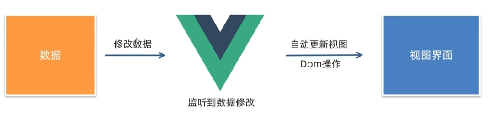

data中的数据， 最终会被添加到实例上

访问数据： "实例.属性名" 

修改数据： "实例.属性名" = "值"  

```html
<script>
  // 创建Vue实例,实例赋值给 app 变量
  const app = new Vue({
    //el配置选择器，指定挂载的元素
    el: "#app",
    //数据源
    data: {
      message: "hello vue",
      price: 100,
      isvip: true,
    },
  });
  // 访问数据 实例.属性名
  console.log(app.message);
  // 修改数据 赋值给实例.属性名
  app.message = "hello world";
</script>
```

# Vue2 响应式原理
## Object.defineProperty()
“Property” 常见含义为 “财产；资产”，尤指个人或团体拥有的财物、房地产等。它还可表示 “特性；性质”，指人或事物所具备的独特特点、品质。在计算机编程领域，**“Property” 常指属性，用于描述对象的特征或状态**。例如，在面向对象编程中，一个类的对象可能有各种属性来定义其特性

**Object.defineProperty()** 是 JavaScript 中一个非常重要的方法，允许直接在一个对象上定义一个新属性，或者修改一个现有属性的配置，并返回这个对象

```javascript
Object.defineProperty(obj, prop, descriptor)
```

**参数详解**

- **obj**：必需，目标对象，即要在其上定义或修改属性的对象
- **prop**：必需，要定义或修改的属性的名称或 Symbol
- **descriptor**：必需，要定义或修改的属性描述符，分为**数据描述符**和**存取描述符**两种类型

属性描述符必须是数据描述符或者存取描述符两种形式之一，不能同时具备两者的特性

**数据描述符**：具有以下可选键值：

+ **value**：该属性对应的值，可以是任何有效的 JavaScript 值（数值、对象、函数等）
+ 默认为 `undefined`
+ **writable**：当且仅当该属性的 `writable` 键值为 `true` 时，`value` 才能被赋值运算符改变
+ 默认为 `false`

**存取描述符**：具有以下可选键值：

+ **get**：一个给属性提供 getter 的方法，如果没有 getter 则为 `undefined`
+ 该方法返回值被用作属性值。默认为 `undefined`
+ **set**：一个给属性提供 setter 的方法，如果没有 setter 则为 `undefined`
+ 该方法接受唯一参数，并将该参数的新值分配给该属性。默认为 `undefined`

**简单示例：使用 Object.defineProperty () 创建响应式数据**

下面是一个简单的示例，展示了如何使用 `Object.defineProperty()` 实现基本的响应式效果：

```javascript
// 创建一个空对象
const person = {};

// 定义一个内部变量，用于存储数据
let _name = '张三';

// 使用 Object.defineProperty() 定义属性
Object.defineProperty(person, 'name', {
  // getter：当访问 person.name 时调用
  get() {
    console.log('读取 name 属性');
    return _name;
  },
  
  // setter：当修改 person.name 时调用
  set(newValue) {
    console.log(`修改 name 属性为: ${newValue}`);
    _name = newValue;
    
    // 触发更新 DOM 的操作
    updateDOM();
  }
});

// 模拟更新 DOM 的函数
function updateDOM() {
  console.log('DOM 更新: 显示最新的 name 值');
}

// 使用示例
console.log(person.name); // 读取属性，触发 getter
person.name = '李四';     // 修改属性，触发 setter
console.log(person.name); // 再次读取属性
```

普通对象属性（比如`person.name`）就是个普通变量，读它、改它，没人知道；  

Vue2 在初始化时，会遍历 data 选项中的所有属性，使用 `Object.defineProperty()` 将这些属性转换为 getter/setter。这个过程被称为**数据劫持**或**数据代理**

1. `data(){ return { name: '张三' } }`；
2. Vue 初始化时，**遍历 data 里的所有属性**
3. 用`Object.defineProperty()`给每个属性都装上`get/set`监控；
4. 一改数据（比如`this.name = '李四'`），**set 自动触发**；
5. Vue 收到 set 的通知，立刻去更新页面

这个过程就叫**数据劫持**——Vue 把数据的读和改，全都 “接管” 了，偷偷做更新页面的事

总结

1. `Object.defineProperty()` = 给对象属性**装监控**；
2. `get`：读属性时触发，`set`：改属性时触发；
3. Vue2 靠它实现**响应式**：数据变→set 触发→自动更新页面

## 响应式系统工作流程
当创建一个 Vue 实例时，响应式系统会按以下步骤工作：

1. **初始化数据**：Vue 将 `data` 选项中的所有属性转换为 getter/setter
2. **编译模板**：Vue 解析模板，识别其中的依赖（如插值表达式、指令等）
3. **创建 Watcher**：每个依赖都会创建一个 Watcher 对象
4. **依赖收集**：当 Watcher 计算时，会触发相应属性的 getter，从而将 Watcher 添加到依赖列表中
5. **数据变化**：当属性值发生变化时，会触发相应的 setter
6. **通知更新**：setter 会通知所有依赖的 Watcher，Watcher 会更新 DOM

## 响应式系统限制
由于使用 `Object.defineProperty()`，Vue2 的响应式系统存在一些限制：

**无法检测属性的添加或删除**：

+ 由于 `Object.defineProperty()` 只能劫持已存在的属性，新增或删除属性时无法触发响应式
+ **解决方案**：使用 `Vue.set()` 、`Vue.delete` 或 `this.$set()` 手动添加响应式属性

**无法检测数组长度变化或索引修改**：

+ Vue 2 重写了数组的变异方法（如 `push`、`splice`），但直接通过索引修改数组时无法响应
+ **解决方案**：使用变异方法或 `Vue.set()`

**深度监听需要递归遍历**：

+ 对嵌套对象需要递归调用 `Object.defineProperty()`，性能开销较大

# 指令
指令 (Directives - 以 `v-` 开头)， 带有**v- 前缀** 的特殊**标签属性**  

指令是Vue模板中的特殊属性，用于为HTML元素添加动态行为

**常见指令：**

| 指令 | 作用 |
| :--- | :--- |
| v-for | 列表渲染，遍历容器的元素或者对象的属性 |
| v-bind | 为HTML标签绑定属性值，如设置 href , css样式等 |
| v-if/v-else-if/v-else | 条件性的渲染某元素，判定为true时渲染,否则不渲染 |
| v-show | 根据条件展示某元素，区别在于切换的是display属性的值 |
| v-model | 在表单元素上创建双向数据绑定 |
| v-on | 为HTML标签绑定事件 |

## v-text  HTML 元素的文本内容
用于将数据绑定到 HTML 元素的文本内容上,其绑定的表达式的值会直接作为**元素的文本内容**显示

```html
<p>v-text指令 设置元素的textContent</p>
<p v-text="text"></p>

data: {
  text: "hello world",
},
```

最终渲染的 HTML 中，它会替换掉元素原本的文本内容

## v-html  元素 innerHTML 
作用：设置元素的 innerHTML 

**语法：v-html = "表达式 "**

```html
<!-- v-html 指令 修改元素innerHTML属性 -->
<!-- 插值表达式无法解析 html标签 -->
<!-- v-html指令 -->
<p>v-html指令 设置元素的innerHtml</p>
<p>插值表达式无法解析{{html}}</p>
<p v-html="html"></p>

data: {
 html: '<a href="https://www.baidu.com">百度</a>',
},
```


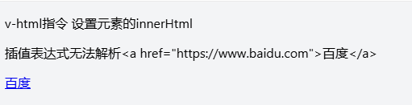
## v-show  元素显示隐藏
作用： 控制元素显示隐藏

**语法： v-show = "表达式" 表达式值 true 显示， false 隐藏**

**原理： 切换 CSS 属性 display:none 控制显示隐藏**

场景： **频繁切换**显示隐藏的场景  

```javascript
<!-- v-show 指令 显示或隐藏元素 -->
<p v-show="isShow">v-show 指令 显示或隐藏元素</p>

data: {
  isShow: true,
},
```


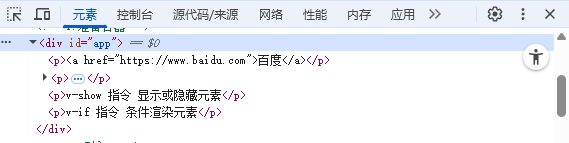


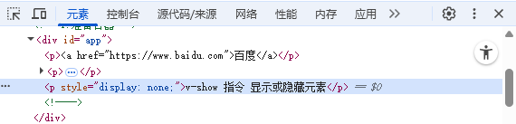

**条件显示组件 / 元素**

根据变量的值决定是否显示某个元素，如表单中的错误提示：

```html
<template>
  <div>
    <input v-model="email" type="email">
    <p v-show="!isValidEmail" class="error">请输入有效的邮箱地址</p>
  </div>
</template>
```

**切换显示不同内容**

在多个内容区域间切换，如标签页：

```html
<template>
  <div>
    <button @click="tab = 'home'">首页</button>
    <button @click="tab = 'about'">关于</button>
    
    <div v-show="tab === 'home'">首页内容</div>
    <div v-show="tab === 'about'">关于内容</div>
  </div>
</template>
```

**初始加载状态控制**

在数据加载完成前显示加载状态：

```html
<template>
  <div>
    <div v-show="loading">加载中...</div>
    <div v-show="!loading">数据内容：{{ data }}</div>
  </div>
</template>
```

**移动端菜单切换**

在移动设备上点击按钮显示 / 隐藏导航菜单：

```html
<template>
  <div>
    <button @click="menuOpen = !menuOpen">菜单</button>
    <nav v-show="menuOpen">
      <ul>
        <li>首页</li>
        <li>产品</li>
        <li>联系我们</li>
      </ul>
    </nav>
  </div>
</template>
```

**表单分步填写**

在多步骤表单中显示当前步骤：

```html
<template>
  <div>
    <div v-show="step === 1">步骤1：基本信息</div>
    <div v-show="step === 2">步骤2：联系方式</div>
    <div v-show="step === 3">步骤3：确认信息</div>
  </div>
</template>
```

**权限控制**

根据用户权限显示特定功能：

```html
<template>
  <div>
    <button v-show="hasAdminPermission">管理设置</button>
    <button v-show="hasEditPermission">编辑内容</button>
  </div>
</template>
```

**动画过渡**

与 Vue 的过渡系统结合使用，实现平滑的显示 / 隐藏动画：

```html
<template>
  <div>
    <button @click="show = !show">切换</button>
    <transition name="fade">
      <p v-show="show">这是一段会淡入淡出的文字</p>
    </transition>
  </div>
</template>

<style>
.fade-enter-active, .fade-leave-active {
  transition: opacity 0.5s;
}
.fade-enter, .fade-leave-to {
  opacity: 0;
}
</style>
```

**复杂条件组合**

根据多个条件的组合决定显示状态：

```html
<template>
  <div>
    <div v-show="isLoggedIn && !isGuest && hasPermission">
      欢迎访问会员专区
    </div>
  </div>
</template>
```

## v-if 显示隐藏（条件渲染）
作用： 控制元素显示隐藏（条件渲染） 

**语法： v-if = "表达式" 表达式值 true 显示， false 隐藏**

原理： **元素会在条件满足时被创建并插入DOM，不满足时被销毁并从DOM移除**

场景： 要么显示，要么隐藏，不频繁切换的场景  

**特点：切换开销较大（涉及创建/销毁）**

```html
<!-- v-if 指令 条件渲染元素 -->
<p v-if="isShow">v-if 指令 条件渲染元素</p>
data: {
  isShow: true,
},
```

##  v-else v-else-if    (辅助 v-if 渲染)
作用： 辅助 v-if 进行判断渲染

语法： v-else v-else-if = "表达式" 

**注意：else 不可单独使用，需要紧挨着 v-if 一起使用  语法：**

```html
<!-- v-else v-else-if  条件渲染元素 -->
<p v-if="gender===1">男性</p>
<p v-else-if="gender===2">女性</p>
<p v-else>未知</p>

data: {
  gender: 2, //性别标识1:男性 2:女性
},
```

**互斥条件渲染**

根据变量的值**互斥地显示**不同元素，如登录状态判断：

```html
<template>
  <div>
    <p v-if="isLoggedIn">欢迎回来，{{ username }}!</p>
    <button v-else @click="login">登录</button>
  </div>
</template>
```

**多分支条件判断**

类似 JavaScript 的 `if-else if-else`，适用于多种状态的切换：

```html
<template>
  <div>
    <div v-if="status === 'loading'">加载中...</div>
    <div v-else-if="status === 'success'">操作成功！</div>
    <div v-else-if="status === 'error'">发生错误：{{ errorMessage }}</div>
    <div v-else>默认状态</div>
  </div>
</template>
```

**组件动态切换**

根据条件渲染不同组件，常用于路由视图或复杂交互：

```html
<template>
  <div>
    <LoginForm v-if="currentView === 'login'" />
    <RegisterForm v-else-if="currentView === 'register'" />
    <ForgotPassword v-else-if="currentView === 'forgot'" />
  </div>
</template>
```

**权限控制（复杂场景）**

根据用户角色显示不同内容，如管理后台的菜单：

```html
<template>
  <div>
    <AdminPanel v-if="userRole === 'admin'" />
    <UserPanel v-else-if="userRole === 'user'" />
    <GuestPanel v-else />
  </div>
</template>
```

**表单验证结果**

根据验证状态显示不同提示（与 `v-show` 相比，DOM 会被移除）：

```vue
<template>
  <div>
    <input v-model="email" type="email">
    <p v-if="emailError" class="error">{{ emailError }}</p>
    <p v-else-if="emailVerified" class="success">邮箱格式正确</p>
  </div>
</template>
```

**性能优化（惰性渲染）**

对于复杂或资源密集的组件，使用 `v-if` 避免不必要的初始化：

```html
<template>
  <div>
    <HeavyComponent v-if="userConfirmed" />
  </div>
</template>
```

## v-bind  (动态绑定属性)
**作用：** **动态绑定**HTML元素的**标签属性**（如 **id**, **href**, **src**, **class**, **style**）到Vue实例的数据

**语法：** v-bind:属性名="表达式" 

**简写： : 属性名="表达式"  绑定普通属性：**

```html
!-- v-bind 绑定属性 -->
<!--   插值表达式不可用于属性 -->


data: {
  imgUrl: "./img/玄.png",
}
```

**动态绑定Class**

**原生 JavaScript 需要 Classlist.进行类名操作**

```javascript
document.getElementById("app").classList.add("textColor");
```

**对象语法：:class="{ 类名: 布尔表达式 }"** 当布尔表达式为 **true** 时，添加该类名

适用场景：tab 栏高亮一个类名来回切换

```html
<div :class="{ 'active': isActive, 'text-danger': hasError }"></div>
<!-- 如果isActive为true，添加'active'类；如果hasError为true，添加'text-danger'类 -->
```

**数组语法：:class="[classA, classB]"** ，直接应用数组中的类名

适用场景：批量添加或删除类名

```html
<div :class="[activeClass, errorClass]"></div>
<!-- 在data中：activeClass: 'active', errorClass: 'text-danger' -->
```

## v-for  ( 循环渲染)
**作用：** 基于源数据（数组或对象） **循环多次渲染**一个元素或模板

**语法：**

+ **遍历数组：v-for="(item, index) in items"**
+ **遍历对象：v-for="(value, key, index) in object"**
+ **遍历数字范围：v-for="n in 10"** (从1到10)

**关键点：:key 绑定**

**必须**为每个通过 **v-for** 渲染的元素提供唯一的 **key** 属性（通常使用数据中的唯一标识 **id**）

**作用：** 帮助 Vue 识别哪些元素发生了变化,提升列表更新性能，避免潜在渲染错误

当 Vue 使用 `v-for` 更新已渲染的元素列表时，它默认使用 "就地复用" 策略

+ 如果数据项的顺序发生了变化，Vue 不会移动 DOM 元素来匹配数据项的顺序
+ 而是简单复用原有每个元素
+ 并确保它在特定索引下显示已被渲染过的每个元素

这种策略在某些情况下可能导致性能问题或意外行为

#### :key 如何解决问题

通过为每个元素绑定一个唯一的 `key`，Vue 可以跟踪每个节点的身份：

+ 当数据发生变化时
+ Vue 可以基于 `key` 来识别哪些元素是新增的，哪些是被移除的
+ 从而更精确地更新 DOM，减少不必要的重渲染

#### 不推荐使用索引作为 key

虽然可以使用索引作为 `key`，但这通常不是最佳实践：

+ 当列表重新排序时，索引会发生变化
+ 这会导致 Vue 认为是全新的元素，而不是简单的重新排序
+ 可能会导致性能下降，尤其是对于大型列表
+ 可能会导致状态问题，例如在列表中有表单元素时

#### :key 的最佳实践

+ 使用**唯一标识符**作为 `key`，例如数据库中的<strong> ID</strong>
+ 避免使用索引作为 `key`，除非列表不会发生变化
+ **key 必须是稳定的、可预测的，并且是唯一的**
+ 不要使用随机数或 Math.random () 作为 `key`，因为它们不是稳定的


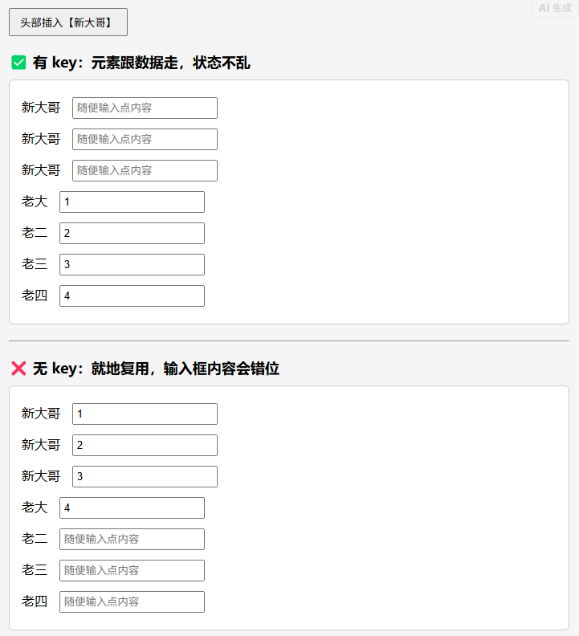

```html
<div id="app">
  <button @click="unshiftItem">头部插入新大哥</button>
  
  <h2>✅ 有key：元素带唯一标识，DOM状态跟着数据走</h2>
  <div class="wrap1">
    <div v-for="item in list" :key="item.id">
      {{item.name}} <input placeholder="随便输入内容">
    </div>
  </div>

  <hr>

  <h2>❌ 无key：就地复用DOM，DOM状态粘位置（经典bug）</h2>
  <div class="wrap2">
    <div v-for="item in list">
      {{item.name}} <input placeholder="随便输入内容">
    </div>
  </div>
</div>

<script>
new Vue({
  el: '#app',
  data() {
    return {
      list: [
        { id: 1, name: '老大' },
        { id: 2, name: '老二' },
        { id: 3, name: '老三' },
        { id: 4, name: '老四' }
      ]
    }
  },
  methods: {
    unshiftItem() {
      this.list.unshift({
        id: Date.now(),
        name: '新大哥'
      })
    }
  }
})
</script>
```


**示例：**

```html
<!-- 遍历数组 -->
<ul>
  <li v-for="(todo, index) in todos" :key="todo.id">
    {{ index}}. {{ todo.text }}
  </li>
</ul>

<!-- 遍历对象 -->
<ul>
  <li v-for="(value, key) in userInfo" :key="key">
    {{ key }}: {{ value }}
  </li>
</ul>

<!-- 遍历数字 -->
<span v-for="n in 5" :key="n">{{ n }} </span> <!-- 输出: 1 2 3 4 5 -->
```

## 案例- tab 导航高亮  
核心思路： 

1. 基于数据动态渲染 tab → v-for 

2. 准备下标记录高亮的是哪一个 tab → activeIndex 

3. 基于下标，动态控制 class 类名 → v-bind:class 

4.点击 ul 时将下标赋值给高亮下标→@click="activeIndex = index"

所谓切换高亮，其实就是改下标  

```vue
<template>
  <div id="app">
    <ul>
      <li
        v-for="(item, index) in list"
        :key="item.id"
        @click="activeIndex = index"
        >
        <a :class="{ active: index === activeIndex }" href="#">
          {{ item.name }}
        </a>
      </li>
    </ul>
  </div>
</template>
<script src="https://cdn.jsdelivr.net/npm/vue@2/dist/vue.js"></script>
<script>
  const app = new Vue({
    el: "#app",
    data: {
      activeIndex: 2, // 记录高亮
      list: [
        { id: 1, name: "京东秒杀" },
        { id: 2, name: "每日特价" },
        { id: 3, name: "品类秒杀" },
      ],
    },
  });
</script>
```

**动态绑定Style对象语法：:style="{ css属性名: 属性值 }"** ，属性值可以是变量或表达式

```html
<div :style="{ color: activeColor, fontSize: fontSize + 'px' }"></div>
<!-- 在data中：activeColor: 'red', fontSize: 14 -->
```

**数组语法：:style="[styleObjectA, styleObjectB]"** 。应用多个样式对象

```html
<div :style="[baseStyles, overridingStyles]"></div>
```

## v-on  ( 注册事件  )
注册事件  = 添加监听 + 提供处理逻辑  

**作用：** 监听DOM事件（如 **click**, **input**, **submit**）并执行Vue实例中的方法

语法： **v-on:事件名="处理函数"** 或 **简写 @事件名="处理函数" (常用)**

**核心用法：内联事件处理 (简单逻辑)：**

```html
<!-- v-on 指令 绑定事件 -->
<!-- 内联事件 -->
<button @click="isShow=!isShow">切换</button>
<button @click="count++">增加</button> <!-- 直接修改data中的count -->
```

**调用方法 (推荐)：methods 函数内的 this 指向 Vue 实例**

```html
<button @click="show">调用方法切换</button>

<script>
  const app = new Vue({
    //el配置选择器，指定挂载的元素
    el: "#app",
    //数据源
    data: {
      isShow: true,
    },
    methods: {
      show() {
        this.isShow = !this.isShow;
      },
    },
  });
</script>
```

**传递参数：**

```html
<!-- 方法调用参数 -->
<span>{{money}}</span>
<button @click="buy(100)">购买100块商品</button>
<button @click="buy(50)">购买50元商品</button>
methods: {
  buy(a) {
    this.money -= a;
  },
},
```

**访问原生事件对象 (`$event`)：** 需要时传入 **$event** 参数

```html
<button @click="warn('表单还未提交', $event)">提交</button>

methods: {
  warn(message, event) {
    if (event) {
      event.preventDefault(); // 阻止默认提交行为
    }
      alert(message);
    }
}
```

## v-model   (双向绑定)
**作用：** 在**表单元素**（`<input>, <textarea>, <select>`）上创建**双向数据绑定**

当用户**输入**时，自动更新Vue实例中的**数据**；当Vue实例中的**数据**改变时，表单**元素的值**也会自动更新

**数据变化 → 视图自动更新**

**视图变化 → 数据自动更新**

**语法：v-model="数据变量名"**

常见的表单元素都可以用 v-model 绑定关联 → 快速 获取或设置表单元素的值

v-model 应用于其他表单元素，它会**根据控件类型**自动选取正确的方法来更新元素

**本质：`v-model` 是 `:value(v-bind)` 和 `@input` 的语法糖，用于简化双向数据绑定**

```html
<!-- 这是使用 v-model 的简写形式 -->
<input v-model="message">

<!-- 这是 v-model 展开后的等价形式 -->
<input 
  :value="message" 
  @input="message = $event.target.value" 
>
```

**核心用法：**

```html
<input type="text" v-model="username"> <!-- 文本输入框 -->
<p>输入的用户名是：{{ username }}</p> <!-- 实时显示username的值 -->

<textarea v-model="message"></textarea> <!-- 多行文本域 -->

<input type="checkbox" v-model="isAgreed"> <!-- 单个复选框 (绑定布尔值) -->
<p>用户是否同意：{{ isAgreed ? '是' : '否' }}</p>

<input type="checkbox" value="vue" v-model="interests"> <!-- 多个复选框 (绑定数组) -->
<input type="checkbox" value="react" v-model="interests">
<input type="checkbox" value="angular" v-model="interests">
<p>选中的兴趣：{{ interests }}</p>

<!--
  1. name:给单选框加上name属性可以分组同一组互相会互斥
  2. value：给单选框加上value属性，用于提交给后台的数据
  结合 Vue 使用V-model
单选按钮 -->
<input type="radio" value="male" v-model="gender">男 
<input type="radio" value="female" v-model="gender">女
<p>选中的性别：{{ gender }}</p>
<!-- data中gender的值在value中选择 -->

<!--
  1.option需要设置value值，提交给后台
  2. select 的 value 值，关联了选中的 option的 value 值
  结合 Vue 使用V-model
-->
<select v-model="selectedCity"> <!-- 下拉选择 -->
  <option value="bj">北京</option>
  <option value="sh">上海</option>
  <option value="gz">广州</option>
</select>
<p>选中的城市：{{ selectedCity }}</p>
<!-- data中的selectedCity的值，关联了option的value值 -->
```

## 指令修饰符  
**通过 "." 指明一些指令后缀**，不同后缀封装了不同的处理操作 → 简化代码  

**按键修饰符**

**@keyup.enter**: 键盘回车监听

```html
<div id="app">
  <p>@keyup.enter 监听键盘回车</p>
  <input type="text" @keyup.enter="enter" v-model="message" />
  <p>@keyup 监听键盘任何按键</p>
  <input type="text" @keyup="enterFn" v-model="message" />
</div>
<script src="https://cdn.jsdelivr.net/npm/vue@2/dist/vue.js"></script>
<script>
  const app = new Vue({
    el: "#app",
    data: {
      message: "hello vue",
    },
    methods: {
      enter() {
        console.log("回车", this.message);
      },
      // 监听所有按键，每次按下都打印
      enterFn(e) {
        // 判断是否按下回车
        if (e.key === "Enter") {
          console.log("回车", this.message);
        }
        console.log(this.message);
      },
    },
  });
</script>
```

@keyup.enter 相当于封装了if (e.key === "Enter")判断是否按下回车按键这一步

**`v-model`修饰符**

**`v-model.lazy`** ：

将 **input** 事件（输入时实时触发）改为 **change** 事件（失去焦点或按回车时触发）才同步数据

**`v-model.number`** ：自动将用户输入值转**换为数字**类型

**`v-model.trim`** ：自动去除用户输入内容**首位两端的空白字符**

```html
<p>v-model.lazy 实时同步改为失去焦点同步</p>
<p>当前 message: {{ message }}</p>
<input type="text"  v-model.lazy="message" />

<p>v-model.number 自动转数字</p>
<p>当前 age: {{ age }}</p>
<input type="text"  v-model.number="age" />

<p>v-model.trim 自动去掉空格</p>
<p>当前 name: {{ name }}</p>
<input type="text"  v-model.trim="name" />
```

**事件修饰符**

简化常见事件处理逻辑（如阻止默认行为、停止冒泡）

用点 **.** 表示

**@事件名.once**：事件只触发一次

```html
<a @click.prevent="doSomething">链接</a> <!-- 点击链接不会跳转 -->
<form @submit.prevent="onSubmit">...</form> <!-- 提交表单不会刷新页面 -->
```

**@事件名.stop**: 阻止冒泡 

```html
<p>@事件名.stop : 阻止冒泡</p>
<div class="father" @click="fatherClick">
  <div class="child" @click.stop="childClick">子元素</div>
</div>
<script>
  fatherClick() {
    alert("父组件被点击");
  },
  childClick() {
    alert("子组件被点击");
  },
</script>
```

**@事件名.prevent**: 阻止默认行为  

```html
<p>@事件名.prevent阻止默认事件</p>
<a href="" @click.prevent>www.baidu.com</a>
```

# 计算属性 computed  
概念：基于**现有的数据**，计算出来的**新属性**； 依赖的数据变化，**自动**重新计算 

## 基础语法
声明在**computed 配置项**中，一个计算属性对应一个函数 

使用起来和普通属性一样使用 **{{ 计算属性名 }}**

**计算属性可以将一段求值的代码进行封装**

```html
<!-- 统计礼物总数 计算属性不是函数 而是一个属性 -->
<p>礼物总数 {{totalCount}}</p>
<script>
  const app = new Vue({
    el: "#app",
    data: {
      // 购物车数据
      list: [
        { id: 1, name: "篮球", num: 4 },
        { id: 2, name: "玩具", num: 2 },
        { id: 3, name: "铅笔", num: 5 },
      ],
    },
    computed: {
      // 计算属性名称
      totalCount() {
        // 逻辑
        // 直接通过this访问app实例的data数据
        console.log(this.list);
        // 对数组中的num属性求和 reduce
        let sum = this.list.reduce((pre, item) => {
          return pre + item.num;
        }, 0);
        // 返回结果
        return sum;
      },
    },
  });
</script>
```

## 计算属性 vs 方法
**computed 计算属性：**

作用：封装了一段对于数据的处理，求得一个结果

语法：

写在 **computed** 配置项中 

作为**属性**，直接**使用**：this.计算属性 {{ 计算属性 }} 

**methods 方法：**

作用：给实例提供一个方法，调用以处理业务逻辑

语法：

写在 **methods** 配置项中

作为**方法**，需要**调用** ：**this.方法名( )  {{ 方法名() }}  @事件名="方法名"**

```html
<div id="app">
  <!-- 统计礼物总数 计算属性不是函数 而是一个属性 -->
  <!-- 使用计算属性，无论使用多少，只执行一次读取缓存数据 -->
  <p>礼物总数 {{totalCount}}</p>
  <p>礼物总数 {{totalCount}}</p>
  <p>礼物总数 {{totalCount}}</p> 
  <!-- 使用方法，使用多少次，方法会执行多少次 -->
  <p>礼物总数 {{totalFn() }}</p>
  <p>礼物总数 {{totalFn() }}</p>
  <p>礼物总数 {{totalFn() }}</p>
</div>
<script>
  const app = new Vue({
    el: "#app",
    data: {
      // 购物车数据
      list: [
        { id: 1, name: "篮球", num: 4 },
        { id: 2, name: "玩具", num: 2 },
        { id: 3, name: "铅笔", num: 5 },
      ],
    },
    computed: {
      // 计算属性名称
      totalCount() {
        console.log("计算属性执行了");
        // 对数组中的num属性求和 reduce
        let sum = this.list.reduce((pre, item) => {
          return pre + item.num;
        }, 0);
        // 返回结果
        return sum;
      },
    },
    methods: {
      totalFn() {
        console.log("方法执行了");
        // 对数组中的num属性求和 reduce
        let sum = this.list.reduce((pre, item) => {
          return pre + item.num;
        }, 0);
        // 返回结果
        return sum;
      },
    },
  });
</script>
```


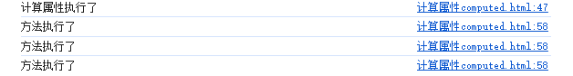

**缓存特性（提升性能）：**

计算属性会对计算出来的**结果缓存**，再次使用直接读取缓存，

依赖项变化了，会**自动**重新计算 → 并再次缓存

## 完整写法
计算属性默认的简写，只能读取访问，**不能 "修改"**

如果要 "修改" → 需要写计算属性的**完整写法**

```html
<div id="app">
  姓：<input type="text" v-model="firstName" /> + 
  名：<input type="text" v-model="lastName" /> =
  <span>{{ fullName }}</span><br /><br />
  <button @click="changeName">改名卡</button>
</div>
<script src="https://cdn.jsdelivr.net/npm/vue@2/dist/vue.js"></script>
<script>
  const app = new Vue({
    el: "#app",
    data: {
      firstName: "刘",
      lastName: "备",
    },
    methods: {
      changeName() {
        this.fullName = "黄忠";
      },
    },
    computed: {
      // 简写 → 获取，没有配置设置的逻辑
      // fullName () {
      //   return this.firstName + this.lastName
      // }

      // 完整写法 → 获取 + 设置
      fullName: {
        // 当fullName计算属性，被获取求值时，执行get（有缓存，优先读缓存）
        // 会将返回值作为，求值的结果
        get() {
          return this.firstName + this.lastName;
        },
        // 当fullName计算属性，被修改赋值时，执行set
        // 修改的值，传递给set方法的形参
        set(value) {
          this.firstName = value.slice(0, 1);
          this.lastName = value.slice(1);
        },
      },
    },
  });
</script>
```

# 侦听器  watch
 作用：监视数据变化，执行一些 **业务逻辑** 或 **异步操作** 
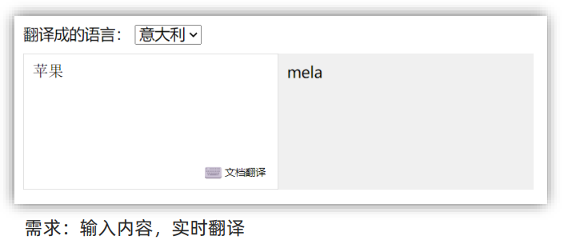

## 基础语法
 简单写法 → 简单类型数据，直接监视   

```typescript
data: {
  words: '苹果',
    obj: {
    words: '苹果'
  }
},
  watch: {
    // 该方法会在数据变化时，触发执行
    数据属性名 (newValue, oldValue) {
      一些业务逻辑 或 异步操作
    },
    '对象.属性名' (newValue, oldValue) {
      一些业务逻辑 或 异步操作
    }
  }
  // 监听数据
  watch: {
    // 监听text数据，老值一般不使用
    "obj.words"(newValue, oldValue) {
      // 清理延时器
      clearTimeout(this.timer);
      // 防抖,一段时间内触发只处理最后一次
      this.timer = setTimeout(async () => {
        console.log(newValue, oldValue);
        const result = await axios({
          url: "https://applet-base-api-t.itheima.net/api/translate",
          params: {
            words: newValue,
          },
        });
        console.log(result.data.data);
        this.result = result.data.data;
      }, 300);
    },
    // "obj.words"(newValue, oldValue) {},
  },
```

## 完整写法  
完整写法 - **添加额外配置项  **

**deep: true**对复杂类型深度监视

**immediate: true** 初始化立刻执行一次handler方法  

```typescript
data: {
  obj: {
    words: '苹果',
      lang: 'italy'
  },
},
// 监听数据
watch: {
  // 监听words数据，老值一般不使用
  obj: {
    deep: true, // 深度监视，对对象内所有子属性监听
    immediate: true,   // 进入页面初始化立刻执行一次handler
    handler(newVal, oldVal) {
    // 清理延时器
    clearTimeout(this.timer);
    // 防抖,一段时间内触发只处理最后一次
    this.timer = setTimeout(async () => {
      const result = await axios({
        url: "https://applet-base-api-t.itheima.net/api/translate",
        params: newVal,
      });
      this.result = result.data.data;
    }, 300);
    },
  },
  // "obj.words"(newValue, oldValue) {},
},
```

## 案例 -购物车
业务技术点总结：

1. 渲染功能：v-if/v-else v-for :class

2. 删除功能：点击传参filter过滤覆盖原数组

3. 修改个数：点击传参find找对象

4. 全选反选：计算属性computed 完整写法 get/set

5. 统计选中的总价和总数量:计算属性computed reduce条件求和

6. 持久化到本地：watch监视,localStorage,JSON.stringify, JSON.parse

# 生命周期  
**避免 DOM 还没渲染就操作，请求发太晚拖慢界面 等问题**

Vue 实例从 **创建** 到 **销毁** 的完整过程，通过 **钩子函数** 暴露不同阶段的执行时机

## 生命周期阶段
Vue 生命周期分为 **创建、挂载、更新、销毁** 四个阶段，每个阶段对应关键钩子：
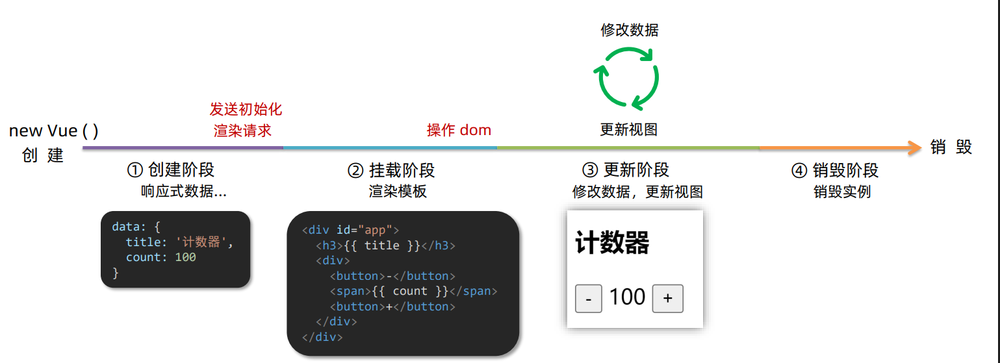

## 生命周期钩子
 Vue生命周期过程中会自动运行一些函数，被称为 **【生命周期钩子】**

让开发者可以在 **【特定阶段】** 运行自己的代码  

| **状态** | **阶段周期** |
| :--- | :--- |
| beforeCreate | 创建前 |
| created | 创建后 |
| **beforeMount** | **挂载前** |
| **mounted** | **挂载完成** |
| beforeUpdate | 更新前 |
| updated | 更新后 |
| **beforeDestroy** | **销毁前** |
| **destroyed** | **销毁后** |


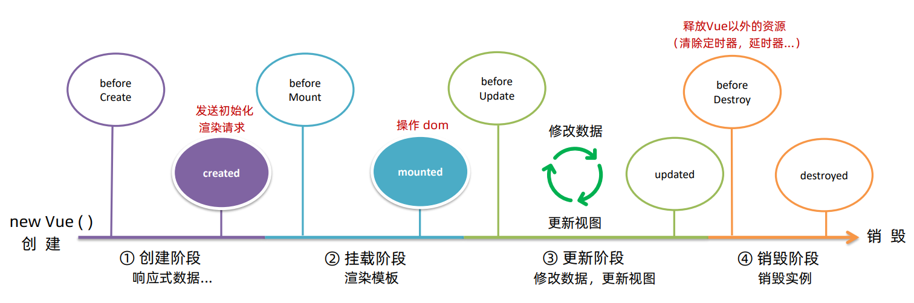

**1. 创建阶段（数据初始化）beforeCreate**：

“Create” 常见意思为 “创造；创作；创建；造成” 

+ 状态：实例刚创建，`data` 未变成响应式、`methods` 未绑定（访问会报错）
+ 场景：几乎不用（无可用数据 / 方法）

**created：**

> + 状态：`data` 已响应式（修改会触发更新），`methods` 已绑定，但 DOM 还没开始渲染（仅存在虚拟 DOM）
> + **场景：发送初始化请求（如获取列表数据）**
> + 优势：数据就绪后立即请求，无需等 DOM 渲染，**请求与渲染并行**，提升效率

```vue
async created() {
  // 在created 中可以发送初始化渲染请求
  const res = await axios({
    method: "get",
    url: "https://hmajax.itheima.net/api/news",
  });
  console.log(res);
  this.newsList = res.data.data;
},
```

**2. 挂载阶段（DOM 渲染）beforeMount**：

“Mount” 常见词性为动词，基本含义为 “登上；爬上；骑上”，在与物件搭配时，有 “安装；镶嵌” 之意

+ 状态：模板已编译为 **虚拟 DOM**（内存中的节点，未挂载到页面），`$el` 是虚拟节点
+ 场景：无（虚拟 DOM 无法操作，意义不大）

**mounted：**

> + 状态：虚拟 DOM 渲染为 真实 DOM，并插入页面（可通过 `document` 获取元素）
> + **场景：**
> + **操作 DOM（如初始化轮播图、获取元素宽高、绑定第三方库）**
> + 初始化需要 DOM 的库（如 Chart.js、Leaflet）
> + 设置定时器或 WebSocket 连接
> + 子组件操作（需确保子组件已挂载）

```javascript
// 挂载阶段 渲染模版
mounted() {
  // 操作dom元素，页面刷新时获取输入框焦点
  document.querySelector("#inp").focus();
},
```

**3. 更新阶段（数据 → 视图）beforeUpdate**：

+ 状态：数据已修改（如 `count++`），但 **视图还未更新**（可获取 “旧 DOM” 状态）
+ 场景：记录数据变化前的 DOM 状态（如滚动条位置）

**updated**：

+ 状态：视图已随数据更新（新 DOM 生成）
+ 场景：处理新 DOM 的逻辑（如根据新数据重新计算布局）
+ 避免在此钩子中修改数据，可能导致无限循环

**4. 销毁阶段（清理资源）控制台：app.$destroy()**

> **beforeDestroy**：
>
> “Destroy” 常表示销毁、破坏的意思。通常指对一个实例、对象、组件等进行清理、释放资源等操作，使其不再存在或不再占用系统资源
>
> + 状态：实例未销毁，仍可访问 `data`、`methods`，但后续操作不再触发视图更新
> + 场景：**清除定时器、自定义事件监听**（避免内存泄漏，比如 `setInterval` 未清除，实例销毁后仍会运行）

**destroyed**：

+ 状态：实例完全销毁，所有绑定自动解除（框架内部清理，无需手动操作）

**高频问题：时机怎么选？初始化请求何时发？** →<strong> 选 `created`：创建阶段</strong>

+ 理由：`created` 时**数据已就绪**，虽 DOM 未渲染，但请求可 “提前启动”，与 DOM 渲染并行，减少整体耗时
+ 反例：若放到 `mounted`，会等 DOM 渲染完再请求，延迟更久

**DOM 操作何时做？** → **选 `mounted`：挂载阶段**

+ 理由：只有 `mounted` 阶段，真实 DOM 才存在（`beforeMount` 是虚拟 DOM，无法操作）
+ 示例：`mounted() { console.log(document.getElementById('app').offsetHeight) }`（获取元素高度）

```html
<script>
  const app = new Vue({
    el: "#app",
    data: {
      count: 100,
      title: "计数器",
    },
    // 1. 创建阶段（准备数据）
    beforeCreate() {
      console.log("beforeCreate 响应式数据准备好之前", this.count); // undefined
    },
    created() {
      console.log("created 响应式数据准备好之后", this.count); // 100
      // this.数据名 = 请求回来的数据
      // 可以开始发送初始化渲染的请求了
    },

    // 2. 挂载阶段（渲染模板）
    beforeMount() {
      console.log(
        "beforeMount 模板渲染之前",
        document.querySelector("h3").innerHTML // {{ title }}
        // 这不是渲染后的内容，是写在 HTML 里的原始模板字符串！
      );
    },
    mounted() {
      console.log(
        "mounted 模板渲染之后",
        document.querySelector("h3").innerHTML // 计数器
      );
      // 可以开始操作dom了
    },

    // 3. 更新阶段(修改数据 → 更新视图)
    beforeUpdate() {
      console.log(
        "beforeUpdate 数据修改了，视图还没更新",
        "修改完成的数据：",
        this.count,
         "视图显示的数据：",
        document.querySelector("span").innerHTML // 100
      );
    },
    updated() {
      console.log(
        "updated 数据修改了，视图已经更新",
        document.querySelector("span").innerHTML // 101
      );
    },

    // 4. 卸载阶段
    beforeDestroy() {
      console.log("beforeDestroy, 卸载前");
      console.log("清除掉一些Vue以外的资源占用，定时器，延时器...");
    },
    destroyed() {
      console.log("destroyed，卸载后");
    },
  });
</script>
```

## 案例-清单饼图
接口文档地址：

  [https://www.apifox.cn/apidoc/shared-24459455-ebb1-4fdc-8df8-0aff8dc317a8/api-53371058](https://www.apifox.cn/apidoc/shared-24459455-ebb1-4fdc-8df8-0aff8dc317a8/api-53371058)

 功能需求：

 1. 基本渲染

+ created 发送请求获取数据
+ 数据赋值给data中的billList
+ v-for渲染
+ 计算属性计算总价

2. 添加功能

+ 收集表单数据 v-model name ,price
+ 添加按钮注册点击，发送请求
+ 请求成功后，重新获取数据，并展示

3. 删除功能

+ 注册点击事件,参数id
+ 发送请求,调研删除接口
+ 请求成功后，重新获取数据，并展示

4. 饼图渲染

+ 初始化echarts实例，需要传递dom元素，在mounted中创建
+ setOption 动态更新配置项

  

# 工程化开发 Vue CLI
开发 Vue 的两种方式： 

**传统开发模式（核心包引入）方式**：直接在 HTML 中引入 `vue.js`，写 `script`、`style` 代码

**局限**：

+ 仅支持 ES5 语法，无法用 ES6/TS、Less/Sass 等现代技术；
+ 无自动化构建，需手动管理资源，项目复杂时效率极低

**工程化开发模式（基于构建工具，如 webpack）**


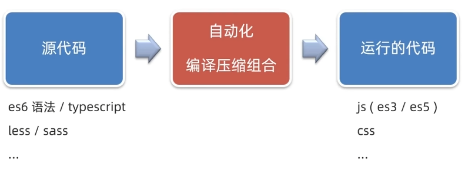

**方式**：用 ES6/TS 写逻辑，Less/Sass 写样式，通过 **webpack 编译** 成浏览器支持的 ES5、CSS

**问题**：

+ webpack 配置复杂（需配 loader、插件、环境等）；
+ 每个项目都要重复写基础配置，缺乏 **标准化**；

**需要一个工具，自动生成标准化的 webpack 配置！**

## Vue CLI 脚手架  
Vue 官方提供的 **全局命令行工具**，帮我们快速创建 **标准化的 Vue 项目架子**（内置成熟的 webpack 配置、开发工具链）

**核心价值**

+ **开箱即用**：零配置启动开发，无需手动写 webpack 配置；
+ **内置工具链**：自动集成 Babel（转译 ES6→ES5）、ESLint（代码校验）等；
+ **标准化**：统一项目结构，团队协作更高效

**Vue CLI 使用步骤全局安装（仅需一次）**

```bash
# 方式1：yarn 安装  
yarn global add @vue/cli  

# 方式2：npm 安装  
npm i @vue/cli -g
```

**检查是否安装成功**

```bash
vue --version  # 输出版本号则成功（如：@vue/cli 5.0.8）
```

**创建项目架子**

```bash
cd:需要创建的目录，或在目录中运行cmd
vue create project-name  # project-name 不能用中文

Vue CLI v5.0.8
请选择一个预设：
? Please pick a preset:
  Default ([Vue 3] babel, eslint)
> Default ([Vue 2] babel, eslint)
  Manually select features

```

**交互选择**：

+ 选 `Default`（默认，快速创建，含 babel + eslint）；
+ 或选 `Manually select features`（手动选特性，如 TS、Router 等）

**启动开发环境**

进入项目目录，运行：

```bash
🎉  Successfully created project vue-clidemo.
👉  Get started with the following commands:

 $ cd vue-clidemo
 $ npm run serve

 PS H:\WorkSpace\Vue\vue2\vue-clidemo> npm run serve

> vue-clidemo@0.1.0 serve
> vue-cli-service serve

 INFO  Starting development server...

 DONE  Compiled successfully in 2418ms                                                              11:03:44

  App running at:
  - Local:   http://localhost:8080/ 
  - Network: unavailable

  Note that the development build is not optimized.
  To create a production build, run npm run build.
```

启动后访问 `http://localhost:8080` 即可看到项目运行

<!-- 这是一张图片，ocr 内容为： -->


## Vue CLI 项目结构解析
```plain
vue-demo  
├─ node_modules       # 第三方依赖包（yarn/npm 安装的包）  
├─ public             # 静态 HTML 目录（浏览器直接访问的文件）  
│  ├─ favicon.ico     # 网站图标  
│  └─ index.html      # 模板文件 ❗ 最终页面的容器（Vue 会挂载到这里）  
├─ src                # 源码目录 ❗ 开发的核心目录  
│  ├─ assets          # 静态资源（图片、字体等，会被 webpack 处理）  
│  ├─ components      # 通用组件（可复用的 Vue 组件，如 Button、Card）  
│  ├─ App.vue         # 根组件 ❗ 项目的“总入口组件”，承载页面内容  
│  └─ main.js         # 入口文件 ❗ 项目运行时第一个执行的文件（初始化 Vue 实例）  
├─ .gitignore         # Git 忽略规则（如 node_modules 不提交）  
├─ babel.config.js    # Babel 配置（转译 ES6→ES5）  
├─ package.json       # 项目配置 ❗ 含依赖、脚本命令（如 serve、build）  
├─ vue.config.js      # Vue CLI 自定义配置（可选，覆盖默认 webpack 配置）  
└─ yarn.lock          # yarn 锁文件（锁定依赖版本，保证环境一致）
```

**关键文件的运行逻辑：main.js**：创建 Vue 实例，挂载 **App.vue** 到页面

（如 `new Vue({ render: h => h(App) }).$mount('#app')`）

**App.vue**：编写页面的核心结构（可引入 `components` 里的组件）

**public/index.html**：提供挂载点（如 `<div id="app"></div>`），最终 Vue 会把 `App.vue` 渲染到这里

## 项目运行流程  

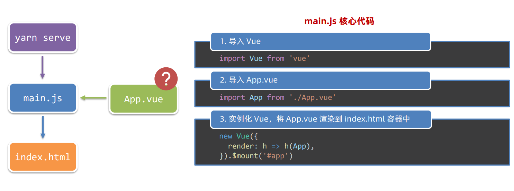

# 组件化开发
## 组件概念
可复用的 Vue 实例，独立作用域，拆分页面、提高复用性

**核心定义**：将复杂页面拆分为 **独立组件**，每个组件封装：

+ **结构**（HTML 模板）
+ **样式**（CSS/Less/Sass）
+ **行为**（JS 逻辑）

**类比**：拼乐高 —— 每个组件是 “积木”，根组件是 “底座”，组合出完整页面

| **场景** | **传统开发（无组件）** | **组件化开发** |
| :--- | :--- | :--- |
| 功能修改 | 改一处需全局搜索，易牵一发而动全身 | 仅修改对应组件，影响范围可控 |
| 功能复用 | 复制粘贴代码，冗余且难维护 | 组件可跨页面复用，改一处全更新 |
| 团队协作 | 多人改同一文件，冲突频发 | 分工开发不同组件，并行效率高 |


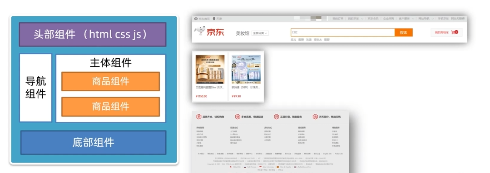

## 组件结构
一个 Vue 应用是 **组件树**：

根组件（`App.vue`）→ 子组件（如 `Header.vue`）→ 孙组件（如 `Button.vue`）

+ **普通组件**：负责局部功能（如 `Button.vue`、`Card.vue`）
+ **根组件**：应用最顶层的组件（如 `App.vue`），**包裹所有普通组件**，是项目的 “入口容器”

## 根组件 App.vue
**定位**：整个应用的 **顶层容器**，所有普通组件最终都嵌套在它内部


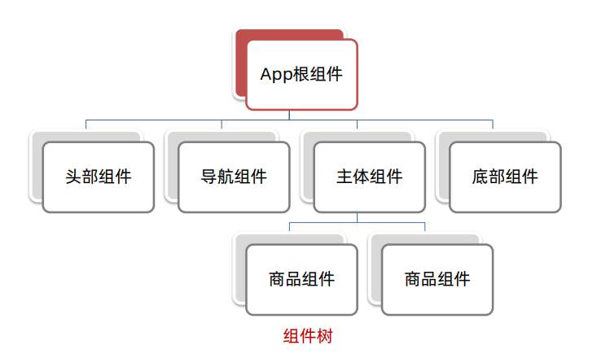

## 组件定义
Vue 中，组件以 **.vue 单文件** 形式存在，必须包含以下三部分：


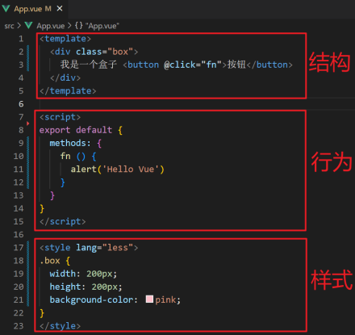

### template：结构层（HTML 模板）
**作用**：编写组件的 DOM 结构，支持 Vue 指令（如 `v-if`、`@click`）

**强制规则**：

+ **Vue 2**：必须有 **唯一根元素（如 `<div>` 包裹所有内容）；**
+ **Vue 3**：支持**多根元素（Fragment**），但实际开发仍**建议单根（避免布局混乱）**

```html
<template>
  <div class="app-container"> <!-- 唯一根元素 -->
    <h1>{{ title }}</h1>
    <button @click="sayHi">点击测试</button>
  </div>
</template>
```

### script：行为层（JS 逻辑）
**作用**：编写组件的 **数据、方法、生命周期**等逻辑，需导出一个 **组件配置对象**

```html
<script>
  // 导出当前组件的配置项
  // 里面可以提供数据data、methods、watch、computed、生命周期等
  export default {
    // 响应式数据
    data() { 
      return { title: '根组件示例' } 
    },
    // 方法
    methods: {
      sayHi() { alert('Hello from App.vue!') }
    }
  };
</script>
```

> **el 根实例独有, data 是一个函数, 其他配置项一致**
>
> **一个组件的 data 必须是一个函数，保证每个组件实例维护独立的一份数据对象**
>
> <strong> 每次创建新的组件实例，都会新执行一次 data 函数，得到一个新对象</strong>


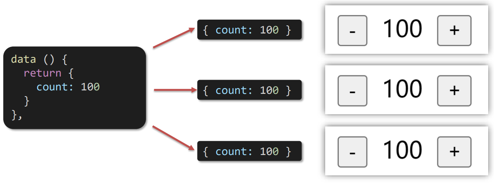

```html
<template>
  <div class="base-count">
    <button @click="count--">-</button>
    <span>{{count}}</span>
    <button @click="count++">+</button>
  </div>
</template>

<script>
export default {
  // data()函数,维护独立数据对象
  data() {
    return {
      count: 999
    }
  },
}
</script>
```

```html
<template>
  <div class="hm-main">
    我是主题组件
      <HmButton></HmButton>
      <BaseCount></BaseCount>
      <BaseCount></BaseCount>
      <BaseCount></BaseCount>
  </div>
</template>
```


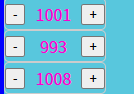

### style：样式层（CSS/Less/Sass）
> **全局样式**：编写组件的样式，默认组件中的样式**会作用到全局**，容易造成样式冲突
>
> **局部样式：组件添加 scoped 属性的 style 样式，只作用于当前组件**
>
> “scoped” 是 “scope” 的过去式和过去分词形式。常见含义为 “使受特定范围限制；限定…… 的范围” 。例如在编程领域，它常用来描述变量等具有特定的作用域，即变量的有效范围被限定在某个代码块内
>
> **推荐使用时添加 scoped 作为局部样式scoped 原理：**

+ 给当前组价内所有元素，都会被添加上一个**自定义属性 data-v-hash 值**区分不同组件


  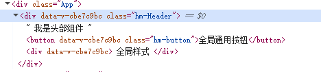

+ css 选择器后面被自动处理添加上了**属性选择器 div[data-v-hash]**

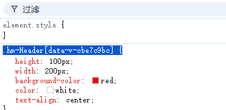

```html
<!-- hm-Header部分 -->
<template>>
  <div>
    全局样式
  </div>
</template>
<script> </script>
<!-- 全局样式会影响所有组件div -->
<style>
div{
  color: rgb(249, 0, 208);
}
</style>

--------------------------------- 
```

组件添加**scoped** 属性的 style 样式，只作用于**当前组件**

```html
<template>
  <div>
    局部样式
  </div>
</template>

<script></script>

<style scoped>
div{
  color: aqua;
}
</style>
```

**扩展：支持 Less**（需两步）：  

① 在 `<style>` 标签添加 `lang="less"`：

```css
<style lang="less">
.app-container {
  h1 { color: red; } // Less 嵌套语法
  button { 
    background: pink; 
    &:hover { background: red; } // 伪类嵌套
  }
}
</style>
```

② 安装依赖（项目根目录执行）：

```bash
yarn add less less-loader  # 或 npm install less less-loader
```

> 注意
>
> + 一个项目通常只有 **一个根组件（App.vue）** ，是所有组件的 “入口”
> + `<template>` 必须有 **唯一根元素**（Vue 2 强制，Vue 3 支持多根但建议单根）
> + `<script>` 需导出 **组件配置对象**（包含 `data`、`methods` 等选项）
> + `<style scoped>`：样式仅作用于当前组件（避免全局污染）
> + VSCode 需安装 **Volar** 插件（替代旧版 Vetur），实现 `.vue` 文件的语法高亮和智能提示

## 样式穿透（深度作用选择器）
### 核心说明
scoped 样式默认无法修改子组件 / 第三方组件样式，需穿透打破限制

### 三种穿透语法
`>>> `

+ 适用于非预处理器，如原生 CSS
+ 例如 `.parent >>> .child { ... }`

`::v-deepVue` 

+ 官方推荐，适配所有预处理器，兼容性最优，主流方案
+ 例如 `.parent ::v - deep .child { ... }`

`/deep/`

+ 旧版兼容语法，支持预处理器，新项目不推荐

### 穿透场景示例
修改子组件样式（Less/Sass）

```html
<style lang="less" scoped>
  .parent-box{
    // 主流写法
    ::v-deep(.child-class){
      color: blue;
      font-size: 16px;
    }
  }
</style>
```

修改第三方 UI 组件

```html
<style lang="less" scoped>
  ::v-deep(.el-button){
    background: orange;
    border-color: orange;
  }
</style>
```

原生 CSS 穿透

```html
<style scoped>
  .parent-box >>> .child-class{
    color: red;
  }
</style>
```

旧版兼容写法

```html
<style lang="less" scoped>
  .parent-box /deep/ .child-class{
    color: green;
  }
</style>
```

## 组件注册  
创建 .vue 文件 (三个组成部分)  

组件名规范：**大驼峰命名法**，如：HmHeader  

当成<strong> html 标签</strong>使用  **`<组件名>`   `< /  组件名>`  一般都用局部注册，如果发现确实是通用组件，再定义到全局**

组件需要注册后才能使用，有两种注册方式：

### 全局注册
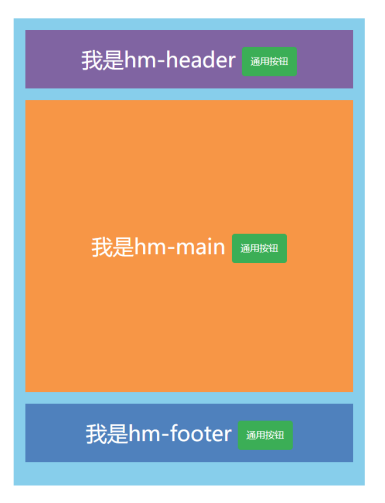
**特点**：**注册后可在应用内任意组件中使用方法**：在**main.js**中使用**app.component()**

**使用**：在任何组件的template中直接使用 `<HmButton></HmButton>`

```javascript
//main.js
// 导入组件
import HmButton from "./components/HmButton.vue";
// 全局注册组件
Vue.component("HmButton", HmButton);
```

```html
// HmFooter.vue
<template>
  <div class="hm-Footer">
    我是尾部组件
    <HmButton></HmButton>
  </div>

</template>
```

### 局部注册

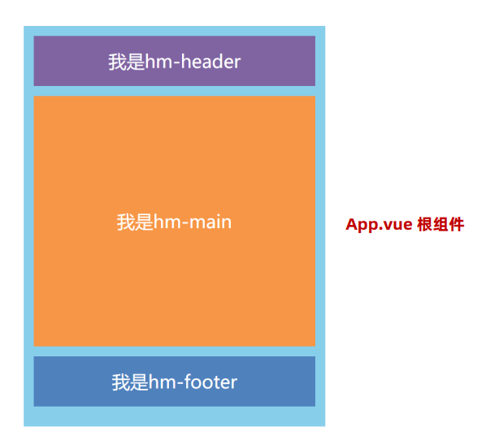

**特点**：**只在当前组件内可用方法**：在父组件的**components**选项中注册

**使用**：在当前组件的template中当做 html 标签进行使用

```html
<template>
  <div class="App">
    <!-- 头部组件 -->
    <HmHeader></HmHeader>
    <!-- 主体组件 -->
    <HmMain></HmMain>
    <!-- 尾部组件 -->
    <HmFooter></HmFooter>
  </div>
</template>
<script>
// 引入组件
import HmHeader from './components/HmHeader.vue'
import HmMain from './components/HmMain.vue'
import HmFooter from './components/HmFooter.vue'
export default {
  components: {
    HmHeader: HmHeader, // 可简写为 HmHeader,
    HmMain,
    HmFooter
  }
}
</script>
```

## 综合案例 -小兔仙儿

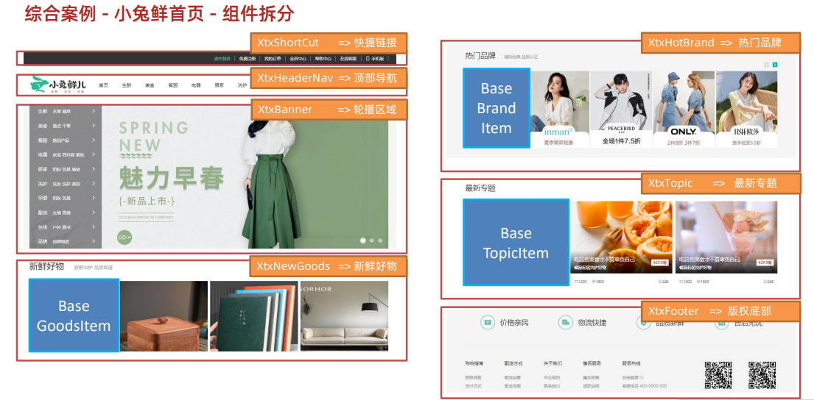

 页面开发思路： 

1. 分析页面，按模块拆分组件，搭架子 (局部或全局注册) 

2. 根据设计图，编写组件 html 结构 css 样式 (已准备好) 

3. 拆分封装通用小组件 (局部或全局注册) 将来 → 通过 js 动态渲染，实现功能  

# kebab-case 命名规范
## kebab-case
kebab-case 是一种命名规范，**用连字符（`-`）连接小写字母**，例如 `my-component`、`user-name`，也称为短横线命名法

在 Vue 中，kebab-case 主要用于模板和 HTML 相关的命名

| 在模板中 (HTML) | 在 JavaScript 中 |
| --- | --- |
| kebab-case | camelCase |

+ 模板中写成 `:my-prop-name="value"`
+ 子组件中接收为 `myPropName`

## 组件命名规范
**单文件组件命名**：

+ 在 JavaScript 中推荐使用驼峰式（PascalCase），如 `MyComponent.vue`
+ 在模板中引用时，可使用 kebab-case（`<my-component>`）或驼峰式（`<MyComponent>`），但推荐 kebab-case 保持与 HTML 一致

```html
<!-- MyComponent.vue -->
<template>
  <div>这是一个组件</div>
</template>

<script>
export default {
  name: 'MyComponent' // 推荐声明 name 选项
}
</script>

<!-- 在父组件中引用 -->
<my-component></my-component> <!-- kebab-case 推荐 -->
<MyComponent></MyComponent> <!-- 驼峰式也可，但不推荐 -->
```

**匿名组件命名**：  

如果组件未通过 `name` 选项声明，在 DevTools 中会显示为 `无名氏`，建议始终声明 `name`

## props 与模板属性
JavaScript 中 **props 用驼峰式（camelCase）** ，**模板中用 kebab-case：**

+ 子组件 props 接收建议使用 camelCase，例如：

```javascript
props: {
  fatherCount: Number
}
```

+ 父组件模板中使用 kebab-case，例如：

```html
<SonComponent :father-count="fatherCount" />
```

这样可以确保在模板和 JS 中都能正确匹配

Vue 会自动将 kebab-case 的模板属性转换为驼峰式的 props，无需手动处理

> 注意！
>
> 在 Vue 模板中，`v-for`、`v-if`、`{{ }}` 插值等表达式的内容是 JavaScript 表达式，而不是 HTML 属性
>
> 因此它们遵循 JavaScript 的命名规则，而 JavaScript 不支持 kebab-case 变量名

```vue
 v-for="(task,index) in taskList"
```

## 事件名称
**自定义事件**在 JavaScript 中用驼峰式，**模板中用 kebab-case：**

```html
<template>
  <!-- 模板中用 kebab-case 监听自定义事件 -->
  <child-component @custom-event="handleEvent"></child-component>
</template>

<script>
export default {
  methods: {
    handleEvent() {
      // 处理事件
    }
  }
}
</script>

// 子组件中触发事件
this.$emit('customEvent') // 驼峰式
```

## HTML 兼容性
+ HTML 标签和属性名不区分大小写，kebab-case 是 HTML 的标准命名方式
+ 原生 HTML 中没有 `myProp` 这样的属性，只有 `my-prop`，因此 Vue 模板遵循这一规范

## 最佳实践
+ **组件命名**：单文件组件用 PascalCase（驼峰式），模板中用 kebab-case 引用
+ **props / 事件命名**：JavaScript 中用 camelCase，模板中用 kebab-case
+ **保持一致性**：团队开发时统一命名规范，可通过 ESLint 规则强制
+ **工具支持**：Vue CLI 创建组件时会自动生成 kebab-case 的文件名，但单文件组件内部仍用 PascalCase

注意事项

+ 在单文件组件的 `<script>` 中，组件名建议使用 PascalCase（如 `MyComponent`），便于代码阅读和 IDE 支持
+ 在字符串模板（如通过 `h` 函数创建组件）中，组件名需与注册时一致，通常用 PascalCase
+ 若使用 JSX 语法，组件名必须用 PascalCase，因为 JSX 遵循 React 的命名规范

  

通过合理使用 kebab-case，可使 Vue 模板更符合 HTML 标准，提高代码的可读性和团队协作效率。

# 组件通信
## 组件通信的本质
**定义**：组件之间的数据传递（组件数据相互独立，无法直接访问，需通过通信机制交互）

**核心矛盾**：

+ 组件化让功能解耦，但也导致**数据隔离**（如头部组件的用户信息，需传给内容组件）
+ 需通过通信实现 **数据共享**（购物车数量）、**交互联动**（开关控制弹窗）

## 组件关系
组件在应用中形成**组件树**，关系决定通信方案：

**父子关系**

+ **结构**：父组件直接嵌套子组件（如 `App.vue` → `Header.vue`）
+ **特点**：层级明确，直接关联

**非父子关系**

+ **兄弟关系**：同一父组件的子组件（如 `Header.vue` 和 `Footer.vue`）
+ **跨层级关系**：祖先 → 后代（中间隔多层，如曾祖父 → 孙子组件）
+ **特点**：层级复杂，无法直接传递


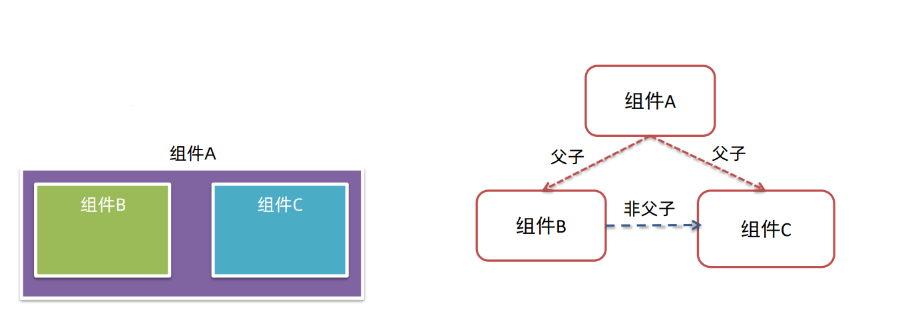

## 父子组件通信 

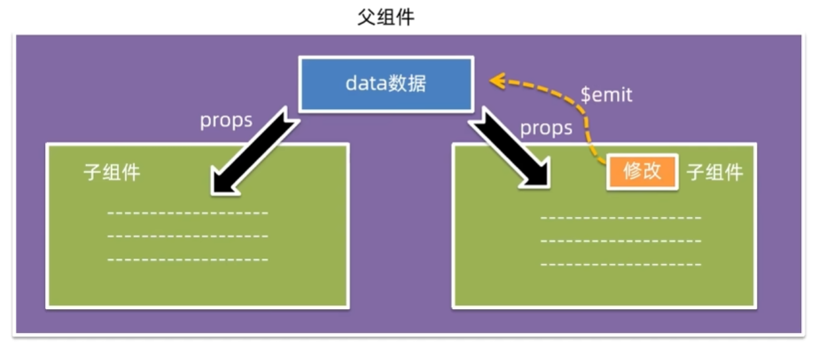

**props +  $emit逻辑**：

+ **父 → 子**：父通过 **props** 传数据 **（单向流入）**
+ **子 → 父**：子通过 **$emit** 触发事件，通知父修改数据 **（反向通知）**

## 父传子通信（props）
“props” 是 “properties” 的缩写，原意是 “属性、特性、性质”（复数形式）,在编程尤其是前端开发框架（如 React 等）中，它用于实现父组件向子组件传递数据 

**父组件**

给当前组件标签，**v-bind ----- : 属性名="属性值 "添加属性**方式传值

```html
<!-- 父组件 -->
<template>
  <!-- 1. 给当前组件标签，已添加属性方式传值 -->
  <!-- 传动态数据 parentMsg 和静态值 10 -->
  <Child :message="parentMsg" :count="10" /> 
</template>

<script>
import Child from './Child.vue';
export default {
  components: { Child },
  // 数据
  data() {
    return { parentMsg: '父组件的数据' };
  }
};
</script>

```

**子组件**

子组件通过` props`接受，属性名需要和父组件标签属性值一样

```vue
<!-- 子组件 -->
<template>
  <!-- 3. 页面渲染使用 -->
  <div>{{ message }} - {{ count }}</div>
</template>

<script>
export default {
  // 2. 子组件通过 props接受，属性名需要和父组件标签属性值一样
  props: { 
    message: String, // 类型校验（必填，字符串）
    count: {
      type: Number,
      default: 0 // 默认值（非必填时生效）
    }
  }
};
</script>
```

## 子传父通信（$emit）
“emit” 常见的意思为 “发出；射出；散发（光、热、声音、气味等）”

子组件**无法直接修改**来自父组件的数据，**需要通知父组件，让父组件修改数据**

修改后的数据再流向子组件

1. **$emit 触发事件**，给父组件发送消息通知
2. 父组件监听事件
3. 提供处理函数，形参中获取参数

```vue
<!-- 子组件 -->
<template>
  <button @click="sendToParent">传值给父组件</button>
</template>

<script>
export default {
  methods: {
    sendToParent() {
      // 触发自定义事件 'child-event'，携带数据
      this.$emit('child-event', '子组件的数据', 100); 
    }
  }
};
</script>

<!-- 父组件  -->
<template>
  <!-- 监听子组件的 'child-event' 事件 -->
  <Child @child-event="handleEvent" /> 
</template>

<script>
import Child from './Child.vue';
export default {
  components: { Child },
  methods: {
    handleEvent(data, num) {
      console.log(data, num); // 输出：子组件的数据 100
    }
  }
};
</script>
```

> **关键规则**：
>
> + 子组件 **不能直接修改 props**（props 是只读的，强行修改会报错）；
> + 必须通过 `$emit` 让父组件修改 **数据源**（遵循 **单向数据流**，保证数据可追溯）

## prop 概念
在编程领域，prop 是 “property” 的缩写，常译为 “属性”，用于描述对象的特征或特性

Prop 是**子组件上注册的自定义属性**，专门用于**接收父组件传递的数据**

实现**父组件 → 子组件**的**单向数据传递**（父传子）

prop 特点： 

+ 传递**任意数量**：父组件可给子组件传多个 Prop
+ 传递**任意类型**：支持字符串、数字、对象、数组、布尔值，甚至函数


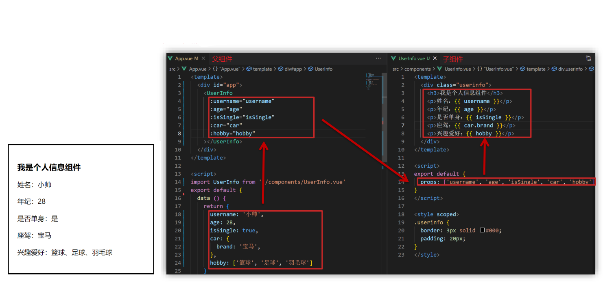

## 使用流程
**步骤 1：子组件 声明 Props**

在子组件的 `props` 选项中定义接收的属性（两种写法）：

```html
<!-- 写法 1：简单数组（仅声明名称，无校验） -->
<script>
export default {
  props: ['username', 'age']
}
</script>

<!-- 写法 2：对象（支持校验，推荐！） -->
<script>
export default {
  props: {
    username: String, // 类型校验
    age: {
      type: Number,
      required: true, // 非空校验
      default: 18,    // 默认值（非必填时生效）
      validator: val => val >= 0 // 自定义校验
    }
  }
}
</script>
```

**步骤 2：父组件 传递 Prop**

在子组件标签上，通过 `:prop(属性名）` 绑定数据（动态传值），或直接写值（静态传值）：

```html
<!-- 父组件 Parent.vue -->
<template>
  <!-- 动态传值（绑定父组件的 data） -->
  <Child 
    :username="parentName" 
    :age="parentAge" 
  />  

  <!-- 静态传值（直接写固定值） -->
  <Child username="小帅" age="28" /> 
</template>

<script>
import Child from './Child.vue';
export default {
  components: { Child },
  data() {
    return {
      parentName: '小帅',
      parentAge: 28
    }
  }
}
</script>
```

## Props 校验
**如果父组件传的 `prop` 类型、格式错误，子组件逻辑可能崩溃**

校验能 **在控制台报错**，快速定位问题

**四种校验方式（对象写法）类型校验：限制数据类型**

强制 Prop 的数据类型（如数字、字符串），防止父组件传错类型导致逻辑错误

```javascript
props: {
  age: Number // 要求 age 必须是数字类型
}
```

支持的类型：

`String`、`Number`、`Boolean`、`Array`、`Object`、`Date`、`Function`、`Symbol`

**非空校验：标记必填项**

强制父组件 **必须传递该 Prop**，否则开发环境报错（提醒漏传问题）

```javascript
props: {
  name: {
    type: String,    // 先指定类型
    required: true   // 标记为必填
  }
}
```

+ 若 `required: true` 但父组件未传，控制台会报错
+ 通常和 **默认值** 互斥（必填项不需要默认值）

**默认值：处理未传场景**

父组件未传递 Prop 时，自动使用 **默认值** 兜底，避免 undefined 错误

```javascript
props: {
  gender: {
    type: String,
    default: 'male' // 未传时，gender 默认是 'male'
  }
}
```

+ **基本类型**（String/Number 等）：直接写值（如 `default: 'male'`）
+ **复杂类型**（Object/Array）：必须用 **函数返回值**（避免所有实例共享同一对象）

```javascript
props: {
  user: {
    type: Object,
    default: () => ({ name: '匿名', age: 18 }) 
  }
}
```

**自定义校验：复杂规则验证**

处理 **类型 + 范围 / 格式** 等复杂校验（如 “分数必须 0~100”“密码含大写字母”）

```javascript
props: {
  score: {
    type: Number,
      validator: (val) => { 
      return val >= 0 && val <= 100; // 返回 true 则通过校验
    }
  }
}
```

逻辑说明

+ **validator** 是一个函数，参数 `val` 是父组件传入的值
+ “validator” 常见意思为 “验证者；检验器；审定者” 。在计算机领域，常指用于验证数据是否符合特定规则或格式的程序、函数或模块等，比如在数据输入时，validator 可检查输入数据是否有效，像邮箱格式是否正确等；
+ 返回 `true`：校验通过；返回 `false`：控制台报错（提示数据非法）

> 注意事项
>
> + **执行顺序**：类型校验 → 自定义校验 → 非空校验 → 默认值赋值
> + **报错场景**：任意校验失败，Vue 会在**开发环境控制台** 抛出错误（生产环境忽略，避免影响用户）
> + **必写类型校验**：至少给每个 Prop 加 `type`，拦截低级错误
> + **默认值覆盖边缘场景**：如分页组件的 `pageSize` 默认值设为 `10`
> + **复杂规则用自定义校验**：如手机号格式、日期范围等，减少业务层的判断逻辑

```html
<script>
export default {
  props:{
    username: String,
    age:{
      // 类型校验
      type: Number,
      // 默认值
      default: 18,
      // 非空值校验
      required: true,
      // 自定义校验
      validator(value) {
        return value > 18
      }
    },
    gender : String,
    hobby : Array,
    address : Object
  },
}
</script>
```

## Prop vs Data
都可以给组件提供数据

| **特性** | **Data 里的数据** | **Prop 里的数据** |
| :--- | :--- | :--- |
| **数据归属** | 组件 **自己的** 数据 | 父组件 **传递的外部数据** |
| **修改权限** | 可以直接修改（`this.xxx = ...`） | **禁止直接修改**！（会报错） |
| **响应式** | 都是响应式（数据变，视图更） | 同上 |

## 单向数据流
> 父组件的 **Prop 数据**更新后，会**自动向下传递** 给子组件
>
> 但**子组件不能直接修改 Prop 的值**，必须遵循 **“谁的数据谁负责”** ：
>
> + **子组件想修改 Prop → 通知 父组件 去修改（通过 `$emit` 触发事件）**
>
> 保证 **数据流向清晰**：父组件是唯一数据源，子组件只负责展示或 “通知更新”，避免多组件修改同一份数据导致的混乱


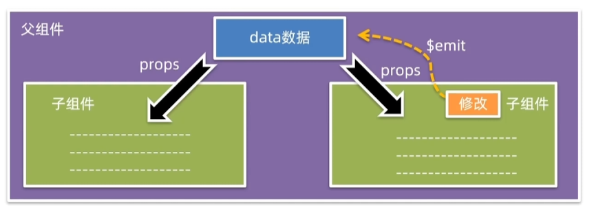

合法修改 Prop 的两种方案

方案 1：复制到 Data（仅用于 “展示型” 修改）

```html
<!-- 子组件：把 Prop 复制到 Data，修改本地副本 -->
<script>
export default {
  props: ['title'],
  data() {
    return { localTitle: this.title }; // 复制 Prop 到 data
  },
  methods: {
    changeTitle() {
      this.localTitle = '新标题'; // 改本地数据，不影响父组件
    }
  }
}
</script>
```

方案 2：通知父组件修改（真正改变数据源）

```html
<!-- 子组件：通过 $emit 通知父组件 -->
<template>
  <button @click="updateTitle">修改标题</button>
</template>
<script>
export default {
  props: ['title'],
  
  methods: {
    updateTitle() {
      // 触发事件，传新值给父组件
      this.$emit('update-title', '新标题'); 
    }
  }
}
</script>

-----------------------------------------------------------
<!-- 父组件：监听事件，修改自己的数据源 -->
<Child 
  :title="parentTitle" 
  
  @update-title="changeTitle" 
/>
<script>
export default {
  data() { return { parentTitle: '旧标题' } },
  methods: {
    changeTitle(newTitle) {
      this.parentTitle = newTitle; // 父组件修改数据，子组件自动更新
    }
  }
}
</script>
```

> 1. **必加类型校验**：至少给每个 Prop 加 `type`，避免传错数据
> 2. **非必填加默认值**：用 `default` 兜底，增强组件鲁棒性
> 3. **永远别直接改 Prop**：遵循单向数据流，通过 `$emit` 让父组件处理更新

## 案例-记事本组件版

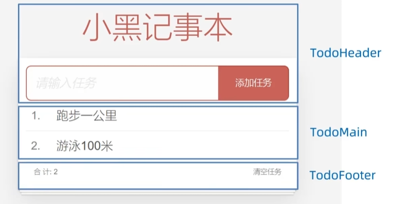

核心步骤：

①拆分基础组件

新建组件→拆分存放结构导入注册使用

②渲染待办任务

提供数据 **(公共父组件）** →父传子传递list→v-for渲染

③添加任务

收集数据v-model→监听事件→子传父传递任务→父组件unshift

④删除任务

监听删除携带id→子传父传递id→父组件filter删除

底部合计和清空功能

底部合计：父传子传递list合计展示

清空功能：监听点击→子传父通知父组件父组件清空

⑥持久化存储：watch监视数据变化，持久化到本地

## 跨层级 provide / inject
（祖 → 后代） 

**逻辑**：

+ 祖先组件通过 `provide` 提供数据；
+ 任意后代组件通过 `inject` 接收数据（无需逐级传递）


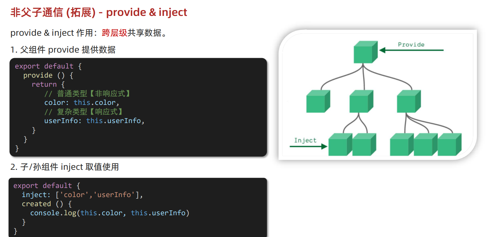

```html
<!-- 祖先组件 GrandParent.vue -->
<template>
  <Parent />
</template>

<script>
import Parent from './Parent.vue';
export default {
  components: { Parent },
  // 提供数据（可传值或方法）
  provide() {
    return {
      ancestorMsg: '祖先的数据',
      updateAncestor: this.updateData 
    };
  },
  data() { return { msg: '初始值' } },
  methods: {
    updateData(newVal) {
      this.msg = newVal; // 实际修改祖先数据
    }
  }
};
</script>

<!-- 后代组件 GrandChild.vue（中间组件无需处理） -->
<template>
  <div>
    {{ ancestorMsg }} 
    <button @click="updateAncestor('新值')">修改祖先数据</button>
  </div>
</template>

<script>
export default {
  inject: ['ancestorMsg', 'updateAncestor'] // 注入数据和方法
};
</script>
```

**注意**：

+ `provide/inject` **默认非响应式**（祖先数据变化，后代不自动更新）；
+ 若需响应式，需提供 **可修改的方法**（如示例中的 `updateAncestor`）或绑定 `data` 中的属性

##  `Event Bus`（事件总线）

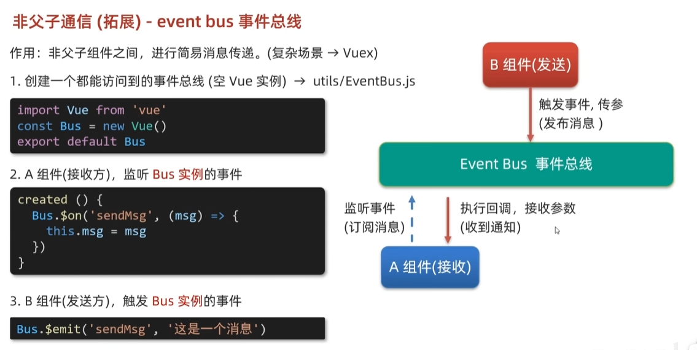

+ 创建 **全局事件总线**（空 Vue 实例）；
+ 发送方用 `$emit` 触发事件，接收方用 `$on` 监听事件

```javascript
// 1. src\utils\EventBus.js 
// 创建事件总线 （空Vue实例）
import Vue from "vue";
const EventBus = new Vue();
export default EventBus;

// 2. src\components\BaseA.vue   接收方
// 在接收方监听EventBus发送的事件
import EventBus from '../utils/EventBus'
export default {
  created(){
    // 在接收方监听EventBus发送的事件
    EventBus.$on('sendBToA',(data)=>{
      console.log('接收到数据：',data)
    })
  }
}

// 3. src\components\BaseB.vue  发送方
<div class="base-b">
  我是组件B （发送）
  <button @click="sendMsg">发送</button>
</div>
import EventBus from '../utils/EventBus'
export default {
  methods: {
    sendMsg(){
      // 触发事件的方式 发送数据给接收方
      EventBus.$emit('sendBToA','B向A发送数据')
    }
  },
}
```

**适用场景**：

+ 小型项目，非父子组件的简单通信；
+ 中大型项目建议用 **Vuex/Pinia**（更规范，支持复杂逻辑）

## `v-model` 组件通信

通过 `v-model` 语法糖，

应用在**输入框**上，是 value属性 和 input事件 的合写  

> 拆解 v-model：
>
> **v-model = v-bind:value + v-on:change/input**
>
> v-on:change  @change="value = $event.target.value" 
>
> v-on:input     @input="value = $event.target.value" 
>
> **如果要实现组件通信，则需要使用v-model拆解  **
>
> **原因：v-model 实现双向绑定，但子组件不能直接改变父组件的数据**
>
> 所以需要使用v-bind:value + v-on:change实现
>
> v-bind:value 获取父组件传递的数据，并绑定给select的value属性
>
> v-on:change 监听select的change事件，并获取select的value属性的值，
>
> 并调用$emit()方法，将数据发送给父组件
>
> 复选框（checkbox）和单选按钮（radio）：使用 **:checked + @change**
>
> 下拉框（select）和文本框（input[type=text]）：使用 **:value + @input**

> 拆分v-model后`$emit()`方法名要在**文本框与下拉框**使用**input**，在**复选框**使用**change**

数据变，视图跟着变：**value**

视图变，数据跟着变：**@input  、@change**

 注意：$event 用于在模板中，获取事件的形参  

```vue
<template>
  <div id="app" >
    <input v-model="msg" type="text">
    <input :value="msg" @input="msg = $event.target.value" type="text">
  </div>
</template>
<!-- 父组件写 v-model -->
<BaseSelect v-model="selectId" /> 

<!-- 等价于（Vue2 规则） -->
<BaseSelect :value="selectId" @input="selectId = $event" />
```

**Select 复选框双向绑定（`props` + `$emit`）**

父组件传值（父 → 子）

+ 父组件通过 `props` 向子组件传递初始数据（ `cityId`）

```html
<base-select
  :city-id="cityId"
  @update-value="handleChangeCityId"
> 
</base-select>

data() {
    cityId:'10003',
  };
},
  
methods:{
  handleChangeCityId(newCityId){
    this.cityId = newCityId
  }
}
```

子组件通知更新（子 → 父）：

+ 子组件监听输入事件（ `change`），通过 **$emit 触发自定义事件**，将新值传给父组件

```html
<!-- 拆解v-model
  v-model = v-bind:value + v-on:change
  v-on:change  @input="value = $event.target.value" 
  如果要实现组件通信，则需要使用v-model拆解
  原因：v-model 实现双向绑定，但子组件不能改变父组件的数据，
  所以需要使用v-bind:value + v-on:change实现
  v-bind:value 获取父组件传递的数据，并绑定给select的value属性
  v-on:change 监听select的change事件，并获取select的value属性的值，
  并调用$emit()方法，将数据发送给父组件
-->
<select name="" id="" :value="cityId" @change="handleChange">
  <option value="10001">北京</option>
  <option value="10002">上海</option>
  <option value="10003">广州</option>
  <option value="10004">深圳</option>
</select>

  
props: {
  // 父组件 props接受名要使用value
  cityId: String
},
methods: {
  handleChange(e) {
    this.$emit('update-value', e.target.value)
  },
}
```

**v-model 语法糖**

> **子组件 $meit()方法名要使用input (下拉框）**
>
> **父组件 props接受名要使用 value**

父组件传值

+ 绑定到子组件的 **value props**；

```html
<!-- v-model简化-->
 <base-select-two v-model="cityId"></base-select-two>
```

子组件触发更新

+ 自动监听 **input 事件**，更新父组件数据

```html
  <!-- 父组件 props接受名要使用value -->
  <select name="" id="" :value="value" @change="handleChange2">
    <option value="10001">北京</option>
    <option value="10002">上海</option>
    <option value="10003">广州</option>
    <option value="10004">深圳</option>
  </select>
<script>
props: {
  // 父组件 props接受名要使用value
  value: String
},
methods: {
  // 父组件 $emit()方法名要使用input
  handleChange2(e){
    this.$emit('input', e.target.value)
  }

</script>

```

**Input 输入框子组件约定**：

+ 用 **value** 接收父组件数据（`props` 声明 `value`）
+ 触发 **input 事件** 传递新值（`this.$emit('input', 新值)`）

```html
<template>
  <input :value="value" @input="handleInput" placeholder="请输入..." />
</template>

<script>
export default {
  props: {
    value: String
  },
  methods: {
    handleInput(e) {
      this.$emit('input', e.target.value)
    }
  }
}
</script>
```

**父组件使用**：

+ 直接用 `v-model` 绑定数据，替代 `:value + @input`

```html
<!-- 父组件：Parent.vue -->
<template>
  <BaseInput v-model="username" />
  <p>你输入的内容：{{ username }}</p>
</template>

<script>
import BaseInput from './BaseInput.vue'
export default {
  components: { BaseInput },
  data() {
    return { username: '' }
  }
}
</script>
```

## .sync 修饰符
灵活的双向绑定

**实现 父子组件数据双向同步，且支持自定义属性名**

**突破 v-model 的 prop 属性名必须为 `value` 限制**

**本质是 `:属性名` + `@update:属性名` 的语法糖：**

```html
<!-- 父组件写法 -->
<BaseDialog :visible.sync="isShow" /> 

<!-- 等价于 -->
<BaseDialog :visible="isShow" @update:visible="isShow = $event" />
```

**典型场景：弹窗组件（控制显示 / 隐藏）**

```html
<!-- 子组件：BaseDialog.vue -->
<template>
  <div v-if="visible" class="dialog">...</div>
</template>
<script>
export default {
  props: { visible: Boolean },
  methods: {
    closeDialog() {
      // 触发更新，通知父组件修改 isShow
      this.$emit('update:visible', false) 
    }
  }
}
</script>

<!-- 父组件 -->
<template>
  <BaseDialog :visible.sync="isShow" />
  <button @click="isShow = true">打开弹窗</button>
</template>

data(){
  return{
    isVisible: false
  }
}
```

## ref & $refs
精准获取 DOM / 组件实例

**ref & $refs** 查询**当前组件内**，精准获取 **DOM 元素** 或 **子组件实例**

**document.querySelector** 查询**整个页面**不安全，容易全局污染

**场景 1：获取 DOM（操作 DOM 行为，如 ECharts 初始化）**

```html
<template>
  <!-- 1. 给 DOM 加 ref 属性 -->
  <div ref="chartRef"></div> 
</template>
<script>
export default {
  // mounted dom元素渲染后调用
  mounted() {
    // 2. 组件挂载后（DOM 已渲染），通过 $refs 获取
    const dom = this.$refs.chartRef 
    console.log(dom) // <div> 元素
  }
}
</script>
```

**场景 2：获取子组件（调用子组件方法）**

```html
<template>
  <!-- 1. 给子组件加 ref 属性 -->
  <BaseForm ref="formRef"></BaseForm> 
  <button @click="submitForm">提交</button>
</template>
<script>
import BaseForm from './BaseForm.vue'
export default {
  components: { BaseForm },
  methods: {
    submitForm() {
      // 2. 调用子组件的方法（需子组件暴露方法，如 defineExpose）
      this.$refs.formRef.validate() 
    }
  }
}
</script>

<!-- 子组件：BaseForm.vue（需暴露方法） -->
<script setup>
// Vue3 需显式暴露方法（Vue2 自动暴露）
defineExpose({ validate }) 

const validate = () => { ... }
</script>
```

# Vue 异步更新 & $nextTick
解决 DOM 延迟问题

Vue **异步更新 DOM**（批量更新，提升性能），导致 “数据改了，但 DOM 没立刻更新”

## $nextTick 原理
`$nextTick` 是 Vue 用来异步延迟执行回调的方法，确保回调在DOM 更新完成后执行

1. Vue 异步更新队列Vue 为性能优化，数据变更不会立刻更新 DOM，而是把数据变更推入异步队列，同一事件循环内多次修改数据会合并，等本轮宏任务结束后，再统一更新 DOM
2. 事件循环机制分为宏任务、微任务：
+ 主线程同步代码 → 执行微任务队列 → 再执行下一轮宏任务
+ `nextTick` 优先使用微任务（`Promise.then`/`MutationObserver`），降级用宏任务（`setTimeout`）
3. 执行流程
4. 修改响应式数据 → 触发更新，但 DOM 未变；
5. 把 `nextTick` 回调存入队列；
6. 本轮同步代码执行完毕；
7. 执行微任务，先完成 DOM 批量更新，再执行 `nextTick` 里的回调；
8. 此时回调内可拿到最新 DOM
9. 使用场景修改数据后立即操作 / 获取 DOM，必须放在 `$nextTick` 回调中

```html
<template>
  <input v-if="isShowEdit" ref="inp" />
  <button @click="showEdit">编辑</button>
</template>
<script>
export default {
  data() { return { isShowEdit: false } },
  methods: {
    showEdit() {
      this.isShowEdit = true 
      // ❌ 直接调用：此时输入框还没渲染，focus 会失败！
      // this.$refs.inp.focus() 

      // ✅ 正确：等 DOM 更新后，再执行聚焦
      this.$nextTick(() => { 
        this.$refs.inp.focus()
      })
      // 定时器不精准，但也可以做到输入框聚焦
      setTimeout(() => {
        this.isShowEdit = false
      }, 3000)
    }
  }
}
</script>
```

  

# 自定义指令
**指令（Directives）** 是 `Vue` 提供的**特殊属性**，用于在模板中声明式地**操作DOM行为**（如样式、事件、属性等）

**指令分类**

+ **内置指令**：`v - bind`、`v - on`、`v - if`、`v - for` 等（Vue 官方提供）
+ **自定义指令**：开发者根据需求创建的指令（如 `v - focus`、`v - permission`）

当**某个 DOM 操作**需要在**多个组件中重复使用**时，可封装为自定义指令

**常见场景：**

+ 自动聚焦（如表单输入框）
+ 权限控制（如按钮级别的权限隐藏）
+ 防抖 / 节流（如高频点击事件）
+ 拖拽功能（如元素可拖动）
+ 图片懒加载（如长列表图片优化）

## 基础语法
**创建和注册自定义指令全局注册（项目所有组件可用）**

在 `main.ts` 中通过 `app.directive()` 注册：

“directive” 常见含义为 “指令；指示；命令”，作名词使用

例如在工作场景中，上级会给下级发布 directive（指令），要求完成特定任务；

在技术领域，程序员会遵循特定的编程 directive（指令）来编写代码

```typescript
// main.js
import Vue from 'vue'
import App from './App.vue'

// 全局注册自定义指令
Vue.directive('focus', {
  // “inserted” 当指令绑定的元素插入到 DOM 中时...
  inserted: function (el) {
    el.focus() // 让元素自动获取焦点
  }
})

new Vue({
  render: h => h(App)
}).$mount('#app')

```

```html
<template>
  <!-- 输入框加载后自动聚焦 -->
  <input v-focus type="text" /> 
</template>
```

**局部注册（仅当前组件可用）**

在组件的 `directives` 选项中注册：

**指令名：{指令配置项}**

```html
<template>
  <div id="app">
    <!-- 1. 自动聚焦指令：v-focus -->
    <h3>自动聚焦示例</h3>
    <input v-focus type="text" placeholder="页面加载后自动聚焦">
    
    <!-- 2. 颜色指令：v-color="颜色值" -->
    <h3 v-color="'red'">红色标题</h3>
    <p v-color="isBlue ? 'blue' : 'green'">动态颜色文本</p>
    <button @click="toggleColor">切换颜色</button>
  </div>
</template>

<script>
export default {
  data() {
    return {
      isBlue: false
    }
  },
  methods: {
    toggleColor() {
      this.isBlue = !this.isBlue
    }
  },
  directives: {
    /**
     * v-focus 指令：元素插入后自动聚焦
     * 核心：使用 inserted 钩子（元素插入DOM后触发）
     */
    focus: {
      inserted(el) {
        el.focus() // 简单一行代码实现自动聚焦
      }
    },
  }
}
</script>
```

## 指令参数 binding 对象
**binding** 是 Vue2 自定义指令中**传递参数**的核心对象，当指令被调用时，Vue 会自动将指令的相关信息封装进该对象，作为钩子函数的第二个参数（如 `bind(el, binding, vnode)` 中的 `binding`）

```typescript
{
  name: '指令名（如 color）',
  value: '指令的绑定值（如 v-color="\'red\'" 中的 "red"）',
  oldValue: '上一个值（仅在 update 和 componentUpdated 中可用）',
  expression: '获取指令绑定值的原始表达式（用于调试或动态求值）,
  arg: '指令的参数（如 v-bind:id 中的 "id"）',
  modifiers: '修饰符对象（如 v-bind:id.trim 中的 { trim: true }）'
}
```

**示例：** 自动聚焦与颜色设置

在绑定指令时，可以通过“等号”的形式为指令绑定具体的参数值

通过binding.value可以拿到指令值，指令值修改会触发update函数

```html
<template>
  <input v - focus type="text" />
  <div v - color="'red'">红色文本</div>
</template>

<script setup>
// 局部注册自定义指令
export default {
  directives: {
    // 局部指令 'color'
    color: {
      // 指令的钩子函数
      bind(el, binding) {
        el.style.color = binding.value // 设置颜色
      },
      // 当绑定元素的父组件被更新时调用
      update(el, binding) {
        el.style.color = binding.value // 数据更新时重新设置颜色
      },
    },
    * 简化写法：同时适用于 bind（首次绑定）和 update（数据更新）
     */
    color: function(el, binding) {
      el.style.color = binding.value // 直接设置颜色值
    }
  }
}
</script>
```

## 指令钩子函数（生命周期）
**钩子函数**用于在不同阶段操作 DOM，Vue2 中的指令有 **5 个钩子函数**

（Vue3 新增 `beforeMount` 和 `beforeUpdate`）

**钩子函数列表：**

> **参数：**
>
> **el（** 指令绑定的 DOM 元素 **）**
>
> **binding（** 包含指令参数的对象（如 `value`、`arg`、`modifiers` **）**
>
> **vnode（** 当前虚拟节点 **）**
>
> **oldVnode（** 上一个虚拟节点 首次绑定为 `undefined` **）bind(el, binding, vnode, oldVnode)**

+ **触发时机**：指令第一次绑定到元素时调用（仅执行一次）
+ **核心作用**：完成初始化设置（如添加样式类、初始化数据）

**inserted(el, binding, vnode, oldVnode)**

+ **触发时机**：被绑定元素插入父节点时调用（父节点存在即可，不要求插入文档）
+ **核心作用**：操作 DOM（如绑定事件、获取元素尺寸）
+ **典型场景**：自动聚焦、初始化第三方库（如 Chart.js）

**update(el, binding, vnode, oldVnode)**

+ **触发时机**：所在组件的 VNode 更新时调用（可能早于子 VNode 更新）
+ **核心作用**：响应数据变化（如更新 DOM 样式）
+ **注意点**：此时 DOM 尚未更新，若需操作新 DOM，用 `componentUpdated`

**componentUpdated(el, binding, vnode, oldVnode)**

+ **触发时机**：组件的 VNode 及其子 VNode 全部更新后调用
+ **核心作用**：处理更新后的 DOM（如重新计算布局）

**unbind(el, binding, vnode, oldVnode)**

+ **触发时机**：指令与元素解绑时调用（仅执行一次）
+ **核心作用**：清理资源（如移除事件监听器、销毁定时器）

**钩子函数执行顺序bind` → 2. `inserted` → 3. `update` → 4. `componentUpdated` → 5. `unbind（组件卸载时）**

钩子函数示例：

```typescript
Vue.directive('demo', {
  bind(el, binding, vnode) {
    // 初始化设置（如添加样式类）
    el.classList.add('demo-init')
  },
  inserted(el, binding, vnode) {
    // 绑定事件（如拖拽）
    el.addEventListener('dragstart', () => { ... })
  },
  update(el, binding, vnode, oldVnode) {
    // 数据更新前的准备工作
  },
  componentUpdated(el, binding, vnode, oldVnode) {
    // 数据更新后的操作（如重新计算位置）
  },
  unbind(el, binding, vnode) {
    // 卸载前清理（如移除事件监听器）
    el.removeEventListener('dragstart')
  }
})
```


## 实践案例
### 自动聚焦指令（v-focus）
```javascript
// main.js
Vue.directive('focus', {
  inserted: function (el) {
    el.focus() // 元素插入 DOM 后自动聚焦
  }
})

// 使用
<template>
  <input v-focus type="text" placeholder="自动聚焦" />
</template>
```

### 防抖指令（v-debounce）
```vue
// 全局指令
Vue.directive('debounce', {
  bind: function (el, binding) {
    let timer = null
    el.addEventListener('click', () => {
      if (timer) clearTimeout(timer)
      timer = setTimeout(() => {
        binding.value() // 执行绑定的函数
      }, 500) // 防抖延迟 500ms
    })
  }
})

// 使用
<template>
  <button v-debounce="handleClick">提交</button>
</template>

<script>
export default {
  methods: {
    handleClick() {
      console.log('点击提交（已防抖）')
    }
  }
}
</script>
```

### 权限控制指令（v-permission）
```html
// 全局指令
Vue.directive('permission', {
  inserted: function (el, binding) {
    const userRole = 'admin' // 假设从 store 或 API 获取
    const requiredRole = binding.arg // 指令参数（如 v-permission:admin 中的 'admin'）
    
    // 无权限则移除元素
    if (requiredRole && requiredRole !== userRole) {
      el.parentNode.removeChild(el)
    }
  }
})

// 使用
<template>
  <button v-permission:admin>删除数据</button>
</template>
```

### 加载指令 (v-loading)
 实际开发过程中，发送请求需要时间，在请求的数据未回来时，页面会处于空白状态  

 分析：

 1. 本质 loading 效果就是一个蒙层，盖在了盒子上 

2. 数据请求中，开启loading状态，添加蒙层 

3. 数据请求完毕，关闭loading状态，移除蒙层 

实现： 

1. 准备一个 loading 类，通过伪元素定位，设置宽高，实现蒙层 

2. 开启关闭 loading 状态（添加移除蒙层），本质只需要添加移除类即可 

3. 结合自定义指令的语法进行封装复用  

 核心思路：

 (1) 准备类名 loading，通过伪元素提供遮罩层

(2) 添加或移除类名，实现loading蒙层的添加移除

(3) 利用指令语法，封装 v-loading 通用指令

inserted 钩子中，binding.value 判断指令的值，设置默认状态

update 钩子中，binding.value 判断指令的值，更新类名状态  

## 函数简写
**若只需要 `mounted` 和 `updated` 钩子（行为相同），可使用 函数简写：**

```html
<scope-slot-demo>
  <!-- 使用解构语法 -->
  <template v-slot="{ items }">
    <div>
      <p>从子组件接收到的数据：</p>
      <ul>
        <li v-for="item in items" :key="item.id">
          {{ item.id }} - {{ item.name }} (价格: ¥{{ item.price }})
        </li>
      </ul>
    </div>
  </template>
</scope-slot-demo>
```

# 插槽 Slot
Slot是`Vue` 提供的**内容分发机制**，用于在**组件模板**中**预留位置**，允许**父组件**在使用子组件时，将**自定义内容**（HTML、组件、文本等）插入到预留位置，实现组件的**灵活复用**

插槽是子组件中的占位符，用于承载父组件传递的内容

父组件可以在使用子组件时，在子组件标签内部提供具体的内容

**插槽分类：**

+ **默认插槽**：最简单的插槽形式，用于接收未指定目标的内容
+ **具名插槽**：通过名称标识的插槽，可以在一个组件中定义多个不同的插槽位置

**插槽传参语法作用域插槽**：允许子组件向父组件传递数据，使得父组件可以根据这些数据自定义内容的渲染方式

应用场景

+ 组件需要接收 **自定义内容**（如弹窗组件的标题、按钮组件的图标）
+ 组件需要 **多区域布局**（如卡片组件的头部、内容区、底部）
+ 组件需要 **条件渲染** 不同内容（如列表组件的空状态、加载状态）

## 默认插槽
默认插槽是最基本的插槽形式，用于接收未指定目标的内容

**子组件（定义插槽） 父组件（使用插槽）**

在子组件模板中需要定制的位置，**使用 `<slot></slot>` 标签定义默认插槽**，占位：

在父组件中使用组件时传入具体内容插入

```html
<!-- 子组件模板 -->
<div class="modal">
  <h5>默认插槽组件</h5>
  <!-- 定义默认插槽的位置 -->
  <slot>这里是默认值</slot>
</div>

<!-- 父组件使用 -->
<base-dialog>
  <p>这是通过默认插槽传递的内容</p>
</base-dialog>
<!-- 使用默认值 -->
<base-dialog></base-dialog>
```

**默认内容（后备内容）：** 在 `<slot>` 标签内提供默认内容，当父组件没有传递内容时会显示默认内容

## 具名插槽
当组件需要 **多个预留位置**（如头部、内容区、底部）时，可使用 **具名插槽**，通过 `name` 属性为插槽命名，父组件通过 `v - slot` 或 `#` 语法指定内容插入到哪个插槽

具名插槽允许在一个组件中定义多个不同的插槽位置，通过**name 属性**来标识**不同的插槽**

使用 `<slot name="插槽名"></slot>` 定义具名插槽

在 Vue2.6.0 之前，使用 `slot` 属性指定内容要放入哪个插槽：

从 Vue2.6.0 开始，引入了 `v-slot 指令（简写为 #）`作为具名插槽的统一语法：

```html
 <div class="modal">
  <!-- 头部：标题 + 关闭按钮 -->
  <div class="modal-header">
    <h3 ><slot name="title"></slot></h3>
    <span class="close-btn">×</span>
  </div>
  <!-- 内容区：提示文本 -->
  <div class="modal-body">
    <slot name="msg">这里是默认值</slot>
  </div>
  <!-- 底部：操作按钮 -->
  <div class="modal-footer">
    <slot name="btn">
      <button class="btn confirm">确定</button>
    </slot>
    <!-- <button class="btn cancel">取消</button>
    <button class="btn confirm">确认</button> -->
  </div>
</div>

<!-- 父组件 -->
<!-- Vue2.6.0 及之后的语法 -->
<!-- 通过 v-slot:title 或 #title 指定内容放入 title 插槽 -->
</base-dialog>
  <template v-slot:title>
    警告弹框
  </template>
  <template v-slot:msg>
    这是警告信息
  </template>
  <template #btn>
    <button class="btn cancel">取消</button>
    <button class="btn confirm">确认</button>
  </template>
<base-dialog>
```

> 注意事项
>
> **Vue2.6.0 前后的语法变化**：Vue2.6.0 引入了 `v-slot` 指令作为具名插槽和作用域插槽的**统一语法**
>
> **默认内容**：可以在 `<slot>` 标签内提供默认内容，当父组件没有传递内容时，会显示默认内容
>
> **插槽的嵌套**：插槽可以嵌套使用，子组件可以包含自己的插槽，父组件传递的内容中也可以包含插槽
>
> **动态插槽名**：Vue2.6.0 通过 `v-slot:[dynamicSlotName]` 的形式使用动态插槽名

## 作用域插槽
**子组件向父组件传值作用域插槽**允许子组件将**自身数据**作为**属性**传递给父组件，父组件可以在插槽内容中使用这些数据，实现 **数据的双向流动**

场景：封装表格组件

父传子，动态渲染表格内容

利用默认插槽，定制操作列

删除或查看都需要用到当前项的id，属于组件内部的数据

通过作用域插槽传值绑定

在 插槽 slot 中，通过 `<slot :属性名="数据"></slot>` 将数据绑定到插槽：

```html
<!-- 子组件：UserList.vue -->
<template>
  <div>
    <table class="simple-table">
  <thead>
    <tr>
      <th>序号</th>
      <th>姓名</th>
      <th>年纪</th>
      <th>操作</th>
    </tr>
  </thead>
  <tbody>
    <tr v-for="(item, index) in userList" :key="item.id">
      <td>{{index+1}}</td>
      <td>{{item.name}}</td>
      <td>{{item.age}}</td>
      <td>
        <!-- slot标签以属性形式传递数据 -->
        <!-- 将所有属性添加为对象 -->
        <slot name="btn" :user="item"></slot>
      </td>
    </tr>
  </tbody>
</table>
  </div>
</template>

<script>
export default {
  props: {
    userList: Array
  },
}
</script>
```

父组件template使用 `v-slot="props"` 或**解构语法**（如**v-slot="{ user }"** ）接收子组件数据：

**简化： #插槽名="{ user }"**

```html
<!-- 父组件：App.vue -->
<!-- 用户列表组件 -->
<user-list :userList="userList1">
  <template #btn="{user}">
    <button @click="delUser(user.id)">删除</button>
  </template>
</user-list>

<user-list :userList="userList2">
  <template #btn="{user}">
    <button @click="getUser(user.id)">查看</button>
  </template>
</user-list>
```

```javascript
data() {
  return {
    userList1: [
      {id: 1, name: '张三',age:18},
      {id: 2, name: '李四',age:18},
      {id: 3, name: '王五',age:18},
    ],
    userList2: [
      {id: 4, name: '赵六六',age:20},
      {id: 5, name: '孙七七',age:20},
      {id: 6, name: '周八八',age:20},
    ]
  }
},
  methods:{
    delUser(id){
      console.log(id)
      // 删除
      this.userList1 = this.userList1.filter(item => item.id !== id)
    },
    getUser(id){ 
      console.log(id)
      // 获取整个对象信息
      let user = this.userList2.find(item => item.id === id)
      console.log(user.name,user.age)
    },
  }data() {
    return {
      userList1: [
        {id: 1, name: '张三',age:18},
        {id: 2, name: '李四',age:18},
        {id: 3, name: '王五',age:18},
      ],
      userList2: [
        {id: 4, name: '赵六六',age:20},
        {id: 5, name: '孙七七',age:20},
        {id: 6, name: '周八八',age:20},
      ]
    }
  },
  methods:{
    delUser(id){
      console.log(id)
      // 删除
      this.userList1 = this.userList1.filter(item => item.id !== id)
    },
    getUser(id){ 
      console.log(id)
      // 获取整个对象信息
      let user = this.userList2.find(item => item.id === id)
      console.log(user.name,user.age)
    },
  }
```

## 综合案例-商品列表

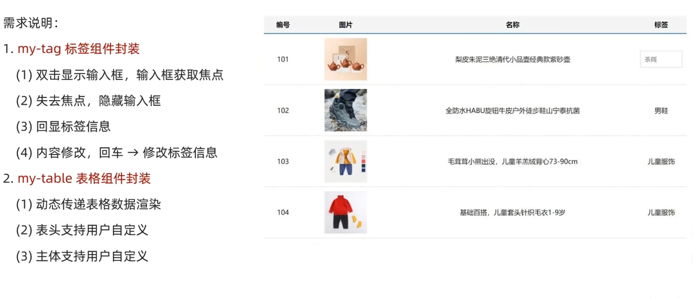

# 单页多页应用程序
## 单页应用程序
SPA，Single Page Application

**定义与核心逻辑**

单页应用从始至终仅加载 **1 个 HTML 文件**

所有交互（如页面跳转、内容更新）都通过 **JavaScript 动态操作 DOM** 实现，无需刷新整个页面

**页面结构**：  

共享同一个 HTML 骨架，初始加载后通过**前端路由（如 Vue Router）** 切换组件渲染内容

页面**按需更新**，需要明确**访问路径与组件（路由）** 的关系

**URL 变化但页面不刷新路由机制**：  

依赖 Vue Router 等前端路由库，通过`history`或`hash`模式模拟页面跳转（本质是组件切换）

**性能表现**：

+ **首屏加载**：需下载框架、公共组件、路由等基础代码，首次加载较慢；
+ **懒加载（动态导入组件）、代码分割** 可以优化初始包体积
+ **交互阶段**：切换页面仅**更新局部内容**，无需重新请求 HTML，性能流畅（如后台弹窗、表格交互）

**用户体验**：  

操作流畅如原生 App（无 “白屏刷新” 感），**交互密集型场景**（后台管理、社交应用点赞 / 评论）

**SEO 支持**：  

天然劣势（内容动态渲染，爬虫难抓取）

需通过 **服务端渲染（SSR，如 Nuxt.js）** 或 **预渲染（Prerender SPA Plugin）** 优化

**开发与学习：**

+ **开发效率**：高（组件化复用度高，单入口统一管理，适合团队协作）
+ **学习成本**：高（需掌握前端路由、状态管理工具（Pinia/Vuex）、构建工具优化等）

**技术栈**：**Vue + Vue Router + Pinia/Vuex + Vite/Webpack关键配置：**

+ **路由懒加载**：通过动态导入减少初始包体积：

```vue
// router/index.js
  import { createRouter, createWebHistory } from 'vue-router'
  const router = createRouter({
    history: createWebHistory(),
    routes: [
      { path: '/', component: () => import('./views/Home.vue') }, // 懒加载
    ]
  })
```

+ **状态管理**：简单场景用组件通信（Props / 事件），复杂场景引入 Pinia：

```vue
// store/task.js
  import { defineStore } from 'pinia'
  export const useTaskStore = defineStore('task', {
    state: () => ({ list: [] }),
    actions: { addTask(task) { this.list.push(task) } }
  })
```

**适用场景**

+ 后台管理系统（多表单、表格交互，需流畅体验）
+ 社交应用（动态内容实时更新，如朋友圈、聊天）

## 多页应用程序
MPA，Multi Page Application

**定义与核心逻辑**

多页应用中，**每个页面对应独立的 HTML 文件**，跳转时需向服务器重新请求完整的 HTML、JS、CSS 资源，浏览器全页刷新

**页面结构**：  

每个页面是独立 “资源包”（HTML+JS+CSS），公共资源（如 UI 库、工具函数）可通过构建工具提取为共享 chunk。

**路由机制**：  

依赖 **服务端路由**（如 Node.js/PHP 的模板引擎）或 **多前端入口**（每个页面单独配置 JS 入口），跳转时全页刷新

**性能表现**：

+ **首屏加载**：快（仅加载当前页资源，无需下载整个应用代码）
+ **交互阶段**：页面切换需重新加载所有资源，体验有 “刷新感”，性能低于 SPA。

**用户体验**：  

适合 **页面独立、交互简单** 的场景（如电商商品列表、新闻详情页），但切换流畅度逊于 SPA

**SEO 支持**：  

天然优势（每个页面的 HTML 内容可直接被搜索引擎抓取，无需额外优化）

**开发与学习**：

+ **开发效率**：中等（多页面独立开发，但公共模块需协调复用，易出现重复代码）
+ **学习成本**：低（更接近传统多页开发，无需深入前端路由、状态管理）

**技术栈**：Vue + 多入口构建配置（Vite/Webpack） + 可选服务端路由（如 Express、Nginx）

**关键配置（Vite 多入口）** ：

```javascript
// vite.config.js
import { defineConfig } from 'vite'
import vue from '@vitejs/plugin-vue'
export default defineConfig({
  plugins: [vue()],
  build: {
    rollupOptions: {
      input: {
        index: './src/pages/index/main.js', // 首页入口
        about: './src/pages/about/main.js'  // 关于页入口
      }
    }
  }
})
```


目录结构示例：

```plain
src/
├── pages/          # 多页面入口
│   ├── index/      # 首页
│   │   ├── main.js # 入口文件
│   │   └── App.vue # 页面根组件
│   └── about/      # 关于页（结构同首页）
└── common/         # 公共组件、工具函数（跨页面复用）
```

  

适用场景

+ 电商网站（商品列表、详情页，需 SEO 友好、首屏快）
+ 新闻门户（文章页、频道页，内容独立，依赖爬虫抓取）

## 架构选择与混合模式
如何选择？

**优先选 SPA 单页**：

+ 项目以 **交互体验为核心**（如后台系统、社交 App），且可通过 SSR / 预渲染解决 SEO 问题
+ 页面间关联紧密，需无刷新切换（如单页内的复杂流程引导）

**优先选 MPA 多页**：

+ 项目 **页面独立、交互简单**（如电商、新闻站），注重首屏速度和天然 SEO
+ 需 **分布式开发 / 部署**（不同团队维护不同页面，如企业官网 + 后台系统）

**混合模式（扬长避短）**

实际项目中，可结合两者优势：

+ **局部 SPA 化**：交互密集的模块（如活动页、商品详情页的弹窗流程）作为 SPA 开发，嵌入 MPA 中
+ **局部 MPA 化**：SEO 敏感的页面（如商品列表、新闻列表）作为 MPA 开发，保证爬虫抓取

SPA 的 SEO 补充方案

若必须用 SPA 但需 SEO，可选：

1. **服务端渲染（SSR）** ：用 Nuxt.js（Vue 生态的 SSR 框架），服务端生成 HTML 后返回，兼顾 SEO 和交互
2. **预渲染（Prerender）** ：构建时预先生成静态 HTML 文件（适合页面少、内容固定的场景，如官网）

## 核心对比
| **对比维度** | **SPA 特点** | **MPA 特点** |
| :--- | :--- | :--- |
| 页面结构 | 1 个 HTML 文件，动态更新内容 | 多个 HTML 文件，跳转时全页刷新 |
| 路由机制 | 依赖前端路由（如 Vue Router，无刷新） | 依赖服务端路由或多前端入口（跳转全页刷新） |
| 首屏加载 | 初始加载慢（可通过懒加载 / 代码分割优化） | 首屏加载快（仅加载当前页资源） |
| 交互体验 | 操作流畅（复杂交互场景友好，无刷新感） | 切换有刷新感（适合简单交互场景） |
| SEO 支持 | 天然较差（需 SSR / 预渲染等额外方案） | 天然友好（HTML 内容直接被爬虫抓取） |
| 开发效率 | 高（组件化复用度高，单入口统一管理） | 中等（多页面独立开发，公共模块协调） |
| 学习成本 | 高（需掌握前端路由、状态管理等工具） | 低（更接近传统多页开发模式） |

可根据 **交互需求、SEO 优先级、性能目标** 灵活选择架构，Vue 生态对两者均提供完善支持

# Vue 路由 Router
## 路由
是指在单页应用（SPA）中，通过 JavaScript 监听**URL 变化**，动态更新页面内容（无刷新跳转）的逻辑

假设一个单页应用（SPA）里面有两个界面：**首页**和**关于页**

**传统多页应用：** 访问 `/` 加载 `index.html`，访问 `/about` 加载 `about.html`（跳转时页面刷新）

**单页应用（SPA）** ：全程只加载 **1 个index.html**， JavaScript 动态切换界面（跳转时页面不刷新）

**作用：** 让 URL 路径变化 对应 不同组件渲染，实现 SPA 的 “无刷新跳转”

**核心原理实现方式**：

+ **哈希模式（Hash）** ：URL 中`#`后的内容为路由标识（如`#/about`），通过监听`hashchange`事件更新页面
+ **历史模式（History）** ：利用 HTML5 的`history.pushState()`修改 URL，通过监听`popstate`事件响应路由变化

**! ! ! ! 哈希模式必须后端配合配置路由兜底（否则刷新 404）! ! ! !**

**Vue Router 示例**：  

配置 “路径 → 组件” 映射，通过`<router-view>`渲染对应组件，无需刷新页面

```javascript
// 前端路由配置
const routes = [
  { path: '/home', component: HomeComponent },
  { path: '/user/:id', component: UserComponent }
];
```

**关键特点**

+ **无刷新跳转**：页面内容动态更新，用户体验更流畅（如后台管理系统的菜单切换）
+ **组件化渲染**：通过路由匹配不同组件，替换页面局部内容
+ **SEO 挑战**：内容动态渲染，需 SSR 或预渲染解决爬虫抓取问题

**应用场景**

+ **单页应用**：如后台管理系统、社交 App（微信公众号 H5、企业 OA）
+ **复杂交互场景**：如电商网站的商品详情页（图片预览、评论区动态加载）


----

**物理路由**：硬件层面的数据包转发，由路由器实现，是网络通信的基础

**后端路由**：服务端根据 URL 返回资源，决定 “请求→响应” 的映射关系，用于传统网站和 API 接口

**前端路由**：客户端 JS 逻辑，实现 SPA 的无刷新跳转，提升交互体验，但需解决 SEO 问题

| **维度** | **物理路由** | **后端路由** | **前端路由** |
| :--- | :--- | :--- | :--- |
| **层面** | 网络层（硬件设备） | 服务端逻辑（软件层面） | 客户端逻辑（软件层面） |
| **核心作用** | 数据包转发（网络通信） | URL 请求处理（返回资源） | 页面无刷新跳转（SPA 交互） |
| **关键技术** | 路由器、交换机 | 服务器、后端框架（Express/Django） | JS 框架（Vue Router/React Router） |
| **用户体验** | 透明（用户无感知） | 全页刷新（跳转有白屏感） | 流畅（无刷新，类似 App 体验） |
| **典型场景** | 家庭网络、互联网主干网 | 传统网站、API 接口 | 单页应用、复杂交互界面 |

**三者的协作关系物理路由是基础**：前端和后端的通信必须通过物理路由实现（如浏览器请求服务器，数据包经路由器转发）

**前后端路由的分工**：

+ 后端路由负责**数据接口**和**SEO 敏感页面**的响应（如返回 JSON 数据、服务器渲染的 HTML）
+ 前端路由负责**页面交互逻辑**（如单页内的组件切换、动态内容加载）

**开发中的实践关联**

**前端开发**：使用 Vue Router 等库实现 SPA 路由，需配合后端 API 接口（由后端路由提供）

**后端开发**：配置路由处理接口请求，同时可能需要支持前端路由的 History 模式（服务器需配置兜底路由，避免刷新 404）

**网络配置**：部署 SPA 时，若使用 History 模式，需在服务器（如 Nginx）中配置

```nginx
# Nginx配置示例：所有路径转发到index.html（前端路由兜底）
location / {
  try_files $uri $uri/ /index.html;
}
```


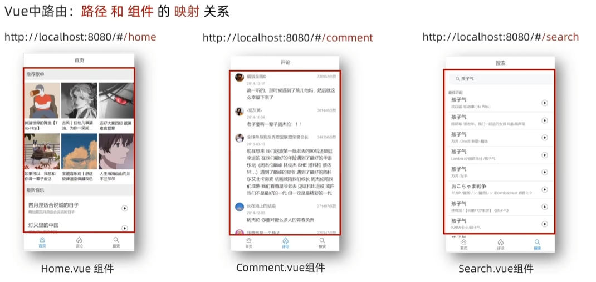

## Vue Router
Vue Router 是 Vue 官方的 **路由库**，实现 SPA 的路由功能

修改地址栏**路径**时，**切换显示**匹配的**组件**

+ 配置 **“路径-->组件”** 的**映射关系**（比如 `/` 显示 `Home` 组件，`/about` 显示 `About` 组件）
+ 支持 **声明式跳转**（`<router-link>` 标签）和 **编程式跳转**（`this.$router.push` 方法）
+ 处理路由参数（比如 `/user/123` 中的 `123`）、权限控制（路由守卫）、懒加载等高级功能

## Vue Router 使用步骤
**1. 安装 Vue Router**

根据 Vue 版本选择：

+ **Vue 3**：`npm install vue-router@4`
+ **Vue 2**：`npm install vue-router@3`

**2. 引入路由 import（核心文件：`src/main.js`）**

**3. 安装注册 Vue.use(VueRouter) **

**4. 创建路由对象  const router = new VueRouter5. 挂载路由**

以 Vue 2 为例，代码如下：

```javascript
import Vue from "vue";
import App from "./App.vue";
// 全局注册路由
// 下载 vue-router npm i vue-router
// 引入
// 安装注册 Vue.use
// 创建路由对象
import VueRouter from "vue-router";
// 安装注册 插件初始化
Vue.use(VueRouter) 
// 创建路由对象
const router = new VueRouter({
  routes: [
    {
      path: "/",
      redirect: "/home",
    },
    {
      path: "/home",
      component: () => import("./views/Home.vue"),
    },
    {
      path: "/about",
      component: () => import("./views/About.vue"),
    },
  ],
});

Vue.config.productionTip = false;

new Vue({
  render: (h) => h(App),
  // 挂载路由
  router,
}).$mount("#app");
```


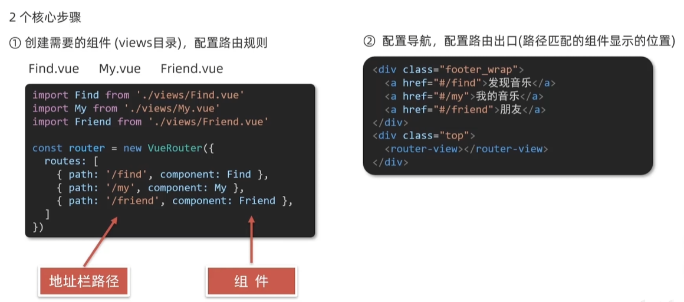

**6. 配置路由规则 创建需要的组件（views）目录**

Find.vue / My.vue / Friend.vue

```javascript
import Vue from "vue";
import App from "./App.vue";
// 引入
import VueRouter from "vue-router";
import MusicFind from "./views/MusicFind";
import MusicFriend from "./views/MusicFriend";
import MusicMy from "./views/MusicMy";
// 安装注册 插件初始化
Vue.use(VueRouter);
// 创建路由对象
const router = new VueRouter({
  routes: [
    { path: "/find", component: MusicFind },
    { path: "/friend", component: MusicFriend },
    { path: "/my", component: MusicMy },
  ],
});

Vue.config.productionTip = false;

new Vue({
  render: (h) => h(App),
  // 挂载路由
  router,
}).$mount("#app");
```

**7. 配置导航，配置路由出口（路径匹配的组件显示的位置）**


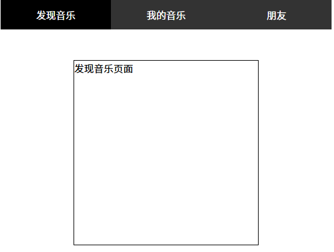

```html
<template>
  <div id="app">
    <nav class="music-nav">
      <ul>
        <li class="active"><a href="#/find">发现音乐</a></li>
        <li><a href="#/my">我的音乐</a></li>
        <li><a href="#/friend">朋友</a></li>
      </ul>
    </nav>
    <div class="music-container">
      <!-- 路由出口占位符 匹配组件展示位置 -->
      <router-view></router-view>
    </div>
  </div>
</template>
```

## 组件目录规范
**核心结论**

`views` 目录是 **Vue 项目约定俗成的 “页面级组件” 存放区**，和路由直接关联；

`components` 目录存放**通用可复用组件**（如按钮、弹窗）

两者的区分是**工程化规范**（非语法强制），目的是让代码结构更清晰

**组件的两类核心分类**

Vue 项目中，`.vue` 文件虽本质相同，但按**功能和复用性**可分为两类：

| **分类** | **页面级组件（views 目录）** | **通用组件（components 目录）** |
| :--- | :--- | :--- |
| **关联对象** | 和**路由**直接绑定（一个组件对应一个路径） | 不直接关联路由，供多个页面 / 组件复用 |
| **功能定位** | 承载完整页面逻辑（如 `/find` 路径对应 `Find.vue`） | 实现局部功能（如按钮、卡片、弹窗） |
| **复用性** | 通常不复用（每个路由对应唯一页面） | 高复用性（多个地方调用） |

`views` 目录的存在意义：明确 “页面边界”

路由配置中，`views` 里的组件通常是 **路由的直接渲染目标**

（如：`{ path: '/find', component: Find }`），代表一个完整的 “页面”

```javascript
import Find from './views/Find.vue' // Find 是一个页面（对应 /find 路由）
```


开发者能快速识别：`Find.vue` 是一个独立的页面，而非可复用的小部件

**工程化规范，提升可维护性**

团队协作时，统一将**页面级组件**放在 `views`，**通用组件**放在 `components`，能减少沟通成本：

新成员接手项目时，通过目录就能判断：

+ `views/Find.vue` → 是一个页面（改需求时找这里）；
+ `components/Button.vue` → 是通用按钮（全局样式调整找这里）

**和路由配置的 “心理映射”**

路由配置文件（如 `router/index.js`）通常和 `views` 目录强关联，导入语句清晰

```javascript
// 路由配置里的组件，几乎都来自 views 目录
const router = new VueRouter({
  routes: [
    { path: "/find", component: MusicFind },
    { path: "/friend", component: MusicFriend },
    { path: "/my", component: MusicMy },
  ],
});
```

**目录名可以灵活调整**

+ `views` 不是 Vue 的强制约定，部分项目也会命名为 **pages**（语义更直观，代表 “页面”）
+ 核心逻辑不变：**和路由直接绑定的 “页面级组件”，单独放在一个目录归类**

如何判断组件该放 `views` 还是 `components`

**这个组件是否对应一个独立的路由路径？** → 是 → 放 `views`

**这个组件会被多个地方复用吗？** → 是 → 放 `components`

（如果两者都不满足，可能是组件划分不合理，需要重构）

## 路由模块封装
将路由配置从 main.js 抽离出来，**拆分模块，利于维护**


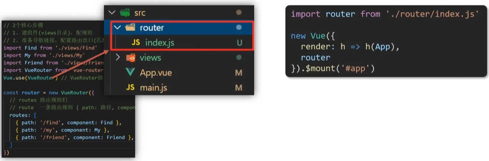

```javascript
<!-- index.js -->
// @代表src目录
import MusicFind from "@/views/MusicFind.vue";
import MusicFriend from "@/views/MusicFriend";
import MusicMy from "../views/MusicMy";
// 引入路由
import VueRouter from "vue-router";
// 引入Vue
import Vue from "vue";
// 插件初始化
Vue.use(VueRouter);
// 创建路由对象
const router = new VueRouter({
  routes: [
    { path: "/find", component: MusicFind },
    { path: "/friend", component: MusicFriend },
    { path: "/my", component: MusicMy },
  ],
});
// 导出
export default router;
```

```javascript
<!-- main.js -->
import Vue from "vue";
import App from "./App.vue";
// 引入路由
import router from "./router/index";
Vue.config.productionTip = false;

new Vue({
  render: (h) => h(App),
  // 挂载路由
  router,
}).$mount("#app");

```

## 声明式跳转&高亮类名（`<router-link>`）
```html
<router-link to="/">首页</router-link>
<router-link to="/about">关于页</router-link>

<li><router-link to="/find">发现音乐</router-link></li>
<li><router-link to="/my">我的音乐</router-link></li>

<li><a href="#/find">发现音乐</a></li>
<li><a href="#/my">我的音乐</a></li>

```

**router-link**本质还是 **a**标签，添加了两个 class 属性

**router-link-exact-active 精确匹配**

“exact” 意思是 “精确的、确切的” 

**router-link-active 模糊匹配**

在渲染时，它会被转换为 HTML 中的 `<a>` 标签

在 CSS 中使用 `a` 作为选择器来定义样式

+ `to` 属性：指定目标路径（和 `a` 标签的 `href` 类似，但无刷新）
+ 自动添加 `active` 类：匹配时会自动添加 **router-link-active**类，方便做选中样式

```css
/* 悬停效果（可选增强） */
.music-nav a:hover {
  opacity: 0.9;           /* 轻微变暗 */
  transition: opacity 0.3s; /* 平滑过渡 */
}

/* 激活状态（如默认选中“发现音乐”） */
.music-nav a.router-link-active {
  background-color: #2396fb; /* 保持黑色高亮 */
}
</style>
```

**精确匹配（`router-link-exact-active`）** ：

+ 当前路由**完全等于**链接路径时触发（如当前路由是 **/find**，匹配 “发现音乐”）

**模糊匹配（`router-link-active`）常用：**

+ 当前路由**包含**链接路径时触发（如当前路由是 `/my/playlist`，匹配 “我的音乐” 的 `/my`）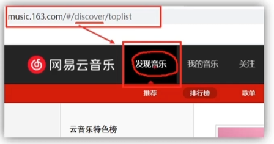

+ 匹配发现音乐  `/discover` 下的其他 `/discover/toplist` ,保持一级路由状态

**自定义类名高亮**

```javascript
// router/index.js
const router = createRouter({
  linkActiveClass: 'my-active', // 模糊匹配类名
  linkExactActiveClass: 'my-exact-active', // 精确匹配类名
  // ...其他配置
})
```

然后在 CSS 中替换为 `.my-active` 和 `.my-exact-active`

可根据设计需求调整激活样式（如替换 `box-shadow` 为 `border-bottom`，或修改颜色、粗细等）

## 声明式传参（动态路由 & 查询参数）
在跳转路由时进行传值

**查询参数传参(适合传递多个参数）配置导航链接 to = "/path?参数名=值&参数名=值"**

```html
<router-link to="/info?keyWords=华语流行">华语流行</router-link>
<router-link to="/info?keyWords=欧美流行">欧美流行</router-link>
<router-link to="/info?keyWords=日韩热门">日韩热门</router-link>
```

**页面接收：$route.query.参数名**

```javascript
搜索关键字：{{ $route.query.keyWords }}
```

**动态路由传参（传递单个单数）配置动态路由**

/info/:key表示，必须要传参数

如果不传参数，也希望匹配，可以加个可选符"?"

```javascript
  // 路由规则
  routes: [
    { path: "/find", component: MusicFind },
    { path: "/friend", component: MusicFriend },
    { path: "/my", component: MusicMy },
    { path: "/info/:key?", component: MusicInfo },
  ],
```

**配置导航链接 to="/path/参数值}**

```html
<p class="hot-search">
  热门搜索：
  <router-link to="/info/华语流行">华语流行</router-link>
  <!-- <router-link to="/info?keyWords=欧美流行">欧美流行</router-link> -->
  <router-link to="/info/欧美流行">欧美流行</router-link>
  <router-link to="/info/日韩热门">日韩热门</router-link>
</p>
```

**页面接收：$route.params.参数名**

```html
<p>动态路由：{{ $route.params.key }}</p>
```

## 路由重定向
网页打开通常 url 为 /空，未匹配到组件出现空白

http://localhost:8080/

重定向：匹配 path 后， 强制跳转 path 路径

“redirect” 常见意思为 “使改变方向；使转移；重新导向” 。在计算机领域，常指网页或程序中的重定向操作，比如将用户从一个网址自动引导到另一个网址，或者程序执行时从一个流程转向另一个流程。

```javascript
 // 路由规则
routes: [
  // 路由重定向
  { path: "/", redirect: "/find" },
  { path: "/find", component: MusicFind },
  { path: "/friend", component: MusicFriend },
  { path: "/my", component: MusicMy },
  { path: "/info/:key", component: MusicInfo },
],
```

## 路由 404
作用：当路径找不到匹配时，给个提示页面

位置：配在路由最后

语法：**path:"*"**（任意路径) - 前面不匹配就命中最后这个

## 路由模式
问题：路由的路径看起来不自然，有#，能否切成真正路径形式?

**hash路由(默认)** 例如:`http://localhost:8080/#/home`

**history路由(常用）例如:`http://localhost:8080/home`(以后上线需要服务器端支持)**

```javascript
//创建路由对象
const router = new VueRouter({
  // 路由规则
  routes: [
    // 路由重定向
    { path: "/", redirect: "/my" },
    // 404
    { path: "*", component: NotFind },
  ],
  // 路由模式切换
  mode: "history",
  // 自定义高亮类
});
```

## 编程式跳转（`this.$router`）
在方法中通过 JS 跳转（比如按钮点击）：

```html
<template>
  <button @click="goAbout">去关于页</button>
</template>

<script>
export default {
  methods: {
    goAbout() {
      // 编程式跳转：和 <router-link to="/about"> 效果一样
      this.$router.push('/about')
      this.$router.push({
        path:'/about',
        name:'路由名'
      })
    }
  }
}
</script>

 // 路由规则
routes: [
  {name:路由名" path: "/find", component: MusicFind },
],
```

## 编程式参数（动态路由 & 查询参数）
场景：需要实现用户详情页，路径如 `/user/123`（`123` 是用户 ID）

**动态路由步骤 1：配置动态路由**

在 `router/index.js` 中添加：

```javascript
const routes = [
  // ...其他路由
  { path: '/user/:id', component: User } // :id 是动态参数
]
```

**步骤 2：创建 User 组件，获取参数**

```html
<!-- User.vue -->
<template>
  <div>用户ID：{{ $route.params.id }}</div>
</template>
```

+ `$route`：当前路由的信息对象（包含 `params`、`query` 等）
+ `$route.params.id`：获取动态路由的 `id`（如 `/user/123` 中，`id=123`）

**查询参数（如 `/user?name=小明`）**

跳转时带查询参数：

```javascript
// 方式1：声明式
<router-link to="/user?name=小明">用户页</router-link>

// 方式2：编程式
this.$router.push({ 
  path: '/user', 
  query: { 
    参数名1: '参数1' 
    name: '小明' 
  } 
})
```

获取参数：

```html
<template>
  <div>用户名：{{ $route.query.name }}</div>
</template>
```

## 传参总结
Vue 路由传参是实现页面间数据传递的核心能力

包含 **动态路由（params）** 、**查询参数（query）** 等细分场景

搭配 **声明式导航**（`router-link`）和 **编程式导航**（`this.$router.push`）不同调用方式

**传参类型是 “本质”** ：

+ `params` 依赖路由占位符，是 **URL 路径的一部分**
+ `query` 是 **URL 的附加信息**，与路由配置无关

**调用方式是 “载体”** ：

+ 不管是 `params` 还是 `query`，都能通过 **声明式（`<router-link>`）** 或 **编程式（`$router.push`）** 实现跳转
+ 区别仅在于：`params` 用 `name` 传参更可靠（`path` 需手动拼路径），而 `query` 用 `path` 或 `name` 都可以

| **维度** | `params`（动态路由参数） | `query`（查询参数） |
| :--- | :--- | :--- |
| **路由配置** | 必须定义占位符 `path: '/user/:id'` | 无特殊配置`path: '/search'` |
| **URL 表现** | 嵌入路径`/user/123` | 附加查询串`/search?keyword=Vue` |
| **传参必要性** | 必填（否则路由不匹配） | 参数可选（可传、可缺） |
| **刷新稳定性** | 路由配了占位符则稳定，否则刷新丢失 | 参数在 URL 中，刷新不丢 |
| **适用场景** | 标识性数据（如用户 ID、商品 ID） | 过滤 / 分页数据（如搜索词、页码） |

| **传参类型** | **路由配置要求** | **传参方式** |
| :--- | :--- | :--- |
| **动态路由（params）** | 需定义占位符（如 `:id`） | `name + params`或路径拼接 |
| **查询参数（query）** | 无特殊要求 | `path/name + query` |

| **传参类型** | **取值方式** | **URL 表现** |
| :--- | :--- | :--- |
| **动态路由（params）** | `$route.params.id` | 嵌入路径（如 `/user/1`） |
| **查询参数（query）** | `$route.query.keyword` | 追加查询串（如 `?k=v`） |

**动态路由传参（Params）**

标识性参数（如 ID）

**① 路由配置（必须定义占位符）**

```javascript
// router/index.js
const routes = [
  {
    path: '/user/:id', // 定义动态参数 :id
    name: 'User',
    component: () => import('../views/User.vue')
  }
]
```

**② 传参方式**

+ **声明式（router-link）** ：通过 `name` 匹配路由，`params` 传参

```html
<router-link :to="{ name: 'User', params: { id: 123 }}">
  跳转用户页
</router-link>
```

+ **编程式（this.$router.push）** ：同样需用 `name`（用 `path` 需手动拼接）

```javascript
this.$router.push({ 
  name: 'User', 
  params: { id: 123 } 
})
// 或 path 拼接：this.$router.push('/user/123')
```

**③ 取值方式**

在目标组件中通过 `$route.params` 获取：

```javascript
// User.vue
export default {
  mounted() {
    console.log(this.$route.params.id) // 输出: 123
  }
}
```

特点

+ **必填性**：参数是路由的一部分，若未传参（如访问 `/user`），路由会匹配失败
+ **URL 可见**：参数嵌入路径（如 `/user/123`），适合标识性数据（如用户 ID）
+ **刷新稳定**：只要路由配置了占位符，刷新页面参数不会丢失

**查询参数传参（Query）**

可选过滤参数（如搜索、分页）

**① 路由配置（无需特殊处理）**

```javascript
// router/index.js
const routes = [
  {
    path: '/search',
    name: 'Search',
    component: () => import('../views/Search.vue')
  }
]
```

**② 传参方式**

+ **声明式（router-link）** ：通过 `path` 或 `name` 配合 `query` 传参

```html
<router-link :to="{ 
  path: '/search', 
  query: { keyword: 'Vue', page: 1 } 
}">
  搜索Vue
</router-link>
```

+ **编程式（this.$router.push）** ：

```javascript
this.$router.push({ 
  path: '/search', 
  query: { keyword: 'Vue', page: 1 } 
})
```

**③ 取值方式**

在目标组件中通过 `$route.query` 获取：

```javascript
// Search.vue
export default {
  mounted() {
    console.log(this.$route.query.keyword) // 输出: Vue
    console.log(this.$route.query.page)     // 输出: 1
  }
}
```

特点

+ **可选性**：参数非路由必需，可传多个或省略
+ **URL 可见**：参数以查询串形式存在（如 `/search?keyword=Vue&page=1`），适合搜索、分页等场景
+ **刷新稳定**：参数保存在 URL 中，刷新页面不会丢失
+ **复杂数据处理**：若传对象 / 数组，需用 `JSON.stringify` 转字符串，接收时再 `JSON.parse`：

```javascript
// 传参
this.$router.push({
  path: '/detail',
  query: { data: JSON.stringify({ name: 'Vue' }) }
})
// 取值
const data = JSON.parse(this.$route.query.data)
```

**扩展方案：解耦组件的 Props 传参**

为了让组件不依赖 `$route`（更易测试和复用），可通过 **路由 props 映射** 将参数转为组件 props：

**① 路由配置开启 props**

```javascript
// router/index.js
const routes = [
  {
    path: '/user/:id',
    component: User,
    props: true // 开启 props 映射，将 params 转为组件 props
  }
]
```

**② 组件通过 props 接收**

```javascript
// User.vue
export default {
  props: ['id'], // 直接接收路由参数 id
  mounted() {
    console.log(this.id) // 输出: 123
  }
}
```

+ 组件不再耦合 `$route`，可独立使用（如父组件直接传值 `<User :id="123" />`）。
+ 支持更灵活的参数处理（如默认值、类型校验）。

**静态元信息传参（Meta）—— 页面配置（如权限、标题）**

适合传递 **静态参数**（如页面权限、标题），不随 URL 变化：

**① 路由配置 meta 字段**

```javascript
// router/index.js
const routes = [
  {
    path: '/admin',
    component: Admin,
    meta: { 
      requiresAuth: true, // 权限控制
      title: '管理后台'    // 页面标题
    }
  }
]
```

**② 组件中获取 meta**

```javascript
// Admin.vue
export default {
  mounted() {
    console.log(this.$route.meta.requiresAuth) // 输出: true
    console.log(this.$route.meta.title)         // 输出: 管理后台
  }
}
```

**特点**

+ 参数不暴露在 URL 中，适合全局配置（如权限、页面标题）
+ 仅支持静态数据，动态参数需结合其他方式

**最佳实践总结**

1. **动态路由（Params）** ：优先用于 **必填的标识性参数**（如 `/user/:id`），需在路由配置占位符
2. **查询参数（Query）** ：优先用于 **可选的过滤 / 分页参数**（如 `?keyword=Vue`），灵活且 URL 可见
3. **Props 传参**：用于 **解耦组件**，让组件不依赖路由上下文（推荐在复杂项目中使用）
4. **Meta 传参**：仅用于 **静态元信息**（如权限、标题），不适合动态数据

**常见问题答疑Q：params 传参为什么刷新丢失？**  

A：如果路由未配置占位符（如 `path: '/user'`），params 不会嵌入 URL，刷新时参数会丢失。必须通过 `path: '/user/:id'` 显式定义占位符

**Q：query 传对象为什么变成 `[object Object]`？**  

A：URL 只能传递字符串，需用 `JSON.stringify` 转字符串，接收时再 `JSON.parse` 还原

**Q：声明式和编程式导航怎么选？**  

A：页面模板中用 **声明式（router-link）** ，逻辑中（如按钮点击）用 **编程式（this.$router.push）**

  

## 路由守卫（权限控制核心）
**场景**：某些页面（如 `/profile`）需要登录后才能访问，否则跳转到登录页

全局前置守卫（最常用）

在 `router/index.js` 中添加：

```javascript
router.beforeEach((to, from, next) => {
  // to：即将进入的目标路由
  // from：当前离开的路由
  // next：放行方法（必须调用，否则页面卡住）

  // 逻辑：如果去的是 /profile，且未登录，就跳转到 /login
  if (to.path === '/profile' && !localStorage.getItem('token')) {
    next('/login') // 跳转到登录页
  } else {
    next() // 放行
  }
})
```

## 路由懒加载（优化首屏速度）
**问题**：如果所有组件都打包到一个文件，首屏加载会很慢

**解决**：用 **懒加载**，让组件在需要时才加载（打包时拆分成多个小文件）

修改 `router/index.js`：

```javascript
const routes = [
  { 
    path: '/about', 
    // 懒加载语法：() => import('组件路径')
    component: () => import('../views/About.vue') 
  }
]
```

## 嵌套路由（复杂页面结构）
**场景**：有一个 `/parent` 页面，里面嵌套了 `/parent/child` 子页面

**配置嵌套路由**

```javascript
const routes = [
  {
    path: '/parent',
    component: Parent, // 父组件
    children: [        // 子路由配置
      { path: 'child1', component: Child1 }, // 子路径：/parent/child1
      { path: 'child2', component: Child2 } // 子路径：/parent/child2
    ]
  }
]
```

**父组件中添加 `<router-view>`**

```html
<!-- Parent.vue -->
<template>
  <div>
    <h2>父组件内容</h2>
    <!-- 子组件会在这里渲染 -->
    <router-view></router-view>
  </div>
</template>
```

易错点：`$router` 和 `$route` 的区别

+ **$router**：路由**实例**，用于**导航**（比如 `push`、`replace` 方法）
+ **$route**：当前路由的**信息对象**，包含 `path`、`params`、`query` 等数据

  

**错误示例**：想获取参数时，误用 `$router.params.id`（正确是 `$route.params.id`）

**Vue 2 vs Vue 3 的 Router 差异**

| **功能** | **Vue 2 写法** | **Vue 3 写法** |
| :--- | :--- | :--- |
| 创建路由实例 | `new VueRouter({...})` | `createRouter({...})` |
| 历史模式 | `mode: 'history'` | `history: createWebHistory()` |
| 哈希模式 | `mode: 'hash'` | `history: createWebHashHistory()` |

# 自定义创建项目
## 基于 VueCli 自定义

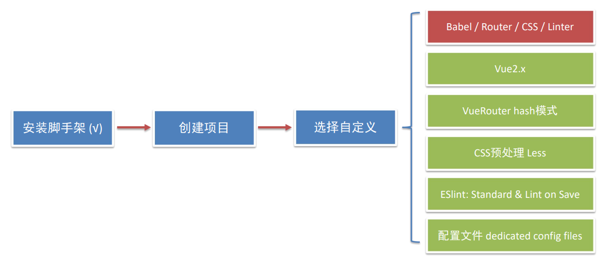

```powershell
Vue CLI v5.0.8
? Please pick a preset:
? 请选择一个预设：
  Default ([Vue 3] babel, eslint)
  Default ([Vue 2] babel, eslint)
> Manually select features
  手动选择特征

Vue CLI v5.0.8
? Please pick a preset: Manually select features
? 请选择一个预设：手动选择功能
? Check the features needed for your project: 
(Press <space> to select, <a> to toggle all, <i> to invert selection, and
<enter> to proceed)
 (*) Babel
 ( ) TypeScript
 ( ) Progressive Web App (PWA) Support
>(*) Router 路由
 ( ) Vuex
 (*) CSS Pre-processors
 (*) Linter / Formatter 代码检查器 / 格式化工具
 ( ) Unit Testing
 ( ) E2E Testing

Vue CLI v5.0.8
? Check the features needed for your project: Babel, Router, CSS Pre-processors, Linter
? 检查你的项目所需的功能：Babel、路由、CSS 预处理器、代码检查工具
? Choose a version of Vue.js that you want to start the project with
? 选择你想用于启动项目的 Vue.js 版本
  3.x
> 2.x

Vue CLI v5.0.8
? Use history mode for router? 
  是否对路由器使用历史模式？
  (Requires proper server setup for index fallback in production) (Y/n) n

? Pick a linter / formatter config: (Use arrow keys)
? 选择一个代码检查器 / 格式化器配置：（使用箭头键）
  ESLint with error prevention only
  ESLint + Airbnb config
> ESLint + Standard config  //标准化无分号规范
  ESLint + Prettier
  
? Pick additional lint features: (Press <space> to select, <a> to toggle all, <i> to invert selection, and <enter> to
proceed)
? 选择其他 lint 功能: (按 <space> 选择，按 <a> 切换全部，按 <i> 反转选择，按 <enter> 继续)
>(*) Lint on save //保存时校验
 ( ) Lint and fix on commit (requires Git)

? Where do you prefer placing config for Babel, ESLint, etc.? (Use arrow keys)
你更倾向于将 Babel、ESLint 等工具的配置放在哪里？（使用箭头键）
> In dedicated config files  //将配置文件放在单独的文件中
  In package.json
将此保存为预设以便用于未来项目吗？（是 / 否）
Save this as a preset for future projects? (y/N) y

🎉  Successfully created project exe-mobile.
👉  Get started with the following commands:

 $ cd exe-mobile
 $ npm run serve
```


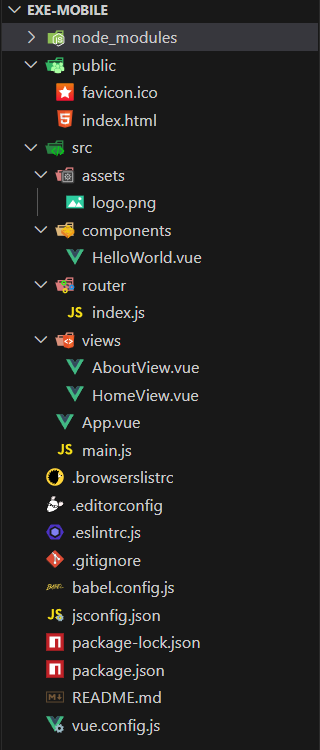

## ESlint 代码规范 
代码规范：一套写代码的约定规则

例如："赋值符号的左右是否需要空格" "一句结束是否是要加;" 

正规的团队需要统一的编码风格

JavaScript Standard Style 规范说明

[https://standardjs.com/rules-zhcn.html](https://standardjs.com/rules-zhcn.html)

下字符串使用单引号 'abc'  

无分号  const name = 'zs' 

关键字后加空格 if (name = 'ls') { ... }

函数名后加空格 function name (arg) { ... }

坚持使用全等 === 摒弃 ==  

## 代码规范错误
如果代码不符合 standard 的要求，ESlint 会跳出来提示

比如：在main.js中随意做一些改动，添加一些分号，空行

两种解决方案： 

① 手动修正  根据错误提示来一项一项手动修改纠正[ESLint 规则表](https://zh-hans.eslint.org/docs/latest/rules/)

② 自动修正 基于 vscode 插件 ESLint **高亮错误**，并通过配置自动帮助我们修复错误


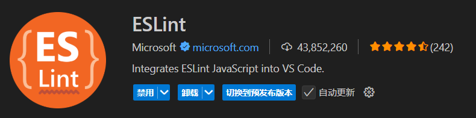

**关提示音！**


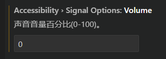

```json
// 当保存的时候，eslint自动帮我们修复错误
"editor.codeActionsOnSave": {
  "source.fixAll": true
},
// 保存代码，不自动格式化
"editor.formatOnSave": false
```

# 状态管理  Vuex
**定义**：Vuex 是 Vue.js 的官方**集中式状态管理库**，用于集中管理应用中多个组件共享的**状态（数据）**

**作用**：解决多组件共享状态的问题（尤其是跨组件通信）

**核心原则**：单一数据源 + 可预测的状态变更

当组件之间需要共享数据时，使用 `props` 传参或事件总线会变得复杂（尤其多层嵌套或跨组件通信）

Vuex 通过**单一数据源**模式，让状态管理更清晰、可维护

**适用场景**：多组件共享 **复杂状态**（如用户信息、购物车、全局主题）

> + 不是所有的场景都适用于vuex，只有在必要的时候才使用vuex
> + 使用了vuex之后，会附加更多的框架中的概念进来，增加了项目的复杂度 （数据的操作更便捷，数据的流动更清晰）
>
> Vuex就像《近视眼镜》, 自然会知道什么时候需要用它~


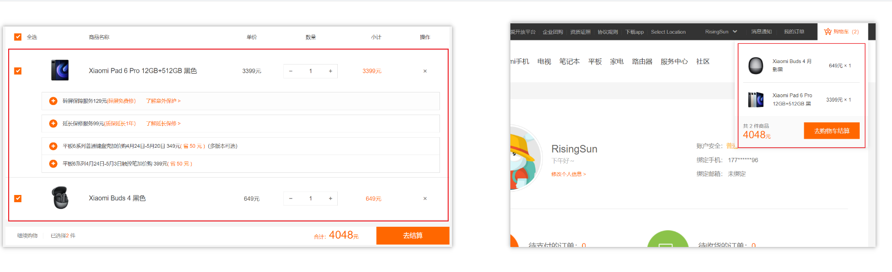

**核心概念**：

| **模块** | **作用** | **约束** |
| :--- | :--- | :--- |
| **State** | 存储全局数据 | 唯一数据源 |
| **Mutations** | 同步修改 State（唯一入口） | 必须同步，禁止异步 |
| **Actions** | 处理异步逻辑（如 API 请求） | 提交 Mutations 修改 State |
| **Getters** | 派生 State 的计算属性（类似 computed） | 缓存派生结果 |

## 使用步骤
**1. 安装与引入**

```powershell
npm install vuex@3  # Vue2 对应 Vuex 3.x
```

**2.创建 Store** 


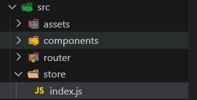

```javascript
// 存放vuex相关代码
// 插件安装
import Vue from 'vue'
import Vuex from 'vuex'
Vue.use(Vuex)
// 创建store实例
const store = new Vuex.Store({
  state: {
    count: 0
  },
  mutations: {
    increment (state) {
      state.count++
    }
  }
})
// 暴露store实例给main.js使用
export default store
```

**3.main.js 导入挂载**

```javascript
import Vue from 'vue'
import App from './App.vue'
import router from './router'
import store from '@/store/index'

Vue.config.productionTip = false

new Vue({
  router,
  store,
  render: h => h(App)
}).$mount('#app')
```

## Store（仓库）
**全局唯一容器**，包含所有共享状态

```javascript
// 存放vuex相关代码
//插件安装 
import Vue from 'vue'
import Vuex from 'vuex'
Vue.use(Vuex)
// 创建store实例
const store = new Vuex.Store({
  xxx
})
// 暴露store实例给main.js使用
export default store
```

## State（状态）
**数据源**：存储应用级状态（**响应式数据**）

```javascript
// 创建store实例
const store = new Vuex.Store({
  // 存放状态 响应式数据
  // data 是组件自己的数据，state是所有组件共享的数据
  state: {
    count: 100
  }
})
```

组件内访问：**`{{$store.state.xxx}}`**

逻辑内访问：**this.$store.state.xxx**

```html
<template>
  <div id="app">
    <h1>根组件 {{ $store.state.count }}</h1>
  </div>
</template>
<template>
  <div class="box">
    <h2>Son1 子组件</h2>
    从vuex中获取的值:{{ $store.state.count }} <label></label>
  </div>
</template>
```

**辅助映射函数**：**mapState(['xxx']) 自动将 store 数据映射到组件计算属性中**

`mapState` 是一个函数。它通常用于在 Vuex 状态管理模式中，将 Vuex 的状态映射到 Vue 组件的计算属性中。通过 `mapState(['xxx'])` 这种写法，`xxx` 是 Vuex 状态中的某个属性名，`mapState` 函数会帮助快速建立起从 Vuex 状态到组件计算属性的映射关系，方便在组件中使用 Vuex 状态。例如，若 Vuex 中有一个名为 `count` 的状态，通过 `mapState(['count'])` 就能在组件中以计算属性的形式直接使用 `count` 状态。

**相当于自动生成了计算属性**

```html
<template>
  <div class="box">
    <h2>Son1 子组件</h2>
    从vuex中获取的值:{{count }} <label></label>
  </div>
</template>

<script>
import { mapState } from 'vuex'
export default {
  name: 'Son1Com',
  computed: {
    // count () {
    //   return this.$store.state.count
    // },
    ...mapState(['count','title'])
  }
}
</script>
```


## Mutations（同步修改）
“Mutation” 常见释义为 “突变；变异；转变；变化” 。在生物学领域，它指生物体 DNA 序列的改变。在计算机编程，特别是在一些数据处理或状态管理相关的场景中，它指对数据的修改操作，例如在 Vuex 中，mutations 用于修改 Vuex 的状态。在其他领域，也可表示事物在性质、形式等方面的重大转变。

**唯一修改 State 的途径vuex同样遵循单向数据流，组件中不能直接修改仓库的数据同步事务**：必须是同步函数

**定义 mutations 方法：** 对象中存放修改 state 的方法

```javascript
const store = new Vuex.Store({
  // 存放状态 响应式数据
  // data 是组件自己的数据，state是所有组件共享的数据
  strict: true, // 严格模式，只能通过mutations修改state 上线移出，性能消耗
  state: {
    title: 'Vuex仓库大标题',
    count: 100
  },
  mutations: {
    // 第一个参数为当前store的state值,第二参数为传递的值（载荷）
    SET_COUNT(state, payload) {
      state.count += playload
    }
    addCount (state) {
      state.count++
    }
  }
})
```

**组件中调用： this.$store.commit('addCount')**

```html
<button @click="handleAdd()">值 + 1</button>
  
methods: {
  handleAdd () {
    // this.$store.state.count++ 错误写法
    this.$store.commit('addCount')
  }
}
```

**mutations 传参(载荷) **

**this.$store.commit('addCount',参数)**

**注意：只能接受一个参数，改为对象形式传递多个**

```javascript
this.$store.commit('addCount', {
  count : n,
  msg : 'hello'
})
```

```html
<template>
  <div class="box">
    <h2>Son1 子组件</h2>
    从vuex中获取的值:{{count }} <label></label>
    <button @click="handleAdd(1)">值 + 1</button>
    <button @click="handleAdd(5)">值 + 5</button>
    <button @click="handleAdd(10)">值 + 10</button>
  </div>
</template>
<script>
import { mapState } from 'vuex'
export default {
  name: 'Son1Com',
  computed: {
    ...mapState(['count'])
  },
  methods: {
    handleAdd (n) {
      this.$store.commit('addCount', n)
    }
  }
}
</script>

// 创建store实例
<script>
const store = new Vuex.Store({
  // 存放状态 响应式数据
  // data 是组件自己的数据，state是所有组件共享的数据
  strict: true, // 严格模式，只能通过mutations修改state 上线移出，性能消耗
  state: {
    title: 'Vuex仓库大标题',
    count: 100
  },
  // 修改state的唯一方法，同步方法
  mutations: {
    addCount (state, n) {
      state.count += n
    }
  }
})
</script>
```

**辅助函数映射**：**mapMutations(['xxx'])**


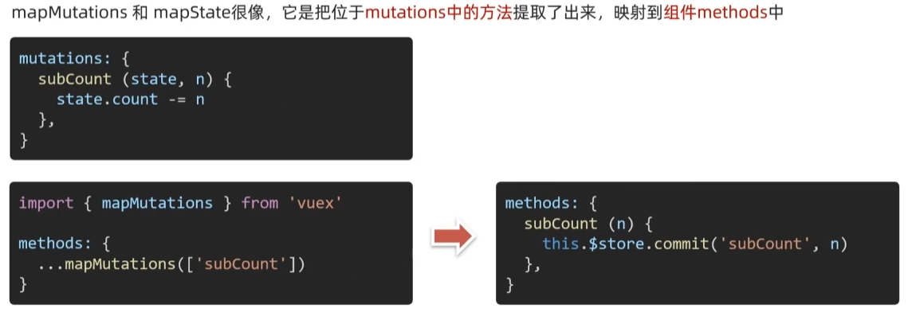

```javascript
//index.js  减法
subCount (state, n) {
  state.count -= n
},
```

直接在点击事件中调用 subCount(n)

```vue
<template>
  <div class="box">
    <h2>Son2 子组件</h2>
    从vuex中获取的值:{{ count }}<label></label>
    <button @click="handleSub(1)">值 - 1</button>
    <button @click="subCount(5)">值 - 5</button>
    <button @click="changeTitle('小标题')">修改标题</button>
  </div>
</template>

<script>
import { mapMutations, mapState } from 'vuex'
export default {
  name: 'Son2Com',
  computed: {
    ...mapState(['count','title])
  },
  methods: {
    ...mapMutations(['addCount', 'changeTitle']),
    // handleSub (n) {
    //   // this.$store.commit('subCount', n)
    //   // this.subCount(n)
    // }
  }
}
</script>
```

## Actions（异步操作）
“action” 常见含义为 “行动”“行为”“活动”，还可表示 “战斗”“诉讼” 等

**处理异步逻辑：如 API 请求通过 commit 触发 mutation**

```javascript
actions: {
  // “context” 常见含义为 “上下文”“语境”，
  addCountAsync (context, n) {
    // 模拟异步方法,大部分场景为获取数据发请求
    setTimeout(() => {
      context.commit('addCount', n)
    }, 1000)
  }
}
```

“context” 常见含义为 “上下文；语境”，指某个词、句子或段落所处的前后文环境，通过它可帮助理解其确切意义；也可表示 “背景；环境”，说明事情发生的背景条件等相关情况 。

**触发方式**：**dispatch('actionName', payload)**

“dispatch” 常见含义为 “派遣；发送；调遣”，例如派遣人员去执行任务；也有 “迅速处理；快速办妥” 之意；在计算机领域，还有 “调度” 的意思，比如对系统资源进行调度 。

**辅助函数映射**：**mapActions(['xxx'])**


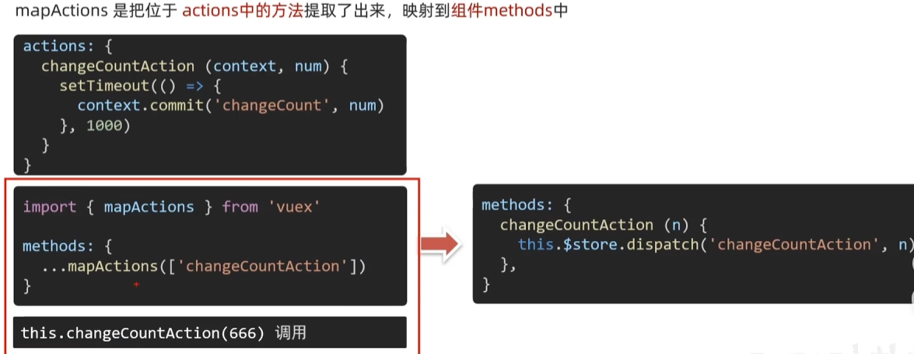

```html
<button @click="addCountAsync(100)">一秒后 + 100</button>
  
  
  methods: {
    ...mapMutations(['addCount', 'changeTitle']),
    ...mapActions(['addCountAsync'])
  }
```

## Getters（计算属性）
**派生状态**：对 State 进行加工 **（类似组件的 computed）**

相当于 state 的**计算属性**，用于对 state 中的数据进行加工处理后返回。它可以接受其他 getter 作为参数，并且会缓存计算结果，只有在它依赖的 state 发生**变化时**才会**重新计算**

比如，要计算购物车中商品的总数量：

**特点**：**缓存计算结果**

```javascript
  // 获取state的计算属性
  getters: {
    // 筛选数组大于5
    getList (state) {
      return state.list.filter(item => item > 5)
    }
  }
```

**访问方式：**

+ **this.$store.getters.xxx**
+ **mapGetters(['xxx'])**

```html
<p>计算属性筛选列表值{{ getList }}</p>
  
<script>
import { mapGetters, mapMutations, mapState } from 'vuex'
export default {
  name: 'Son2Com',
  computed: {
    ...mapState(['count']),
    ...mapGetters(['getList'])
  },
  methods: {
    ...mapMutations(['subCount'])
  }
}
</script>
```

## Modules（模块化）
由于vuex使用**单一状态树**，应用的所有状态会**集中到一个比较大的对象**

当应用变得非常复杂时，store对象就有可能变得相当臃肿

（当项目变得越来越大的时候，Vuex会变得越来越难以维护)

当应用变得复杂时，将 store 分割成模块。每个模块都有自己的 state、mutation、action、getter，使得代码结构更加清晰，便于维护


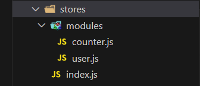

**拆分复杂 Store**：每个模块拥有独立 state/mutations/actions...

**user 模块 ： store/modules/user.js（Vue2 + Vuex 模块）**

**car 模块 ： store/modules/car.js（Vue2 + Vuex 模块）**

+ **解耦**：把用户相关逻辑（如登录、个人信息）和其他模块（如购物车、订单）分开，代码更清晰
+ **复用**：模块可独立维护、复用（比如多个项目的用户模块逻辑相似时）

```javascript
// store/modules/user.js（Vue2 + Vuex 模块）
const state = {
  userInfo: { // 模块内的状态，存储用户信息
    name: 'zs', 
    age: 18
  }
}
const mutations = {} // 模块内的同步修改（暂时为空）
const actions = {}   // 模块内的异步操作（暂时为空）
const getters = {}   // 模块内的计算属性（暂时为空）

export default { 
  state,
  mutations,
  actions,
  getters
}
```

**引入模块：** 在根 `store/index.js` 中：

```javascript
import Vue from 'vue'
import Vuex from 'vuex'
import userModule from './modules/user.js' 

Vue.use(Vuex)

export default new Vuex.Store({
  modules: {
    user: userModule // 注册 user 模块，访问时用 this.$store.state.user.userInfo
  }
})
```

## 模块 state 访问
模块拆分后，子模块的 `state` 会挂载到根级 `state` 中，属性名就是模块名，可通过两种方式访问模块内的 `state` 数据

**通过 `$store.state.模块名.xxx` 直接访问**  

若有 `user` 模块，访问其 `userInfo` 数据：

```javascript
// 假设 user 模块 state 有 userInfo
// user.js
const state = {
  userInfo: {
    name: '张三',
    age: 18
  }
}
// sonOne.vue
访问user名字：{{ $store.state.user.userInfo.name }}
```

**通过 `mapState` 映射根级别映射（默认）**  

针对根 `state` 数据，直接使用：

```javascript
user年龄{{ user.userInfo.age }}

import { mapState } from 'vuex';
export default {
  computed: {
    ...mapState(['user']) // 映射根 state 中的 xxx 数据
  }
}
```

**子模块映射（需开启命名空间）**  

模块需先配置 `namespaced: true` 开启命名空间：

```javascript
// 模块文件（如 store/modules/user.js）
export default {
  namespaced: true, 
  state,
  mutations,
  // ...
}
```

映射时指定模块名：

```javascript
user名字{{ userInfo.name}}

import { mapState } from 'vuex';
export default {
  computed: {
    ...mapState('模块名', ['xxx']), // 如 'user' 模块，映射其 xxx 数据
    ...mapState('user', ['userInfo'])
  }
}
```

> + 模块 `state` 会合并到根 `state`，通过模块名挂载
> + 直接访问用 `$store.state.模块名.数据`
> + `mapState` 映射子模块数据，需先在模块开启 `namespaced: true`，再用 `mapState('模块名', ['数据'])` 映射
> + **修改状态必用 mutations**（禁止直接修改 state）
> + 异步操作放在 actions 中，完成后提交 mutation
> + 大型项目使用模块化 + 命名空间（避免命名冲突）
> + 表单处理建议：**v-model** 绑定计算属性的 setter/getter

## 模块 getters 访问
掌握 Vuex 模块（Module）中 getters 的访问方式，实现模块内计算属性的复用与调用

**直接访问**

通过 `$store.getters['模块名**/** xxx']` 调用，示例：  

若 `user` 模块有 `fullName` getters，访问方式：

```javascript
this.$store.getters['user/fullName'];
```

**通过 `mapGetters` 映射根级别映射（默认）**  

针对根 getters，直接映射：

```javascript
import { mapGetters } from 'vuex';
export default {
  computed: {
    ...mapGetters(['xxx']) // 映射根 getters 中 xxx
  }
}
```

**子模块映射（需命名空间）推荐**  

模块需开启 `namespaced: true`：

```javascript
// 模块文件（如 store/modules/user.js）
export default {
  namespaced: true, 
  getters: { /* ... */ }
}
```

映射时指定模块名：

```javascript
import { mapGetters } from 'vuex';
export default {
  computed: {
    ...mapGetters('模块名', ['xxx']) // 如 'user' 模块，映射其 xxx getters
  }
}
```

+ 模块 getters 需通过 `模块名/xxx` 标识访问（直接或映射）
+ 使用 `mapGetters` 映射子模块 getters 时，模块必须配置 `namespaced: true` 开启命名空间

## 模块 mutations 访问
掌握 Vuex 模块（Module）中 mutation 的访问方式

模块中的 mutation 和 actions 会被挂载到全局，需要**开启命名空**间才会挂载到子模块

**直接访问**

```javascript
// 模块文件（如 store/modules/user.js）
// mutations 同步修改
const mutations = {
  setTheme (state, theme) {
    state.theme = theme
  }
}
```

通过 `$store.commit['模块名/ xxx',额外参数 ]` 调用  

若 `user` 模块有 `fullName` getters，访问方式：

```javascript
this.$store.commit['user/fullName'];
this.$store.commit('setting/setTheme', theme)
```

**通过 `mapMutations` 映射根级别映射（默认）**  

直接映射：

```javascript
import { mapMutations } from 'vuex';
export default {
  computed: {
    ...mapMutations(['xxx']) // 映射根 getters 中 xxx
  }
}
```

**子模块映射（需命名空间）推荐**  

模块需开启 `namespaced: true`：

```javascript
// 模块文件（如 store/modules/user.js）
// mutations 同步修改
const mutations = {
  setTheme (state, theme) {
    state.theme = theme
  }
}
```

映射时指定模块名：

```javascript
<button @click="setUserInfo({name:'王五',age:30})">修改用户信息</button>

import { mapMutations } from 'vuex';
export default {
  computed: {
    ...mapMutations('user', ['setUserInfo']) // 如 'user' 模块，映射updateUser mutations
  }
}
```

+ 模块 mutations 需通过 `模块名/xxx` 标识访问（直接或映射）
+ 使用 `mapMutations` 映射子模块 mutations 时，模块必须配置 `namespaced: true` 开启命名空间

## 模块 actions 访问
掌握 Vuex 模块（Module）中 actions 的访问方式，同 mutation 原理

> 在 Vuex 的 action 中，第一个参数是一个对象，通常包含 `commit`、`dispatch`、`state` 等属性
>
> 如果 action 需要调用 mutation，应该直接解构出 `commit`，而不是通过 `context.commit`

```javascript
// actions 异步修改
const actions = {
  // 直接解构出 commit
  setThemeAsync ({ commit }, theme) {
    setTimeout(() => {
      commit('setTheme', theme)
    }, 1000)
  }
},
  // 使用context.commit
  setThemeAsync2 (context, theme) {
    setTimeout(() => {
      context.commit('setTheme', theme)
    }, 1000)
  }
```

**直接访问**

通过 `$store.dispatch['模块名/ xxx']` 调用，

**通过`mapActions`映射**

根级别映射（默认）

...mapActions(['xxx']) 

子模块映射（需命名空间）  

模块需开启 `namespaced: true`：

映射时指定模块名：

```javascript
<button @click="setThemeAsync('一秒主题')">一秒后修改主题色</button>

import { mapGetters } from 'vuex';
export default {
  computed: {
    ...mapActions('模块名', ['xxx']), //
    ...mapActions('setting', ['setThemeAsync'])
  }
}
```

## 何时使用 Vuex？
+ 多个视图依赖同一状态
+ 不同组件需要修改同一状态
+ 中大型单页应用（SPA）

注：简单场景可用 Event Bus 或 props/emit 代替

此结构严格遵循 Vuex 官方设计理念，逻辑层级清晰，便于理解核心机制与实际应用场景。

```javascript
// store/index.js
import Vue from 'vue';
import Vuex from 'vuex';
Vue.use(Vuex);

export default new Vuex.Store({
  state: { count: 0 }, // 全局数据
  mutations: {
    // 同步修改（唯一方式）
    INCREMENT(state) { state.count++ } 
  },
  actions: {
    // 异步逻辑（如延迟）
    incrementAsync({ commit }) { 
      setTimeout(() => { commit('INCREMENT') }, 1000);
    }
  },
  getters: {
    // 派生数据（如 count*2）
    doubleCount: state => state.count * 2 
  }
});

// 组件中使用
<template>
  <div>
    {{ $store.state.count }} <!-- 访问 State -->
    {{ $store.getters.doubleCount }} <!-- 访问 Getters -->
    <button @click="$store.commit('INCREMENT')">同步加1</button>
    <button @click="$store.dispatch('incrementAsync')">异步加1</button>
  </div>
</template>
```

**优势**：

+ **集中化管理**：所有状态变化可追溯；
+ **响应式**：State 变化自动触发组件更新；
+ **支持复杂逻辑**：Actions 处理异步，Mutations 保证同步。

**方案选择决策树**

| **场景** | **推荐方案** | **核心优势** |
| :--- | :--- | :--- |
| 父子传值 | `props`+ `$emit` | 直接、清晰，符合单向数据流 |
| 跨层级 | `provide / inject` | 跳过中间层，减少传递冗余 |
| 兄弟无层级 | `Event Bus`（小项目）`Vuex`（中大型） | 灵活 / 规范统一管理 |
| 复杂状态 | `Vuex`/ `Pinia`（Vue3） | 集中化、响应式、支持复杂逻辑 |

**实践建议先掌握基础**：从 `props` + `$emit` 入手，完成父子组件通信的 Demo（如 TODO 列表的添加功能）

**对比场景**：用 `Event Bus` 实现兄弟组件通信，再迁移到 Vuex，感受 **集中管理** 的优势

**调试工具**：利用 **Vue Devtools** 查看组件的 `props`、事件触发，快速定位通信问题

# Vue3 基础入门
**Vue3 组合式 API**（Composition API）与<strong> Vue2 选项式 API</strong>（Options API）是 Vue.js 框架中两种不同的代码组织和逻辑复用方式，对于复杂组件，组合式 API 的优势更加明显。例如，一个同时包含表单验证、数据获取和用户权限检查的组件，使用组合式 API 可以将这些逻辑分离成独立的函数，使代码更清晰、更易于测试和维护

“Composition” 常见意思为 “组成；构成；成分” ，比如在描述物质成分时，可指某种物质由哪些元素或部分构成。它还有 “作品；创作” 的意思，尤指音乐、文学、艺术作品等的创作，如 a musical composition（一部音乐作品） 。此外，在摄影、绘画等艺术领域，它表示 “构图”，指画面中元素的布局和安排。、

“Options” 常见意思为 “选择；选择权；选择的自由；可选择的事物；选项” 。在不同语境中，具体含义会有所不同。例如在计算机软件界面，它常指各种可选择的设置项；在商业领域，可能指期权，是一种选择权合约。如在 “ There are several options available for you to choose from.（有几个选项可供你选择）” 中，就是 “选项” 之意 

## Options选项式 API（Vue2）：
+ **以 `data`、`methods`、`computed`、`watch` 等选项来分割代码**
+ 逻辑被分散在不同选项中，导致复杂组件代码碎片化
+ `this` 会指向当前的组件实例，以“组件实例”的概念为中心 (即`this`)

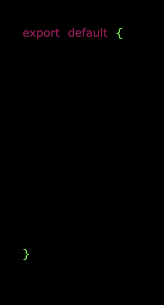

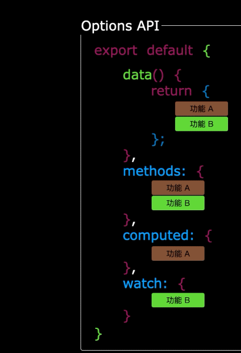

```html
<script>
  export default {
    // data() 返回的属性将会成为响应式的状态
    // 并且暴露在 `this` 上
    data() {
      return {
        count: 0
      }
    },

    // methods 是一些用来更改状态与触发更新的函数
    // 它们可以在模板中作为事件处理器绑定
    methods: {
      increment() {
        this.count++
      }
    },

    // 生命周期钩子会在组件生命周期的各个不同阶段被调用
    // 例如这个函数就会在组件挂载完成后被调用
    mounted() {
      console.log(`The initial count is ${this.count}.`)
    }
  }
</script>

<template>
  <button @click="increment">Count is: {{ count }}</button>
</template>
```

## Composition 组合式 API（Vue3）：
+ **通过 `setup()` 函数或 `<script setup>` 语法组织代码**
+ 允许按逻辑关注点（如表单处理、数据获取）组织代码，提高复用性
+ 核心思想是直接在函数作用域内定义响应式状态变量，并将从多个函数中得到的状态组合起来处理复杂问题


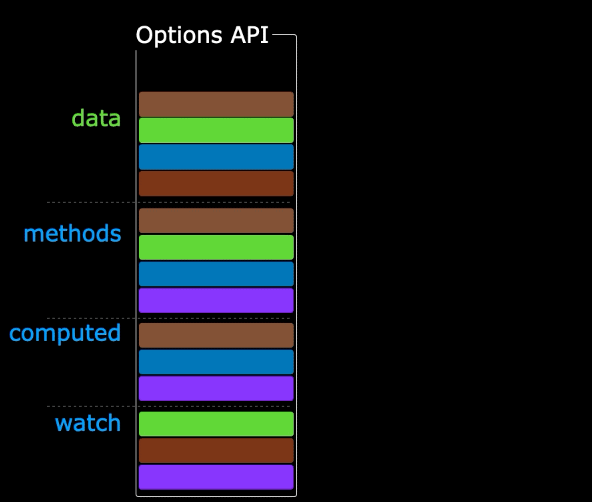


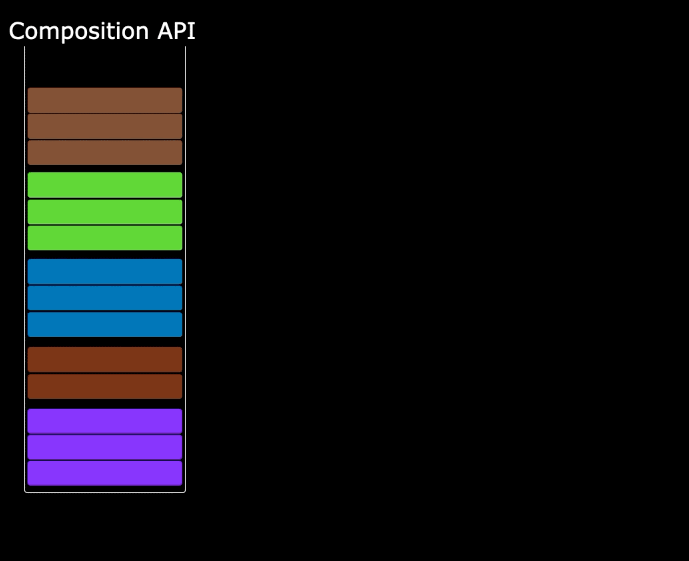

## setup 概述
`setup`是`Vue3`中一个新的配置项，值是一个函数，它是 `Composition API`**表演的舞台**

组件中所用到的：数据、方法、计算属性、监视......等等，均配置在`setup`中

特点如下：

+ `setup`函数返回的对象中的内容，可直接在模板中使用
+ **`setup`中访问`this`是`undefined`**
+ `setup`函数会在`beforeCreate`之前调用，它是“领先”所有钩子执行的

```vue
<script setup>
import { ref, onMounted } from 'vue'

// 响应式状态
const count = ref(0)

// 用来修改状态、触发更新的函数
function increment() {
  count.value++
}

// 生命周期钩子
onMounted(() => {
  console.log(`The initial count is ${count.value}.`)
})
</script>

<template>
  <button @click="increment">Count is: {{ count }}</button>
</template>
```


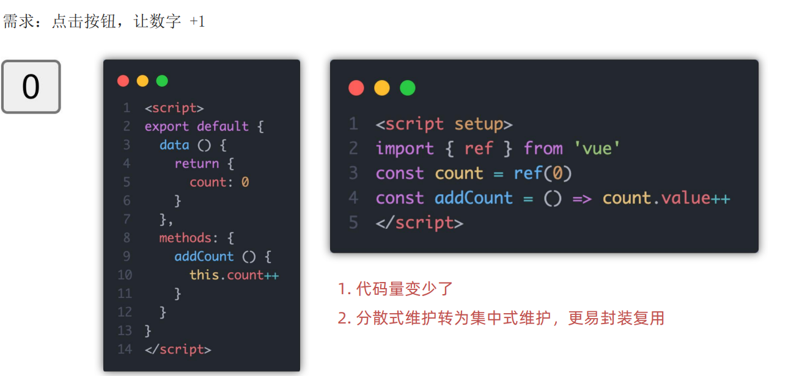

## Vue3 核心优势
### 更容易维护
逻辑聚合 + 类型友好

**组合式 API（Composition API）对比 Vue2 选项式 API**：

+ Vue2 按 `data`/`methods`/`computed` 等**选项分割代码**，复杂组件的逻辑会分散在不同选项中（如 “定时器逻辑” 可能分布在 `data`、`methods`、`beforeDestroy` 里），维护成本高
+ Vue3 允许按 **功能逻辑聚合代码**（如把 “用户登录 + Token 管理” 封装为独立函数composable 自定义hook），复用更方便，代码结构更清晰

**更好的 TypeScript 支持**

+ Vue3 源码基于 TypeScript 重构，类型定义更完善；
+ 组合式 API（如 `ref`/`reactive`）的类型推导更自然，开发时**类型提示、编译检查更高效**（对比 Vue2 需额外定义接口适配 `data`）

### 更快的速度
编译 + 渲染优化

**重写 Diff 算法（静态标记 Patch Flag）**

+ Vue2 的 Diff 是全量对比所有节点，即使大部分节点不变，也会遍历检查
+ Vue3 编译时给 **动态节点打标记**（如 `TEXT` 表示文本变化、`CLASS` 表示类变化），更新时**只处理带标记的节点**，大幅减少无效计算

**Diff 算法**即**差异比较算法**，在计算机科学领域，它主要用于对比两个对象（通常是文本、数据结构等）之间的差异。比如在版本控制系统中，通过 Diff 算法可以确定两个版本文件之间具体哪些部分发生了改变；在前端开发的虚拟 DOM 技术里，利用 Diff 算法能快速找出前后两次虚拟 DOM 树的差异，从而只更新实际变化的部分，提升渲染效率，减少不必要的性能损耗。

**模板编译优化**

+ **静态提升**：把不变的静态内容（如静态文本、标签）提取到渲染函数外，避免每次渲染重复创建
+ **事件缓存**：`@click` 等事件处理函数编译后会缓存，减少不必要的更新

**组件初始化更高效**

+ 支持 **Fragment（碎片）** ：组件可返回多个根节点，减少多余 DOM 层级；
+ 配合 Proxy 响应式系统，**依赖收集更高效**（无需像 Vue2 一样递归遍历对象）

### 更小的体积
Tree-Shaking + 按需引入

**Tree-Shaking 友好**

+ Vue3 的 API 采用 **ES 模块导出**（如 `export function ref()`），打包工具（Webpack/Rollup）能识别并剔除**未使用的 API**（如只用 `reactive` 就不会打包 `ref` 的代码）

**”Tree-Shaking” 即摇树优化**，是一种在打包工具（如 Webpack）中用于消除未使用代码的优化技术。它会像摇树一样，将那些在项目中没有被引用的代码（“枯枝”）抖落，从而减小打包后的文件体积，提高项目性能。例如在一个 JavaScript 项目中，若定义了多个函数，但只有部分函数在代码中被调用，Tree-Shaking 技术就能把未被调用的函数代码去除，使得最终打包的文件只包含实际使用的代码。

**按需引入机制**

+ 支持**细粒度导入**

```javascript
import { ref, computed } from 'vue' // 只导入需要的 API
```

对比 Vue2 必须整体引入 `Vue` 构造函数，进一步压缩包体积

# Vue3 响应式原理
Vue3 使用 JavaScript 的<strong> Proxy 对象</strong>取代了 Vue2 中的 `Object.defineProperty()`，从而实现了更强大、更高效的响应式系统

Proxy 是 ES6 引入的新特性，它可以拦截并自定义对对象的基本操作（如属性查找、赋值、函数调用等）

**Proxy 替代 Object.defineProperty**

“Proxy” 常见含义为 “代理”“代理人”“代理权” 等。在计算机领域，它指代理服务器，是一种重要的服务器安全功能，可作为客户端和其他服务器之间的中介，隐藏真实客户端的 IP 地址等信息，提供访问控制、缓存等功能

## Proxy
Proxy 对象允许创建一个对象的代理，从而可以拦截并重新定义该对象的基本操作

创建 Proxy 需要两个参数：

+ **target**：需要代理的目标对象
+ **handler**：一个对象，定义了要拦截的操作及拦截后的处理函数

下面是一个简单的 Proxy 示例：

```javascript
// 目标对象
const target = {
  name: '张三',
  age: 25
};

// 处理器对象，定义拦截行为
const handler = {
  // 拦截属性读取
  get(target, property) {
    console.log(`读取属性 ${property}`);
    return target[property];
  },
  
  // 拦截属性赋值
  set(target, property, value) {
    console.log(`设置属性 ${property} 为 ${value}`);
    target[property] = value;
    return true; // 表示赋值成功
  }
};

// 创建代理对象
const proxy = new Proxy(target, handler);

// 使用代理对象
console.log(proxy.name); // 读取属性 name
proxy.age = 26;          // 设置属性 age
console.log(proxy.age);  // 读取属性 age
```

Proxy 的基本用法：通过定义 `get` 和 `set` 拦截器，可以在读取或修改对象属性时执行自定义操作

## 工作流程
Vue3 的响应式系统工作流程与 Vue2 类似，但有一些关键区别：

1. **初始化数据**：Vue3 使用 `reactive()` 或 `ref()` 创建响应式数据
2. **创建副作用**：组件渲染、计算属性、监听器等都会创建副作用函数
3. **依赖收集**：当副作用函数执行时，会触发响应式对象属性的 getter，从而收集依赖
4. **数据变化**：当响应式对象的属性发生变化时，会触发 setter
5. **触发更新**：setter 通知所有依赖的副作用函数，根据调度策略执行更新

## Vue3 响应式优势
**更好的性能**：

+ 不需要递归遍历所有属性，只在访问嵌套对象时才创建代理
+ 依赖收集更精确，只有真正被访问的属性才会被追踪

**更完整的响应式支持**：

+ 可以检测对象属性的添加和删除
+ 可以检测数组长度的变化
+ 可以检测对象原型的修改

**更灵活的 API**：

+ 提供了 `reactive()`、`ref()`、`computed()` 等多种创建响应式数据的方式
+ 支持自定义响应式处理（通过 `customRef()`）

  

**深度响应式无需递归转换**：Proxy 可以拦截对象的所有操作，包括嵌套对象

**可以检测属性的添加和删除**：Vue3 能够响应式地处理对象属性的新增和删除

**可以拦截数组的变化**：Proxy 可以拦截数组的各种操作，包括改变数组长度

**更好的性能**：不需要像 Vue2 那样递归遍历对象的所有属性

# vue2 与 vue3 响应式对比
## 核心实现原理
### vue2 响应式实现
基于 ES5 的 Object.defineProperty 方法，通过遍历 data 选项中的所有属性，将每个属性转换为带有 getter 和 setter 的形式，实现对属性读取和修改操作的劫持，该过程称为数据劫持。

初始化时需递归遍历对象的所有层级属性，逐一进行 getter/setter 转换，从而实现数据响应式。

### vue3 响应式实现
基于 ES6 新增的 Proxy 构造函数，直接对目标对象进行代理，而非针对单个属性

通过创建对象的代理实例，拦截对象的各类操作（包括属性读取、修改、新增、删除等），配合 Reflect API 完成对目标对象的操作转发。同时采用懒递归策略，仅在属性被访问时才对深层属性进行代理，无需初始化时全量递归。

## 核心功能差异对比
| **对比维度** | **vue2 Object.defineProperty** | **vue3 Proxy** |
| --- | --- | --- |
| 新增属性监听 | 不支持，需通过 Vue.set 或 this.$set 手动触发响应 | 原生支持，直接新增属性即可触发响应 |
| 数组下标修改监听 | 不支持，修改数组下标无法触发视图更新 | 原生支持，数组下标修改可直接触发响应 |
| 数组 length 修改监听 | 不支持，修改 length 属性无响应 | 原生支持，修改 length 可触发响应 |
| 属性删除监听 | 不支持，delete 操作无法被捕获 | 原生支持，delete 属性可被拦截并触发响应 |
| 复杂数据类型支持 | 仅支持对象和数组，不支持 Map Set 等类型 | 原生支持 Map Set Date RegExp 等复杂类型 |
| 初始化性能 | 需全量递归遍历所有属性，初始化耗时较长 | 懒递归机制，仅访问时代理深层属性，性能更优 |
| 响应式触发条件 | 仅能拦截属性的读取和修改操作 | 可拦截多种操作，包括 in 判断、遍历等 |

## 使用场景与补充说明
### vue2 的限制与解决方案
由于 Object.defineProperty 的设计局限，vue2 在实际使用中存在明显限制：

+ 无法监听新增属性、数组下标及 length 修改等

为解决这些问题，vue2 提供了 Vue.set/this.$set 方法用于手动触发新增属性的响应式，同时重写了数组的 push pop unshift shift splice sort reverse 等方法，使这些方法调用时能触发视图更新，本质上是对底层缺陷的补丁式修复。

### vue3 的优势与兼容性
vue3 采用的 Proxy 方案从根本上解决了 vue2 的诸多限制，响应式覆盖场景更全面，无需额外的补丁方法

+ Proxy 作为 ES6 语法，不支持 IE 浏览器，这也是 vue3 放弃 IE 兼容性的重要原因之一
+ vue3 的响应式系统还支持对原始值（如字符串、数字）的响应式处理，通过 ref 函数将原始值包装为带有 value 属性的响应式对象，进一步拓展了响应式的应用范围。

## 核心差异总结
vue2 的响应式是基于单个属性的劫持，通过 getter/setter 实现有限的操作拦截，存在场景覆盖不全、性能优化有限等问题；

vue3 的响应式是基于整个对象的代理，通过 Proxy 实现更全面的操作拦截，配合懒递归和 Reflect API，在功能完整性、性能表现和扩展性上均实现了显著提升

两者的核心差异本质上是底层 API 的设计差异导致的功能和性能差异，vue3 的方案更符合现代 JavaScript 的发展趋势，也更能满足复杂应用的响应式需求

# 工程化开发 vite
基于 `create-vue` 搭建 Vue3 工程化项目，是 Vue 官方推荐的现代化开发方式

**vite**是新一代前端构建工具，官网地址：[https://vitejs.cn](https://vitejs.cn/)，`vite`的优势如下：

+ 轻量快速的热重载（`HMR`），能实现极速的服务启动
+ 对 `TypeScript`、`JSX`、`CSS` 等支持开箱即用
+ 真正的按需编译，不再等待整个应用编译完成
+ `webpack`构建 与 `vite`构建对比图如下：


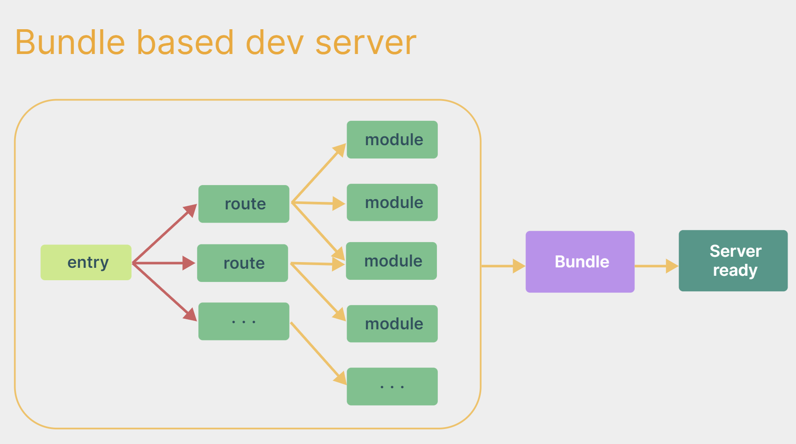


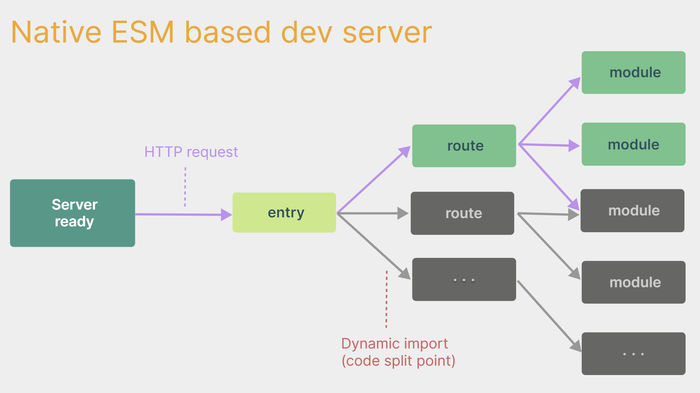

## create-vue
`create-vue` 是 **Vue 官方最新的脚手架工具**（替代旧版 `@vue/cli`）

基于 **Vite 构建工具**开发，核心目标是快速生成**标准化、工程化的 Vue3 项目**，具备以下能力：

+ 开箱即用的工程化配置（热更新、测试、打包优化等）；
+ 支持交互式选择功能（TypeScript、路由、状态管理、代码规范等）；
+ 贴合 Vue3 生态（组合式 API、Pinia、Vue Router 4 等）

“Vite” 常见指一款基于 Node.js 的前端构建工具，它具有快速冷启动、即时热模块替换等特性，能显著提升开发效率。在法语里，“vite” 是副词，意为 “快速地、迅速地” 。此外，它也可能作为特定名称，比如品牌名、项目名等出现在不同场景。

## 环境准备 
**安装 Node.js**：要求版本 ≥18（Vite 依赖），通过 `node -v` 检查版本

**选择包管理器**：`npm`（内置）、`yarn` 或 `pnpm`（推荐，更快），通过 `npm -v`/`yarn -v` 检查

## 创建 Vue3 工程化项目
**初始化项目**

运行命令（三选一，以 npm 为例）：

```bash
npm init vue@latest  # 交互式创建，逐步选择功能
```

**交互选项说明**（关键选择决定项目能力）

| **选项** | **作用** |
| :--- | :--- |
| Project name | 项目名称（默认 `vue-project`，可自定义） |
| Add TypeScript? | 是否启用 TypeScript（推荐，增强类型约束） |
| Add Vue Router? | 是否添加 Vue Router 4（单页应用路由管理） |
| Add Pinia? | 是否添加 Pinia（Vue3 状态管理，替代 Vuex，更轻量） |
| Add ESLint? | 是否添加 ESLint（代码规范检测，可选配 Prettier 格式化） |
| Add Vitest? | 是否添加 Vitest（单元测试工具，Vue 官方推荐） |
| Add Cypress? | 是否添加 Cypress（端到端测试，复杂项目可选） |

**安装依赖并启动**

进入项目目录，安装依赖并启动开发环境：

```bash
cd your-project-name  # 进入项目目录
npm install           # 安装依赖
npm run dev           # 启动开发服务（默认地址：http://127.0.0.1:5173/）
```

## 工程化项目结构解析
核心目录 / 文件功能：

```plain
project-name/
├── src/                # 开发核心目录
│   ├── assets/         # 静态资源（图片、样式等）
│   ├── components/     # 通用组件（可复用的 UI 模块）
│   ├── views/          # 页面级组件（配合路由使用）
│   ├── router/         # 路由配置（若选了 Vue Router）
│   ├── stores/         # Pinia 状态管理（若选了 Pinia）
│   ├── App.vue         # 根组件（组装页面布局）
│   └── main.js         # 入口文件（创建 Vue 实例，挂载根组件）
├── vite.config.ts      # Vite 配置（端口、代理、别名等）
├── tsconfig.json       # TypeScript 配置（若启用 TS）
├── .eslintrc.cjs       # ESLint 规则（若启用代码规范）
├── index.html          # 
└── package.json        # 依赖管理 & 脚本命令
```

**main.js**

```javascript
import './assets/main.css'

import { createApp } from 'vue'
import App from './App.vue'
// vue3将创建实例进行了封装，保证每个实例的独立性
// createRouter() 创建路由实例
// createStore() 创建状态管理实例

// 创建实例 设置挂载点 index.html 中 id为app的元素
createApp(App).mount('#app')
```

**App.vue**

**变化一：脚本script和模板template顺序调整**

**变化二：模板template不再要求唯一根元素**

**变化三：脚本script添加setup标识支持组合式API**

```vue
<script setup>
  import HelloWorld from './components/HelloWorld.vue'
  import TheWelcome from './components/TheWelcome.vue'
</script>

<template>
  <header>
    

    <div class="wrapper">
      <HelloWorld msg="You did it!" />
    </div>
  </header>

  <main>
    <TheWelcome />
  </main>
</template>

<style scoped>
```

## 构建与部署
**打包生产环境**：运行 `npm run build`，Vite 会在 `dist/` 目录生成**优化后的静态资源**（Tree-shaking、压缩、按需加载等）

**部署**：将 `dist/` 目录部署到静态服务器：

+ 简单方案：Nginx 配置静态资源代理；
+ 云方案：Vercel、Netlify 直接托管（自动识别 Vite 项目）

## `create-vue` 对比旧脚手架（@vue/cli）
| **特性** | `create-vue`（基于 Vite） | `@vue/cli`（基于 Webpack） |
| :--- | :--- | :--- |
| 启动速度 | 秒级冷启动（无需打包） | 依赖打包，启动慢 |
| 热更新 | 毫秒级响应（HMR 更高效） | 秒级更新，大型项目更明显 |
| 配置复杂度 | 开箱即用，配置简洁 | 需维护复杂 `vue.config.js` |
| 生态贴合度 | 原生支持 Vue3 特性（组合式 API） | 需额外适配 Vue3 |

**总结**：`create-vue` 是 Vue3 工程化的**最佳实践起点**，通过标准化流程、现代化工具链（Vite、Pinia、Vitest 等），大幅提升开发效率和项目可维护性。从创建到部署，全程覆盖**组件开发、状态管理、路由、测试、打包**，是中大型 Vue 项目的首选方案

# setup 选项  
## 执行时机

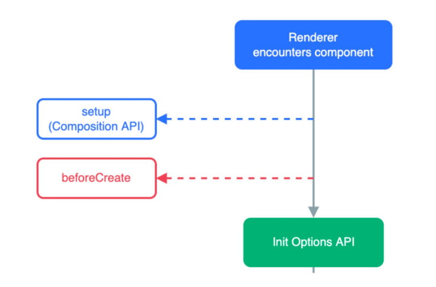

```html
<script >
  export default {
    // 执行时机，比beforeCreated更早
    // setup函数中无法获取this unddfined
    setup() {
      console.log('App.vue setup')
    },
    beforeCreate() {
      console.log('App.vue beforeCreate')
    },
  }
</script>
```

## 语法模版
```html
<script >
export default {
  // 执行时机，比beforeCreated更早
  // setup函数中无法获取this undefined
  setup() {
    // 数据
    const msg = 'hello world'
    // 函数
    const say = () => {
      console.log(msg)
    }
    // 必须添加return，才能模版使用
    return {
      msg,
      say,
    }
  }
}
</script>

<template>
  <div>
    <h1>{{msg}}</h1>
    <button @click="say">click me</button>
  </div>
  
</template>
```

> setup 中 this 为 undefined

## 语法糖    
`setup`函数有一个语法糖，这个语法糖，可以让我们把`setup`独立出去，代码如下：

```vue
<script setup>
    // 数据
    const msg = 'hello world'
    // 方法
    const say = () => {
      console.log(msg)
    }
</script>
<script>
  export default {
    name:'LoginIndex'
  }
</script>
```

扩展：上述代码，还需要**编写一个不写`setup`的`script`标签，去指定组件名字**

**可以借助`vite`中的插件简化**

第一步：

```vue
npm i vite-plugin-vue-setup-extend -D
```

第二步：`vite.config.ts`

```typescript
import { defineConfig } from 'vite'
import VueSetupExtend from 'vite-plugin-vue-setup-extend'

export default defineConfig({
  plugins: [ VueSetupExtend() ]
})
```

第三步：

```vue
<script setup lang="ts" name="Person">
```

> setup 和 data,methods 等属于同一等级，它们可以同时书写使用
>
> data 中可以调用 setup 中的内容！！，setup 执行时间比生命周期都早
>
> 但 setup 中无法读取 data、methods 中的内容

```html
<script >
  export default {
    // 执行时机，比beforeCreated更早
    // setup函数中无法获取this unddfined
    setup() {
      let name = 'zs'
      console.log('App.vue setup')
    },
    data(){
      return{
        a :100
        c:this.name
      }
    },
    methods:{
      b(){
        console
      }
    }
  }
</script>
```

# reactive & ref 函数  
用函数调用的方式生成响应式数据  

**推荐使用ref函数，更加灵活统一** 

## reactive() 对象类型的响应式数据  
**作用：** 接受**对象类型**数据的参数传入并返回一个响应式的对象  

**步骤：**

+ 从 vue 包中导入 reactive 函数 
+ 执行 reactive 函数并传入类型为对象的初始值，并使用变量接收返回值  

**返回值：** 一个**Proxy**的实例对象，简称：**响应式对象**

**注意：`reactive`定义的响应式数据是“深层次”的**

基于 ES6 的 Proxy 实现深层响应式，会递归监听对象的所有属性

+ **当嵌套对象的属性**变化时，也会触发响应式更新

```html
<script setup>
  // 数据
  import { reactive } from 'vue'
  // const state = reactive(对象类型数据)
  const state = reactive({
    msg: 'hello world',
    say() {
      console.log(this.msg)
    }
  })
  const obj = reactive({
    a:{
      b:{
        c:666
      }
    }
  })
</script>
```

**reactive**：**直接访问和修改对象属性**

**reactive**：**解构后会失去响应式**（因为 Proxy 代理的是原对象）

```javascript
const state = reactive({ count: 0 });
const { count } = state; // 解构后count不再是响应式的
```

## ref() 简单或对象类型的响应式数据  
**作用：** 接收**简单类型**或者**对象类型**的数据传入并返回一个响应式的对象  

**本质：** 原有传入数据的基础上，外层包了一层对象变为复杂类型，再借助 **reactive**实现响应式

**注意：**

+ **脚本 script**中必须通过 **.value**访问修改，**模版 template**中直接使用
+ 对于`let name = ref('张三')`来说，`name`不是响应式的，`name.value`是响应式的

**ref**：需要通过 **.value**操作数据访问和修改值（在模板中除外）

```javascript
// name和age是一个RefImpl的实例对象，简称ref对象，它们的value属性是响应式的
let name = ref('张三')
let age = ref(18)
const count = ref(0);
// tel就是一个普通的字符串，不是响应式的
let tel = '13888888888'
count.value++; // 通过.value修改值
```

> 注意：name不是响应式的，name.value是响应式的，所以如下代码并不会引起页面的更新

```javascript
name = ref('zhang-san')
```

在模板中使用时，Vue 会自动解包`ref`，无需写`.value`：

```html
<div>{{ count }}</div> <!-- 直接使用，无需.value -->
```

**步骤：**

+ 从 vue 包中导入 ref 函数
+ 执行 ref 函数并传入初始值，使用变量接收ref 函数的返回值  

```html
<script setup>
    import { ref } from 'vue'
    const count = ref(0)
    const addCount = () => {
      count.value++
    }
</script>

<template>
  <div>
    <h1>{{count}}</h1>
    <button @click="addCount">点击+1</button>
  </div>
  
</template>
```

**ref**：解构后仍保持响应式，但需要保留`.value`访问

```javascript
const count = ref(0);
const { value } = count; // 解构后需通过value.value访问
```

## ref 对比 reactive
宏观角度：

+ `ref`用来定义：基本类型数据、对象类型数据；
+ `reactive`用来定义：对象类型数据

区别：

+ `ref`创建的变量必须使用`.value`（可以使用**volar`插件自动添加`.value**）
+ 只要使用`.value`，必是响应式的
+ `reactive`重**新分配一个新对象，会失去响应式**（可以**使用`Object.assign`去整体替换**）
+ “assign” 常见词性为动词，基本意思是 “分配；分派；指定；把… 归因于” 

```javascript
let car = reactive({barand:'丰田',price:100})

car =  {barand:'特斯拉',price:100} //页面无法做到更新
Object.assign({barand:'特斯拉',price:100})
```

使用原则：

+ 若需要一个基本类型的响应式数据，必须使用`ref`
+ 若需要一个响应式对象，层级不深，`ref`、`reactive`都可以
+ **若需要一个响应式对象，且层级较深，推荐使用reactive**

## toRefs 与 toRef
+ 作用：将一个响应式对象中的每一个属性，转换为`ref`对象
+ 备注：`toRefs`与`toRef`功能一致，**但`toRefs`可以批量转换**
+ 语法如下：

```vue
<template>
  <div class="person">
    <h2>姓名：{{person.name}}</h2>
    <h2>年龄：{{person.age}}</h2>
    <h2>性别：{{person.gender}}</h2>
    <button @click="changeName">修改名字</button>
    <button @click="changeAge">修改年龄</button>
    <button @click="changeGender">修改性别</button>
  </div>
</template>

<script lang="ts" setup name="Person">
  import {ref,reactive,toRefs,toRef} from 'vue'

  // 数据
  let person = reactive({name:'张三', age:18, gender:'男'})

  // 通过toRefs将person对象中的n个属性批量取出，且依然保持响应式的能力
  let {name,gender} =  toRefs(person)

  // 通过toRef将person对象中的gender属性取出，且依然保持响应式的能力
  let age = toRef(person,'age')

  // 方法
  function changeName(){
    name.value += '~'
  }
  function changeAge(){
    age.value += 1
  }
  function changeGender(){
    gender.value = '女'
  }
</script>
```

# computed 计算属性函数  
计算属性基本思想和Vue2的完全一致，组合式API下的计算属性只是修改了写法 

核心步骤：

+ 导入computed 函数
+ 执行函数在回调参数中return基于响应式数据做计算的值，用变量接收 

```html
<script setup>
  import { ref } from 'vue'
  const count = ref(100)
  const list = ref([1, 2, 3,4,5,6,7,8,9,10])
  // 计算属性 computed
  import { computed } from 'vue'
  const doubleCount = computed(() => {
    // return基于响应式数据做计算的值
    return count.value * 2
  })
  // 注意 list是对象，需要使用list.value 拿到数组
  const fliterList = computed(() => list.value.filter(item => item > 5))
</script>

<template>
  <div>
    <p>{{ doubleCount }}</p>
  </div>
</template>
```

 避免直接修改计算属性的值  

 **计算属性应该是只读的，特殊情况可以配置get set**

```javascript
// 这么定义的fullName是一个计算属性，可读可写
let fullName = computed({
  get(){
    return A.value + B.value
  },
  set(val){
    console.log('set',val)
    A.value = val[]
    B.value = val[]
  }
})
```

# watch 侦听函数  
**作用:** 侦听一个或者多个数据的变化，数据变化时执行回调函数 

特点：`Vue3`中的`watch`只能监视以下**四种数据**：

+ `ref`定义的数据
+ `reactive`定义的数据
+ 函数返回一个值（`getter`函数）
+ 一个包含上述内容的数组

## 基础步骤   
+ 导入watch 函数
+ 执行watch 函数传入要侦听的响应式数据( ref对象 )和回调函数  

```html
<script setup>
  import { ref } from 'vue'
  const count = ref(100)
  // 监听
  import { watch } from 'vue'
  watch(count, (newValue, oldValue) => {
    console.log(`监听到count发生了改变 新${newValue}, 旧${oldValue}`)
  })
</script>
```

## immediate 初始化监听  
说明：在侦听器**创建时**立即触发回调, 响应式数据变化之后继续执行回调  

旧 undefined

```html
<script setup>
  // 数据
  import { ref } from 'vue'
  const count = ref(100)
  // 方法
  const addCount = () => {
      count.value++
  }
  // 监听
  import { watch } from 'vue'
  watch(count, (newValue, oldValue) => {
    console.log(`监听到count发生了改变 新${newValue}, 旧${oldValue}`)
  },
  {
    // 监听初始化
    immediate: true, // 默认false
  })
</script>
<template>
  <div>
    <p>{{ count }}</p>
    <button @click="addCount">count+1</button>
  </div>
  
</template>
```

## deep 深度监听  
通过watch监听的ref对象默认是浅层侦听的，直接修改**嵌套的对象属性不会触发回调执行**

> **原理：** 使用 `ref` 创建一个对象时，该对象的值被包裹在一个 `ref` 容器中，其 `.value` 属性保存了实际的值，如果监听的是整个 `ref` 对象（而不是它的 `.value`），Vue 只会追踪对 `ref` 本身赋值的操作（例如 `obj = newValue`）；
>
> 默认情况下，`watch` 是“浅层”监听的。这意味着它只监听**引用地址的变化，** 如果修改了对象内部的属性（如 `obj.value.name = '新值'`），由于对象的引用地址没有改变，`watch` 不会触发

Vue **不会**自动追踪对象内部属性的变化并**保留旧值**

需要开启deep选项  

```vue
<script setup>
  // 数据
  import { ref } from 'vue'
  const obj = ref({
    name: '张三',
    age: 18
  })
  // 方法
  const changeObj = () => {
    // 直接修改嵌套的对象属性不会触发回调执行
    obj.value.name = '王五'
  }
  // 监听
  import { watch } from 'vue'
  // 监听对象
  // Vue 不会自动追踪对象内部属性的变化并保留旧值
  // 如果想获取真正的旧值，可以手动保存一份旧值的副本
  let oldValue = {...obj.value};
  watch(obj,
    (newValue) => {
        console.log(`监听对象 新${newValue.name}, 旧${oldValue.name}`)
        oldValue = {...newValue};
    },{
    deep: true,
  })
</script>
<template>
  <div>
    <button @click="changeObj">修改对象信息</button>
  </div>
  
</template>
```

## 精确侦听对象的某个属性  
需求：在不开启deep的前提下，侦听age的变化，只有age变化时才执行回调  

```vue
<script setup>
const changeAge = () => {
    obj.value.age = 20
  }
// 只监听对象的某个属性
watch(
  () => obj.value.name,
  (newName,oldName) => console.log(`只监听对象name 属性${newName}, 旧${oldName}`)
)
</script>
```

## 监视`ref`基本类型
监视`ref`定义的【基本类型】数据：直接写数据名即可，监视的是其`value`值的改变

```vue
<template>
  <div class="person">
    <h1>情况一：监视【ref】定义的【基本类型】数据</h1>
    <h2>当前求和为：{{sum}}</h2>
    <button @click="changeSum">点我sum+1</button>
  </div>
</template>

<script lang="ts" setup name="Person">
  import {ref,watch} from 'vue'
  // 数据
  let sum = ref(0)
  // 方法
  function changeSum(){
    sum.value += 1
  }
  // 监视，情况一：监视【ref】定义的【基本类型】数据
  const stopWatch = watch(sum,(newValue,oldValue)=>{
    console.log('sum变化了',newValue,oldValue)
    if(newValue >= 10){
      stopWatch()
    }
  })
</script>
```

## 监视`ref`对象类型
监视`ref`定义的【对象类型】数据：直接写数据名，**监视**的是对象的 **地址值** ，若想监视对象内部的数据，要手动开启深度监视

若修改的是`ref`定义的对象中的属性，`newValue` 和 `oldValue` 都是新值，因为它们是同一个对象

若修改整个`ref`定义的对象，`newValue` 是新值， `oldValue` 是旧值，因为不是同一个对象了

```vue
<template>
  <div class="person">
    <h1>情况二：监视【ref】定义的【对象类型】数据</h1>
    <h2>姓名：{{ person.name }}</h2>
    <h2>年龄：{{ person.age }}</h2>
    <button @click="changeName">修改名字</button>
    <button @click="changeAge">修改年龄</button>
    <button @click="changePerson">修改整个人</button>
  </div>
</template>

<script lang="ts" setup name="Person">
  import {ref,watch} from 'vue'
  // 数据
  let person = ref({
    name:'张三',
    age:18
  })
  // 方法
  function changeName(){
    person.value.name += '~'
  }
  function changeAge(){
    person.value.age += 1
  }
  function changePerson(){
    person.value = {name:'李四',age:90}
  }
  /* 
    监视，情况一：监视【ref】定义的【对象类型】数据，监视的是对象的地址值
    若想监视对象内部属性的变化，需要手动开启深度监视
    watch的第一个参数是：被监视的数据
    watch的第二个参数是：监视的回调
    watch的第三个参数是：配置对象（deep、immediate等等.....） 
  */
  watch(person,(newValue,oldValue)=>{
    console.log('person变化了',newValue,oldValue)
  },{deep:true})

</script>
```

## 监视 reactive 对象类型
监视`reactive`定义的【对象类型】数据，且**默认开启了深度监视**

```vue
<template>
  <div class="person">
    <h1>情况三：监视【reactive】定义的【对象类型】数据</h1>
    <h2>姓名：{{ person.name }}</h2>
    <h2>年龄：{{ person.age }}</h2>
    <button @click="changeName">修改名字</button>
    <button @click="changeAge">修改年龄</button>
    <button @click="changePerson">修改整个人</button>
    <hr>
      <h2>测试：{{obj.a.b.c}}</h2>
      <button @click="test">修改obj.a.b.c</button>
    </div>
</template>

<script lang="ts" setup name="Person">
  import {reactive,watch} from 'vue'
  // 数据
  let person = reactive({
    name:'张三',
    age:18
  })
  let obj = reactive({
    a:{
      b:{
        c:666
      }
    }
  })
  // 方法
  function changeName(){
    person.name += '~'
  }
  function changeAge(){
    person.age += 1
  }
  function changePerson(){
    Object.assign(person,{name:'李四',age:80})
  }
  function test(){
    obj.a.b.c = 888
  }

  // 监视，情况三：监视【reactive】定义的【对象类型】数据，且默认是开启深度监视的
  watch(person,(newValue,oldValue)=>{
    console.log('person变化了',newValue,oldValue)
  })
  watch(obj,(newValue,oldValue)=>{
    console.log('Obj变化了',newValue,oldValue)
  })
</script>
```

## 监视的对象属性
监视`ref`或`reactive`定义的【对象类型】数据中的**某个属性**，注意点如下：

+ 若该属性值**不是**【对象类型】，需要写成函数形式
+ 若该属性值是**依然**是【对象类型】，可直接编，也可写成函数，建议写成函数

结论：监视的要是对象里的属性，那么最好写函数式，注意点：若是对象监视的是地址值，需要关注对象内部，需要手动开启深度监视。

```vue
<template>
  <div class="person">
    <h1>情况四：监视【ref】或【reactive】定义的【对象类型】数据中的某个属性</h1>
    <h2>姓名：{{ person.name }}</h2>
    <h2>年龄：{{ person.age }}</h2>
    <h2>汽车：{{ person.car.c1 }}、{{ person.car.c2 }}</h2>
    <button @click="changeName">修改名字</button>
    <button @click="changeAge">修改年龄</button>
    <button @click="changeC1">修改第一台车</button>
    <button @click="changeC2">修改第二台车</button>
    <button @click="changeCar">修改整个车</button>
  </div>
</template>

<script lang="ts" setup name="Person">
  import {reactive,watch} from 'vue'

  // 数据
  let person = reactive({
    name:'张三',
    age:18,
    car:{
      c1:'奔驰',
      c2:'宝马'
    }
  })
  // 方法
  function changeName(){
    person.name += '~'
  }
  function changeAge(){
    person.age += 1
  }
  function changeC1(){
    person.car.c1 = '奥迪'
  }
  function changeC2(){
    person.car.c2 = '大众'
  }
  function changeCar(){
    person.car = {c1:'雅迪',c2:'爱玛'}
  }

  // 监视，情况四：监视响应式对象中的某个属性，且该属性是基本类型的，要写成函数式
  /* watch(()=> person.name,(newValue,oldValue)=>{
    console.log('person.name变化了',newValue,oldValue)
  }) */

  // 监视，情况四：监视响应式对象中的某个属性，且该属性是对象类型的，可以直接写，也能写函数，更推荐写函数
  watch(()=>person.car,(newValue,oldValue)=>{
    console.log('person.car变化了',newValue,oldValue)
  },{deep:true})
</script>
```

## 监视多个数据
```vue
<template>
  <div class="person">
    <h1>情况五：监视上述的多个数据</h1>
    <h2>姓名：{{ person.name }}</h2>
    <h2>年龄：{{ person.age }}</h2>
    <h2>汽车：{{ person.car.c1 }}、{{ person.car.c2 }}</h2>
    <button @click="changeName">修改名字</button>
    <button @click="changeAge">修改年龄</button>
    <button @click="changeC1">修改第一台车</button>
    <button @click="changeC2">修改第二台车</button>
    <button @click="changeCar">修改整个车</button>
  </div>
</template>

<script lang="ts" setup name="Person">
  import {reactive,watch} from 'vue'

  // 数据
  let person = reactive({
    name:'张三',
    age:18,
    car:{
      c1:'奔驰',
      c2:'宝马'
    }
  })
  // 方法
  function changeName(){
    person.name += '~'
  }
  function changeAge(){
    person.age += 1
  }
  function changeC1(){
    person.car.c1 = '奥迪'
  }
  function changeC2(){
    person.car.c2 = '大众'
  }
  function changeCar(){
    person.car = {c1:'雅迪',c2:'爱玛'}
  }

  // 监视，情况五：监视上述的多个数据
  watch([()=>person.name,person.car],(newValue,oldValue)=>{
    console.log('person.car变化了',newValue,oldValue)
  },{deep:true})

</script>
```

## watchEffect
官网：立即运行一个函数，同时响应式地追踪其依赖，并在依赖更改时重新执行该函数。

`watch`对比`watchEffect`

+ 都能监听响应式数据的变化，不同的是监听数据变化的方式不同
+ `watch`：要明确指出监视的数据
+ `watchEffect`：不用明确指出监视的数据（函数中用到哪些属性，那就监视哪些属性）

```vue
<template>
  <div class="person">
    <h1>需求：水温达到50℃，或水位达到20cm，则联系服务器</h1>
    <h2 id="demo">水温：{{temp}}</h2>
    <h2>水位：{{height}}</h2>
    <button @click="changePrice">水温+1</button>
    <button @click="changeSum">水位+10</button>
  </div>
</template>

<script lang="ts" setup name="Person">
  import {ref,watch,watchEffect} from 'vue'
  // 数据
  let temp = ref(0)
  let height = ref(0)

  // 方法
  function changePrice(){
    temp.value += 10
  }
  function changeSum(){
    height.value += 1
  }

  // 用watch实现，需要明确的指出要监视：temp、height
  watch([temp,height],(value)=>{
    // 从value中获取最新的temp值、height值
    const [newTemp,newHeight] = value
    // 室温达到50℃，或水位达到20cm，立刻联系服务器
    if(newTemp >= 50 || newHeight >= 20){
      console.log('联系服务器')
    }
  })

  // 用watchEffect实现，不用
  const stopWtach = watchEffect(()=>{
    // 室温达到50℃，或水位达到20cm，立刻联系服务器
    if(temp.value >= 50 || height.value >= 20){
      console.log(document.getElementById('demo')?.innerText)
      console.log('联系服务器')
    }
    // 水温达到100，或水位达到50，取消监视
    if(temp.value === 100 || height.value === 50){
      console.log('清理了')
      stopWtach()
    }
  })
</script>
```

# Vue3 生命周期函数  
Vue3 的生命周期是组件从**创建→挂载→更新→卸载**的完整过程

每个阶段通过**钩子函数**暴露开发接口，能在关键时机注入逻辑

**生命周期**：组件从初始化到销毁的整个过程（创建、挂载、更新、卸载）

**钩子函数**：Vue 在每个阶段自动调用的回调函数，用于在特定时机执行自定义逻辑（如初始化数据、操作 DOM、清理资源等）

生命周期整体分为四个阶段，分别是：**创建、挂载、更新、销毁**，每个阶段都有两个钩子，一前一后

`Vue2`的生命周期

创建阶段：`beforeCreate`、`created`

挂载阶段：`beforeMount`、`mounted`

更新阶段：`beforeUpdate`、`updated`

销毁阶段：`beforeDestroy`、`destroyed`

`Vue3`的生命周期

创建阶段：`setup`

挂载阶段：`onBeforeMount`、`onMounted`

更新阶段：`onBeforeUpdate`、`onUpdated`

卸载阶段：`onBeforeUnmount`、`onUnmounted`

常用的钩子：`onMounted`(挂载完毕)、`onUpdated`(更新完毕)、`onBeforeUnmount`(卸载之前)

## 生命周期钩子对应关系表
Vue3 同时支持 **选项式 API**（兼容 Vue2 写法）和 **组合式 API**（推荐，更灵活），两者钩子对应关系如下

**关键变化：创建阶段的重构**

Vue3 中`beforeCreate` 和 `created` **被 `setup()` 替代**：

+ `setup()` 在组件实例创建初期执行（早于 `beforeCreate`），直接承担 “初始化数据、定义方法” 
+ 无需通过 `this` 访问组件实例（组合式 API 无 `this`），使用 `ref`/`reactive` 定义响应式数据

| **阶段** | **选项式 API（Vue2 风格）** | **组合式 API（Vue3 推荐）** |
| :--- | :--- | :--- |
| **创建阶段** | `beforeCreate`、`created` | 由 `setup()`替代 |
| **挂载阶段** | `beforeMount`、`mounted` | `onBeforeMount`、`onMounted` |
| **更新阶段** | `beforeUpdate`、`updated` | `onBeforeUpdate`、`onUpdated` |
| **卸载阶段** | `beforeDestroy`、`destroyed` | `onBeforeUnmount`、`onUnmounted` |
| **错误处理** | - | `onErrorCaptured` |

| **选项式 API** | **组合式 API** | **执行时机 & 作用** |
| :--- | :--- | :--- |
| **beforeCreate** | **（由 `setup` 覆盖）** | **组件实例创建前（无 `this`，逻辑移到 `setup`）** |
| **created** | **（由 `setup` 覆盖）** | **组件实例创建后（`setup`执行时机介于两者之间）** |
| `beforeMount` | `onBeforeMount` | 组件挂载到 DOM 前（可预处理数据） |
| `mounted` | `onMounted` | 组件挂载到 DOM 后（可操作 DOM、初始化第三方库） |
| `beforeUpdate` | `onBeforeUpdate` | 响应式数据变化，更新 DOM 前（可拦截更新） |
| `updated` | `onUpdated` | 响应式数据变化，更新 DOM 后（可同步 DOM 状态） |
| `beforeUnmount` | `onBeforeUnmount` | 组件卸载前（清理定时器、事件监听，关键阶段） |
| `unmounted` | `onUnmounted` | 组件卸载后（DOM 已移除，收尾工作） |

## 组合式 API 基本使用流程
导入生命周期函数

从 `vue` 包中按需导入（Tree-Shaking 友好）：

```javascript
import { onMounted, onUnmounted } from 'vue'
```

调用函数并传入回调

在 `<script setup>` 或 `setup()` 中使用，回调会在对应生命周期触发：

```html
<script setup lang="ts">
import { onMounted } from 'vue'

onMounted(() => {
  // 组件挂载后执行：比如初始化地图、图表
  console.log('DOM 已挂载，可操作元素')
})
</script>
```

## 各阶段钩子详解（组合式 API ）

**创建阶段：setup()**

**执行时机**：组件实例初始化后，`beforeCreate` 之前

**作用**：

+ 初始化响应式数据（`ref`/`reactive`）、定义方法、引入依赖
+ 替代 `beforeCreate` 和 `created` 的逻辑（无需再写这两个钩子）

```html
<script setup>
import { ref } from 'vue'
// 响应式数据
const count = ref(0)
// 方法
const increment = () => count.value++
// 此处逻辑等价于 Vue2 的 created 钩子
console.log('组件初始化，数据已定义')
</script>
```

**挂载阶段**

`onBeforeMount`

+ **时机**：组件即将挂载到 DOM 前（虚拟 DOM 已创建，未渲染到页面）
+ **适用场景**：预处理数据（如计算 DOM 渲染所需的初始值）

`onMounted`

+ **时机**：组件已挂载到 DOM（可访问真实 DOM 元素）
+ **适用场景**：
    - 操作 DOM（如初始化地图、图表库，绑定事件监听）
    - 发起异步请求（确保 DOM 存在后渲染数据）

```html
<script setup>
import { onMounted } from 'vue'
onMounted(() => {
  // 初始化 ECharts：假设 DOM 中有 <div id="chart"></div>
  const chart = document.getElementById('chart')
  initECharts(chart) // 第三方库初始化
})
</script>
```

**更新阶段**

**onBeforeUpdate**

+ **时机**：响应式数据变化后，DOM 更新前
+ **作用**：拦截更新，预处理数据（如格式化、验证）

**onUpdated**

+ **时机**：DOM 已完成更新（数据和 DOM 同步）
+ **作用**：同步 DOM 状态（如滚动位置、动画触发）

**卸载阶段**

**onBeforeUnmount**

+ **时机**：组件即将卸载（DOM 仍存在，组件仍可用）
+ **必做操作**：清理资源（定时器、事件监听、第三方库实例），防止内存泄漏

**onUnmounted**

+ **时机**：组件已卸载（DOM 移除，事件解绑）
+ **作用**：收尾工作（如记录日志、通知父组件）
+ **示例（清理定时器）**

```vue
<script setup>
import { ref, onBeforeUnmount, onMounted } from 'vue'
const timer = ref(null)
onMounted(() => {
  timer.value = setInterval(() => {
    console.log('定时任务')
  }, 1000)
})
onBeforeUnmount(() => {
  clearInterval(timer.value) // 卸载前清理定时器
})
</script>
```

**错误处理：onErrorCaptured**

+ **时机**：捕获**后代组件**抛出的错误时调用
+ **返回值**：返回 `false` 可阻止错误向上冒泡（如全局错误处理器）

```vue
<script setup>
import { onErrorCaptured } from 'vue'
onErrorCaptured((err, instance, info) => {
  console.error('捕获到子组件错误：', err, info)
  return false // 阻止错误继续传播
})
</script>
```

  

## 组合式 API 的「多次执行」特性
核心差异：

+ **选项式 API**：同一生命周期钩子（如 `mounted`）**只能定义一次**，重复定义会覆盖
+ **组合式 API**：同一钩子（如 `onMounted`）**可多次调用**，回调按**调用顺序依次执行**

```vue
<script setup lang="ts">
import { onMounted } from 'vue'

// 回调 1：初始化数据请求
onMounted(() => {
  console.log('mount1：发起接口请求')
})

// 回调 2：绑定 DOM 事件
onMounted(() => {
  console.log('mount2：绑定滚动事件监听')
})

// 执行顺序：mount1 → mount2（时机成熟时依次执行）
</script>
```

应用场景：

+ 拆分复杂逻辑（如数据请求、DOM 操作、第三方库初始化分离）；
+ 复用逻辑时，不同功能模块可独立注册生命周期（如组件库自动注册）

## 关键注意事项
**作用域限制**：

+ 组合式生命周期函数 **只能在 `setup()` 或 `<script setup>` 中调用**，否则报错
+ 依赖 Vue 运行时上下文

**this 指向变化**：

+ 选项式 API 中，钩子内 `this` 是**组件实例**；
+ 组合式 API 中，**无 this**，直接通过 `ref`/`reactive` 访问响应式数据

**卸载阶段必做清理**：  

务必在 `onBeforeUnmount`/`onUnmounted` 中清理：

+ 定时器（`setInterval`/`setTimeout`）；
+ DOM 事件监听（`addEventListener`）；
+ 第三方库实例（如地图、图表的销毁方法）

## 开发选择建议
| **场景** | **推荐方案** | **理由** |
| :--- | :--- | :--- |
| 简单组件 | 选项式 API | 代码直观，学习成本低 |
| 复杂组件 / 逻辑复用 | 组合式 API | 逻辑聚合，支持多次调用，维护更高效 |
| TypeScript 项目 | 组合式 API | 类型推导更自然，贴合 TS 开发 |
| 迁移 Vue2 项目 | 混合使用（逐步迁移） | 旧代码保留选项式，新逻辑用组合式 |

**总结**：组合式 API 通过「函数式调用 + 多次执行」的特性，解决了选项式 API 逻辑分散、复用困难的问题，是 Vue3 工程化开发的核心推荐方案。掌握生命周期的对应关系和调用差异，是写出高效 Vue3 代码的关键。

# Vue3 组合式函数（自定义 Hook）
## 概念说明
Hook 最早是 React 提出的概念，**并非 Vue 官方术语**

Vue 官方名称：**组合式函数 (Composable)**

社区习惯将 Vue3 中基于组合式 API 封装的可复用逻辑函数，称作**自定义 Hook**

本质：普通函数，用于封装 `setup` 中复用的组合式 API 逻辑，作用近似 Vue2 的 mixin

## 自定义 Hook 优势
1. 实现组件逻辑复用
2. 拆分业务代码，让 `setup` 逻辑清晰、可读性更强
3. 不存在命名冲突、数据覆盖问题，优于 mixin
4. 每次调用都会生成独立作用域，数据互不污染

## 编写规范
1. 函数命名统一以 `use` 开头（社区通用规范）
2. 内部可使用 `ref`、`reactive`、生命周期钩子、计算属性等组合式 API
3. 函数内部定义状态与方法，最终通过 `return` 向外暴露数据和方法

## 代码示例
`hooks/useSum.ts`

```typescript
import { ref, onMounted } from 'vue'

export default function useSum() {
  let sum = ref(0)

  const increment = () => {
    sum.value += 1
  }
  const decrement = () => {
    sum.value -= 1
  }

  onMounted(() => {
    increment()
  })

  return { sum, increment, decrement }
}
```

`hooks/useDog.ts`

```typescript
import { reactive, onMounted } from 'vue'
import axios, { AxiosError } from 'axios'

export default function useDog() {
  let dogList = reactive<string[]>([])

  async function getDog() {
    try {
      let { data } = await axios.get('https://dog.ceo/api/breed/pembroke/images/random')
      dogList.push(data.message)
    } catch (error) {
      const err = error as AxiosError
      console.log(err.message)
    }
  }

  onMounted(() => {
    getDog()
  })

  return { dogList, getDog }
}
```

组件使用

```html
<template>
  <h2>当前求和为：{{sum}}</h2>
  <button @click="increment">点我+1</button>
  <button @click="decrement">点我-1</button>
  <hr>
  
  <button @click="getDog">再来一只狗</button>
</template>

<script setup lang="ts">
  import useSum from './hooks/useSum'
  import useDog from './hooks/useDog'

  let { sum, increment, decrement } = useSum()
  let { dogList, getDog } = useDog()
</script>
```

## 与 Vue2 mixin 区别  
| **特性** | **mixin (Vue2)** | **自定义 Hook (Vue3)** |
| :--- | :--- | :--- |
| 来源 | Vue2 选项式 API | Vue3 组合式 API |
| 数据来源 | 不清晰，容易冲突 | 非常清晰，一目了然 |
| 数据覆盖 | 会被覆盖、命名冲突 | 不会 |
| 复用性 | 弱 | 极强 |
| 逻辑拆分 | 难 | 简单 |

**结论：Hook 完全替代了 mixin，是 Vue3 推荐的复用方式**

# 父子通信  
## 组合式API下的父传子  
基本思想 

父组件中给**子组件绑定属性方式传值**

子组件内部通过**props选项接收**

```html
<script setup>
  // 导入子组件
  import SonDemo from '@/components/SonDemo.vue'
  // 父传子通信
  // 父组件给子组件添加属性传值
  // 动态传响应式
  import { ref } from 'vue'
  const money = ref(999)
  // 方法
  const addMoney = () => {
      money.value += 100
    }
</script>

<template>
  <div>
    <!-- // 父组件给子组件添加属性传值 -->
    <p>父组件money {{ money }}</p>
    <son-demo msg = '父组件消息' :money='money'></son-demo>
    <button @click="addMoney">父组件赚钱100</button>
  </div>
</template>
```

```html
<!-- 子组件 -->
<script setup>
  // setup 无法直接配置props
  // 需要借助编译器宏 defineProps
  const props = defineProps({
    msg: String,
    money: Number
  })
  // 逻辑中需要.msg获取
  console.log(props.msg)
  
</script>

<template>
  <div class="son-demo">
    <h1>子组件</h1>
    <!-- 模版中props传递的数据直接使用 -->
    <p>来自父组件的数据局：{{ msg }}</p>
    <p>子组件money {{ money }}</p>
  </div>
</template>
```

 defineProps 原理：就是编译阶段的一个标识，实际编译器解析时，遇到后会进行编译转换  

在编程语境中，“define” 通常表示定义的意思。比如在 C 语言中，“#define” 是预处理指令，用于定义常量或宏

## 组合式API下的子传父  
父组件中给子组件标签通过 **@绑定事件**

子组件内部通过 **emit 方法**触发事件  


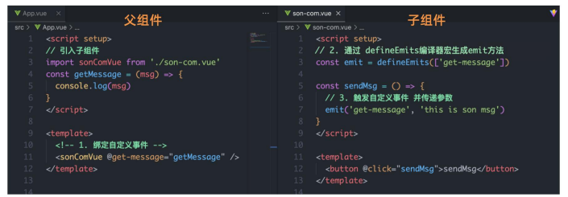

```html
<script setup>
// setup 无法直接配置props
// 需要借助编译器宏 defineProps
const props = defineProps({
  msg: String,
  money: Number
})
console.log(props.msg)
// 通过defineEmits 创建一个事件发射器
const emit = defineEmits(['change-money'])
// 触发事件
const subMoney = () => {
  // 不能直接修改父组件数据，需要借助 emit 向父组件申请
  // props.money -= 1 Set operation on key "money" failed: target is readonly.
  emit('change-money', 50)
}
</script>

<template>
  <div class="son-demo">
    <h1>子组件</h1>
    <p>来自父组件的数据：{{ msg }}</p>
    <p>子组件money {{ money }}</p>
    <button @click='subMoney'>花钱-50</button>
  </div>
</template>
```

```html
<script setup>
    import { ref } from 'vue'
    const money = ref(999)

    const addMoney = () => {
      money.value += 100
    }
    const handleChangeMoney = (moneyNum) => {
      // money 在父组件中修改
      money.value -= moneyNum
    }
    // 导入子组件
    import SonDemo from '@/components/SonDemo.vue'
    // 父传子通信
    // 父组件给子组件添加属性传值
</script>

<template>
  <div>
     <!-- // 父组件给子组件添加属性传值 -->
    <son-demo 
      msg = '父组件消息' 
      :money="money"
      @change-money = "handleChangeMoney"
      >
    </son-demo>
    <button @click="addMoney">父组件赚钱100</button>
  </div>  
</template>
```

# 模版引用 标签 ref 属性
通过 **ref 标识**获取真实的 **dom 对象或者组件实例对象**


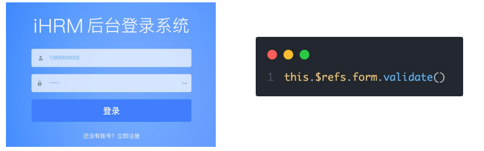

**ref() 创建响应式容器**

+ 调用 `const inputRef = ref(null)` 时
+ Vue 会创建一个 **响应式对象**（内部通过 `RefImpl` 类实现），包含唯一属性 `value`；
+ 初始值为 `null`，因为此时 DOM 还未渲染

**模板 `ref` 标识建立关联**

+ 模板中写 `<input ref="inputRef" type="text">` 时：
+ `ref="inputRef"` 是一个**标识**，Vue 把这个 DOM 元素和脚本里的 `inputRef` 变量关联
+ Vue 的**编译器**会识别该标识，并在渲染阶段处理绑定逻辑

**渲染阶段赋值真实 DOM**

+ 当组件渲染（挂载）时：
+ Vue 的**渲染器**会找到对应 DOM 节点
+ 在 **DOM 挂载完成后**（如 `onMounted` 阶段），将真实 DOM 元素赋值给 `inputRef`
+ 后续若 DOM 被销毁（如组件卸载），`inputRef` 会重置为 `null`

```vue
<script setup>
  // 生成一个ref 对象，对象中包含一个属性，属性值为null
  const inputRef = ref(null)
  // 获取焦点 方法
  // 在onMounted生命周期中调用,dom加载完成聚焦
  onMounted(() => {
      inputRef.value.focus()
  })
  // 点击按钮也聚焦
  const getFocus = () => {
    inputRef.value.focus()
  }
</script>

<template>
  <!-- 2. 绑定 ref 标识 -->
  <div>
    <p>模版引用</p>
    <input ref="inputRef" type="text">
    <button @click="getFocus">点击获取焦点</button>
    </div>
</template>
```

## defineExpose()
“Expose” 常见含义为 “暴露；揭露；使显露；使面临（危险等）

在 `<script setup>` 语法中，**组件的所有属性和方法默认是私有的**（外部无法访问）

这是 Vue3 的设计选择，目的是强化**封装性**（类似 React 的 `useState` 默认私有）

但在某些场景下，父组件确实需要访问子组件的内部状态或方法（如调用子组件的重置表单功能），此时就需要 `defineExpose()` 来显式暴露这些内容

```vue
<!-- 子组件：Child.vue -->
<script setup>
  import { ref } from 'vue'
  const count = ref(0)
  const increment = () => count.value++
  
  // 暴露 count 和 increment，让父组件可以访问
  defineExpose({
    count,
    increment
  })
</script>
```

在父组件中通过 **模板引用（ref）** 访问子组件暴露的内容：

```vue
<!-- 父组件：Parent.vue -->
<template>
  <Child ref="childRef" />
  <button @click="getChildCount">获取子组件 count</button>
</template>

<script setup>
import { ref, onMounted } from 'vue'
import Child from './Child.vue'

const childRef = ref(null)

const getChildCount = () => {
  console.log(childRef.value?.count.value) // 访问子组件暴露的 count
  childRef.value?.increment() // 调用子组件暴露的 increment 方法
}
</script>
```

`defineExpose()` 是 `<script setup>` 语法的专属 API

普通 `<script>` 中无需使用（直接通过 `export default` 暴露）

**父组件调用子组件方法**  

如子组件提供表单校验、重置等功能，父组件直接触发：

```vue
<!-- 子组件 -->
const resetForm = () => { /* 重置表单逻辑 */ }
defineExpose({ resetForm })

<!-- 父组件 -->
<button @click="childRef.value?.resetForm()">重置子表单</button>
```

**获取子组件内部状态**  

如获取子组件的计算属性或响应式数据：

```vue
<!-- 子组件 -->
const isLoading = ref(false)
defineExpose({ isLoading })

<!-- 父组件 -->
console.log(childRef.value?.isLoading.value) // 读取子组件加载状态
```

## ?. **可选链操作符**
`?.` 是 **可选链操作符**（Optional Chaining Operator），属于 ES2020 引入的 JavaScript 语法

核心作用是 **安全访问嵌套对象 / 属性，避免中间步骤为 `null/undefined` 时报错**

直接写 `childRef.value.resetForm()`：

+ 如果 `childRef.value` 是 `null`（比如子组件还没挂载，或根本没渲染）
+ JavaScript 会报错 （无法读取 `null` 的属性）

用 `childRef.value?.resetForm()` 后：

+ 若 `childRef.value` 是 `null` 或 `undefined`
+ 会**直接返回 undefined**，不会继续访问 `isLoading`，从而避免报错

对象属性访问

```javascript
obj?.prop 
// 等价于：obj 存在（非null/undefined）时，取 obj.prop；否则返回 undefined
```

数组索引访问

```javascript
arr?.[0] 
// 等价于：arr 存在时，取 arr[0]；否则返回 undefined
```

函数调用

```javascript
func?.() 
// 等价于：func 是函数时，调用 func()；否则返回 undefined（避免“func is
```

`?.` 是一种**防御性编程手段**，在 Vue 中常用于处理 **模板引用（可能为 null）、嵌套响应式数据** 等场景，避免因中间值为 `null/undefined` 导致的报错，让代码更健壮

# provide & inject  跨层组件通信  
顶层组件向任意的底层组件传递数据和方法，实现跨层组件通信  


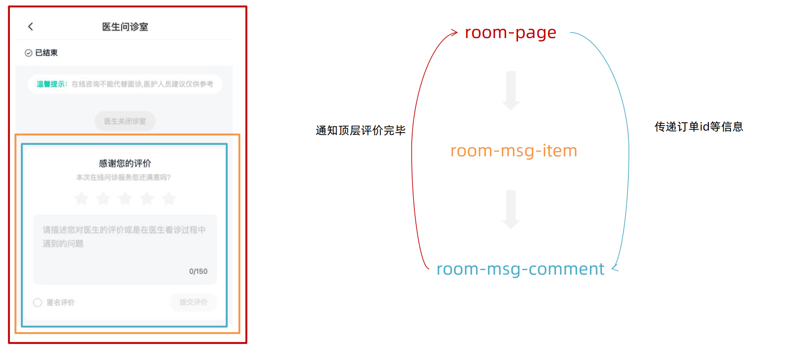

+ **provide**：允许一个组件向其所有子孙后代组件注入一个依赖，不论组件层次有多深
+ **inject**：在其组件中接收提供（provide）的变量

## 跨层传递普通数据  
顶层组件通过 provide 函数提供数据

底层组件通过 inject 函数获取数据  

```html
// 父组件
<script setup>
// 导入子组件
import ChildComponent from "@/components/ChildComponent.vue";
import { provide } from "vue";
// 跨层级传递数据
provide("msg", "hello world");
</script>

<template>
  <div class="app">
    <h2>我是父组件</h2>
    <ChildComponent></ChildComponent>
  </div>
</template>

// 子组件
<script setup>
// 导入孙组件
import GrandChildComponent from "@/components/GrandChildComponent.vue";
</script>
<template>
  <div class="child">
    <h3>我是子组件</h3>
    <p>子组件的数据：</p>
    <GrandChildComponent></GrandChildComponent>
  </div>
</template>

// 孙组件
<script setup>
import { inject } from 'vue';

// 接受父组件数据
const messag = inject('msg');
</script>
<template>
  <div class="grand-child">
    <h4>我是孙组件</h4>
    <p>孙组件的数据：{{ messag }}</p>
  </div>
</template>
```

## 跨层传递响应式数据
在调用provide函数时，第二个参数设置为ref对象  

```html
// 父组件
<script setup>
// 导入子组件
import ChildComponent from "@/components/ChildComponent.vue";
import { provide,ref } from "vue";
// 传递响应式数据
const count = ref(100);
provide("count", count);
</script>

<template>
  <div class="app">
    <h2>我是父组件</h2>
    <ChildComponent></ChildComponent>
  </div>
</template>

// 子组件
<script setup>
// 导入孙组件
import GrandChildComponent from "@/components/GrandChildComponent.vue";
</script>
<template>
  <div class="child">
    <h3>我是子组件</h3>
    <p>子组件的数据：</p>
    <GrandChildComponent></GrandChildComponent>
  </div>
</template>

// 孙组件

<script setup>
import { inject } from 'vue';
// 接受响应式数据
const count = inject('count');
</script>
<template>
  <div class="grand-child">
    <h4>我是孙组件</h4>
    <p>孙组件接受的响应式数据：{{ count }}</p>
  </div>
</template>
```

## 跨层传递方法
顶层组件可以向底层组件传递方法，**底层组件调用方法修改顶层组件中的数据**

```javascript
// 跨层级传递方法
provide('changeCount', (newCount)=>{
  count.value = newCount;
})
```

 

```html
<script setup>
import { inject } from 'vue';

// 接受父组件数据
const messag = inject('msg');
// 接受响应式数据
const count = inject('count');
// 接受方法
const changeCount = inject('changeCount');
</script>
<template>
  <div class="grand-child">
    <h4>我是孙组件</h4>
    <p>孙组件接受的普通数据：{{ messag }}</p>
    <p>孙组件接受的响应式数据：{{ count }}</p>
    <button @click="changeCount(1000)">孙组件修改父组件count</button>
  </div>
</template>
```

# defineOptions 宏  
“Options” 常见意思为 “选择；选择权；选择的自由；可选择的事物” 。在不同语境下含义会有所不同，比如在计算机程序中，可能指设置选项；

Vue 3.3 `defineOptions`宏是一个编译时特性，主要用于在单文件组件（SFC）的`<script setup>`语法中**声明组件选项**。能在享受`<script setup>`带来的便捷性的同时，还能定义像组件名称、继承选项、自定义渲染选项这类在普通选项式 API 里才能定义的选项

## 基本用法
使用 script setup 后无法提供与 setup 平级的一些属性，像 name（用于标识组件名称等用途）、props（通常用于接收父组件传递过来的数据）等。在这种情况下需要写两个 script 标签来满足相关需求

```html
<script>
  export default {
    name:'LoginIndex'
  }
</script>
<script setup>
  // 组件逻辑
</script>
```

```html
<script setup>
  // 导入 defineOptions 宏
  import { defineOptions } from 'vue'

  // 定义组件选项
  defineOptions({
    name: 'MyComponent',
    inheritAttrs: false,
    props: {
      msg: String
    },
    emits: ['change']
  })

  // 组件逻辑
  const props = defineProps({
    msg: String
  })

  const emit = defineEmits(['change'])
</script>
```

## 常用场景
**定义组件名称**

借助`defineOptions`可以明确指定组件的名称，调试和递归组件

```javascript
defineOptions({
  name: 'MyComponent'
})
```

**声明 props 和 emits**

在`defineOptions`里声明 props 和 emits，建议搭配`defineProps`和`defineEmits`宏一起使用

这样能获得类型检查和自动补全的功能

```javascript
defineOptions({
  props: {
    msg: String
  },
  emits: ['change']
})

const props = defineProps(['msg'])
const emit = defineEmits(['change'])
```

**配置组件行为**

可以配置诸如`inheritAttrs`、`components`、`directives`等选项

```javascript
defineOptions({
  inheritAttrs: false,
  components: {
    ChildComponent
  },
  directives: {
    focus: {
      mounted(el) {
        el.focus()
      }
    }
  }
})
```

**声明混合和插件选项**

能够声明像`mixins`、`extends`、`provide`、`inject`等选项。

```javascript
defineOptions({
  mixins: [someMixin],
  provide: {
    theme: 'dark'
  }
})
```

## 与普通选项式 API 的区别
+ **编译时特性**：`defineOptions`宏仅在编译阶段起作用，不会影响运行时的性能
+ **语法简洁**：能够把选项式 API 和`<script setup>`的语法结合起来使用
+ **类型集成**：如果项目使用了 TypeScript，`defineOptions`可以和类型系统很好地集成

注意事项

+ `defineOptions`必须在`<script setup>`中使用，并且只能调用一次
+ 组件选项的优先级是：`defineOptions`里的选项会覆盖通过其他方式定义的同名选项
+ 这个宏是 Vue 3.3.0 版本新增的特性

# defineModel 宏
在 Vue 3.4 及以后的版本中，`defineModel`宏是一个新增的编译时特性

主要用于在使用`<script setup>`语法的组件里，更方便地**实现双向数据绑定**

这一特性实际上是对`v-model`在组件间使用方式的简化，能够更简洁地处理双向数据流

## 基本用法
```html
<script setup>
  // 导入 defineModel 宏
  import { defineModel } from 'vue'

  // 定义一个名为 "modelValue" 的默认模型，支持 String 类型
  const modelValue = defineModel<String>()

  // 或者定义一个自定义名称的模型
  const checked = defineModel<boolean>('checked')
</script>

<template>
  <input
    :value="modelValue"
    @input="modelValue = $event.target.value"
    />
  <input
    type="checkbox"
    :checked="checked"
    @change="checked = $event.target.checked"
    />
</template>
```

## 宏参数详解
`defineModel`宏主要有以下参数：

**propName**（可选）：这是自定义的 prop 名称，默认值为`modelValue`

**options**（可选）：它类似于`defineProps`的选项，包含以下内容：

+ `type`：用于类型推断
+ `required`：表明该属性是否为必需项
+ `default`：设置属性的默认值

## 示例
简单的双向绑定

```html
<script setup>
const modelValue = defineModel()
</script>

<template>
  <input
    :value="modelValue"
    @input="modelValue = $event.target.value"
  />
</template>
```

自定义 v-model 名称

```html
<script setup>
// 对应父组件中的 v-model:title
const title = defineModel<string>('title')
</script>

<template>
  <input
    :value="title"
    @input="title = $event.target.value"
  />
</template>
```

多个 v-model 绑定

```html
<script setup>
const name = defineModel<string>('name')
const age = defineModel<number>('age')
</script>

<template>
  <div>
    <input
      :value="name"
      @input="name = $event.target.value"
    />
    <input
      type="number"
      :value="age"
      @input="age = $event.target.valueAsNumber"
    />
  </div>
</template>
```

使用选项

```html
<script setup>
const modelValue = defineModel({
  type: String,
  required: true,
  default: ''
})
</script>
```

### 与传统方式的对比
在没有`defineModel`之前，我们需要这样实现双向绑定：

```html
<script setup>
const props = defineProps(['modelValue'])
const emit = defineEmits(['update:modelValue'])
</script>

<template>
  <input
    :value="props.modelValue"
    @input="emit('update:modelValue', $event.target.value)"
  />
</template>
```

  

使用`defineModel`后，代码变得更加简洁：

```html
<script setup>
const modelValue = defineModel()
</script>

<template>
  <input
    :value="modelValue"
    @input="modelValue = $event.target.value"
  />
</template>
```

### 注意事项
+ **编译时特性**：`defineModel`宏只在编译阶段起作用，不会对运行时的性能产生影响
+ **类型支持**：在 TypeScript 环境中使用时，它能提供完整的类型推导
+ **兼容性**：此特性需要 Vue 3.4.0 或更高版本才能使用  

`defineModel`宏大大简化了组件间双向数据绑定的实现，让代码更加简洁易读

如果你使用的是 Vue 3.4 及后续版本，推荐在开发中使用这一特性来处理双向数据流

# 路由 Router4  

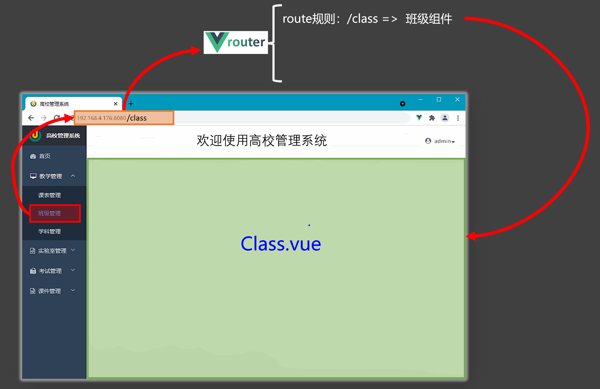

Vue Router 4 是 Vue.js 3 的官方路由管理器，专为 Vue 3 设计，提供了现代化的路由解决方案

## 路由配置与创建
Vue Router 4 的路由配置基于 `createRouter` 函数，使用 `history` 模式管理路由历史：

```javascript
import { createRouter, createWebHistory } from 'vue-router'

const routes = [
  {
    path: '/',
    name: 'Home',
    component: () => import('../views/Home.vue') // 路由懒加载
  },
  {
    path: '/about',
    name: 'About',
    component: () => import('../views/About.vue')
  },
  {
    path: '/user/:id', // 动态路由参数
    name: 'User',
    component: () => import('../views/User.vue')
  },
  {
    path: '/:pathMatch(.*)*', // 404 路由
    name: 'NotFound',
    component: () => import('../views/NotFound.vue')
  }
]

const router = createRouter({
  history: createWebHistory(), // 也可以使用 createWebHashHistory()
  routes
})

export default router
```

```javascript
path: '/user/:id'
```

+ `:id` 就是**动态参数**（可变部分）
+ 匹配路径：`/user/1`、`/user/100`、`/user/abc` 都能命中这个路由
+ `id` 是参数名，你可以自定义（比如叫`:userId`）

**最常用**的场景：进入用户页面后，拿到 `id` 去发请求、渲染页面

```html
<!-- User.vue -->
<template>
  <div>用户ID：{{ userId }}</div>
</template>

<script setup>
  // 1. 引入 useRoute
  import { useRoute } from 'vue-router'

  // 2. 创建 route 实例
  const route = useRoute()

  // 3. 获取动态参数 id
  const userId = route.params.id
</script>
```

+ `route.params` → 存放所有动态参数
+ `route.params.id` → 对应路由里的 `:id`（名字必须一致）

方式 1：声明式跳转（<router-link>）

```html
<!-- 跳转到 /user/1 -->
  <router-link to="/user/1">用户1</router-link>

  <!-- 动态传值（更常用） -->
  <router-link :to="`/user/${id}`">用户{{ id }}</router-link>

  // 或对象写法（更规范）
  <router-link :to="{ name: 'User', params: { id: 1 } }">用户1</router-link>
```

注意：**用 name 匹配路由时，params 传参自动对应动态路径**

方式 2：编程式跳转（点击事件 / 逻辑中跳转）

```html
<script setup>
  import { useRouter } from 'vue-router'
const router = useRouter()

// 点击跳转到用户页，传id=1
const goToUser = () => {
  // 写法1：字符串
  router.push('/user/1')

  // 写法2：对象（推荐）
  router.push({
    name: 'User', // 对应路由里的 name
    params: { id: 1 } // 动态参数
  })
}
  </script>
```

## 路由器工作模式
`history`模式

优点：`URL`更加美观，不带有`#`，更接近传统的网站`URL`

缺点：后期项目上线，需要服务端配合处理路径问题，否则刷新会有`404`错误

```javascript
const router = createRouter({
  history:createWebHistory(), //history模式
  /******/
})
```

`hash`模式

优点：兼容性更好，因为不需要服务器端处理路径

缺点：`URL`带有`#`不太美观，且在`SEO`优化方面相对较差

```javascript
const router = createRouter({
  history:createWebHashHistory(), //hash模式
  /******/
})
```

## 命名路由
作用：可以简化路由跳转及传参（后面就讲）

给路由规则命名：

```javascript
routes:[
  {
    name:'zhuye',
    path:'/home',
    component:Home
  },
  {
    name:'xinwen',
    path:'/news',
    component:News,
  },
  {
    name:'guanyu',
    path:'/about',
    component:About
  }
]
```

跳转路由：

```html
<!--简化前：需要写完整的路径（to的字符串写法） -->
<router-link to="/news/detail">跳转</router-link>

<!--简化后：直接通过名字跳转（to的对象写法配合name属性） -->
<router-link :to="{name:'guanyu'}">跳转</router-link>
```

## 嵌套路由
编写`News`的子路由：`Detail.vue`

配置路由规则，使用`children`配置项：

```javascript
const router = createRouter({
  history:createWebHistory(),
  routes:[
    {
      name:'zhuye',
      path:'/home',
      component:Home
    },
    {
      name:'xinwen',
      path:'/news',
      component:News,
      children:[
        {
          name:'xiang',
          path:'detail',
          component:Detail
        }
      ]
    },
    {
      name:'guanyu',
      path:'/about',
      component:About
    }
  ]
})
export default router
```

跳转路由（记得要加完整路径）：

```html
<router-link to="/news/detail">xxxx</router-link>
<!-- 或 -->
<router-link :to="{path:'/news/detail'}">xxxx</router-link>
```

记得`Home`组件中预留一个`<router-view>`

```html
<template>
  <div class="news">
    <nav class="news-list">
      <RouterLink v-for="news in newsList" :key="news.id" :to="{path:'/news/detail'}">
        {{news.name}}
      </RouterLink>
    </nav>
    <div class="news-detail">
      <RouterView/>
    </div>
  </div>
</template>
```

## 路由传参
### query参数
```html
<template>
   <div>
    <!-- 跳转并携带query参数（to的字符串写法） -->
    <router-link to="/news/detail?a=1&b=2&content=欢迎你">
       跳转
    </router-link>
    <!-- 跳转并携带query参数（to的对象写法） -->
    <RouterLink 
      :to="{
        //name:'xiang', //用name也可以跳转
        path:'/news/detail',
        query:{
          id:news.id,
          title:news.title,
          content:news.content
        }
      }"
    >
    {{news.title}}
  </RouterLink>
  </div>
</template>
```

接收参数：

```javascript
import {useRoute} from 'vue-router'
const route = useRoute()
// 打印query参数
console.log(route.query)
```

### params参数
1. 传递参数

```html
<!-- 跳转并携带params参数（to的字符串写法） -->
<RouterLink :to="`/news/detail/001/新闻001/内容001`">{{news.title}}</RouterLink>

<!-- 跳转并携带params参数（to的对象写法） -->
<RouterLink 
  :to="{
    name:'xiang', //用name跳转
    params:{
      id:news.id,
      title:news.title,
      content:news.title
    }
  }"
  >
  {{news.title}}
</RouterLink>
```

2. 接收参数：

```typescript
import {useRoute} from 'vue-router'
const route = useRoute()
// 打印params参数
console.log(route.params)
```

备注1：传递`params`参数时，若使用`to`的对象写法，必须使用`name`配置项，不能用`path`

备注2：传递`params`参数时，需要提前在规则中占位

## 路由的props配置
作用：让路由组件更方便的收到参数（可以将路由参数作为`props`传给组件）

```javascript
{
  name:'xiang',
    path:'detail/:id/:title/:content',
    component:Detail,

    // props的对象写法，作用：把对象中的每一组key-value作为props传给Detail组件
    // props:{a:1,b:2,c:3}, 

    // props的布尔值写法，作用：把收到了每一组params参数，作为props传给Detail组件
    // props:true

    // props的函数写法，作用：把返回的对象中每一组key-value作为props传给Detail组件
    props(route){
    return route.query
  }
}
```

## 路由导航
在组件中使用 `useRouter` 和 `useRoute` 组合式 API：

**useRouter()** ：返回当前**路由实例**，等同于Vue 2 中的 `this.$router`，用于导航操作（如跳转、后退）

**useRoute()** ：返回当前**路由对象**，等同 Vue 2 中的 `this.$route`，用于获取当前路由的参数、查询、哈希等信息

### 常见导航方法
+ **router.push()：** 导航到新路由，增加历史记录（等同于浏览器的前进）
+ **router.replace()：** 替换当前路由，不增加历史记录（等同于浏览器的替换当前页面）
+ **router.go(n)：** 在历史记录中前进或后退（如 `router.go(-1)` 等同于后退）

```html
<template>
  <div>
    <router-link to="/">Home</router-link>
    <router-link to="/about">About</router-link>
    <button @click="goToUser">Go to User</button>
  </div>
</template>

<script setup>
import { useRouter, useRoute } from 'vue-router'

const router = useRouter()
const route = useRoute()

const goToUser = () => {
  // 命名路由 + 参数
  router.push({ name: 'User', params: { id: 123 } })
  
  // 也可以使用路径
  // router.push('/user/123')
}

// 获取当前路由参数
console.log(route.params.id) // 动态路由参数
console.log(route.query)     // 查询参数 (?key=value)
console.log(route.hash)      // 哈希值 (#hash)
</script>
```

### 声明式导航：`<router-link>`
`<router-link>` 是 Vue Router 提供的组件，用于创建声明式导航链接

它会被渲染为 `<a>` 标签，但不会触发页面刷新，而是通过 JavaScript 实现路由切换

```html
<router-link to="/">Home</router-link>       // 路径导航
<router-link to="/about">About</router-link> // 路径导航
<router-link :to="{ name: 'User', params: { id: 123 }}">User 123</router-link> // 命名路由导航
```

+ `to` 属性支持字符串路径（如 `/about`）或对象形式（需指定 `name` 或 `path`）
+ 使用命名路由（如 `name: 'User'`）可以避免硬编码路径，提高可维护性

### 编程式导航：`router.push()`
`router.push()` 用于在 JavaScript 中实现编程式导航，效果等同于点击 `<router-link>`

```javascript
const goToUser = () => {
  // 方式一：命名路由 + 参数
  router.push({ 
    name: 'User',          // 路由名称（在路由配置中定义）
    params: { id: 123 }    // 动态路由参数（对应路径中的 :id）
  })
  
  // 方式二：路径 + 参数
  router.push(`/user/${123}`)  // 直接拼接路径
  
  // 方式三：带查询参数（生成路径：/user/123?foo=bar）
  router.push({
    name: 'User',
    params: { id: 123 },
    query: { foo: 'bar' }      // 查询参数（URL 中的 ?key=value）
  })
  
  // 方式四：带哈希值（生成路径：/user/123#section）
  router.push({
    name: 'User',
    params: { id: 123 },
    hash: '#section'           // 哈希值（URL 中的 #fragment）
  })
}
```

### 获取当前路由信息：`route` 对象
`useRoute()` 返回的 `route` 对象包含当前路由的详细信息：

```javascript
// 获取动态路由参数（如 /user/123 中的 123）
console.log(route.params.id)    // 输出: 123

// 获取查询参数（如 /user/123?foo=bar 中的 { foo: 'bar' }）
console.log(route.query)        // 输出: { foo: 'bar' }

// 获取哈希值（如 /user/123#section 中的 #section）
console.log(route.hash)         // 输出: #section

// 获取完整路径（如 /user/123?foo=bar#section）
console.log(route.fullPath)     // 输出: /user/123?foo=bar#section

// 获取路由名称
console.log(route.name)         // 输出: User
```

## 路由守卫
Vue Router 4 提供了多种导航守卫，用于控制路由访问权限和生命周期：

它们允许在路由切换前后**执行自定义逻辑，比如身份验证、数据预加载或阻止非法访问**

### 全局前置守卫(`router.beforeEach`)
**作用**：在每次路由导航**开始前**触发，常用于**全局权限验证**

```javascript
// router.js
router.beforeEach((to, from, next) => {
  // to: 即将进入的路由
  // from: 当前离开的路由
  // next: 必须调用以解析钩子
  // 检查目标路由是否需要身份验证（通过meta字段）
  if (to.meta.requiresAuth && !isAuthenticated()) {
    next({ name: 'Login' }) // 重定向到登录页
  } else {
    next() // 继续导航
  }
})
```

**执行流程1 导航触发**：用户点击链接或调用 `router.push()`

**2 守卫执行**：所有 `beforeEach` 按注册顺序依次执行

**3 权限验证**：检查目标路由是否需要权限（通过 `to.meta`）

**4 控制流向**：

+ `next()`：继续导航
+ `next(false)`：取消导航，回到 `from` 路由
+ `next('/login')` 或 `next({ name: 'Login' })`：重定向到其他路由
+ `next(error)`：终止导航并触发错误处理

**常见场景**

+ 用户身份验证（如 JWT 令牌检查）
+ 页面访问权限控制（如管理员页面）
+ 全局加载状态显示（导航开始时显示 loading）

### 路由独享守卫(`beforeEnter`)
**作用**：仅对单个路由配置生效，常用于特定路由的权限验证

+ 与 `beforeEach` 类似，但仅在进入该路由时触发
+ 适用于某些特殊路由的权限验证（如管理后台）
+ 注册在路由配置中，与 `path`、`component` 同级

```javascript
const routes = [
  {
    path: '/admin',
    component: AdminPage,
    beforeEnter: (to, from, next) => {
      // 检查用户是否有管理员权限
      if (!isAdmin()) {
        next({ name: 'Home' }) // 非管理员重定向到首页
      } else {
        next() // 允许访问
      }
    }
  }
]
```

### 组件内守卫
**作用**：在组件内部定义的守卫，用于控制**组件级别**的导航行为

**onBeforeRouteUpdate触发时机**：当前路由改变，但组件被复用时（如 `/user/1` → `/user/2`）

```vue
<script setup>
import { onBeforeRouteUpdate } from 'vue-router'

onBeforeRouteUpdate((to, from) => {
  // 处理路由参数变化，避免组件复用导致数据不更新
  fetchUser(to.params.id) // 根据新ID重新加载用户数据
})
</script>
```

**常见场景**：

+ 动态路由参数变化时更新组件数据
+ 监听查询参数变化（如 `/search?keyword=foo` → `/search?keyword=bar`）

**onBeforeRouteLeave触发时机**：导航离开当前组件时触发，常用于**阻止用户意外离开**

```vue
<script setup>
import { onBeforeRouteLeave } from 'vue-router'

onBeforeRouteLeave((to, from) => {
  // 检查是否有未保存的更改
  if (hasUnsavedChanges()) {
    return false // 阻止导航
  }
  // 或显示确认对话框
  return confirm('确定要离开吗？未保存的内容将丢失。')
})
</script>
```

**常见场景**：

+ 表单编辑页面防止用户未保存就离开
+ 游戏或进度页面确认用户是否真的要退出

```vue
<script setup>
import { onBeforeRouteUpdate, onBeforeRouteLeave } from 'vue-router'

// 路由参数变化时触发（如从 /user/1 到 /user/2）
onBeforeRouteUpdate((to, from) => {
  // 可以访问组件实例 this
  // 更新组件数据或执行其他操作
})

// 离开当前路由时触发
onBeforeRouteLeave((to, from) => {
  // 可以阻止导航
  if (hasUnsavedChanges()) {
    return false
  }
})
</script>
```

### **路由守卫执行顺序**
完整的导航解析流程：

1. **导航被触发**：用户点击链接或调用 `router.push()`
2. **全局前置守卫**：`router.beforeEach`
3. **路由独享守卫**：`beforeEnter`
4. **组件内守卫**：
    - `onBeforeRouteLeave`（当前组件）
    - `onBeforeRouteUpdate`（复用的目标组件，若有）
5. **路由配置中的 beforeResolve**（较少用）
6. **导航被确认**：所有守卫通过，开始渲染组件
7. **全局后置钩子**：`router.afterEach`（无 `next`，常用于分析、滚动或进度条处理）

### **最佳实践权限管理**：使用 `meta` 字段标记需要权限的路由：

```javascript
{
  path: '/dashboard',
  name: 'Dashboard',
  component: Dashboard,
  meta: { requiresAuth: true }
}
```

在 `beforeEach` 中统一验证权限

**异步操作**：守卫支持异步操作，但需确保 `next()` 在异步完成后调用：

```javascript
router.beforeEach(async (to, from, next) => {
  const user = await fetchUser()
  if (to.meta.requiresAuth && !user) {
    next('/login')
  } else {
    next()
  }
})
```

**避免死循环**：重定向时确保不会再次触发守卫（如登录页不需要权限）：

```javascript
if (to.name !== 'Login' && !isAuthenticated()) {
  next({ name: 'Login' })
} else {
  next()
}
```

## 路由懒加载
Vue Router 4 推荐使用**动态导入**（Dynamic Import）实现路由懒加载（Route Lazy Loading），它是一种优化技术，指的是在用户访问某个路由时才加载对应的组件代码，而不是在应用初始化时就加载所有组件，这种方式也被称为 “按需加载”（Load on Demand）

传统的前端应用会在首次加载时将所有组件代码打包到一个或多个文件中，导致初始加载时间较长

而路由懒加载将组件分割成多个小文件，只有当用户访问到对应路由时才会加载这些文件

```javascript
// 单个组件懒加载
component: () => import('../views/Home.vue')

// 分组懒加载（同一组的组件会打包到同一个文件）
component: () => import(/* webpackChunkName: "admin" */ '../views/Admin.vue')
```

## 路由元信息 (meta)
路由元信息（`meta`）是 Vue Router 中用于为路由添加**自定义数据的字段**。它允许你在路由配置中附加额外信息，这些信息可以在导航守卫、组件或其他地方访问，常用于权限控制、布局切换、页面标题设置等场景，为路由添加额外信息，常用于权限控制或布局切换：

**基本用法：** 在路由配置中添加 `meta` 字段：

```javascript
const routes = [
  {
    path: '/dashboard',
    name: 'Dashboard',
    component: Dashboard,
    meta: {
      requiresAuth: true,  // 需要身份验证
      layout: 'admin',     // 使用管理员布局
      title: '控制面板'     // 页面标题
    }
  },
  {
    path: '/public',
    name: 'Public',
    component: PublicPage,
    meta: {
      requiresAuth: false  // 公开页面，无需验证
    }
  }
]
```

**权限控制：** 结合全局前置守卫实现权限验证：

```javascript
router.beforeEach((to, from, next) => {
  // 检查路由是否需要身份验证
  if (to.meta.requiresAuth && !isAuthenticated()) {
    next({ name: 'Login' })  // 未登录则重定向到登录页
  } else {
    next()  // 允许访问
  }
})
```

**布局切换示例：** 根据 `meta` 动态加载不同布局组件：

```html
<!-- App.vue -->
<template>
  <div id="app">
    <!-- 根据 meta.layout 动态选择布局 -->
    <component :is="layout">
      <router-view />
    </component>
  </div>
</template>

<script setup>
import { computed } from 'vue'
import { useRoute } from 'vue-router'
import DefaultLayout from './layouts/DefaultLayout.vue'
import AdminLayout from './layouts/AdminLayout.vue'

const route = useRoute()
const layout = computed(() => {
  return route.meta.layout === 'admin' ? AdminLayout : DefaultLayout
})
</script>
```

**访问路由元信息：** 在组件中使用 `useRoute()` 获取当前路由的 `meta`：

```html
<script setup>
import { useRoute } from 'vue-router'

const route = useRoute()
console.log(route.meta.requiresAuth)  // 输出: true/false
console.log(route.meta.layout)        // 输出: 'admin' 或 undefined
</script>
```

## 命名视图
命名视图允许你在一个路由中同时渲染多个组件到不同的出口位置，而不是单一的 `<router-view>`

这在需要多个独立滚动区域或复杂布局时非常有用

支持在**一个路由中渲染多个组件**：

```javascript
const routes = [
  {
    path: '/',
    components: {
      default: Home,
      sidebar: Sidebar
    }
  }
]

<router-view />         <!-- 默认视图 -->
<router-view name="sidebar" /> <!-- 命名视图 -->
```

**基本用法在路由配置中定义多个组件：**

```javascript
const routes = [
  {
    path: '/',
    name: 'Home',
    components: {  // 注意这里是 components 复数形式
      default: Home,      // 默认视图
      sidebar: Sidebar,   // 侧边栏视图
      footer: Footer      // 页脚视图
    }
  }
]
```

**在模板中使用命名视图：**

```html
<template>
  <div>
    <!-- 默认视图 -->
    <router-view />
    
    <!-- 命名视图 -->
    <router-view name="sidebar" />
    <router-view name="footer" />
  </div>
</template>
```

**嵌套命名视图**

命名视图也可以嵌套使用，适用于复杂布局：

```javascript
const routes = [
  {
    path: '/admin',
    components: {
      default: AdminLayout,
      sidebar: AdminSidebar
    },
    children: [
      {
        path: 'dashboard',
        components: {
          default: Dashboard,
          toolbar: AdminToolbar  // 嵌套在 AdminLayout 中的工具栏
        }
      }
    ]
  }
]
```

动态组件与命名视图

可以结合动态组件使用命名视图：

```html
<router-view :is="viewComponent" />
<router-view name="sidebar" :is="sidebarComponent" />
```

## 路由过渡动画
Vue Router 可以与 Vue 的过渡系统结合，为路由切换添加动画效果，提升用户体验

### 基本过渡效果
使用 `<transition>` 包裹 `<router-view>`：

```html
<template>
  <transition name="fade">
    <router-view />
  </transition>
</template>

<style>
/* 淡入淡出效果 */
.fade-enter-active, .fade-leave-active {
  transition: opacity 0.5s;
}
.fade-enter-from, .fade-leave-to {
  opacity: 0;
}
</style>
```

### 过渡模式
使用 `mode` 属性控制过渡顺序：

```html
<transition name="slide" mode="out-in">
  <router-view />
</transition>

<style>
/* 滑动效果 */
.slide-enter-active {
  transition: transform 0.5s;
}
.slide-leave-active {
  transition: transform 0.3s;
}
.slide-enter-from {
  transform: translateX(100%);
}
.slide-leave-to {
  transform: translateX(-100%);
}
</style>
```

+ `in-out`：新组件先进入，旧组件再离开
+ `out-in`：旧组件先离开，新组件再进入（常用）

### 根据路由变化设置不同动画
根据路由元信息应用不同的过渡效果：

```html
<template>
  <transition :name="transitionName">
    <router-view />
  </transition>
</template>

<script setup>
import { computed } from 'vue'
import { useRoute } from 'vue-router'

const route = useRoute()
const transitionName = computed(() => {
  // 根据路由名称设置不同的动画
  if (route.meta.transition === 'slide') {
    return 'slide'
  } else if (route.meta.transition === 'fade') {
    return 'fade'
  }
  return 'default'
})
</script>
```

### 复杂动画与第三方库
结合第三方动画库（如 Animate.css）实现更复杂的效果：

```html
<template>
  <transition
    enter-active-class="animate__animated animate__fadeIn"
    leave-active-class="animate__animated animate__fadeOut"
  >
    <router-view />
  </transition>
</template>
```

结合 Vue 的过渡系统实现路由切换动画：

```html
<template>
  <transition name="fade">
    <router-view />
  </transition>
</template>

<style>
.fade-enter-active, .fade-leave-active {
  transition: opacity 0.5s;
}
.fade-enter-from, .fade-leave-to {
  opacity: 0;
}
</style>
```

## 路由参数校验
可以为动态路由参数添加校验函数：

```javascript
const routes = [
  {
    path: '/user/:id',
    component: User,
    beforeEnter: (to) => {
      // 校验 id 是否为数字
      if (!/^\d+$/.test(to.params.id)) {
        return { name: 'NotFound' }
      }
    }
  }
]
```

# Pinia  状态管理     
在开发复杂的 Vue 应用时，组件之间的数据传递会变得繁琐：

+ 父子组件可以通过 props 和 emit 传递数据
+ 兄弟组件需要通过父组件中转
+ 跨层级组件传递数据更加麻烦

状态管理工具（如 Pinia）可以解决这些问题，它提供了一个集中存储应用状态的地方，让所有组件都能方便地访问和更新状态

Pinia 是 Vue3 官方推荐的状态管理库，它是 Vuex 的进化版，具有以下优势：

+ 更简洁的 API，学习曲线更平缓
+ 完美支持 Vue3 的 Composition API
+ 内置 TypeScript 支持
+ 体积更小（约 1KB）
+ 支持插件扩展

## 快速开始
**安装 Pinia**

Vue3 项目中安装 Pinia：

```bash
# 使用npm
npm install pinia

# 或者使用yarn
yarn add pinia
```

**在 Vue 应用中配置 Pinia**

main.js 中引入并安装 Pinia：创建一个 pinia 实例 (根 store) 并将其传递给应用：

```javascript
import { createApp } from 'vue'
import { createPinia } from 'pinia'
import App from './App.vue'

const app = createApp(App)
const pinia = createPinia()

app.use(pinia)
app.mount('#app')
```

**创建第一个 Store**

Store 是 Pinia 中保存状态和业务逻辑的实体，每个 Store 可以看作一个状态模块，承载着全局状态

它有点像一个永远存在的组件，每个组件都可以读取和写入它

> 有三个概念，**`state`、`getter`、`action`**，相当于组件中的 **`data`、`computed` 、`methods`**

创建一个简单的计数器 Store：

**defineStore() 的第一个参数要求是一个独一无二的名字：**

这个名字 ，也被用作 id ，是必须传入的， Pinia 将用它来连接 store 和 devtools

为了养成习惯性的用法，将返回的函数命名为 use... 是一个符合组合式函数风格的约定

**defineStore() 的第二个参数可接受两类值：Setup 函数或 Option 对象**

与 Vue 的选项式 API 类似，也可传入带有 `state`、`actions` 与 `getters` 属性的 Option 对象

```javascript
// stores/counter.js
import { defineStore } from 'pinia'

// 第一个参数是Store的id，必须唯一
export const useCounterStore = defineStore('counter', {
  // 存储状态，类似Vue的data
  state: () => ({
    count: 0,
    message: 'Hello Pinia'
  }),

  // 计算属性，类似Vue的computed
  getters: {
    doubleCount: (state) => state.count * 2,
    // 也可以接收其他getters作为参数
    doubleCountPlusOne(state, getters) {
      return getters.doubleCount + 1
    }
  },

  // 定义方法，类似Vue的methods，可以修改state或进行异步操作
  actions: {
    increment() {
      this.count++
    },
    decrement() {
      this.count--
    },
    // 支持异步操作
    async incrementAsync() {
      setTimeout(() => {
        this.increment()
      }, 1000)
    }
  }
})
```

”increment” 常见词性为动词，意为 “增加；增长；提高” ，强调在数量、程度等方面逐步的、相对较小幅度的提升 。它也可作名词，指 “增加；增量；增加额” 

**在组件中使用 Store**

```vue
<script setup>
import { useCounterStore } from '../stores/counter'

// 获取Store实例
const counterStore = useCounterStore()

// 解构获取state和getters（注意：解构会失去响应式，建议直接使用实例）
const { count, message } = counterStore
const { doubleCount } = counterStore

// 或者使用箭头函数保持响应式
const count = () => counterStore.count
const doubleCount = () => counterStore.doubleCount

// 调用actions
const increment = () => counterStore.increment()
const decrement = () => counterStore.decrement()
const incrementAsync = () => counterStore.incrementAsync()
</script>

<template>
  <div>
    <h3>计数器: {{ counterStore.count }}</h3>
    <p>双倍计数: {{ doubleCount }}</p>
    <button @click="increment">+1</button>
    <button @click="decrement">-1</button>
    <button @click="incrementAsync">异步+1</button>
  </div>
</template>
```

## Composition API 风格
Pinia 也支持更简洁的 Composition 组合式 API 风格定义 Store：可以传入一个函数，该函数定义了一些响应式属性和方法，并且返回一个带有想暴露出去的属性和方法的对象

> 在 Setup Store 中：
>
> + `ref()` 就是 `state` 属性
> + `computed()` 就是 `getters`
> + `function()` 就是 `actions`

```vue
// stores/counter.js
  import { defineStore } from 'pinia'

  export const useCounterStore = defineStore('counter', () => {
    // 定义状态
    const count = ref(0)
    const message = ref('Hello Pinia')

    // 定义计算属性
    const doubleCount = computed(() => count.value * 2)

    // 定义方法
    function increment() {
      count.value++
    }

    function decrement() {
      count.value--
    }

    async function incrementAsync() {
      await new Promise(resolve => setTimeout(resolve, 1000))
      increment()
    }

    // 返回需要暴露的状态和方法
    return { count, message, doubleCount, increment, decrement, incrementAsync }
  })
```


要让 pinia 正确识别 `state`，必须在 setup store 中**返回**`state` 的所有属性

这意味着不能在 store 中使用私有属性。不完整返回会影响 [SSR](https://pinia.vuejs.org/zh/cookbook/composables.html) ，开发工具和其他插件的正常运行

这种写法更符合 Vue3 的 Composition API 风格，代码更简洁，也更便于 TypeScript 支持

## action 异步实现
编写方式：异步 action 函数的写法和组件中获取异步数据的写法完全一致  

接口地址：[http://geek.itheima.net/v1_0/channels](http://geek.itheima.net/v1_0/channels)  

需求：在 Pinia 中获取频道列表数据并把数据渲染 App 组件的模板中

+ **Pinia 的 Action 天然支持异步**（通过 `async/await` 实现），写法与组件内异步请求一致
+ 需在 Action 中处理异步逻辑（如接口请求），并更新仓库状态
+ `channellist` 用 `ref` 包裹，确保响应式更新

```javascript
import { defineStore } from 'pinia'   // 导入 Pinia 仓库定义方法
import { ref } from 'vue'             // 导入响应式数据创建工具
import axios from 'axios'             // 导入 HTTP 请求库

// 定义频道数据仓库（ID：channel，采用 Setup 语法）
export const useChannelStore = defineStore('channel', () => {  
  // 1. 声明响应式状态：存储频道列表  
  const channellist = ref([])  

  // 2. 声明异步 Action：获取频道数据  
  const getList = async () => {  
    // 发起 GET 请求（注意接口地址修正：原代码的 `channel:` 应为 `channels`）  
    const res = await axios.get('http://geek.itheima.net/v1_0/channels')  
    // 【关键补充】：将接口数据赋值给状态（原代码仅打印，需添加数据处理）  
    channellist.value = res.data.data  // 假设接口返回结构为 { data: [...] }  
    console.log(res)  // 调试用，可保留或删除  
  }  

  // 3. 暴露状态和方法（供组件调用）  
  return { channellist, getList }  
})
```

```html
<script setup>
import { onMounted } from 'vue'
import { useChannelStore } from '@/stores/channel'  // 导入仓库

const channelStore = useChannelStore()  // 实例化仓库

// 组件挂载后调用异步 Action
onMounted(async () => {  
  await channelStore.getList()  // 等待数据加载
})
</script>

<template>
  <!-- 渲染频道列表 -->
  <div class="channel-item" v-for="item in channelStore.channellist" :key="item.id">  
    {{ item.name }}  
  </div>
</template>
```

## storeToRefs 解构
**直接解构会丢失响应性**

当从 Pinia 的 Store 中提取 **状态（state/getter）** 时，若直接用对象解构：

```javascript
const { count, doubleCount } = useCounterStore()
```

此时 `count` 和 `doubleCount` 会变成 **普通变量**，**失去响应性**（数据变化时，视图不再更新）

**storeToRefs 保持响应式关联**

Pinia 提供 `storeToRefs` 工具，专门处理 Store 的响应式解构：

+ 将 Store 中 **响应式属性（被 `ref/reactive` 包裹的 state、getter）** 转换为 **响应式引用（ref）**
+ 确保解构后的数据仍与 Store 保持关联，视图能实时更新

```html
<script setup>
import { storeToRefs } from 'pinia'   // 导入工具
import { useCounterStore } from '@/stores/counter'  // 导入 Store

// 1. 实例化 Store
const store = useCounterStore()

// 2. 解构响应式状态（必须用 storeToRefs）
// `count` 和 `doubleCount` 会被转为响应式 ref（需 .value 访问，模板中自动解包）
const { count, doubleCount } = storeToRefs(store)

// 3. 直接解构 Action（无需 storeToRefs）
// Action 是函数，本身非响应式，解构后仍可正常调用
const { increment, decrement } = store
</script>
```

**核心原理与细节Action 为何能直接解构？**

+ Action 是 **绑定在 Store 实例上的函数**，不属于响应式数据（ref/reactive），因此解构后仍能正常调用（调用时会自动关联 Store 上下文）

**storeToRefs 的处理范围**：

+ 只提取 **响应式属性**（state、getter），转换为 ref
+ 自动跳过 **Action（函数）** 和 **非响应式数据**（如普通变量）
+ 兼容插件注入的响应式属性（如 `$router`）

## 多个 Store 的使用
在大型应用中，我们通常会按功能模块拆分 Store：

```javascript
vue// stores/user.js
  export const useUserStore = defineStore('user', {
    state: () => ({
      id: null,
      name: 'Guest',
      isLoggedIn: false
    }),
    actions: {
      login(userInfo) {
        this.id = userInfo.id
        this.name = userInfo.name
        this.isLoggedIn = true
      },
      logout() {
        this.id = null
        this.name = 'Guest'
        this.isLoggedIn = false
      }
    }
  })

  // stores/settings.js
  export const useSettingsStore = defineStore('settings', {
    state: () => ({
      theme: 'light',
      language: 'zh-CN'
    }),
    actions: {
      setTheme(theme) {
        this.theme = theme
      }
    }
  })
```

在组件中可以同时使用多个 Store：

```html
<script setup>
import { useCounterStore } from '../stores/counter'
import { useUserStore } from '../stores/user'

const counterStore = useCounterStore()
const userStore = useUserStore()

// 使用多个Store的状态
const combinedState = computed(() => {
  return {
    count: counterStore.count,
    username: userStore.name
  }
})
</script>
```

## Pinia 持久化插件
Pinia 支持插件扩展，例如最常用的持久化插件 pinia-plugin-persistedstate：

```bash
npm install pinia-plugin-persistedstate
```

将插件添加到 pinia 实例上

```javascript
// main.js
import { createPinia } from 'pinia'
import piniaPluginPersistedstate from 'pinia-plugin-persistedstate'

const pinia = createPinia()
pinia.use(piniaPluginPersistedstate)
```

然后在 Store 中配置持久化：

```javascript
export const useCounterStore = defineStore('counter', {
  state: () => ({ count: 0 }),
  // 开启持久化
  persist: true
})
```

```javascript
  export const useCounterStore = defineStore('counter', () => {
    // 定义状态
    const count = ref(0)
    const message = ref('Hello Pinia')

    // 定义计算属性
    const doubleCount = computed(() => count.value * 2)

    // 定义方法
    function increment() {
      count.value++
    }

    function decrement() {
      count.value--
    }

    async function incrementAsync() {
      await new Promise(resolve => setTimeout(resolve, 1000))
      increment()
    }

    // 返回需要暴露的状态和方法
    return { count, message, doubleCount, increment, decrement, incrementAsync }
  },{
     // 第三个参数 开启持久化
    persist: {
      key: 'lx-counter', //修改本地存贮唯一标识
      paths: ['count'] //存储的哪些数据
    }
  })
```

## TypeScript 支持
Pinia 内置对 TypeScript 的良好支持：

```typescript
// stores/counter.ts
import { defineStore } from 'pinia'
import type { Ref } from 'vue'

export const useCounterStore = defineStore('counter', () => {
  const count: Ref<number> = ref(0)
  const message = ref('Hello Pinia')

  const doubleCount = computed(() => count.value * 2)

  function increment() {
    count.value++
  }

  return { count, message, doubleCount, increment }
})
```

## 总结
+ 按功能模块拆分 Store，保持单一职责
+ Store id 使用小写字母和短横线命名（如`user-profile`）
+ 优先使用 Composition API 风格定义 Store
+ 避免直接解构 Store 的 state（会失去响应式），建议直接通过实例访问
+ 大型项目中可以将 Store 按模块组织在不同文件夹中

